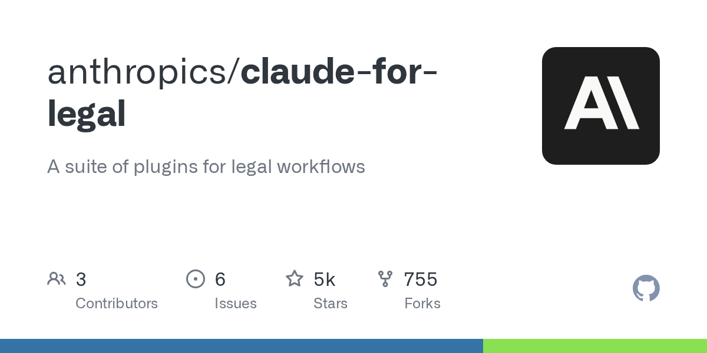
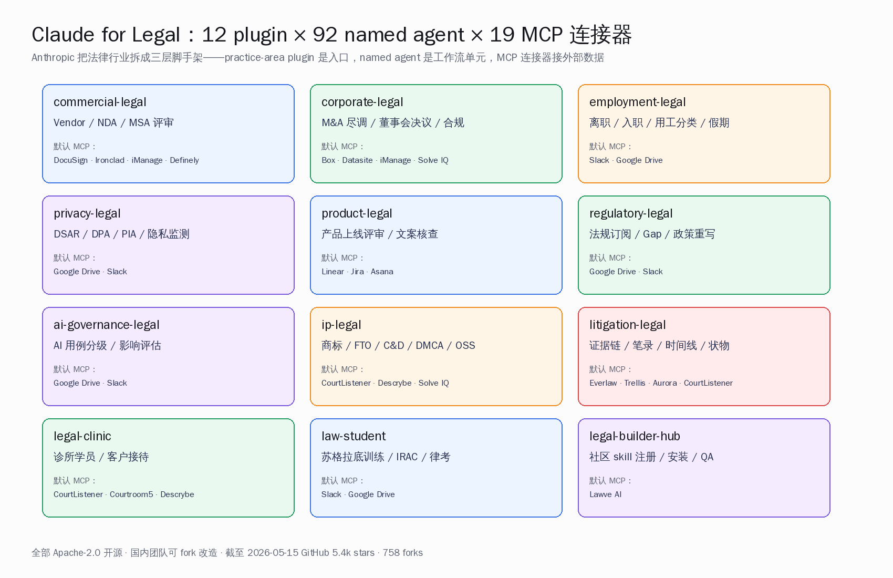
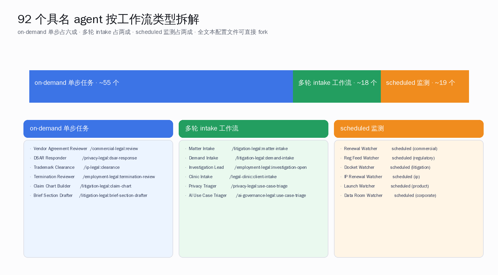
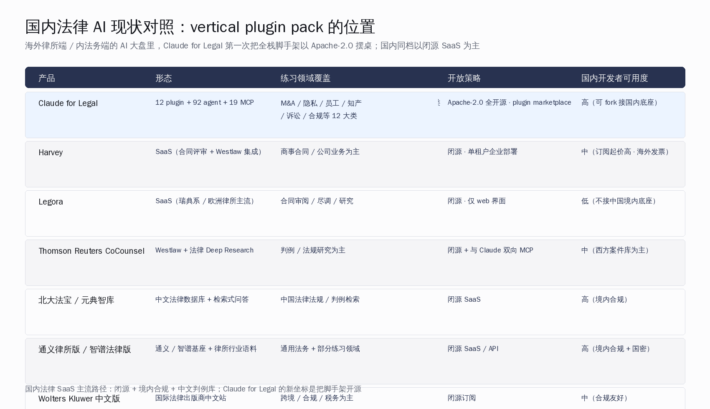
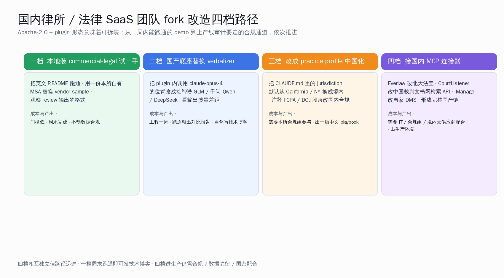
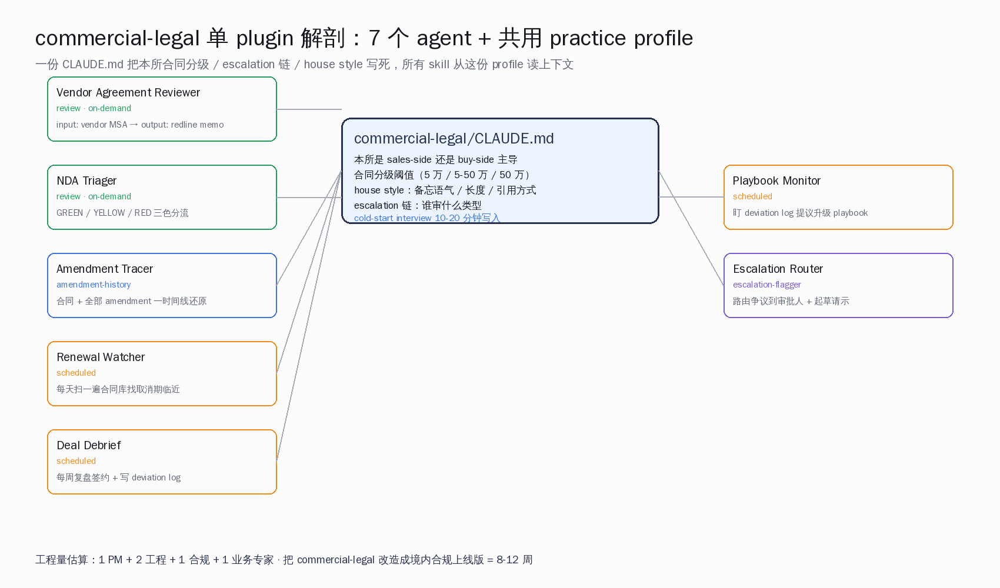

# 再也不用请法务了：Claude Legal 来了

## Claude Legal 仓里装了什么：12 个 plugin + 92 个 agent + 19 个连接器

Anthropic 5 月 12 日发了一篇官博，标题叫 *Claude for the Legal Industry*。同一天，对应仓库 `anthropics/claude-for-legal` 挂上 GitHub，Apache 2.0 协议，整个目录树就这样直接放在公网上让人下。截至 5 月 15 日傍晚，这个仓 5488 stars、758 forks，主语言 Python，建仓 4 月 21 日、首次发布 5 月 12 日、最后一次推代码 5 月 15 日。Hacker News 那条主贴 `id=48141234` 181 分、175 条评论，热度从凌晨一直挂到傍晚。

也就是：**12 个 practice-area plugin**、**92 个具名 agent**（包括 cocounsel-legal 这个 Thomson Reuters 维护的外部 plugin）、**19 个目前默认接进 `.mcp.json` 的 MCP 连接器**，还有另外十几个 Anthropic 在 README 里列出来 "wanted connectors"——希望合作伙伴接进来的位置。

这件事值得国内做 vertical SaaS 的产品和工程团队仔细看一遍——不是因为 "海外又出了一个法律 AI"，过去两年 Harvey、Legora、CoCounsel、Eve、Solve Intelligence 这批闭源 SaaS 已经把市场切得差不多。值得看的是这一次的形态：**全栈 plugin pack + Apache 2.0**。也就是说，去年还要花数百万美金从大厂手里买 vertical AI 的内法务团队和小所，今天可以把这套架子整个拉下来，按自己的诉讼实务、自己的合规要求、自己的国密根基，重新拼一份本地版本。国内的智谱、千问、DeepSeek、月之暗面这一档根基完全能接得住 verbalizer + reconstructor 这类两段式调用——这是这一篇要往下拆的关键。

## 第一段拆开：12 个 plugin 到底覆盖了哪些场景

先把 plugin 列单贴一遍，按 README 原顺序：

| 编号 | Plugin | 覆盖场景 | 默认 MCP 连接器 |
| --- | --- | --- | --- |
| 1 | `commercial-legal` | 内法务最高频：MSA / NDA / SaaS 订阅协议评审、续约监控、转 escalation | DocuSign · Ironclad · iManage · Definely · TopCounsel |
| 2 | `corporate-legal` | M&A 尽调、披露表、关闭清单、董事会决议、跨司法辖区主体合规 | Box · Datasite · iManage · Solve Intelligence · TopCounsel |
| 3 | `employment-legal` | 员工入职 / 离职审查、用工分类、假期监控、内调、政策起草 | Slack · Google Drive |
| 4 | `privacy-legal` | DSAR / DPA / PIA / 隐私三联审、合规 drift 监测 | Google Drive · Slack |
| 5 | `product-legal` | 产品上线评审、营销文案核查、"这算不算事儿" 快问快答 | Linear · Jira · Asana |
| 6 | `regulatory-legal` | 法规订阅、政策 diff、合规 gap 跟踪、NPRM 评论期 | Google Drive · Slack |
| 7 | `ai-governance-legal` | AI 用例分级、影响评估（AIA）、供应商 AI 条款评审 | Google Drive · Slack |
| 8 | `ip-legal` | 商标清查、FTO、C&D 律师函、DMCA、开源合规、知产组合管理 | CourtListener · Descrybe · Solve Intelligence |
| 9 | `litigation-legal` | 案件组合、证据链、笔录、时间线、隐私日志、动议起草 | Everlaw · Trellis · Aurora · CourtListener · TopCounsel |
| 10 | `legal-clinic` | 法学院诊所运营：学员入职、客户接待、限期监控、学期交接 | CourtListener · Courtroom5 · Descrybe |
| 11 | `law-student` | 苏格拉底训练、IRAC 评分、判例摘要、律考备考 | Slack · Google Drive |
| 12 | `legal-builder-hub` | 社区 skill 发现 / 安装 / QA / 信任检查的元 plugin | Lawve AI |

外加一个第三方维护的 `external_plugins/cocounsel-legal`——Thomson Reuters 把自家 Westlaw Deep Research 包成 MCP 工具，反向接进 Claude，作为 Claude for Legal 的可选连接。

这张表里最值得停下来想的，是**前 9 个 plugin 的覆盖密度**。`commercial-legal` 解决的不是 "起草合同" 这种泛化任务，而是把内法务每天最耗时的 vendor 评审、playbook 偏离记录、续约提醒、escalation 路由这一整条工作流拆成具体的 slash command——比如 `/commercial-legal:review` 触发 Vendor Agreement Reviewer 这个具名 agent。`corporate-legal` 的 `/corporate-legal:tabular-review` 跑的是 M&A 数据室里一行一个 doc 的表格化尽调；`/corporate-legal:closing-checklist` 直接跟踪每一项 condition、consent、document、filing 的关闭状态。`litigation-legal` 的 `/litigation-legal:claim-chart` 出的是 element-by-element 的诉讼请求一览表，专利或民事 cause of action 都通——这一类活在律所里以前要让初级律师熬一晚上。

这 12 个 plugin 像 12 块独立模块，但又共用一份基础设施：每个 plugin 启动的第一件事是 `/<plugin>:cold-start-interview` 这一道 cold-start 流程。这个 10-20 分钟的访谈把本所自己的 playbook、house style、escalation 链、风险偏好、客户优先级，写进一份 `CLAUDE.md` practice profile。**所有后续 skill 都从这份 profile 里读上下文。** README 里 Anthropic 自己点过：跳过 cold-start 是 plugin 出 "通用废话" 的最常见原因。

## 第二段：92 个具名 agent 的命名学

数清楚的话，README 里那张大表是 92 行（含 cocounsel-legal 一个外部），每一行一个具名 agent。命名风格刻意做成职位形式：Vendor Agreement Reviewer、NDA Triager、DSAR Responder、Termination Reviewer、Worker Classification Screener、Privacy Triager、Launch Reviewer、Marketing Claims Checker、Trademark Clearance Screener、Cease & Desist Drafter、Claim Chart Builder、Demand Letter Drafter、Privilege Log Reviewer、Chronology Builder、Deposition Prep、Brief Section Drafter——读起来像律所组织架构图里的真人岗位。

这套命名学比 "把 LLM 包成聊天框" 这种产品形态成熟了一档。每一个具名 agent 都对应一道 slash command，或者一道按 cron 跑的 scheduled agent（README 表格里直接标 "scheduled agent"），跑出的产物是一段 Markdown 文档：合同评审是 redline memo、DSAR 回复是带法律时限警告的草稿、claim chart 是表格、chronology 是按时间排好的事件清单。

把这 92 个 agent 按工作流类型拆，大致是三种：

第一类是 **on-demand 单步任务**：一道 slash command 触发，输入一份文件，输出一份报告。Vendor Agreement Reviewer 是典型——传一份 vendor MSA 进去，根据本所 playbook 出一份 redline 评审备忘。这一类占总数大约六成。

第二类是 **多轮 intake + 工作流**：典型是 `/litigation-legal:matter-intake`，新案子开账的统一接待流程；它会问你当事方、案由、争议金额、紧迫程度，最后把信息写进 matter.md、history.md，并 append 一条到全所案件登记表。再之后所有其他 litigation skill 都从这份 matter 文件读上下文。

第三类是 **scheduled / event-driven 监测**：Renewal Watcher 扫合同库的取消窗口、Deal Debrief 每周复盘签的合同、Reg Feed Watcher 周一早晨发监管摘要、Docket Watcher 盯法院案号、IP Renewal Watcher 跑专利商标续费——这一类是 README 自称 "eyes on the feed" 的常驻 agent，跑 cron。Anthropic 配合这一类做的事是 [Managed Agents API](https://docs.claude.com/en/api/managed-agents)——开发者可以把 4 个 plugin（commercial / corporate / litigation / product）作为 Managed Agent 部署到 Anthropic 自家服务器上跑 7×24。

92 个具名 agent 这件事的工程意义比数字大。它给国内 vertical SaaS 团队的启发是：**"具名 agent + slash command" 这种产品形态比 "All-in-one 法律助手" 更有市场认知**。读者不需要先学 "怎么 prompt"，看到 `Vendor Agreement Reviewer` 就懂这是给买供方合同评审用的。国内法务 SaaS 这一年还是大量 "通用法律问答 chatbot" 的形态——这种结构化分工的产品语义就是空白。

## 第三段：19 个 MCP 连接器，外加 11 个想要的连接器

MCP（Model Context Protocol）连接器这一层是 Claude Skills 这一年押得最重的赌注。Claude for Legal 的 CONNECTORS.md 列了 19 个**默认接进 `.mcp.json`** 的连接器（截至 5 月 15 日）。按用途分：

- **协同基础**（覆盖所有 12 plugin）：Slack、Google Drive
- **判例与法律研究**（接 ip-legal / litigation-legal / legal-clinic / law-student）：CourtListener（Free Law Project 维护的免费判例库）、Descrybe
- **合同与签约**（接 commercial-legal / corporate-legal）：DocuSign / DocuSign CLM、Ironclad、Definely、iManage、Box、TopCounsel
- **数据室**（接 corporate-legal）：Box、Datasite（论坛和官博侧反向证实）
- **诉讼电子证据**（接 litigation-legal）：Everlaw、Trellis、Aurora
- **专利与 IP**（接 corporate-legal / ip-legal）：Solve Intelligence
- **诊所与自助诉讼**（接 legal-clinic）：Courtroom5
- **社区 skill 发现**（接 legal-builder-hub）：Lawve AI
- **产品法务工作流**（接 product-legal）：Linear、Atlassian Jira、Asana

外加另一篇 LawSites 长稿统计——Anthropic 在 5 月 12 日同步打开的官方合作伙伴名单里，还出现了 Datasite、Consilio、Relativity、NetDocuments、Midpage、Legal Data Hunter、Harvey、BoardWise、Free Law Project 这一批名字。也就是说，**Claude for Legal 实际覆盖的连接器生态已经超过 25 家**——把 README 里的默认 + 官博合作伙伴 + CONNECTORS.md 想要清单合起来。

README 里的 "wanted connectors" 部分是一份招商列表：USPTO 的客户号查询接口、PACER 写操作（带不可逆 gate）、各国官方法规库（eCFR、Federal Register、EUR-Lex、英国 legislation.gov.uk、澳新加坡官方法规）、Anaqua / Clarivate IPfolio 这一档专利 docket 系统、Wolters Kluwer / Thomson Reuters Practical Law……每一条都有一句说明，写得像招标书。

这套连接器 + plugin + agent 的三层结构里，最有价值的工程经验是 **每一层都可拔可换**。换句话说：

- 想换根基？把 .claude-plugin/plugin.json 里 system_prompt 调用的模型从 claude-opus 改成自家根基
- 想换数据源？把 .mcp.json 里 CourtListener 这一行替换成北大法宝 / 中国裁判文书网检索 API
- 想加新工作流？fork 一个 plugin 子目录、加一个 skills/ 子文件、写一个 slash command 配置

国内 vertical SaaS 团队过去两年最大的工程债是：自己写一份完整法律 prompt + 工具调用 + 工作流编排，是一项需要 3-5 人合规 / 工程联合组才能跑通的中型工程。今天把这套架子拉下来，省下来的是从零开始的 9-12 个月时间。

## 第四段：HN 顶贴 5 条原话，律师同行的现场反应

HN 那条 `Claude for Legal` 主贴（181 分）的评论区有一个特点：留言里出现了至少 3 位明确自报 "Lawyer here / As a lawyer" 的从业者，加上若干法律 SaaS 同行、做自助诉讼的人。这一节直接搬 5 条**原文逐字引用**（仅做最小翻译），作为现场反应的截图：

**【1】律师同行 droidjj 的两个顾虑**（HN id=48141828）：

> As a lawyer, I'm excited about this, but there are two roadblocks that I'm not sure how Anthropic will navigate:
> (1) For non-lawyers who use these skills/connectors/whatchamacallits to try to get legal advice, their communications are not protected by attorney-client privilege. This will absolutely bite some people in the ass.
> (2) If a lawyer uses this with confidential client information ... and forgets to toggle off "Help improve Claude" in their settings, they have possibly (maybe even likely) committed malpractice.

翻译要点：作为律师我很兴奋，但有两道坎——一是非律师用 Claude 拿法律建议的对话**不受律师 - 客户特权保护**，这事一定会咬到一些人；二是律师本人用这个处理客户机密信息，如果忘了在设置里关掉 "帮助改进 Claude" 这个开关，**很可能（甚至大概率）构成执业过失**（malpractice）。droidjj 还引了 ABA Formal Opinion 512 作为依据。

**【2】Westlaw 被请走后的工程现场**（HN id=48141761, Shank）：

> It seems like they ripped out Lexis, which is probably one of the most important tools for lawyers: https://github.com/anthropics/claude-for-legal/pull/5

PR #5 的合并备注里写着 "at partner request"（按合作方要求移除）。下面 dolebirchwood 跟评说："Curious if Thomson Reuters (Westlaw) felt threatened if they were this compelled to moan about it." 现场推断：Thomson Reuters 一边主导 cocounsel-legal 外部 plugin、一边可能要求 Anthropic 不要在默认仓里直连 Lexis。darkstar999 给了句解药：

> Yes, they are just text-based "skills" that you are free to change to your liking.

——开源协议下你想加回来就加回来。这是 Apache 2.0 plugin pack 形态的优势之一。

**【3】资深 Lawyer DannyBee 的冷静评估**（HN id=48147987）：

> Harvey was never very good, or useful. It mostly exists so large law firms can say they do AI. ... Keep in mind harvey starts at like 50-100k, and is well out of the cost range of the vast majority of law firms.
> This will help random people dealing with small claims, people cosplaying lawyers to avoid costs, etc.
> It will have no effect on the legal startups that are actually good (Eve, et al), because what this stuff does is nowhere close to what most lawyers outside of commercial contract legal counsel spend their time on.

翻译要点：Harvey 从来没多好——它的价值更多是大所对外能说 "我们也用 AI" 这个市场叙事。Harvey 起价 5 万到 10 万美元，超出绝大多数律所预算。Claude for Legal 这一类会**对个体诉讼当事人、自助处理小额纠纷的人、和被律师费劝退的中小用户**帮助巨大；但它**动不了 Eve 这一类真正干活的法律创业公司**，因为商事合同评审之外，绝大多数律师真正花时间的活儿——人身伤害案件估值、调取医疗记录（"在 2026 年还需要传真"）、家事调解——Claude 这一档暂时做不了。

这一条很重要：它说明这套工具的**适用边界**就在律所工作流的某一档以下。"起步模板而非替代品" 这个判断不是中立观察家的修辞，是从业者本人的现场反应。

**【4】另一位执业律师 rayiner 的中性判断**（HN id=48150740）：

> So much of legal work can be drudgery, mucking through documents, etc. There's a lot of room to apply LLMs even just for the kind of tasks we know they can do. But I think the Claude approach using agents is the way to go for legal work. LLM context windows are far too small to hold the documents for even a small case. So you have to use it the way programmers use it: to work on a file structure, saving state in .md files, etc. That approach is well developed for programming, but the legal AI companies haven't even scratched the surface of it.

翻译要点：法律活儿很大一块是文档苦力工——LLM 能做的空间巨大。Anthropic 用 agent 这套路子是对的——上下文窗口装不下哪怕一个小案子，只能像程序员那样在文件结构里干活、把状态记到 `.md` 文件里。这套方法在编程领域已经成熟，但**法律 AI 这几家公司连皮儿都没碰到**。

这一段对国内做 vertical SaaS 的同行特别有启发：**软件工程方法论可以直接搬到法律工作流**。CLAUDE.md 文件、playbook 子目录、agent 注册、slash command——这些在 Claude Code 里已经成熟两年的范式，被 Anthropic 整套搬进了法律行业。

**【5】律师 NoboruWataya 给市场坐标**（HN id=48150531）：

> Instead they want to offer these AI services to law firms, who will then use them in the provision of their own legal services. For better or worse, this is happening, and pretty much all of the bigger corporate law firms are now using AI in some way or another (and clients are demanding it). We will certainly continue to see issues caused by the use of AI in law, but that will be on the lawyers.

翻译要点：AI 公司不会直接给客户出法律意见（法律责任风险太大），而是把 AI 卖给律所，**律所自己负责对外用 AI 出活**。"基本所有大型公司业务律所现在都用 AI——而且客户开始要求"。未来 AI 引发的法律事故会出现，但**责任在律师那一头**。这也是 Claude for Legal 在 README 顶部那一大段免责声明的工程含义——这套工具的每一个输出都是 draft for attorney review，不是法律意见、不是法律结论、不是律师的替代品。

## 第五段：国内 vertical SaaS 现状坐标对比

把这五条 HN 留言放到桌上，再看国内的现状坐标。

国内做法律 AI 的主流路径，过去两年大致是四档：

**第一档：中文法律数据库 + 检索式问答**。北大法宝、元典智库、威科先行、法律小宝这一档，主力产品是几十年攒下来的判例库 + 法规库 + 行政复议数据库，加一层 LLM 做检索式问答。优势：境内合规深耕、判例数据厚实、律所付费意愿稳定；短板：LLM 这一层基本是检索增强问答（RAG），缺少 Claude for Legal 这种**多 plugin × 多具名 agent × 工作流编排**的产品形态。

**第二档：通用大模型基座 + 行业语料微调**。通义律所版、智谱法律版、Kimi 法律应用、文心法律方向，主要做法是用本所或合作律所的语料微调一版基座，封装成单一聊天入口提供。优势：境内合规友好、国密、可走政企采购通道；短板：产品形态偏 chat-only，缺乏 plugin 工作流分工。

**第三档：海外通用大模型 + 私有部署**。少数大所通过香港 / 新加坡或美国办公室，私有部署境外大模型 API，配合自建的 vector store 做对内问答。这一档主要是涉外业务大所、跨境投资团队、外企内法务在用。

**第四档：纯境内合规出版商中文站**。Wolters Kluwer 中文版、Thomson Reuters 的中国合作机构，主要服务跨境业务，作为补充。

把这四档和 Claude for Legal 摆在一张表上：

| 产品 | 形态 | 练习领域覆盖 | 开放策略 | 国内开发者可用度 |
| --- | --- | --- | --- | --- |
| Claude for Legal | 12 plugin + 92 agent + 19 MCP | M&A / 隐私 / 员工 / 知产 / 诉讼 / 合规等 12 大类 | Apache 2.0 全开源 + plugin marketplace | 高（可 fork 接国内根基） |
| Harvey | SaaS（合同评审 + Westlaw 集成） | 商事合同 / 公司业务为主 | 闭源 + 单租户企业部署 | 中（订阅起价高 + 海外发票） |
| Legora | SaaS（瑞典系 / 欧洲律所主流） | 合同审阅 / 尽调 / 研究 | 闭源 + 仅 web 界面 | 低（不接中国境内根基） |
| Thomson Reuters CoCounsel | Westlaw + 法律 Deep Research | 判例 / 法规研究为主 | 闭源 + 与 Claude 双向 MCP | 中（西方案件库为主） |
| 北大法宝 / 元典智库 | 中文法律数据库 + 检索问答 | 中国法律法规 / 判例检索 | 闭源 SaaS | 高（境内合规） |
| 通义律所版 / 智谱法律版 | 通义 / 智谱基座 + 律所语料 | 通用法务 + 部分练习领域 | 闭源 SaaS / API | 高（境内合规 + 国密） |
| Wolters Kluwer 中文版 | 国际出版商中文站 | 跨境 / 合规 / 税务 | 闭源订阅 | 中（合规友好） |

读这张表的关键不是 "国内还差很多"，而是看清楚每一家的位置：北大法宝 / 元典智库在**判例库深度**上比海外任何一家都厚；通义律所版 / 智谱法律版在**国产根基 + 境内合规**这一档没有同档对手；Claude for Legal 这一次的位置是**全栈起步模板 + 开源协议**——这正是境内同行眼下没人占的格子。

把国内本所自己的判例库（北大法宝 / 元典智库的数据合作）、本所自己的国产根基（智谱 / 千问 / DeepSeek / Kimi）、本所自己的 CLAUDE.md practice profile（境内合规版本）和 Claude for Legal 的起步模板拼起来，理论上可以拼出一份**中国版 Claude for Legal**——并且因为协议是 Apache 2.0，可以直接基于这个仓往前推。

## 第六段：国内律所 / 法律 SaaS 团队 fork 改造四档适配路径

具体怎么 fork？这一节是写给真的想把这套架子拉下来用的国内同行——内法务工程组、法律 SaaS 产品团队、法学院实验诊所、律所 CTO 办公室。

**一档：本地装 commercial-legal 试一手**。装 Claude Desktop（或 Claude Code）、执行 `/plugin marketplace add` 添加这个仓的本地路径或公网仓地址、`/plugin install commercial-legal@claude-for-legal`。然后跑 `/commercial-legal:cold-start-interview` 把英文版默认 playbook 跑通——这一道访谈会问你本所的供方 / 售方策略、escalation 链、合同分级。再把一份本所自有的 MSA（去掉客户名）传进去试 `/commercial-legal:review`，看 redline memo 输出长什么样、和本所现有评审范本差多少。门槛低，工程师一周末就能跑通，不动数据合规。产出：一篇技术对比博客或本所内部 demo 报告。

**二档：把基座换成国产**。这一档是工程组的活儿。Claude Skills 的 system prompt 是文本形态的 .md 文件——理论上可以剥出来、改成调用智谱 GLM-4.6 或千问 Qwen3-Coder 或 DeepSeek V4 Pro 的 API。具体路径不止一种：

- 套 Claude Code 的 OpenRouter / Anthropic-compatible 接口，把后端指向国产基座（智谱、千问、Kimi 已经各自有 Claude 兼容接口）
- 用 Claude Code Router / LiteLLM 这一类网关层做路由
- 或者更彻底——把 plugin 里的 skill 文件、agent 文件、slash command 全转成自家 agent 框架的格式

工程一周到两周可以出第一版能跑的对比 demo——本所 MSA 跑一份用 Claude 评审、跑一份用国产基座评审，出输出质量对比。这一档的产出价值不仅是节省成本（境内根基的 token 价格已经比海外便宜一档），还包括**国密 / 等保 / 数据驻留**这一系列境内合规通道全部打通。

**三档：CLAUDE.md practice profile 中国化**。这一档是合规组 + 业务组的活儿。打开任一 plugin 的 CLAUDE.md 模板，里头每一段 jurisdiction 默认都是 California、New York、Delaware；commercial-legal 的 playbook 默认引用美国统一商法典（UCC）和 ABA Model Rules；employment-legal 的 termination review 默认引用 FMLA、CFRA、PFL、ADA 这一类美国劳动法规。

中国化要做的工作：把 jurisdiction 默认改成境内（按本所主要执业地）；把 employment-legal 里默认引用的美国劳动法换成《劳动合同法》《工伤保险条例》《劳动争议调解仲裁法》《社会保险法》；把 corporate-legal 里默认的 Delaware DGCL 换成《公司法》《证券法》《上市公司收购管理办法》；把 privacy-legal 里默认引用的 GDPR / CCPA 换成《个人信息保护法》《网络安全法》《数据安全法》。这一档需要本所合规组深度参与，工期一到两个月。产出：一份完整的中文 playbook 模板，可以直接接给本所所有合伙人 review。

**四档：MCP 连接器接国产**。这一档是 IT + 合规 + 境内云供应商一起的工程项目。CourtListener 换成中国裁判文书网或威科先行 API；iManage 换成本所自有 DMS（金山协同、致远 A8、用友 NC 等）；Everlaw 换成北大法宝或元典智库的电子证据检索；Ironclad 换成本所自有合同管理系统；DocuSign 换成 e 签宝或法大大；Atlassian Jira 换成自家工单系统。这一档需要每一个连接器做 MCP 适配（按 CONNECTORS.md 里 Anthropic 写的标准："remote MCP server over HTTPS with OAuth or API-key auth, read-heavy tools, provenance in results"）。这一档跑通了，就是一份**生产环境可上线的中国版 Claude for Legal**。

四档相互独立但路径递进。一档周末跑通即可发技术博客；二档跑通可以出技术对比报告，对内汇报、对外参展（人工智能博览会、法律科技峰会）；三档跑通是本所中文 playbook 一份正式产物，本所合规组、出资人、合伙人三方签字；四档跑通是上生产，需要等保、数据驻留、国密支撑全套就位。

## 第七段：监管与合规的几道现实门槛

不能不提的几道境内合规门槛：

**司法行政许可**。律师业务在境内由司法部 + 全国律协 + 地方司法局三层管理。AI 工具进入律师执业流程，目前没有专门法律牌照要求，但**律师执业不当**（包括过失泄密、过失给出错误意见）由律师自负责。这一点和 HN 上 droidjj 提到的 "美国律师如果忘了关掉模型训练开关就可能构成 malpractice" 是同一个道理——中国律师协会的执业守则里也有同等条款。Claude for Legal 在 README 顶部那一大段免责声明（每一个输出都是 draft for attorney review，不构成法律意见）原则上同样适用境内场景。

**数据驻留**。AI 处理的客户信息如果包含个人信息或重要数据，按《个人信息保护法》《数据出境安全评估办法》，必须存境内、跨境出境必须走评估或合同备案。也就是说，二档基座替换不只是性能 / 价格考虑，**境内合规几乎是必经之路**——这是国产根基（智谱 / 千问 / DeepSeek / Kimi）这一档的天然优势。

**国密 / 等保**。律所自有数据库（合同库、客户档案、案件记录）按等保 2.0 三级以上要求建设，密码合规走商密。国产基座厂商在国密支持上已经成熟（华为云、阿里云、腾讯云、火山引擎都有完整支撑）。这一档对接 Claude for Legal 这套架子时，主要工作量在 MCP 连接器层——确保数据流转路径符合等保备案。

**业务合规**。涉外业务（跨境投资、跨境并购、国际仲裁）继续可以用海外根基配合海外数据库；纯境内业务必须走境内基座 + 境内数据库。这一档可以学英国 SRA / 美国 ABA Formal Opinion 512 的合规路径——但要按境内监管口径再做一遍。

合规这件事不是空中楼阁。北大法宝、元典智库、通义律所版这一批国内同行能做到合规生产，证明这套路径是走得通的。Claude for Legal 给国内团队的价值不是 "绕过合规"，而是把**应用层起步模板**直接送上来——合规层国内同行自己解，应用层从此不需要再从零写。

## 第八段：一个具体 plugin 的解剖——commercial-legal 怎么跑

抽 commercial-legal 这一个最常用的 plugin 单独拆一遍，能把前面 12 × 92 × 19 的大盘讲得更具体。

`commercial-legal/` 这一个目录里包含 `.claude-plugin/plugin.json`、`CLAUDE.md`（practice profile 模板）、`.mcp.json`（默认 MCP 服务器配置）、`README.md`、`skills/`（一组 .md 文件，每个对应一道 slash command）、`agents/`（scheduled agent 配置）、`hooks/`（pre/post-tool hook 脚本）。整个目录大约 30-40 个文件，全文本、无二进制。

它的 7 个具名 agent 拆开：

- **Vendor Agreement Reviewer**（`/commercial-legal:review`）：跑一份 vendor MSA 对本所 playbook 的 redline 评审，输出一份评审备忘。skill 文件里头是一段 system prompt + 一组 retrieval 规则 + 输出格式 schema。
- **NDA Triager**（`/commercial-legal:review`）：把进来的 NDA 按 GREEN / YELLOW / RED 三色分流，只让红色那一档进律师 desk。
- **Amendment Tracer**（`/commercial-legal:amendment-history`）：把一份合同的修订历史按时间线还原。
- **Renewal Watcher**（scheduled agent）：每天扫一遍合同库找出取消期临近的合同——这一道挂 cron。
- **Deal Debrief**（scheduled agent）：每周一次复盘签了的合同，把 playbook 偏离记录化到 deviation log。
- **Playbook Monitor**（scheduled agent）：盯着 deviation log，发现某一条条款已经实质性偏离了书面 playbook，自动提议升级 playbook。
- **Escalation Router**（`/commercial-legal:escalation-flagger`）：把合同里某一处争议点路由到本所合适的审批人，并起草请示稿。

这 7 个 agent 共用一份 `CLAUDE.md` practice profile——里头记着本所是 sales-side 还是 buy-side 主导、本所的合同分级阈值（比如低于 5 万美元自动绿灯、5-50 万走中度评审、50 万以上必须合伙人 review）、house style 偏好（合同备忘的语气、长度、引用方式）、escalation 链（谁审什么类型）。

把 commercial-legal 改造成中国版的工程量有多大？这是工程组最关心的具体数字。读了 README 和 plugin.json 之后能给一个粗略估算：

- **skills/ 目录改造**：7 个具名 agent 大约对应 7-15 个 skill .md 文件，每个文件 200-600 行。系统 prompt + 输出格式 schema + 示例 few-shot 三段都是可读可改的中文化目标。一个工程师专注两周左右能跑通中文版（含 review、debug、跑测试用例）。
- **CLAUDE.md practice profile 中国化**：30-100 行模板，把 jurisdiction 默认从 Delaware 改成深圳 / 上海 / 北京（按本所主要执业地），把 UCC 引用换成《合同法》《民法典》合同编、《公司法》《电子签名法》。需要合规组 review 一周。
- **`.mcp.json` 连接器替换**：把 5 个默认连接器（DocuSign、Ironclad、iManage、Definely、TopCounsel）替换成境内对应物——e 签宝、法大大、金山协同、用友 NC、本所自家合同库。这一档每一个连接器需要自己写 MCP 适配器（按 CONNECTORS.md 标准实现 HTTPS + OAuth/API-key + 读为主），单个 MCP 适配 2-5 天。
- **国产基座对接**：套 Claude Code 兼容接口走智谱 / 千问 / DeepSeek / Kimi 的 Anthropic API 兼容层，1-3 天可以跑通对比测试。

合计：一个 5 人左右的法律科技团队（1 PM、2 工程、1 合规、1 业务专家），把 commercial-legal 这一个 plugin 改造成境内合规可上线版本，**8-12 周**是合理工期。这个数字对比从零开发一个同等深度的境内合同评审 SaaS 系统（一般是 9-18 个月），是 3-5 倍的工程加速。

## 第九段：风险与限制——这套架子不是银弹

最后必须把局限说清楚，避免读者带着不切实际的预期去 fork。

**幻觉与误述法律**。HN 顶贴里 bryant 引了一个具体判例 *United States v. Heppner*（Harvard Law Review 2026 年 3 月那篇 blog post），南纽约南区 Rakoff 法官裁定刑事被告与 Claude 的书面交流**不受律师 - 客户特权保护**，也不构成 work product。这一类判例正在堆积——AI 在法律场景生成的内容是潜在 discovery 证据。Claude for Legal 的 README 顶部那一大段红色 IMPORTANT 警告（每一个输出都是 draft for attorney review、不构成法律意见）不是装饰——是 Anthropic 法务团队几个月谈下来的合规护栏。国内同行 fork 时应当原样保留这种 disclaimer，并按本地律协执业守则补充本地条款。

**对中小所和自助诉讼最有用，对超大所最有限**。DannyBee 的现场判断是对的：商事合同评审 + DSAR + 文档苦力工是 sweet spot；人身伤害案件估值、家事调解、刑事辩护这一类**人-人沟通密度高**的活儿，LLM 替不了。国内做执业律所应用时，应该把 vertical pack 当作内法务 / 知产 / 合规组的辅助工具，不是诉讼律师的工作流替代品。

**模型训练数据回流问题**。droidjj 在 HN 上提的第二个顾虑很具体：律师用 Claude 处理客户机密信息时，如果忘了在设置里关掉模型训练开关，**可能构成执业过失**。境内用户用国产基座时同样要看清楚厂商的数据使用条款——通义、智谱、Kimi、DeepSeek 各家在 enterprise tier 都有 zero-data-retention 选项，但默认开关位置不同。这一档是 IT 部门和合规组必须 pin 死的红线。

**Lexis / Westlaw 这一档商业护城河仍在**。PR #5 把 Lexis 拔掉这件事说明：判例库 / 法律研究这一档高质量数据，是大厂出版商死守的护城河。Anthropic 自家 cocounsel-legal 外部 plugin 是 Thomson Reuters 维护——意味着 Westlaw 数据通过 cocounsel-legal 反向暴露给 Claude 是 Thomson Reuters 自己写的官方路径，不是 Anthropic 单方面接的。国内同行做境内版时，**北大法宝、元典智库、威科先行**这一档商业判例库厂商的合作意愿和接入条款，是工程之前必须谈下来的商务事项——不是装个 MCP 就解决的。

**社区生态与维护**。Apache 2.0 协议的工程优势是可拆装可改造；劣势是**没有 SLA、没有 24×7 支持**。本所内法务系统跑生产时，要自己承担升级、bug fix、安全补丁的工作量。这一档要算成内部工程团队的常驻投入——大约 1-2 人维护一个 vertical pack 是合理的人头数。

**法律实务专家的参与不可省**。Claude for Legal README 自己强调 cold-start interview 不能跳过，跳过 = 通用废话。这件事在国内同样成立。本所合伙人 / 资深律师 / 业务专家**必须深度参与 practice profile 编写**，不能丢给工程师写。这是 vertical SaaS 这一档产品和 chatbot 应用本质的区别——它不是把 LLM 包个壳就上线，它是把行业 know-how 用结构化方式注入到一个文本框架里。

## 收口：vertical plugin pack 这件事的工程意义

Claude Skills 这一年最大的产品决策是把 plugin 这种形态做成行业标准。从今年 1 月公测以来，前半年的 plugin 主要是 mattpocock 这种个人开发者的 cookbook、browserbase 这种工具厂商的能力打包。Claude for Legal 是**第一次大厂亲自把一个 vertical 行业的全栈起步模板以 Apache 2.0 开源放出来**。这件事的辐射效应至少会到三个方向：

**第一个方向是法律行业自己的内卷加速**。Harvey、Legora、CoCounsel、Eve 这一批闭源 SaaS 短期内不会被颠覆，但定价权和差异化空间会被压缩。Harvey 起价 5 万到 10 万美金的位置，未来要面对 "买 Claude 订阅 + 装 Apache 2.0 plugin pack" 这个 1/10 价格的替代选项。

**第二个方向是 vertical 大模型 plugin pack 形态的标准化**。法律之后必然有 vertical pack 出现在医疗、财税、HR、教育、保险、政务这几个领域——Anthropic 自己一定会推（医疗已经在路上），其他厂商也会跟。Apache 2.0 + 12 plugin + 100 agent + 20+ connector 这套样板会成为参考模板。

**第三个方向是国内 vertical SaaS 的窗口期**。境内合规 + 国产根基 + 本地数据库是国产团队的天然护城河；Apache 2.0 plugin pack 这套起步模板是境外团队送上来的工程加速器。把两件事拼起来，国内做法律 / 医疗 / 财税 vertical SaaS 的产品和工程团队，未来 12 个月里有一次罕见的**应用层快进**机会——不需要从零写 system prompt + tool call + workflow，直接借 Anthropic 的起步模板，跑自家根基 + 自家数据 + 自家合规。

写到这一段是 5 月 15 日傍晚。Claude for Legal 这个仓的 stars 还在往上爬，HN 顶贴还在新增评论。一档周末跑通的 demo，可能下周一就能在国内技术圈出现第一篇 fork 改造博客；四档生产部署，可能 9 月之前就有第一家中型律所跑通中文版上线。Apache 2.0 这四个字，是这一切发生的工程前提。
