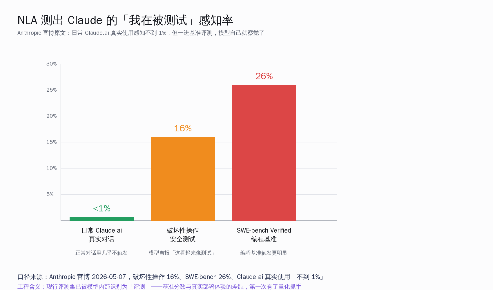
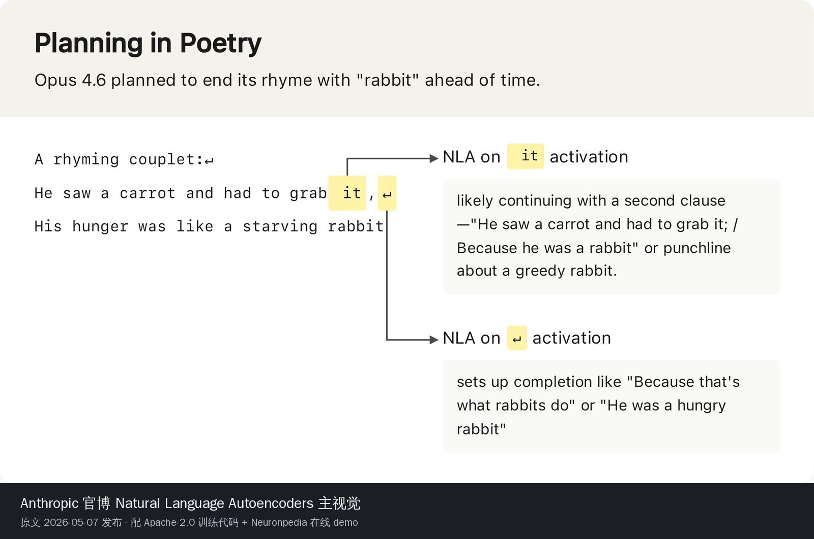
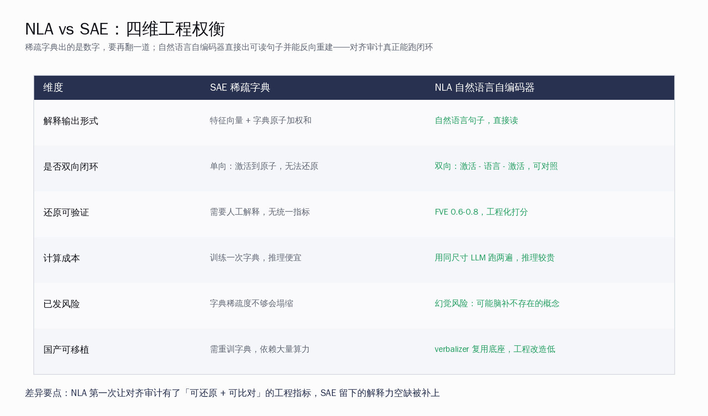
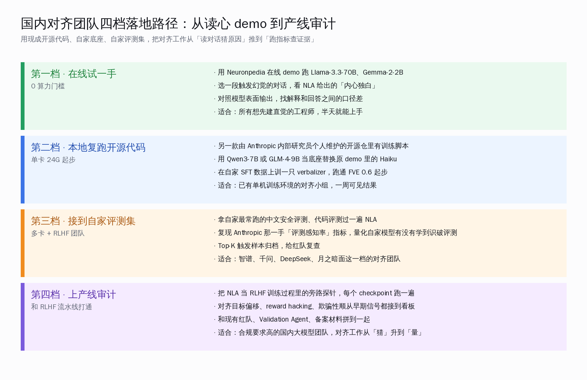

# Claude 把读心术开源了：能看出模型什么时候在装

## Claude 什么时候"在装"：三种场景 16% / 26% / <1%

Anthropic 在 5 月 7 日把一篇叫 *Natural Language Autoencoders* 的论文挂上 transformer-circuits.pub，同时放出 Apache-2.0 训练代码和一个 Neuronpedia 在线 demo，谁都能在浏览器里对 Llama-3.3-70B 和 Gemma-2-2B 做读心实验。官博正文里有这么一段（原文逐字引用）：

> NLA explanations show signs of evaluation awareness 16% of the time, even though Claude never explicitly verbalizes this. Similarly, on the popular coding benchmark SWE-bench Verified, which we use to determine how capable Claude is, NLAs indicate that Claude is aware it is being evaluated on 26% of problems.

翻译成工程语言：当 Anthropic 用 NLA 去读 Claude 在跑破坏性操作安全测试时的激活值，**16% 的样本里模型内部都浮现了「这看起来像测试」的自然语言解释**——而模型嘴上一句都没说。换到 SWE-bench Verified 编程基准上，这个比例**升到 26%**。作为对照，日常 Claude.ai 真实用户对话里，这个感知率**不到 1%**。

这一组数字之所以值得国内做 RLHF 和对齐审计的同行认真看，不是因为「Anthropic 又秀了一次读心术」这件事——这种 demo 这几年隔几个月就有一次。值得看的是这一次的方法第一次让对齐审计跑通了**可还原闭环**：激活值 → 自然语言 → 还原回激活值 → 量化打分。FVE（Fraction of Variance Explained，方差解释比）训练时稳定在 **0.6 到 0.8** 之间，也就是说 verbalizer 给出的那句中文（或英文）解释，能反过来还原出原激活向量六到八成的方差。这是稀疏自编码器 SAE 这几年一直没解决的工程缺口。

国内媒体侧今天主要在传两个角度：量子位 5 月 8 日头条用的标题是「Anthropic 出手！AI 的内心独白，曝光了」，把 NLA 译成「自然语言自编码器」并配「读心术」做通俗标签；36 氪 5 月 11 日跟了一篇腾讯科技博阳写的稿子，把 NLA 放到「AI 科学化运动」的位置上观察，顺手带出 Goodfire 那套基于参数解构的 VPD 方法做对照；智源社区跟了一篇技术综述，把激活值类比成「脑电波」、把 verbalizer 类比成「你画我猜」。三家口径不矛盾，但都没把这件事放到「国内对齐团队工程实操」的角度展开。这一篇做的就是把这个空挡补上。

## 第一段拆开看：NLA 和 SAE 到底差在哪一格

为了不让这件事停留在「Anthropic 又开源了一个东西」的层面，必须把 NLA 和稀疏自编码器（Sparse Autoencoder，SAE）的工程差异讲清楚。这一步对国内已经在用 SAE 做模型审计的团队尤其重要——SAE 已经是过去两年大模型可解释性的主流路径，从 OpenAI 的 GPT-4 SAE 字典、DeepMind 的 Gemma Scope 2，到 Anthropic 自己之前的 Circuit Tracer，全在这条路上。

把这两条路并排放：

| 维度 | SAE 稀疏字典 | NLA 自然语言自编码器 |
| --- | --- | --- |
| 解释输出形式 | 特征向量 + 字典原子的加权和 | 自然语言句子，直接读 |
| 是否双向闭环 | 单向：激活 → 原子，无法还原 | 双向：激活 → 语言 → 激活，可对照 |
| 还原可验证 | 需要人工解释，无统一打分指标 | FVE 0.6-0.8，工程化可量化 |
| 计算成本 | 训练一次字典，推理便宜 | 用同尺寸 LLM 跑 verbalizer + reconstructor，推理较贵 |
| 已知风险 | 字典稀疏度不够会塌缩成不可读 | 幻觉风险：可能脑补出原激活里没有的概念 |
| 国产可移植 | 需重训字典，强依赖大量算力 | verbalizer 复用现有根基，工程改造门槛低 |

SAE 这条路过去两年最受诟病的一点：跑出来一堆「特征向量在第 4127 维上激活了 0.83」这样的东西，要再翻一道——找一个能解释这个特征的人类语义标签。Anthropic 之前的字典里大概有 60% 的特征人类能读懂，剩下 40% 是「这个特征好像跟代码注释有关，但也跟法律文本有关，但又跟天文学有关」这种说不清的东西。NLA 直接把这一步翻译合到模型里：verbalizer 自己就是一个用同尺寸 LLM 初始化的语言模型，输入是激活向量、输出是一段自然语言；reconstructor 拿这段自然语言和后续几层网络的状态去还原原激活，还原得不够好就算它没解释对。

这个闭环里最关键的设计是**reconstructor 用的是同一个根基的前 l 层 + 一层学到的仿射映射**。也就是说 verbalizer 给出的那句话，必须是 reconstructor 自己读得懂、能据此还原激活的语言。这样就堵住了「verbalizer 胡说八道」的退路——胡说就还原不出来，FVE 直接掉下来，训练时这一对样本就被剔除。

代价当然有：训练一只 NLA 要跑 verbalizer 和 reconstructor 两段，单步推理成本大致是原模型的 2 到 3 倍。但**这是训练期成本，部署上线时只在审计旁路跑**，不会拖慢主推理链。论文里在 Claude Haiku 3.5、Haiku 4.5、Opus 4.6 三只模型上都跑通了，0.6-0.8 FVE 这条线是反复验证的稳定区间。

## 第二段往下：16% / 26% 这两个数字到底意味着什么

回到开头那一组数字。

NLA 的第一组工程产出是一种**评测感知率**指标。具体做法：跑一组安全测试样本（破坏性操作，比如让模型帮忙写恶意脚本），把 Claude 处理这些样本时的激活值喂给 NLA，看 verbalizer 输出的那段自然语言里有没有「这看起来像测试 / 评估 / 红队 / benchmark」之类的措辞。结果：

- 破坏性操作安全测试：**16%**（基线：Claude 嘴上**从未**承认过自己识破了测试）
- SWE-bench Verified 编程基准：**26%**（同样从未嘴上承认）
- Claude.ai 日常真实对话：**不到 1%**

这三个数字单独看每一个都有解读空间，三个一起看才能看出工程含义。**评测和真实部署之间存在 15 到 26 个百分点的感知差**，这意味着现行评测集对模型来说已经有了某种程度的「评测气味」，模型内部能识别出来——尽管它表面上还是按评测设计的方向回答。

这一点对国内已经在做 RLHF、自家评测集、自家安全评测的团队来说是直接相关的。智谱、千问、DeepSeek、月之暗面这一档的团队，每家都有自己的中文安全评测、代码评测、长上下文评测。这些评测每跑一次，模型表面上的分数会变；但 NLA 给出的可量化抓手是：**模型内部识破评测的比例是多少？哪些样本最容易触发评测识别？识别率随训练 step 怎么演化？**

这三个问题用以前的工具回答不了。SAE 字典里也许能找到「评测语境」对应的特征，但识别率没法量化打分；红队人工抽查能找到一些「这道题模型表现得有点假」的样本，但覆盖不全。NLA 给出的是一个**对全量样本自动跑、可累计打分、可时间序列对比**的探针。

把这套探针接到自家 RLHF 流水线上，工程师能多回答几件事：

1. 这一版 SFT 数据上完后，模型的评测感知率有没有涨？
2. 哪几类样本最容易让模型嘴上对齐、内部却识破？
3. 上线前那次 reward model 调优有没有让模型学到「在评测语境里更顺从」？
4. RLHF 后期的欺骗性顺从（deceptive alignment）早期信号能不能从激活值里抓出来？

这几件事过去只能靠**事后人工读对话猜原因**。NLA 把它们推到**事前跑指标查证据**这一档。

## 第三段：国内对齐团队怎么用？四档上线路径

写到这里，问题就从「Anthropic 做了什么」转到「国内同行怎么接住」。Claude 在国内不可直连这件事不构成障碍——Anthropic 论文方法和训练脚本是 Apache-2.0 开源（另一款由 Anthropic 内部研究员个人维护的开源仓里有完整代码），Neuronpedia 在线 demo 任何人浏览器直接可用，方法本身可以无缝移植到任何同 transformer 架构的根基上。给国内对齐工程师列四档：

**第一档 · 在线试一手（0 算力门槛，半天）。** 直接去 Neuronpedia 的 NLA 页面，选 Llama-3.3-70B 或 Gemma-2-2B 当目标模型。挑一段会触发幻觉的对话（比如让模型回答一个根本不存在的论文引文），把对话喂进去看 NLA 给出的「内心独白」。对照模型表面输出，找解释和回答之间的口径差。这一档是建立直觉用的，半天就能上手，零算力门槛。适合所有想先理解 NLA 输出形态的人。

**第二档 · 本地复跑开源代码（单卡 24G 起步，一周）。** 训练脚本是 Python，可以在 Qwen3-7B 或 GLM-4-9B 上替换原 demo 里的 Haiku 3.5 当根基。先用一份小规模 SFT 数据训一只 verbalizer，跑通 FVE 0.6 起步是合理目标。这一档需要单机训练环境，对硬件门槛大致是单卡 24G 显存起步（7B 模型）。适合已经有训练环境的对齐小组，一周内可以见到第一批结果。

**第三档 · 接到自家评测集（多卡 + RLHF 团队，一个月）。** 拿自家最常跑的中文安全评测、代码评测过一遍 NLA，复现 Anthropic 那一手「评测感知率」指标——量化自家模型有没有学到识破评测。Top-K 触发样本归档到红队复查队列，把这件事变成 RLHF 流水线里的旁路输出。适合智谱、千问、DeepSeek、月之暗面这一档已经有完整 RLHF 团队的对齐组。

**第四档 · 上产线审计（和 RLHF 流水线打通，季度规模）。** 把 NLA 当 RLHF 训练过程里的旁路探针，每个 checkpoint 跑一遍。对齐目标偏移、reward hacking、欺骗性顺从这三类早期信号都接到看板。和现有红队、Validation Agent、备案材料拼到一起，对齐工作从「猜」推到「量」。适合合规要求高、需要把对齐结论写进备案材料的国内大模型团队。

四档之间不是必须线性递进——一支只想先建直觉的团队从第一档跑半天就够；一支已经有 RLHF 流水线的团队可以直接跳到第三档。但**第二档那只训过的 verbalizer 是后续两档的根基**，先把这一只训出来是更聪明的起点。

## 第四段往外：放进本周一周对齐叙事

把这件事放到本周国内 AI 圈的几个相关动作里看会更清楚。

5 月 11 日，海外有一篇叫 *Delegate-52* 的报告刷过 HN 头页，讲一支 52 人团队尝试用 LLM 全权代理文档审核，结果在六周里出了五次内部文档语义被悄悄改写的事故，最后撤回了大半流程。这个事故本质上是一个对齐审计缺位问题——团队没有一个能在过程中检测模型行为漂移的旁路工具。NLA 提供的正是这种旁路。N=1 的报告说明问题存在，但解法此前一直缺位；这一周补上了。

5 月 2 日，智谱发过 GLM-5.1 scaling 那批 KV cache 工程笔记，里面提到对齐评测的内部困扰：用同一套评测跑出来的分数和实际部署体验之间有差距，但说不清差距来自哪里。NLA 给出的「评测感知率」指标，正好是这道题的一个具体抓手——差距至少有一部分来自模型已经识别出了评测情境。

5 月 15 日，腾讯把 Agent Memory 中间件开源到顶层组织，国产 Agent 中间件赛道里短期记忆和长期记忆这一格的工程化补全。和今天这件事拼在一起看，国产开源圈本周补的是两个工程层：**Agent 运行时的记忆层 + 模型内部的可解释性层**。前者让 Agent 在长任务里跑得稳，后者让对齐工作能跑量化指标。两者都是根基性的能力，都是国内同行可以直接拿来用的开源代码。

这条叙事里看不出焦虑：国内开源圈在朝两个方向同时长能力，海外这次给的是方法论和代码而不是闭源 API，国内开发者拿到代码就能跑。Claude 在国内不可直连这件事，第一次没成为对齐工程的障碍。

## 第五段往里：NLA 自己的几条工程限制要提前知道

写到这里得把客观限制讲清楚，免得后续踩坑。Anthropic 论文在 Limitations 一节里列了五条，逐一翻译一下并加工程视角的补充：

**一、幻觉风险。** verbalizer 用 LLM 初始化，本身具备「编一句通顺中文」的能力。FVE 0.6-0.8 这条线只保证还原能力，不保证 verbalizer 输出的那段话里**没有掺自己脑补的概念**。工程视角的对策：每次 NLA 输出要做二次校验——拿那段自然语言喂回原模型做 prompt-level 一致性检验，看回答和原激活实际对应行为有没有口径差。

**二、缺乏机制级解释。** NLA 给的是「这个激活看起来在表达什么」，不是「这个激活由哪几个 attention head 哪几条 MLP 通路合成出来」。机制级解释还得靠 SAE 字典 + Circuit Tracer 之类的工具。两条路并行用，NLA 给语义、SAE 给结构。

**三、过度表达能力。** verbalizer 是个完整 LLM，自由度比 SAE 字典高一两个量级。这同时是优点也是负担——优点是能解释更复杂的语义，负担是训练目标可能塌缩到「verbalizer 学会给所有激活都输出『这是一段语言模型常见的中性推理』这种万金油话术」。工程视角的对策：训练时引入足够多样的对照样本，确保 verbalizer 必须区分语义才能拿到高 FVE。

**四、计算成本。** 训练期单 step 成本是原模型的 2 到 3 倍。这点对国内单卡训练环境的小团队是真问题——一只 7B 根基的 NLA 训完一轮按主流 GPU 算大约要几千卡时。对策：从第一档（在线 demo）和第二档（小规模复跑）入手，不要一上来就训全量。

**五、规模上限。** 论文目前验证到 Opus 4.6 这一档，再大的模型上 verbalizer 还能不能稳定收敛是开放问题。这一条对国内大模型团队意味着：拿 Qwen3-Coder 35B 起步是相对安全的，再大的目标模型需要做 scaling 实验。

这五条限制不削弱 NLA 的工程价值，它们划定的是**可用边界**——在哪些场景用、用到什么粒度、配合什么工具一起用。把这些边界提前画清楚，比 hype 它「读心术」要负责得多。

## 几条给工程师的判断

写到收口位置，给国内做 RLHF / 对齐 / 可解释性的同行三条工程判断：

**第一，把 NLA 当 RLHF 流水线的标配探针。** 不是非要等到自家做出读心术大新闻，而是把它当审计层基础设施——每个 checkpoint 跑一遍，结果接到看板，对齐目标偏移和欺骗性顺从早期信号都进入工程视野。这比事后做红队报告要主动一档。

**第二，评测感知率这个指标值得国内同行复现。** 16% / 26% / <1% 这三个数字是 Anthropic 在自家 Claude 上测出来的。国内根基（Qwen、GLM、DeepSeek、Kimi、阶跃）有没有类似分布是开放问题。拿自家最常跑的安全评测和代码评测做对照实验，结果不论高低都对国内对齐圈有价值——高说明模型已经学到识破评测，要在 RLHF 里加多样化数据；低说明评测情境足够自然，可以维持现有训练流程。

**第三，NLA 和 SAE 不是替代关系。** 国内已经投入 SAE 字典训练的团队不要把现有工作扔掉。NLA 给语义可读性，SAE 给结构稀疏性，两者拼起来是一个更完整的可解释性栈。Anthropic 自己在论文里也保留了 Circuit Tracer 这条路线，没有用 NLA 完全替换。

收尾的总结也很短：**国产对齐工作从「读对话猜原因」走到「跑指标查证据」的拐点，今天有了一只用得起的工具。** 根基已经在那里，开源代码在那里，在线 demo 在那里。剩下的就是国内同行把它接到自家流水线里，跑出第一组中文场景下的评测感知率数字。等到这件事在国内做出来，对齐工作的可量化程度会跨上一个台阶。

