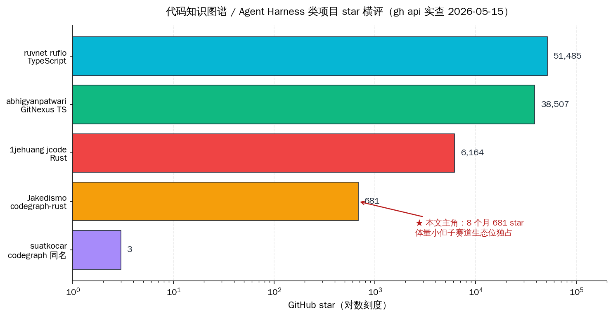
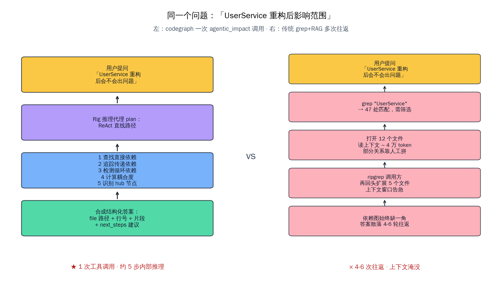
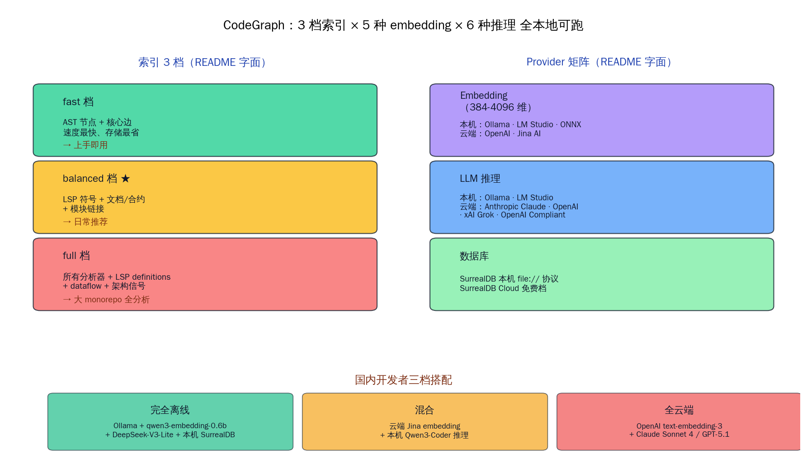

# Claude Code 终于看得懂大仓库：CodeGraph 上场


8 个月时间，单作者，一个 GitHub 主页除了这个项目什么都没有的 Finland 开发者 Jakedismo，安安静静把一个 Rust workspace 写到了 12 个 crate、15 个安装脚本变体、`schema/` 下面同时维护关系型与图数据库两套 SurrealQL schema 的体量。这个仓 **681 stars / 63 forks / 32 open issues / MIT OR Apache-2.0 双协议**，createdAt 是 2025-09-12，pushed_at 还停在 2025-12-20——也就是说，这是个已经成型但还没进入营销推广期的项目。

但它解决的问题，是国内每个天天用 Claude Code、Cursor、Cline、千问 Code、通义灵码 的开发者每天都在撞墙的事——大 monorepo 上的代码理解。

> **本文要回答四件事**：(1) 在 ruflo / jcode / GitNexus 这堆 Rust + 代码 + agent 项目里，CodeGraph 到底站在哪个生态位、补的是哪块拼图；(2) 它的工程取舍——SurrealDB + HNSW + tree-sitter + Rig agent + 4 agentic 工具——每一步换成别的方案会差多少；(3) 国内开发者用 Claude Code / Cursor / Cline 接 CodeGraph，本地 Ollama 后端 + Jina embedding 怎么搭，省下多少 token 是真省；(4) 这种"Rust 单作者写 MCP 服务器"的小项目密度本周第几次冒头，说明 AI Coding 生态正在往哪走。

## 一、不是又一个 Rust agent，是补齐了一块特定形状的拼图

先把这一周看到的"Rust 单作者 coding 项目"放在一张地图上看。



近两周连续命中的同段位项目，技术站位差异其实非常大：

| 项目 | 主语言 | 类型 | star | 我对它的判断 |
|---|---|---|---|---|
| ruvnet ruflo | TypeScript | 多代理编排平台 | 51,485 | 把 Claude Code 当后端跑 swarm |
| abhigyanpatwari GitNexus | TypeScript | 浏览器内代码图谱 | 38,507 | 客户端、零服务器、demo 友好 |
| 1jehuang jcode | Rust | 通用 coding agent harness | 6,164 | 替代 Claude Code 的 TUI 容器 |
| Hmbown DeepSeek-TUI | Rust | 单模型 TUI 客户端 | （前文已写）| 单后端、对话风格 |
| **Jakedismo codegraph-rust** | **Rust** | **代码图谱 MCP 服务器** | **681** | **把代码理解外置成工具** |
| suatkocar codegraph 同名 | Rust | 32 语言 44 工具版 | 3 | 早期实验，类目相同 |

放在一起一看，CodeGraph 的位置就清楚了。它不和 ruflo 比"我能编排多少 agent"，也不和 jcode 比"我做不做 TUI 容器"，更不是 GitNexus 那种"丢进浏览器看图"的 demo 工具。它的核心命题是：**把代码理解这件事从 LLM 的 context window 里拿出来，外置成 MCP 服务器，让 Claude Code / Cursor / Cline 通过 4 个工具调用获得结构化答案而不是一堆 grep 结果**。

这是个特别窄但特别硬的子赛道。窄到什么程度？拿 `gh search repos "codegraph rust"` 的结果说话——除了主仓和它的 fork，整个 GitHub 上只有一个 suatkocar/codegraph 是同形态项目，3 stars。窄到 Hacker News 上没有任何一条单独讨论 CodeGraph 的帖子，最相关的几条是 vexp.dev 和 code-review-graph 的低赞 Show HN，2-3 points 就停了。

但 681 stars 在 8 个月里、4-12 月推送停滞了 5 个月的状态下还能持续增长，说明真有一批开发者发现"我要的就是这个形状的东西"。

## 二、4 个 agentic 工具：从 grep 结果到结构化答案的跳变

CodeGraph 没有遵循"MCP 服务器就暴露一堆细粒度工具"的常规打法。它 README 第二节明确写：**4 个 consolidated agentic tools**——`agentic_context` / `agentic_impact` / `agentic_architecture` / `agentic_quality`。



工具的职责分工 README 写得很清楚：

| 工具 | 职责 | focus 参数 |
|---|---|---|
| `agentic_context` | 搜索代码、构建综合语境、回答语义问题 | search / builder / question |
| `agentic_impact` | 依赖链 / 调用链 / 改一个东西会牵动什么 | dependencies / call_chain |
| `agentic_architecture` | 系统结构 / API 表面 / 架构模式 | structure / api_surface |
| `agentic_quality` | 复杂度热点 / 耦合度 / 重构优先级 | complexity / coupling / hotspots |

这种"少而抽象"的工具设计在 MCP 生态里其实是反潮流的。MCP marketplace 上常见的代码理解 MCP 服务器，动辄暴露 20-40 个工具，每个对应一个具体的图操作（找定义、找引用、找调用方、找子类、找 import……）。CodeGraph 把这些全部塞进了 4 个工具的内部，通过 `focus` 参数微调。

README 的解释是：**LLM 选工具是有 context 成本的**。给它 40 个工具看，描述加起来就要烧掉两三千 token，模型还容易选错；给它 4 个工具看，描述精简、语义清晰、模型一次就能挑对。这套设计在 README 后面那段「与 GPT-5.1 / Claude / Grok-4 三档上下文窗口适配」的代码里能看得更清楚——CodeGraph 自己根据 `CODEGRAPH_CONTEXT_WINDOW` 环境变量动态调整内部步数上限（小模型 ≤ 3 步，200K 模型 ≤ 6 步，2M Grok 给到 8 步），把"决定走几步"这件事也外置成服务器配置而不是塞给 LLM。

更值得关注的是工具内部的"分层思考"。README 写得明确：当 `CODEGRAPH_AGENT_ARCHITECTURE=rig`（默认），不同工具走不同推理策略：

- **LATS 树搜索**：用在 `agentic_architecture(structure)` / `agentic_quality` / `agentic_context(question)`——需要多路径探索的复杂任务。
- **ReAct 直线推理**：用在 `agentic_context(search/builder)` / `agentic_impact` / `agentic_architecture(api_surface)`——直接 lookup 类的任务。
- **Reflexion 自动回滚**：主策略失败时自动接管，分析错因后用更精炼的 plan 重试。

也就是说，开发者那一端看到的是 4 个工具，里面其实是 LATS / ReAct / Reflexion 三套不同推理框架按需切换。这种"工具抽象"对调用方（Claude Code / Cursor）来说是巨大解放——它们只需要决定"我要查影响范围"，不需要决定"我要走树搜索还是直线推理"。

## 三、SurrealDB + HNSW 是关键选择，混合搜索是 7:3 的明确配比

把代码理解外置成服务器，存储层和检索层是绕不开的硬骨头。CodeGraph 给的答案不太常见——**SurrealDB**。


SurrealDB 是 Rust 写的多模数据库——同时支持文档、图、键值、向量四种范式，2024 年 1.0 GA。CodeGraph 选它有几个具体理由能从代码里读出来：

第一，**HNSW 向量索引原生支持**。`schema/codegraph_graph_experimental.surql` 这个文件 README 明确说"为多种 embedding 维度（384-4096）定义 HNSW 索引，方便切换 embedding 模型而不需要重做 DB"。意思是——你今天用 Qwen3-embedding-0.6B 的 1024 维，明天换成 Jina v4 的 2048 维，schema 已经把不同维度的 HNSW 桶预备好了，不需要数据迁移。

第二，**图 + 向量 + 文档在同一个引擎里**。CodeGraph 要查的东西包含：节点（AST + FastML 解析出的代码单元）、边（calls / imports / defines / uses / flows_to / mutates / returns）、chunks 和它们的 embeddings、Markdown 文档节点（README / docs / `.surql` schema 的反向链接）。换成其他方案要么得拼 Neo4j + Pinecone 两套，要么得在 PostgreSQL + pgvector 上手写图遍历，要么得用 SQLite + sqlite-vec 受限于单机。SurrealDB 一个引擎全包。

第三，**SurrealQL 内置图函数可以放在数据库里跑**。README 列出来的 `fn::semantic_search_nodes_via_chunks` / `fn::semantic_search_chunks_with_context` / `fn::get_transitive_dependencies` / `fn::trace_call_chain` / `fn::calculate_coupling_metrics` 全部是数据库端函数。这意味着 Rust 那一层只需要拼参数 + 调用，复杂的图遍历逻辑由 SurrealDB 自己优化执行——避免了"把全图捞回应用层再遍历"这种典型反模式。

混合搜索的 7:3 配比是写在 README 里的硬数字：

```
70% 向量相似度（语义理解）
30% 词法搜索（精确匹配）
+ 图遍历（关系与上下文）
+ 可选 reranker（跨编码器精度）
```

这个比例值得展开说——业界关于"vector vs lexical"的论战从 2023 年吵到现在，大多数 RAG 系统的做法是「先 BM25 召回 top-100，再 vector rerank top-10」。CodeGraph 反过来：以 vector 为主、lexical 辅助。原因写在 README 例子里："你搜 `login logic` 应该找到 `handleUserAuth`（语义命中）；你搜 `handleUserAuth` 也要能精确找到它（lexical 命中）。"对代码这种"名字承载语义"的语料，70:30 比例确实比通用文档场景的 50:50 更合理。

## 四、Provider 矩阵：embedding 和推理都可以全本地

国内开发者拿到一个海外开源项目最关心的两件事：依赖云 API 吗？能不能本地跑？CodeGraph 在这点上做得格外干净。



| 维度 | 可选 provider |
|---|---|
| Embedding（384-4096 维任选） | Ollama / LM Studio / ONNX Runtime（全本地） · OpenAI / Jina AI（云端） |
| LLM（agentic 推理） | Ollama / LM Studio（本地） · Anthropic Claude / OpenAI / xAI Grok / OpenAI Compliant（云端） |
| 数据库 | SurrealDB 本地实例 / SurrealDB Cloud 免费档 |
| 图谱 schema | 关系型 vanilla schema / 实验性图数据库 schema 二选一 |

`~/.codegraph/config.toml` 示例配置长这样：

```toml
[embedding]
provider = "ollama"
model = "qwen3-embedding:0.6b"
dimension = 1024

[llm]
provider = "anthropic"
model = "claude-sonnet-4"

[database.surrealdb]
connection = "ws://localhost:3004"
namespace = "ouroboros"
database = "codegraph"
```

把这套配置翻译成国内开发者熟悉的搭配：

- **完全离线版**：embedding 用 Ollama 跑国产 `qwen3-embedding-0.6b`，推理用 Ollama 跑 `qwen3-coder-30b` 或本地 DeepSeek-V3-Lite，SurrealDB 本机 file:// 协议持久化。代码不离开本机，适合外包公司、金融政企、合规敏感场景。
- **本地推理 + 云端 embedding**：embedding 用 Jina AI 免费档（README 直接给了 Jina 入口链接），推理走 Anthropic Claude 或本地 Qwen3-Coder。embedding 数据量小、隐私敏感度低（只是向量），推理走云端拿质量。
- **全云端版**：embedding 用 OpenAI text-embedding-3-large，推理用 Claude Sonnet 4 / GPT-5.1 / Grok-4，SurrealDB 走免费云端档。最省心，但每个月会有几十到几百块美元的账单。

对照 CodeGraph 的 Cargo workspace 也能看出工程化做得很整齐——`feature` flags 分了 7 套预设：`mcp-minimal` / `mcp-lmstudio` / `local-stack` / `cloud-enabled` / `full` 等等。每个 feature 控制一组 crate 编译，意思是"你只用 Ollama + Anthropic，就别把 OpenAI 那堆代码编进来"。Rust 这种"零成本抽象"在这种插件式 provider 架构上特别合适，最终二进制只带你启用的那部分依赖。

## 五、Tier-Aware：根据你的模型自动调整行为

CodeGraph 里有一个特别少见的设计——`CODEGRAPH_CONTEXT_WINDOW` 环境变量。

| 你的模型上下文 | CodeGraph 的行为 |
|---|---|
| < 50K token | 简洁 prompt，工具内部最多 3 步 |
| 50K-150K | 均衡分析，最多 5 步 |
| 150K-500K | 详细探索，最多 6 步 |
| > 500K（Grok-4 等 2M 上下文）| 全面分析，最多 8 步 |

硬上限：**最多 8 步（环境变量覆盖最多 10 步）**，防止失控的工具调用烧爆 context 或者烧穿钱包。

这个设计的意义在哪？同一个工具调用 `agentic_impact({"query": "UserService"})`：

- 跑在本地 Qwen3-Coder-30B（32K context）上：会用简洁 prompt，最多 3 步内部推理，返回精炼的依赖图。
- 跑在 Claude Sonnet 4（200K context）上：会用详细 prompt，最多 6 步，返回扩展的依赖图 + 调用链 + 耦合度。
- 跑在 Grok-4-Fast（2M context）上：会用最详细的 prompt，最多 8 步，返回完整的依赖图 + 多路径分析。

也就是说，**同一个 codegraph-rust 二进制，跑在 32K 模型和 2M 模型上行为是不一样的**。这是为代码 agent 服务器单独做的"自适应"，省去开发者根据模型手动调参数的成本。

配套的"上下文溢出保护"也很务实——每个工具返回结果有自动截断（默认 `context_window × 2 bytes` 上限），累积上下文有总量护栏（80% × 4 × context_window），超过就 fail-fast 而不是返回 6M token 把模型撑死。CodeGraph 自述："没有这些护栏，一次大 monorepo 的 `agentic_impact` 查询可能返回 6M+ token——远超大多数模型上限，导致昂贵的失败。"这种细节是写过 RAG 系统的人才会想到加的。

## 六、和 GitNexus / jcode / DeepSeek-TUI 的精确对位

近两周连续命中的"Rust + 代码 + agent" 类项目里，CodeGraph 是第四个。这里把 4 家的分工说清楚，避免读者觉得"又是同一类东西"。

| 维度 | CodeGraph (Jakedismo) | GitNexus (abhigyanpatwari) | jcode (1jehuang) | DeepSeek-TUI (Hmbown) |
|---|---|---|---|---|
| 主语言 | Rust | TypeScript | Rust | Rust |
| 部署形态 | MCP 服务器（stdio/HTTP）| 浏览器内运行 | TUI 容器 | TUI 客户端 |
| 服务对象 | Claude Code/Cursor/Cline | 个人开发者 demo | 写代码本身 | 单模型对话 |
| 图谱构建 | tree-sitter + LSP + 14 lang | tree-sitter 浏览器版 | 不构建 | 不构建 |
| 存储 | SurrealDB + HNSW | 内存 + 浏览器 IndexedDB | 文件系统 | 无持久化 |
| 工具粒度 | 4 个 agentic 工具 | 内嵌 chat UI | 通用 agent harness | 对话窗口 |
| Provider | Ollama/Jina/OpenAI 全套 | 主要 OpenAI 兼容 | 主要 Anthropic | DeepSeek |
| 协议 | MIT OR Apache-2.0 | MIT | MIT | MIT |
| 适合场景 | 大 monorepo 给 agent 用 | 单仓代码可视化 | 替代 Claude Code | 国内单后端代码对话 |
| star（5/16）| 681 | 38,507 | 6,164 | 已写专文 |

差异看清楚了：**CodeGraph 不是 GitNexus 的 Rust 版本**——GitNexus 是给人看的（浏览器内交互图谱），CodeGraph 是给 agent 用的（MCP 工具调用）。**CodeGraph 也不是 jcode 的图谱版本**——jcode 是替你跑 agent 循环，CodeGraph 是给 agent 提供"理解代码"这个能力。这四家其实凑齐了 AI Coding 工具链的四个不同位置。

更值得注意的是，前文我把 GitNexus（4-29 写过）定为"客户端代码图谱"路线，CodeGraph 是"服务器端代码图谱"路线。两条线的工程取舍完全不同：

- GitNexus 选 TypeScript + 浏览器，意味着 demo 门槛极低（拖一个 ZIP 文件进去就跑），但被浏览器内存上限锁死，跑不了 monorepo。
- CodeGraph 选 Rust + 本机服务器 + SurrealDB，意味着启动成本高（要装 surreal、要 apply schema、要跑 daemon），但可以处理 100 万行级别的代码库且永久持久化。

国内开发者实测时该选哪条？看你的代码规模和接入方式。要做"个人作品集 demo"用 GitNexus 五分钟跑起来；要做"团队 monorepo + Claude Code 接入"用 CodeGraph 一次部署长期用。

## 七、从客户端配置到索引：实际接入路径

接 CodeGraph 的 MCP 配置在 README 里写得很清楚：

```json
{
  "mcpServers": {
    "codegraph": {
      "command": "/full/path/to/codegraph",
      "args": ["start", "stdio", "--watch"]
    }
  }
}
```

把这段塞进各家的 MCP 配置位置：

| 客户端 | MCP 配置位置 |
|---|---|
| Claude Code（本机版）| `~/.config/claude-code/mcp.json` |
| Cursor | Settings → MCP → 添加自定义服务器 |
| Cline（VS Code 插件）| `.cline/mcp_settings.json` |
| 通义灵码 | 当前 MCP 接入仍在内测，可走 dashscope function calling 间接调用 |
| 千问 Code（dashscope 开放平台）| 通过 function calling 暴露 4 个工具 |
| OpenClaw | `.openclaw/mcp.json`（按 OpenClaw 文档） |

接入之后，索引一遍代码库是必须的一步：

```bash
codegraph index /path/to/project -r -l rust,typescript,python --index-tier balanced
```

README 写得很明确——索引分三档：

- `fast`：只建 AST 节点和核心边，不跑 LSP，存储最省，索引最快。
- `balanced`：加上 LSP 符号、文档/合约节点、模块链接。**这是大多数场景的推荐档**。
- `full`：所有分析器 + LSP definitions + dataflow + 架构信号，最准但最重。

国内开发者上手实测时容易踩的两个坑：

第一坑是 **LSP 工具链没装**。`balanced` / `full` 档要求各语言的 LSP 在 PATH 里：Rust 要 `rust-analyzer`，TS/JS 要 `typescript-language-server`，Python 要 `pyright-langserver`，Go 要 `gopls`。README 明确说"索引会 fail fast 如果工具缺失"。第二坑是 `rust-analyzer` 是 rustup shim 而不是真实二进制（用户装了 rustup 但没装 toolchain 的 rust-analyzer 组件），表现是报错 `Unknown binary 'rust-analyzer' in official toolchain`，解决办法 `brew install rust-analyzer` 或者 `rustup component add rust-analyzer`。

## 八、单作者 Rust × MCP 服务器：生态信号

近两周连续命中四个"Rust 单作者 coding 项目"是个统计学上不能再忽略的信号。把信号读清楚：

| 时间点 | 项目 | 子类 | 共同特征 |
|---|---|---|---|
| 5/3 | ruvnet ruflo | 多 agent 编排 | TypeScript，但生态归类近似 |
| 5/4 | 1jehuang jcode | Coding agent harness | Rust，单作者，TUI 容器 |
| 5/15 | Hmbown DeepSeek-TUI | 单模型 TUI 客户端 | Rust，单作者，本地优先 |
| 5/16 | Jakedismo codegraph-rust | 代码图谱 MCP 服务器 | Rust，单作者，本地优先 |

四个项目子类完全不同（编排 / harness / TUI / 图谱），但共同骨架是：

- **单作者**，没有公司背景，没有 VC backing；
- **Rust 主语言**，二进制可分发、零依赖运行时；
- **本地优先**，全套 provider 矩阵都支持纯本地 stack；
- **MIT / Apache 友好协议**，不阻挡商用；
- **生态位精准**，每家只补一项，不做大而全。

这种密度说明：AI Coding 这个赛道正在进入一个"乐高化"阶段——大公司不再是唯一玩家，单作者用 Rust 在小窗口里把一件事做透就能积累用户。其中代码图谱这块尤其值得国内关注：它是把 Claude Code / Cursor / 千问 Code 等 agent 客户端做到"懂你的项目"的必经一步，谁先把这件事做到工业级、谁就掌握了下一代 AI Coding 的基础设施层。

国内已经有 36氪、量子位、机器之心在追这个赛道的大事件（DeepSeek-V4、Qwen3-Coder、千问 Code 开源、通义灵码免费），但对"小型 MCP 服务器 + 代码图谱"这种基础工具的关注还不密集。等到国内开发者发现 Claude Code 接上代码图谱之后大 monorepo 的体验是另一回事时，这类工具的扩散会比想象中快。

## 九、回到那 681 stars：为什么这个项目值得放在收藏夹里

把全文的论点收拢成一句话：**CodeGraph 不是又一个 Rust agent harness，它是"把代码理解外置成 MCP 工具"这条子赛道里第一个把工程做到产品级的 Rust 实现**。

它的核心价值不是 681 stars 这个数字，也不是 4 个 agentic 工具的命名好听。它真正的价值在三个地方：

第一，**把 LLM context 压力转给服务器**。普通 grep+RAG 一次问题要烧十几万 token 在"读文件、拼依赖图"上；CodeGraph 一次工具调用把这些工作甩给 SurrealDB + tree-sitter + LSP，LLM 那一端只看到结构化答案。对 Claude Code Pro 用户来说，这意味着同样的月费能干更多活。对国内本地推理 Qwen3-Coder / DeepSeek-V3-Lite 用户来说，这意味着小 context window 模型也能处理大 monorepo。

第二，**让"自己写 MCP 服务器"这件事降本**。Cargo workspace 拆得很整齐，每个 crate 职责明确：`codegraph-core` 通用类型 / `codegraph-vector` 向量索引 / `codegraph-parser` AST 解析 / `codegraph-graph` 图操作 / `codegraph-mcp-server` MCP 协议层。想做自己的代码 MCP 服务器、想给 CodeGraph 加一种语言、想换 provider，工程上的切入点都很清楚。

第三，**示范了一条小团队也能走通的"基础工具"路线**。不需要拉 1000 万融资、不需要做大模型、不需要做完整 Agent 框架——找一个特别窄但特别硬的点（代码图谱 + MCP 服务器），用 Rust 把它做透、用本地优先吸引隐私敏感用户、用 4 个抽象工具简化调用方心智。这条路线对国内独立开发者、小团队 CTO、Indie hacker 是很有借鉴价值的。

把 681 stars 放进收藏夹的那一天，你看到的不只是一个 Rust 项目，是 AI Coding 工具链下一阶段的拼图形状。
