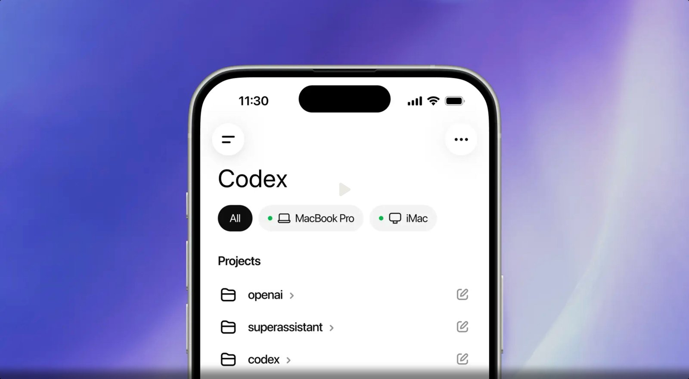
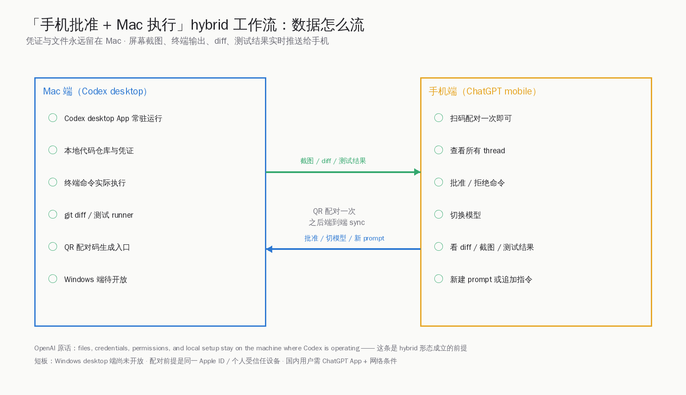
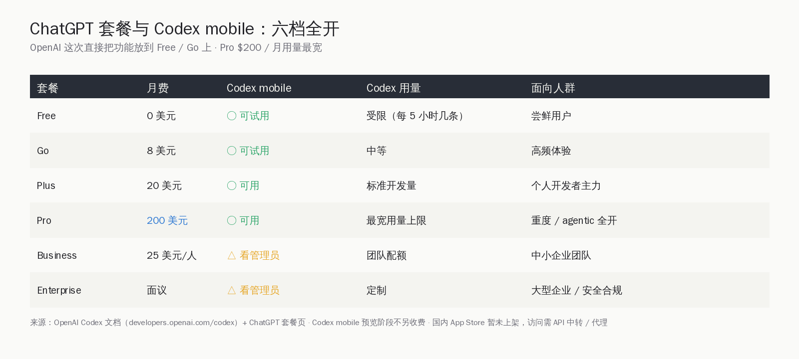
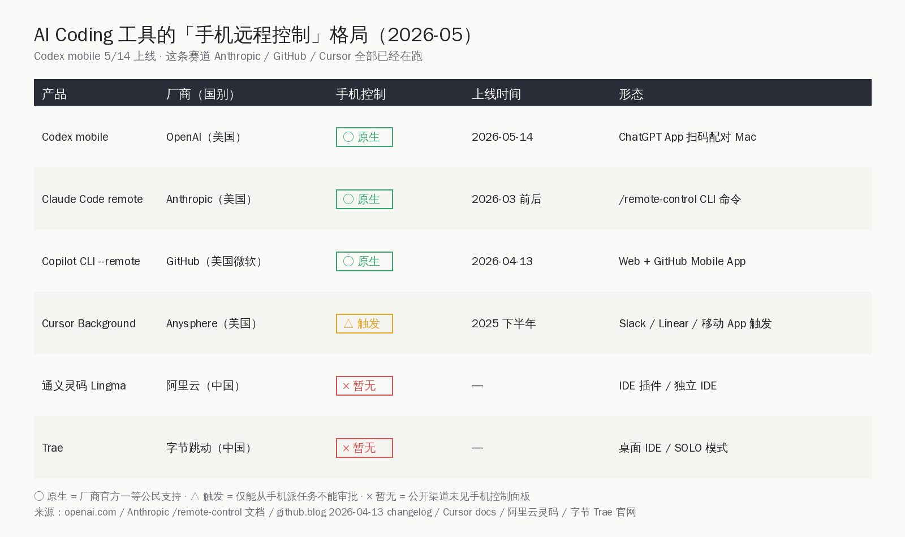

# ChatGPT 把 Codex 装进手机：Mac 跑代码手机审 diff

> **本篇与同月『Claude SMB 15 个 agent 工作流』、『Claude Code 国内大代码库实践』、『VS Code AI Coding 工具盘点』不重叠**。同月那几篇讲的是「桌面 IDE 怎么落到企业 / 大代码库」，这一篇只盯一件事：**Mac 在跑、手机在批**这个 hybrid 工作流，OpenAI 把它做成了 ChatGPT App 原生功能，是不是值得国内同行抄、还是另辟蹊径。

5 月 14 日凌晨，OpenAI 在 `developers.openai.com/codex` 把一行短短的更新挂出来：**「Codex is now in the ChatGPT mobile app」**。同一天 OpenAI 官博发了配套博文 *Work with Codex from anywhere*。文章正文不长，但形态有点新：手机端的 ChatGPT App 不再只是聊天框，能直接接管你 Mac 上常驻运行的 Codex desktop——看截图、看 diff、看测试结果、批准命令、切模型、追加 prompt、新建 thread，全部在手机上完成。Mac 上的代码、凭证、shell 历史一份没动。

HN 当天就把这条消息顶到了首页中段。截至发稿，那条 *Codex is now in the ChatGPT mobile app* 帖子 454 分、231 条评论，热度排在那一天 AI 相关帖的前列。

如果只看标题，这是「手机能写代码」的老故事。但 OpenAI 这一次端出来的东西，本质不是「手机端 IDE」，而是把 **IDE-as-control-plane** 这件事拆给了手机：**Mac 出算力，手机做审批面板**。这是 AI Coding 工具从「桌面 IDE 单机形态」走向「多端协作」的旗舰大厂动作第四家，前面三家分别是 Anthropic 的 Claude Code `/remote-control`、GitHub Copilot CLI 4 月 13 日上线的 `--remote`、以及更早的 Cursor Background Agents。**OpenAI 没有发明这条路线，但它是把这件事做成「ChatGPT App 一等公民」的第一家**。

国内这条线目前是空的——通义灵码、千问 Code、Trae、Cline，公开渠道暂时都没有「手机端原生控制面板」。这不是说国内做不出来，而是产品节奏没排到这里。下面这一篇，把 OpenAI 这次动作里几个真正影响国内开发者的点摆清楚：**1.** 形态到底是什么、和 Codex Cloud 有什么区别；**2.** 套餐分档、谁能用、Pro 200 美元那一档值不值；**3.** HN 上一线开发者的真实反馈（顶赞引语）；**4.** 国内同型工具的位置；**5.** 这条赛道接下来一年会怎么走。

## 一、形态澄清：这不是「手机里跑 Codex」，是「Mac 上的 Codex 多了个手机面板」

先把最容易混的两件事分开：**Codex Cloud** 和 **Codex mobile (desktop-paired)**。

**Codex Cloud** 早就在 ChatGPT App 里——你在手机里发任务，OpenAI 在云上拉一个 sandbox 容器跑代码，跟你本地仓库无关。HN 上 @ahmadyan 就被这事绕晕了：

> "i'm not sure if i'm hallucinating, but i swear i had codex in the chatGPT app from long time ago (like the original codex on the web). they added some new stuff, like remote control to wherever the desktop codex app is running, but these companies need to work much more on their press releases."

@wahnfrieden 在回复里把界限点清楚了：**"That was cloud codex. Not comparable."**

这次发布的是另一个东西——**手机端 ChatGPT App 远程接管你 Mac 上正在跑的 Codex desktop**。文件、凭证、permission、本地 shell，全部留在 Mac 上一份没动。手机端只是个「实时镜像 + 审批面板」。

### 配对流程：QR 一次，之后全自动

按 OpenAI 官方说明，步骤就三步：

1. 升级 Mac 上的 Codex desktop App + 手机上的 ChatGPT App
2. 打开 Mac 上 Codex desktop，点 `Set up Codex mobile`，屏幕上出现 QR 配对码
3. 手机里 ChatGPT App 扫码——握手完成

之后所有交互都端到端 sync。手机里能看见 Mac 上正在跑的所有 thread。OpenAI 把这件事的安全边界写得很白：**"Your files, credentials, permissions, and local setup stay on the machine where Codex is operating, while updates flow back to your phone in real time, including screenshots, terminal output, diffs, test results, and approvals."**

凭证不上手机，敏感操作 approve 才执行——这是 hybrid 形态能成立的底线。

### 手机端到底能干什么

实测下来，手机端能做的事比想象的多：

- **看**：所有 thread 列表、每个 thread 的截图 / 终端输出 / git diff / 测试结果
- **审**：批准或拒绝 Codex 想执行的 shell 命令
- **改**：追加 prompt、给当前 thread 加 steering message
- **切**：换模型（GPT-5 / o-series 之间切换）
- **建**：开新 thread / 新任务

不能做的：手机里没法直接在键盘上敲完整代码、没法看完整文件树、没法访问 Mac 上的浏览器或第三方 App。**这把手机定位得很清楚：审批面板，不是 IDE。**

### Windows 端待开放

这次只支持 Mac 上的 Codex desktop 配对。MacRumors 报道里引 OpenAI 原话：**"support for remotely accessing Codex for Windows will follow soon"**——没有给确定日期。HN 上 @yashau 简短一句吐槽很有代表性：

> "Hmm. No Windows support yet. I will continue using my Telegram bridge then."

@cylentwolf 跟一句：**"When will it release for Windows App? I sometimes hate being outside the Apple Ecosystem when it comes to being a developer."**

苹果生态优先这件事在 AI Coding 工具里已经是默认设定了。国内开发者里 Mac 占比远不如美国硅谷高，Windows 端排期是国产同型工具如果要做必须先解决的事。

## 二、套餐分档：六档全开，Pro 200 美元用量最宽

按 `developers.openai.com/codex` 官方文档：**「ChatGPT Plus, Pro, Business, Edu, and Enterprise plans include Codex」**。配套到 mobile 这一侧，OpenAI 给得更宽——Free 和 Go 两档**也能试用**，只是 Codex 本身的用量受套餐配额约束。

各档位的可用情况按官方 + 媒体交叉信息整理：

| 套餐 | 月费 | Codex mobile | Codex 用量 | 适配人群 |
|---|---|---|---|---|
| Free | 0 美元 | 可试用 | 每 5 小时几条 | 尝鲜 |
| Go | 8 美元 | 可试用 | 中等 | 高频体验 |
| Plus | 20 美元 | 可用 | 标准开发量 | 个人开发者主力 |
| Pro | 200 美元 | 可用 | 最宽用量上限 | 重度 / agentic 全开 |
| Business | 25 美元/人 | 看管理员策略 | 团队配额 | 中小企业团队 |
| Enterprise | 面议 | 看管理员策略 | 定制 | 大型企业 |

要重点说一下 Pro 那一档 200 美元。HN 顶赞里 @pkulak 把这件事的本质讲得很清楚：

> "I just like that Openai let's you use your codex subscription with whatever harness you like. I prefer Pi, so that's what I use. GPT 5.5 xhigh feels equivalent to Opus to me, so there's no reason for me to be locked into the Claude Code cli. I use it off-and-on throughout my workday and never even come close to the pro limits."

200 美元的 Pro 套餐对重度用户来说性价比合理——Codex CLI、Codex desktop、Codex Cloud、Codex IDE 插件、Codex mobile 全部共用同一份订阅。HN 上另一位用户 @superfrank 用了几个月之后给出的对比：

> "I've been on the codex train for a few months now for personal stuff, but have Claude at work. I always tell people it's as good if not better than CC, but it has different strengths and weaknesses. Claude was more autonomous and still is a little, but I think GPT 5.5 closed that gap a lot. Claude is far better at front end design. I think it's still better at big picture planning. Codex is far better at code review and catching bugs that actually matter. I think it's better at following directions."

国内一线开发者关心的点：**ChatGPT App 国内 App Store 暂未上架**——客观说，要用上 Codex mobile，得绕一道。多数人是 API 中转加海外 Apple ID 走通。这条边界文章不展开，但确实是国内同行享受这个功能的现实门槛。

## 三、HN 一线反馈：作品像是「OpenAI 这次终于做对了」

HN 那条 454 分帖子的评论区，难得对 OpenAI 这次产品评价正向占主。挑几条顶赞 verbatim：

@tekacs 那条点赞数靠前，连续编辑了三次，把「真实评估的整个心路」摊开：

> "It's refreshing that unlike Anthropic's Remote Control, this actually... works. Feels like a testament to the value in taking time and doing it properly. Now if only codex got its 1M token context window back."

紧接着他自己修正了一下：

> "Edit: Hmmm. Maybe I spoke too soon. Sigh. Definitely _more_ reliable by far overall, but still have queued messages with responses on my phone that don't show up on my computer, and responses that don't show up on my phone. Edit 2: New threads created from my phone seem to have a little stall-out, but ones that are underway are behaving reasonably well."

@impulser_ 那条直接拉对比：

> "Say what you want about OpenAI, but their software is actually pretty dam good especially compared to Anthropic and Google. Anthropic is just sloppy, and Google just doesn't live on this planet. Both of the Codex apps are very good. I tried this out and it works significantly better than Claude's remote control in fact the first few times I tried Claude's remote control it didn't even work and to this day is very buggy."

@osullip 那条是「这玩意儿真的改变了我的工作方式」的典型样本：

> "I have been doing exactly this by bookmarking Codex and using 'Add to home screen' Process (all on my phone) * Create new repo on github * Tell Chatgpt the project and ask for a readme and agents file * Manual upload the files to github * Go to Codex and tell it to review the code and carry out steps in readme * Connect project to Vercel * If needed, create a DB ... I have done this kind of work for years and now I can create things like this on the way back from a meeting. It's broken my business model by the way."

@danborn26 的看法很代表「轻度场景」用户：

> "Having Codex available on mobile seems really useful for reading and understanding quick PR reviews while away from the keyboard."

@schnitzelstoat 那条把 hybrid 形态最核心的价值写得很到位：

> "This is really useful for when you just need to approve plans or make small decisions."

也有用了一段时间但保留意见的。@jumploops 几个月一直在用类似工具（不是这个 App，是 SSH 隧道）：

> "I've been using Codex from my phone for the past couple of months (through a tunnel, not this app). I was initially quite excited, but I've found the results are less than great compared to being at a keyboard. Something about the smaller screen size and/or lack of keyboard causes me to direct the agent less, which in turn creates more tech debt/code churn/etc. Maybe I'm just showing my age, and I should practice voice dictation or something more, but my thoughts flow faster and more clearly on a keyboard (less ums)."

也有持保留立场、把核心争议点说出来的，@sbinnee 那条值得国内开发者一起想想：

> "I don't like this direction. For accessibility aspect, sure it is good. But Codex is a coding product. I am increasingly concerned of lack of reviewing practice. I doubt that a mobile app is good for reviewing code changes."

代码评审这件事在小屏幕上能不能做好，是这条赛道接下来一年所有产品都得回答的硬问题。

最后是 @kubb 那条带刺的：

> "So, the same thing we've all been doing already with Termius and Tailscale, just locked into ChatGPT?"

这条评论里藏的是赛道老炮的视角——很多人早就在用 Termius、Tailscale、mosh、SSH 隧道，从手机远程操控自己 Mac 上的开发环境。这个工作流不是 OpenAI 新发明的，OpenAI 做的是「把它做成 ChatGPT 一等公民」+ 「内置 approve / diff / test 结果同步」，把原本要装 5 个工具串起来才能做的事压成了一次扫码。

## 四、AI Coding 工具的「手机远程控制」格局：这一条赛道全员开跑

把视野拉远一点。Codex mobile 不是这条赛道的开山之作，前面已经有三家在跑，但这一次 OpenAI 把它做成 ChatGPT App 的原生功能——意味着这条形态正式从「极客小众工具」进入「主流大厂产品形态」。

逐一摊开：

### Anthropic Claude Code `/remote-control`

Anthropic 在 Claude Code（claude code 命令行工具）里早就内置了 `/remote-control` 命令，能从手机端 Claude App 接管桌面端正在跑的 session。HN 评论里 @barrkel 直白：**"This is what /remote-control does in Claude Code, once it's running on your main machine. You can open it up in the phone app."**

但 @impulser_ 已经讲过——Anthropic 的实现「first few times I tried Claude's remote control it didn't even work and to this day is very buggy」。@tekacs 也对比过：「unlike Anthropic's Remote Control, this actually... works」。

国内 Claude Code 用户主要靠 API 中转方案，远程控制功能本身是可用的，但稳定性确实跟 OpenAI 这次差距。

### GitHub Copilot CLI `--remote`

GitHub 4 月 13 日上线 Copilot CLI 的 `copilot --remote` 公测——可以从 GitHub Web 或 GitHub Mobile App 监控并 steer 一个正在跑的 CLI session。能力清单：

- 中途发 steering 指令、追加命令
- 改 plan 后再执行
- 在 plan / interactive / autopilot 三种模式间切换
- 批准或拒绝权限请求
- 用 `ask_user` 工具响应

mobile 端走 Google Play beta 和 iOS TestFlight 路径，还在公测阶段。Copilot Business / Enterprise 用户需要管理员开策略。

### Cursor Background Agents

Cursor 这条线时间更早，但形态略不同——它的 Background Agents 跑在 Cursor 自家云端容器里，不是接管你本地 Mac。手机端只是「触发器」，从 Slack / Linear / Cursor 的 mobile App 启动一个 background 任务。

这个差异挺关键：**Codex mobile = 接管本地（你的 Mac 算力）；Cursor Background = 派任务到云端（Anysphere 算力）**。两种形态对企业合规、对个人电费、对 token 用量都是完全不同的账。

### 国内同型工具的处境：通义灵码 / 千问 Code / Trae / Cline 暂时缺位

公开信息看下来，国内四个主流 AI Coding 工具目前**都没有手机端原生控制面板**：

- **通义灵码（阿里云）**：2026 年 2-3 月发的 Lingma IDE v0.3.0 / v0.4.0 加了 Quest 自主编程、RepoWiki、自定义 Skills / Sub-Agent，但都在桌面端。深度适配千问 3 大模型，没有手机端控制面板的公开计划。
- **千问 Code**：偏 CLI 形态，能力跟 Codex CLI / Claude Code 对标，目前是命令行单机工具。
- **Trae（字节）**：累计注册用户 600 万 + / 月活 160 万 + / 年生成代码超千亿行，2026 年推 SOLO 模式做端到端 agentic，重点在桌面 IDE。
- **Cline**：开源 AI 编程工具 v3.82.0 最新版加了终端支持恢复、多模型生态扩展，仍是 VS Code 插件形态。

国内空缺这一档可能有几层原因：一是中国 AI Coding 这条赛道里桌面 IDE 形态还远没饱和，灵码、Trae 这一年的精力都在桌面 IDE 自身做大做深；二是手机端控制面板对国内用户来说现实场景比硅谷少——国内通勤地铁是高密度场景，硅谷开车通勤拿不出手；三是合规和隐私上，国内手机 App 上线要走更严的备案，云端配对凭证流出去 / 流回来这件事多一层风险。

不一定要 1:1 抄 Codex mobile 的形态。**很可能更适合国内的是「IDE 桌面 + 微信 / 钉钉 / 飞书内置审批面板」混合形态**——通义灵码可以接钉钉，Trae 可以接飞书，毕竟手机上每天打开 ChatGPT App 的用户是少数，但每天打开微信 / 钉钉 / 飞书的开发者是多数。

## 五、为什么是现在：长任务跑着的代码 agent 需要远程审批

把这条赛道理性看下来，「为什么是现在」这个问题其实有一个共同答案：**AI Coding 工具进入 long-running agentic 阶段，单次任务从「按一次 tab 补 30 行代码」变成「跑 45 分钟改 30 个文件」**。

HN 上 @albert_e 描述的 devops 场景非常典型：

> "AI agents for devops and troubleshooting has been fairly powerful for me... Easily 1-2 days of effort... done in about 45 mins with basic human-in-the-loop guidance."

45 分钟跑一个任务，你不会盯着屏幕看完。你会切走干别的事，每隔 5-10 分钟瞄一眼。这时候手机的优势就出来了：手机可以放在桌面、放在咖啡馆、放在地铁上，看一眼批准还是不批准，比每次都要打开笔记本电脑解锁屏幕快得多。

@osullip 那条「我现在能在开会回来的路上做完一个小项目」之所以那么有共鸣，也是这个道理——AI Coding 工作的「等待」环节比「输入」环节长得多。手机端解决的不是「在手机上写代码」，是「在等待 agent 跑完的时候我能不能不被电脑钉死」。

这是 AI Coding 工具继桌面 IDE 之后第一次形态裂变。**桌面 IDE 解决了「写代码这件事」，手机端审批解决了「等代码跑完这件事」。** 这两件事在过去合并在桌面 IDE 里是因为代码补全是同步的——你按 tab，立刻拿到结果。Agentic 时代，任务异步了，等待时间变长了，「等待」就成了一个独立的产品形态。

## 六、国内开发者的视角：这事我能不能用、值不值得追

把这件事翻译到国内同行的语境：

**能不能用？** ChatGPT App 国内 App Store 暂未上架。要用 Codex mobile，得海外 Apple ID + ChatGPT 订阅 + 网络条件，门槛不低，但圈内开发者已经熟门熟路。Pro 200 美元这一档，对每天用 GPT-5 写代码、跑 agent 的人来说投入产出能算过来。

**国内同型替代？** 暂时空缺。最接近的方案是用 SSH + Termius + 自部署 Claude Code，从手机端远程控制自己工作站上的 agent。HN 上 @asadm、@sambaumann 都在用这套：「I use Termius on my phone to remote and make agent do stuff while i chill or am on road」——折腾，但能跑通。

**值不值得追？** 这条赛道国外四家齐跑、国内空缺，从市场机会角度看是清楚的。但「直接复制 Codex mobile 形态」可能不是最优解——国内开发者每天打开微信 / 钉钉 / 飞书的频率远高于打开任何独立 App。**做成微信 / 钉钉 / 飞书机器人接收 diff 推送 + 内联批准按钮**，可能比做独立手机 App 更贴国内日常工作流。这是产品形态层的差异化机会。

## 七、接下来一年的可能演进

把 5 月 14 日这条事件按时间线往后推一年：

1. **6 月内**：Codex mobile 大概率出 Windows 端配对，把这条形态拉到全平台。MacRumors 引 OpenAI 原话「support will follow soon」。
2. **Q3 内**：Anthropic Claude Code 的 `/remote-control` 稳定性追平 Codex mobile 是必然的；GitHub Copilot `--remote` 从公测转正式。
3. **2026 下半年**：Cursor 大概率把 Background Agents 形态延伸到「本地 Mac 接管」，跟 Codex mobile 形成直接竞争。
4. **2027 年内**：国内同型工具进场。最可能的路径是通义灵码 + 钉钉、Trae + 飞书、Cline + 企业微信。

更长的视角里，**「Mac 跑代码 + 手机批准」这条 hybrid 形态可能会进一步演化成「家里桌面跑代码 + 笔记本批准 + 手机紧急介入」的三端协作模式**。Codex desktop 已经在做 SSH 连接远程机器，等于把「跑代码的机器」和「写代码的人」分开了。下一步把「等代码的人」也分出去，逻辑链就闭合了。

这一年里值得国内同行注意的两个外部信号：一是 GitHub Copilot 的 `--remote` 走通会让「GitHub 仍然是开发者中枢」这个论点变得更硬，对国内 Forgejo / Gitea / Gitee 这一波的影响是双面的；二是 ChatGPT App 把 Codex mobile 做成原生入口之后，OpenAI 等于把 ChatGPT 从「聊天工具」推向「开发者主入口」，跟 Claude / Gemini 在同一条战线上抢「开发者每天打开第一个 App」的位置。

## 八、收尾：这条事最值得记住的一句话

不是「OpenAI 把 Codex 装进手机了」。

是 **AI Coding 工具的形态正式开始裂变——「写代码」和「等代码」第一次被分到不同的设备上**。OpenAI 是第四家做这件事的大厂，但是第一家把它做成 ChatGPT App 一等公民的。Anthropic、GitHub、Cursor 各有各的实现，国内同行还在路上。这条赛道的真正赢家不一定是最早开跑的那家，可能是最贴本地工作流的那家——对国内同行来说，「微信 / 钉钉 / 飞书内置 AI Coding 审批面板」可能比独立手机 App 更有戏。

接下来一年，盯三件事：Windows 端何时开放、Anthropic 远程控制稳定性追上来没有、国内哪家先做出「IM + IDE」hybrid 形态。
