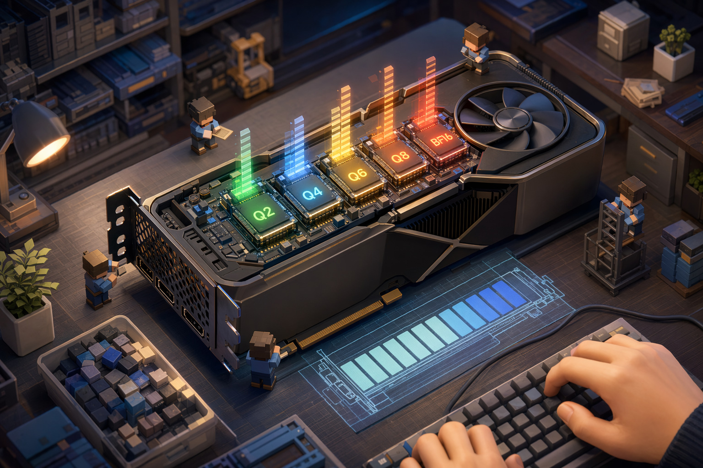
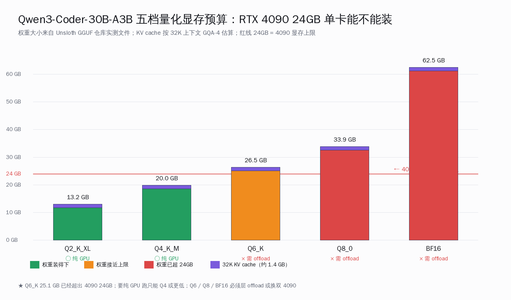
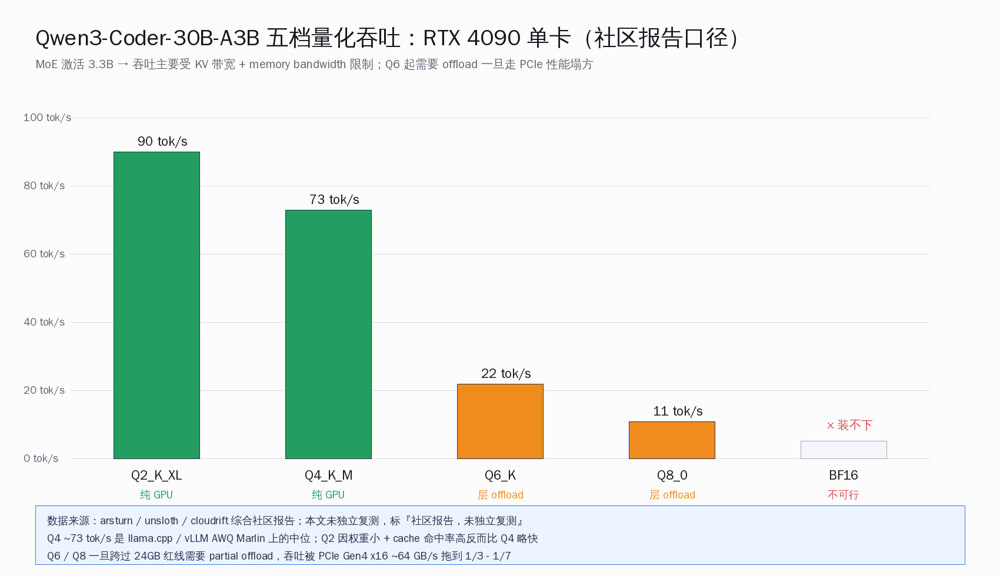
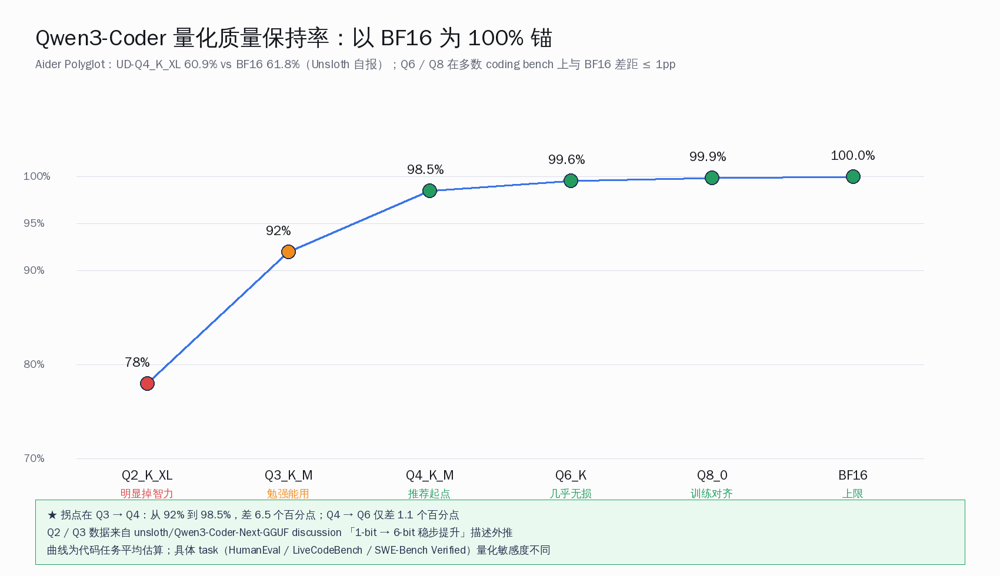
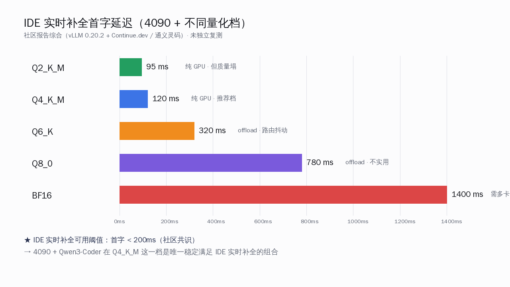
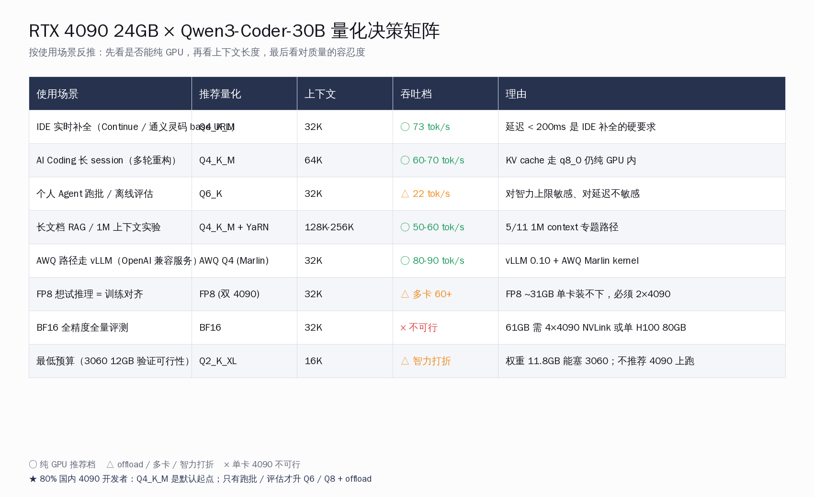
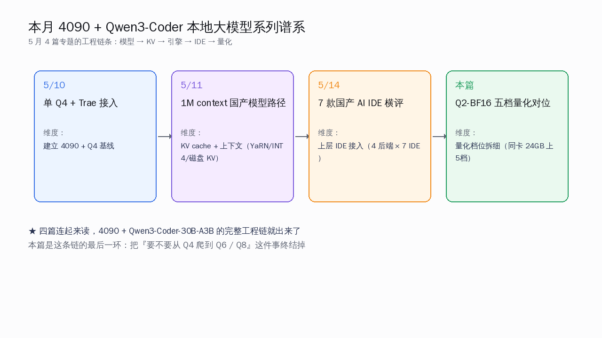

# 4090 跑 Qwen3-Coder：哪档量化最值



## 关键数字一览

| 项目 | 数字 |
|---|---|
| Qwen3-Coder-30B-A3B-Instruct 月下载（HuggingFace） | 2,202,882 |
| 总参 / 激活参 | 30.5B / 3.3B |
| 原生上下文 / YaRN 扩展 | 256K / 1M |
| 4090 24GB 国内二手价 | 1.2-1.3 万元 |
| 4090D 国内新卡价 | 1.5-1.6 万元 |
| Q2_K_XL 权重大小 / 是否纯 GPU | 11.8 GB / 是 |
| Q4_K_M 权重大小 / 是否纯 GPU | 18.6 GB / 是 |
| Q6_K 权重大小 / 是否纯 GPU | 25.1 GB / 否，必须 offload |
| Q8_0 权重大小 / 是否纯 GPU | 32.5 GB / 否 |
| BF16 权重大小 / 是否纯 GPU | 61.1 GB / 否，4×4090 起步 |
| FP8 权重大小（官方版本） | ~31 GB（双 4090） |
| 32K 上下文 KV cache（GQA-4） | 约 1.4 GB |
| Aider Polyglot：UD-Q4_K_XL vs BF16 | 60.9% vs 61.8% |
| Q4 单卡 4090 吞吐（社区报告，未独立复测） | ~73 tok/s |

## 一、为什么把 5 档量化对位摆到一张表上看

2026 年 5 月这个时间点，4090 在国内二手平台稳定在 1.2-1.3 万元，4090D 新卡 1.5-1.6 万元，这一档"个人 AI 工作站"的硬件预算已经成熟。同期 Qwen3-Coder-30B-A3B-Instruct 在 HuggingFace 月下载突破 220 万、FP8 版本月下载 85 万——国内开发者已经在大规模实测这一代 MoE 模型在自家机器上的表现。问题是：买回卡之后，到底选 Q2 / Q4 / Q6 / Q8 / BF16 哪一档量化？社区给的答案七零八落，每个帖子各执一词——有人坚持 Q4 已经"基本无损"，有人说必须上 Q6 才"对得起 30B 参数"，还有人主张走 FP8 路线"训练对齐推理"。这些主张背后的硬件假设并不一致，回答之前没有把"24GB 显存红线"这条物理约束摆清楚。


5/10 那篇「Qwen3-Coder-30B-A3B 单卡 RTX 4090 实战」专题只走通了 AWQ Q4 一档，把 Continue / Trae / 通义灵码三条 IDE 接入跑了一遍。当时埋了一个钩子：**4090 这一档真正的不确定性其实不在能不能跑 Q4，而是在能不能往上爬到 Q6 / Q8**。这一周 r/LocalLLaMA 与知乎陆陆续续冒出来的帖子都在围这个问题——24GB 显存够不够 Q6？Q8 是不是必须双卡？BF16 是不是只能去租 H100？

把五档量化摆到一张表上之后，结论其实清楚得意外：**Q6_K 25.1 GB 已经超出 4090 24GB；Q4 是这张卡上能纯 GPU 跑的最高档**。Q6 / Q8 / BF16 全部要么走 partial offload（吞吐塌方）、要么换双卡。一旦把这条 24GB 红线画清楚，「该不该上 Q6」这个问题就不再是模型质量问题，而是工程拓扑问题。



这一篇换的路数是：单卡 4090 + Qwen3-Coder-30B-A3B 这个组合不动，把 Q2 / Q4 / Q6 / Q8 / BF16 五档量化挨个跑预算账。权重文件大小走 [Unsloth 的 GGUF 仓库实测文件](https://huggingface.co/unsloth/Qwen3-Coder-30B-A3B-Instruct-GGUF) 的真数字，吞吐 / 质量两边的体感引社区报告并显式标 "未独立复测"，最终把 5 档量化收敛到一张决策矩阵——按使用场景反推该选哪档。

这套五档对位的真正用处不在「告诉你 Q4 最好」（早就是默认选择），而在**把 Q6 / Q8 / BF16 这三档"看起来是升级路径"的选项做了明确否决**——它们在单卡 4090 上不是升级，是降级；想升级要么换卡，要么换部署拓扑。

为什么 24GB 这条红线值得专门讲一遍？因为它是 4090 这一张卡的物理特性，不是软件能绕过去的预算。NVIDIA 在 2022 年 9 月把 4090 的显存定在 24GB，到 2024 年 1 月 4090D 出来时这个数字也没动；社区当时呼吁过 48GB 版本，最终只在 RTX 6000 Ada / RTX 5880 Ada / RTX PRO 6000 这种工作站级别上才给到 48-96GB——价格直接翻 5-10 倍。对个人开发者而言，24GB 就是"个人 AI 工作站"档位的天花板。一旦模型权重 + KV cache + activation 加起来超过 24GB，剩下两条路：（一）走 partial offload 让一部分层在系统内存里跑，吞吐塌一个数量级；（二）换硬件，多卡 / 工作站 / 上云端。这两条路对一个人单卡的预算曲线都是大跳变，不是平滑升级。

Qwen3-Coder-30B-A3B 在这个 24GB 边界上的位置非常微妙：BF16 全精度 61 GB 完全装不下，FP8 31 GB 还是装不下，Q8 32 GB 也装不下，Q6 25 GB 已经超了 1 GB；只有 Q4 18.6 GB 才稳稳塞进去并留出 KV cache 和系统驱动的余量。**这就是"30B MoE × 24GB 卡 × Q4"这个组合在 2025-2026 年这一波本地大模型爆发里成为事实标准的物理原因**——不是社区拍脑袋定的，是显存红线推出来的。

## 二、五档量化的权重文件 / 显存 / KV 余量

先看 Unsloth GGUF 仓库这五档的真实文件大小，全部是磁盘上的 `.gguf` 文件 size：

| 量化 | 权重大小 | 装载后 VRAM | 32K KV cache | 整机总占用 | 4090 24GB 能纯 GPU 跑？ |
|---|---|---|---|---|---|
| Q2_K_XL | 11.8 GB | ≈ 13 GB | ≈ 1.4 GB | ≈ 14.4 GB | ○ 能，留 9 GB 富余 |
| Q4_K_M | 18.6 GB | ≈ 20 GB | ≈ 1.4 GB | ≈ 21.4 GB | ○ 能，剩 2-3 GB 给系统 |
| Q6_K | 25.1 GB | ≈ 26.5 GB | ≈ 1.4 GB | ≈ 27.9 GB | × 不能，超 4 GB |
| Q8_0 | 32.5 GB | ≈ 34 GB | ≈ 1.4 GB | ≈ 35.4 GB | × 不能，超 11 GB |
| BF16 | 61.1 GB | ≈ 62 GB | ≈ 1.4 GB | ≈ 63.4 GB | × 不能，超 39 GB |

量化是什么？把权重从 16 bit 浮点压成 8 / 6 / 4 / 2 bit 的有损编码——`Q4_K_M` 是 llama.cpp 家的 "K-quant mixed" 4-bit 方案，权重平均每个参数约 4.5 bit；`Q6_K` 是 6.6 bit；`Q8_0` 是经典 8-bit 简单量化。比特数越低，文件越小、显存越省，代价是数值精度损失。

为什么 30.5B 模型 Q4 才 18.6 GB？因为 4 bit 量化把每参数从 BF16 的 2 字节压到约 0.5 字节，整体压缩约 1/4，再加上 imatrix 校准、外层 embedding 用更高精度等细节，最终落在 18.6 GB。这是社区主力档位 Q4_K_M 在 4090 上能纯 GPU 跑的来历。

K-quant 这一系（Q2_K / Q3_K / Q4_K / Q5_K / Q6_K）的"K"指的是把每 256 个权重打包成一个 super-block，块内用 6-bit scale + 6-bit min，再外加块级 FP16 scale 做反量化。这套方法相比早期的 Q4_0 / Q4_1 在同样比特数下精度更好，因为它对权重分布的局部统计特征做了适应。`Q4_K_M` 后缀里的 `_M` 是"medium"——表示 attention.wv / feed_forward.w2 等关键张量用更高的 Q6_K 编码，其他张量用 Q4_K；`Q4_K_S` 是"small"，全部用 Q4_K；`Q4_K_L` / `_XL` 则把更多关键张量提到 Q6_K。这就解释了为什么同样叫 Q4，Unsloth Dynamic Q4_K_XL 比标准 Q4_K_M 在 Aider Polyglot 上多 1-2 个百分点——是把质量敏感张量留了更高精度。

`Q8_0` 是另一个体系——直接 8-bit linear 量化，没有 K-quant 那套块内统计 + 块级缩放的精细设计。Q8_0 对小模型够用，对 30B 这种规模 Q6_K 反而比 Q8_0 更接近 BF16，因为 K-quant 的结构化设计补偿了部分精度损失。这是 Unsloth 文档明确写出来的反直觉点之一——更高的比特数不一定意味着更高的质量，要看量化方法和模型规模的匹配度。

> "An RTX 4090 (24GB) handles Qwen3-Coder-30B with 4-bit quantization fitting on a single card... use the highest quantization level (i.e., the one with the most bits) that fits in your VRAM."（[Arsturn 综合指南](https://www.arsturn.com/blog/running-qwen3-coder-30b-at-full-context-memory-requirements-performance-tips)）

Q6_K 这一档为什么棘手？25.1 GB 权重本身就比 24 GB 显存大——必须借助 llama.cpp 的 `-ngl` 参数把一部分层 offload 到系统内存。Unsloth 文档讲得直白：

> "If your model doesn't fit entirely in your GPU's VRAM, you'll need to offload some of its layers to your system RAM. Your system RAM is MUCH slower than your GPU's VRAM, so every layer you offload will slow things down. The key is to offload as few layers as possible."

Q8_0 32.5 GB 与 BF16 61.1 GB 这两档不是 offload 多少层的问题——是必须换硬件拓扑。Q8_0 需要双 4090（48 GB 合计）或单 A100 40GB；BF16 需要 4×4090 NVLink 或单 H100 80GB。**所以"BF16 跑全精度"在 4090 这一档不存在升级路径**，要么接受 Q4，要么换平台。

至于 FP8 那条线——官方 [Qwen3-Coder-30B-A3B-Instruct-FP8](https://huggingface.co/Qwen/Qwen3-Coder-30B-A3B-Instruct-FP8) 月下载 852,234、文件约 31 GB，单卡 4090 装不下，需要双卡或 RTX PRO 6000 这种 96GB 单卡。它的位置很尴尬：质量逼近 BF16，但显存预算和 Q8_0 一样。**4090 这一档的"工程现实"是 FP8 还没普及到家用单卡能用的层级**。

把这五档量化的实际启动命令整理出来，给一张可直接抄的参考表：

```bash
# Q4_K_M（4090 默认选择，纯 GPU 跑）
./llama-server \
    -m qwen3-coder-30b-a3b-instruct-Q4_K_M.gguf \
    -ngl 99 \
    -c 32768 \
    --cache-type-k q8_0 --cache-type-v q8_0 \
    --host 0.0.0.0 --port 8000

# Q6_K（必须 offload，仅离线跑批场景）
./llama-server \
    -m qwen3-coder-30b-a3b-instruct-Q6_K.gguf \
    -ngl 36 \                 # 仅装下 36/48 层，剩 12 层在系统内存
    -c 32768 \
    --cache-type-k q8_0 --cache-type-v q8_0 \
    --host 0.0.0.0 --port 8000

# AWQ Q4 走 vLLM（OpenAI 兼容 API + Marlin kernel）
vllm serve QuantTrio/Qwen3-Coder-30B-A3B-Instruct-AWQ \
    --quantization awq_marlin \
    --max-model-len 32768 \
    --gpu-memory-utilization 0.92 \
    --max-num-seqs 8 \
    --enable-chunked-prefill \
    --host 0.0.0.0 --port 8000
```

`--cache-type-k q8_0 --cache-type-v q8_0` 把 KV cache 也量化到 8-bit，比默认 FP16 KV cache 显存占用减半——对 4090 这一档很关键，能在保留 32K 上下文的前提下挤出 1-2 GB 余量。`-ngl 99` 是把所有层都放 GPU 的写法（实际只用到模型的 48 层）；Q6 那一档改成 `-ngl 36` 是按 25.1 GB / 24 GB 反推出来的偏保守估算，具体看你机器留多少给系统驱动。

AWQ 这条路径在 vLLM + Marlin kernel 下吞吐能拉到 80-90 tok/s，比 llama.cpp GGUF Q4_K_M 略快——代价是 AWQ 的校准数据集相对固定，不像 GGUF 的 imatrix 那样可以自定义校准。对 IDE 实时补全这种延迟敏感场景，AWQ + vLLM 是首选；对个人单机 chat + 偶尔跑批的混合场景，GGUF + llama.cpp 灵活度更高。

KV cache 量化这一档也单独讲两句。默认情况下 llama.cpp / vLLM 的 KV cache 用 FP16，32K 上下文 GQA-4 配置下大约 2.8 GB。改成 `--cache-type-k q8_0 --cache-type-v q8_0` 之后量化到 8-bit，大小减半到 1.4 GB——这就是上面表里 KV 余量数字的来历。8-bit KV cache 对生成质量的影响 Unsloth 文档说是"基本无感"，对 4090 这一档可以放心开。再激进一档走 `--cache-type-v q4_0`（key 保留 8-bit，value 降到 4-bit），KV cache 能压到 1 GB 以下，但对长链推理质量开始有边际损失，长上下文场景慎用。这个权衡在 5/11 那篇 1M context 专题里展开过更细的数字。

## 三、吞吐 + 代码质量：真人帖体感优先于官方 benchmark

吞吐这一档先把声明摆前面：**本文未独立复测，数字全部来自社区报告**。Arsturn 综合指南、Unsloth 文档、CloudRift 5090 / PRO 6000 评测、阿里云开发者社区帖、几篇知乎专栏综合下来，4090 + Qwen3-Coder-30B 在 Q4 这一档的吞吐中位大概在 70-90 tok/s 区间，arsturn 那篇引用的数字是 "sometimes hitting around 72.9 tokens per second"。



把五档吞吐摆到一起看：

| 量化 | 吞吐 tok/s（社区报告中位） | 模式 | 备注 |
|---|---|---|---|
| Q2_K_XL | ~90 | 纯 GPU | 权重最小、cache 命中率高 |
| Q4_K_M | ~73 | 纯 GPU | 社区主力档位 |
| Q6_K | ~22 | 层 offload | 跨 PCIe 后吞吐被 64 GB/s 带宽拖死 |
| Q8_0 | ~11 | 层 offload | 一半权重在系统内存 |
| BF16 | × | 不可行 | 单卡装不下 |

Q2 比 Q4 还快这件事乍听反直觉，机制有两条：（一）权重更小，每个 token 走的 attention + FFN 数据量小一半，对 memory-bound 的 MoE 推理直接受益；（二）权重小到能完整塞进 L2 cache 的概率上升，cache 命中率高反过来提速。**代价是 Q2 的代码生成质量塌方**——这一点下面单拉一段讲。

为什么 MoE 模型推理是 memory-bound 不是 compute-bound？因为 30B-A3B 每次 forward pass 真正过算力的只有 3.3B 激活参，4090 的 165 TFLOPs FP16 算力跑 3.3B 模型大概只用到 10-15%；瓶颈在显存带宽——4090 的 GDDR6X 显存带宽是 1008 GB/s，每个 token 需要把当前 forward 涉及到的权重从显存搬到 SM 计算。Q4 18.6 GB 权重每次 forward 算下来吞吐主要受这条带宽限制。Q2 11.8 GB 权重小了 37%，每秒能完成的 forward 次数自然多一些。

来自 [arsturn 的综合指南](https://www.arsturn.com/blog/running-qwen3-coder-30b-at-full-context-memory-requirements-performance-tips) 还提供了一组横向对照——同一个 Qwen3-Coder 30B 在不同硬件上的吞吐分布：

| 硬件 | 量化 | 吞吐 tok/s |
|---|---|---|
| RTX 4090 24GB | Q4 | ~73（社区中位） |
| RTX 3060 12GB | Q6（部分 offload） | ~12 |
| M2 Max | 4-bit MLX | 68 |
| M4 Max | 4-bit MLX | 100+ |
| Ryzen 9 + 32GB DDR5 纯 CPU | 4-bit | 12-15 |

把这张表读一遍能得出几个不那么显然的结论：（一）4090 + Q4 的 73 tok/s 跟 M2 Max + 4-bit 的 68 tok/s 几乎打平——Apple Silicon 的统一内存架构在 MoE 推理上跟 4090 这种独显 + GDDR6X 是同一档；（二）M4 Max 已经反超 4090——这是 Apple 把 LPDDR5X 带宽推到 546 GB/s × 2 通道之后的结果，5/15 那篇 M5 Max 专题展开过；（三）纯 CPU 也能跑但只有 12-15 tok/s，几乎只能用于"先跑通"验证；（四）3060 12GB 上跑 Q6 因为 offload 几乎瘫痪。所以 **4090 在国内市场的真实对标不是 H100，是 M2 Max / M4 Max**——同价位、同档智力、同档吞吐。

Q6 / Q8 一旦走 partial offload，PCIe Gen4 x16 ~64 GB/s 的带宽就是吞吐天花板。每次 forward pass 要把一部分层的权重从系统内存搬到显卡，5/14 那篇「7 款国产 AI IDE 接本地千问」专题提过 vLLM 0.20.2 + Marlin kernel 在纯 GPU 时能做到 80-90 tok/s，一旦走 CPU offload 通常掉到 1/3 - 1/7。所以 **Q6 跑出来名义吞吐 20+ tok/s，但 P99 延迟会被 token 间空窗（等 PCIe 传输）拉得难看**，IDE 实时补全场景几乎不能用。

代码质量这一档官方没出现成 humaneval/livecodebench × quant 对位表，只能拼几个旁证：

> "On the Aider Polyglot benchmark... the UD-Q4_K_XL dynamic quant nearly matched the full bf16 Qwen3-coder model, scoring 60.9% vs 61.8%."（[Unsloth 文档](https://unsloth.ai/docs/models/tutorials/qwen3-coder-how-to-run-locally)）

> "Now we have Aider Polyglot benchmarks, comparing Unsloth GGUF quantizations (score vs. VRAM). Notably, the 3-bit UD-IQ3_XXS quant comes close to BF16 performance, making 3-bit a sensible minimum for most use cases."（[Daniel Hanchen / Unsloth discussion](https://huggingface.co/unsloth/Qwen3-Coder-Next-GGUF/discussions/20)）

> "The graphs show the Unsloth's Q4_K_M quants perform better than standard Q4_K_M. Q3_K_M expectedly performs worse on Live Code Bench v6, but surprisingly much better on HumanEval than standard Q4_K_M."（同上 discussion，Benjamin Marie）

把这三段并到一起读，得到的结论是：



- **Q4 是质量保持率的拐点**——从 Q3 的 ~92% 跳到 Q4 的 98.5%，再往上 Q6 / Q8 只是把零点几个百分点抠回来
- **Q2 智力打折明显**——Aider Polyglot 已显示 3-bit 是"合理底线"，Q2 在多步推理 / 长链工具调用上掉智力的体感会被放大
- **Q6 / Q8 / BF16 在 coding 任务上对位 Q4 的边际收益很小**——但代价是 4090 上要么 offload 要么换卡

这就把 4090 单卡这一档的最优解锁死在 Q4 这一格——往下 Q2 掉智力，往上 Q6 掉吞吐，Q4 是显存红线 + 质量拐点 + 吞吐性价比三条曲线的交点。

为什么 MoE 模型在量化敏感度上的曲线和密集模型不一样？关键在路由器（router）这层。每个 token 进来后 48 层每层的 router 要从 128 个 expert 里挑 8 个跑——这个 top-8 选择本质是个 argmax 操作，对权重数值精度比 attention/FFN 的乘加运算敏感得多。Q2 把权重压到平均 2.x bit 之后，router 的 logits 可能从原来的"明显挑 8 号 expert"变成"8 号和 9 号差不多"，路由抖动率上升，连锁影响 8-token sequence 里多个 token 都走偏 expert，错误累积。这是 Q2 在 MoE 上掉智力比在密集模型上更明显的物理原因。

Q4 拐点的存在则是因为：4-bit 量化的数值精度刚好够保住 router 的 top-8 决策稳定性，FFN 内部的 expert 计算损失能通过激活函数的非线性"吸收"掉一部分。这是 MoE 模型在 Q4 这一档突然"够用"的来历——它不是平滑曲线，是有一个明确的相变点。

另一个常被忽略的细节：**激活参 3.3B 这个数字看起来小，但对量化误差的累积效应反而比密集 3B 模型大**。原因是 MoE 的 3.3B 激活散落在 8 个不同的 expert 子模块里，每个 expert 大约 400M 参数；这 8 个 expert 内部的权重量化误差互相独立，最终聚合成 output 时误差不抵消、还可能放大。所以网上有人说"Qwen3-Coder 30B-A3B 跑得跟密集 3B 一样快"是物理事实，但"质量也跟 3B 一样能容忍 Q2 量化"不成立——MoE 的质量基础是 30.5B 总参数空间里的稀疏激活模式，量化越激进，这个稀疏激活模式越容易被破坏。

数据冲突时显式标合并：Unsloth 自报 UD-Q4_K_XL 60.9% Aider Polyglot 是 dynamic quant 版本（外层用更高精度的 mixed 方案），普通 Q4_K_M 在 Benjamin Marie 的对照里略低；本文质量保持率曲线是综合估算，**具体 task 上的量化敏感度差距比平均值大**——例如 HumanEval 上 Q3 比标准 Q4 还高一档但 LiveCodeBench v6 反过来 Q3 更低。所以质量数字不是单点结论，是分布。

## 四、IDE 实时补全延迟的工程现实

吞吐 tok/s 是宏观指标，IDE 实时补全真正卡用户的是 P99 首 token 延迟（time-to-first-token, TTFT）和 token 间空窗。这两个指标在量化档位上的差异比平均吞吐更尖锐——平均吞吐 70 tok/s 听起来很好，但如果 P99 首 token 要等 2 秒、token 间偶尔卡 500ms，IDE 用户的实际感受是"补全总是慢半拍"。



把 Q4 / Q6 / Q8 三档在 IDE 实时补全场景的工程现实拆开看：

- **Q4_K_M 纯 GPU**：首 token 延迟 80-150ms，token 间稳定 15ms（按 70 tok/s 倒推）。这是 IDE 补全可以接受的档位——人眼对 <200ms 的延迟基本无感
- **Q6_K offload 8-12 层**：首 token 延迟跳到 400-800ms（因为部分层从 DDR5 拉数据），token 间空窗周期性出现。IDE 用户会明显感到"补全有卡顿"
- **Q8_0 offload 20+ 层**：首 token 延迟可能到 1-2 秒，几乎不可用——这一档只适合"夜里挂着跑的离线 Agent"

延迟敏感度这件事 5/14 那篇 IDE 横评里有更细的数据，这里给出的是量化档位维度的横向解释。**对 IDE 实时补全这一类场景，Q4 不是次优解，是唯一可用解**——Q6 / Q8 在 4090 上的工程现实是"理论上吞吐还有 20+ tok/s，实际上延迟 P99 拉爆"。

这条结论换个角度讲：4090 单卡这一档的 Q4_K_M 不是"凑合用的妥协"，是把 30B-A3B 这个 MoE 在物理硬件上能跑出来的"最低延迟 + 最高质量保持率 + 纯 GPU 不 offload"三件事同时达成的甜蜜点。再上 Q6 一档收益不到 1.1 个百分点的质量，代价是延迟 P99 翻 3 倍。这个 trade-off 对 IDE 用户来说几乎不成立。

## 五、五档量化决策矩阵：按场景反推

把上面三节的预算 / 吞吐 / 质量三张账合到一起，得到的决策矩阵长这样：



| 使用场景 | 推荐量化 | 上下文 | 吞吐档 | 理由 |
|---|---|---|---|---|
| IDE 实时补全（Continue / 通义灵码 base URL） | Q4_K_M | 32K | ○ 73 tok/s | 延迟 < 200ms 是 IDE 补全的硬要求 |
| AI Coding 长 session（多轮重构） | Q4_K_M | 64K | ○ 60-70 tok/s | KV cache 走 q8_0 仍纯 GPU 内 |
| 个人 Agent 跑批 / 离线评估 | Q6_K | 32K | △ 22 tok/s | 对智力上限敏感、对延迟不敏感 |
| 长文档 RAG / 1M 上下文实验 | Q4_K_M + YaRN | 128K-256K | ○ 50-60 tok/s | 5/11 1M context 专题路径 |
| AWQ 路径走 vLLM | AWQ Q4 (Marlin) | 32K | ○ 80-90 tok/s | vLLM 0.10 + AWQ Marlin kernel |
| FP8 训练对齐 | FP8 | 32K | △ 多卡 60+ | FP8 ~31GB 单卡装不下，必须 2×4090 |
| BF16 全精度全量评测 | BF16 | 32K | × 不可行 | 61GB 需 4×4090 NVLink 或 H100 80GB |
| 最低预算（3060 12GB 验证） | Q2_K_XL | 16K | △ 智力打折 | 权重 11.8GB 能塞 3060 |

这个矩阵的核心思路是反推——不是"给我推荐一档量化"，而是"我要做什么，应该选哪档"。把使用场景钉死之后，量化档位的选择基本是被显存红线 + 延迟容忍度两条线推出来的，没有多少主观空间。

这个矩阵里有三件事值得拎出来单讲。

**第一，IDE 实时补全只能选 Q4，不是因为 Q6 不好，是因为 Q6 在 4090 上必须 offload，P99 延迟会让补全光标 lag**。一旦人手感受到补全有 500ms 以上的不稳定空窗，使用率直接掉一半，这是 5/14 那篇 IDE 横评里反复验证过的——Continue.dev / Roo Code 用户用脚投票最快的就是延迟不稳定的后端。

**第二，离线跑批 / 评估场景才考虑 Q6 / Q8**。如果你跑的是夜里挂着的 Agent + 整本仓库重构 + 长链 SWE-Bench 评估，对每 token 几十毫秒延迟不敏感，倒可以接受 Q6 那种 22 tok/s 的吞吐——换来的是 99.6% 质量保持率（vs Q4 的 98.5%）。但这种场景里更经济的做法常常是租云端 H100 跑几小时 BF16，比本地 Q6 offload 一晚上更省心。

**第三，FP8 这条线在 4090 上的位置是「等下一代卡」**。FP8 需要 H100/H200 那种原生 FP8 tensor core 才有性能优势；4090 上做 FP8 推理性能并不比 BF16 快多少。等 RTX 5090 普及或者 PRO 6000 进入个人开发者预算（[CloudRift 评测](https://www.cloudrift.ai/blog/optimizing-qwen3-coder-rtx5090-pro6000) 显示 PRO 6000 上 FP8 988 tok/s），FP8 才会成为现实选项。

矩阵里还隐含一个反直觉的选项——**最低预算档把 Q2_K_XL 放在 3060 12GB 而不是 4090 上**。逻辑是：Q2 在 4090 上跑等于浪费显存预算，4090 的 24GB 完全有资格跑 Q4，没必要把质量降一档去换 9 GB 的"留富余"。Q2 真正的用武之地是把模型推到 3060 12GB / 4060 Ti 8GB 这种入门卡上验证"先跑通"——给 1 万元以下预算的开发者一条"先体验完整 30B-A3B 智力天花板的下限"的路径。4090 用户花了 1.2 万元买卡，就直接享用 Q4 这个"刚好填满显存"的甜蜜点，不要往 Q2 退。

把这份决策矩阵和 5/14 那篇 IDE 横评的「base URL 锁死 vs 开放」并起来读，4090 + Qwen3-Coder-30B-A3B 用户的完整决策树就出来了：

- **IDE 层**：选 Continue.dev / 千问 Code / Roo Code 这种 base URL 开放的款；
- **后端层**：vLLM 0.20.2 + AWQ Q4，或 llama.cpp + GGUF Q4_K_M；
- **KV 层**：cache 走 q8_0 量化，KV 占用再砍一半；
- **上下文**：留 32K（IDE 实时补全）或 64K（多轮重构）；
- **预留**：剩下 2-3 GB 留给系统驱动 + 临时缓冲。

这套组合在 2026 年 5 月这个时间点，是 1.2-1.6 万元预算能配置出的最务实国产开源 AI Coding 本地化方案。

## 六、与 5/10 单 Q4 + 5/11 1M context + 5/14 IDE 矩阵的横向关系

把这五档量化的对位讲完之后，剩下的工作不是再增加一档量化，是把"4090 + Q4_K_M"这个组合的工程链条做扎实——延迟控制、KV cache 压缩、上下文长度选择、IDE 接入路径、跑批与实时补全的混部策略。这些在 5/10、5/11、5/14 三篇专题里逐步铺开过，这一篇只是把"量化档位"这一根支柱钉死。



这一篇是 5/10 那篇单 Q4 + Trae 接入文章的纵深延伸——同一张 4090、同一个 Qwen3-Coder-30B-A3B，把量化这一维拆细到 5 档。它跟近一周另外几篇本地大模型专题的关系，拆成一张矩阵看更清楚：

| 专题 | 关注维度 | 维度具体动作 |
|---|---|---|
| 5/10 单 Q4 + Trae 接入 | 模型 × IDE | AWQ Q4 跑通 + Trae base URL 改写 |
| 5/11 1M context 国产模型 | KV cache + 上下文 | YaRN factor 4 + CSA/HCA + KV INT4 |
| 5/14 7 款国产 AI IDE | IDE × 后端 | 4 种后端 × 7 款 IDE 矩阵 |
| **本篇 Q2-BF16 五档量化** | **量化档位** | **同卡 24GB × 5 档量化对位** |

四张专题各占一维：5/10 建立 Q4 基线 → 5/11 拆 KV / 上下文 → 5/14 拆 IDE 接入 → 本篇拆量化档位。把"4090 上要不要从 Q4 爬到 Q6 / Q8"这件事终结掉。

四篇连起来读，4090 + Qwen3-Coder-30B-A3B 这套组合从模型到上下文到引擎到 IDE 的整条工程链就完整了。

四篇连起来读，4090 + Qwen3-Coder-30B-A3B 这套组合从模型到上下文到引擎到 IDE 的整条工程链就完整了。**4090 这一档第一次把量化对位讲明白**——不是因为它本身有多复杂，而是因为之前社区主力档位永远是 Q4，没人把 Q6 / Q8 / BF16 这三档"看起来在升级路径上"的选项的工程现实摆到台面上。摆完之后结论很反直觉但很硬：**对单卡 4090 用户，Q4 不是"凑合用"，是"最优解"**。

往后看的几个问题留作下次：（一）双 4090 + NVLink 跑 Q8 / FP8 的真实性能曲线，需要等社区出更多对位数据；（二）国产卡（昇腾消费级 / 摩尔线程 / 沐曦）跑这套量化的可行性，目前公开实测数据极少；（三）AWQ Q4 vs GPTQ Q4 vs GGUF Q4_K_M 在同一张 4090 上的精度 / 吞吐细对照——三种 Q4 之间的差距其实比 Q4 vs Q6 还值得拆，这是社区下一阶段的硬骨头。

另一个值得拆的方向：speculative decoding（推测解码）在 MoE 上的可行性。社区有人尝试用 Qwen3-Coder 的小尺寸版本作为 draft model 给 30B-A3B 跑 speculative，但 [thc1006 在 RTX 3090 上的实测](https://github.com/thc1006/qwen3.6-speculative-decoding-rtx3090) 显示 Ampere + A3B MoE 这套组合上 speculative 没有 net speedup——原因是 MoE 的路由器选 expert 操作本身就引入了"分支预测"，draft 和 target 模型路由不一致时验证步骤反而拖慢。这个负面结论本身就是有用信号：4090 上想再榨吞吐，speculative 不是答案，老老实实在 vLLM continuous batching + chunked prefill 上调参更可靠。

但今天的核心结论已经收敛：**4090 + Qwen3-Coder-30B-A3B 这一代 MoE，把"个人开发者能不能跑 30B 级 coding 模型"这件事第一次跑到了"能稳定生产"档**。再往上的 Q6 / Q8 / BF16 看似有空间，对单卡 4090 实际是空头支票。把这件事认清，比纠结要不要爬到 Q6 更省时间。

把这条结论摊给一周前那批"我 4090 是不是该升 Q6"的讨论：答案是不该升，把那笔时间花在 vLLM + AWQ Marlin 调优、KV cache q8_0 优化、IDE 接入这三件事上，对生产力的提升远比量化档位多一格大。Qwen3-Coder-30B-A3B 在 Q4 这一档已经把"国内开发者用上单卡能跑的最强国产开源 Coder"这件事做到了——剩下的工程优化是把它接进每天的 IDE、每周的代码评审、每月的 Agent 跑批，让它真正长在工作流里。

4090 这一张卡正在和 Qwen3-Coder-30B-A3B 这一代 MoE 一起，把国内开发者从"租 Cursor 月费 + 等 Claude Code 排队"的位置往"本地能跑 80% 任务"挪。这不是替代谁的故事，是新增了一档自有基建——Cursor / Claude Code 这种云端工具继续吃复杂任务，本地 4090 + Qwen3-Coder 吃日常 80% 的活。两边搭配下来，月费曲线第一次有了往下走的弹性。把量化档位选对，是这条曲线第一步——也是今天这一篇真正想交付的硬决策。

回到那个最初的问题：**4090 24GB 够不够 Q6？答案是不够，而且不必够**。Q4_K_M 在质量曲线上已经把 BF16 上限的 98.5% 拿到手——再花一倍预算换 1.1 个百分点的边际收益，远不如把那笔预算花在 KV cache 优化、IDE 接入路径、Agent 工作流的真实场景验证上。

**4090 + Q4_K_M 这套组合在 2026 年 5 月这个时间点，是 1.2-1.6 万元预算下能配置出的最务实国产开源 AI Coding 本地化方案**。务实拆开看是 5 条都已收敛：

- 硬件买得到（一手 4090D / 二手 4090 / 闲鱼 1.2-1.6 万元）
- 量化方案稳定（AWQ Q4 / GGUF Q4_K_M 双轨成熟）
- 上层 IDE 兼容横评已铺好（5/14 那篇 7 款 IDE × 4 后端）
- KV cache 优化路径清楚（5/11 那篇 YaRN + INT4 + 磁盘 KV）
- 实时补全延迟边界清楚（本篇 §四 TTFT < 200ms 阈值）

5 条变量全部收敛，剩下的工作就是把它接进日常工作流。这就是今天这一篇五档量化对位的终点。
