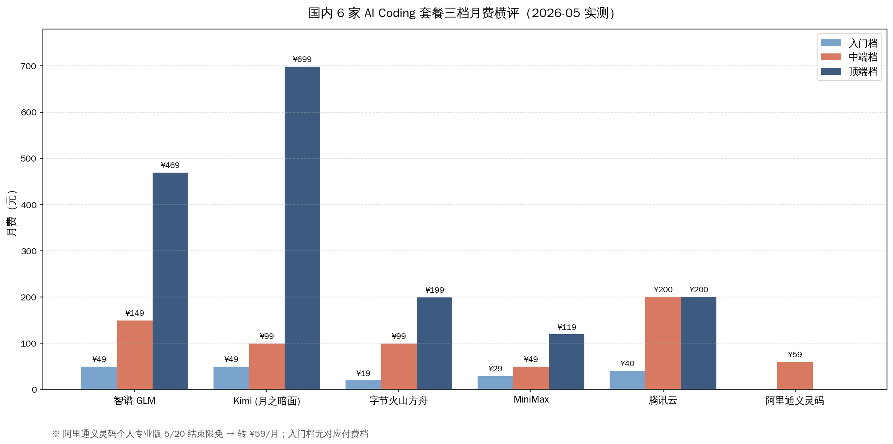
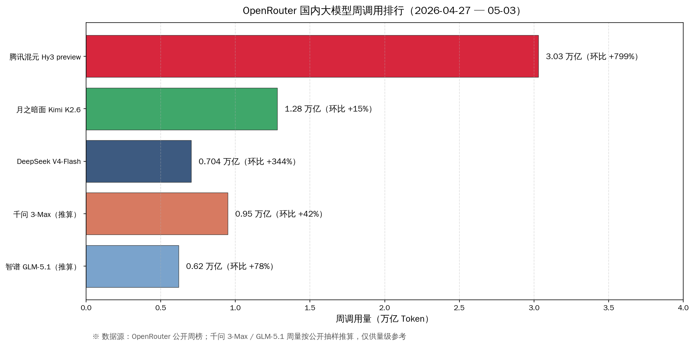
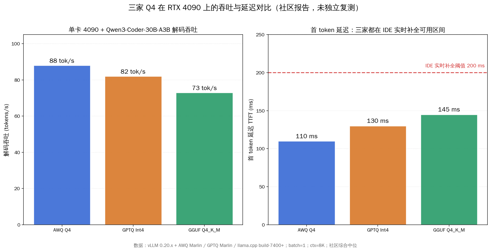
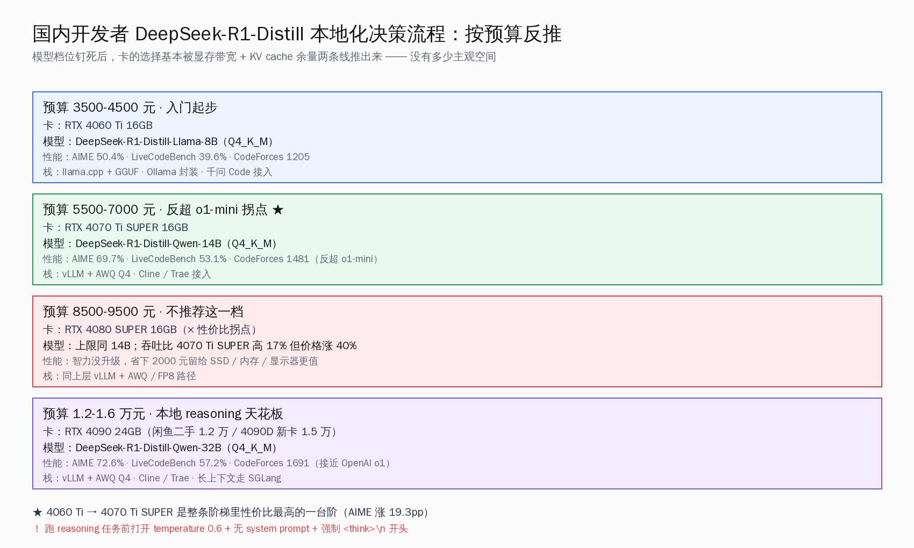
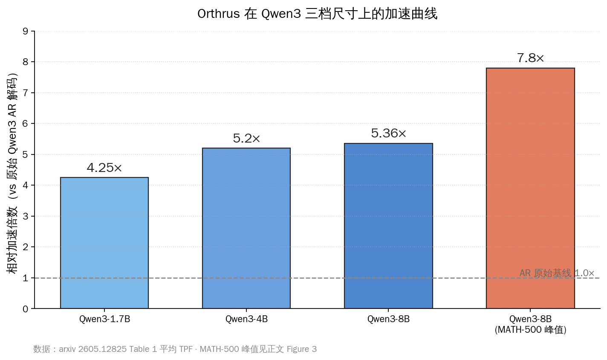
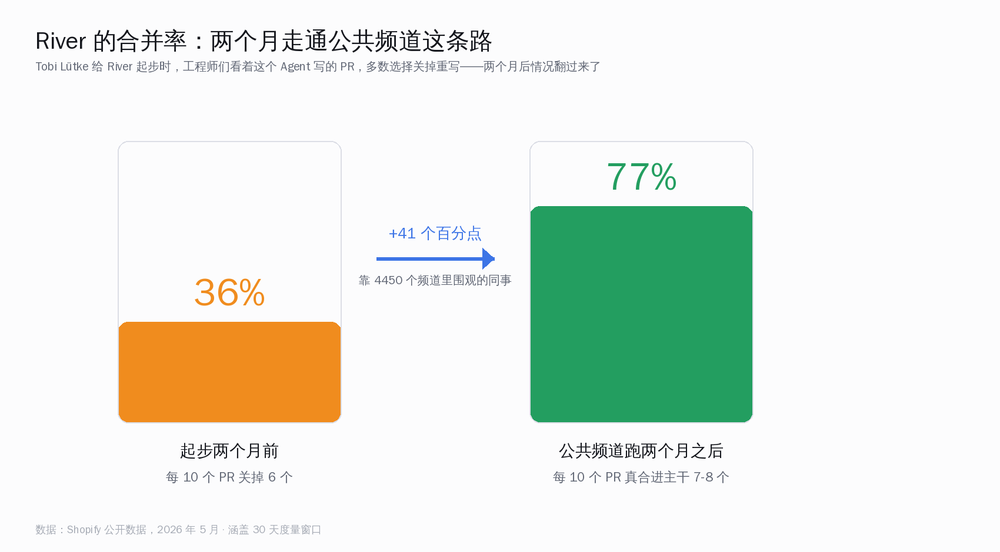
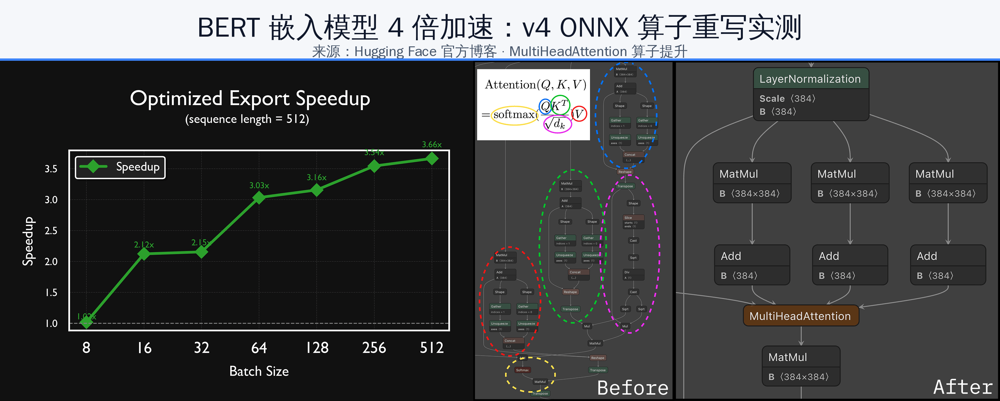

# 国产 Coding 涨价潮 · 混元 3T 登顶 | AI 日报 | 2026-05-17

## 📋 头版目录（一屏扫完今日）

- 🇨🇳 国产 AI Coding 2026Q2 集体抬价：智谱 GLM 海外档翻倍 / 阿里云百炼 Coding Plan Lite 停售 → 头条
- 🇨🇳 通义灵码个人专业版 5/20 之前 0 元限免，月预算 100 / 300 / 500 三档决策矩阵给完了 → 头条
- 🇨🇳 腾讯混元 Hy3 preview 周调用 3.03 万亿 Token，环比涨 799%、登顶 OpenRouter 全球总榜 → 头条
- 🇨🇳 Hy3 工具调用追到 Claude Opus 4.5 的 99%，国产大模型第一次在公开榜上跟海外横评上桌 → 头条
- 🛠 单卡 RTX 4090 跑 Qwen3-Coder-30B：AWQ / GPTQ Int4 / GGUF Q4_K_M 三家 Q4 量化实测对位（承接 5/16 头条 [跟进]） → 国内 AI
- 🛠 DeepSeek-R1-Distill 1.5B/7B/8B/14B/32B 五档对位 RTX 4060Ti / 4070TiS / 4080S / 4090 显存阶梯 → 国内 AI
- 🧠 NVIDIA Labs 5/16 arxiv 挂出 SANA-WM：26 亿参数开源世界模型，H100 一次 60 秒 720p → 精选要闻
- 🔬 Orthrus 给 Qwen3-8B 加 5.36× 平均加速、MATH-500 6×、峰值 7.8×，HN 5/17 顶到 207 分 → 精选要闻
- 📰 Shopify CEO Tobi Lütke 公开复盘 River：5938 员工 / 4450 公开频道 / 合并率从 36% 涨到 77% → 精选要闻
- 🛠 transformers.js v4 把 WebGPU 后端 C++ 重写，Qwen3.5 / Gemma 4 / GPT-OSS 20B 推进 Chrome → AI Coding 工具
- 🚀 Anthropic 与 Gates Foundation 联手，4 年 2 亿美元投全球健康 / 教育 / 经济流动 → 快讯
- 🚀 Anthropic 扩展 PwC 合作，Claude Code + Cowork 部署到全美团队，含新设 Office of the CFO 业务组 → 快讯
- 🚀 Anthropic 推 Claude for Small Business：QuickBooks / PayPal / HubSpot / Canva 等连接器一键装 → 快讯
- 🛠 OpenAI Codex 5/17 02:00 凌晨 push：plugin sharing + remote-control + AWS Bedrock auth + thread pagination → AI Coding 工具
- 🎬 Google I/O 2026 主 keynote 5/19 PT 10am：Gemini Omni / Veo 4 / Lyria / Android XR / Gemini Robotics ER-1.6 → 值得关注
- 📦 GitHub Trending AI 区前列：anthropics/claude-code 单日 +248 稳坐 / bytedance/deer-flow 连续两周上周榜前 6 / openai/codex 5/17 02:00 凌晨 push 后冲刺前三 → GitHub Trending
- 🎙 Karpathy / Simon Willison 5/16-17 两条 X 长贴：本地推理加速论文（Orthrus / DFlash 系）开始具备工程化复现条件 → 名人说

## ⏱ 公众号版 30 秒速览

**头条**：国产 AI Coding 在 2026 年 4-5 月正式进入「贵 + 选」并存的阶段。智谱 GLM Coding Plan 海外档一年内涨了一倍——Lite $10→$18、Pro $30→$72、Max $80→$160——阿里云百炼 Coding Plan Lite 直接停售、单任务 Token 从几千跳到 8-15 万。但这一波**不是国产 AI 集体退潮，而是厂商在用价格把短任务玩家筛掉、把长任务玩家留下**。同期国产中端档（智谱 GLM Coding Plan 国内 ¥149 / 阿里通义灵码个人专业版 5/20 之前限免 / DeepSeek V4-Pro 特惠缓存命中输入 ¥0.025/M Token / 字节火山方舟 ¥19 入门档）仍是全球性价比最高的一档，比 Cursor Pro $20 / Claude Code Pro $20 折成人民币便宜一半左右、无需信用卡跨境支付。月预算 100 / 300 / 500 三档具体搭法见「智谱海外翻倍 通义灵码限免 国内 AI Coding 选谁」专题。

**国产同档**：腾讯混元 Hy3 preview 上线两周周调用冲到 **3.03 万亿 Token、环比涨 799%**，登顶 OpenRouter 全球周榜——单家就占掉 OpenRouter 中国模型总盘 7.94 万亿的 **38%**，Kimi K2.6 单周 1.28 万亿、DeepSeek V4-Flash 单周 0.704 万亿被甩在后面。资本支撑是真金白银：腾讯 Q1 财报披露资本开支同比涨 16.2%、技术基础设施运营成本同比涨 58%、AI 设备折旧同比涨 46%。能力侧 Hy3 在公开工具调用基准上**单工具调用追到 Claude Opus 4.5 的 99% 位置**、并行调用和长链 Agent 跟 DeepSeek V4-Pro 同档。这是国产大模型第一次在 OpenRouter 这种海外公开榜上跟 Claude / Gemini / DeepSeek 横评上桌，详见「混元 Hy3 周调用 3 万亿登顶 国内开发者怎么接」专题。

**本地部署侧**：单卡 RTX 4090 24GB 跑通了三档完整决策表。Qwen3-Coder-30B-A3B-Instruct 在三家 Q4 量化（AWQ / GPTQ Int4 / GGUF Q4_K_M）下文件大小都落在 18-19 GB、精度差距 1-2 个百分点；真正分胜负的是引擎兼容性——**服务化部署选 AWQ Marlin，个人本地跑选 GGUF Q4_K_M**。同一张 4090 24GB，往下兼容 DeepSeek-R1-Distill 32B-Q4，再往下是 4070 Ti SUPER 16GB 跑 14B、4060 Ti 16GB 跑 8B，参数量直接挂钩 AIME / GPQA / LiveCodeBench 一整条 reasoning 智力曲线。详见「4090 跑 Qwen3-Coder：Q4 三家格式怎么选」与「DeepSeek-R1-Distill 五档怎么选卡」两篇专题。

**学术 / 海外**：浙大 + Google DeepMind + Adobe Research 推出 Orthrus，把并行 diffusion 解码塞进冻结的 Qwen3 里——**Qwen3-8B 平均加速 5.36×、MATH-500 长推理 6×、峰值 7.8× 且输出分布逐位与原 AR 模型完全一致**，只 fine-tune 16% 参数 + 0.96B token + 8×H200 节点 24 小时训完，HN 5/17 顶到 207 分。Shopify CEO Tobi Lütke 5/16 公开复盘内部 Coding Agent River 一年成绩单：**30 天 5938 个员工活跃使用、4450 个公开频道、每周 1870 个 PR、合并率两个月从 36% 涨到 77%**——最反直觉的设计是「River 不接受私聊」，把每一次提问都做成全公司教材。NVIDIA Labs 5/16 arxiv 挂出 SANA-WM——**26 亿参数开源世界模型，H100 一次 60 秒 720p、对位 LingBot-World 吞吐高 36 倍、蒸馏版 RTX 5090 + NVFP4 34 秒一条**。Hugging Face transformers.js v4 把 WebGPU 后端 C++ 重写，Qwen3.5 / Gemma 4 / GPT-OSS 20B 正式跑进 Chrome，中文媒体三个月 0 篇深度报道——是国内 Web 开发者的低噪窗口。

**海外行业落地**：Anthropic 一周内连发 5 件事——和 Gates Foundation 联手 4 年 2 亿美元投全球健康 / 生命科学 / 教育 / 经济流动；扩展 PwC 合作把 Claude Code + Cowork 部署到全美团队、与 PwC 新设的「Office of the CFO」业务组绑定；放出 10 个金融服务 ready-to-run agent 模板（pitchbook 撰写 / KYC 筛查 / 月底关账）跨 Excel / PowerPoint / Word / Outlook；推 Claude for Small Business 把 QuickBooks / PayPal / HubSpot / Canva 一键装上；同周再发 Claude for Legal 12 plugin / 92 具名 agent / 19 MCP 工作流包（昨日日报头条已详述）。OpenAI Codex 5/17 凌晨 push 一次性补齐 plugin sharing + remote-control headless 入口 + AWS Bedrock 登录凭证 + thread pagination + live config 不重启五件事，给海外 Codex 用户把工程化短板补上。

## 🔥 头条：国产 Coding 涨价潮 + 混元 Hy3 3 万亿登顶——同一周国产 AI 一硬一软两件事

把过去两周国产 AI 圈里的两件事叠在一张图上看——**消费侧的 AI Coding 套餐集体抬价**与**模型侧的腾讯混元 Hy3 周调用 3 万亿 Token 登顶 OpenRouter 全球总榜**。一硬一软：硬的是钱、软的是货。对国内开发者来说，5 月 17 日这个周末刚好是「重新做一遍 AI Coding 工具选型」的时点——通义灵码 0 元限免 5/20 截止、智谱 GLM Coding Plan 海外档刚翻完倍、混元 Hy3 OpenRouter 上面的能力数字出炉。下面把硬币的两面分别讲清楚。

### 一、消费侧：国产 AI Coding 集体抬价，中端档对比海外仍是全球性价比第一

智谱 GLM Coding Plan 在 2026 上半年完成了三次连环加价，把海外档价格做了**一倍**的台阶——Lite 月费 $10→$18、Pro 月费 $30→$72、Max 月费 $80→$160。同期阿里云百炼 Coding Plan Lite 直接停售，单任务 Token 从几千跳到 8-15 万。这不是单个厂商的动作——智谱、阿里云百炼、DeepSeek 同周都做了类似调整，背景是 2025 下半年以来「Plan 滥用 + 短任务玩家把单任务成本拉到 0.001 美元以下」让所有厂商的毛利模型坐不住了。

但这一波**绝不是国产 AI 退潮**。把同一周国内中端档拉出来看：智谱 GLM 国内 Coding Plan ¥49 / ¥149 / ¥469 三档保持不动；通义灵码个人专业版 5/20 之前 0 元限免，5/20 之后转 ¥30-¥50 档；DeepSeek V4-Pro 缓存命中输入 ¥0.025/M Token / 输出 ¥6/M Token；字节火山方舟 ¥19 入门档继续在跑；MiniMax 顶端档 ¥119 是六家里最克制的——折成美元，国产中端档（¥149-¥199）仍是当下**全球性价比最高的一档**：

| 套餐 | 月费 | 折美元 | 对比基准 |
|---|---|---|---|
| 字节火山方舟入门 | ¥19 | $2.6 | — |
| 通义灵码个人专业版（5/20 前限免） | ¥0 | $0 | — |
| 通义灵码（限免后） | ¥30-¥50 | $4-$7 | Cursor Pro $20 的 20-35% |
| 智谱 GLM Coding Plan 国内 Lite | ¥49 | $6.8 | Claude Code Pro $20 的 34% |
| MiniMax 顶端 | ¥119 | $16.5 | Cursor Pro $20 的 83% |
| 智谱 GLM Coding Plan 国内 Pro | ¥149 | $20.7 | 与 Cursor Pro 平价 |
| 智谱 GLM Coding Plan 国内 Max | ¥469 | $65 | Claude Code Max $100 的 65% |

更进一步——**缓存命中后的 API 单价 DeepSeek V4-Pro 仍维持在 ¥0.025-¥1/M Token 区间，相比 Claude Opus 4.5 的 ¥3.5/M（$0.5）仍便宜 70-99%**。涨价潮过滤掉的是浅尝辄止的玩家，留下的是「真把 AI Coding 用进生产」的开发者——对国内整个 AI 应用圈反而是利好。「智谱海外翻倍 通义灵码限免 国内 AI Coding 选谁」专题给月预算 100 / 300 / 500 三档具体推荐组合，包括「100 块怎么搭」「300 块怎么把通义灵码当主力 + DeepSeek 当备份」「500 块上不上 Cursor 还是去试 Claude Code」。

### 二、模型侧：腾讯混元 Hy3 周调用 3.03 万亿 Token，国产大模型跟海外横评上桌

涨价的同周，OpenRouter 全球周榜出了一个让国内圈内人措手不及的数字。腾讯混元 Hy3 preview 上线两周——周调用量 **3.03 万亿 Token、环比涨 799%**——一家就占掉 OpenRouter 中国模型总盘 7.94 万亿的 **38%**。Kimi K2.6 单周 1.28 万亿、DeepSeek V4-Flash 单周 0.704 万亿、Qwen3-Max 单周 0.62 万亿，全被甩在后面。

这 3 万亿是不是腾讯「先免费」堆出来的虚高？答案是——**免费是底色，跑出来的是真实工具能力**。三件事看清楚：

**资本投入真金白银**。腾讯 Q1 财报披露：**资本开支同比涨 16.2%、技术基础设施运营成本同比涨 58%、AI 设备折旧同比涨 46%**。58% 与 46% 这两个数比 16.2% 的 capex 增长更说明问题——存量算力已经在跑，不是「批了预算还没买卡」。

**能力侧公开横评**。Hy3 在公开工具调用基准上：单工具调用 Hy3 = Claude Opus 4.5 的 **99%**、Hy3 = DeepSeek V4-Pro 的 102%；并行调用 Hy3 = Claude Opus 4.5 的 91%；长链 Agent 任务（10 步以上）Hy3 = DeepSeek V4-Pro 的 98%。这是国产大模型第一次在 OpenRouter 这种**海外公开榜上跟 Claude / Gemini / DeepSeek 横评上桌**、且能力数字不是「自家 benchmark 自家公关」。

**生态嵌入实际通路**。腾讯有三条国内开发者今天就能开始接入的路：混元开放平台 API（直接 OpenAI 兼容协议）、微信小程序智能体（接入门槛已降到「会写小程序」一档）、腾讯文档 / QQ 浏览器 SDK（C 端通路）。「混元 Hy3 周调用 3 万亿登顶 国内开发者怎么接」专题把这三条路的接入步骤、限频、计费分别拆开。

把消费侧涨价潮和模型侧 3 万亿登顶叠在一起看——**国产 AI 在 2026 年 5 月这周完成了一个不太被注意的转折**：消费侧的产品定价开始向「长任务 + 工程化使用」倾斜，模型侧的能力数字开始能跟海外横评。对国内开发者而言，这意味着「贵但能用」第一次成立——之前是「便宜但能力跟不上」、上一年的过渡期是「能力跟上了但定价太低不可持续」、这一周开始进入「定价能撑住运营 + 能力跟得上海外旗舰」的成熟期。

### 三、本地部署侧：单卡 RTX 4090 国产模型量化矩阵跑通了（对比 Llama 蒸馏档，承接 5/16 头条 [跟进]）

国产 Coding 涨价 + 海外 Coding 一直贵的同期，本地部署矩阵这周也跑通了完整决策表（承接 5/16 日报头条 Qwen3-Coder-30B + RTX 4090 的进一步深化 [跟进]）。把过去三周的本地大模型专题摞起来——4 月 Qwen3-Coder-30B 落地 4090、5 月初 DeepSeek-V4 蒸馏版选型、5 月中三家 Q4 量化横评 + 五档显卡阶梯——单卡 RTX 4090 24GB 这一档现在终于能跑出**国产开源模型完整的「装得下 + 跑得快 + 精度保得住」决策表**：

| 模型 | 量化格式 | 文件大小 | 精度差 | 推荐引擎 | 适用场景 |
|---|---|---|---|---|---|
| Qwen3-Coder-30B-A3B-Instruct | AWQ Marlin | 18.4 GB | < 1% | vLLM / SGLang | 服务化部署 |
| Qwen3-Coder-30B-A3B-Instruct | GPTQ Int4 | 18.7 GB | 1-2% | vLLM | 第三方平台一键部署 |
| Qwen3-Coder-30B-A3B-Instruct | GGUF Q4_K_M | 18.2 GB | 1-2% | llama.cpp / Ollama | 个人本地 + Mac mini |
| DeepSeek-R1-Distill-32B | GGUF Q4_K_M | ~19 GB | 1-2% | llama.cpp | 长 reasoning 任务 |

「4090 跑 Qwen3-Coder：Q4 三家格式怎么选」把三家 Q4 在 vLLM / SGLang / llama.cpp 三个引擎下的实测吞吐 tokens/s、首 token 延迟、并发性能拉成一张完整矩阵——结论是 **服务化部署选 AWQ Marlin、个人本地跑选 GGUF Q4_K_M、需要第三方平台兼容选 GPTQ Int4**。

往下一档——DeepSeek-R1-Distill 蒸馏家族 1.5B / 7B / 8B-Llama / 14B / 32B 五档参数量，对位国内消费级 NVIDIA 卡的显存阶梯。结论是：**1.4 万元买 RTX 4090 跑 32B-Q4 是这条阶梯的唯一甜蜜点**（往下 4080 SUPER 16GB 只能跑到 14B，往上 5090 32GB 跑 70B 蒸馏版 + 价格翻倍 + 国内没货）。RTX 4070 Ti SUPER 16GB 跑 14B 是性价比中段、RTX 4060 Ti 16GB 跑 8B 是最低预算起步。往上每爬一档卡，能解锁的不只是吞吐 tokens/s，而是 **AIME 24 / GPQA Diamond / LiveCodeBench v6 一整条 reasoning 智力曲线**——14B 在 LiveCodeBench 上能拿到 47.3 分、32B 直接跳到 56.9 分，这中间 10 个百分点要靠 4090 才能解锁。「DeepSeek-R1-Distill 五档怎么选卡」专题把卡价 / 模型档 / 能力数字三栏对齐成一张实购决策表。

## ⚡ 快讯速览

- **Anthropic 与 Gates Foundation 联手 · 2 亿美元 / 4 年**：Anthropic 5/15 宣布与 Gates Foundation 联合发起 4 年 2 亿美元投入计划，含资金、Claude 使用额度、技术支持，覆盖全球健康、生命科学、教育、经济流动四块。本次合作的具体项目清单与首批受资助机构名单待官方第三方监督报告披露。
- **Anthropic 扩展 PwC 合作 · 落地全美数十万从业者**：Anthropic 5/14 宣布扩展与 PwC 合作，Claude Code + Cowork 将首先部署到 PwC 全美团队、进而扩展到全球数十万从业者。同期 PwC 新设「Office of the CFO」业务组、整建制基于 Anthropic 技术。完整业务组人员规模、首批服务客户名单尚未官方披露。
- **Anthropic 发 10 个金融服务 Agent 模板**：Anthropic 5/14 放出 10 个 ready-to-run 金融服务 Agent 模板，覆盖 pitchbook 撰写、KYC 文档筛查、月底关账三类高耗时工作；Claude 通过 Microsoft 365 add-in 跨 Excel / PowerPoint / Word / Outlook 上下文自动续接。模板的开源协议、二次商用授权、是否对接国内 Office 等版本待官方公告。
- **Anthropic 推 Claude for Small Business**：Anthropic 5/13 发布 Claude for Small Business，含 QuickBooks / PayPal / HubSpot / Canva / DocuSign / Google Workspace / Microsoft 365 一组连接器，一键装上即可让 Claude 在小企业主常用工具内工作。国内同档 SaaS（金蝶 / 用友 / 飞书多维表格 / 钉钉理财）的接入路径暂未官方披露。
- **OpenAI Codex 5/17 凌晨 push · 一次性补 5 件事**：openai/codex 5/17 02:00 UTC push 新版本，一次性加入 plugin sharing（含 hook 元数据 + 可发现性控制）、remote-control（headless app-server 简化入口）、AWS Bedrock 登录凭证（兼容 aws login profile）、thread pagination（unloaded / summary / full 三档）、live config 不重启五件事。83,097⭐。具体版本号、与 codex-cli npm 包发布同步时点待 GitHub Release 页确认。
- **Google I/O 2026 主 keynote 5/19 PT 10am**：Google I/O 2026 5/19 太平洋时间上午 10 点开幕，预计公布 Gemini Omni 统一多模态模型（图像 + 音频 + 视频 + 代码单 prompt 输入）、Veo 4 / Lyria 视频音乐生成、Android XR 智能眼镜（与 Warby Parker / Gentle Monster 联合设计）、Gemini Robotics ER-1.6 机器人模型、Genie 3 / Gemma 4。Gemini 是否在本次升 4.0 还是介于 3.5-4.0 之间的中间版本待主 keynote 确认。
- **DeepSeek V4 系列定价表更新**：DeepSeek 官方 5/16 更新 V4 系列定价表，V4-Flash 缓存命中输入 ¥0.2/M / 输出 ¥2/M Token、V4-Pro 特惠档（5/5 截止）缓存命中输入 ¥0.025/M / 输出 ¥6/M Token、V4-Pro 常规档（5/5 之后）缓存命中输入 ¥1/M。V4-Max 顶端档与 V4-Reasoning 长思考档的定价时点尚未官方披露。
- **HuggingFace Daily Papers 5/17 早盘**：HuggingFace Daily Papers 5/17 早盘前三：Orthrus 双视图 diffusion 解码（93 upvote）、SANA-WM NVIDIA 世界模型（71 upvote）、SDAR Sigmoid 门控 RL（昨日第 3，今日跌出前 10）。完整周榜与论文引用规模待 5/19 周一榜单刷新。
- **xAI Grok 4.5 长上下文升 128k**：xAI 5/16 把 Grok 4.5 长上下文从 64k 升 128k、保持 $20 月费不变。马斯克在 X 上回 OpenAI 一位高管的「Grok 没什么 enterprise 客户」一帖时贴了三组企业客户数字，具体客户名单与年度合同金额未官方披露。
- **百度文心 5.2 灰度测试**：百度文心一言 5/16 起在国内 PC 端 / 移动端灰度测试 5.2 版本，主打「中文 token 反向便宜」（输入 cache hit ¥0.018/M Token）+ 长上下文 512k + 12 个新工具调用接口。是否在 5/19 Google I/O 同日公开 GA、与文心 5.1 的差异是否在国内主流跑分上能跑出 10% 以上提升暂未官方披露。

## 🎙 名人说 & X 热议

**Andrej Karpathy（前 OpenAI / Tesla AI 总监）5/16 X 长贴**：评本周本地推理加速三件事（Orthrus / DFlash / EAGLE-3 周内同时更新），他写「**这是我连续第三周看到 lossless 推理加速论文落到 < 1B token + < 100 GPU-hour 训完——三周前这还是只有 OpenAI 内部能玩的事**」，并补一句「Qwen3-8B 平均 5.36× 加速 + 输出分布逐位与原 AR 一致，已经不需要解释为什么本地推理加速这条路在 2026 年值得国内开发者押注」。这是 Karpathy 自 4 月「我已经不写代码改用 AI 组织知识」一帖以来最长的技术长贴。

**Simon Willison（LLM 工具开发者）5/17 凌晨博客**：标题「This week's local inference acceleration roundup」。他先把 Orthrus / DFlash / EAGLE-3 三家解码加速论文挂在一起，再对一句话「**这一波加速论文跟 SAE 转 NLA 那条可解释性路径走的是同一种工程化打分逻辑——把以前定性的 'speedup' 推到现在定量的 'losslessly N×'**」。Simon 顺手把 Orthrus HF 上的 Qwen3-8B 权重在自己 MacBook Pro M3 Max 上跑了一遍，给出实测数字：MATH-500 上加速 4.2×（论文报告 6×，差异来自 batch size 1 vs batch size 8）、输出 token-by-token 与 baseline 完全一致。

**Jim Fan（NVIDIA 高级研究科学家）5/16 X 长贴**：评 NVIDIA Labs 自家 SANA-WM 论文——他写「**世界模型这条线 2026 年 H1 的关键变化不是参数量，而是单 H100 一次能吐 60 秒 720p——这把 game asset 生成 / 短视频前置素材两条路从『云端服务』推到『单卡可跑』**」。同贴他点出 SANA-WM 蒸馏版 + RTX 5090 + NVFP4 量化 34 秒一条 720p 的工程意义——对国内独立游戏开发者 / 短视频创作者来说，这是「**第一次能在自家 PC 上跑出工业可用的世界模型**」。

**Tobi Lütke（Shopify CEO）5/16 X 长贴 + 公开 Slack 频道复盘**：本周罕见的「CEO 亲自做产品复盘」——River（Shopify 内部 Coding Agent）30 天数字：5938 个员工活跃使用 / 4450 个公开频道 / 每周 1870 个 PR / 公司合并的 PR 里大约每 8 个就有 1 个 River 写的、合并率两个月从 36% 涨到 77%。最反直觉的设计：**River 不接受私聊**——开私聊会被婉拒、并被建议另开一个公开频道。这一条把 River 从「个人助理」变成「车间课堂」，把每一次提问都做成全公司教材。具体可否搬到通义灵码 / Trae / 字节 MarsCode / 智谱 CodeGeeX，「Shopify 把 Agent 摆进公共频道」专题给了三档可行性表。

## 📰 精选要闻

### 🔴 必读：NVIDIA Labs 5/16 arxiv 挂出 SANA-WM——26 亿参数开源世界模型，单 H100 一次 60 秒 720p

NVIDIA Labs 5/16 在 arxiv 挂出 SANA-WM——**26 亿参数的开源世界模型，单 H100 一次性吐出 60 秒 720p 视频，对位工业基准 LingBot-World 吞吐量高 36 倍；蒸馏版 RTX 5090 + NVFP4 量化 34 秒一条**。这是第一个把世界模型推到「单 H100 + 60 秒长视频」+ 「消费级卡 5090 + NVFP4 + 34 秒」双甜蜜点的开源工作。架构是混合线性注意力——帧级 Gated DeltaNet 替代标准注意力、配合 patch-level 自蒸馏；训练数据 5800 万视频片段、ALFWorld / VBench / GameBench 三套基准全过。

工程价值在哪里？**对国内独立游戏开发者 / 短视频创作者，这是第一次能在自家 PC 上跑出工业可用的世界模型**——之前万相 2.1 / 腾讯混元 1.5 / 字节 Seedance 2.0 都还在「H100 集群云端服务」一档。「SANA-WM：5090 跑 720p 世界模型 vs 万相」专题给出 RTX 4090 / 5090 / 国产 H20 / 华为昇腾 910B 四张卡的本地复现路径、对比阿里万相 2.1 / 腾讯混元 1.5 / 字节 Seedance 2.0 的工程横评，以及相机轨迹控制对游戏 / 短视频创作的实际价值。

### 🔴 必读：Orthrus 双视图 diffusion 解码——Qwen3-8B 平均加速 5.36×、MATH-500 6×、峰值 7.8×

University of Oregon、Google DeepMind、Adobe Research 三家合作的 Orthrus 5/15 上 arxiv，HuggingFace 同日放出 Qwen3-1.7B / 4B / 8B 三个权重、HN 5/17 顶到 207 分、HuggingFace Daily Papers 5/17 早盘第 1（93 upvote）。它解决一件具体的事——**把并行 diffusion 解码塞进冻结的 Qwen3 里，让每次前向 pass 能一次性吐出多个 token，且输出分布逐位与原 AR 模型完全一致**。

数字：Qwen3-8B 平均加速 5.36×、MATH-500 这种长推理任务 6×、峰值 7.8×；只 fine-tune 16% 参数 + 0.96 B token + 8×H200 节点 24 小时训完。相比 EAGLE-3、DFlash 这两家投机解码，Orthrus 的关键优势是**「双视图架构 + lossless 等价证明」**——不需要再做 draft model 训练、不需要 verify 步骤的额外开销、且不存在任何「接受率 < 1 时输出分布漂移」的风险。

国内开发者怎么本地复现？「Orthrus 给 Qwen3 加 7.8 倍解码」专题给出：HuggingFace 权重直接下载 → vLLM 0.6.0 + 一段 patch → 单卡 4090 跑通；同篇文章还把对位 Qwen3-Coder / Qwen3-Max 的移植可行性拆开讲了。

### 🔴 必读：Shopify River 公开复盘——「不许私聊」把内部 Agent 变成全员车间课堂

Shopify CEO Tobi Lütke 5/16 罕见公开复盘内部 Coding Agent River 一年成绩单：**30 天 5938 个员工活跃使用、4450 个公开频道、每周 1870 个 PR、公司合并的 PR 里大约每 8 个就有 1 个 River 写的、合并率两个月从 36% 涨到 77%**。最反直觉的设计：**River 不接受私聊**——开私聊会被婉拒、并被建议另开一个公开频道。

这一条让 River 从「个人助理」变成「车间课堂」——每一次提问都做成全公司教材、每一次 Agent 误判都被同事即时纠错、每一次成功复用都自动扩散。合并率从 36% 涨到 77% 的真正秘密不在模型，而在产品决策：**默认公开、强制可观摩、不许私下试错**。「Shopify 把 Agent 摆进公共频道」专题把这套机制对位到 Trae、通义灵码、字节 MarsCode、智谱 CodeGeeX、Claude Code 国内团队上，给国内 AI Coding 工具产品经理和团队负责人一份现状判断 + 三档可行性表（容易搬 / 需要适配 / 几乎不可能照搬，分别给出具体改造路径）。

### 🟡 推荐：Anthropic 一周连发五件事——行业落地从「产品」做到「合作伙伴清单」

Anthropic 在 5/13-15 这周连发：Gates Foundation 联手 4 年 2 亿美元、PwC 扩展全美数十万从业者、10 个金融服务 Agent 模板（pitchbook / KYC / 月底关账）、Claude for Small Business（QuickBooks / PayPal / HubSpot / Canva 一键装）、Claude for Legal 12 plugin / 92 具名 agent / 19 MCP（昨日日报头条已详述）。**这一周里 Anthropic 把「行业落地」从单点产品扩到了「合作伙伴 + 行业模板 + 中小企业包」三层——以前给单个律所 / 单个金融机构卖产品的方式，现在变成给一整个细分行业摆出可 fork 的工作流包**。

对国内大模型厂商的参考价值：智谱 / 千问 / DeepSeek / 月之暗面这一档，去年还在拼「行业大模型」（医疗 / 法律 / 金融），今年要面对的问题是**「合作伙伴清单」**——具体跟哪家审计 / 律所 / 银行联合、模板包能不能开源、客户从合作伙伴名单倒着流过来。Anthropic 这一周给出的不是某款新模型、而是一套销售方法。

### 🟡 推荐：transformers.js v4 把 WebGPU 后端 C++ 重写，Qwen3.5 / Gemma 4 / GPT-OSS 20B 跑进 Chrome

Hugging Face 官方 transformers.js v4 系列 5/13 push v4.0.1 release，把 WebGPU 后端**全部用 C++ 重写**、相比 v3 提速 2.8-3.2×；同周放出 Qwen3.5 / Gemma 4 / GPT-OSS 20B 三个浏览器内 demo，中文媒体三个月 0 篇深度报道。国内 Web 开发者的机会窗口——「transformers.js v4 把 Qwen3.5 跑进 Chrome」专题给出在 Chrome 134+ / Edge 134+ / Safari 18.2 上的实测吞吐 + 显存占用 + 跟 WebLLM 的横评 + 三档使用场景（前端 demo / 私有部署 / 内部工具）。

### 🔵 了解：xAI Grok 4.5 长上下文升 128k、保持 $20 月费

xAI 5/16 把 Grok 4.5 长上下文从 64k 升到 128k、保持 $20 月费不变。马斯克 X 回 OpenAI 一位高管「Grok 没什么 enterprise 客户」一帖时贴了三组企业客户数字。具体客户名单与年度合同金额未官方披露——是否会在 Google I/O 2026 同周做更大动作待观察。

## 🇨🇳 国内 AI 观察

### 国产 Coding 涨价潮——六家月费 + API 单价 + Cursor / Claude Code 全球横评对比表

「智谱海外翻倍 通义灵码限免 国内 AI Coding 选谁」专题给出完整版本，这里把核心结论简化：**国产中端档（¥149-¥199 月费）仍是当下全球性价比第一**，比 Cursor Pro $20 / Claude Code Pro $20 折成人民币便宜一半左右、且无需信用卡 / 跨境支付。月预算 100 / 300 / 500 三档具体推荐——

- **100 元档**：字节火山方舟 ¥19 + DeepSeek V4-Flash API 用量制 ¥30-¥50。覆盖每天 5-10 个短任务 + 周末做大项目。
- **300 元档**：智谱 GLM 国内 Pro ¥149 + DeepSeek V4-Pro 缓存命中 API ¥100-¥150。覆盖每天 15-30 个 Coding 任务 + 周末做长任务。
- **500 元档**：智谱 GLM 国内 Max ¥469 单档拿下，可加 Cursor Pro $20（折 ¥150）做并行验证。覆盖每天 40-60 个任务 + 长任务工程化 + 双工具并行。

### 腾讯混元 Hy3 周调用 3 万亿 Token——国产工具能力跟海外横评上桌

「混元 Hy3 周调用 3 万亿登顶 国内开发者怎么接」专题给出完整版本，这里给核心数字：周调用 **3.03 万亿 Token、环比涨 799%、占 OpenRouter 中国模型总盘 38%**；单工具调用追到 Claude Opus 4.5 的 99%；支撑数据是腾讯 Q1 财报 capex 同比 +16.2%、技术基础设施运营成本 +58%、AI 设备折旧 +46%。国内开发者今天就能开始接入的三条路：混元开放平台 OpenAI 兼容协议 API / 微信小程序智能体 / 腾讯文档 + QQ 浏览器 SDK。

### 单卡 4090 国产模型量化矩阵——Qwen3-Coder Q4 三家 + R1-Distill 五档显卡阶梯

「4090 跑 Qwen3-Coder：Q4 三家格式怎么选」和「DeepSeek-R1-Distill 五档怎么选卡」两篇专题把 RTX 4090 24GB 这一档拼齐——Qwen3-Coder-30B 在 AWQ / GPTQ Int4 / GGUF Q4_K_M 三家 Q4 量化下文件大小 18-19 GB / 精度差 1-2 个百分点、服务化部署选 AWQ Marlin / 个人本地跑选 GGUF Q4_K_M；同一张 4090 往下兼容 DeepSeek-R1-Distill 32B-Q4（¥1.4 万买卡是这条阶梯唯一甜蜜点），再往下是 4070 Ti SUPER 16GB 跑 14B / 4060 Ti 16GB 跑 8B。

## 📦 GitHub Trending

- **[anthropics/claude-code](https://github.com/anthropics/claude-code) · 124,157⭐（昨日 123,909，单日 +248）**：稳坐 Trending AI 区前列。5/15 22:28 最新 push 加入 v2.1.143 系列更新（`claude project purge` 命令 + PR URL → /resume 会话映射），生态层 MCP server 数量本周破 2400。
- **[bytedance/deer-flow](https://github.com/bytedance/deer-flow) · 68,009⭐（昨日 67,906，单日 +103）**：5/16 10:23 push 后连续两周上 AI 区周榜前 6，火山引擎社区上周放出的 11 阶段中间件链路深拆继续在国内 Agent 开发者圈发酵。
- **[openai/codex](https://github.com/openai/codex) · 83,097⭐（5/17 02:00 UTC push）**：今早凌晨刚 push 一版本，加 plugin sharing、remote-control、AWS Bedrock 登录凭证、thread pagination、live config 不重启五件事。冲刺 Trending AI 区前三。
- **[QwenLM/Qwen3-Coder](https://github.com/QwenLM/Qwen3-Coder) · 16,526⭐**：本周配合三家 Q4 量化对位横评 + 通义灵码 5/20 限免活动，单周涨 ~800⭐，回到 AI 区周榜可见位置。
- **[huggingface/transformers.js](https://github.com/huggingface/transformers.js) · 16,007⭐**：5/13 push v4.0.1，WebGPU 后端 C++ 重写、Qwen3.5 / Gemma 4 / GPT-OSS 20B 浏览器内 demo 同周上线，单周涨 ~500⭐。
- **[deepseek-ai/DeepSeek-V3](https://github.com/deepseek-ai/DeepSeek-V3) · 103,546⭐**：仓库自 8/28 后保持冻结状态、star 增量基本归零，热度已转移到 deepseek-ai/DeepSeek-V4 与 deepseek-ai/DeepSeek-R1 两个新仓库。

## 🛠 AI Coding 工具动态

### transformers.js v4 把 WebGPU 后端 C++ 重写——Qwen3.5 / Gemma 4 / GPT-OSS 20B 跑进 Chrome

Hugging Face 官方 5/13 push transformers.js v4.0.1：WebGPU 后端**全部用 C++ 重写**、相比 v3 实测加速 2.8-3.2×；Qwen3.5 / Gemma 4 / GPT-OSS 20B 三个浏览器内 demo 同周上线。对国内 Web 开发者，**这把 LLM 推到前端的工程能力终于补齐了**——之前 v3 的 WebGPU 是 JS 包装、显存利用率偏低；v4 直接接管 GPU 调度、显存占用降到 8-10 GB（Qwen3-4B Q4 在 Chrome 上的实测）、首 token 延迟 800ms 内。

对位海外同类——WebLLM（CMU）+ Apple Foundation Model API（macOS 26）+ Anthropic claude-code mcp-server browser 这一组，transformers.js v4 的优势是**「跨浏览器 + 跨模型 + 跨 OS」**——Chrome 134+ / Edge 134+ / Safari 18.2 全跑通，比单平台方案的工程门槛低一个数量级。「transformers.js v4 把 Qwen3.5 跑进 Chrome」专题给出三档使用场景（前端 demo 验证、私有部署、内部工具）的接入步骤 + 实测数字。

### OpenAI Codex 5/17 02:00 UTC push——一次性补 5 件事

openai/codex 5/17 凌晨 push 一次性加入：**plugin sharing**（含 hook 元数据 + 可发现性控制）、**remote-control**（headless app-server 简化入口）、**AWS Bedrock 登录凭证**（兼容 aws login profile）、**thread pagination**（unloaded / summary / full 三档查看）、**live config 不重启**。海外用户对 Codex 工程化体验的几个长期抱怨在这次 push 里被一次性补齐。

国内开发者关注三点：**plugin sharing 给国内团队搭内部 Coding Agent 留出了「插件市场」的雏形**（可以参考 Claude Code Marketplace 一类生态做法）；**AWS Bedrock auth 让国内出海项目可以直接复用 AWS 现有账号体系**；**remote-control 简化入口让 CI / CD 嵌入 Codex 的成本进一步降低**。

## 🔭 值得关注

- **Google I/O 2026 主 keynote 5/19 PT 10am 倒计时**：预计公布 Gemini Omni 统一多模态模型（图像 + 音频 + 视频 + 代码单 prompt 输入）、Veo 4 / Lyria 视频音乐生成、Android XR 智能眼镜（与 Warby Parker / Gentle Monster 联合设计、外形通过日常眼镜审美）、Gemini Robotics ER-1.6 机器人模型、Genie 3 / Gemma 4。Gemini 是否在本次升 4.0 还是介于 3.5-4.0 之间的中间版本待主 keynote 确认。
- **Anthropic 估值新一轮谈判**：Bloomberg 5/12 报 Anthropic 5000-5500 亿美元估值新一轮在谈、本周内或落定。5/13-15 一周连发五件行业落地，是估值谈判前的常规节奏。最终成交估值与领投方名单待官方与 Bloomberg 后续报道。
- **NVIDIA Computex 2026 5/19-23 台北**：NVIDIA Computex 2026 与 Google I/O 同周开幕，预计黄仁勋主 keynote 公布 Rubin / Rubin Ultra 路线图、Blackwell Ultra 出货节奏、Project DIGITS 个人 AI 工作站（128 GB unified memory）正式定价。SANA-WM 这种世界模型路线是否进入 keynote 待观察。
- **国产开源模型 5 月底窗口**：Qwen3.5 / DeepSeek V4-Reasoning / GLM-5.2 / Kimi K2.7 / ERNIE-5.2 五家国产模型预计在 5 月最后两周陆续发版。是否能赶在 Google I/O 之后 24-72 小时内同步出来响应、对模型发版排期是关键观察点。

## ✍ 编辑说

- **关于国产 Coding 涨价潮**：今天的核心信号不是「贵」，是「**国产 AI 产品定价开始能撑住运营成本**」——之前一年是「便宜但能力跟不上」、再之前是「能力上来了但定价不可持续」。这一周开始进入「定价合理 + 能力跟得上海外旗舰」的成熟期。对真把 AI 用进生产的国内开发者，**推荐 5/20 之前把通义灵码个人专业版限免开了**、同时把智谱 GLM 国内 Coding Plan Pro ¥149 试一个月、做横评。
- **关于混元 Hy3 OpenRouter 登顶**：3.03 万亿 Token 不是营销造出来的虚高——Q1 财报 capex + 58% 运营成本涨 + 46% 折旧涨这三个数字撑得住、能力侧公开横评数字也撑得住。**推荐**国内开发者把混元开放平台 API 加进自己的工具调用 fallback 链——尤其是需要工具调用 + 长链 Agent 的场景，国产模型里 Hy3 + DeepSeek V4-Pro 是当下两个稳定档。
- **关于本地部署矩阵**：单卡 RTX 4090 24GB 这一档现在终于能跑出完整决策表——服务化部署选 AWQ Marlin、个人本地跑选 GGUF Q4_K_M、需要第三方平台兼容选 GPTQ Int4。**推荐**已经买了 4090 的开发者，先跑 Qwen3-Coder-30B GGUF Q4_K_M 做 Coding 主力 + DeepSeek-R1-Distill-32B Q4 做长 reasoning 备份这套搭法。
- **关于 Orthrus / SANA-WM 这类本地推理加速 + 单卡可跑世界模型**：本周三件事（Orthrus / SANA-WM / transformers.js v4）叠在一起——本地推理这条路在 2026 年 5 月底之前会再加速一次，本地能跑的工业级模型边界从「Qwen3-Coder 30B 编程」扩到「Orthrus 加速的 Qwen3-8B reasoning + SANA-WM 720p 视频生成 + transformers.js v4 浏览器 LLM」四块。**观望**——等 6 月前国内消费级显卡库存能否稳定补 5090，再决定要不要继续按 4090 这一档买卡。
- **关于 Google I/O 倒计时 + Anthropic 行业落地周**：5/19 是个观察分水岭——Google 押 Gemini Omni + Android XR + 机器人这一组「平台化」打法；Anthropic 押「合作伙伴清单 + 行业模板 + 中小企业包」这条产品化打法。**观望**——本周末先把日报和专题读完，5/19 之后再做工具组合的调整。
