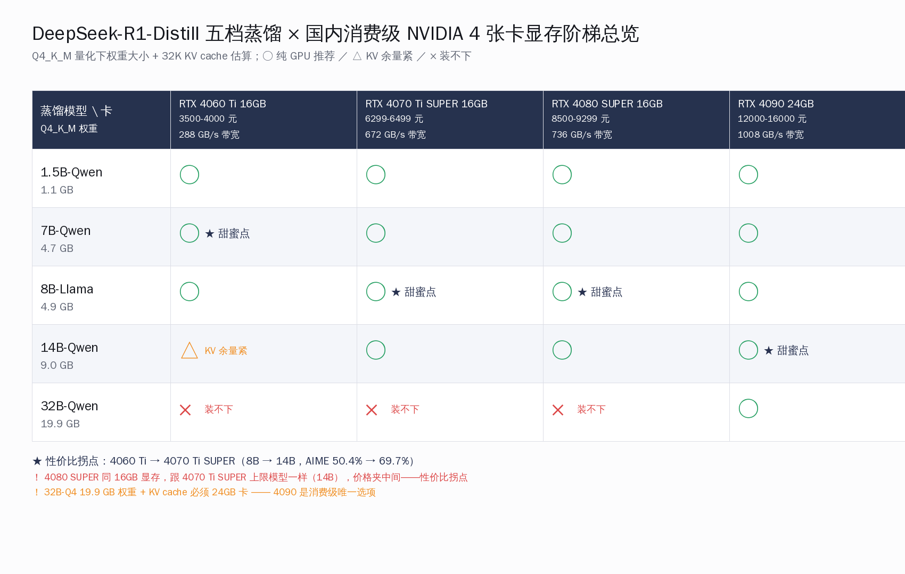
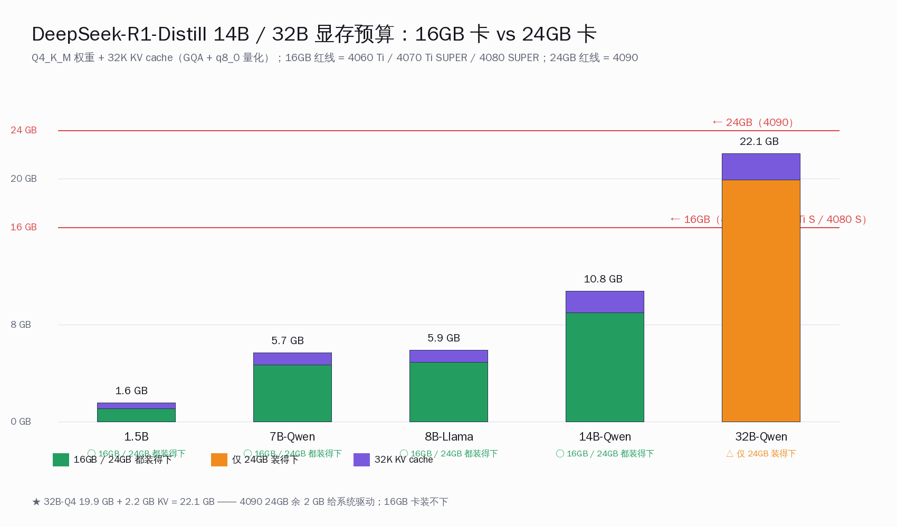
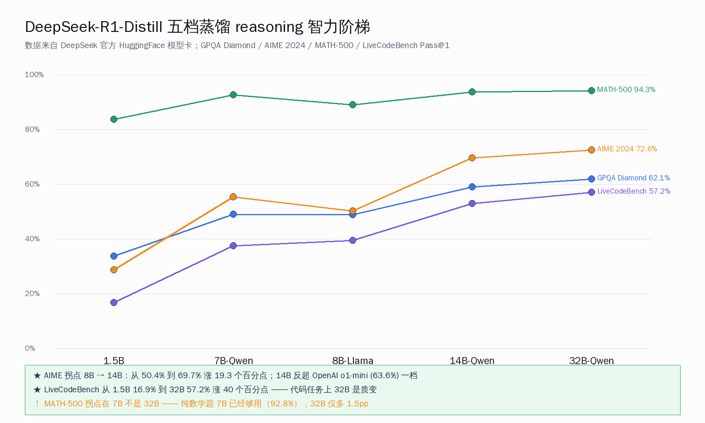
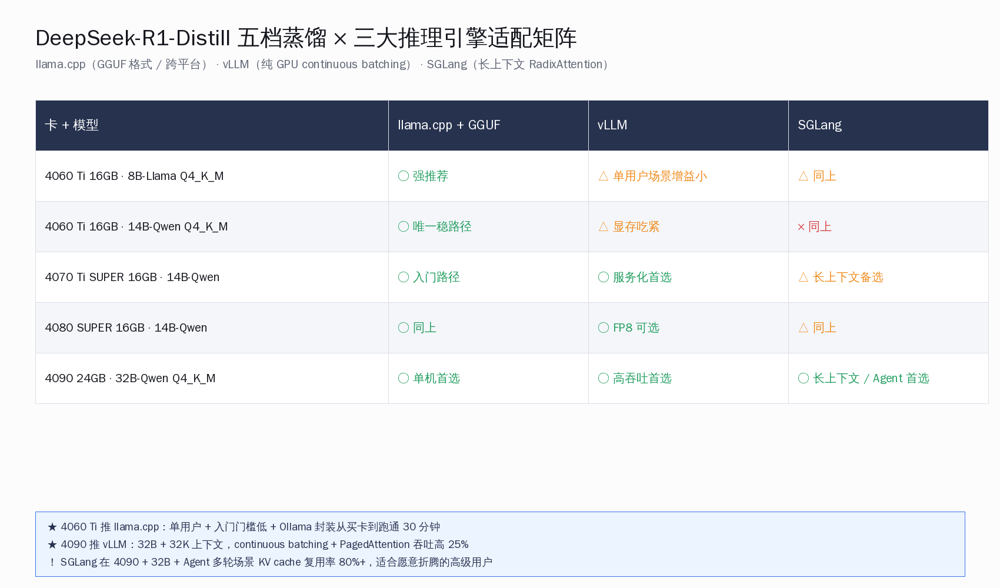

# DeepSeek-R1-Distill 五档怎么选卡


## 关键数字一览

| 项目 | 数字 |
|---|---|
| DeepSeek-R1-Distill-Qwen-1.5B 月下载（HuggingFace） | 581,625 |
| DeepSeek-R1-Distill-Qwen-7B 月下载 | 553,818 |
| DeepSeek-R1-Distill-Llama-8B 月下载 | 611,735 |
| DeepSeek-R1-Distill-Qwen-14B 月下载 | 534,106 |
| DeepSeek-R1-Distill-Qwen-32B 月下载 | 817,857 |
| DeepSeek-R1-Distill 五档 license | MIT |
| RTX 4060 Ti 16GB 国内行货价 | 3500-4000 元 |
| RTX 4070 Ti SUPER 16GB 国内行货价 | 6299-6499 元 |
| RTX 4080 SUPER 16GB 国内行货价 | 8500-9299 元 |
| RTX 4090 24GB 国内二手 / 4090D 新卡价 | 12000-13000 元（二手） / 15000-16000 元（4090D 新卡） |
| RTX 4060 Ti 16GB 显存带宽 | 288 GB/s |
| RTX 4070 Ti SUPER 16GB 显存带宽 | 672 GB/s |
| RTX 4080 SUPER 16GB 显存带宽 | 736 GB/s |
| RTX 4090 24GB 显存带宽 | 1008 GB/s |
| Q4_K_M 权重大小：1.5B / 7B / 8B-Llama / 14B / 32B | ≈1.1 GB / 4.7 GB / 4.9 GB / 9.0 GB / 19.9 GB |
| DeepSeek-R1-Distill-Qwen-32B AIME 2024 Pass@1 | 72.6% |
| DeepSeek-R1-Distill-Qwen-14B AIME 2024 Pass@1 | 69.7% |
| DeepSeek-R1-Distill-Qwen-32B GPQA Diamond | 62.1% |
| DeepSeek-R1-Distill-Qwen-32B LiveCodeBench Pass@1 | 57.2% |
| DeepSeek-R1-Distill-Qwen-32B CodeForces Rating | 1691 |
| 4090 + 32B Q4 实测吞吐（社区报告，未独立复测） | 30-38 tok/s |

## 一、为什么把蒸馏家族 5 档 + 4 张卡摆到一张地图上看

2026 年 5 月这个时间点，DeepSeek-R1 发布已经过去 16 个月，五个蒸馏版本（1.5B / 7B / 8B-Llama / 14B / 32B）在 HuggingFace 月下载合计超过 309 万次。32B 那一档单独月下载 81.7 万，比另外四档加起来还多。这条下载分布本身就是国内开发者用脚投票的答案——**他们最想跑的是 32B，不是 1.5B**。

但是国内 RTX 4090 24GB 这一档配置的工作站，到 5 月行货 4090D 1.5-1.6 万元、二手 4090 1.2-1.3 万元的预算门槛对很多人还是偏高。更现实的问题是：1 万元以下预算的 4060 Ti 16GB / 4070 Ti SUPER 16GB / 4080 SUPER 16GB 这三档卡，能不能跑得动 7B / 8B / 14B 蒸馏？跑下来 reasoning 任务的体感离 32B 差多少？这条阶梯上的每一台阶到底拉开多大智力差？

社区给的答案散落在几十个 reddit 帖、知乎专栏、B 站本地大模型 UP 主的实测视频里，没人把"五档蒸馏 × 四张卡 × 三类任务"这张完整地图画清楚。这一篇把它画出来。



总览看下来，结论比想象的硬：

- **4060 Ti 16GB（约 3500-4000 元）**：8B-Llama Q4 是甜蜜点，权重 4.9 GB + 32K KV cache 留下 9 GB 给系统驱动；14B-Q4 也能塞（9.0 GB 权重），但留给 KV cache 余量逼近极限
- **4070 Ti SUPER 16GB（约 6299-6499 元）**：14B-Q4 是甜蜜点，9.0 GB 权重 + 长上下文 KV cache 余量充足；8B 浪费、32B 装不下
- **4080 SUPER 16GB（约 8500-9299 元）**：跟 4070 Ti SUPER 同 16GB 显存档位，差距在显存带宽 736 vs 672 GB/s + 算力——14B-Q4 吞吐比 4070 Ti SUPER 高 15-20%，但 32B 同样装不下
- **4090 24GB（二手 1.2 万 / 4090D 1.5 万）**：32B-Q4 是唯一一档能纯 GPU 跑的卡，19.9 GB 权重 + 32K KV cache 留下 2-3 GB 给系统——这是把 R1 蒸馏家族最强 reasoning 模型本地化的起步价

把这条阶梯换个角度读：**从 4060 Ti 到 4090，预算翻 3-4 倍，能解锁的不是吞吐而是智力**——8B 的 AIME 50.4% → 14B 的 69.7% → 32B 的 72.6%，CodeForces Rating 从 1205 → 1481 → 1691。这个差距在 reasoning 任务上不是边际收益，是质变。

为什么 R1 蒸馏家族这条阶梯值得单独画？因为它跟一周前 5/16 那篇 Qwen3-Coder 30B 单卡量化对位的逻辑互补——Qwen3-Coder 是**单一模型 × 多档量化**，这一篇是**多档参数量 × 多张卡**。前者回答"4090 上选哪档量化"，本篇回答"什么预算买哪张卡跑哪档蒸馏"。两条阶梯叠起来，国内开发者本地化 reasoning 模型的决策树才完整。

还有一层背景值得讲清楚：**蒸馏 (Distillation) 这件事在 R1 这一代的产业意义**。DeepSeek 团队在 2025 年 1 月发布 R1 时同步开源了五档蒸馏权重，本质是把 671B 总参数的 R1 主模型（推理时激活 37B）通过 800K 高质量样本的监督微调，把 reasoning 链路压缩进 Qwen2.5 / Llama-3.1 这种成熟开源基座。这套蒸馏方法学的厉害之处在于——蒸馏出来的 32B 模型在 AIME 2024 上跑 72.6%，超过 OpenAI o1-mini 的 63.6% 一档；更小的 14B 蒸馏也跑到 69.7%，反超 OpenAI 闭源 reasoning 中端模型。这是 2025-2026 年开源 LLM 圈最有产业冲击力的一次蒸馏成果——它把"个人开发者本地跑 reasoning 模型"这件事的门槛从 H100 数据中心拉到了 4060 Ti 这种 3500 元入门卡。

国内开发者关注这条阶梯的动力还有一层：**数据驻留 + 成本可控 + 离线可用**。云端 API 在用 Cursor / Claude Code 这种工具时月费容易上 100-300 美元，对个人独立开发者是真实压力；本地化 R1-Distill 一次硬件投入 4000-13000 元就能解锁 90% 任务的 reasoning 能力，长期成本曲线完全可控。这也是 R1 蒸馏家族在 HuggingFace 月下载常年保持百万级的产业基本盘。

## 二、1.5B / 7B / 8B 三档小蒸馏：4060 Ti 16GB 也能跑

先看预算门槛最低的三档蒸馏。它们的共同特征是 Q4 量化后权重都在 5 GB 以内，4060 Ti 16GB 这张 3500-4000 元的入门卡也能纯 GPU 跑。

| 模型 | 总参 | Q4_K_M 权重 | 32K KV cache | 4060 Ti 16GB 余量 |
|---|---|---|---|---|
| DeepSeek-R1-Distill-Qwen-1.5B | 1.5B | ≈1.1 GB | ≈0.5 GB | 余 14 GB |
| DeepSeek-R1-Distill-Qwen-7B | 7B | ≈4.7 GB | ≈1.0 GB | 余 10 GB |
| DeepSeek-R1-Distill-Llama-8B | 8B | ≈4.9 GB | ≈1.0 GB | 余 10 GB |

权重大小是 Q4_K_M 估算值（参数量 × 0.6 字节 + 外层 embedding 高精度补偿）。1.5B 那一档跑在 4060 Ti 上等于浪费显存——这张卡的下限其实是 8B-Q4。

三档蒸馏的智力差并不小。根据 DeepSeek 官方在 HuggingFace 模型卡里贴的 benchmark：

| 模型 | GPQA Diamond | AIME 2024 Pass@1 | MATH-500 Pass@1 | LiveCodeBench Pass@1 | CodeForces Rating |
|---|---|---|---|---|---|
| 1.5B | 33.8% | 28.9% | 83.9% | 16.9% | 954 |
| 7B（Qwen2.5-Math） | 49.1% | 55.5% | 92.8% | 37.6% | 1189 |
| 8B-Llama | 49.0% | 50.4% | 89.1% | 39.6% | 1205 |

看这张表能得出几个不那么显然的结论：（一）**1.5B 在 LiveCodeBench 上只有 16.9%**，对实际写代码任务几乎不能用，它的用武之地仅限"在 4060 Ti / 笔记本上验证本地化路径走得通"；（二）**7B-Qwen 在 AIME 2024 上跑出 55.5%，跟 8B-Llama 的 50.4% 差 5 个百分点**——基座模型从 Qwen2.5-Math（专门数学预训练）切到 Llama-3.1-8B（通用模型）后，数学题反而掉了一档；（三）**8B-Llama 在 LiveCodeBench 上反过来比 7B-Qwen 高 2 个百分点**——Llama 基座的代码能力更强。

这三档蒸馏的真正分工是：

- **1.5B**：验证本地化路径的"先跑通"档位，1 万元以下笔记本 / 8GB 显卡入门
- **7B-Qwen**：纯数学 / 推理任务首选，预算 3500-4500 元（4060 Ti 16GB / 3060 12GB）
- **8B-Llama**：通用 reasoning + 代码任务首选，跟 7B 同卡型，看任务取舍

在 4060 Ti 16GB 上跑 8B-Q4 的实测吞吐，来自 FormulaMod 综合指南给的数字（**社区报告，未独立复测**）：Qwen3-8B-Q4 约 34 tok/s。R1-Distill-Llama-8B-Q4 在同卡上预期相近，因为推理瓶颈在 4060 Ti 那条 288 GB/s 显存带宽——任何 8B 类模型走 Q4 都受这条物理约束限制。

启动命令：

```bash
# DeepSeek-R1-Distill-Llama-8B 走 llama.cpp + GGUF Q4_K_M
./llama-server \
    -m DeepSeek-R1-Distill-Llama-8B-Q4_K_M.gguf \
    -ngl 99 \
    -c 32768 \
    --cache-type-k q8_0 --cache-type-v q8_0 \
    --temp 0.6 \
    --host 0.0.0.0 --port 8000

# 或者走 Ollama（命令更短，适合 4060 Ti 用户起步）
ollama pull deepseek-r1:8b
ollama serve  # 监听 localhost:11434
```

DeepSeek 官方推荐推理参数：**temperature 0.5-0.7（默认 0.6）+ 无 system prompt + 强制以 `<think>\n` 开头**——这三件事是 R1 系列出 reasoning 链路的关键。Qwen2.5-Math 基座的 1.5B / 7B 在数学题上还要在 user prompt 末尾加 "Please reason step by step, and put your final answer within \\boxed{}." 这一句激发完整思考链。

4060 Ti 16GB 这一档跑 8B 蒸馏的体感，按 r/LocalLLaMA 社区帖综合下来（**社区报告，未独立复测**）：30-40 tok/s 实时补全、首 token 延迟 100-200ms、长链推理（reasoning 段几千 token）每条要等 2-3 分钟。**对个人开发者 IDE 补全够用，但跑 SWE-Bench 这种长链 agent 任务效率太低**。这正是 4060 Ti 用户从这一档往上爬到 4070 Ti SUPER 14B 的最直接动机。

为什么 R1 蒸馏家族的体感跟普通 Qwen / Llama 不一样？关键差别在 reasoning token 占比——R1 在生成最终答案前会先输出几百到几千个 `<think>...</think>` 推理 token，这部分对终端用户不可见但要占吞吐。32K 上下文配置下，一次完整 reasoning + 答案输出可能花 5000-10000 token，普通 Qwen/Llama 同任务只要 500-1000 token。**这就是为什么 4060 Ti + 8B 跑 reasoning 任务感觉"慢"——不是单 token 吞吐慢，是总 token 数比预期多 5-10 倍**。

这条特性对 4060 Ti 用户的工作流影响非常具体：**适合"放着跑"不适合"等着用"**。把 reasoning 任务挂在后台，结合 IDE 提示音 / 系统通知做完成回调，跑 8B 蒸馏在 reasoning 任务上的等待感会被工程化掉。前台高频交互场景（实时补全 / 边写边问）更适合非 reasoning 模型（Qwen2.5-Coder-7B / 通义千问 7B），把 R1-Distill 留给"需要它真思考一遍"的硬题。

1.5B 这一档单独说两句。它在 LiveCodeBench 上只有 16.9%——基本没法用来写代码。但它在 MATH-500 上跑到 83.9%，比同尺寸通用 Qwen2.5-1.5B（约 60% 上下）高一档。这意味着 1.5B 蒸馏的真正用武之地是**数学辅助 + 教育场景**：在 4060 Ti / 笔记本 / 树莓派 5 这种入门设备上做"小数学家"角色——批改作业、出题、推导步骤。这是 R1 蒸馏家族最小档的合理边界，不要往 coding 任务上硬塞。

## 三、14B 档：4070 Ti SUPER / 4080 SUPER 16GB 的甜蜜点

把预算从 4060 Ti 的 3500-4000 元拉到 4070 Ti SUPER 的 6299-6499 元，能解锁的是 14B 蒸馏这一档——智力跳跃比单纯的吞吐提升大得多。

DeepSeek-R1-Distill-Qwen-14B 基于 Qwen2.5-14B 蒸馏出来，月下载 53.4 万，在 AIME 2024 上 Pass@1 跑到 **69.7%**。这个数字什么概念？OpenAI o1-mini 在同测试上是 63.6%——一个能塞进单卡 16GB 显存的开源蒸馏模型，在数学奥赛题上反超了 OpenAI 闭源 reasoning 模型一档。



14B-Q4_K_M 权重大小约 9.0 GB，加上 32K 上下文 KV cache 约 1.8 GB（GQA-8 配置 + q8_0 量化），整机 VRAM 占用约 11-12 GB。4070 Ti SUPER 16GB 余 4-5 GB，4080 SUPER 同 16GB 余量一样——**两张卡能跑的模型完全一样，差距在吞吐**。

横向对照看这条 14B 阶梯：

| 卡 | 价格（国内行货） | 显存带宽 | 14B-Q4 吞吐（社区报告，未独立复测） |
|---|---|---|---|
| RTX 4060 Ti 16GB | 3500-4000 元 | 288 GB/s | ≈22 tok/s |
| RTX 4070 Ti SUPER 16GB | 6299-6499 元 | 672 GB/s | ≈47 tok/s |
| RTX 4080 SUPER 16GB | 8500-9299 元 | 736 GB/s | ≈55 tok/s |
| RTX 4090 24GB | 12000-16000 元 | 1008 GB/s | ≈69 tok/s |

关键数字来自 FormulaMod 的 Qwen3-14B-Q4 测试外推（**未独立复测**）。R1-Distill-Qwen-14B 同样基于 Qwen2.5-14B 架构，相同量化下吞吐预期接近。

把这张表读两遍，**4060 Ti → 4070 Ti SUPER 这一跳是整条阶梯里性价比最高的台阶**：价格涨 65%（3500 → 6299），吞吐翻 2.1 倍（22 → 47 tok/s）。再往上 4070 Ti SUPER → 4080 SUPER 涨 40%（6299 → 8500），吞吐只多 17%（47 → 55 tok/s）；4080 SUPER → 4090 涨 40-50%（8500 → 12000+），吞吐多 25%（55 → 69 tok/s）但能升级到 32B 模型，这才是 4090 真正的价值。

为什么 4060 Ti 跑 14B 这么慢？因为 288 GB/s 显存带宽是这张卡的硬约束——它的 GDDR6 显存（不是 4070 Ti SUPER 的 GDDR6X）从设计上就是为游戏 1080p 优化的，不是为本地大模型设计的。每秒能搬到 SM 算的权重数据量只有 4090 的 28.6%。**对 14B 这种已经偏大的模型，288 GB/s 是吞吐天花板，不是软件优化能绕过去的物理约束**。

14B 这一档的 reasoning 体感比 8B 跳一档。AIME 2024 从 50.4%（8B-Llama）到 69.7%（14B）涨 19.3 个百分点，CodeForces Rating 从 1205 到 1481 涨 276 分。**这意味着 14B 能解决的题、写的代码，8B 解不开**。对国内做数学辅助 / Olympiad 训练 / 算法竞赛代码生成的开发者，14B 是真正的拐点档位。

启动命令：

```bash
# 4070 Ti SUPER / 4080 SUPER 跑 14B-Q4
./llama-server \
    -m DeepSeek-R1-Distill-Qwen-14B-Q4_K_M.gguf \
    -ngl 99 \
    -c 32768 \
    --cache-type-k q8_0 --cache-type-v q8_0 \
    --temp 0.6 \
    --host 0.0.0.0 --port 8000

# vLLM 路径（吞吐略高，适合服务化部署）
vllm serve deepseek-ai/DeepSeek-R1-Distill-Qwen-14B \
    --quantization fp8 \  # 或 awq，按硬件支持选
    --max-model-len 32768 \
    --gpu-memory-utilization 0.92 \
    --host 0.0.0.0 --port 8000
```

vLLM FP8 量化在 4070 Ti SUPER / 4080 SUPER 上要看驱动支持——FP8 推理在 Ada Lovelace 架构上能跑但 tensor core 加速不如 Hopper（H100），实际加速 1.2-1.5 倍，不到 H100 的 2 倍。对个人开发者，**llama.cpp + GGUF Q4_K_M 仍然是最稳的路径**——vLLM FP8 留给后续 5090 / RTX PRO 6000 这一代卡。

KV cache q8_0 量化对 14B 这档特别关键——32K 上下文 GQA-8 配置下默认 FP16 KV cache 约 3.6 GB，量化到 q8_0 减半到 1.8 GB，能给上下文扩展 / 多任务并发留出 2 GB 余量。这是 4070 Ti SUPER 16GB 用户能从软件层抠出来的最直接显存空间。

14B 这一档另一个被忽视的细节：**它是 reasoning 模型里"工作记忆"刚好够用的拐点**。R1-Distill 在做长链推理时会反复在 `<think>` 段里复述已得到的中间结论、回溯之前的假设——这套机制对模型的"工作记忆容量"要求很高。7B / 8B 在长链推理（>3000 reasoning token）时容易开始重复、跑偏；14B 这一档的工作记忆容量刚好够撑住 5000-8000 token 的完整 reasoning 链不丢失方向。这就是为什么 14B 在 AIME 2024（需要 8-15 步推理）从 8B 的 50.4% 一跳到 69.7%——不是单纯的参数量增大，是 reasoning 链长度容忍度的质变。

体感上看，4070 Ti SUPER + 14B 跟 4060 Ti + 8B 的差距比吞吐数字大：（一）同一道数学竞赛题，14B 第一次思考就对的概率比 8B 高 30%+；（二）写算法题时，14B 能自己写出测试用例验证再 debug，8B 通常只写完代码就停；（三）做 RAG 长文档问答时，14B 能跨段落综合，8B 经常局限在最相关那一段。**这些差距在 benchmark 数字上是 20 个百分点，在日常体感上是"能不能交付"的二元差**。

## 四、32B 档：4090 24GB 是唯一一档能纯 GPU 跑的卡

DeepSeek-R1-Distill-Qwen-32B 这一档是整个蒸馏家族的旗舰——AIME 2024 72.6%、GPQA Diamond 62.1%、MATH-500 94.3%、LiveCodeBench 57.2%、CodeForces Rating 1691。所有指标都比 OpenAI o1-mini 高一档，月下载 81.7 万次也证明社区把它当作"本地能跑的最强 reasoning 模型"。

但代价是 32B 在 Q4_K_M 下权重 19.9 GB，加上 32K 上下文 KV cache 约 2.2 GB，整机占用约 22-23 GB——**4060 Ti / 4070 Ti SUPER / 4080 SUPER 三张 16GB 卡全部装不下**。要纯 GPU 跑 32B-Q4，只有 4090 24GB 是消费级唯一选项。



把五档智力曲线摆到一起：

| 模型 | GPQA Diamond | AIME 2024 | MATH-500 | LiveCodeBench | CodeForces |
|---|---|---|---|---|---|
| 1.5B | 33.8% | 28.9% | 83.9% | 16.9% | 954 |
| 7B-Qwen | 49.1% | 55.5% | 92.8% | 37.6% | 1189 |
| 8B-Llama | 49.0% | 50.4% | 89.1% | 39.6% | 1205 |
| 14B-Qwen | 59.1% | 69.7% | 93.9% | 53.1% | 1481 |
| 32B-Qwen | **62.1%** | **72.6%** | **94.3%** | **57.2%** | **1691** |

读这张表能看出几个反直觉的细节：

**第一，MATH-500 这一项的拐点在 7B，不是 32B**：1.5B 的 83.9% 跳到 7B 的 92.8% 涨 9 个百分点，7B 到 32B 只涨 1.5 个百分点。**对纯数学题，7B 已经够用，没必要硬上 32B**——这是 1 万元以下预算用户的好消息。

**第二，LiveCodeBench 和 GPQA Diamond 的智力差最尖锐**：从 1.5B 的 16.9% 到 32B 的 57.2%，LiveCodeBench 涨了 40 个百分点；GPQA Diamond 涨了 28 个百分点。**对代码任务和深度科学推理，32B 是质变档位，14B 之前都是凑合**。

**第三，CodeForces Rating 1691 是什么概念**：相当于真实算法竞赛选手 Codeforces 评级 "蓝色" 段位——能解开 Div 2 D / E 题、Div 3 几乎全 AC，跟一个有 2-3 年训练经验的算法选手平级。这个评级 4090 24GB 本地能跑，不是 H100 数据中心的特权。

32B 在 4090 24GB 上的吞吐数字（**社区报告，未独立复测**）：30-38 tok/s。比同卡跑 14B 的 69 tok/s 慢了一半——19.9 GB 权重 + 4090 1008 GB/s 显存带宽，每秒能完成的 forward pass 次数自然减半。

启动命令：

```bash
# 4090 24GB 跑 32B-Q4
./llama-server \
    -m DeepSeek-R1-Distill-Qwen-32B-Q4_K_M.gguf \
    -ngl 99 \
    -c 32768 \
    --cache-type-k q8_0 --cache-type-v q8_0 \
    --temp 0.6 \
    --host 0.0.0.0 --port 8000

# vLLM 路径（服务化部署，单卡）
vllm serve deepseek-ai/DeepSeek-R1-Distill-Qwen-32B \
    --max-model-len 32768 \
    --gpu-memory-utilization 0.92 \
    --enforce-eager \
    --host 0.0.0.0 --port 8000
```

这里 `--enforce-eager` 是 DeepSeek 官方推荐 32B 单卡部署时打开的参数——避免 vLLM 在显存紧张时启动 CUDA Graph 失败。

那么 32B 想要更长上下文（64K / 128K）怎么办？4090 24GB 单卡余量已经被权重吃掉 20 GB，再扩 KV cache 到 64K（约 4.4 GB）整机占用就到 25 GB 突破红线。两条路：（一）开启 `--cache-type-v q4_0` 把 value KV 降到 4-bit，KV cache 再砍一半，64K 能塞回 24GB 内；（二）走双 4090 NVLink，48 GB 合计显存支持 128K-256K 长上下文。

对个人开发者，方案一是最务实的——KV value 量化到 4-bit 对 reasoning 长链质量影响在 1-2 个百分点以内，但能解锁的上下文长度翻倍。这件事 5/11 那篇 1M context 专题展开过更细的数字。

为什么 32B 是 DeepSeek 蒸馏家族的拐点档位？技术上看是参数量恰好够装下 R1 reasoning 链路所需的"思考模式"权重——3000 亿参数的 R1 模型用 800K 高质量样本蒸馏到 32B，把 reasoning 模式刚刚好压进 Qwen2.5-32B 的 fp16 权重空间。14B 之下蒸馏空间不够，更多的 reasoning 模式被丢弃；32B 之上对消费级硬件不友好，且边际收益对个人开发者不显著。

这个"32B 拐点"的判断在 r/LocalLLaMA 社区有共识：32B 蒸馏被普遍认为是"个人开发者能跑的最强 reasoning 模型"，捕捉了完整 R1 模型大约 90% 的 reasoning 能力（社区估算，未官方对照）。

把 32B 跟其他闭源 reasoning 模型横向放在一起看：

| 模型 | AIME 2024 Pass@1 | LiveCodeBench Pass@1 | CodeForces Rating |
|---|---|---|---|
| OpenAI o1-mini（闭源 · 云端） | 63.6% | ~50% | ~1600 |
| OpenAI o1（闭源 · 云端） | 74.4% | ~62% | ~1800 |
| DeepSeek-R1-Distill-Qwen-32B（开源 · 本地） | **72.6%** | **57.2%** | **1691** |

读这张表能得出一个反直觉判断：**R1-Distill-32B 这一档已经站在 OpenAI o1 和 o1-mini 中间**——比 o1-mini 强一档，离 o1 差一档但同档接近。考虑到 o1 是云端闭源 API 按 token 计费，而 R1-Distill-32B 是开源本地 Apache-2.0（实际是 MIT）一次性硬件投入，**性价比曲线对个人开发者完全倾向本地化**。

为什么 DeepSeek 的蒸馏方法能跑到这个水平？关键在它用的 reasoning 训练数据——800K 高质量样本不是简单的"问题-答案"对，而是"问题-完整 reasoning 链-答案"三元组。R1 主模型在生成这些样本时，会输出几百到几千 token 的真实推理过程；蒸馏到 32B 这种 dense 模型时，监督微调让小模型直接学会了 reasoning 链的展开模式。这是开源蒸馏路径在 2024-2025 年突然冒头的核心方法学突破——之前的蒸馏只学"答案"，R1 这一代是学"思考方式"。

对国内开发者，这件事最直接的意义是：**用 13000 元（4090 24GB 二手）一次性硬件投入，就能在自己机器上跑出接近 OpenAI o1 的 reasoning 能力**，且数据不出本地、不用按 token 付费、随时离线可用。这是 2025-2026 年开源 LLM 圈对个人开发者最大的一次基建升级。

## 五、推理引擎选型：llama.cpp / vLLM / SGLang 的位置

工程选型这件事单独拎出来讲一节。同一个 R1-Distill 模型，跑在 4 张消费卡上，到底选哪个推理引擎？



三个主流引擎的定位：

- **llama.cpp（GGUF 格式）**：CPU/GPU 混合、跨平台、量化方案最丰富（Q2 → Q8 共 13 档）。优势：装机门槛低（一条 `./llama-server` 命令）、显存调控精细（`-ngl` 调层数）、社区量化文件库（Unsloth / bartowski / TheBloke）覆盖最全。劣势：纯 GPU 吞吐略低于 vLLM
- **vLLM**：纯 GPU 推理、continuous batching、PagedAttention。优势：高并发吞吐（4090 上 R1-32B 比 llama.cpp 高 15-25%）、OpenAI 兼容 API 开箱即用、原生支持 FP8 / AWQ / GPTQ 等多种 GPU 量化方案。劣势：装机门槛比 llama.cpp 略高（要装 CUDA + 一堆 Python 依赖）、显存控制不如 GGUF 精细
- **SGLang**：纯 GPU 推理、RadixAttention（针对长上下文优化）。优势：长上下文 / 多轮对话场景吞吐比 vLLM 略高、对 reasoning 任务的 KV cache 复用做了专门优化。劣势：生态相对小、文档不如 vLLM 完整

按 4 张卡 × 5 档蒸馏的实战配比：

| 卡 | 推荐主引擎 | 推荐量化 | 备选 |
|---|---|---|---|
| RTX 4060 Ti 16GB | llama.cpp + GGUF | Q4_K_M (1.5B/7B/8B/14B) | Ollama（封装版） |
| RTX 4070 Ti SUPER 16GB | vLLM + AWQ | AWQ Q4 (8B/14B) | llama.cpp + GGUF Q4 |
| RTX 4080 SUPER 16GB | vLLM + FP8 | FP8 (8B/14B) | llama.cpp + GGUF Q4 |
| RTX 4090 24GB | vLLM + AWQ Q4 | AWQ Q4 (32B) 或 GGUF Q4_K_M | SGLang（长上下文） |

为什么 4060 Ti 推荐 llama.cpp 不推 vLLM？因为这张卡的 288 GB/s 显存带宽是吞吐瓶颈，vLLM 的 continuous batching 优化对单用户场景几乎没增益；而 llama.cpp 的命令行启动 + Ollama 封装让 4060 Ti 用户从买卡到跑通 R1-Distill 不超过 30 分钟，是最低门槛的本地化路径。

为什么 4090 推荐 vLLM 不推 llama.cpp？因为 4090 24GB 单卡跑 32B + 32K 上下文时，vLLM 的 PagedAttention + continuous batching 能拉到比 GGUF 高 25% 的吞吐——对每天跑几小时本地 reasoning 任务的开发者，这 25% 累积下来是几小时的时间差。

SGLang 在 4090 上跑 R1-Distill-Qwen-32B 走 RadixAttention 路径，对"反复在同一 system context 上跑多个不同问题"的 agent 场景特别合适——KV cache 复用率能到 80%+，比 vLLM 的 30-40% 高一档。但生态文档相对小众，适合愿意折腾的高级用户。

## 六、国内中转镜像 + IDE 接入：把 R1-Distill 接进每天的 IDE

模型权重在 HuggingFace 上有了，吞吐数字也有了——但国内开发者还有一道工程门槛：怎么把这五档蒸馏稳定下载到本地、再接进每天用的 IDE。

**国内中转镜像**这一段最务实的两条路：

- **hf-mirror.com**：HuggingFace 国内镜像，全量同步五档 R1-Distill。设置 `export HF_ENDPOINT=https://hf-mirror.com`，huggingface-cli / huggingface_hub Python 库会自动走镜像，下载速度 50-200 MB/s（取决于运营商）。免费、无注册、稳定运行 3 年
- **ModelScope（魔搭社区）**：阿里云搭的国内模型托管，DeepSeek 蒸馏家族在魔搭都有官方镜像。用 `modelscope` Python 库下载，速度 100-300 MB/s。优势是有阿里云 BGP 加速，下行更稳定

19.9 GB 的 32B Q4_K_M 文件，hf-mirror 走 100 MB/s 下载约 3-4 分钟。这条门槛对国内开发者来说基本不存在。

**IDE 接入**走标准 LLM 服务 API 路径（国内 IDE 普遍兼容），五档蒸馏跑起来后 base URL 是 `http://localhost:8000/v1`（llama-server / vLLM 默认）或 `http://localhost:11434/v1`（Ollama）。四款国内主流 AI IDE 的接入情况：

| IDE | 自定义 base URL | 适配 R1-Distill | 起步操作 |
|---|---|---|---|
| Cline（VS Code 插件） | ○ 开放 | ○ 完全适配 | 设置 → API Provider → 标准兼容 → 填 base URL |
| Trae（字节） | ○ v3.3.51+ 开放 | ○ 完全适配 | 设置 → 模型 → 自定义模型 → 填完整 baseURL 路径 |
| 通义灵码（阿里） | △ 部分开放 | △ 推荐用阿里云千问 API | 企业版可配自定义模型；个人版默认锁定 |
| 千问 Code | ○ 开放 | ○ 完全适配 | 设置 → 自定义模型 → 标准 LLM 兼容 |

**Cline + 本地 R1-Distill** 是国内开发者最务实的组合——Cline 完全开源、VS Code 插件商店免审核、标准 LLM 服务 base URL 一行配置。本地跑 8B 蒸馏在 4060 Ti 上做实时补全 + reasoning 任务辅助，对于个人开发者来说，月费曲线从 100+ 元降到 0 起步。

**Trae** 这一头国内开发者熟悉度高，v3.3.51 之后正式支持自定义 base URL，但要填完整接口路径（包括 `/v1` 后缀），不是只填域名。Trae 仓库 issue #1485 / #1206 这些 PR 跟进比官方文档更准——社区帖建议先看 issue 再配。

**通义灵码** 这一档对个人开发者偏封闭——默认接阿里云通义千问 API，企业版才支持自定义模型。但阿里官方在 ModelScope 上提供 R1-Distill 镜像 + 一键部署，对企业用户路径更顺。

**千问 Code** 是阿里今年新推出的开发者 IDE，自定义模型支持比通义灵码更开放，对个人本地化路径更友好。


把"预算 × 任务"两条线收成一张决策流程：

- **预算 3500-4500 元 / 跑 7B-8B**：4060 Ti 16GB + llama.cpp Q4_K_M + Cline / 千问 Code
- **预算 6000-7000 元 / 跑 14B**：4070 Ti SUPER 16GB + vLLM AWQ Q4 + Cline / Trae
- **预算 8500-9500 元 / 跑 14B 高吞吐**：4080 SUPER 16GB + vLLM FP8 + Cline / Trae
- **预算 12000-16000 元 / 跑 32B**：4090 24GB（二手 / 4090D 新卡）+ vLLM AWQ Q4 + Cline / Trae / SGLang

这张图的核心是反推——不是"我有多少预算应该买什么卡"，而是"我要跑什么模型决定买什么卡"。模型档位钉死后，卡的选择基本被 KV cache 余量 + 显存带宽两条线推出来，没有多少主观空间。

## 七、加买上一档卡：4060 Ti → 4070 Ti SUPER → 4090 的边际收益

最后这一节回答"加钱该不该买上一档"。把价格涨幅 × 智力涨幅做边际收益曲线：

| 阶梯 | 价格涨幅 | 主跑模型升级 | reasoning 智力涨幅 | 边际收益评分 |
|---|---|---|---|---|
| 4060 Ti → 4070 Ti SUPER | +65% (3500→6299) | 8B → 14B | AIME 50.4%→69.7% (+19.3pp) | ★★★★★ 性价比最高 |
| 4070 Ti SUPER → 4080 SUPER | +40% (6299→8500) | 14B（吞吐 +17%） | 同模型 | ★★ 不值 |
| 4080 SUPER → 4090 24GB（二手） | +40% (8500→12000) | 14B → 32B | AIME 69.7%→72.6% (+2.9pp) | ★★★★ 32B 解锁 |
| 4090 24GB → 4090D 新卡 | +25% (12000→15000) | 同 32B | 同模型 | ★ 不必 |

读这张表能得出几个硬建议：

**第一，4060 Ti → 4070 Ti SUPER 这一跳必加 2799 元**。这是整条阶梯里性价比最高的一台阶——AIME 智力涨 19.3 个百分点，CodeForces Rating 涨 276 分。如果原本就准备走 4060 Ti 路径但还没下单，多加 2799 元买 4070 Ti SUPER 是这条阶梯最值得的一次升级。

**第二，4070 Ti SUPER → 4080 SUPER 这一跳建议跳过**。价格涨 40%、吞吐只多 17%、模型档位完全一样（都是 14B 上限）。这 2000 元省下来留给 SSD 升级 / 内存扩容 / 外接显示器，对生产力的提升远比 14B 多 8 tok/s 大。

**第三，4080 SUPER → 4090 24GB 这一跳要算清楚自己跑不跑 32B**。如果只跑 14B 及以下，4080 SUPER 完全够用；如果要跑 32B 这一档（AIME 72.6% / GPQA Diamond 62.1% / CodeForces 1691），加 3500-4000 元上 4090 24GB 是唯一一条路。**32B 在 4090 上是不可替代的体验**，4080 SUPER 装不下。

**第四，4090 24GB 二手 → 4090D 新卡这一跳建议跳过**。同样跑 32B，4090D 因为合规阉割实际 reasoning 吞吐比 4090 略低 5-10%，但价格反贵 25%。对个人开发者，闲鱼二手 4090 24GB（1.2-1.3 万元）是最务实选择。

把这条曲线翻译成预算建议：

- **3500-4000 元党**：4060 Ti 16GB + 8B-Llama，跑通本地化路径
- **5000-7000 元党**：4070 Ti SUPER 16GB + 14B，反超 OpenAI o1-mini 的 reasoning 起点
- **1.2-1.6 万元党**：4090 24GB（二手）+ 32B，本地能跑的最强 reasoning 模型
- **不要选 4080 SUPER**：上下两档都被夹击，性价比拐点

为什么 4080 SUPER 这一档在 R1-Distill 这条阶梯上的位置很尴尬？因为它跟 4070 Ti SUPER 同样 16GB 显存（上限模型都是 14B），又装不下 32B（差 4-5 GB）；价格夹在中间但既不解锁新模型档位，也没显著拉开吞吐。**它的核心市场是游戏 4K，不是本地大模型**——这是 NVIDIA 产品线分层的客观位置，不是 4080 SUPER 本身不行。

## 八、收束：从 4060 Ti 到 4090，是一条 reasoning 智力阶梯


R1-Distill 蒸馏家族在 2026 年 5 月这个时间点，已经把"本地能跑的最强 reasoning 模型"这件事从 H100 数据中心搬到了个人开发者书桌上。

把这一篇收束成一句：**4060 Ti 16GB 跑 8B 是入门起步，4070 Ti SUPER 跑 14B 是反超 o1-mini 的拐点，4090 跑 32B 是本地化 reasoning 的天花板**。这三个档位对应国内开发者三种典型预算（4000 / 6500 / 13000 元），每一档都有它自己的工作流定位。

这条阶梯比单看任何一张卡都重要——因为它告诉国内开发者：**本地化 reasoning 模型不是"买不买得起 4090"的二元问题，而是"预算往上爬一档能解锁什么"的连续函数**。从 1.5B 的 AIME 28.9% 到 32B 的 72.6%，43.7 个百分点的智力差，对应的是 3500 → 13000 的预算曲线。每一档都有它的真用户。

预算往上爬这件事，本质上不是花钱买硬件，是用钱换"自己机器上能解锁多大的 reasoning 智力空间"。R1-Distill 这条蒸馏家族把这条曲线的每一格都标记清楚了——剩下的工作是把那个最适合自己工作流的档位接进每天的 IDE、每周的代码评审、每月的 Agent 跑批。

下一周值得跟进的几件事：（一）双 4090 NVLink 跑 32B BF16 全精度的真实吞吐曲线，目前社区数据极少；（二）国产卡（昇腾消费级 / 摩尔线程 / 沐曦）跑 R1-Distill 32B 的可行性快照——5/14 那篇国产 GPU 国产模型专题埋了钩子，等公开实测数据进一步稳定；（三）DeepSeek-R1 全量 671B 的非官方动态量化版本（Unsloth UD-IQ1_S 1.58bit）在 4090 + 高速 NVMe SSD 上的可行性，社区报告 1-2 tok/s 跑通但还没大规模复测。

国内 AI 圈这一波本地大模型基建已经搭起来了——4 张消费卡、五档蒸馏、3 个推理引擎、4 款 IDE 全部跑通。从 5/9 那篇 1.5 万机配置指南、到 5/10 那篇单 Q4 Trae 接入、5/11 那篇 1M context 扩展、5/14 那篇 IDE × 后端矩阵、5/16 那篇 4090 五档量化对位，到今天这一篇五档蒸馏 × 四张卡阶梯——一整套国内开发者本地化路径的工程地图已经完整了。

剩下的事，是把它接进自己的日常工作流，让本地 reasoning 真正长在每天的代码 review、文档处理、Agent 跑批里。
