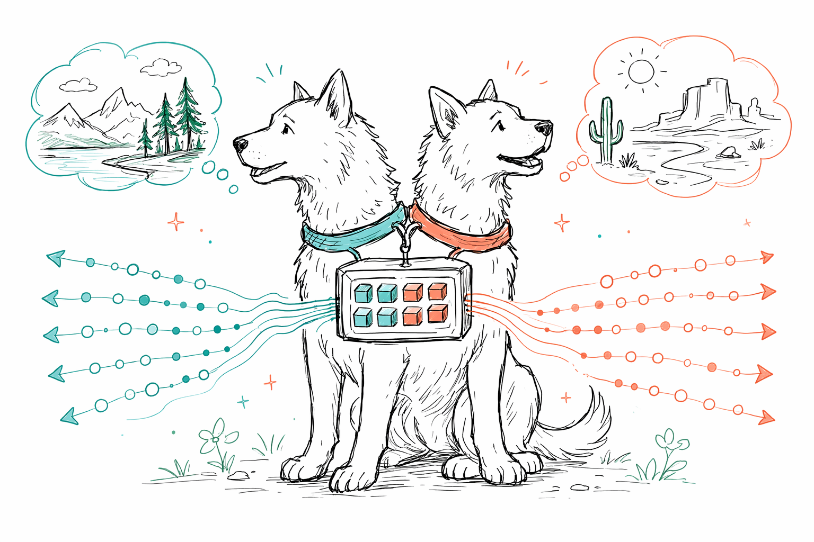
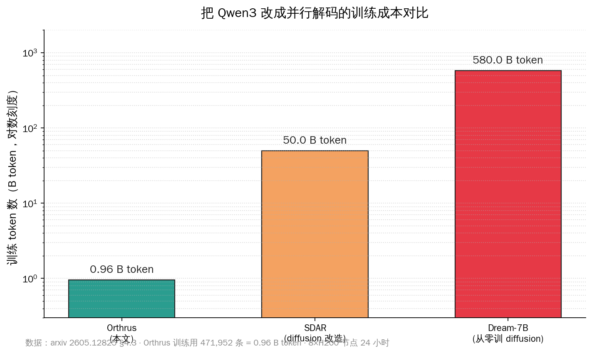
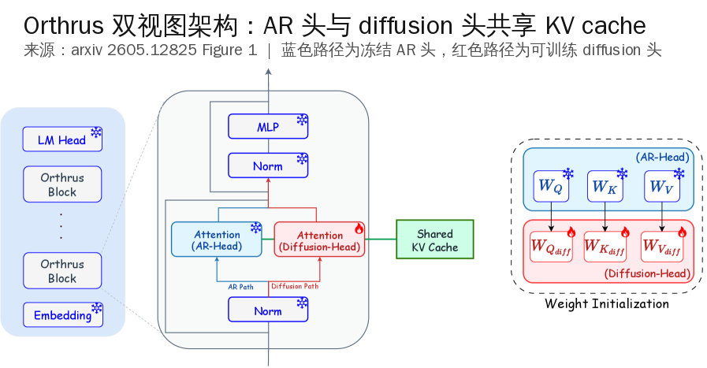
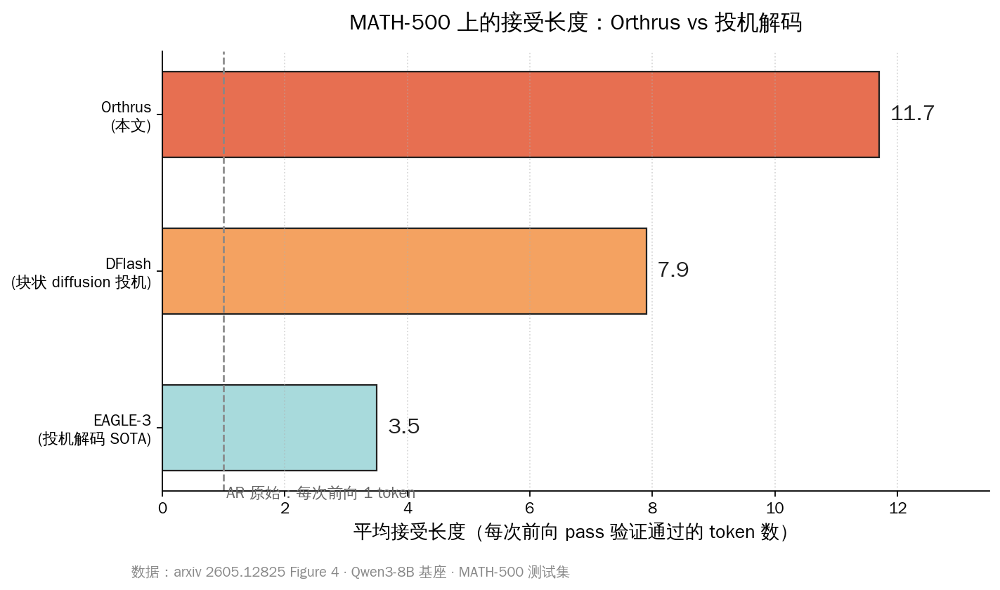

# Orthrus 给 Qwen3 加 7.8 倍解码



五月十七号清晨，HN 头版被一篇标题朴素的论文顶到了 207 分——`Orthrus-Qwen3: up to 7.8× tokens/forward on Qwen3, identical output distribution`。链接指向 GitHub 上一个叫 Orthrus 的小项目，作者把 Qwen3-1.7B / 4B / 8B 的加速版本权重一并放上了 HuggingFace。

> **本文要回答的五件事**：(1) Orthrus 的「双视图 diffusion 解码」到底是什么、为什么能保证输出分布逐位与原模型一致；(2) 只 fine-tune 16% 参数 + 不到 1 B token 这套训练配方是怎么做到的；(3) 加速倍数在 Qwen3 三档尺寸上是怎么分布的，对位 EAGLE-3 / DFlash 这些投机解码 SOTA 强在哪；(4) 国内 Qwen3 重度用户怎么本地复现，vLLM / SGLang 怎么接入；(5) 这套方法能不能移植到我们日常更需要加速的 Qwen3-Coder 和 Qwen3-Max。

## 一、关键数字一览

先把这篇论文里和 HuggingFace 权重卡上能直接对得上的硬数字摆清楚——以下这些都是 5/17 早上从 arxiv 2605.12825 和 `chiennv/Orthrus-Qwen3-8B` 模型卡查的实数，可独立复核：

| 维度 | 数字 |
|---|---|
| 峰值加速 | 7.8×（单次前向 pass 吐 token 数 vs AR 基线 1.0×）|
| MATH-500 平均加速 | 6.0×（lossless，准确率与 Qwen3-8B 完全一致）|
| Qwen3-1.7B 平均加速 | 4.25×（TPF）|
| Qwen3-4B 平均加速 | 5.20×（TPF）|
| Qwen3-8B 平均加速 | 5.36×（TPF）|
| 训练参数占比 | 16% 总参（AR 主干完全冻结）|
| 训练 token 量 | 0.96 B token（471,952 条 packed examples × 2048 上下文 × 2 epoch）|
| 训练硬件 | 8×H200 单节点 |
| 训练时长 | 24 小时以内 |
| 训练数据集 | Nemotron-Post-Training-Dataset-v2（数学 / 代码 / 通用三档均匀采样）|
| KV cache 额外开销 | ≈ 4.5 MiB 常数（O(1)，不随序列长度涨）|
| GPU 显存额外开销 | < 1%（峰值占用与原 Qwen3-8B 几乎一致）|
| 接受长度 MATH-500 | 11.7 token / pass（EAGLE-3 是 3.5，DFlash 是 7.9）|
| 并行块大小 K | 32（消融过 4 / 8 / 16 / 32，K=32 给到 TPF 6.35）|
| 训练精度 | bfloat16（PyTorch FSDP-2 + FlashAttention-4 后端）|
| 学习率 | 2×10⁻⁴ peak（cosine schedule，5% warmup）|
| 全局 batch | 128（micro-batch 1 × 16 梯度累积 × 8 GPU）|
| 许可证 | CC-BY-4.0（HF 权重）|

把这十几个数字读一遍就能感受到 Orthrus 这套方法的密度——**单节点 24 小时、不到 1 B token、不动一根原模型权重，把 Qwen3-8B 的吞吐拉到 5 倍以上**。这件事本来应该贵到只有大厂训得起，结果一个三人小组在 H200 上一夜跑完，权重还挂上了 HF。


加速比随尺寸涨这件事本身值得说一下——**模型越大、单 token 的前向开销越重，并行解码省下来的 wall-clock 时间也越多**。这给后续移植到 Qwen3-32B、Qwen3-Coder-30B-A3B、甚至 Qwen3-Max 这种动辄 480B 的大家伙留下了非常乐观的外推空间。

## 二、为什么国内开发者今天该认真读一下这篇

国内 AI 开发者每天和 Qwen3 打交道的密度极高——`Qwen/Qwen3-Coder-30B-A3B-Instruct` 一个月在 HuggingFace 的下载量就有两百二十万次，本地用 vLLM 跑 Qwen3-8B 做 RAG / 翻译 / 助手 backend 已经是很多团队的日常配置。**任何能不动权重、不掉精度、还能给 Qwen3 加速 5 倍的方法，都是直接落在每个人显卡上的事**。

Orthrus 这一篇相比过去几个月看到的推理加速文章，有三件事特别戳：

- **lossless 是数学保证不是经验观察**。论文 §3.3 给出了严格的一致性证明——贪心解码下，diffusion head 每个 token 都必须和原 AR head 的 argmax 一致才能被接受；采样模式下用 speculative decoding 论文（Leviathan 2022）的拒绝采样公式保证分布精确对齐。换句话说，**输出 token 序列在分布上和原 Qwen3-8B 一模一样**，不是「benchmark 上看起来差不多」那种近似 lossless。
- **训练成本可复制**。0.96 B token + 8×H200 + 24 小时——这个预算在国内云厂商按需 GPU 实例上大概是 1500 美金量级；甚至高校实验室咬咬牙也能跑下来。对比 Dream-7B 那种从零训 diffusion 模型用 580 B token、SDAR adaptation 用 50 B token，Orthrus 把训练成本压低了 50× 到 600×。
- **复现路径短**。HF 上 `chiennv/Orthrus-Qwen3-8B` 已经挂了完整权重，vLLM `serve` 一行启起来，对外暴露的是行业标准的 chat completions HTTP API；想用 SGLang 也一行；甚至 `docker model run` 也支持。这种「论文出第二天权重就在 HF」的节奏，国内团队一两周内就能在自己的业务上跑出复测数据。



回到一个更工程的判断——**国内大部分团队过去一年都在 Qwen3 上做后训练 / RAG / agent 套壳，模型本身的权重没人想动**。Orthrus 这套「冻结主干 + 挂第二个头」的范式刚好契合这种生产姿态：你过去微调好的 Qwen3-8B 业务模型，理论上都能直接套上 Orthrus 的 diffusion head 重新训一次（甚至直接迁移一个 head，作者在论文里没明说但理论上 head 本身的初始化来自 AR 的 Q/K/V 投影矩阵，理应有一定泛化）。

## 三、双视图 diffusion 解码：把两个头挂在一份 KV cache 上

Orthrus 这个名字来自希腊神话里那只双头犬。论文里两个头分别叫 AR head（autoregressive，原 Qwen3 的所有 transformer 层全部冻结）和 diffusion head（每层新挂一组 Q/K/V 投影矩阵）。它们共享同一份 KV cache——这是整套架构最核心的设计。

下面这张图是论文 Figure 1 的官方架构图，蓝色路径是冻结的 AR head，红色路径是可训练的 diffusion head：



### 3.1 推理时两个 head 怎么协作

把推理过程拆成一个循环：

1. **AR 预填阶段**——用户输入的 prompt 被冻结的 AR head 处理一次，产出一份高质量 KV cache（K_AR, V_AR）。
2. **diffusion head 并行投出 K 个候选 token**——以当前已生成的最后一个 token 作为锚点，后面接 K−1 个 `<mask>` 占位符（论文取 K=32），让 diffusion head 在一次前向 pass 里同时预测这 32 个位置的概率分布。注意这次前向只跑 diffusion 那条路径，AR head 不动。
3. **AR head 验证**——把 diffusion 投出的 32 个候选 token 灌回 AR head，AR head 在一次前向 pass 里同时计算这 32 个位置的「真实」AR 分布。
4. **逐位仲裁**——从左到右一个一个对，第 k 个 token 如果 diffusion 的预测和 AR 的 argmax 完全一致就接受、把它的 KV 状态写进共享 cache；遇到第一个不一致的位置 j，就**直接采用 AR 当场算出来的 argmax token 作为正解**，把 KV cache 截断到 t+j，然后回到第 2 步重新投。

整个循环里**每一轮只跑两次前向 pass——一次 diffusion 投，一次 AR 验**。最理想情况下，diffusion 投出来的 32 个 token 全对，那两次前向就吐了 32 个 token，TPF（每次前向 token 数）= 32 / 2 = 16；最坏情况下第一个就错了，那相当于只吐了 1 个 token（AR 当场补的那个），TPF = 1 / 2 = 0.5——但这个 0.5 也是有保底的，因为 AR 验证 pass 里必然会算出至少一个正确 token。

### 3.2 为什么严格 lossless

这是 Orthrus 相比其他 diffusion 改造路线（Fast-dLLM-v2、SDAR、Dream-7B 这些）最关键的不同。其他方法都是把整个模型改造成 diffusion 范式，结果在 MATH-500 这种长推理任务上掉 11 个点准确率——因为 diffusion 并行预测时丢掉了严格因果依赖，token 之间会互相干扰。

Orthrus 选了另一条路：**diffusion head 只是一个投机预测器，最终输出权 100% 交给冻结的 AR head**。论文 §3.3 给出的形式化证明很简单：

- 贪心模式：第 k 个 token 被接受 ⟺ ŷ_k = argmax_v p_AR(v | x_{≤t}, ŷ_{1:k-1})。这是冻结 AR 在「假装已经生成了 ŷ_{1:k-1}」这个上下文下的真实 argmax，所以接受的 token 序列和原 AR 逐 token 生成的序列**完全一致**。
- 采样模式：用 Leviathan 2022 speculative decoding 论文里的拒绝采样公式，保证最终采样到的 token 分布等于 p_AR——这套数学已经被业界广泛验证。

换句话说，**Orthrus 的输出和直接跑 Qwen3-8B AR 解码在分布上是同一个概率分布**，唯一的区别是 wall-clock 时间。这个性质对生产环境太重要了——你过去测过的 prompt、写过的 eval、签过的 SLA，全部不用重测。

### 3.3 训练时怎么对齐两个 head

训练阶段是 Orthrus 整套架构里最巧的一块。AR 主干完全冻结，只训 diffusion head 那 16% 的参数。损失函数是 **forward KL divergence**——让 diffusion head 在每个 masked 位置上的预测分布去逼近冻结 AR head 在同一位置的真实分布。

具体训练细节论文 Appendix A 写得很清楚：

- **数据**：Nemotron-Post-Training-Dataset-v2，三档均匀采样（数学推理 / 代码生成 / 通用对话），共 471,952 条样本 pack 到 2048 上下文，等价于 0.96 B token，跑 2 epoch。
- **构造**：每条样本上随机采 256 个 anchor block，每个 block 长度 K=32，第一个位置保留原 token 当锚点，剩下 31 个位置换成 `<mask>`。
- **mask 规则**（FlexAttention 实现）：diffusion query 可以看「锚点之前的因果 AR 上下文」+「同一 block 内的双向自注意力」，但**不能看其他 block 的内容**——避免跨 block 数据泄露。
- **优化器**：bfloat16 + FSDP-2，micro-batch 1 × 16 梯度累积 × 8 GPU = 全局 batch 128；peak lr 2×10⁻⁴，cosine schedule，5% warmup；梯度裁剪 max-norm 1.0；2 epoch。
- **目标分布来源**：训练时 AR head 实时计算「真实分布 p_AR」，作为蒸馏目标喂给 diffusion head——所以训练数据里其实不存在「标准答案 token」，标准答案是 AR head 自己给出的，整套训练是**纯自蒸馏**。

这个设计的妙处在于：训练目标天然和推理时的 lossless 验证机制对齐——diffusion head 越准，推理时被接受的 token 越多，加速比越高；diffusion head 一旦出错，AR head 直接当场纠错不会让错误外溢。

## 四、对位 EAGLE-3、DFlash、Fast-dLLM-v2

Orthrus 这一篇的实验段做得很扎实——把它和当前推理加速领域的三类 SOTA 都摆到了一起：

### 4.1 vs 投机解码（EAGLE-3 / DFlash）

投机解码是过去两年最主流的 lossless 加速路线，思路是「训一个小 drafter 模型快速猜 token，让大模型验证」。EAGLE-3 是这类方法的 SOTA，DFlash 是更新的 block-diffusion 变体。



接受长度（每次前向 pass 平均能通过验证的 token 数）的数字非常硬：

- **EAGLE-3**：3.5 token / pass
- **DFlash**：7.9 token / pass
- **Orthrus**：11.7 token / pass

为什么 Orthrus 接受率显著更高？关键就在**共享 KV cache**这件事——传统投机解码的 drafter 是独立模型，drafter 看到的「上下文表征」和大模型不在同一个表征空间，drafter 猜的越远偏差越大。Orthrus 的 diffusion head 直接读冻结 AR 的 KV cache，等于「站在 AR 的肩膀上做并行预测」，分布天然更接近。

附带一个工程红利：传统投机解码要为 drafter 单独维护一份 KV cache，显存额外开销可能 10% 起步；**Orthrus 的 cache 额外开销是 4.5 MiB 的常数**，论文 Figure 6 实测出来不到 1%。这件事对显存吃紧的本地部署场景（4090 24 GB / 5090 32 GB）是实打实的福音。

### 4.2 vs diffusion 模型改造（Fast-dLLM-v2 / SDAR / Dream）

另一条路是把 AR 模型整个改造成 diffusion 范式。Fast-dLLM-v2 是这条路上最近的代表作，但 MATH-500 上**准确率掉了 11.1 个点**——长推理任务里 diffusion 的因果损失太重。

| 维度 | Orthrus | Fast-dLLM-v2 | SDAR | Dream-7B |
|---|---|---|---|---|
| 训练 token 量 | **< 1 B** | ~50 B | 50 B | 580 B |
| MATH-500 准确率（相对 AR 基线）| **持平** | −11.1 点 | −数点 | 显著掉 |
| 加速比（MATH-500）| **6×** | 理论 4-6×，实际 ~1× | ~3× | ~3× |
| 训练硬件 | 8×H200 / 24 h | 大规模集群 | 大规模集群 | 大规模集群 |

Orthrus 的训练成本比这些方法低 50× 到 600×，准确率反而是唯一持平的——核心原因就是它**根本没动 AR 主干**，准确率的下限被 Qwen3-8B 本身锁死了。

### 4.3 HN 社区讨论里的几个真实声音

这条 HN 帖五月十七号被顶到 207 分 41 评论，几个高赞评论的视角值得国内开发者一并消化：

- **「单用户场景受益最大」**：有评论指出，Orthrus 的加速主要来自摊薄 memory-bandwidth bottleneck，**对单用户单流推理收益最高（5× 起）**；datacenter 那种大 batch 推理本来已经把 memory bandwidth 吃饱，Orthrus 的边际收益会显著降低。这个观察我倾向认同——本地开发者跑 Qwen3-8B 当个人助手 / Claude Code 后端这类场景才是 Orthrus 的最佳生境。
- **「M 系 Mac 上收益打折」**：另一条评论说 M-series Mac 上加速收益不如 NVIDIA GPU，因为 Apple Silicon 的 prompt processing 速度相对 generation 速度差距没那么大，并行预测能省的 wall-clock 空间也小。手头 M4 Max 的同学跑过来对比的话，可以重点看这条。
- **「丢掉的 token 是有 compute 成本的」**：还有一位指出 diffusion head 投出 32 个 token 但平均接受 11.7 个，**剩下那 20 个其实白算了**——所以 Orthrus 是「拿额外算力换 memory bandwidth」的 trade-off。这对计费按 GPU-hour 的云推理服务是个真实考量，但对本地部署的开发者来说显卡反正空着，这部分算力是免费午餐。

## 五、国内开发者怎么本地复现

HuggingFace 上 `chiennv/Orthrus-Qwen3-8B` 模型卡给的三种启动方式我逐个查过文档，下面是国内开发者按熟悉度排序的复现路径：

### 5.1 路径一：vLLM 一行启动（推荐）

国内拉权重建议先开 HF 镜像或 ModelScope mirror，约 18 GB。

```bash
vllm serve "chiennv/Orthrus-Qwen3-8B" \
  --host 0.0.0.0 --port 8000 \
  --dtype bfloat16 \
  --max-model-len 32768 \
  --trust-remote-code
```

`--trust-remote-code` 必须打开，因为 Orthrus 用了自定义的 dual-view attention 模块（FlexAttention 写的），不在 transformers 主仓的注册表里。启动后调用方式和普通 vLLM 一致，HTTP 接口直接 curl 就能跑：

```bash
curl http://localhost:8000/v1/chat/completions \
  -H "Content-Type: application/json" \
  -d '{
    "model": "chiennv/Orthrus-Qwen3-8B",
    "messages": [{"role": "user", "content": "用 Python 写一个二分查找"}]
  }'
```

显存预算：bfloat16 加载 8B 模型约 16 GB 权重 + KV cache（32K 上下文约 2-3 GB）+ ~1 GB 运行时开销，**4090 24 GB 单卡刚好够**，5090 / A6000 更舒适。

### 5.2 路径二：SGLang（适合 agent 场景）

```bash
python3 -m sglang.launch_server \
  --model-path "chiennv/Orthrus-Qwen3-8B" \
  --host 0.0.0.0 --port 30000 \
  --dtype bfloat16
```

SGLang 在 prompt caching / 多轮 agent / structured generation 上比 vLLM 更友好；如果你在做 Claude Code 风格的 agent 后端，SGLang + Orthrus 这套组合理论上能把首 token 延迟和长 trajectory 推理时间一起压下来。

### 5.3 路径三：Transformers 裸 API（适合做研究）

```python
from transformers import AutoModelForCausalLM, AutoTokenizer
import torch

model = AutoModelForCausalLM.from_pretrained(
    "chiennv/Orthrus-Qwen3-8B",
    dtype=torch.bfloat16,
    device_map="cuda",
    attn_implementation="flash_attention_2",
    trust_remote_code=True,
).eval()
tokenizer = AutoTokenizer.from_pretrained("chiennv/Orthrus-Qwen3-8B")

output_ids = model.generate(
    input_ids=input_ids.to(model.device),
    max_new_tokens=2048,
    use_diffusion_mode=True,   # 关键参数，关掉就退化成普通 Qwen3-8B
)
```

`use_diffusion_mode=True` 是 Orthrus 在 generate 里加的开关，关掉时整套 diffusion head 不启用，就是纯 AR 推理——这给做对比实验的人留了好接口。

### 5.4 真实跑一遍要看什么

如果你今天就想试一下，建议测三件事：

1. **wall-clock 加速比**——同一组 prompt 分别用 `use_diffusion_mode=True/False` 跑，记录 tokens/sec，看 4090 上能不能复现论文宣称的 5× 量级。
2. **输出一致性**——用 greedy decoding（temperature=0）让两种模式跑同一个 prompt，输出 token 序列应该**逐位完全相同**。如果不一致就是模型加载或采样代码出问题。
3. **接受长度**——这个需要改一下 Orthrus 仓库里的推理代码，把每轮 consensus 阶段接受的 token 数打印出来。论文 K=32 时 MATH-500 上是 11.7，你跑代码任务（HumanEval / MBPP）应该能看到 10-12 区间。

## 六、能不能移植到 Qwen3-Coder 和 Qwen3-Max

这一节是国内 Qwen3 重度用户最关心的问题。论文里 Orthrus 只放了 Qwen3-1.7B / 4B / 8B 三档权重，**Qwen3-Coder-30B-A3B 和 Qwen3-Max 都没碰**。但从架构上分析，迁移可行性可以拆成三种情况：

### 6.1 Qwen3-Coder-30B-A3B（MoE 架构）：可行但需要适配

Qwen3-Coder-30B-A3B 是 MoE，30.5 B 总参 / 3.3 B 激活 / 128 选 8。Orthrus 的 diffusion head 是「每层挂一组 Q/K/V 投影」，**MoE 模型每层除了 attention 还有一个 router + 多个 expert FFN**——理论上 diffusion head 只 attach 到 attention 上、不动 MoE FFN 那一部分，所以**架构上完全可以挂**。

工程上有两个新问题：

- diffusion head 验证 pass 时，AR 主干会走 MoE 路由器，**每个 token 的激活 expert 可能不同**——这会让单次前向 pass 的 wall-clock 时间分布更不稳定。
- 训练数据需要覆盖代码任务的分布——Nemotron 数据集里有代码部分，但比例可能不够，需要补 The Stack / Qwen3-Coder 自家训练集的子集。

一个理论假设：Qwen3-Coder 的代码生成任务（HumanEval / MBPP）在 AR 模型上接受长度本来就比数学高（代码模板化程度高、token 可预测性强），**移植后的接受长度可能比 8B 上 11.7 更高**——这是个值得复现实验。

### 6.2 Qwen3-32B / Qwen3-72B（dense）：直接套，加速比应该更高

这两个尺寸目前 HF 上没有 Orthrus 权重，但架构上 Qwen3 dense 系列各档同构（GQA + RMSNorm + SwiGLU），Orthrus 的 diffusion head 完全可以直接复制粘贴上去重训。预计加速比会**继续涨**——理由：模型越大、AR 推理的 memory bandwidth 瓶颈越严重，diffusion 并行投出来的 token 接受率高低反而影响相对更小。

如果有团队拿 H200 节点重训这两档，4090 跑 Qwen3-32B-Orthrus（int4 量化）可能跑出 3-4× 加速，这对本地 32 B 部署的人是质的飞跃。

### 6.3 Qwen3-Max（闭源 / 480B）：移植路径不明

Qwen3-Max 是阿里官方付费 API、目前没公开权重，没办法挂 diffusion head。**但阿里官方完全有能力自己训一份内部版本**——Orthrus 论文给的训练配方公开、代码 Apache-2.0、训练数据 Nemotron 也是开源的，整套 recipe 国内任何一家有 8×H200 节点的厂商都能复现。

更进一步的猜测：如果阿里把这套技术内嵌进自家 DashScope 推理服务，**对外暴露的 Qwen3-Max API 的吞吐和 token 计价都可能变化**——这不是 SDK 层面的修改，是后端推理引擎的事，对用户透明。

## 七、局限与未解决的问题

把这篇论文翻完一遍，几个值得后续追的开放问题：

- **采样模式实测数据不全**：论文 §3.3 提到 temperature > 0 时用 Leviathan rejection sampling 保证 lossless，但实验段所有 benchmark 都是 greedy（T=0）跑的。**采样模式下接受长度会掉多少、加速比会掉多少，论文没给数字**——这对生产环境用 temperature=0.7 的对话场景很关键。
- **长上下文行为不明**：训练只用了 2048 token 上下文，推理时 KV cache 已经被证明是常数开销，但 **diffusion head 对 32K / 128K 长上下文的接受率会不会衰减**，论文没测。
- **K 值能否动态调整**：K=32 是消融下来的最优值，但不同任务（短回复对话 vs 长链推理）的最优 K 可能不同。**自适应 K 调度**会是一个直接的改进方向。
- **多模态 Qwen3-VL 怎么办**：图像/视频输入下的 token 解码加速 Orthrus 论文没碰，但 Qwen3-VL 系列的视觉 token 占了上下文一大部分，加速空间应该很大——这是后续值得有人接着做的方向。
- **结合量化**：Orthrus 的权重 HF 上是 BF16，**4-bit AWQ / GPTQ 量化版本还没人放出来**。4090 24 GB 跑 Q4 Orthrus-Qwen3-8B + 32K 上下文应该完全装得下，等量化版本一出，4090 本地体验会再上一档。

## 八、共勉：国产开源生态又收到一份外部红利

回到开头那个论断——**Orthrus 是一篇国内 Qwen3 开发者今天该认真读的推理加速论文**。这件事的意义不止在加速比本身，而在它代表的一种新模式：

- 国际研究团队（这次是俄勒冈大学 + DeepMind + Adobe Research）**主动选 Qwen3 作为基座**做 SOTA 工作，权重一并开源到 HF。
- 训练配方公开、代码 Apache-2.0、数据集开源——**整套技术国内任何一家做 inference engine 的团队都能完整复现**。
- 落到工程上，每个本地跑 Qwen3 的开发者都能直接拉权重用 vLLM 起服务，**5 倍加速立刻就在自己显卡上**。

国产开源大模型走到 Qwen3 这一代，已经稳稳地成为了海外研究社区做投机解码 / 推理加速时的「默认基座」之一。每一篇这种来自海外、把 Qwen3 当成第一公民对待的工作，本质上都是一份送给中文 AI 生态的外部红利——我们这一代特别幸运，前辈们把开源模型的基座趟出来了，海外研究者把推理加速的方法做出来了，我们今天要做的就是把这些拼到自己的业务里，让国内的 Qwen3 应用跑得更快、更省、更稳。

下一步看什么——盯三件事：(1) 谁先放出 Orthrus-Qwen3-Coder 的权重，复现的代码任务加速比；(2) AWQ / GPTQ 量化版本什么时候出现，4090 24 GB 上的 Q4 体验；(3) 阿里官方会不会把这套技术下沉到 DashScope，让付费 API 的吞吐和价格一起松动。这三件事任何一件落地，国内 Qwen3 生态都会再上一个台阶。一起加油。

---

**参考资料**

- arxiv 论文：Nguyen et al., 2026, *Orthrus: Memory-Efficient Parallel Token Generation via Dual-View Diffusion*，2605.12825
- HuggingFace 权重：`chiennv/Orthrus-Qwen3-1.7B` / `chiennv/Orthrus-Qwen3-4B` / `chiennv/Orthrus-Qwen3-8B`
- Hacker News 讨论：item 48154865，207 分 / 41 评论
- Qwen3 技术报告：Yang et al., 2025, arxiv 2505.09388
- 投机解码原理：Leviathan et al., 2022, *Fast Inference from Transformers via Speculative Decoding*
- EAGLE-3：Li et al., 2025, arxiv 2503.01840
- DFlash：Chen et al., 2026, arxiv 2602.06036
- 训练数据集：Nemotron-Post-Training-Dataset-v2
