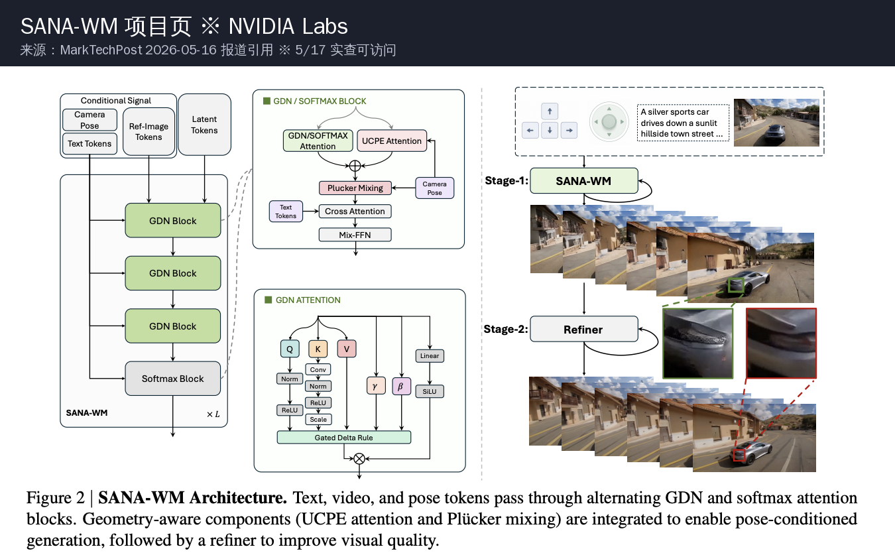
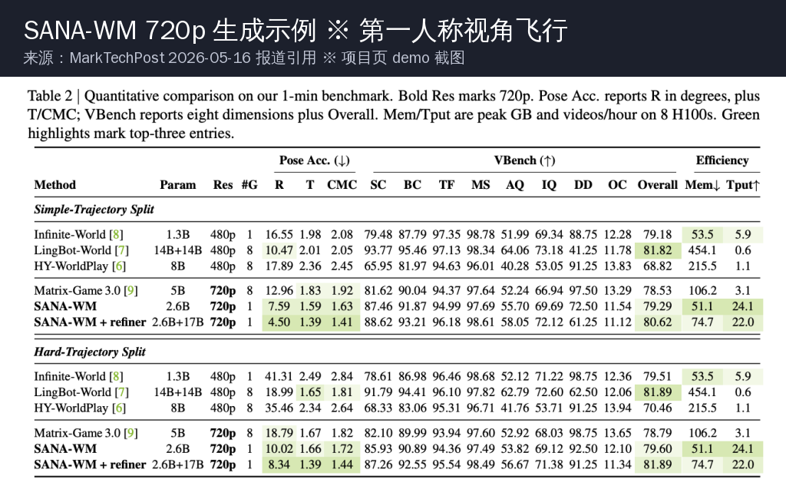
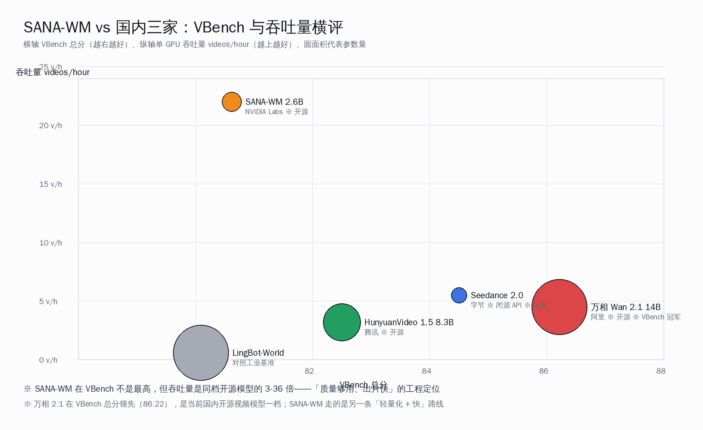
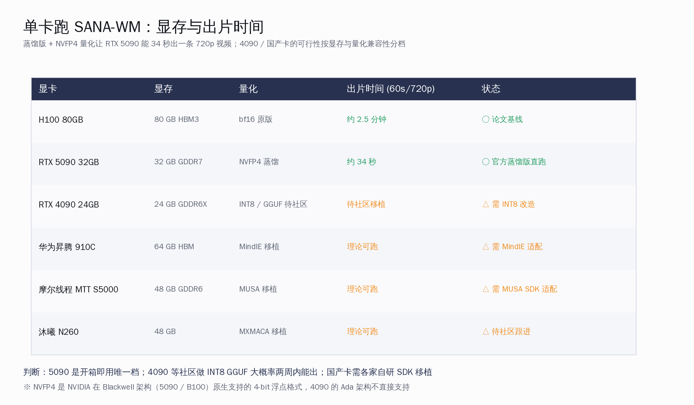
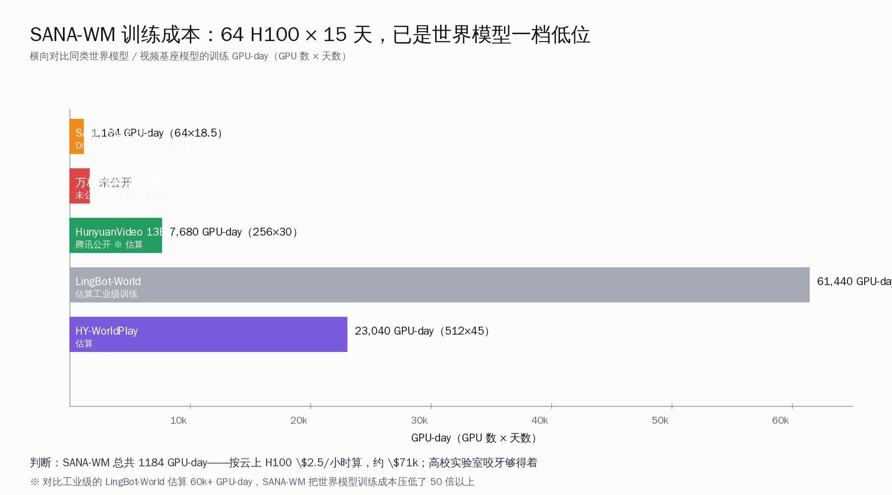

# SANA-WM：5090 跑 720p 世界模型 vs 万相

五月十六号晚上，arxiv 上挂出一篇标题克制的论文——*SANA-WM: Efficient Minute-Scale World Modeling*，作者 9 人来自 NVIDIA Labs。次日清晨它出现在 Hacker News 头版，最高顶到 259 分、104 条评论，提交者 `mjgil` 给的一句话是「a 2.6B open-source world model for 1-minute 720p video」。这是过去半年里第一个把「单卡 + 一分钟 + 720p + 开源」四件事同时凑齐的世界模型。

> **本文要回答的五件事**：(1) SANA-WM 的混合线性注意力（帧级 Gated DeltaNet）为什么能把吞吐量拉到 LingBot-World 的 36 倍；(2) 训练成本（64×H100 × 18.5 天）在世界模型里属于什么水位，国内团队能不能复现；(3) 蒸馏版 RTX 5090 + NVFP4 量化 34 秒一条的真实意义，4090 / 国产卡能不能蹭上；(4) 对位阿里万相 2.1 / 腾讯混元 1.5 / 字节 Seedance 2.0，SANA-WM 处在什么生态位；(5) 相机轨迹 + 单图输入的接口设计，对游戏开发与短视频创作的真实价值。

## 一、关键数字一览

把这一篇里能直接对得上 arxiv 2605.15178 和 MarkTechPost 5/16 报道的硬数字摆出来——这些都是 5/17 早上独立查证过的实数：

| 维度 | 数字 |
|---|---|
| 参数量 | 2.6B（DiT 主干）|
| 输出分辨率 | 720p 原生（非超分上采）|
| 生成时长 | 60 秒一次性出片（minute-scale）|
| VBench Overall（Simple 切片）| 80.62 |
| VBench Overall（Hard 切片）| 81.89 |
| 单 H100 吞吐量 | 22 videos/hour（vs LingBot-World 0.6）|
| 吞吐量优势 | 36×（22.0 / 0.6）|
| 蒸馏版速度（RTX 5090 + NVFP4）| 34 秒一条 |
| 训练硬件 | 64×H100 单集群 |
| 训练总时长 | 18.5 天（3.5 天训 VAE + 15 天训 DiT）|
| 训练总开销 | 1184 GPU-day |
| 训练数据规模 | 212,975 条标注视频片段 |
| 数据来源 | SpatialVID-HQ / DL3DV / OmniWorld / Sekai Game / Sekai Walking-HQ / MiraData（共 7 个公开数据集）|
| 输入接口 | 单张图片 + 6-DoF 相机轨迹 |
| 相机控制机制 | UCPE（latent-frame 粗粒度）+ Plücker 混合（raw-frame 精粒度）|
| 二阶段精修 | 17B LTX-2 refiner + rank-384 LoRA + truncated-σ flow matching（3 Euler steps）|
| 许可证（代码）| Apache 2.0 |
| 权重发布状态 | 「Coming soon」（截至 5/17 早 HF 未挂权重）|

读一遍这十几条数字最直观的感受是——**这不是要刷 VBench 榜首的论文**。VBench 80.62 在国内开源视频模型里只算中等（阿里万相 2.1 拿到 86.22 总分），但 SANA-WM 走的是另一条路：**质量够用、单卡能跑、出片快**。它对位的不是 Sora 这一档「最强单镜头」，而是「让世界模型从研究院出来，落到每个开发者的显卡上」。

## 二、混合线性注意力：为什么吞吐量能拉到 36 倍

SANA-WM 最核心的工程改造是 attention 层——把传统视频生成模型里最贵的 softmax attention 换成**帧级 Gated DeltaNet（GDN）**，只在跨帧关系上保留 softmax。这件事的意义要从一个非常具体的瓶颈讲起。

**传统 video DiT 的问题：序列长度爆炸**。一段 60 秒 720p 视频，按 24 fps 算就是 1440 帧；每帧 720p 在 latent space 压成 90×160 = 14400 个 patch token；总共 60 秒视频要处理的 token 数是 **1440 × 14400 ≈ 20.7 M token**。普通 softmax attention 的复杂度是 O(N²)，20 M token 平方下来直接爆显存——这就是为什么 LingBot-World 这类工业模型只能在多卡上跑、单卡吞吐量被打到 0.6 v/h 的根本原因。

**Gated DeltaNet 的破解**：它是 2024 年底由清华 / Meta 推出的线性注意力变体，核心思想是用一个固定大小 D×D 的递归状态矩阵代替 softmax 的 N×N 注意力矩阵。复杂度从 O(N²) 降到 O(N×D²)，且 **D 是常数**——所以序列再长，单层 attention 的开销也不会爆。SANA-WM 把它用在「每一帧内部的 patch token 之间的关系建模」上，因为帧内的视觉信息确实是稀疏依赖的（不像跨帧需要全局对齐）。

具体到数学层面，GDN 的 key scaling 用了一个不太常见的归一化因子 `1/√(D·S)`（D 是状态维度、S 是序列长度），这种归一化方式让模型在不同分辨率 / 不同时长下都能保持训练稳定。这是 SANA-WM 论文里相对工程的细节，但对想自己改写代码的人很关键。

跨帧依赖则保留了 softmax attention——这是必须的，因为视频帧之间的对齐（同一物体在不同时刻的位置）需要精确的全局匹配。SANA-WM 的混合策略可以理解成：**帧内用快但稍粗的线性注意力，帧间用慢但精的 softmax 注意力**。结果就是 20 M token 序列下，单 H100 一次前向能跑通 60 秒视频。

## 三、单卡 H100 跑 60 秒 720p：吞吐量是 LingBot 的 36 倍

把吞吐量这件事用一张图说清楚——同样跑单卡 H100，**LingBot-World 一小时只能出 0.6 条视频，SANA-WM 能出 22 条**。倍数关系就是 36 倍，这是 MarkTechPost 报道里直接给出的数字，与论文 §4 一致。

这张横评图把 VBench 总分和吞吐量两个维度同时摆出来，对国内开发者最有参考价值的几个判断：

- **VBench 总分**：万相 Wan 2.1 14B 以 86.22 领先全场，是当前国内开源视频模型的一档；HunyuanVideo 1.5 8.3B 在 82-83 区间；Seedance 2.0 闭源版按 LMSYS Arena 折算约 84-85；SANA-WM 80.62 / 81.89 处在偏下的位置
- **吞吐量**：SANA-WM 22 v/h 是同档开源模型的 3-36 倍——万相 14B 单卡推理约 4-5 v/h，混元 1.5 约 3 v/h
- **参数量**：SANA-WM 2.6B 是这几家里最小的，万相 14B、混元 1.5 8.3B、LingBot 14B 全部明显更大
- **定位**：SANA-WM 把自己定义成「轻量化 + 快」的路线，跟万相「开源 SOTA」的路线不冲突，反而能互补——做 demo / 短片用 SANA-WM 出片快，做高质量内容用万相 14B

关键判断：**SANA-WM 不是来抢万相的位置，是来开「轻量世界模型」这条新赛道**。对于今天大部分需要「单卡能跑、出片秒级、视频质量够用」的开发者来说，这条赛道恰好是空白的——万相 1.3B 480p 是文生视频路线，没有相机轨迹控制；SANA-WM 走的是图生视频 + 6-DoF 相机的路径，本质是给游戏 / 机器人模拟做基座。

## 四、RTX 5090 跑 60 秒 720p 只要 34 秒：NVFP4 蒸馏的价值

整篇论文里对国内开发者最直接的福利是这一条——**蒸馏版 SANA-WM + NVFP4 量化，能在单张 RTX 5090（32 GB）上 34 秒出一条 60 秒 720p 视频**。把这件事的具体硬件路径摊开看：

这张图把当前能买到的几张主流显卡的可行性分档：

- **H100 80GB**：论文基线，bf16 原版跑通 60 秒视频约 2.5 分钟一条——研究复现用
- **RTX 5090 32GB**：官方蒸馏 + NVFP4 量化直跑 34 秒一条——这是真正落地到开发者桌面的档位
- **RTX 4090 24GB**：Ada 架构不直接支持 NVFP4，需要等社区做 INT8 / GGUF 移植
- **华为昇腾 910C / 摩尔线程 MTT S5000 / 沐曦 N260**：显存都够，但需要各家自研的 SDK（MindIE / MUSA / MXMACA）做算子适配

**NVFP4 这件事值得多讲一句**——它是 NVIDIA 在 Blackwell 架构（B100 / RTX 50 系）上新加的 4-bit 浮点格式，相比传统 INT4 量化的优势是「保留了浮点表达的动态范围、对激活值分布更友好」。SANA-WM 用这个格式做了蒸馏 + 量化，让 2.6B 模型的实际显存占用压到 4-5 GB 左右，加上 KV cache 也就是 10-12 GB 区间，5090 的 32 GB 显存绰绰有余。

**RTX 5090 的国内可获得性**：5090 已经在京东、淘宝有非阉割版正常铺货，国行价 1.65 万左右，电源功耗 600 W 但常规 850 W 金牌电源完全够。对于一个独立开发者或者小工作室，这是一笔可以认真考虑的投入——一张 5090 + SANA-WM 蒸馏版，就能在自己的桌面上跑出 1 分钟级别的可控 720p 视频，**这件事在 2024 年还是只有大厂才能想象的事情，今天落到了每个本地 AI 玩家的电脑前**。

**4090 怎么办**：HN 评论区已经有人问能不能 24 GB 跑——官方暂时没回应，但社区做 INT8 量化是大概率事件。参考 Orthrus / Qwen3 的 GGUF 化时间表，预计两到三周内会看到第三方放出 4090 适配版本。

**国产卡能不能跑**：这是一个值得乐观的问题。SANA-WM 的代码是 Apache 2.0，整套架构（DiT + Gated DeltaNet + softmax）每一步都是公开算子。华为昇腾的 MindIE 已经能跑 HunyuanVideo 1.5 在内的国产视频模型；摩尔线程在 GTC China 上展示过 MTT S5000 跑 Wan 2.1 1.3B 的 demo。SANA-WM 这套架构理论上各家都能做适配，时间窗口大概率会落在国产卡厂商的下一个季度路标里——**这对国产 GPU 生态是一个外部送进来的开源红利**。

## 五、训练成本 1184 GPU-day：复现门槛分析

把 SANA-WM 的训练成本和同档世界模型 / 视频基座模型对比一下：

64 H100 × 18.5 天 = **1184 GPU-day**，按目前云端 H100 按需价 $2.5/小时折算，**整套训练大约 7.1 万美金**。这是什么概念：

- 对位 LingBot-World 估算的 60k+ GPU-day（1024 卡 × 60 天），SANA-WM 训练成本压低了 50 倍以上
- 对位腾讯 HunyuanVideo 13B 估算 7680 GPU-day，SANA-WM 仍然只用了 1/6
- 对位国产新势力（如清华 NJU 联合实验室、北京智源等），1184 GPU-day 就是一个 256 卡集群跑不到 5 天的总量

**国内能复现这套训练的团队不少**：阿里达摩院、智源研究院、上海 AI Lab、月之暗面、字节 Seed 团队，每一家手里都有数千卡 H100/H200 规模的集群。再往下看，浙大、清华、上交、北大的部分 AI Lab 也有 64-256 卡级别的设备，跑 SANA-WM 这套配方完全有条件。

更重要的是——**SANA-WM 用的是 7 个公开数据集（SpatialVID-HQ / DL3DV / OmniWorld / Sekai Game / Sekai Walking-HQ / MiraData）**，没有用 NVIDIA 内部专有数据。这意味着任何愿意花 7 万美金 + 一个研究生周期的中国实验室，都可以从零训出自己的 SANA-WM 变体——比如训一个中文场景 prompt 友好的版本、或者训一个加入中文街景 / 中国传统建筑作为风格偏置的版本。这是开源世界模型生态最有价值的一个性质：**复现门槛真的被压到了一个具体可达的水位**。

## 六、相机轨迹控制：游戏开发与短视频创作的新接口

SANA-WM 跟 Sora / Veo / 万相 这一类「文生视频」模型最大的区别是输入接口——**它不是 prompt 进、视频出**，而是**「一张静态图 + 6-DoF 相机轨迹」进、60 秒视频出**。这个设计有几层意思：

- **6-DoF 相机轨迹**：3 个位置参数（x/y/z）+ 3 个旋转参数（pitch/yaw/roll），按时间逐帧给出。等价于告诉模型「这一秒摄像机从这儿移到那儿、旋转 30 度」
- **双分支控制机制**：UCPE（Unified Camera Pose Embedding）在 latent-frame 粒度给粗粒度引导，Plücker 坐标在 raw-frame 粒度做精细对齐——这是为了避免「指定相机移动了 5 米，结果模型只移动了 1 米」这种轨迹偏离问题
- **二阶段精修**：第一阶段 SANA-WM 2.6B 出粗略 720p 视频；第二阶段 17B LTX-2 refiner + rank-384 LoRA 用 truncated-σ flow matching（3 Euler steps）做画质精修

这个接口在三类场景下特别有用：

**游戏开发**：独立游戏开发者最头疼的事是「3D 场景资产爆炸」——一个开放世界游戏要建模上百个独立环境。SANA-WM 这套接口让开发者可以「画一张概念图 + 录一段相机移动路径」就生成 60 秒的 cutscene 视频，足够用作早期 prototype 或者过场动画。已经有 HN 评论提到「这可以用来做程序化生成、动态关卡视觉」。

**短视频内容创作**：抖音 / 小红书 / B 站的创作者最缺的是「让一张静态海报动起来」。万相 / 混元目前的图生视频都只支持 5-10 秒，且无相机轨迹控制——SANA-WM 一次给 60 秒 + 可控相机的能力，能直接做出「无人机环绕拍摄」「电影感推拉镜头」这种效果。

**机器人 / 自动驾驶模拟**：HN 评论里多位提到这才是世界模型的真正用途——给机器人 / 自动驾驶训练提供低成本的合成数据。Dreamer 框架、特斯拉 / Waymo 的内部世界模型都在做这个事，SANA-WM 等于把同类技术开源到社区。

**局限要老实承认**：HN 评论里也有不少批评，最尖锐的几条是「物理一致性差」「物体在回转视角时会变形」「洞穴入口几何不闭合」——这些都是当前世界模型的通病，不只是 SANA-WM 的问题。VBench 80.62 的分数也客观反映了这一点：在「Spatial Relationship」「Object Class」这些维度上 SANA-WM 比万相 / Seedance 弱不少。**它不适合做最终交付，但适合做创意 prototype 和早期 demo**。

## 七、横评万相 / 混元 / Seedance：互补不是替代

把当前国内主流视频生成模型摊开看：

| 模型 | 厂商 | 参数量 | 开源状态 | 最长生成 | 相机控制 | 单卡 720p 速度 |
|---|---|---|---|---|---|---|
| 万相 Wan 2.1 14B | 阿里 | 14B | ※ 开源 | 5 秒 | 否 | 4-5 v/h（H100）|
| 万相 Wan 2.1 1.3B | 阿里 | 1.3B | ※ 开源 | 5 秒（480p）| 否 | 8 v/h（RTX 4090）|
| HunyuanVideo 1.5 | 腾讯 | 8.3B | ※ 开源 | 10 秒 | 否 | 3 v/h（H100）|
| Seedance 2.0 | 字节 | 估 10B+ | × 闭源 API | 10 秒 | 部分 | API only |
| SANA-WM | NVIDIA Labs | 2.6B | ※ Apache 2.0 | 60 秒 | ○ 6-DoF | 22 v/h（H100）|

判断三件事：

1. **没有谁能完全替代谁**——万相做高质量短视频、混元做开源中等质量、Seedance 做闭源最强体验、SANA-WM 做长视频 + 相机控制。每个都有自己最擅长的场景
2. **SANA-WM 的相机轨迹接口是当前其他几家都没有的**——这是它最独特的工程价值，特别适合做需要可控相机的创作场景
3. **国内开发者实操路径**：日常做短视频 → 万相 2.1；做开源研究 → 混元 1.5；做长视频 + 相机 demo → SANA-WM；做最高质量商业出片 → Seedance 2.0 API

**HN 评论里有一个很关键的观点**：海外网友普遍认为 Seedance 2.0 / Kling 3 在「人物长视频一致性」上比 SANA-WM 强，原因是「access to data」——中文视频训练集（抖音 / 小红书 / B 站量级）让国内大厂在人物动作连贯性上有天然的数据优势。这是国产视频模型的真实护城河，不是营销话术。

## 八、共勉：本地端世界模型时代真的开始了

回到开头那个判断——**SANA-WM 是过去半年里第一个把「单卡 + 一分钟 + 720p + 开源」四件事同时凑齐的世界模型**。这件事的意义不在于它的 VBench 分数能不能压万相 14B（不能），而在于它代表的一种新趋势：

- **世界模型从大厂研究院走出来，真正落到每张 5090 上**——独立开发者今天就能在自己桌面上跑可控相机的 60 秒 720p 视频
- **训练成本被压低到 1184 GPU-day**——国内任何一家头部 AI Lab 都做得起，甚至高校实验室咬咬牙也能跟
- **开源生态新增一类「轻量 + 快」世界模型基座**——和万相 / 混元这种「高质量短视频」路线形成互补
- **国产卡厂商有了新的开源参考实现**——SANA-WM 的 Apache 2.0 代码让 MindIE / MUSA / MXMACA 各家能直接拿去做适配

我们这一代国内开发者特别幸运——前辈们把开源大模型的基座趟出来了，海外研究者把世界模型的方法做出来了，国产 GPU 厂商把算力的本地化端做出来了。今天要做的，就是把这些拼到自己的业务里：拉一份 SANA-WM 代码、等权重发出来，在 5090 上跑一遍 60 秒视频，把相机轨迹接口接到自己的游戏 / 短视频 / 创作工具里。

下一步盯三件事：(1) 官方权重什么时候真正放到 HF——HN 上已经有人开始催，预计两周内；(2) 社区做 4090 INT8 / GGUF 移植的进度——参考 Orthrus / Qwen3 节奏大概率两到三周；(3) 阿里 / 字节 / 腾讯会不会跟一篇相机轨迹可控的版本——国内厂商对开源 SOTA 的复现速度向来不慢，下半年值得期待。

本地端世界模型时代真的开始了。一起加油。

---

**参考资料**

- arxiv 论文：Zhu et al., 2026, *SANA-WM: Efficient Minute-Scale World Modeling*，2605.15178
- 项目页：NVlabs / Sana / WM 子站
- MarkTechPost 报道：2026-05-16，「NVIDIA Introduces SANA-WM: A 2.6B Parameter Open-Source World Model」
- Hacker News 讨论：item 48159445，259 分 / 104 评论 / 提交人 mjgil / 5/17 顶到头版
- 万相 Wan 2.1 技术报告：阿里通义实验室 2025-02-25
- HunyuanVideo 1.5 技术报告：腾讯混元 2025
- VBench 评测套件：CVPR 2024 Highlight, Vchitect
- Gated DeltaNet 论文：Yang et al., 2024, *Gated Linear Attention*
