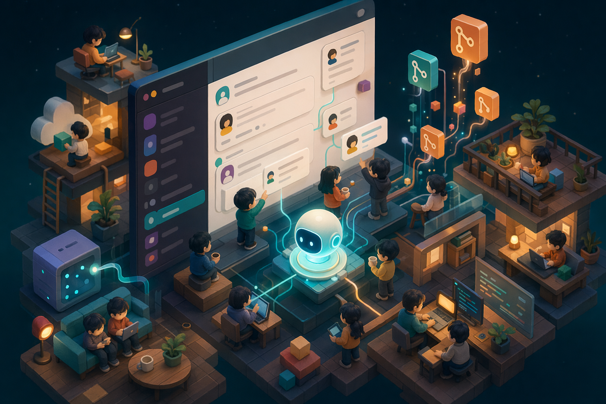
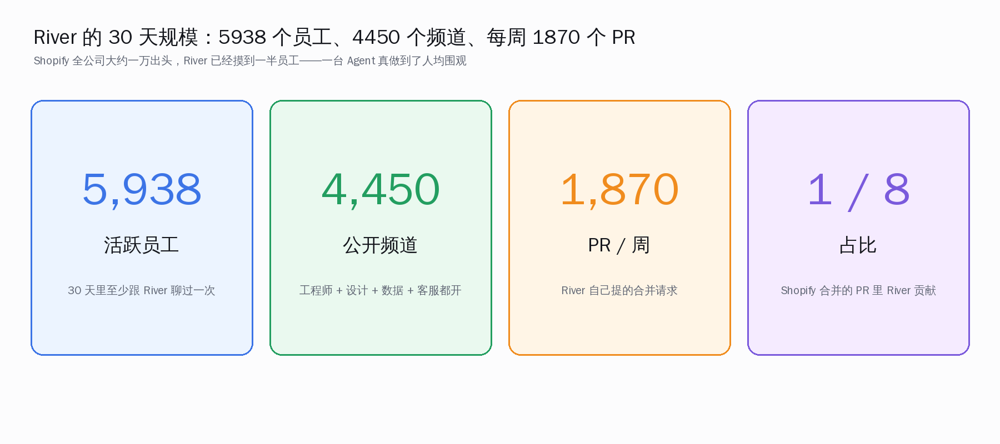
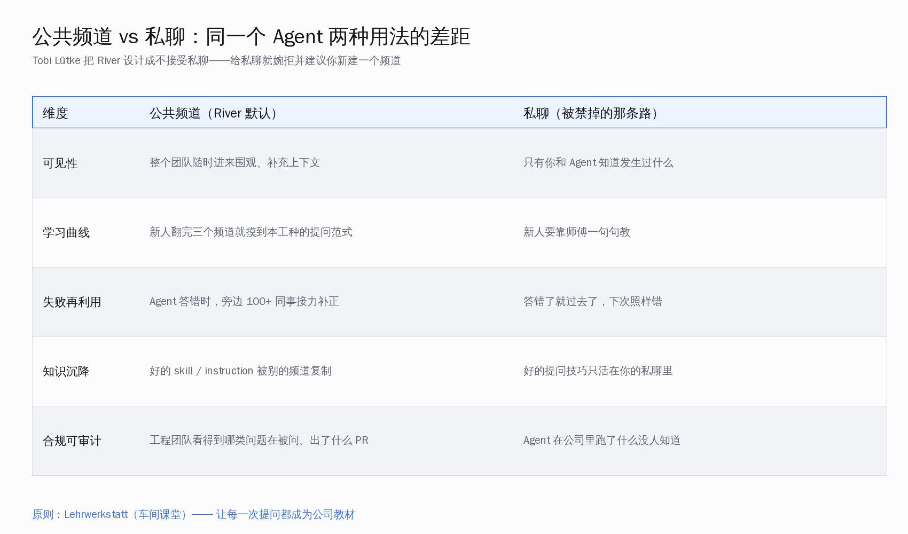
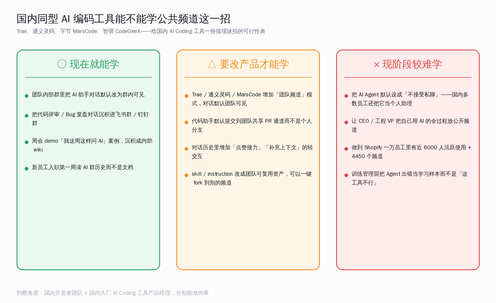

# Shopify 把 Agent 摆进公共频道：合并率从 36% 到 77%

> 5938 个员工、4450 个公开频道、每周 1870 个 PR、合并率两个月从 36% 提到 77%——Shopify 内部 Agent River 走的不是技术路线，而是一条产品决策：**不让任何人和它私聊**。今天聊聊这套机制能不能搬到 Trae、通义灵码、字节 MarsCode、智谱 CodeGeeX，搬之前先把账算清楚。

## 一、Shopify River 这一年到底干了什么

Shopify CEO Tobi Lütke 在 5 月 11 日的一段公开复盘里第一次给了 River 这套系统的全景数字。Simon Willison 把它收录进自己的博客「Learning on the Shop Floor」，标题翻译过来是「在车间里学习」——这其实就是 River 这套机制最像的对照物：德国学徒制里的 Lehrwerkstatt，翻成中文是「教学车间」。

先把这一年的几个核心数字看完。

四个数字背后的含义，比数字本身更值得看：

- **5,938 个员工活跃使用**：Shopify 公开员工数约 1.1 万，这意味着大约一半员工在过去 30 天里至少跟 River 聊过一次。不是「装了插件」，是真的让 Agent 干了活
- **4,450 个公开频道**：每个频道是一个具体话题/项目/团队的 Agent 工位，平均一个员工挂在 0.75 个频道里
- **每周 1,870 个 PR**：是 River 自己提交的代码合并请求，注意是「每周」不是「累计」
- **大约每 8 个合并 PR 里 1 个是 River 写的**：换算下来 River 在 Shopify 工程产能里已经占了 12.5%

光看这几个数字，已经是国内任何一家大厂内部 Agent 没摸到的体量。但更值得抠的是下一组：**合并率的变化曲线**。

两个月时间，River 写的 PR 合并率从 36% 提到 77%。换句话说，最开始工程师们看到 River 写的 PR，10 个里有 6 个直接关掉重写；两个月后倒过来，10 个里 7-8 个真合进主干。

**这个进步不是靠模型升级实现的。** Tobi Lütke 在原文里说得很直白：River 用的还是同一套基础模型，提升来自每个团队不断把自己工种的判断标准、踩过的坑、用过的技巧，反馈到 River 的 skill 库里。这套反馈循环之所以能转得起来，唯一的原因是——所有反馈都发生在公开频道里，全公司能围观、能补充、能复用。

## 二、最反直觉的一条产品决策：River 不接受私聊

如果你今天去 Shopify 工程师的 Slack 给 River 发一条私聊，会发生什么？

> River does not respond to direct messages. She politely declines and suggests to create a public channel.

翻译过来：River 不回私聊，会礼貌地婉拒你，然后建议你开一个公开频道。

**这是一条产品层面的硬约束，不是写在 prompt 里的「建议」。** 字节 MarsCode 默认是个人助理；通义灵码默认是个人助理；Trae 是个人助理；Claude Code 是个人助理；Cursor 是个人助理。所有国内外主流 AI Coding 工具的默认形态都是「我和我的 Agent 二人世界」，River 反着来。

这个反直觉的决策能带来什么？看下面这张矩阵。

五个维度的对照，每一项都是工程团队管理多年来一直想解的老问题：

1. **可见性**：公开频道里，整个团队随时进来围观补充；私聊只有你和 Agent 知道发生过什么
2. **学习曲线**：新人翻完三个频道就摸到本工种的提问范式；私聊模式下新人只能靠师傅一句句教
3. **失败再利用**：Agent 答错时，旁边 100 多个同事接力补正；私聊错了就过去了，下次照样错
4. **知识沉积**：好的 skill 和 instruction 被别的频道复制；私聊里的好提问技巧只活在你一个人那里
5. **合规可审计**：工程团队看得到哪类问题在被问、出了什么 PR；私聊模式下 Agent 在公司里跑了什么没人知道

Shopify 给这套机制起的内部名字是「Lehrwerkstatt」——车间课堂。意思是：**把每一次和 Agent 的对话，都做成一节全公司可以旁听的课。**

Tobi 在原文里给了一段反差感很强的话：「持续学习是公司核心价值——而它根本不需要培训计划、不需要管理者，只需要每个人的工作都被看见。」

## 三、为什么公共频道能让 Agent 越用越准

讲清楚机制是这篇文章最关键的一段，因为多数读者一看到「公共频道」会觉得是个组织文化问题，其实它本质是一个**工程问题**：怎么用最低成本，把组织里的隐性知识写进 Agent 的能力里。

Shopify 这套机制走的不是模型微调路线，是 skill 复用 + 提问范式复用 + 上下文复用三条线并行。

**第一条线：skill 复用。** River 在每个频道里可以预加载特定的 skill 模块。Shopify 内部一个例子是「checkout 数据仓库」这个 skill，最早是一个团队为了查交易数据写的，后来被 12 个团队的频道直接 fork 走。一个团队的工程能力，瞬间变成 12 个团队的工程能力。

**第二条线：提问范式复用。** 工程师 A 在公共频道里花了三轮对话才把一个复杂 bug 让 Agent 理清，工程师 B 第二天进来翻到这段对话，直接照着 A 的提问骨架问自己的 bug——这就是 Lehrwerkstatt 想要的「车间见学」。Tobi 原文里给了一个数字：超过 100 个同事会主动去他自己的 Agent 频道 `#tobi-working-with-river` 围观，给他的对话点赞、补充、纠错。**CEO 把自己的提问过程公开示范，是这套机制能跑起来的核心。**

**第三条线：上下文复用。** 每个频道可以预设「这个频道讨论的是哪个代码区、哪些技术栈、哪些前置约束」。新人加入频道，不需要重新教 Agent 一遍这个项目的背景，Agent 已经被前面 N 个人喂熟了。

合并率从 36% 到 77% 的真实来源，就是这三条线叠加：**新员工不再让 Agent 凭空开始写代码，而是让 Agent 接着上下文继续写。** 起步两个月内补齐的 41 个百分点，每一个百分点都是某个频道里某次失败被记下来的产物。

## 四、把这条路对比到国内 AI Coding 工具的现状

把视角拉回国内。先看现状：

- **Trae**（字节）：默认个人 IDE 助手，对话默认本地或个人云端
- **通义灵码**（阿里）：默认 IDE 插件 + 个人对话，团队功能在工程版里需要单独配置
- **字节 MarsCode**：默认个人助理，企业版有团队空间但默认不公开
- **智谱 CodeGeeX**：默认 IDE 插件，企业版增加团队知识库但对话默认私域
- **Claude Code / Cursor 国内团队用法**：基本都是工程师本地装、个人配置、个人对话

国内五大 AI 编码工具 + 海外主流工具在国内的接入形态，**没有一家是「公开频道为默认入口」的设计**。这不是工具厂商技术做不到，是产品形态选了另一条路：**优先保住个人开发者的隐私感和上手速度。**

国内开发者对「让 Agent 在公开频道里发言」这件事的直觉抵触是真实的，原因有几个：

1. **代码里有商业机密**：国内多数 toB 团队的代码包含客户合同细节、对接细节，团队成员之间也未必都该看到
2. **「问问题等于水平不够」的旧观念**：在公开频道问 Agent 一个基础问题，会被同事看到我「不会」
3. **对话历史可能被秋后算账**：在公开频道里跟 Agent 讨论的方案最后没做成，记录还在
4. **管理层把 AI 错答当工具问题，不当学习样本**：Agent 答错了，老板就觉得「这工具不行」，而不是「我们要把这条记成教材」

这四条里，**第四条是最难破的。** Shopify 能跑通公共频道这条路，根本原因是 CEO 自己把 River 出错的对话挂在公开频道里给全公司围观——Tobi 把自己写的失败 prompt、Agent 给出的烂答案、他怎么修正、最后修出什么——全过程留档。CEO 都不怕暴露不会的样子，工程师才敢问。

国内大厂这套自上而下的示范缺失，是公共频道这条路最难启动的原因。

## 五、给国内团队和工具厂商的三档可行性表

讲了这么多机制，落到实操：**国内 AI Coding 工具的产品经理、国内工程团队的负责人，能学这套机制的哪一档？** 三档分级如下。

### 第一档：现在就能学（不需要改产品）

这一档完全靠团队内部约定能跑起来，几个动作：

- **团队内部群里把 AI 助手对话默认改为群内可见**：用飞书 / 钉钉 / 企业微信群作为载体，把 Claude Code、通义灵码、Cursor 的关键对话截图或导出文本贴进群
- **代码评审和 Bug 复盘对话沉积进群文件**：每周整理一次本周用 Agent 解决过的有意思的 case，沉积成内部 wiki
- **周会增加「我这周这样问 AI」分享环节**：5-10 分钟轮流分享，比技术分享会更接近 Lehrwerkstatt 的精神
- **新员工入职第一周读 AI 群历史而不是文档**：让 Agent 对话史成为入职第一份阅读材料

这一档不需要任何工具厂商支持，国内任何一个 5 人以上的开发团队下周就能开始做。**判断方法**：你的团队上周用 Agent 解过的 5 个有意思的问题，第二个工程师能不能看到？看不到就从这里开始。

### 第二档：要改产品才能学（工具厂商可以做的事）

这一档需要 Trae、通义灵码、MarsCode、CodeGeeX 这些工具厂商在产品形态上做几件具体的事：

- **增加「团队频道」模式**：对话默认团队可见，私聊模式作为可选项不作为默认
- **代码助手默认提交到团队共享 PR 通道**：而不是个人分支
- **对话历史增加「点赞接力」「补充上下文」的轻交互**：让团队成员能给某条 Agent 对话补一句「我这里也踩过」
- **skill / instruction 改成团队可复用资产**：可以一键 fork 到别的频道，类似 Shopify 的 12 个团队复用 checkout skill

这些都不是技术难题，是产品决策。哪个国内 AI Coding 工具先做出「以团队频道为默认入口」的形态，哪个就有可能拿到 Shopify River 这种组织级渗透率。

### 第三档：现阶段较难学（短期内做不到的事）

这一档先放一放，列出来让大家知道差距在哪：

- **把 AI Agent 默认设成不接受私聊**：国内多数员工还把 Agent 当个人助理，这一步走得太快会有反弹
- **让 CEO / 工程 VP 把自己用 AI 的全过程放公开频道**：这件事很大程度取决于公司文化，不是产品能解的问题
- **做到 6000 个员工活跃 + 4450 个频道的规模**：需要 1 万人以上的工程组织和长达一年的滚雪球
- **训练管理层把 Agent 出错当学习样本**：是 KPI 设计问题，不是工具问题

第三档的事可以慢慢来，但**前两档已经有足够空间让国内团队和工具厂商行动起来**。

## 六、把这件事翻译成开发者视角：你下周可以做什么

如果你是国内一线开发者或团队 lead，看完上面这套机制后，下周可以做四件事。

**第一件事：周一开个会，统计上周团队里用 Agent 解过的有意思 case。** 不需要工具，Excel 或者飞书文档就行。统计完一定会发现：很多 case 你不知道你的同事踩过。这是公共频道存在的第一个理由。

**第二件事：选一个团队群作为「AI 协作群」。** 让大家试一周——把跟 Agent 的关键对话截图贴进来。一周后回头看：群里沉积下来的内容比所有官方文档加起来都接近现场。

**第三件事：把团队里资历最深的工程师拉进来公开示范。** 让他把自己用 Agent 调试某个真实问题的过程贴到群里。这一步是模仿 Tobi Lütke 那个 `#tobi-working-with-river` 频道——**资深者公开示范**是这套机制启动的关键。

**第四件事：每周整理 3 条 skill。** 把团队这一周里反复出现的提问模式抽出来，写成 3 条可复用的 prompt 模板，贴到群置顶。下周新加入的同事直接照着用，不需要重新发明。

这四件事都不需要任何工具厂商支持，做完一个月就能体感到团队整体 Agent 使用水平的变化。Shopify 那 41 个百分点不是靠模型升级实现的，是靠这种日常的、微小的、看得见的积累一点一点攒出来的。

## 七、回到开头那个数字

如果只能从这篇文章带走一个判断，应该是这一条：

**Shopify River 合并率从 36% 提到 77% 的真实驱动力，不是模型，是产品设计——把 Agent 摆进公共频道，让整个组织成为 Agent 的训练集。** 这套机制对国内 AI Coding 工具厂商和团队负责人都是一个清晰的方向：技术不是瓶颈，组织和产品形态才是。

国内开发者群里有句老话——「一个人走得快，一群人走得远」。Shopify 这套 Lehrwerkstatt 机制把这句话翻译成了工程语言：**一个人和 Agent 私聊走得快，一群人和 Agent 公开协作走得远。**

国内已经有完整的基础设施可选：飞书、钉钉、企业微信、Slack 国内版、Discord——任何一个能拉群、能贴消息、能搜历史的工具，都能跑第一档。剩下的差距，留给 Trae、通义灵码、字节 MarsCode、智谱 CodeGeeX 这些产品团队去补。等到国内有一家 AI Coding 工具把「团队频道为默认入口」做成默认形态时，国产 AI 编码圈的整体水平会再上一个台阶。

那时候我们回头看 Shopify 2026 年 5 月这份复盘，会发现它真正给国内同行送的礼物不是数字，而是这条路本身——**把 Agent 当车间老师傅，不当私人小秘**。这条路前辈已经趟出来了，下一步看我们走多快。
