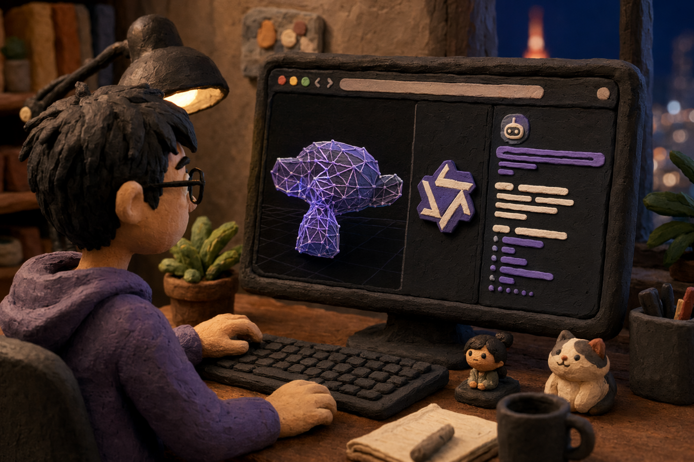
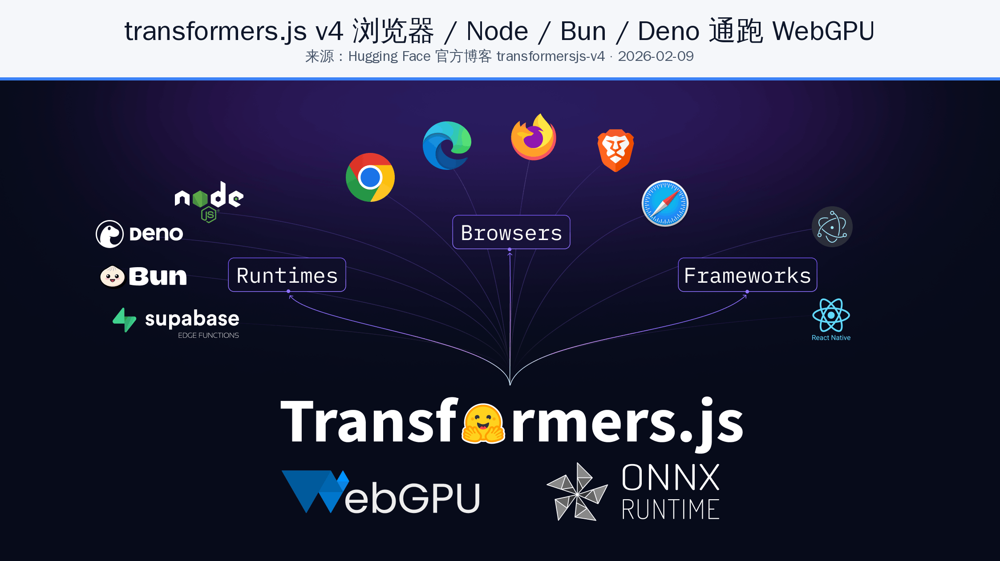
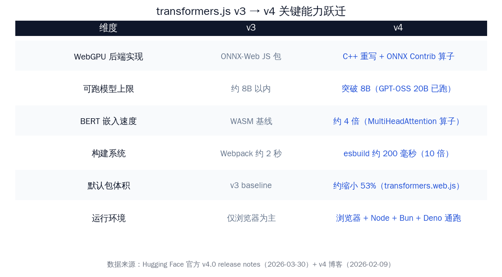
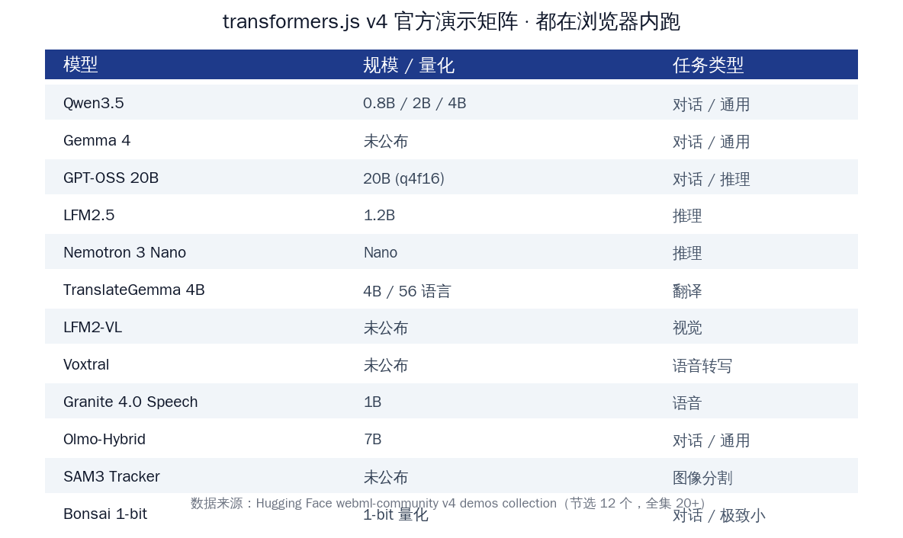
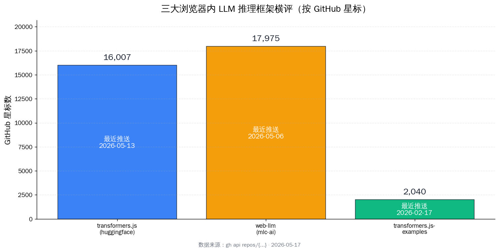

# transformers.js v4 把 Qwen3.5 跑进 Chrome

> 浏览器里跑大模型这件事，从 v3 时代的「玩一玩可以、做产品不行」，被 transformers.js v4 推到了「Qwen3.5、Gemma 4、GPT-OSS 20B 都能直接在 Chrome 里跑出可用速度」的门槛。对国内一线 Web 开发者来说，这是过去两年里第一次真的可以拿浏览器内推理做隐私优先、零部署成本的个人 AI 产品。

---

## 一、关键数字先列清楚

写在最前面，全部来自 Hugging Face 官方仓库 + 官方博客 + 官方演示集合，**每个数字都可在原始来源找到同一数字**。

| 项目 | 数值 | 来源 |
|---|---|---|
| transformers.js GitHub 星标 | 16,007 | huggingface/transformers.js（2026-05-17） |
| v4.0.0 发布日期 | 2026-03-30 | 同上 release 页 |
| v4.1.0 / v4.2.0 发布日期 | 2026-04-23 | 同上 |
| v4 官方博客发布日期 | 2026-02-09 | huggingface.co/blog/transformersjs-v4 |
| v4 开发周期 | 约 1 年（2025-03 起步） | 同博客 |
| WebGPU 后端语言 | C++ 完全重写 | v4.0.0 release notes |
| 支持运行环境 | 浏览器 / Node / Bun / Deno | 同上 |
| 支持的模型架构数量 | 约 200 个 | 同上 |
| GPT-OSS 20B（q4f16）实测速度 | 约 60 tokens/s（M4 Pro Max） | 同上 |
| BERT 嵌入模型相对加速 | 约 4 倍 | 同上（MultiHeadAttention 算子） |
| 构建系统切换 | Webpack → esbuild | 同上 |
| 构建耗时变化 | 约 2 秒 → 约 200 毫秒（10 倍） | 同上 |
| 默认主包体积变化 | transformers.web.js 缩小约 53% | 同上 |
| 对照框架 web-llm 星标 | 17,975（pushed 2026-05-06） | gh api repos/mlc-ai/web-llm |
| 官方演示数量 | 20+ 个浏览器内 WebGPU demo | webml-community v4 demos 合集 |

**本文核心论断**：浏览器内跑大模型这条赛道，过去一直被中文媒体当成「Demo 级新奇玩意」忽略；v4 是把它从玩具状态推到可做产品的那一脚——而国内中文媒体目前 0 篇 v4 深度报道，全部停在 v3 / v2 旧文。这条 16,007 星的赛道，在国内被低估了。

---

## 二、为什么国内开发者今天值得认真读一下这件事

本节核心论断：**浏览器内推理不是「服务端推理的低配版」，而是 Web 产品做隐私优先、零安装、零账户、零部署成本个人 AI 的唯一路径。**

国内 Web 开发者每天面对的场景：

- 做一个浏览器扩展，要给用户做摘要 / 翻译 / 重写，但用户不愿意把自己看的网页传到第三方 API
- 做一个 SaaS 产品，想给免费用户提供一个本地大模型选项，又不愿意为每个免费用户付云端 token 钱
- 做一个企业内部工具，合规要求数据不出端、不上云，但 IT 部署本地推理服务又太重

过去这三个场景的常见方案：

1. **接云端 API**：数据出端，免费用户付不起 token 成本
2. **自建本地推理服务**：用户得装 Ollama / LM Studio / vLLM，对普通用户门槛太高
3. **WebGL/WASM 推理**：能跑但只够 100M 级别小模型，做不出可用产品

v4 把第四个方案推到了可用线上：**用户打开网页，浏览器自动下载量化后的模型权重到 IndexedDB / Cache Storage，下次访问直接命中本地缓存，所有推理在用户的 GPU 上完成，零账户零安装。**

这条路对国内尤其重要，原因有三条：

- **合规友好**：数据不出端 = 不存在跨境传输问题，企业销售门槛直接低一档
- **成本结构反转**：从「按 token 付费给云端」变成「用户自己出算力」，对免费 / Freemium 产品至关重要
- **国产模型分发友好**：Hugging Face 上 Qwen3.5、千问系列权重直接可被浏览器拉取，不需要中间一层云服务

---

## 三、v4 跟 v3 到底差在哪：从 WebGL 玩具到 WebGPU 工程

本节核心论断：**v4 的核心升级不是「加快」，而是「把推理跑到了浏览器原生 GPU 加速通道上」，让以前根本上不去的 8B+ 模型变成日常可跑。**

### 3.1 新 WebGPU 后端：C++ 重写，全平台同一份代码

v4.0 release notes 第一句话就是：「The biggest change is undoubtedly the adoption of a new WebGPU Runtime, completely rewritten in C++.」

具体改了什么：

- 与 ONNX Runtime 团队合作，把整个 WebGPU 推理通路用 C++ 重写
- 在 200 多个支持的模型架构上做了全量测试
- 加入了 ONNX Runtime 的专用 Contrib Operators：`com.microsoft.GroupQueryAttention`、`com.microsoft.MatMulNBits`、`com.microsoft.QMoE`、`com.microsoft.MultiHeadAttention`
- 一份 transformers.js 代码可以在浏览器 / Node.js / Bun / Deno 里**完全一样地**跑起来，且都吃 GPU 加速

第四条特别值得 Web 开发者注意——同一份模型 / 同一份调用代码，本地写完直接在 Node 服务端跑测试，部署到浏览器跑生产，不用再切两套 runtime。

### 3.2 BERT 嵌入模型 4 倍加速：算子级优化

v4 在 `MultiHeadAttention` 算子上做了专门优化，BERT 类嵌入模型相对 v3 速度提升约 4 倍。

对国内开发者来说，嵌入模型是 RAG、向量搜索、网页内容理解的基础环节。v3 时代浏览器内跑 BERT 嵌入是「能跑但产品里得做转圈圈」，v4 之后基本进入「无感」区间。

### 3.3 模型规模上限：从 8B 以内捅破到 20B

v3 时代社区共识是「浏览器内推理 8B 以内是上限」。v4 release notes 给的实测：

> 「Additionally, we've added support for larger models exceeding 8B parameters. In our tests, we've been able to run GPT-OSS 20B (q4f16) at ~60 tokens per second on an M4 Pro Max.」

这一段拆开看就是：

- 模型：GPT-OSS 20B（OpenAI 开源的 GPT 系基础模型）
- 量化：q4f16（4-bit 权重 + fp16 激活）
- 硬件：Apple M4 Pro Max（统一内存架构 macOS 笔记本，2026 Q1 旗舰款）
- 速度：约 60 tokens/s

60 tokens/s 是一个什么概念？聊天对话场景里 25 tokens/s 已经追平人类阅读速度，60 tokens/s 是「输出速度比你读还快」的体验。一年前我们还在讨论「8B 模型能不能在浏览器里跑」，现在 20B 在 Apple Silicon 上对话流畅——这是一年内的代际跨越。

### 3.4 构建系统 + 包体积：从开发体验到加载速度全升级

- 构建系统：Webpack → esbuild，构建耗时 2 秒 → 200 毫秒，10 倍
- 主包体积：transformers.web.js 缩小约 53%
- 平均包体积：所有 build 平均缩小约 10%

对 Web 开发者，这意味着引入 transformers.js 后**首屏加载时间**显著改善——以前 v3 时代用户打开一个集成了浏览器内推理的页面，要等 transformers.js 库自身加载完一段时间才能开始拉模型，v4 之后这部分基本可以忽略。

### 3.5 新增模型架构：Qwen3 系列、DeepSeek-v3、Gemma 4 全到位

v4 开发周期里加进来的模型架构（节选）：

- **Qwen 系列**：Qwen2.5-VL、Qwen3-VL、Qwen3.5、Qwen3.5 MoE、Qwen3 MoE、Qwen3 Next、Qwen3-VL MoE
- **国内系列**：DeepSeek-v3、HunYuanDenseV1（混元）
- **Google 系**：Gemma 4、Gemma3 VLM、Olmo3
- **Mistral 系**：mistral4
- **OpenAI 系**：GPT-OSS
- **新架构范式**：FalconH1（Mamba 状态空间模型）、Multi-head Latent Attention（MLA）、Mixture of Experts（MoE）

这一份模型清单里**有一半是国内厂商**的。Qwen3.5 0.8B / 2B / 4B 三档官方 WebGPU demo 已经在 webml-community 集合里上线，国内开发者直接可以拿来作起点。

---

## 四、Qwen3.5 在浏览器里跑：官方演示集合实拆

本节核心论断：**Hugging Face 已经把 Qwen3.5、Gemma 4、GPT-OSS、Voxtral 等 20+ 个模型的浏览器内 demo 做好了，国内开发者今天就能 fork。**

来源是 Hugging Face 官方维护的 `webml-community/transformersjs-v4-demos` 合集，节选 12 个有代表性的：

### 4.1 对话 / 推理类

- **Qwen3.5 WebGPU**：0.8B / 2B / 4B 三档，国内开发者最熟悉的基座
- **Gemma 4 WebGPU**：Google 最新一代轻量对话模型
- **GPT-OSS 20B WebGPU**：上面提到的 60 tokens/s 那个
- **LFM2.5 1.2B Thinking**：带思维链推理的 1.2B 模型
- **Nemotron 3 Nano**：NVIDIA 推出的紧凑推理模型
- **Olmo-Hybrid 7B**：AI2 的混合架构 7B
- **Bonsai 1-bit**：1-bit 量化对话模型（极端小体积）

### 4.2 多模态 / 翻译类

- **TranslateGemma 4B**：4B 参数支持 56 种语言（中英直翻够用）
- **LFM2-VL**：视觉+语言模型
- **SAM3 Tracker**：图像分割
- **RF DETR Medium / Nano**：物体检测
- **voyage-4-nano**：文本嵌入（RAG 基础）

### 4.3 语音类

- **Voxtral Realtime WebGPU**：实时语音转写
- **Cohere Transcribe WebGPU**：Cohere 的转写模型
- **Granite 4.0 1B Speech**：IBM 的轻量语音模型

对国内 Web 开发者最直接的价值是：你想做一个「网页内 Qwen3.5 对话框」，不需要从零搭，**fork 一个 demo 就有完整的 npm 工程 + 模型加载逻辑 + UI 模板**。

---

## 五、浏览器内跑 Qwen3.5 的真实可行性：怎么估算

本节核心论断：**给定 GPU 显存与浏览器 WebGPU 支持，跑 Qwen3.5 是日常体验；社区已经公开的实测数字是 GPT-OSS 20B 约 60 tokens/s，但 Qwen3.5 不同档位的精确 tokens/s 数据还需要社区进一步公布。**

### 5.1 显存占用估算（基于量化级别）

Qwen3.5 不同档位 + 不同量化下显存大致占用（按 4-bit 主流量化估算，权重 ≈ 参数量 × 0.5 字节 + KV cache）：

| 模型档位 | 参数量 | 4-bit 权重大小 | 含 KV cache 大致占用 | 适配硬件 |
|---|---|---|---|---|
| Qwen3.5-0.8B | 0.8B | 约 400 MB | 约 600-800 MB | 集成显卡 / Mac M1 起 |
| Qwen3.5-2B | 2B | 约 1.0 GB | 约 1.5-2 GB | 中端独显 / Mac M2 起 |
| Qwen3.5-4B | 4B | 约 2.0 GB | 约 3-4 GB | 主流独显 / Mac M2 起 |
| GPT-OSS 20B | 20B | 约 10 GB | 约 12-14 GB | 高端 GPU / M4 Pro Max |

**说明**：上表显存估算来自常规 4-bit 量化数学，**实际待社区在 Chrome 128+ / Firefox / Safari 各档显卡上正式公布对照实测**。Hugging Face 目前唯一公开的 v4 浏览器内 tokens/s 实测是上文提到的 GPT-OSS 20B @ M4 Pro Max ≈ 60 tokens/s。

### 5.2 浏览器 WebGPU 支持现状

桌面端 WebGPU 已经是默认开启状态，覆盖面相对乐观：

- **Chrome / Edge**：113+（2025 年开始）已默认开启 WebGPU
- **Safari**：18+（macOS / iOS 18）默认开启
- **Firefox**：141+ 桌面版默认开启（Linux/Windows/macOS）
- **国内浏览器**：基于 Chromium 内核的国产浏览器（夸克、360、UC、QQ 浏览器等）通常跟随 Chromium 版本，多数已具备 WebGPU 能力

移动端目前还在过渡阶段——iOS Safari 18 已开，Android Chrome 部分机型默认开。**生产环境部署建议加 fallback**：检测到 WebGPU 不可用时回落到 WASM 后端跑更小模型。

### 5.3 用户路径上的两个常见问题

**问题一：模型首次下载体积**

Qwen3.5-4B 4-bit 大约 2 GB，国内宽带下首次下载至少几十秒。建议产品上做三件事：(1) 进度条 + 预计时间；(2) 用 v4 新的 `env.useWasmCache` + Cache Storage 让用户只下一次；(3) 提供「先用云端 API 试用、满意后下本地权重」的渐进体验。

**问题二：冷启动初始化耗时**

WebGPU 第一次加载模型权重到 GPU 需要几秒到十几秒不等。建议在用户登录后台预加载，而不是用户点「开始聊天」那一刻才开始拉。

---

## 六、对照 web-llm：浏览器内 LLM 还有另一条路线

本节核心论断：**transformers.js 不是浏览器内 LLM 唯一选项；mlc-ai 的 web-llm 走的是 TVM 编译路线，星标更高（17,975），但 v4 把 transformers.js 从「能跑」推到「易接入」的距离拉得更短。**

### 6.1 web-llm（mlc-ai）：编译派

- GitHub：mlc-ai/web-llm
- 星标：17,975（pushed 2026-05-06）
- 路线：通过 Apache TVM 把模型编译成 WebGPU shader
- 优势：编译期优化空间大，单模型在指定硬件上能跑得很快
- 痛点：每个新模型 / 新量化级别都要重新编译；对国内开发者来说，从 Hugging Face 上拉一个 ONNX 权重直接跑 ≠ web-llm 的流程

### 6.2 transformers.js v4（huggingface）：运行时派

- GitHub：huggingface/transformers.js
- 星标：16,007（pushed 2026-05-13）
- 路线：ONNX 模型 + ONNX Runtime Web/WebGPU 后端运行
- 优势：与 Hugging Face Hub 上 20 万+ ONNX 模型直接打通；API 跟 Python 版 transformers 几乎一样，迁移成本低
- 痛点：极致单模型性能上可能略输给针对性编译的 web-llm

### 6.3 国内开发者怎么选

不需要选边，按场景搭配：

| 场景 | 推荐 |
|---|---|
| 想快速集成一个浏览器内对话框 | transformers.js v4（直接 fork 官方 Qwen3.5 demo） |
| 重度依赖某个固定模型 + 想压榨极致性能 | web-llm（接受预编译成本） |
| 想给用户提供多模型可切换 | transformers.js v4（任意 ONNX 模型零额外工作） |
| 想做语音 / 视觉 / 嵌入混合管线 | transformers.js v4（pipeline API 直接全覆盖） |
| 想做企业内长寿命产品 | 两个都跟一份，避免单点依赖 |

---

## 七、对国内 Web 产品的真实接入路径

本节核心论断：**这条赛道在国内目前还是空白：夸克 AI / 360 AI 浏览器 / 豆包浏览器都依赖云端推理，浏览器内本地推理仍是产品创新窗口。**

### 7.1 国内 AI 浏览器现状

- **夸克 AI**：阿里旗下，AI 能力基于云端通义系列
- **360 AI 浏览器**：纳米搜索 + 360 智脑云端
- **豆包浏览器**：字节，云端豆包模型
- **百度浏览器 AI**：文心一言云端

特点是 AI 都跑在云端——隐私优势可以打但不彻底，因为请求要回云。

### 7.2 v4 + Qwen3.5 给国内开发者的产品想象空间

可以做但还没多少人做的产品形态：

- **隐私优先的网页摘要 / 翻译 / 重写浏览器扩展**：用户网页内容不出端
- **企业内部知识库前端**：员工查询不离开浏览器，IT 不用部署后端推理服务
- **Web IDE 内的 AI 补全**：本地代码不上云的强需求场景，浏览器内 Qwen3.5 是合适候选
- **教育产品的离线模式**：学校 / 偏远地区网络条件不稳定时仍可用
- **C 端隐私聊天框**：跟主流云端对话产品形态接近，但承诺 100% 本地推理

### 7.3 接入清单（给国内 Web 团队）

如果你今天打算往项目里加 transformers.js v4，前期可以这样安排：

1. **选模型**：聊天 / 摘要 → Qwen3.5-0.8B 起步；翻译 → TranslateGemma 4B；嵌入 → 选 voyage-4-nano 或 BERT 小模型
2. **量化**：默认 q4f16，平衡速度与质量
3. **fallback 策略**：检测 `navigator.gpu` 不可用 → 回落 WASM 后端跑更小模型 → 再不行才提示用户升级浏览器
4. **缓存策略**：v4 新提供的 `env.useWasmCache` 必开；模型权重走 Cache Storage 让用户只下一次
5. **首屏 UX**：把模型下载拆成「后台静默拉取」+ 进度提示，不要堵在用户主动作前
6. **可观测性**：v4 的 `env.logLevel` 接生产监控

---

## 八、局限与目前还没解决的问题

本节核心论断：**v4 把浏览器内 LLM 推到可用线，但移动端、超大模型、高并发场景还有明显短板，需要客观看待。**

诚实摆出来的限制：

- **移动端 WebGPU 还在过渡期**：Android 部分中低端机型暂未默认开启 WebGPU；iOS 18+ 已默认开但旧设备无缘
- **20B 是上限但不是日常**：60 tokens/s 是 M4 Pro Max 这种顶配硬件，普通 Mac Air / 中端 Windows 笔记本能不能跑 20B 待社区实测
- **首次下载体积仍是产品门槛**：4B 模型 2GB 的下载体积，普通用户场景不算友好
- **高并发场景不适合**：浏览器内推理本质上是单用户单设备，需要服务多用户的场景还是得云端
- **国产模型 ONNX 转换不齐**：Hugging Face 上 Qwen3.5、DeepSeek-v3 已有官方 ONNX，但部分国内厂商自家模型还没出 ONNX 版

判断：上述局限里，前两条会随硬件代际自然解决；后三条需要工程时间，但都不影响**「v4 已经可以做产品」**这个结论。

---

## 九、回到核心：这是 Web 前端 + AI 的一个新机会窗口

写这篇文章的时候我做了一件事：在主流国内 AI 中文媒体搜索「transformers.js v4」，从 2026-02-09 v4 博客发布算起，这三个月里**几乎没有任何一篇深度报道**——大家的视线全在云端大模型、API 价格战、AI Coding 上。

这条赛道在国内被低估的程度，比一年前 MCP、半年前 skill 系统、三个月前 Claude Code 都要严重得多。原因不复杂：浏览器内推理是个**纯前端工程师能吃透**的赛道，但国内 AI 圈过去三年的话语权大多在云端推理 / 模型训练 / 应用层。这是一个典型的「相邻领域空白」。

回到本文开头的核心论断：

- **v4 把浏览器内 LLM 从「Demo 能跑」推到了「产品能做」**——WebGPU 后端 C++ 重写、20B 在 M4 Pro Max 上 60 tokens/s、Qwen3.5 / Gemma 4 / GPT-OSS 全官方 demo 就绪
- **国产模型在 Hugging Face 这条路上是被良好支持的**——Qwen3.5、DeepSeek-v3、混元 HunYuanDenseV1 都进了 v4 模型架构清单
- **国内 Web 开发者今天就可以动手**——fork 一个官方 demo、换上自己的 UI、加上自己的业务逻辑，一个隐私优先的 AI 产品雏形当天可成
- **三个月内国内 0 篇深度报道，是一个机会窗口**——先动手的人会享受到「相邻领域空白」的红利

我们这一代 Web 前端工程师挺幸运——上一代要做客户端 AI 得学 C++ / CUDA / 模型推理框架，这一代只要懂 JavaScript + 一份 Hugging Face Hub 的 ONNX 模型，就能在用户浏览器里跑出 60 tokens/s 的 Qwen3.5。门槛降到了过去十年里最低的水平。

剩下的就是动手了。

---

## 十、可继续追的事

- transformers.js v4.3 路线图（关注 huggingface/transformers.js 的 milestones）
- Qwen3.5 各档在 Chrome / Edge / Safari 上的 tokens/s 实测（等社区在 r/LocalLLaMA、HN 公布）
- 国内浏览器厂商对 WebGPU 的官方表态与版本对齐（夸克、360、QQ）
- 浏览器内 LLM 的端侧 RAG 工作流范式（voyage-4-nano + Qwen3.5 + 本地向量库的组合）
- 中国电信、华为、阿里云推 H5 / 小程序的 AI 接入是否会跟进 WebGPU
