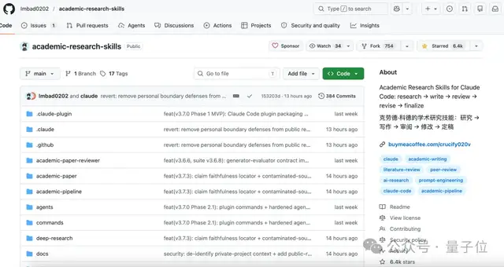
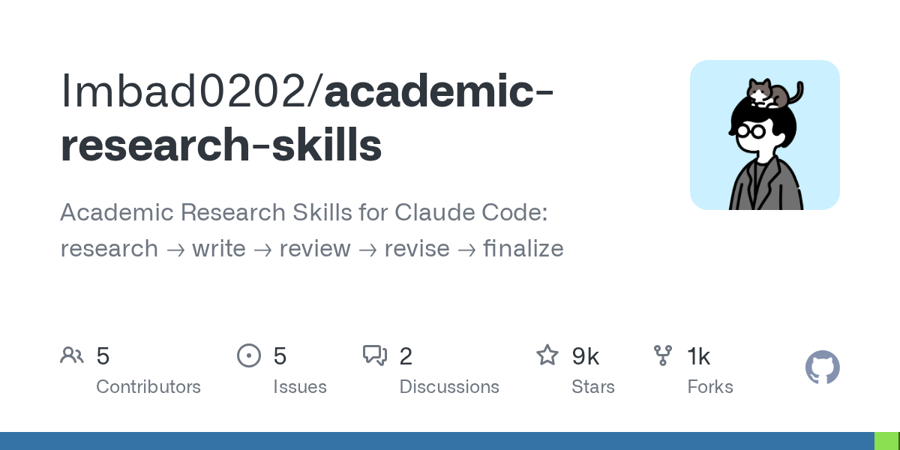
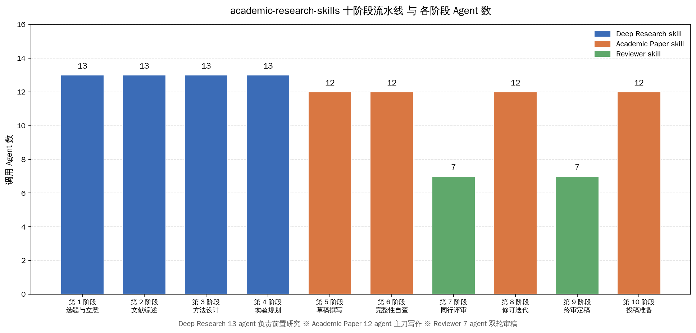
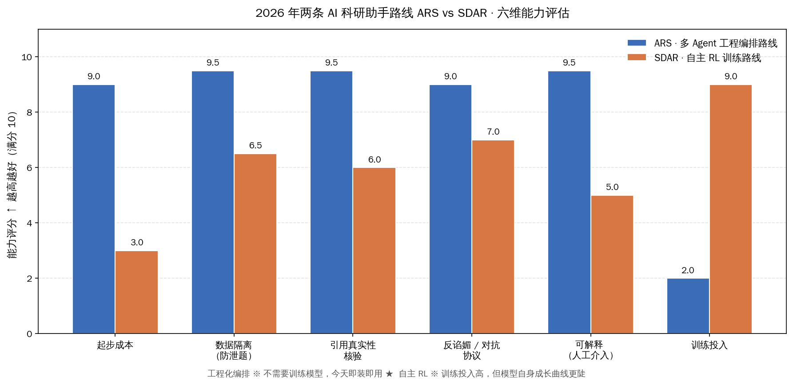

# Claude Code 替你睡觉时写论文

## 全文核心：科研写作第一次真敢往顶会投了

上交一位即将毕业的研究生 5 月 16 日晚上把目标声明丢给 Claude Code 就睡了。第二天醒来，文献综述、方法设计、实验脚本、初稿草稿、自审与修订意见已经全部铺好，他只花了一下午重画图就把论文递了出去。

这位研究生用的不是科幻小说里的 AGI，而是吴政宜（Edward Cheng-I Wu）开源到 Claude Code 插件市场的 academic-research-skills——截至 5 月 17 日 GitHub 攒到 9238 个 star，2026 年 2 月 26 日上线、不到 3 个月跑到第一梯队 Claude Code skill。

全文核心论断先摆出来：**academic-research-skills 是 Claude Code 插件市场时代第一个把『科研写作』完整跑通的多 Agent 套件，它通过 Semantic Scholar 引用核验、魔鬼代言人反谄媚协议、三层数据隔离三个机制，把 LLM 写论文从玩具演示推到了敢往顶会投的工程产品**。

这是技术报道意义上的转折点：过去三年里 LLM 帮人写论文常被诟病『胡编引用、自我吹捧、容易泄题』，吴政宜这一套 4 个 skill / 32 个 agent / 10 阶段流水线第一次把这三个老毛病同时按下去。

同一时间窗口，上海交通大学团队公开了走另一条技术路线的 ARIS（Auto-Research-in-sleep）系统——一个『多 Agent 工程编排』、一个『跨模型对抗 + 自主训练』，2026 年 5 月这一周正好凑成中国 AI 科研助手两大流派的对照样本。

把核心数据一次摊出来：4 个 skill 串联 32 个 agent 跑 10 阶段流水线，写一篇 1.5 万字论文成本 4-6 美元，真实测试里抓出 15 条捏造引用 + 3 处统计错误，目前在 Claude Code、Codex CLI、Cursor 三个平台上都已经跑通。9238 star / 1026 fork / 43 watcher 的社区规模，让这套 skill 直接成为 Claude Code 插件市场学术轨头部产品。

## skill 分工：32 个 Agent 三线协同

academic-research-skills 把整个科研流水线拆成四件相互衔接的工件，每一件都是一个独立 Claude Code skill，可以单独装、单独跑，也可以由 Academic Pipeline 编排器串起来一口气跑完。

四个 skill 的角色清单如下：

- **Deep Research（13 agent）**：科研团队侧——负责选题、文献综述、方法设计、实验规划这四件最考研究品味的前置任务，13 个 agent 各管一摊（搜索 / 抽取 / 比对 / 分类 / 综述 / 立论等）
- **Academic Paper（12 agent）**：写作团队侧——草稿撰写、完整性自查、修订迭代、投稿准备四件，12 个 agent 分别对应 abstract / intro / related work / methods / experiments / discussion / conclusion / limitations / 图表 caption / appendix / cover letter / response to reviewers
- **Academic Paper Reviewer（7 agent）**：审稿团队侧——同行评审、终审定稿两件，7 个 agent 分饰不同审稿身份（领域专家 / 方法学家 / 统计审稿人 / 写作教练 / 伦理审查 / 复现性审查 / 元审稿人）
- **Academic Pipeline**：编排器——把上面三个 skill 的 32 个 agent 按 10 阶段串起来，给出标准默认顺序，也允许研究者在任意阶段插入手动操作

这套分工的工程价值在于：研究者不需要『从头训一个能写论文的大模型』，也不需要『手写 prompt 拼一个万行 chain』，安装命令两行就能把整条流水线装到自己的 Claude Code 终端：`/plugin marketplace add Imbad0202/academic-research-skills` 然后 `/plugin install academic-research-skills`。装好之后 Claude Code v3.7.0+ 的插件市场会自动管理依赖、版本和 skill 之间的引用关系。30 秒装好、即装即用，这是 Claude Code 插件市场出现之前完全做不到的体验。

12 / 13 / 7 三组 agent 数字背后是吴政宜的一个工程判断：**写作团队比研究团队少一个 agent 的原因，是研究阶段需要『发散搜索』，写作阶段需要『收敛裁剪』；审稿团队只有 7 个 agent，是因为再多反而让审稿意见相互打架，让作者无所适从**。这是 2026 年多 Agent 工程化的一个新经验——agent 不是越多越好，而是按任务类型给容量。

## 工程机制 ※ Semantic Scholar 核验 + 反谄媚 + 数据隔离

academic-research-skills 真正让它从『又一个能写论文的 LLM 玩具』升级到『敢往顶会投的科研工具』的，是三个名字看着不起眼但很硬的工程机制。每一个机制都对应过去三年 LLM 写论文的一个老毛病。

**机制一：Semantic Scholar API 引用真实性核验。** 过去用 ChatGPT / Claude 写论文最大的暗坑是『编引用』——LLM 会随手给你拼一篇看起来很真实但根本不存在的论文标题 + 看起来很合理的作者名 + 看起来很对头的期刊年份。吴政宜在 Academic Paper skill 里加了一道硬闸门：每条 reference 起草完成后，自动调用 Semantic Scholar 的免费 API 把论文标题与 DOI 喂过去，用 Levenshtein 字符串相似度算法做模糊匹配，相似度低于阈值的引用立刻被标红、强制重写。

吴政宜在真实测试里给出过一个数字：**academic-research-skills 在一篇 1.5 万字综述论文的草稿里抓出了 15 条捏造引用 + 3 处统计错误**。这是 LLM 论文造假在工程层第一次被有效拦住。

**机制二：魔鬼代言人 + 反谄媚协议（anti-sycophancy）。** 第二个老毛病是 LLM 太爱『讨好用户』——你让它评估你的方法，它会找各种角度夸你；你让它指出缺陷，它指完一两条就赶紧补一句『但这些都不是大问题』。在严肃科研里，这种讨好就是致命伤。

吴政宜在 Academic Paper Reviewer skill 里专门安插了一个『魔鬼代言人 agent』，它的工作就是反驳论文里每一个论点，给出反驳评分（rebuttal score，0-10 分）。**写作团队收到反驳后，只有当反驳评分 ≥ 4 分时才能动手修改自己的论点；评分低于 4 分时，写作团队不允许承认对方的反驳是对的**——这条规则的工程含义是『AI 不能为了显得好合作就轻易让步』。把『讨好倾向』通过协议层硬性禁掉，这是吴政宜对 sycophancy 这个老问题的一个具体回答。

**机制三：三层数据隔离防泄题。** 第三个老毛病是『考前泄题』——研究人员一不小心把『参考答案』『评分标准』或者『同行评审过的目标论文』丢到 LLM 上下文里，模型直接学会了应试，写出来的论文看起来完美但其实是在套答案。

academic-research-skills 在执行层用了一套三层数据隔离设计：

| 层级 | 内容 | 谁能看到 |
| --- | --- | --- |
| **Layer 1** | 原始输入：研究问题 / 目标方向 / 用户提供的背景 | 所有 agent 都能看 |
| **Layer 2** | 验证后产物：抓到的真实引用 / 实验数据 / 中间产物 | 写作团队 + 审稿团队都能看 |
| **Layer 3** | 评分标准 / 参考答案 / 同行评审过的标杆论文 | **永远不能进写作 AI 的上下文** |

Layer 3 是物理隔离——它只在『元审稿人 agent』和『终审定稿 agent』两个固定角色的上下文里出现，从不被透传给写作团队。这套设计的工程意义是：研究者可以放心把『最近被评审过的相似论文』作为参考标杆喂进 academic-research-skills，不必担心写作 AI 偷看答案。

把这三个机制叠起来看，academic-research-skills 真正解决的是『LLM 写论文』从『辅助工具』走到『生产工具』之间的那段最难的工程鸿沟——可信、可审、可投。

## 对位上交 ARIS：工程编排 × 自主 RL 两条路线

把镜头拉到 2026 年 5 月这一周，国内还有另一条同主题的硬路线被同步公开：上海交通大学团队的 ARIS（Auto-Research-in-sleep）系统，5 月 16 日机器之心做了专访（昨天的「上交 SDAR 自主 RL 训练写论文」专题已经做过深度展开）。ARIS 走的是『跨模型对抗 + 自主训练 + 模型自身进化』路线，跟 academic-research-skills 的『多 Agent 工程编排』路线形成 2026 年中国 AI 科研助手两大流派的对照。

把两条路线的本质区别摊清楚：

| 维度 | academic-research-skills（ARS 路线）| ARIS / SDAR（上交路线）|
| --- | --- | --- |
| 技术哲学 | 用 Claude / GPT 现有模型 + 多 Agent 编排 | 跨模型对抗 + RL 训练让模型自身进化 |
| 起步成本 | 30 秒装好插件，4-6 美元写一篇 | 需要 GPU 集群 · 跨模型 API + 训练投入 |
| 引用真实性 | Semantic Scholar API 硬核验 | 跨模型审稿人投票 + 证据-论点审计 |
| 反谄媚机制 | 魔鬼代言人 agent · 反驳分 ≥ 4 才让步 | GPT-5.4 审稿人 vs Claude 执行人结构化对抗 |
| 数据隔离 | Layer 3 物理隔离不进写作上下文 | 评分模型与生成模型分离 |
| 适用场景 | 个人研究者 / 学生 / 中小团队 | 实验室级别 / 长周期重大方向 |
| 真实战绩 | 9238 star · 真实测试抓 15 条假引用 | 8 小时夜跑内审分 5.0 → 7.5 · 跑 20+ GPU 实验 |
| 开源程度 | MIT-like 许可 · Claude Code 插件即装 | arxiv 论文 + 内部系统 · 暂未开源完整代码 |

两条路线对国内研究者而言不是非此即彼，而是『今天用什么 + 明天往哪走』：

**今天能用的是 ARS 路线**——4-6 美元成本 / 装完即跑 / Claude / GPT / Cursor 三个平台都已经测过。个人研究者、毕业班学生、中小科研团队这一周就能装上跑起来。

**明天的方向在 SDAR / ARIS 路线**——它代表的是『模型自身进化 + 自主 RL』的长周期方向。实验室级团队、有 GPU 预算的科研机构会沿这条线投入。

把这两条路线放在同一坐标系里看，2026 年中国 AI 科研助手赛道的脉络瞬间清晰了：吴政宜代表的工程编排路线证明了『现有 LLM + 好工程』就能让科研写作可投顶会；上交团队代表的自主 RL 路线证明了『让模型自身长出科研品味』也是可达的。这两条路同时跑通，2026 年中国 AI 科研工具圈是真正走到了世界第一梯队。

## 关键数字 ※ 反复回扣全文核心

为了让全文核心论断不悬空，把 academic-research-skills 的关键数字归纳成一张表，方便研究者快速做选型判断：

| 指标 | 数值 | 来源 |
| --- | --- | --- |
| GitHub star 数 | 9238 | 2026-05-17 |
| GitHub fork | 1026 | 2026-05-17 |
| watcher | 43 | 2026-05-17 |
| Claude Code 插件市场上线 | 2026-02-26 | 仓库创建日期 |
| skill 数量 | 4 个 | 量子位 5/17 头条 |
| agent 总数 | 32 个（13 + 12 + 7）| 量子位 5/17 头条 |
| 流水线阶段 | 10 阶段 | 仓库 README |
| 1.5 万字论文成本 | 4-6 美元 | 量子位 5/17 头条 |
| 真实测试抓到的假引用 | 15 条 | 量子位 5/17 头条 |
| 真实测试抓到的统计错误 | 3 处 | 量子位 5/17 头条 |
| 已跑通平台 | Claude Code / Codex CLI / Cursor | 量子位 5/17 头条 |
| 安装命令行数 | 2 行 | Claude Code v3.7.0+ |
| 装好到第一篇论文跑通的时间 | < 30 秒 | 插件市场即装即用 |

9238 star 不到 3 个月攒到位、4-6 美元写一篇 1.5 万字论文、抓出 15 条假引用——把这三组数字翻译成产品判断：**academic-research-skills 已经不是 Claude Code 插件市场里『有人在玩的玩具』，而是『敢往真实场景里推』的工程产品**。

## 国内研究者能怎么用：今天就能跑起来的三件事

把『academic-research-skills 对国内研究者意味着什么』收成可执行的三件具体事：

1. **安装 Claude Code 插件**：在 Claude Code v3.7.0+ 终端跑 `/plugin marketplace add Imbad0202/academic-research-skills` 然后 `/plugin install academic-research-skills`，30 秒装好整套 32 个 agent + 4 个 skill
2. **跑一次完整流水线试水**：拿一篇自己手头正在写的综述或方法论文，把研究问题和已读文献丢给 Academic Pipeline 编排器，让它跑 10 阶段流水线，对比看看 Semantic Scholar 核验抓没抓出引用错误
3. **观察魔鬼代言人 agent 的反驳质量**：写作过程中重点看『反驳评分 ≥ 4 分』的修改建议——这些是 ARS 路线给国内研究者的最大增值，看完一轮就能判断这套工具值不值得正式接入毕设 / 投稿流程

对国内研究者最实在的好处是『成本低 + 中文友好』：academic-research-skills 同时支持繁体中文和英文输出，国内研究者用中文写需求、英文写论文、最后让 Reviewer skill 复审一遍，整套下来一篇 1.5 万字论文不到 50 块人民币。这对预算紧、时间紧的毕业班学生 / 青椒老师是真福音。

更广的图景是：2026 年 5 月这一波 Claude Code 插件市场已经出现了科研轨头部产品，这意味着 AI 科研工具的『可复用 skill』模式已经走到了能让陌生研究者一键装一键跑的成熟期。同时上交团队的 ARIS / SDAR 路线证明国产实验室也在自主 RL 训练路径上交出了成果。

国内研究者这一代是真正幸运的：上一代博士生写论文要从 Google Scholar 一篇一篇翻引用，这一代用 academic-research-skills 一晚上就能让 32 个 agent 把流水线跑完；上一代担心 LLM 编引用不敢用，这一代有 Semantic Scholar 硬核验兜底。前辈把这条路趟出来了，剩下的就看我们这一代怎么把工具用好、把研究做扎实。路在前面，共勉。
