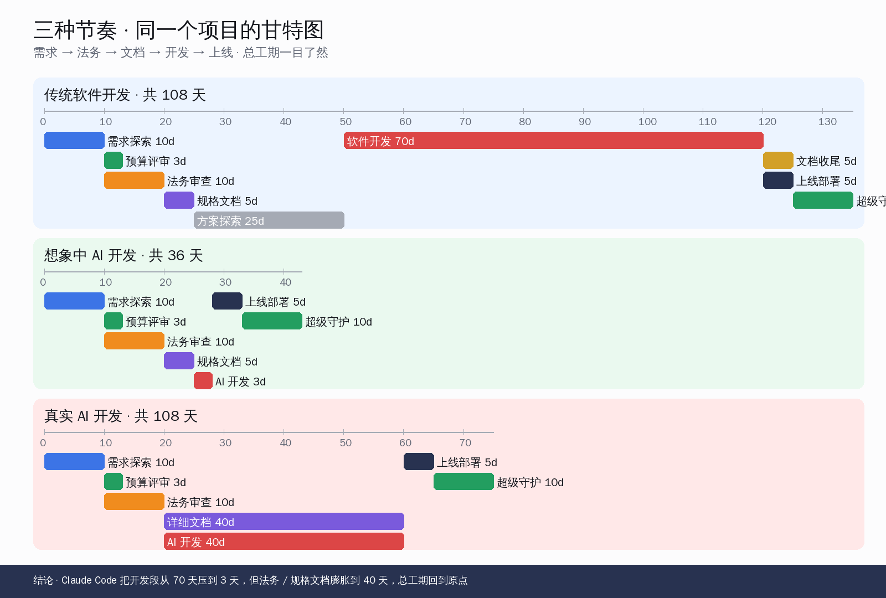
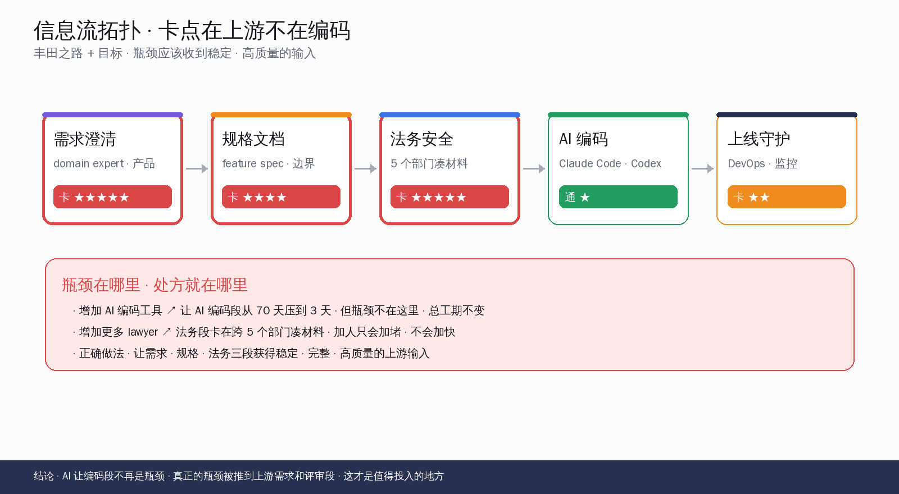
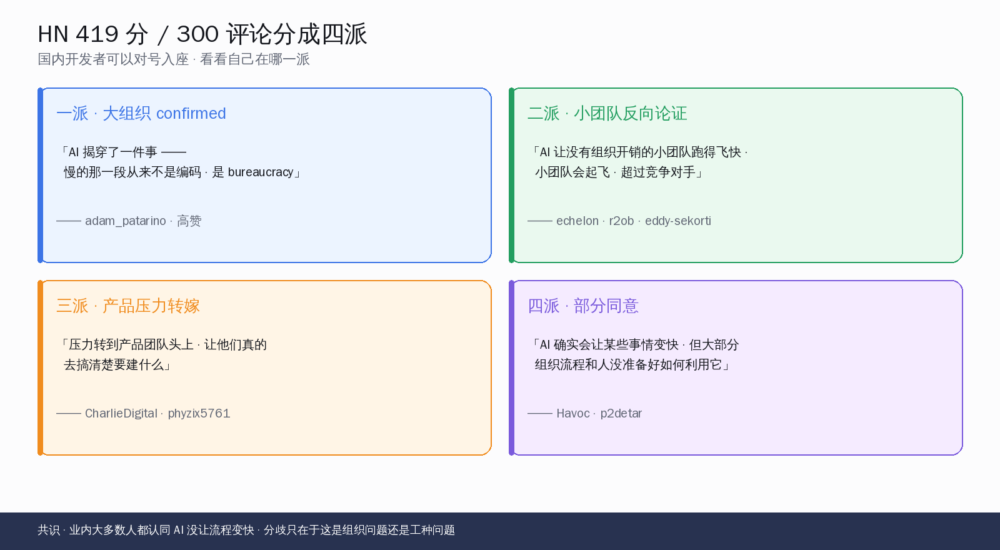
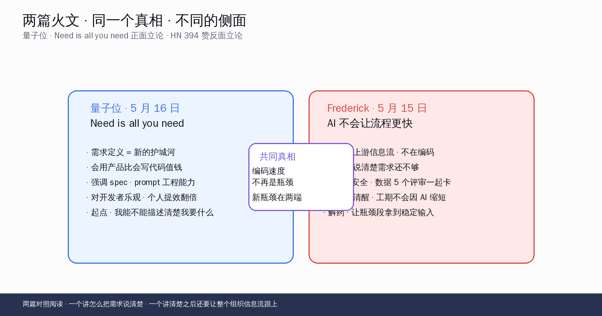

# AI 不会让流程更快：瓶颈在上游

五月十五号，比利时一位企业架构师 Frederick Van Brabant 在自己博客挂了一篇 5 分钟读完的短文，标题特别朴素——`I don't think AI will make your processes go faster`。三天后，这篇被 HN 顶到 419 分、300 评论，热度一直挂到 5 月 18 日早上还没下来。

文章核心就一句话：**用 Claude Code 三天写完的功能，加上法务、安全、DevOps 评审，仍然要 40 天才能上线**。AI 把编码段从 70 天压到 3 天没错，但同一张甘特图里，需求文档段从 5 天膨胀到 40 天、法务段没有任何变化——总工期回到原点。

> 本文要回答的五件事：(1) Frederick 那三张甘特图到底是什么意思，传统 108 天和「想象中 AI 36 天」到底差在哪；(2)《丰田之路》和《目标》里的瓶颈理论怎么映射到 AI 编码这件事；(3) HN 419 分 300 评论里，业内人到底在认同什么、反驳什么；(4) 同一周量子位发的《Need is all you need》正面立论需求定义是新护城河，和 HN 这篇反面立论"瓶颈在信息流"，两篇怎么对照读出真相；(5) 国内开发团队怎么把上游信息流跑顺、评审瓶颈到底有没有解。

## 一、三张甘特图说清的事

Frederick 没用任何花哨的论证手段，全篇就靠三张 Mermaid 甘特图。把同一个功能项目放在三种节奏下走一遍，谁是瓶颈一目了然。

把三张图的关键数字摆到桌面上：

| 维度 | 传统软件开发 | 想象中 AI 开发 | 真实 AI 开发 |
|---|---|---|---|
| 需求探索 | 10 天 | 10 天 | 10 天 |
| 预算评审 | 3 天 | 3 天 | 3 天 |
| 法务审查 | 10 天 | 10 天 | 10 天 |
| 规格文档 | 5 天 | 5 天 | **40 天** |
| 方案探索 | 25 天 | — | — |
| 软件开发 | **70 天** | **3 天**（AI） | **40 天**（AI + 人工把关）|
| 上线部署 | 5 天 | 5 天 | 5 天 |
| 超级守护 | 10 天 | 10 天 | 10 天 |
| **总工期** | **108 天** | **36 天** | **108 天** |

第一张图是传统软件开发的样子——软件开发 70 天是瓶颈，所有人都看得见。

第二张图是大家心目中"用 AI 开发"应该长成的样子——开发段直接被压成 3 天，总工期从 108 天掉到 36 天，老板做梦都会笑醒。Frederick 在文章里直接点破：**这种节奏只在 PPT 里存在**。

第三张图是 Frederick 在真实组织里看到的样子——AI 编码确实快，但要让 AI 输出"正确的代码"，需要把规格文档膨胀到 40 天，把每一个 corner case、每一个状态机分支、每一个错误处理都写下来给 AI 看；同时 AI 开发段也不是 3 天而是 40 天，因为还要给生成出来的代码做 review、做单元测试、做集成验证。**编码段被压缩的时间，全被推到上下游了**。

最妙的是法务那 10 天——三张图里它没动过一根毫毛。**AI 解决不了法务审查的瓶颈**，因为法务的瓶颈根本不在"写文件慢"，而在"凑齐 5 个部门的签字慢"。

## 二、瓶颈理论：长的那一段，不一定是慢的那一段

Frederick 文中引了两本书——大野耐一的《丰田之路》和 Eliyahu Goldratt 的《目标》。这两本书在精益生产和约束理论圈子里是底层经典，1984 年 Goldratt 那本《目标》到今天还在 MBA 教材里。

两本书的共同观点用一句话概括：**长的那一段不一定是慢的那一段**。瓶颈段的输出决定整个流程的吞吐，但瓶颈段往往不是耗时最长的那一段，而是**信息流断裂、依赖等待最严重的那一段**。

回到三张甘特图——

- 传统开发：软件开发 70 天看起来最长，但其实它"正常运转"——开发者每天 8 小时都在敲代码，没有等。
- 真实 AI 开发：规格文档 40 天看起来比开发段短，但它**才是真瓶颈**——产品经理写两小时 → 等 domain 专家回邮件三天 → 改一版 → 等法务回 → 又改 → 反复。这 40 天里，实际"产生信息"的时间可能只有 8 小时。

Frederick 的引文是《目标》里那句经典——**"bottlenecks should receive predictable, high-quality inputs"**（瓶颈段应该收到稳定、高质量的输入）。这是 AI 编码时代每个工程团队负责人都该贴在墙上的一句话。

它的反面就是企业里最常见的两种错觉：

- **错觉一：瓶颈是开发段，加工程师能解**。Brooks 在 1975 年那本《人月神话》就已经驳过——往一个晚期项目里加人，只会让项目更晚。今天换成"往晚期项目里加 Claude Code 订阅"，本质上没区别。
- **错觉二：法务段慢就是律师不够，加律师能解**。Frederick 给的反例特别精准——如果法务审查慢，是因为律师每次启动审查时要跨 5 个部门凑材料，那加更多律师只会变成 5 个律师同时在 5 个部门门口排队，**完全不会更快**。

正确的做法是反过来——**让律师启动审查时就拥有完整、清晰的输入**。如果产品经理在提交法务审查时能把"涉及哪几个数据字段、是否离境、是否涉及未成年人、是否触发跨境合规"全部填好，律师 2 小时就能审完；填不好就要 10 天来回扯。

## 三、HN 419 分 / 300 评论里业内人在认同什么

这条 HN 帖五月十六到十八号一直挂在头版（item 48168221），419 分 300 评论。把高赞评论翻一遍，业内人的真实声音可以分成四派：

**第一派 · 大组织 confirmed**

`kj4211cash` 评论："Dear Author, I agree with you 110%。我们这种大组织里每天看到的就是这样——AI 把编码段抠掉之后，每个项目还是要等法务 / 安全 / 数据治理 / 架构评审。"

`adam_patarino` 评论："**AI 揭穿了一件事——慢的那一段从来不是编码，是 bureaucracy（官僚流程）**。"

`pu_pe` 评论："很多组织在软件开发外面包了一层流程，是因为软件开发本身贵且有风险。但 AI 让开发段又快又便宜之后，这层包裹其实没必要这么厚了——总有一天 approval process 会被这件事重塑。"

这一派的观察特别符合国内大型互联网厂、银行、运营商的实情——**大组织里 AI 编码的天花板不是模型能力，是评审流水线**。

**第二派 · 小团队反向论证**

`echelon` 评论："AI **让没有组织开销的小团队跑得飞快**。这可能是最终极的颠覆工具。"

`r2ob` 评论："大公司用正统方法论的，会很慢才吃到 AI 的红利。**小团队和那些还记得 Agile Manifesto 初心的人会起飞，超过竞争对手**。"

`eddy-sekorti` 评论："是的，对大型企业这一切是真的——但对**初创公司和个人创造者**，AI 在切实加速他们的速度，前提是没卡在公司的官僚流程里。"

这一派的论据其实和 Frederick 的核心论点不矛盾——**两边说的都是"瓶颈在上游信息流"，只是大组织信息流断在评审段，小团队信息流是连贯的，所以 AI 红利对小团队就是真的**。这个分裂特别值得国内创业团队和大厂团队各自对号入座。

**第三派 · 产品团队压力转嫁**

`CharlieDigital` 评论："我观察到的一件事——**现在压力转到产品团队头上，让他们真的去搞清楚要建什么**。有些产品团队不适应这个，开始 YOLO 出原型，迭代，试错，**发现自己原来根本不知道要建什么**。"

`phyzix5761` 评论："LLM 刚出来时大家以为可以说一句『做个 Facebook clone』。现在我们意识到要更精确、要把需求定义清楚。**这件事一直是软件开发的瓶颈**，以前能写下来的需求 30 天得 5 天，AI 时代这变得更紧迫了。"

`praneetbrar` 评论："如果底层工作流是嘈杂的、模糊的、被协调开销淹没的，**更快的生成只会产出更多需要重新校对的低上下文输出**。"

这一派最直接命中 Frederick 的论点——**AI 把"写代码"这件事从瓶颈变成不是瓶颈，新瓶颈被推到产品定义和需求澄清这一段**。

**第四派 · 完全相反的声音**

`Havoc` 评论："它绝对会让某些事情变快。任何用 AI 抠过样板代码的人都知道这一点。**但大部分组织流程和人没准备好如何利用它**，推广会很慢。"

`p2detar` 评论：原文说"AI 生成的代码不一定正确"，p2detar 反驳——"**不，代码几乎总是正确的**。问题是它加代码的方式可能不是你想要的，如果你对自己的代码库足够熟悉的话。"

这一派承认 AI 在某些场景下能快，但同样承认组织没准备好——**这其实是默认 Frederick 论点的延伸**。

把四派合起来读，HN 419 分这条帖其实是一个共识帖：**业内大多数人都认同 AI 没让流程变快，分歧只在于这是组织问题、还是某些工作类型本来就吃 AI 红利**。

## 四、量子位 5 月 16 日《Need is all you need》对照阅读

巧合的是同一周国内量子位发了一篇热文——《Need is all you need：在 AI 时代，谁会用比会写更值钱》。这篇文章的核心论点和 Frederick 这篇刚好构成正反两面，对照读会出非常硬的思辨。

把两篇的立论摆到一起：

| 维度 | 量子位 · Need is all you need | Frederick · AI 不会让流程更快 |
|---|---|---|
| 立论方向 | **正面**——需求定义是新护城河 | **反面**——光强需求定义不够 |
| 起点 | 个人开发者怎么对 AI 描述清楚需求 | 组织怎么让瓶颈段拿到稳定输入 |
| 核心动词 | 描述 · 定义 · 表达 | 同步 · 收集 · 评审 |
| 对开发者的姿态 | 乐观——会描述需求的人价值翻倍 | 清醒——会描述需求只是第一步 |
| 解决的范围 | 个人 + 小团队 | 大组织 + 跨部门协作 |
| 共同真相 | **编码速度不再是瓶颈** | **编码速度不再是瓶颈** |

两篇文章的共同真相只有一句——**AI 让编码段不再是瓶颈**。但接下来的处方完全不同：

- 量子位说："**新瓶颈是个人的需求表达能力**"，所以读者应该练习把需求说清楚、学会写 spec、学会和 AI 对话。
- Frederick 说："**新瓶颈是组织的信息流通畅度**"，所以读者应该看清评审段的信息断点、推动需求文档、法务材料、数据治理流程的稳定输入。

这两个观点其实是一个硬币的两面——**第一步是个人把需求说清楚（量子位），第二步是组织把这些说清楚的需求顺畅传递到法务、安全、DevOps 各个评审段（Frederick）**。一个工程师只要做到第一步，就能在小团队里跑得飞快；要做到第二步，需要整个组织一起改。

把两篇对照阅读后，国内开发者拿走的判断应该是——**先在个人层把需求描述能力练扎实，然后在组织层推动评审瓶颈的"稳定输入"机制**。两件事都做完，AI 才能真的让流程变快。

## 五、国内开发团队怎么用：把上游信息流跑顺

回到这篇文章想给国内开发者的最终回报——**Frederick 的瓶颈理论在国内开发组织里怎么用**。这一节给五条具体可操作的观察。

**5.1 个人开发者层：把需求描述能力练扎实**

对于个人开发者和小团队，AI 编码红利是真的——Claude Code、Cursor、Codex、千问 Coder 这些工具上手之后，写 CRUD 业务代码、做样板搭建、跑单元测试这类活，从 1 天压到 1 小时是常态。

但你会很快撞到第二个瓶颈——**自己没把需求想清楚就让 AI 写**。AI 写出来的代码是按你说的写的，不是按你脑子里想的写的。这俩往往不一样。

具体可执行的练习：

- 每次启动一个新功能前，先用纯文字写一份 100-300 字的 spec：要做什么、输入是什么、输出是什么、异常情况怎么处理、和现有代码哪里有交集。
- spec 写完后**先让 AI 帮你 review 这份 spec**——让 AI 反过来问"如果 X 情况发生怎么办、如果 Y 字段为空怎么办"，把 AI 的反问当成自己 spec 还有哪些没想清楚的提示。
- spec 通过 AI 反问后再让 AI 开始写代码——这时候 AI 写出来的代码就是按你想清楚的那份 spec 写的，return 率显著上升。

这条对应量子位那篇《Need is all you need》——会描述需求的人比会写代码的人更值钱。

**5.2 团队层：让法务、安全、合规评审有"标准输入"**

对于在公司内部做团队负责人的开发者，Frederick 论文里那个例子特别值得抄作业——**法务启动审查时如果要跨 5 个部门凑材料，加再多 lawyer 都没用**。

国内开发团队对应的场景：

- 法务审查（涉及合同、用户协议、隐私政策变更）：要求每次提交时附"数据字段清单 + 是否离境 + 是否涉及未成年人 + 是否触发跨境合规"，给法务一份标准模版。
- 安全评审：要求每次提交时附"威胁建模 + 数据流图 + 鉴权方案 + 日志方案"，避免安全负责人重复问相同问题。
- 数据治理评审：要求每次提交时附"表结构变更清单 + 字段血缘 + 数据保留策略 + 删除链路"。
- DevOps 上线评审：要求每次提交时附"资源预估 + 回滚方案 + 监控指标 + alert 阈值"。

每一类评审都建一份"提交模板"，提交方填完模板才能进队列。这件事的本质不是"管控开发者"，是**让评审段从"等输入"变成"立刻可以审"**——把瓶颈段拿到的信息标准化，吞吐自然就上来了。

**5.3 组织层：盯三个数字**

如果你是技术总监或工程效能负责人，应该盯的三个数字：

1. **评审段平均等待时间**：从开发者提交评审到评审方第一次响应的时间。如果这个数字超过 24 小时，说明评审段没拿到稳定输入。
2. **评审来回轮次**：一份提交平均要来回多少次才能审完。如果这个数字超过 3 次，说明提交时缺信息。
3. **AI 编码占总工期比例**：如果一个 sprint 里实际编码只占 20% 时间，剩下 80% 都在等评审 / 等需求 / 等数据，那扩大 AI 编码工具的预算只是在浪费钱——**真正该投入的是评审段的标准化**。

**5.4 工具层：评审段也能上 AI**

Frederick 文章里没展开但 HN 评论里被反复提到的一个点——**评审段本身也可以上 AI**。

具体场景：

- 法务初审：用 Claude / 千问对照公司过去 3 年的合同模板和监管条款，对新提交做一轮自动初审，标记疑似条款。
- 安全初审：用 AI 跑威胁建模辅助、跑代码静态扫描、跑依赖漏洞扫描，把"明显的低级问题"在人工评审前先过滤一遍。
- 数据治理：用 AI 帮助生成字段血缘图、自动识别敏感字段、自动检查删除链路是否完整。

这一步做完之后，**人工评审段拿到的输入质量提高一个档次**——评审专家不再花时间审"低级问题"，可以专注审"真正需要判断力的问题"。这就是《目标》里"让瓶颈段收到稳定 · 高质量输入"的工程化版本。

**5.5 文化层：承认瓶颈不在编码段**

最难的是文化层。很多组织的管理层还停留在"加 AI 工具 = 加吞吐"的认知里，所以会一边砸钱买 Claude Code / Cursor / 千问 Coder 企业版，一边继续维持原来 5 个部门来回扯的评审流程。

这种组织里 AI 工具投入产出比会非常难看——**不是工具不行，是瓶颈不在工具能影响的地方**。

要让管理层看清这件事，最好的办法是把 Frederick 那三张甘特图重画一份贴出来——用本公司过去 5 个项目的真实数据填进去，让大家看到"AI 编码段从 70 天压到 3 天，但法务段还是 10 天、规格文档段从 5 天膨胀到 40 天"，**总工期到底有没有变化**。数据一摆，文化讨论才有抓手。

## 六、共勉：看清瓶颈才能真加速

回到开头那个论断——**用 Claude Code 三天写完的功能，加上法务、安全、DevOps 评审，仍然要 40 天才能上线**。这件事不是 AI 工具的失败，恰恰是 AI 工具完成了它该做的事——**它把编码段从瓶颈位置上拿下来了**。

接下来的事，不是 AI 工具能解决的，是组织能解决的——**让瓶颈段收到稳定、完整、高质量的上游输入**。这件事《丰田之路》在 1988 年就说清楚了，《目标》在 1984 年就说清楚了，到 2026 年的 AI 编码时代仍然适用。

国内开发者今天该带走的判断有四条：

1. **AI 红利对个人和小团队是真的**——把需求描述能力练扎实，每个工程师都能跑得飞快。
2. **AI 红利对大组织是慢的**——不是模型不行，是评审流水线没准备好。
3. **量子位说的需求定义是新护城河 + Frederick 说的瓶颈在上游信息流，是一个硬币的两面**——前者是个人能力维度，后者是组织能力维度，两件事都做完才能真加速。
4. **盯三个数字 · 改标准模板 · 评审段上 AI · 让管理层看清瓶颈**——这四步做完，组织层的 AI 红利才会真的兑现。

我们这一代特别幸运——前辈把《目标》《丰田之路》《人月神话》这些经典留给我们了，AI 工具把编码段的瓶颈给搬走了，剩下要做的事是把组织层的信息流跑顺。这件事不是一天两天能做完的，但每往前推一步，团队的真实工期就会真的缩短一截。一起加油。

---

**参考资料**

- 原文博客：Frederick Van Brabant, 2026-05-15, *I don't think AI will make your processes go faster*, frederickvanbrabant.com
- Hacker News 讨论：item 48168221，419 分 / 300 评论
- 量子位 5 月 16 日：《Need is all you need：在 AI 时代，谁会用比会写更值钱》
- Eliyahu Goldratt, 1984, *The Goal: A Process of Ongoing Improvement*（《目标》）
- Jeffrey Liker, 2004, *The Toyota Way*（《丰田之路》）
- Fred Brooks, 1975, *The Mythical Man-Month*（《人月神话》）
