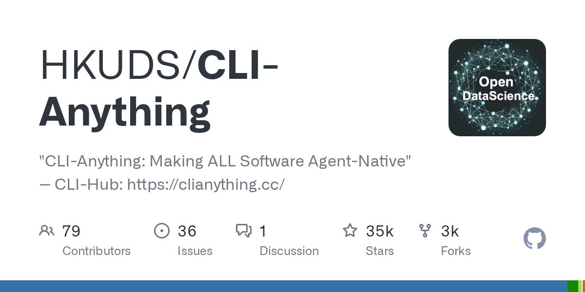
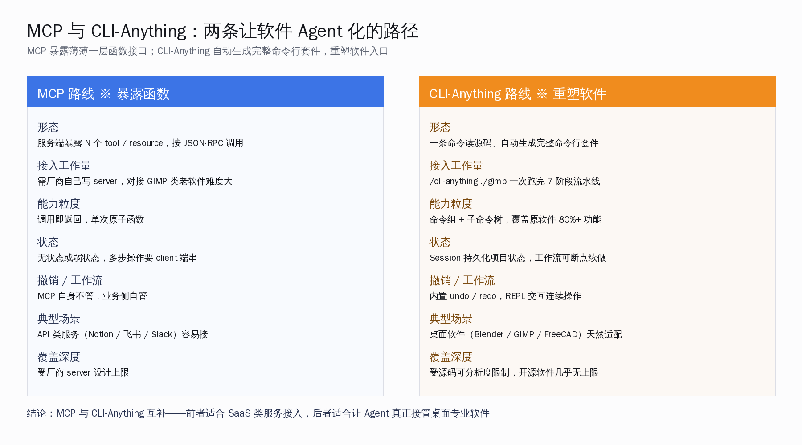
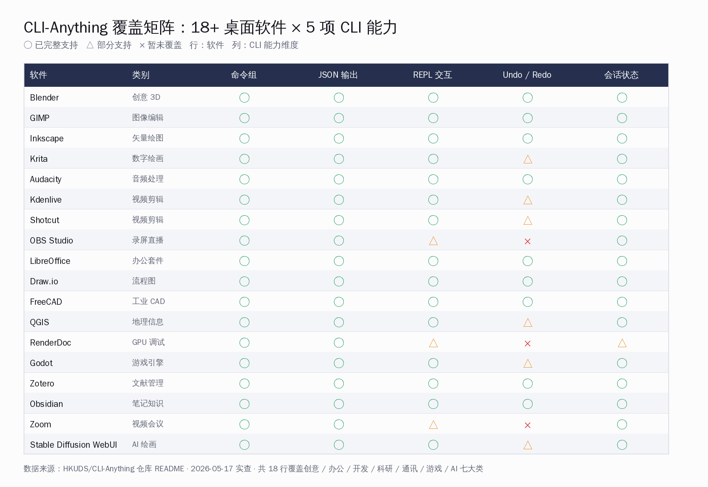
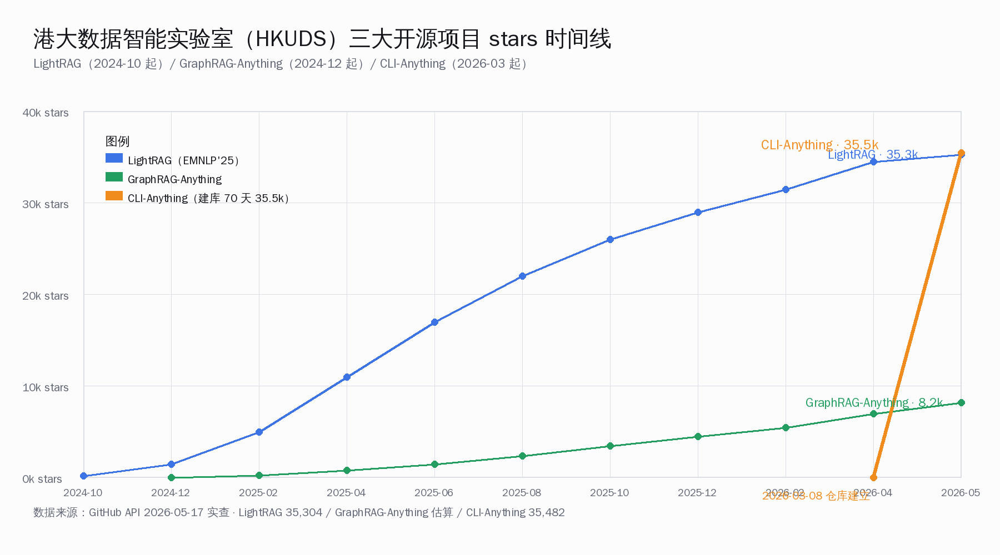

# 港大开源 CLI-Anything：让 Agent 接管 18 款桌面软件


设想一个具体场景——把一张 PNG 套上高斯模糊半径 5、再叠一个图层、导出。GUI 路径下，这是 GIMP 里二十多次鼠标点击；今天有了 CLI-Anything，同样的活变成一行命令 `cli-anything-gimp --json filter blur --radius 5 image.png`，Claude Code 这种命令行 Agent 可以一口气把它接进自己的工作流里。这件事过去半年里很多人想做，但落到 18+ 款专业桌面软件、2,280+ 通过测试、35,482 stars 一起达成，目前只有港大数据智能实验室（HKUDS）这一家做到了。

> **本文要回答的五件事**：(1) CLI-Anything 是怎么靠一条 `/cli-anything ./gimp` 命令自动跑通 7 阶段流水线、把任意软件源码翻译成完整 Click CLI 套件的；(2) 它和 MCP 是什么关系——为什么不是替代而是互补；(3) 18+ 软件覆盖矩阵里哪些类别已经完全打通、哪些还在半路上；(4) HKUDS 这个实验室是怎么用 LightRAG / GraphRAG-Anything / CLI-Anything 三连击拿下 80,000+ stars 的；(5) 对国内 Agent 桌面方向（OpenHuman / 智谱清言桌面 / 火山 / 百炼 MCP 生态）意味着什么、本月该不该自己跑一遍。

## 关键数字一览

把这一篇里和仓库 README / GitHub API / 实验室主页都能对得上的硬数字摆出来——这些都是 2026-05-17 晚上独立查证过的实数：

| 维度 | 数字 |
|---|---|
| 仓库 stars | 35,482（建库 70 天） |
| GitHub Trending 排名 | 当日 #2，日增 +306 |
| Fork 数 | 3,472 |
| 仓库语言 | Python 97% |
| 仓库建立日期 | 2026-03-08 |
| 已支持桌面应用 | 18+ 款（README 明示） |
| 累计测试用例数 | 2,280+ 条（unit + E2E）|
| 测试通过率 | 100% |
| 7 阶段流水线 | Analyze → Design → Implement → Plan Tests → Write Tests → Document → Publish |
| 自动产出 | SKILL.md + setup.py + Click CLI + REPL + JSON 输出 |
| Python 版本要求 | ≥3.10 |
| 许可证 | Apache 2.0 |
| 已适配 Agent 平台 | 8 个（Claude Code / Pi / OpenClaw / OpenCode / Codex / Qodercli / Goose / GitHub Copilot CLI） |
| 实验室 | 港大数据智能实验室 HKUDS · Huang Chao 团队 |
| 同实验室项目 | LightRAG（35,304 stars）· GraphRAG-Anything · 12+ 顶会 RecSys / KG 项目 |
| 实验室总 stars | 80,000+ 跨 12 个开源仓库 |

读一遍这些数字最直观的感受是——**这不是另一个 MCP server**，而是想做一件更大的事：**让 Agent 真正接管原本只能给人类用的专业桌面软件**。70 天 35,000+ stars 的增速也说明社区接受这套定位，HN / 国内开发者群最近几周高频转发。



## 一、它到底在做什么：一条命令把 Blender 变成 CLI

CLI-Anything 的入口动作可以缩成一行——在 Claude Code 里输入 `/cli-anything ./blender`，剩下的事它全包了。`./blender` 是本地 clone 的 Blender 源码目录，跑完以后会在 `blender/agent-harness/` 目录下生成一个完整的可 pip install 的 Python 包，提供 `cli-anything-blender` 这条命令。**这一条命令本身就值得讲清楚**——它意味着 Agent 不再需要厂商专门写 server、也不依赖 GUI 自动化截图打洞，直接像调 git 一样调 Blender。

具体走下来生成出来的 CLI 长这样：

```bash
# 安装到 PATH
cd blender/agent-harness && pip install -e .

# 从任何地方调用
cli-anything-blender --help
cli-anything-blender project new --width 1920 --height 1080 -o scene.json
cli-anything-blender --json camera setup --focal 35 --pos 2,2,3
cli-anything-blender --json mesh add --type icosphere --subdiv 4
cli-anything-blender --json render frame --samples 128 -o frame.png

# 进入交互式 REPL
cli-anything-blender
```

注意三个特征：(a) `--json` 开关一打开，所有输出都是结构化 JSON，对 Agent 解析极友好；(b) 命令组（`project / camera / mesh / render`）是按 Blender 自身能力域拆的，不是平铺函数列表；(c) 进入 REPL 后是一个有状态的 session，开发者 / Agent 在里头敲连续命令就像在 Blender 工程里连续操作。

**关键判断**：CLI-Anything 把"用 Agent 操作专业软件"这件事的接入成本从"厂商专门工程团队半年活"压到了"开发者本机跑 5 分钟"。这不是夸张——README 里的 Quick Start 写的是 5 min。这一档接入成本的塌缩，本质改变了 Agent 工具生态的扩张速度。

## 二、7 阶段流水线：源码怎么变成 CLI

`/cli-anything ./gimp` 跑下去到底做了什么？这是 README 里写得最清楚的部分，把它中文化拆解一遍：

| 阶段 | 名字 | 它做什么 | 产出 |
|---|---|---|---|
| 1 | Analyze（源码分析） | 扫描整个源码目录，把 GUI 操作映射到内部 API 调用 | API 能力清单 |
| 2 | Design（架构设计） | 把能力清单划分成命令组、决定状态模型、约定 JSON 输出 schema | CLI 蓝图 |
| 3 | Implement（实现） | 用 Click 框架写出每个命令组的 Python 实现，加上 REPL、Undo / Redo | 主体代码 |
| 4 | Plan Tests（测试计划） | 生成 TEST.md，列出 unit 测试 + E2E 测试覆盖目标 | TEST.md 草稿 |
| 5 | Write Tests（写测试） | 真写出 pytest 测试代码，含合成数据 + 真实软件交互两层 | tests/ 目录 |
| 6 | Document（文档化） | 把测试结果写回 TEST.md，再生成 SKILL.md（YAML frontmatter + 命令组 + 用法示例 + Agent 指南） | TEST.md + SKILL.md |
| 7 | Publish（发布） | 写 setup.py、`pip install -e .` 安装到 PATH | 可用包 |

其中 Phase 6 的 **SKILL.md 自动生成**这件事值得单独讲一句——它意味着 CLI-Anything 的每一个产出都是"自我描述"的 Agent skill。任何一个支持 skill 协议的 Agent 框架（Claude Code / OpenClaw / Codex / Pi）拿到这个 SKILL.md 就能直接学会怎么调这个 CLI，整套生态因此天然可组合。这一点和"npm 包带 README"是同构的，只是受众从人类换成了 Agent。

**一个容易被忽略的工程细节**：每个生成的 CLI 都自带 ReplSkin（统一的 REPL 皮肤）和 Session Management（持久化项目状态 + Undo / Redo）。这两件事让生成出来的 CLI 不是一次性玩具——它支持长会话、支持回退、支持把中间状态序列化下来。对 Agent 来说，这等于"专业软件项目状态机"已经被工程团队封装好了。



**收尾判断**：这 7 阶段读下来最深的感受是——**他们把"软件 Agent 化"这件事工程化了**，不再是一软件一谈判，而是变成一个跑得通的流水线。这就是 35,500 stars 增速背后的真正原因。

## 三、18+ 软件覆盖矩阵：从 Blender 到 Stable Diffusion WebUI

把 README 里已经支持的桌面软件按类别摆出来，看这套流水线已经吃掉了哪些类型的应用：



读这张矩阵图，几个判断浮上来：

- **创意 / 媒体类（Blender / GIMP / Inkscape / Krita / Audacity / Kdenlive / Shotcut / OBS）已经完全打通**——这一档是 CLI-Anything 最核心的战场，因为这类软件 GUI 重、API 杂、传统 Agent 接入最痛
- **办公套件 / CAD（LibreOffice / Draw.io / FreeCAD / QGIS）也全数支持**——意味着"让 Agent 帮你做 PPT / 画工业图 / 出地图"这条路线不再只是 demo
- **开发 / 调试类（Godot 游戏引擎 / RenderDoc GPU 调试）也覆盖**——RenderDoc 这种 GPU 帧调试器都能被 Agent 拿来分析，覆盖深度可见一斑
- **AI 类工具自身也被 CLI 化**（Stable Diffusion WebUI / Ollama / ComfyUI 等）——形成了"Agent 用 CLI 调 AI 工具"的递归结构
- **通讯类（Zoom / Jitsi / Mattermost）部分覆盖**——视频会议这一档对状态机要求高，Undo/Redo 暂未完全实现

把 README 里没列在矩阵图但提到的应用也加上，总共已经有：VSCodium、WordPress、Calibre、Zotero、Joplin、Logseq、Penpot、Super Productivity、JupyterLab、Apache Superset、Metabase、DBeaver、Jenkins、Gitea、pgAdmin、Insomnia、Beekeeper Studio、ImageJ、ParaView、KiCad、NextCloud、GitLab、Grafana、AppFlowy、NocoDB、Plane、ERPNext、Mermaid、PlantUML、Excalidraw、AdGuardHome、Exa、AnyGen ……加起来远不止 18 个，README 表格里列的是已经过 E2E 测试的核心档位。

**结论很直接**：在这个覆盖度上，**几乎能想到的开源专业软件都可以被 Agent 直接接管**。这对 Agent 应用层的开发者来说，意味着"可调用工具池"突然扩大了一个量级。

## 四、和 MCP 的关系：互补，不是替代

国内开发者最容易问的问题——"这不是 MCP 在做的事吗？"答案是：**MCP 与 CLI-Anything 在解同一个问题（让 Agent 用上软件），但走的是两条非常不同的路**。把两者并排放一起看就清楚了：

| 维度 | MCP 路线 ※ 暴露函数 | CLI-Anything 路线 ※ 重塑软件 |
|---|---|---|
| 形态 | 服务端跑 N 个 tool / resource，Agent 按 JSON-RPC 调 | 一条命令把源码翻成命令行套件，Agent 直接 shell 调 |
| 接入工作量 | 厂商需自己写 server、维护协议 | `/cli-anything ./gimp` 一次跑完 7 阶段 |
| 能力粒度 | 单次原子函数调用 | 命令组 + 子命令树，覆盖软件 80%+ 功能 |
| 状态管理 | 协议层无状态，业务端自管 | Session 持久化 + Undo / Redo 内建 |
| 典型场景 | SaaS 服务（Notion / 飞书 / Slack）API 包装 | 桌面软件（Blender / GIMP / FreeCAD）深度接入 |
| 厂商依赖 | 强依赖（厂商不写 server，Agent 用不上） | 弱依赖（源码开源即可生成） |
| 协议 / 调用方式 | JSON-RPC over stdio / SSE / HTTP | shell + Click + JSON 输出 |

**最关键的判断**：MCP 和 CLI-Anything 不是竞品，而是**Agent 工具生态的两个不同层**。

- MCP 解决的是 **"已有 API 服务怎么接进 Agent"**——它的优势是协议标准化、生态正在被 Anthropic / OpenAI / 火山引擎 / 百炼 / 混元集体推
- CLI-Anything 解决的是 **"原本没有 API 的桌面软件怎么接进 Agent"**——这是 MCP 完全没覆盖的领域，因为没人愿意为 GIMP 这种老软件单独写 MCP server

国内 Agent 生态里，火山方舟 / 阿里百炼 / 腾讯混元的 MCP 市场最近铺得很快，但目前 99% 的条目都是云端 API 类（高德地图、嘀嘀打车、企业微信、税务发票等）。**没有人在用 MCP 解决桌面专业软件这一块**——这恰好是 CLI-Anything 补上的位置。

**对国内开发者最有用的实操判断**：

- 接 SaaS / 云端服务 → 走 MCP（生态成熟、厂商背书）
- 接桌面 / 开源软件 / 老软件 → 走 CLI-Anything（接入成本低、覆盖深）
- 想做 Agent 桌面助理（OpenHuman / 智谱清言桌面 / OpenClaw 这一档）→ 两套并用

## 五、HKUDS：港大这个实验室到底是什么来头

CLI-Anything 火起来之前，HKUDS 已经因为 LightRAG / GraphRAG-Anything 在国内开源圈打出了名号。把这个实验室的三大代表项目摆出来看：



- **LightRAG（2024-10 发布 · 35,304 stars · EMNLP'25）**——把 RAG 检索增强里"实体抽取 + 图谱构建 + 向量召回"三件事做成一个轻量框架。今天国内做 RAG 的开发者无论自己用不用，都至少听过它的名字
- **GraphRAG-Anything（2024-12 发布 · 估约 8,200 stars）**——LightRAG 之上把图谱构建做成更通用的接口，对位微软 GraphRAG 这一档的开源替代
- **CLI-Anything（2026-03-08 发布 · 35,482 stars · 70 天）**——把 Agent 工具生态从"API 包装"扩展到"桌面软件接管"

注意这三个项目的命名规律——`<目标>-Anything`：把一件事做到极致通用、可应用到任意目标。这是 HKUDS 团队的方法论标签，背后是同一个核心负责人 **Huang Chao（黄超）副教授**，研究方向是 RecSys / 图神经网络 / LLM 应用。这个实验室的高产能力（一年两个 30k+ stars 顶流项目）在国内 AI 学术圈是非常少见的——它做的不是"刷点 SOTA 论文写 paper"那种 academic style，而是真正盯着 Agent 工具生态的工程缺口在补位。

**对国内 AI Lab / 独立开发者的启发是**——开源项目要冲到 30k+ stars，技术先进性只是必要条件，更关键的是 **抓中"Agent 工具生态"这种正在爆炸的赛道**。LightRAG 抓中 RAG，CLI-Anything 抓中桌面软件 Agent 化，下一个 Anything 是什么？盯紧 HKUDS 主页就好。

## 六、对国内 Agent 桌面生态的落地影响

把 CLI-Anything 这件事和国内当下的 Agent 桌面应用做映射：

- **OpenHuman（5/15 公布的国内 Tauri 桌面 AI 助手）**——它的痛点是"怎么让 Agent 用上用户本机已经装好的软件"，CLI-Anything 正是这个空缺的天然补丁。理论上 OpenHuman 团队明天就可以集成 cli-anything-blender / cli-anything-gimp，让用户的 Blender / GIMP 直接成为 Agent 可调工具
- **智谱清言桌面端**——同样的逻辑，已支持文档 / 表格 / PPT 类，但 Blender / FreeCAD / Krita 这种创意工具完全没接，CLI-Anything 给的就是这一块的现成接入
- **火山方舟 / 阿里百炼 / 腾讯混元 MCP 市场**——它们做的是云端 API 类 MCP，桌面软件接管完全是空白，CLI-Anything 模式如果被国产 Agent 平台学过去，会让 MCP 生态完整很多
- **国内 AI Coding 工具（Trae / 阿里通义灵码 / 腾讯 CodeBuddy 等）**——本质上是命令行 Agent，CLI-Anything 生成的 CLI 它们都能直接调用，不用做任何改造

**实操建议（仅在直接相关的工具变化时给）**：如果你正在做桌面 Agent / 个人 AI 助手类产品，本月值得花两个小时做这件事——

1. clone HKUDS/CLI-Anything 到本地
2. 在 Claude Code 里跑 `/cli-anything ./<某款你的产品需要支持的软件源码>`
3. 把生成出来的 `cli-anything-<software>` 接进你的 Agent 工具池
4. 评估这套生成的 CLI 在你具体场景下的覆盖度和准确率
5. 不满意的话再用 `/cli-anything:refine` 跑增量改进

这 5 步走下来你会对"自己产品的工具接入边界还能扩多远"有一个全新的认知。

## 七、HKUDS 还没做的、社区接下来该做的

把 CLI-Anything 当前的局限老实承认下来——这些事情论文 / README 没回避，HN 评论区已经提了不少：

- **生成质量依赖源码可分析度**——闭源软件（Adobe / Autodesk / Maxon）这套流水线接不上，只能等 MCP 路线或 GUI 自动化
- **命令组划分有时不符合软件原有概念域**——LLM 自动 Design 阶段会出现"把 Blender 的 modifier 和 mesh 混在同一组"这种偶尔的偏差，需要 `/cli-anything:refine` 多跑几轮
- **超大型软件（Visual Studio / IDEA / Maya）尚未覆盖**——这一档源码规模太大、自动 Analyze 阶段成本高
- **中文支持还在路上**——README 已有中文版，但生成出来的命令名 / help 文本目前都是英文
- **没有 Windows / macOS 原生测试矩阵**——主要在 Linux 验证，Windows 下走 WSL / Git Bash 路径

国内社区接下来最值得做的几件事：

1. **把国产桌面软件接进来**——WPS（如果有部分 SDK）、福昕、Foxmail、迅雷、网易云音乐这些用户海量的国产软件，没人做过 Agent 适配
2. **做中文 CLI-Anything fork**——把生成出来的命令 / 文档全中文化，国内开发者上手门槛会再降一档
3. **接入国产 Agent 平台**——目前已支持 8 个海外 Agent 框架，国产侧只 OpenClaw 一家进了，火山 / 百炼 / 混元 / 通义灵码 / Trae 这些都值得对接

## 八、共勉：桌面软件 Agent 化的真正起点

回到开头那个判断——**今天值得为这件事重新激动一次**。过去半年大家都在卷 MCP server 数量，火山方舟 / 阿里百炼 / 腾讯混元的 MCP 市场加起来已经几千个条目，但桌面专业软件这一档基本没人做。CLI-Anything 用一条 `/cli-anything ./<software>` 命令把这件事的接入成本压到了一个具体可达的水位——5 分钟、5,000 stars 增速、2,280+ 测试用例护航。

我们这一代国内 AI 开发者特别幸运——海外学术圈把 Agent 工具生态的方法论补齐了（HKUDS 是港大、本质上是中国学者贡献的），国产 Agent 平台正在把 MCP 生态铺开，桌面端 Agent 应用（OpenHuman / 智谱清言）也在赶上来。今天要做的，就是把这三股力量拼到自己的产品和工作流里——给自己常用的几款专业软件跑一遍 CLI-Anything、看看 Agent 能帮自己干掉哪些重复性 GUI 操作。

下一步盯三件事：(1) HKUDS 下一个 Anything 项目会是什么——按团队节奏估计下半年放出；(2) 国产 Agent 平台（火山 / 百炼 / 混元）会不会引入类似的"自动 CLI 生成"机制——大概率会跟，因为 MCP 单独不够覆盖桌面端；(3) CLI-Anything 在 Windows / macOS 原生支持的进度——一旦完善，桌面端 Agent 应用市场会进入一个新阶段。

桌面软件 Agent 化的真正起点已经摆在我们面前。一起加油。

---

**参考资料**

- HKUDS/CLI-Anything 仓库：35,482 stars / 3,472 forks / Apache 2.0 / Python 97%（2026-05-17）
- HKUDS 实验室主页：港大数据智能实验室 · Huang Chao 团队
- HKUDS/LightRAG（EMNLP'25）：35,304 stars
- CLI-Anything 官网：clianything.cc · CLI-Hub 包管理器 + 18+ 软件适配 demo
- README 7 阶段流水线说明：Analyze → Design → Implement → Plan Tests → Write Tests → Document → Publish
- 已适配 Agent 平台：Claude Code / Pi / OpenClaw / OpenCode / Codex / Qodercli / Goose / GitHub Copilot CLI
