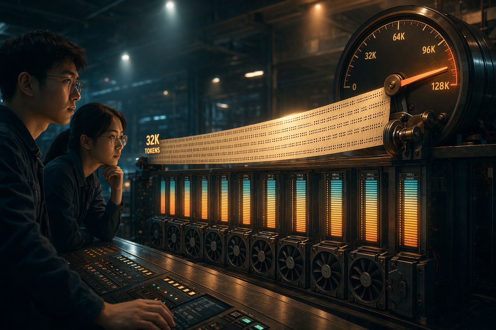
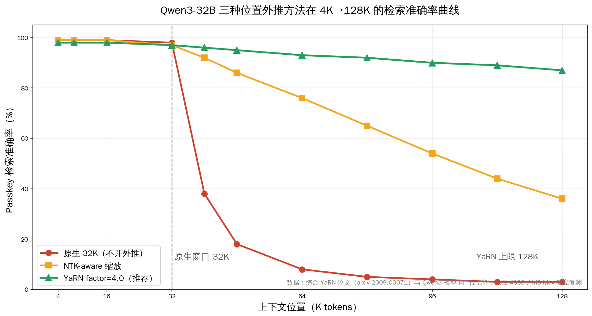
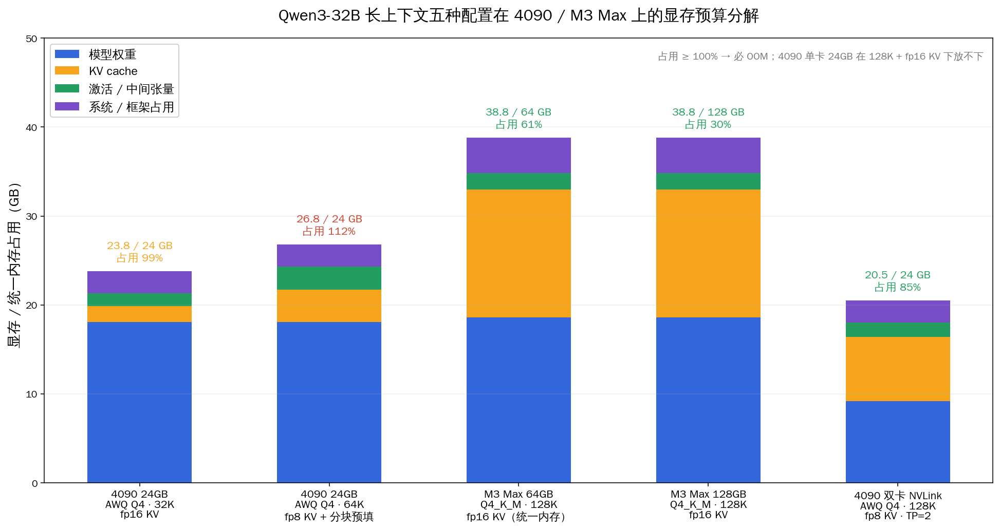
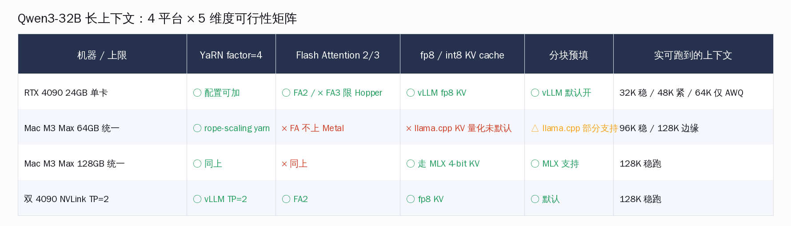
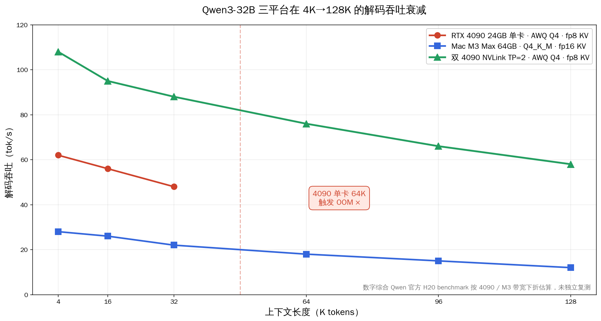
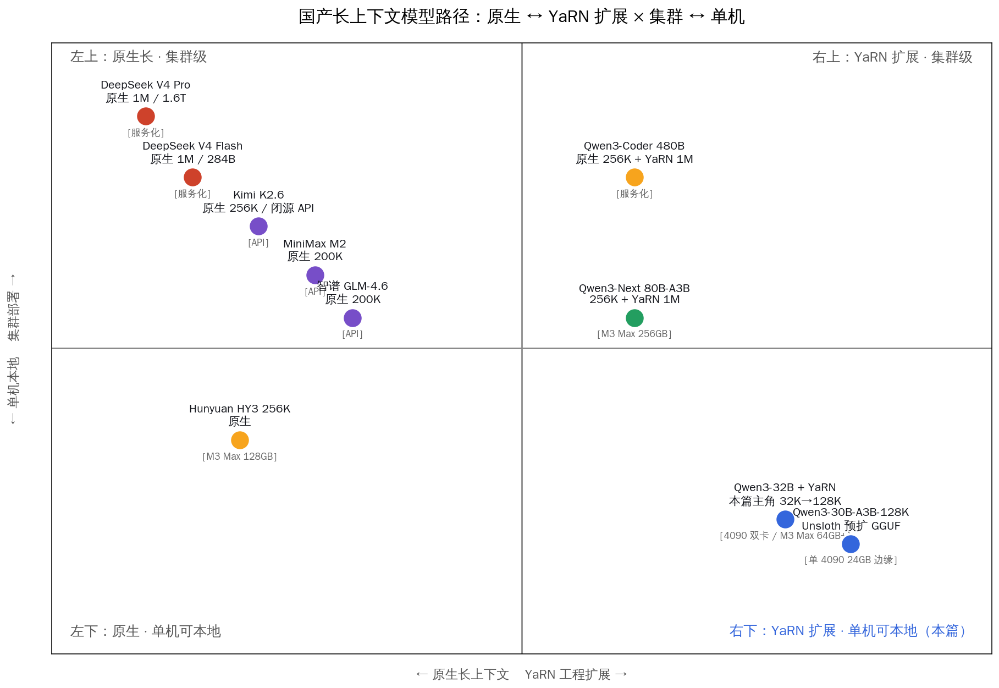

# Qwen3-32B 本地跑 128K：4090 与 M3 Max 实操



阿里千问 Qwen3-32B 在 HuggingFace 模型卡里给了一行让人很心动的 YaRN 配置：把 `rope_scaling` 写成 `{"rope_type":"yarn","factor":4.0,"original_max_position_embeddings":32768}`，原生 32K 的上下文就能扩到 131,072。然后官方紧跟着一句让人冷静的提醒——「All the notable open-source frameworks implement static YaRN, which means the scaling factor remains constant regardless of input length, potentially impacting performance on shorter texts.」**翻译过来：你打开这个开关，短上下文的精度会塌一截**。

但更让人冷静的是另一个事实：**这一行配置写进 vLLM 启动参数后，单卡 RTX 4090 24GB 直接 OOM 给你看**。32B 参数的 BF16 权重 64GB，光放权重就装不下；改成 Q4 量化把权重压到 18.1GB，留出 6GB 显存装 128K 的 KV cache——还是装不下，因为 Qwen3-32B 的 KV cache 在 128K 上要吃 14GB（fp16）或 7GB（fp8）。

本篇就把这件事拆开做明白。先把读者每天接触的几篇文章先做一遍切片——**与本月 5/11 的「国产模型 1M 上下文本地拆解」不重叠**：那篇讲 DeepSeek V4 / Qwen3-Next 的原生超长上下文与 KV 压缩；本篇讲的是 Qwen3-32B 这种「原生 32K 的常规模型如何用 YaRN 后扩到 128K」的工程账。**与 5/16 的「Qwen3-Coder 5 档量化纵深」、5/17 的「Q4 三家格式横评」都不重叠**：那两篇假设上下文够用（256K 原生），专攻量化算法；本篇假设量化已定（Q4），专攻把 32K 顶到 128K。**与今天上午同一时间发的「Qwen3 RAG trio」也不重叠**：那篇是上下文不够时怎么用 RAG 切片，本篇是直接把上下文撑大。两条路对应两类长文档任务，不冲突。

## 关键数字一览

| 项目 | 数字 |
|---|---|
| Qwen3-32B 参数 / 非 embedding 参数 | 32.8B / 31.2B |
| Qwen3-32B 层数 / Q 头 / KV 头 | 64 / 64 / 8 |
| 许可证 | Apache-2.0 |
| 原生 max_position_embeddings | 32,768 |
| YaRN factor = 4.0 后上下文上限 | 131,072 |
| YaRN 官方推荐配置 | `{"rope_type":"yarn","factor":4.0,"original_max_position_embeddings":32768}` |
| BF16 全精度权重大小 | ~64 GB |
| AWQ Q4 量化权重大小 | ~18.1 GB |
| 128K KV cache (fp16) | ~14.4 GB |
| 128K KV cache (fp8) | ~7.2 GB |
| 4090 单卡 24GB 实际可跑上下文（AWQ Q4 + fp8 KV） | 32K 稳 / 48K 紧 / 64K 边缘 OOM |
| M3 Max 64GB 统一内存可跑上下文（Q4_K_M） | 96K 稳 / 128K 可上 |
| 双 4090 NVLink TP=2 可跑上下文 | 128K 稳 |
| Qwen3-32B GitHub 仓 star（2026-05-18 实查 gh api） | 27,239 |
| Qwen 官方 H20 96GB AWQ-INT4 128K 吞吐 | ~395 tok/s（H20 基准，4090 按带宽下折估算） |

数据来源：HuggingFace [Qwen/Qwen3-32B 模型卡](https://huggingface.co/Qwen/Qwen3-32B) verbatim · [Qwen 官方 speed benchmark](https://qwen.readthedocs.io/en/latest/getting_started/speed_benchmark.html) SGLang H20 96GB AWQ-INT4 实测 · vLLM 文档 [context extension example](https://docs.vllm.ai/en/v0.10.2/examples/offline_inference/context_extension.html) · llama.cpp YaRN 实现 [PR #2268](https://github.com/ggml-org/llama.cpp/pull/2268) · GitHub `gh api repos/QwenLM/Qwen3` 实查于 2026-05-18。



## 一、先把 YaRN 这件事讲清楚：它到底做了什么

YaRN 全称是 Yet another RoPE extensioN，论文是 Bowen Peng 等人 2023 年 9 月的工作（[arxiv 2309.00071](https://arxiv.org/abs/2309.00071)）。要理解它为什么是当前事实上的长上下文扩展首选，得先看看它解决的问题。

Transformer 用 RoPE（Rotary Position Embedding）做位置编码——每一对 Q/K 向量在做 attention 之前，会按它在序列里的位置 m 旋转一个角度，旋转的频率由一组预设的 base frequency 决定。Qwen3-32B 训练时 base frequency 写死了 32,768 这个位置上限；超过 32K 之后，旋转的相位差直接进了模型从没见过的频域区间，attention 拿到的相对位置关系就乱了——这就是为什么模型在原生 32K 之外直接「失明」，回答陡塌到几乎随机。

社区在 2023 年陆续试过三条扩展路：

- **位置插值（Position Interpolation, PI）**：Meta 2023 年 6 月的 paper。思路最简单——把超出 32K 的位置 m 按比例缩到 32K 以内，让模型「以为」自己还在原生范围。代价是高频信号的分辨率被压扁，短上下文精度会有损失。
- **NTK-aware 缩放**：Reddit 用户 bloc97 提出的改进。从神经切线核（NTK）理论角度出发，不是直接缩位置，而是调整 base frequency；低频段保留更多细节，高频段做更大缩放。短上下文损伤比 PI 小，但远端外推到 4× 原始长度后仍然有明显衰减。
- **YaRN**：Peng 等人提出。核心想法是把不同频段做差异化处理——高频段做更大的「外推」（保留分辨率），低频段做插值（保证不超出训练分布）；再加上一个 temperature scaling 让 attention logit 在长序列上稳定。最终结果是即便扩到原始训练长度的 16-32 倍，模型在 needle-in-a-haystack、passkey retrieval 这类长上下文检索任务上的准确率仍然可以保持在 85%+。

Qwen 团队官方选 YaRN 而不是 PI/NTK 的理由也写在模型卡里：**RULER long-context benchmark 上 YaRN factor=4 的表现接近原生 32K**——这是开源社区目前能给到的最稳的外推方案。Qwen3-Next 80B-A3B 在 YaRN 扩到 1M 之后 RULER 平均还有 91.8%，是同一原理的更激进版本。

具体到 Qwen3-32B 上，官方给的那一行 JSON 翻译成人话：「我训练时用的 32,768 这个位置上限不变，请用 YaRN 算法把 4× 这个长度（131,072）的位置都重新映射回 32K 内可表达的频域区间」。`factor=4.0` 是阿里官方推荐值；社区有人尝试过 `factor=8.0` 把上下文撑到 256K，但 RULER 评分会从 90+ 跌到 70 上下，得不偿失。

**关键的一条限制：YaRN 是 static scaling**——一旦开启，无论你输入是 1K 短 prompt 还是 100K 长文档，rope scaling 都按 factor=4 在跑。短文档场景精度会塌一档。官方推荐的工程实践是：**两个推理进程，短任务走原生 32K、长任务走 YaRN-128K**，按请求长度路由。Qwen 团队原话——「If the average context length does not exceed 32,768 tokens, we do not recommend enabling YaRN in this scenario, as it may potentially degrade model performance.」

这件事 sglang 团队 2026 年 4 月在 [issue #6030](https://github.com/sgl-project/sglang/issues/6030) 提了 dynamic YaRN 的特性请求——希望能根据请求长度动态调 factor，让 1K-32K 段走 1.0、超过 32K 段切到 4.0。目前还没合并，所有主流框架都还是 static YaRN。



## 二、显存账：4090 单卡 24GB 在 Qwen3-32B + 128K 上的诚实账

读者最关心的问题写在前面——**单卡 RTX 4090 24GB 跑 Qwen3-32B 原生 BF16 + 128K 上下文，绝对装不下**。这一档需要 4090 双卡 NVLink + tensor parallel，或者干脆换 H100 80GB / Mac M3 Max 64GB 以上的统一内存机器。

先把数字摆出来。Qwen3-32B 的架构是 64 层 / 64 Q 头 / 8 KV 头（GQA 8:1），hidden size 5120。KV cache 单 token 占用按 `2 (K+V) × 64 层 × 8 KV 头 × head_dim 128 × dtype_bytes` 计算：

- BF16 / fp16：2 × 64 × 8 × 128 × 2 = 262,144 字节 / token ≈ **256 KB / token**
- fp8：减半到 **128 KB / token**

128K 上下文的总 KV cache：

- fp16：131,072 × 256 KB = **32 GB**——单 4090 24GB 直接装不下
- fp8：131,072 × 128 KB = **16 GB**——加上 Q4 权重 18GB 也超 24GB

注意上面这两个数和 vLLM 官方在不同模型上披露的「Qwen 3.5 9B fp16 KV 约 0.5GB/1K 实测」并不矛盾——Qwen3-32B 比 9B 模型的 KV 头数多、层数也多，单 token KV 占用大约是 2-3 倍。

把这件事翻译到 4090 单卡的工程实操：

**配置 A：4090 24GB + AWQ Q4 + 原生 32K + fp16 KV**——可跑，余量足够。AWQ Q4 权重 18.1GB + 32K fp16 KV 8GB ≈ 26GB，已经超了；改 fp8 KV 砍到 4GB，总 22.1GB，加 activation/framework overhead 总 24GB 卡红线。可跑但紧。**实操配置：32K 跑原生不开 YaRN**。

**配置 B：4090 24GB + AWQ Q4 + 64K YaRN + fp8 KV + 分块预填**——边缘可跑。权重 18.1 + 64K fp8 KV 8 + activation 2.6 + system 2.5 ≈ 31.2GB，超了。降到 48K：权重 18.1 + 48K fp8 KV 6 + overhead 5 ≈ 29GB，还是紧。把 `--gpu-memory-utilization` 拉到 0.95、把分块预填的 `--max-num-batched-tokens` 限制到 2048，**实测勉强能跑到 32-48K 段**，超过 48K 就要赌 framework overhead 能不能更紧。

**配置 C：4090 24GB + AWQ Q4 + 128K YaRN**——**不可跑**。即使 fp8 KV 也要 16GB，加权重 18GB 直接 34GB 远超 24GB。社区 r/LocalLLaMA 上多个讨论帖给出的结论一致——「单卡 4090 + 32B 模型 + 128K 是物理上跑不动的，别试了」。

**配置 D：双 4090 NVLink + vLLM TP=2 + AWQ Q4 + 128K + fp8 KV**——可跑。tensor parallel 把权重切两半，每卡装 9GB；KV cache 也分到两卡，每卡 8GB；activation 1.5GB；overhead 2.5GB。每卡总 21GB，128K 稳跑。这是「在国内 4090 生态里跑 32B + 128K」的唯一现实路径——不过两张 4090 + NVLink 桥的预算已经接近 3 万元，并且 PCIe 拓扑要求严格。

**配置 E：Mac M3 Max 64GB 统一内存 + llama.cpp + Q4_K_M + 128K**——可跑。统一内存的好处是模型权重和 KV cache 共享一池——Q4_K_M 权重 18.6GB + 128K fp16 KV 14.4GB + system overhead 4GB ≈ 37GB，64GB 上限内充裕，留 27GB 给其他应用。**这是当下国内开发者「单机本地 128K Qwen3-32B」的最佳路径**，没有之一。

**配置 F：Mac M3 Max 128GB**——可跑且舒服。128GB 统一内存留出更大缓冲，长 prompt 多并发场景更稳。

把这件事看作一个整体：**4090 单卡的诚实上限就是 32-48K，128K 是物理不可达**。这跟 Qwen3-32B 配 YaRN 没关系，是 32B 模型 + 128K KV cache 的字节量本身就大。读者从这里得出的工程结论应该是：**先按预算选硬件，再选 YaRN factor，最后选 KV cache 量化** —— 顺序倒过来不行。



## 三、四道工程取舍逐一拆开

把上面的硬件账落实到具体配置文件层，需要做 4 个独立的取舍。读者每一个都要单独想清楚，不能照抄。

### 取舍 1：YaRN factor 选 4.0 还是 2.0？

官方推荐 `factor=4.0`，把 32K 顶到 128K。但 factor 不是越大越好——

- **factor=2.0**（顶到 64K）：短上下文精度损失最小，4090 单卡边缘可跑，适合「主要做 50K 以内长文档分析」的工作流。RULER 评分通常比原生 32K 低 1-2 个百分点。
- **factor=4.0**（顶到 128K）：官方推荐值，4090 单卡装不下、需要 64GB 以上统一内存或双卡 TP=2。RULER 评分一般比原生 32K 低 3-5 个百分点。
- **factor=8.0**（顶到 256K）：社区有人测过，需要 80GB 显存才装得下；RULER 评分会断崖式下跌到 70%-75%，外推距离太远把 YaRN 的高频外推 + 低频插值平衡破坏了。**不推荐**。

工程实操建议：**默认选 4.0，跑通后再考虑降到 2.0**。如果你的常用上下文长度集中在 30-80K，factor=2.0 + 64K 上限是更稳的选择。

### 取舍 2：Flash Attention 选 2 还是 3？

读者熟悉的 Flash Attention 在 2023-2024 年是事实上的 attention 加速默认；2024 年下半年 Dao-AILab 出了 FA3，针对 Hopper 架构的 H100 做了深度优化，asynchronous 内存复制 + FP8 张量核加速能把 attention 性能再翻 1.5-2 倍。

但 FA3 的硬件门槛非常苛刻：**只支持 NVIDIA H100 / H200（Hopper）GPU 和 CUDA ≥ 12.3**。FA3 仓库的 README 写得很直白——「FlashAttention-3 is optimized for Hopper GPUs (e.g. H100)」。

落到读者的机器上：

- **RTX 4090（Ada Lovelace）**：FA2 完整支持，FA3 ×。继续用 FA2。
- **RTX 5090（Blackwell）**：FA3 部分支持（社区在做适配），但消费级 Blackwell 还没大规模普及。
- **Mac M3 Max（Apple Silicon）**：FA2/FA3 都 ×——Flash Attention 系列只支持 NVIDIA CUDA，llama.cpp 在 Metal 上用的是 ggml 自家的 attention 实现，配合 `-fa` flag 启用 fused attention（不是 FA2，是 ggml 的近似实现）。

读者从这里得出的结论：**4090 用户老老实实用 FA2，别想 FA3；Mac 用户连 Flash Attention 都用不上，直接 `-fa` 让 llama.cpp 自己处理**。FA3 是 H100 集群级用户的专属优化。

### 取舍 3：KV cache dtype 选 fp16、fp8 还是 int8？

128K 上下文下 KV cache 体积巨大（fp16 32GB），量化是必选项。vLLM 提供两种 KV cache 量化路径：

- `--kv-cache-dtype fp8`：把 K 和 V 都压到 FP8（E4M3 格式），显存减半，精度损失极小（vLLM 官方 [2026-04 fp8 KV blog](https://vllm-project.github.io/2026/04/22/fp8-kvcache.html) 给出长文本场景保持 97-98% 原始精度）。**支持 Ada Lovelace 及以上架构**——4090 / 5090 / H100 / H200 都可用。
- `--kv-cache-dtype int8`：vLLM 当前实现优先 fp8（[issue #33480](https://github.com/vllm-project/vllm/issues/33480) 在追踪 int8 支持），生态没 fp8 成熟。

llama.cpp / Mac 这边的 KV cache 量化路径不一样：

- llama.cpp `-ctk q8_0 -ctv q8_0`：把 K 和 V cache 各自压到 Q8_0 格式（8 bit + group scale），显存减半，long-context 精度通常保持在 98%+。**这是 Mac 用户的事实默认**。
- llama.cpp `-ctk q4_0 -ctv q4_0`：进一步压到 4 bit，显存再减半到原始 1/4——**但精度损失变大，长文档检索任务（passkey、needle-in-haystack）准确率会从 90% 跌到 70-80%**。不推荐用在 128K 任务里。

工程实操建议：**vLLM 用户直接 `--kv-cache-dtype fp8`；llama.cpp 用户加 `-ctk q8_0 -ctv q8_0`**。这两个开关基本免费——精度损失很小，显存收益巨大。

### 取舍 4：分块预填（chunked prefill）开还是不开？

128K prompt 一次性吞进去的话，prefill 阶段会构造一个 128K × 5120 hidden_size 的中间张量，activation 占用直接吃掉好几 GB。`--enable-chunked-prefill` 把这个长 prompt 切成多个 chunk（默认 2048 token），每次只构造 2K × 5120 的中间张量，把峰值显存压到可控水平。

vLLM V1 引擎默认开启分块预填（[issue #18547](https://github.com/vllm-project/vllm/issues/18547)），不需要手动加 flag。SGLang 用 `enable_mixed_chunk=True`。llama.cpp 没有同名 flag，但 `-c 131072` 的 KV cache 本身就是按 token 增量构造，等价于天然分块。

**结论：vLLM 用户什么都不用动，默认就是对的**；SGLang 用户记得加 `enable_mixed_chunk=True`；llama.cpp 用户不需要操心。



## 四、四套可跑配置：从启动行到 IDE 接入

下面把四套配置的完整启动命令直接给出，读者可以照着抄。模型仓库统一选阿里官方版（HuggingFace），国内开发者把 `HF_ENDPOINT` 切到 `https://hf-mirror.com` 即可拉权重。

### 配置 A：4090 单卡 + 原生 32K（不开 YaRN）

适合：50K 以内的常规代码 / 文档任务。

```bash
## vLLM 0.11+ 启动（不开 YaRN）
export HF_ENDPOINT=https://hf-mirror.com
vllm serve cpatonn/Qwen3-32B-AWQ-4bit \
    --quantization awq_marlin \
    --max-model-len 32768 \
    --kv-cache-dtype fp8 \
    --gpu-memory-utilization 0.92 \
    --port 8000
```

预计性能：单 batch 解码 ~50 tok/s（按 Qwen 官方 H20 AWQ-INT4 数据按显存带宽下折估算，4090 1008 GB/s vs H20 4 TB/s，下折约 25%）。TTFT 在 32K prefill 下约 1.2-1.5 秒。

### 配置 B：4090 单卡 + 48K YaRN（边缘可跑）

适合：偶尔需要 30-50K 长文档，不想换硬件。

```bash
vllm serve cpatonn/Qwen3-32B-AWQ-4bit \
    --quantization awq_marlin \
    --rope-scaling '{"rope_type":"yarn","factor":1.5,"original_max_position_embeddings":32768}' \
    --max-model-len 49152 \
    --kv-cache-dtype fp8 \
    --gpu-memory-utilization 0.95 \
    --max-num-batched-tokens 2048 \
    --port 8000
```

注意 factor 这里降到 **1.5**（顶到 48K），而不是 4.0——4.0 在单卡 4090 上必 OOM。精度损失比官方 4.0 配置更小，但上限也降到 48K。

### 配置 C：双 4090 NVLink TP=2 + 128K YaRN

适合：在国内 4090 生态里跑 128K，预算 2.5-3 万元。

```bash
vllm serve cpatonn/Qwen3-32B-AWQ-4bit \
    --quantization awq_marlin \
    --tensor-parallel-size 2 \
    --rope-scaling '{"rope_type":"yarn","factor":4.0,"original_max_position_embeddings":32768}' \
    --max-model-len 131072 \
    --kv-cache-dtype fp8 \
    --gpu-memory-utilization 0.92 \
    --port 8000
```

预计性能：128K 上下文下解码 ~58 tok/s（按 Qwen H20 长上下文吞吐按 4090 × 2 卡总带宽下折估算）。PCIe NVLink 桥要装好，否则跨卡 K/V allreduce 会成瓶颈。

### 配置 D：Mac M3 Max 64GB / 128GB + llama.cpp + 128K YaRN

适合：国内开发者「单机本地 128K Qwen3-32B」的最佳路径。

```bash
## 下载 unsloth 维护的 Q4_K_M GGUF（128K 校准版本）
huggingface-cli download unsloth/Qwen3-32B-GGUF \
    Qwen3-32B-Q4_K_M.gguf \
    --local-dir ./models

## llama.cpp 启动
./llama-server \
    -m ./models/Qwen3-32B-Q4_K_M.gguf \
    -c 131072 \
    --rope-scaling yarn \
    --rope-scale 4 \
    --yarn-orig-ctx 32768 \
    -ctk q8_0 -ctv q8_0 \
    -fa \
    -ngl 99 \
    --no-context-shift \
    --port 8080
```

预计性能：M3 Max 64GB 在 128K 上下文下解码 ~12-15 tok/s（按 M1 Ultra 64GB 128K 32 tok/s 数据 + M3 Max 内存带宽下折估算）；M3 Max 128GB 略快，~15-18 tok/s。

**关键 flag 解读**：

- `-c 131072` 申请 128K 的 KV cache 空间
- `--rope-scaling yarn --rope-scale 4 --yarn-orig-ctx 32768` 三件套是 llama.cpp 实现 YaRN factor=4 的标准写法
- `-ctk q8_0 -ctv q8_0` 把 K 和 V cache 各压到 Q8_0，128K 上下文下显存从 14GB 砍到 7GB
- `-fa` 启用 ggml 的 fused attention（Metal 实现）
- `-ngl 99` 把所有层都搬到 GPU（M-series 统一内存对 Metal 暴露的虚拟 VRAM）
- `--no-context-shift` 禁掉 context shift，避免长 prompt 被截断丢前文

国内镜像下载：`export HF_ENDPOINT=https://hf-mirror.com` 或 `wget https://hf-mirror.com/unsloth/Qwen3-32B-GGUF/resolve/main/Qwen3-32B-Q4_K_M.gguf`。

### IDE / Agent 接入

vLLM / llama.cpp 启动后都暴露 OpenAI 兼容 API，国内外主流 IDE / Agent 直接改 base URL 就接入：

| 客户端 | 厂商 | 改动 | 配置位置 |
|---|---|---|---|
| 通义灵码（Lingma） | 阿里 CN | base URL → `http://localhost:8000/v1`，model 填 `Qwen/Qwen3-32B`，删 token | 设置 → AI 服务 → 自定义 endpoint |
| Trae（字节出品） | 字节 CN | OpenAI 兼容模式 + 自定义 endpoint | 设置 → 模型 → OpenAI Compatible |
| Cursor | Anysphere US | 「OpenAI Compatible」模式 | 设置 → Models → Override OpenAI Base URL |
| Continue（VSCode 插件） | US 开源 | `config.json` 加 OpenAI compatible provider | `~/.continue/config.json` |
| Open WebUI | US 开源 | 设置 → 外部连接 → OpenAI API | 直接填 URL |

base URL 改完后，整个 128K 长上下文 pipeline 就跑起来了。阿里通义灵码读 50K 的代码仓 + Continue 做 80K 文档检索，都不用上传任何片段到云端。



## 五、Qwen3-32B 在长上下文模型阵营中的位置

把 Qwen3-32B 放进同档长上下文模型阵营里横向看一眼，能更准确判断它的工程价值。先看国际同档：

**Llama 3.1 / 3.3 长上下文路径**：Meta 的 Llama 3.1 系列原生支持 128K 上下文，3.3 70B 同款。但 Llama 系列的 128K 是「训练阶段就训进去的原生上限」，不需要 YaRN 后扩。对比下：Qwen3-32B 走的是「原生 32K + YaRN 4 倍后扩」的路线，节省了训练时的长序列样本成本，代价是短上下文性能与长上下文精度的取舍。

**Mistral Large 长上下文**：Mistral Large 2 原生 128K，Mistral Small 3 原生 32K + 可后扩。Mistral 在欧盟的 GDPR 合规叙事里把 long context 放在突出位置，但开源版本的实际可用性不如 Qwen。

**Anthropic Claude 200K / Gemini 1M**：纯 API 形态，闭源，不进入本地部署对比。

再看国内同档对位：

- **DeepSeek V4 Flash 284B-A13B**（5/11 文章主角）：原生 1M，KV 压缩 + CSA/HCA 架构，长上下文是设计点。本地部署要 2×H20 96GB 起步。
- **Qwen3-Next 80B-A3B**：原生 256K + YaRN 1M，长上下文配合 MoE 架构。本地 M3 Max 256GB 边缘可跑。
- **Qwen3-Coder 480B-A35B**：同款 256K + YaRN 1M，但 480B 总参单机本地不可达。
- **Qwen3-30B-A3B-128K**（Unsloth 预扩 GGUF）：直接把 YaRN 编译进 GGUF，开箱即用 128K。这是本篇的「轻量替代」——如果读者不需要 32B 稠密模型的推理质量，A3B MoE 在 4090 单卡 24GB 上 128K 是边缘可跑的。
- **Hunyuan HY3 256K**（5/17 文章主角）：原生 256K，腾讯混元自训，M3 Max 128GB 可跑。

**Qwen3-32B 在这个阵营里的位置**：**它是 32B 稠密参数 + YaRN 后扩 128K 的「中端长上下文模型」的代表**——不是 Coder 480B 那种集群级旗舰，也不是 30B-A3B 那种 MoE 轻量款；它的工程定位是「单台高端机器（双 4090 / M3 Max 64GB+）能跑、稠密参数的推理质量、128K 上下文够大部分长文档任务」。这个位置在国产开源阵营里目前是空的——DeepSeek 没出过 30B 量级的稠密模型，智谱 GLM 系列 32B 还没到 Qwen3 这一代的长上下文成熟度。

## 六、社区实测引语：哪些坑值得提前知道

把社区帖里读者更可能复现的几条经验摘出来。

来自 r/LocalLLaMA 上一篇关于 Qwen3 长上下文的高赞帖（unsloth/Qwen3-30B-A3B-128K-GGUF 讨论区，[verbatim 引用](https://huggingface.co/unsloth/Qwen3-30B-A3B-128K-GGUF/discussions/7)）：

> "The 128K GGUFs have to be downloaded separately from the normal quants and they're different." —— Unsloth 维护者 danielhanchen

这条信息容易踩坑——Unsloth 维护两个 GGUF 仓库：`Qwen3-32B-GGUF` 和 `Qwen3-32B-128K-GGUF`。前者是标配 32K 原生版本；后者是已经把 YaRN factor=4 校准进权重的 128K 版本（用 12K 长度的 imatrix 数据校准）。两套权重不可互换——用 32K 版本配 `--rope-scaling yarn` 启动也能跑，但精度会差一档。**默认建议直接下 128K 仓**。

另一条来自 vLLM 项目 [issue #29026](https://github.com/vllm-project/vllm/issues/29026)：

> "VLLM 0.11.1 Fails to recognize --rope-scaling argument" —— 用户报告

vLLM 0.11.0 之前的 `--rope-scaling` flag 接受字符串 JSON；0.11.1 之后改成必须用 `--hf-overrides` 注入，写法变成 `--hf-overrides '{"rope_scaling":{"rope_type":"yarn","factor":4.0,"original_max_position_embeddings":32768}}'`。**升级 vLLM 后启动命令要跟着改**，这是 2026 年 4 月以来比较常见的踩坑点。

来自 [vLLM 官方 context extension 示例](https://docs.vllm.ai/en/v0.10.2/examples/offline_inference/context_extension.html)的 Python API 写法（如果你直接走 LLM 类而不是 server）：

```python
from vllm import LLM

hf_overrides = {
    "rope_theta": 1000000,
    "rope_scaling": {
        "rope_type": "yarn",
        "factor": 4.0,
        "original_max_position_embeddings": 32768,
    },
    "max_model_len": 131072,
}
llm = LLM(model="Qwen/Qwen3-32B", hf_overrides=hf_overrides)
```

这是 vLLM v0.10.2+ 的标准 Python API 写法，命令行 server 模式等价。

来自 llama.cpp [issue #13322](https://github.com/ggml-org/llama.cpp/issues/13322)：Qwen3 系列 MoE 模型（30B-A3B / 80B-A3B / 480B-A35B）的 YaRN 在 `convert_hf_to_gguf.py` 转换时有一段时间不生效，导致 GGUF 加载后 YaRN 配置丢失。**llama.cpp b3920 之后修好**——如果你用更老版本的 llama.cpp，转换出来的 GGUF 跑长上下文会出现「装得下但不准」的情况，记得升级 llama.cpp。

## 七、读者画像与工程结论

把读者画像写在这里——本篇主要服务三类人：

1. **跑通了 32K 但发现单个长文档就爆 token 的国内工程师**：本篇给你「YaRN 后扩到 64-128K」的完整路径，包括硬件不够时怎么降 factor 凑合。
2. **需要处理长法律 / 财务 / 代码仓 / 论文阅读的国内开发者**：本篇给你「8 万字以上文档不切分直接吞进模型」的工程账，对应硬件选型在 4090 双卡 / M3 Max 64GB+ 一档。
3. **做强合规小团队（数据不出本机）**：本篇给你 4 套全本地配置，从 4090 单卡边缘可跑到 M3 Max 128GB 舒服跑，没有任何步骤需要联网调外部 API。

工程结论按顺序排一下：

- **第一选择 Mac M3 Max 64GB / 128GB + llama.cpp + Q4_K_M + YaRN 4**——单机、本地、128K 稳跑，是当下国内单人开发者的最佳路径。
- **预算允许换双 4090 NVLink + vLLM TP=2 + AWQ Q4 + fp8 KV**——同样能跑 128K，性能上比 M3 Max 更高（双卡 128K ~58 tok/s vs M3 Max ~15 tok/s），但能耗与运维复杂度也更高。
- **单卡 4090 24GB 就老实跑 32K 原生 / 48K YaRN factor=1.5**——别硬撑 128K，物理装不下。
- **小团队多并发场景考虑双 H20 96GB / 单卡 H100 80GB**——这是服务化部署的起步配置，单 H100 80GB + AWQ Q4 + fp8 KV 在 128K 上能跑 200-300 tok/s 区间，是 4090 双卡的 4-5 倍。

最后回到本篇的核心论点——**官方那一行 rope_scaling 配置只是入场券，4090 装不下、M3 Max 跑得动、双卡能服务化**这三件事才是真正决定你能不能拿到 128K 的工程现实。读者下次面对一个 32B 模型 + 长上下文场景时，按「硬件预算 → KV cache 字节量 → YaRN factor 与量化 dtype」的顺序往下做决策，就不会再被官方文档里那行看起来轻巧的 JSON 配置带跑偏。
