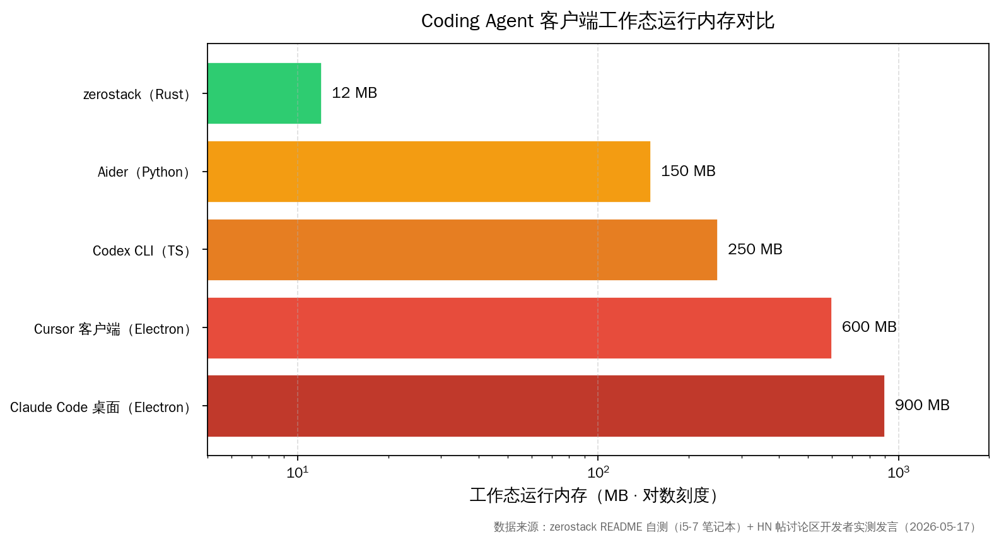
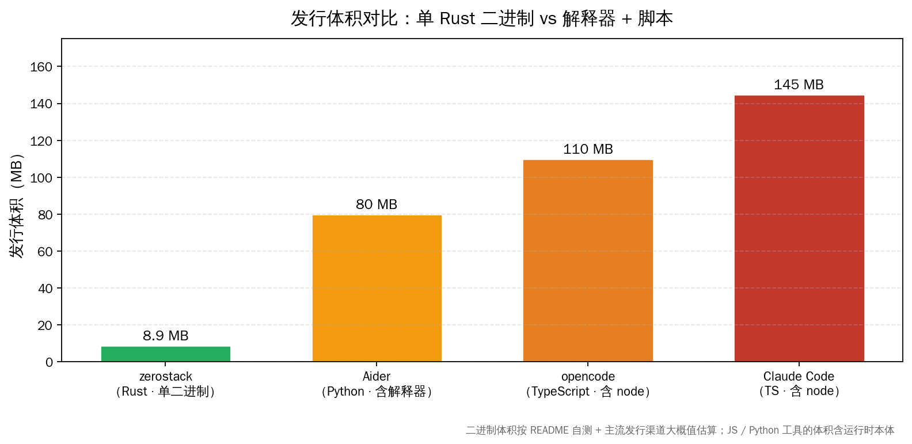
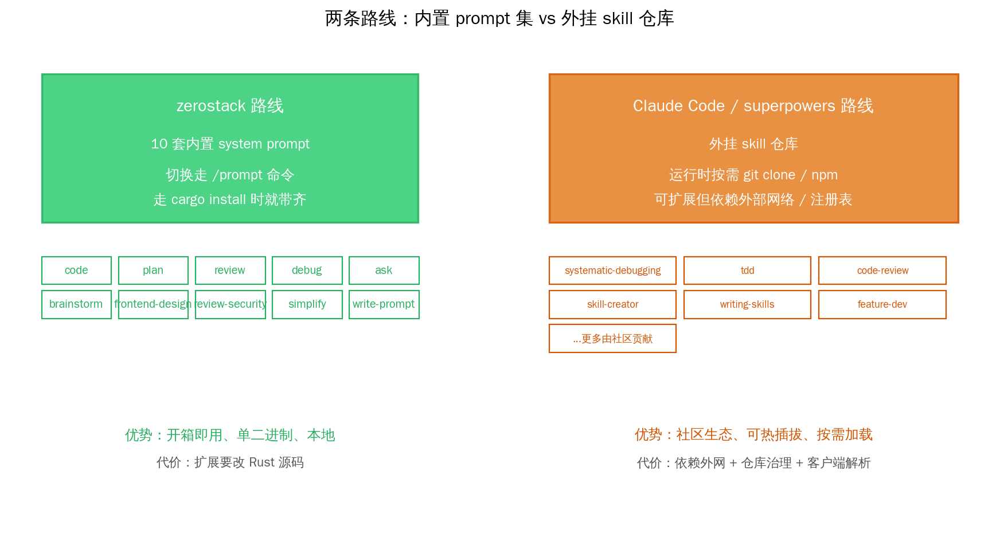
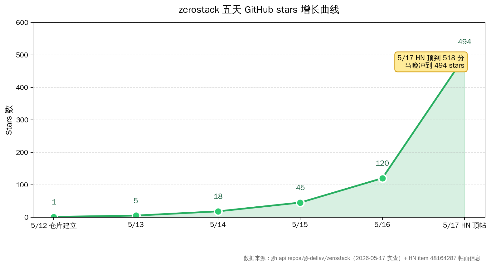

# zerostack：8MB 跑完 Coding Agent


五月十七号，HN 头版被一个标题平平的小项目顶到了 518 分 286 条评论——`Zerostack – A Unix-inspired coding agent written in pure Rust`。点进去 GitHub 仓库才几天前刚建（创建于 2026-05-12），代码量只有七千行 Rust，但作者甩出来的数字把所有人都拉住了停下来看一眼：**空会话 8 MB 内存、工作态 12 MB、单二进制 8.9 MB、启动时间 90 毫秒**。

把这一行数字翻译成人话——它和市面上主流 Coding Agent 客户端的资源消耗，差了一个到两个数量级。Claude Code 桌面端这种 Electron 客户端跑起来动辄六七百兆内存，多开几个工作区上到 6 GB RSS 也不少见；zerostack 这边连 0.02 GB 都吃不满。

这件事戳到的，是过去两年 AI Coding 工具一直在装作没看到的一个真实痛点——**客户端越做越像浏览器，开发者本身要的，其实只是一个能听懂自然语言、能读写文件、能跑 shell、能搭住一个长任务的小程序而已**。zerostack 用 7000 行 Rust 把这个最小集合做出来，把 long-horizon coding loop 这套 Claude Code 同形态的能力，塞进一个连老笔记本都跑得动的小客户端里。

## 关键数字一览

下面这些数字都来自项目 README 自测 + HN 帖讨论区开发者实测 + `gh api repos/gi-dellav/zerostack` 直接查到的数据，可独立复核：

| 维度 | 数字 |
|---|---|
| 仓库创建时间 | 2026-05-12（HN 顶上头版时刚满 5 天） |
| Star 数 | 494（2026-05-17 当晚） |
| Fork 数 | 31 |
| HN 帖热度 | 518 分 / 286 条评论 |
| 主语言 | Rust（GitHub 报告 100%） |
| 许可证 | GPL-3.0-only |
| 代码量 | 约 7000 行 Rust |
| 单二进制大小 | 8.9 MB |
| 空会话内存 | 约 8 MB |
| 工作态内存 | 约 12 MB |
| 空闲 CPU 占用 | 0.0%（i5-7 笔记本实测） |
| 工作态 CPU | 约 1.5%（i5-7 实测） |
| 启动时间 | 约 90 ms |
| 内置 system prompt | 10 套 |
| 权限档位 | 4 档（restrictive / standard / accept-all / yolo） |
| Doom-loop 阈值 | 同样工具调用重复 3 次触发预警 |
| 支持的供应商 | OpenRouter（默认）/ OpenAI 兼容 / Anthropic / Gemini / Ollama / 自定义 base URL |
| 协议支持 | MCP server（编译时 feature）/ ACP（Agent Communication Protocol，feature gated） |
| 沙箱方案 | bubblewrap (`--sandbox`)，每条 bash 命令隔离运行 |
| 当前版本 | v1.1.0（crates.io 实查） |

把这十几个数字读一遍就能感觉到一件事——**这个项目的设计哲学是"减法"，不是"加法"**。每一项功能都问一句"砍掉它客户端会塌吗"，答能就砍。



把内存数字按对数尺度画出来更直观——zerostack 的 12 MB 和 Claude Code 桌面客户端的 900 MB 量级在同一张图上根本不在一个段位。这不是优化能省下来的差距，是路线选择本身决定的。

## 资源消耗下限被打到地板：戳到的真实痛点

国内 AI 开发者群体当下最普遍的 Coding 工具配置，大概率是几条路线里的一条——Claude Code 桌面端 / Cursor IDE / Codex CLI / 通义灵码 Lingma IDE / 字节家的 Trae / Qoder 1.0 / Cody。**这几条路线里，除了 Codex CLI 走的是 Node TS 命令行，其它清一色都是 Electron 重客户端**。

Electron 重客户端的内存吃法不是个秘密——单实例 600 MB 起步，开两个工作区 + 一个 helper 进程组上到 2-3 GB 是常态。在公司一台 16 GB 的开发机上挂着 Cursor + Slack + Chrome 三件套，剩下能给本地 LLM 的显存预算就所剩无几了。

zerostack 这条路线给了一个截然相反的选项——**把 Coding Agent 当成 CLI 工具，按 Unix 原始的"做一件事做好"哲学来设计**。它戳到三件事特别值得说：

- **资源消耗下限被打到地板**。空会话 8 MB 内存这件事意味着，你完全可以在一台四五年前的旧笔记本上同时开五六个工作区窗口，每个跑一个独立的 zerostack 会话，跟 Ollama 本地模型对接。整个客户端集群消耗的内存还不到 Cursor 单实例的零头。
- **单二进制无依赖**。Rust 编译出来的 8.9 MB 单文件可执行，不带 Node 解释器、不带 Electron Chromium runtime、不带任何第三方依赖。`cargo install zerostack` 一行装完，或者直接从 GitHub Releases 拉 prebuilt binary。**这种"零依赖"的部署姿态在公司受限网络环境下就是质的区别**——不用关心 npm registry 通不通、不用关心 Python 虚拟环境冲不冲突。
- **本地大模型用户的最佳搭档**。OpenRouter / OpenAI / Anthropic / Gemini / Ollama 全套供应商接口都内建，OpenAI-compatible 还支持 vLLM / LiteLLM 这类自托管推理服务的 base URL。你本地用 4090 跑 Qwen3-Coder-30B-A3B + Ollama，加上 zerostack 这套 8 MB 的客户端，整个组合在一台机器上吃的资源加起来都没 Cursor 单实例多。



发行体积这件事看起来是个细节，但它直接决定了"我能不能把这个工具塞进 CI 镜像 / Docker base image / 公司发行的轻量虚拟桌面里"。Aider 装下来连 Python 解释器算 80 MB，opencode 含 node runtime 100 MB 起步，Claude Code 桌面端打包后 145 MB——这些数字在云端按分钟计费的开发环境（Coder / Gitpod / GitHub Codespaces）里是直接增加冷启动延迟的真金白银。

## 用 7000 行 Rust 装下了什么：架构拆解十件套

zerostack 的代码量极克制——7000 行 Rust，覆盖了一个完整 Coding Agent 该有的全部能力。逐项拆开看：

### 一、终端 UI 层

基于 `crossterm` crate 实现的纯文本 TUI，支持 markdown 渲染、鼠标选区复制、滚动历史、reasoning（推理过程）可见性开关。没有 web view，没有 Electron embed，没有任何浏览器内核。终端就是 UI，所有交互走 keyboard + 鼠标选择。

这个选择直接决定了启动时间能压到 90 毫秒——因为根本不需要加载 Chromium。

### 二、多供应商抽象层

`MultiProvider` 模块把 OpenRouter / OpenAI 兼容 / Anthropic / Gemini / Ollama 五条主流 API 协议统一到同一个调用接口，加上一个"自定义 base URL"的逃生口给 vLLM / LiteLLM / SGLang 这类自托管推理服务用。

切供应商走 `/model` slash 命令，或者启动时 `--provider openrouter --model deepseek/deepseek-v4-flash` 这种参数。每个供应商的 API key 走环境变量。

### 三、十套内置 system prompt

这是 zerostack 设计哲学里最有意思的一块。作者直白地写在 README 里——**"目标是建一套完整的 prompt 套件，可以完全替代 superpowers 这种 skill 仓库和 Claude 官方的 skills"**。

十套 prompt 分别是：

- `code`（默认）：完整文件读写 + bash 工具权限的 TDD 模式
- `plan`：只规划不写代码
- `review`：代码审查
- `debug`：先找根因再提修复
- `ask`：只读模式，只允许 read / grep / glob
- `brainstorm`：设计探索
- `frontend-design`：前端 UI 生成
- `review-security`：安全漏洞审查
- `simplify`：代码简化重构
- `write-prompt`：prompt 工程辅助

切换走 `/prompt` 命令。用户也可以把自定义 prompt 放在 `$XDG_CONFIG_HOME/zerostack/prompts/` 里，按文件名引用。

更巧的一个设计——**agent 会自动加载项目根目录或祖先目录里的 `AGENTS.md` 或 `CLAUDE.md`，注入到 system prompt**。这套约定刚好和 Claude Code / Cursor / Codex 已经形成的"项目根目录放 CLAUDE.md"开发者习惯无缝对接。已有 CLAUDE.md 的项目切到 zerostack 完全不用改任何配置文件。



这张图说的是路线分歧——Claude Code 这一脉走"外挂 skill 仓库"路线，superpowers 这种社区项目把上百个 skill 装进 git 仓库，运行时按需 git clone / npm install 加载；zerostack 走"内置 prompt 集"路线，十套 prompt 在编译时就装进二进制，不依赖任何外部仓库。

两条路线各有取舍——外挂 skill 路线扩展性强、社区贡献丰富，代价是依赖外网 + 注册表治理 + 客户端要解析装载逻辑；内置 prompt 路线开箱即用 + 单二进制 + 真正离线可跑，代价是想加新 prompt 得改 Rust 源码重新编译（或者放到 user prompt 目录走自定义路径）。

对一个把"轻量 + 单二进制"当成核心定位的工具来说，内置路线显然是更自洽的选择。

### 四、四档权限系统

权限系统是 zerostack 比其他轻量 CLI agent 多出一层的设计。四档从严到松：

1. **restrictive (`-R`)**：每次工具操作都要批准，除非显式写进 config 白名单
2. **standard（默认）**：`ls / cd / git log / cargo check` 这种安全命令自动通过；写文件和破坏性操作要询问
3. **accept-all (`--accept-all`)**：工作目录内自动通过，外部路径才询问
4. **yolo (`--yolo`)**：全部自动通过

权限可以按工具配 glob 白名单——比如允许 `write **.rs` 自动通过，但写其他文件一律询问。会话内已批准的操作还有一份 session allowlist 持久化，省得重复确认同一个操作。

这一档比 Aider / Codex CLI 这类工具粒度细很多——Aider 基本上要么 auto-yes 要么 manual 全问，没有按 glob 自动放行的中间档。zerostack 这种 glob 白名单刚好契合"我信任 .rs / .md 自动写，但 .yaml / .env 一律问一下"这种真实开发习惯。

### 五、Doom-loop 检测

这是个小而精的工程细节——agent 同一个工具调用连续重复 3 次以上自动触发预警（或者根据配置直接拒绝）。这玩意儿专门防"agent 卡在某个循环里疯狂调 `bash ls`"那种典型失控场景。

Claude Code / Cursor 都有类似机制，但 zerostack 把这个写进了核心循环，feature flag 不能关。这种"安全默认开"的设计选择，体现了项目的工程风格。

### 六、MCP server 客户端

MCP（Model Context Protocol）支持作为编译时 feature 提供（`cargo install zerostack --features mcp`）。装上之后，zerostack 可以连接外部 MCP server，把第三方工具接入到 agent 的 tool calling 循环里。

这意味着已经在 Claude Code / Cursor 上跑通的那一堆 MCP server（feishu / playwright / context7 / chrome-devtools 等等），理论上都能直接接到 zerostack 上用——MCP 是协议层标准，客户端实现替换是透明的。

### 七、ACP 协议（Agent Communication Protocol）

ACP 是个相对新的 JSON-RPC 协议，标准化编辑器（IDE / 文本编辑器）和 Coding Agent 之间的通信。装上 ACP feature 后，zerostack 可以以 ACP Agent server 的姿态跑起来，让 Zed 这类编辑器把它当作 Coding Agent 后端连进来。

stdio 模式（编辑器把它作为子进程拉起来）：

```bash
zerostack --acp
```

TCP 模式：

```bash
zerostack --acp --acp-host 0.0.0.0 --acp-port 7243
```

这条路径给了一个有意思的可能性——**未来 zerostack 完全可以脱开自带 TUI，纯粹作为 Zed / Helix / Neovim 这类编辑器的 Coding Agent 后端跑**。前端 UI 用编辑器原生组件，agent 引擎用 8 MB 的 Rust 客户端，整体内存预算还能再压低一档。

### 八、git worktree branch-per-task

zerostack 内建了 git worktree 集成，三个 slash 命令搞定 branch-per-task workflow：

- `/worktree <name>`：创建新 branch + worktree 目录 + 移动到那里
- `/wt-merge [branch]`：合并 worktree 分支到主分支、推送、清理、回到主仓库
- `/wt-exit`：不合并直接退回主仓库

这套设计是对"agent 不应该污染主分支"这件事的一个工程化回答。每个长任务都跑在独立的 worktree 上，搞砸了直接 `/wt-exit` 退出，主仓库不留任何痕迹。Claude Code 桌面端的 git 集成是图形界面操作，没有这种 CLI-native 的批量化能力。

### 九、sandbox 模式

调用 `--sandbox` flag 之后，每条 bash 命令都在 `bubblewrap` 创建的隔离环境里跑——文件系统视图被限制、网络可控、root 权限隔离。这是 agent 失控时最后一道防线。

这一点上 zerostack 的态度很务实——sandbox 不强制开，但写进了 README 的推荐流程。`apt install bubblewrap` 一行装上，`--sandbox` 一行启用。对企业开发环境是个直接可用的合规选项。

### 十、Loop 系统（experimental）

zerostack 自带一个迭代 coding loop，专门跑 long-horizon 任务：agent 反复读任务、从 `LOOP_PLAN.md` 里挑一项干、跑测试、更新计划、循环到完成或者迭代上限。

```bash
zerostack --loop \
  --loop-prompt "Refactor the API" \
  --loop-max 10 \
  --loop-run "cargo test"
```

每轮迭代都给 agent 注入：原始任务 + 当前 LOOP_PLAN.md + 上一轮总结 + 上一轮验证输出。这是 Claude Code "agentic mode" 的一个非常清爽的 CLI 化版本——少了 Electron 的所有花里胡哨，多了一个 `--loop-run "cargo test"` 这种"每轮跑一次验证命令"的直接接口。

## 对位 Claude Code、Cursor、Codex 看清楚 zerostack 的取舍

把 zerostack 和当下国内开发者最常用的几条主流 Coding Agent 路线摆到一起：

| 维度 | zerostack | Claude Code 桌面 | Cursor | Codex CLI | Aider |
|---|---|---|---|---|---|
| 客户端形态 | CLI / TUI | Electron 桌面 | Electron IDE | Node CLI | Python CLI |
| 主语言 | Rust | TS + Electron | TS + Electron | TypeScript | Python |
| 工作态内存 | 约 12 MB | 约 900 MB+ | 约 600 MB+ | 约 250 MB | 约 150 MB |
| 二进制 / 安装体积 | 8.9 MB | 145 MB | 230 MB | 110 MB | 80 MB（含 venv） |
| 启动时间 | 约 90 ms | 数秒 | 数秒 | 约 800 ms | 约 1.5 s |
| 默认 LLM 后端 | OpenRouter | Anthropic | OpenAI / Anthropic / 自家 | OpenAI | OpenAI / Anthropic |
| 接 Ollama / vLLM | 内建 | 不支持 / 需要代理 | 不支持 / 需要代理 | 不直接 | 支持 |
| MCP server | 编译时 feature | 内建 | 第三方插件 | 不支持 | 不支持 |
| ACP 协议 | 编译时 feature | 不支持 | 不支持 | 不支持 | 不支持 |
| Git worktree CLI | 三个 slash 命令 | 图形 UI | 图形 UI | 不直接 | 不直接 |
| 权限粒度 | 4 档 + glob | 配置较粗 | 配置较粗 | 配置较粗 | 较粗 |
| Doom-loop 检测 | 内建 | 内建 | 部分 | 无 | 无 |
| 内置 prompt | 10 套切换 | 通过 skills | 通过 cursor rules | 简单 system prompt | 几套预设 |
| 沙箱 | bubblewrap | 无 | 无 | 无 | 无 |
| 许可证 | GPL-3.0 | 闭源商业 | 闭源商业 | Apache-2.0 | Apache-2.0 |
| 适合场景 | 本地大模型 + 极简 + CLI 用户 | 团队协作 + 重 IDE | 重 IDE 用户 | OpenAI 用户 + 轻量 | Python 项目 + 终端用户 |

读完这张表能看出来——**zerostack 不是要取代 Claude Code 或 Cursor 这种重客户端的所有场景**，它是给"我只是想要一个能跑 Coding Agent 的最小 CLI"那个细分人群的精确解。

具体哪几类人是它的目标用户：

- **本地大模型重度用户**：4090 / 5090 跑 Qwen3-Coder / DeepSeek-V4 / GPT-OSS-20B，希望客户端轻、能接 Ollama / vLLM、不抢 GPU 进程的显存
- **CLI 派 + Vim / Helix / Zed 用户**：从来不打开 VSCode，所有工作流都在终端里
- **公司受限环境**：禁止 npm registry 外网访问、只能用受审过的 binary、需要 GPL 兼容的源码可审计
- **老笔记本党**：4 GB / 8 GB 内存的旧机器，跑不动 Electron 重客户端
- **CI / 容器场景**：要把 Coding Agent 塞进 docker base image / GitHub Actions runner / Coder workspace 模板

## 国内 Coding 客户端路线对比：通义灵码、Qoder、Trae、Cody 都在加法的反方向

国内 AI Coding 工具这条赛道过去一年的核心叙事是"做厚"——通义灵码 Lingma IDE、Qoder 1.0、字节 Trae、Cody 这些产品都在朝 Cursor 的方向追：把 IDE 做厚、把工作流做集成、把 inline edit 做精、把团队协作做完整。

这些产品的客户端都是 Electron——没办法，要做 IDE 就得做编辑器内核，自己写一个 monaco editor 的成本太高，套 VSCode fork 是工程上的合理选择。代价就是客户端体积普遍在两三百兆，运行内存六七百兆，启动时间几秒起步。

zerostack 走到这条赛道的另一端——**完全放弃 IDE 形态，只做最小核心 agent + CLI**。两条路线服务的不是同一群用户，但放在一起对比能看到一件事：**当国内 Coding 客户端集体往"加法"方向跑的时候，国际开源社区在认真探索"减法"路线的可能性**。

这件事对国内开发者群体的意义在于——它给"我不想要 IDE，只想要 agent"这个声音提供了一个具体落点。过去这个细分需求只能在 Aider / opencode / Codex CLI 这几条路里挑，每条都各有局限（Aider 是 Python 解释器、opencode 是 TypeScript node runtime、Codex CLI 是 OpenAI 单供应商）。zerostack 用 Rust 单二进制 + 多供应商抽象 + 内置 prompt 集，给这个赛道补上了一个挺干净的位置。

至于会不会冲击国内通义灵码 / Qoder / Trae 这些产品的核心用户群——大概率不会。重 IDE 用户继续用重 IDE，CLI 用户多了一个选择。两条路线的天花板各自往上走。

## 真实跑一遍要看什么：四个值得本地复现的实验



如果你今天就想拉下来试试看，建议测四件事——下面这张表列了四个实验的目的、配置、观察指标和预期收获：

| 实验 | 目的 | 关键配置 | 主要观察指标 | 预期收获 |
|---|---|---|---|---|
| 一 单二进制 + Ollama 接通 | 验证最小本地配置可行性 | `cargo install` + `--provider ollama-local` | 启动延迟 / 首响应延迟 / RSS 峰值 | 拿到本地大模型 + zerostack 的实际响应数 |
| 二 内存对比 Claude Code 桌面 | 复现 README 的内存断言 | 同 prompt 同项目 | `htop` 中两进程 RSS 峰值 | 验证 12 MB vs 900 MB 数量级 |
| 三 四档权限体感 | 评估 standard 档的工作效率 | `--mode standard` 然后切 `yolo` | 自动放行 / 询问 / 拒绝的分布 | 找到日常使用的最佳档位 |
| 四 MCP server 接入 | 验证协议层兼容性 | 把 Claude Code 用过的 MCP 配置移植 | 工具能否被 zerostack 调用 | 评估 zerostack 实现的 MCP 子集是否够用 |

下面是四个实验的详细执行指令：

**实验一：单二进制启动 + 接 Ollama**

装 zerostack：

```bash
cargo install zerostack --features "mcp,loop,git-worktree"
```

启 Ollama：

```bash
ollama serve &
ollama pull qwen3-coder:30b-a3b
```

给 zerostack 配自定义 base URL（写到 `~/.config/zerostack/config.json`）：

```json
{
  "providers": {
    "ollama-local": {
      "base_url": "http://localhost:11434/v1",
      "api_key_env": "OLLAMA_API_KEY"
    }
  }
}
```

启动：

```bash
zerostack --provider ollama-local --model qwen3-coder:30b-a3b
```

测重点：(1) 启动到第一次 prompt 响应的延迟；(2) 推理过程中 zerostack 自身吃的内存（用 `ps aux | grep zerostack` 看 RSS）；(3) Ollama 推理的吞吐。

**实验二：和 Claude Code 桌面对比内存**

同样一个 prompt，同样一个项目目录，分别用 zerostack（接 OpenRouter）和 Claude Code 跑一遍。开 `htop` 观察两边进程的 RSS 峰值。论文级别地复测 README 那个"12 MB vs 900 MB"对比。

**实验三：四档权限的真实体感**

启动时切到 standard 模式，让 zerostack 改一个真实项目里的代码——观察哪些工具被自动放行、哪些被询问、哪些被拒绝。再切到 yolo 跑一遍同样任务，对比生产力差异。

**实验四：MCP server 接入**

把已经在 Claude Code 上跑通的某个 MCP server（比如 chrome-devtools / context7）配置移到 zerostack 的 config.json，看能不能直接工作。理论上 MCP 是协议层标准，客户端实现替换应该是透明的——如果有兼容性问题，就是 zerostack 实现的协议子集还有缺。

## 几个真实的局限和未解决的问题

把 README 通读一遍 + 翻了 HN 286 条评论，几个值得后续追的点：

- **Windows 支持没测过**：README 直接写明 "Windows support is not tested in any way"。Rust 跨平台编译理论上没问题，但底层 bubblewrap 沙箱在 Windows 上肯定跑不了，crossterm 在 Windows 终端的 UTF-8 渲染也是历史踩坑大户。Windows 用户建议先观望两版本。
- **HN 帖里被指出的 API 兼容性细节**：Azure OpenAI 走 `max_completion_tokens` 而非 `max_tokens` 这种细节兼容暂时缺失；DeepSeek 那种自定义 reasoning header 也还没接全。作者在 thread 里有承诺修，但短期内 Anthropic / OpenRouter 这两个主供应商最稳。
- **panic handler 是 abort 不是 unwind**：HN 评论里 koito17 提到的细节，意味着 zerostack 一旦内部出现未捕获错误，整个进程直接退出而非 graceful unwind，丢栈轨。作者后续 commit 已经修了一部分。
- **Loop 系统是 experimental**：作者 README 自己标了 experimental tag。短期内不建议在生产任务上长跑（>50 轮），会跑、会消耗 API 配额，但稳定性还在打磨。
- **7K 行 Rust 能不能撑住生产复杂度**：HN 上 ianberdin 提了一个尖锐质疑——"这才是个早期尝试，7K 行 Rust 装不下生产 edge case"。这是真实的工程取舍——zerostack 用克制的代码量换取审计性和性能，必然在某些 corner case 上不如 Claude Code 这种几十万行客户端覆盖得全。落到实际使用上的边界，得跑两周项目才能感受清楚。
- **MoE 模型的 tool calling 适配**：HN 上有人提到接 DeepSeek-V3 / Qwen3-Coder-MoE 时的 tool call 解析偶尔失败。这不是 zerostack 单方面的问题，是国产 MoE 模型对 OpenAI function calling 协议的实现细节差异，整个生态都在补这一块。

## 路在前面：共勉中文 Coding 生态的另一条路径

回到开篇那个数字——**8 MB 内存跑完整 Coding Agent**。这件事戳到的，不只是一个客户端体积问题。它代表一种正在被认真探索的可能性——**Coding Agent 这个产品形态，是不是真的需要 Electron + 浏览器内核 + 厚重 IDE 才能做出生产价值**。

zerostack 给出的答案是"不需要"。一个 7000 行 Rust + 8.9 MB 单二进制的小客户端，已经把 Claude Code 同形态的核心能力——长任务循环 / 多供应商 / 权限分级 / MCP / git worktree / sandbox / TUI——基本都装下了。

这套路线对中文 Coding 生态来说，是一份值得认真消化的外部启发。国内通义灵码 / Qoder / Trae 这几条主流产品仍然会沿着"重 IDE + 团队协作"的方向继续做厚——这是面向公司开发者的合理路径。但 CLI 派、终端派、本地大模型派的细分人群，过去一年其实一直缺一个"用得趁手 + 不抢资源 + 真正离线 + 可审计"的客户端选项。zerostack 给这条路径补上了一块拼图。

接下来值得盯的几件事：(1) 国内会不会有团队 fork 出一个适配国产模型 tool calling 协议细节的 zerostack 分支；(2) MCP server 生态的 Rust 客户端兼容情况会不会成为 zerostack 推广的瓶颈；(3) ACP 协议会不会真的把 Zed / Helix 这类编辑器和 zerostack 这类轻量 agent 撮合到一起，形成"编辑器 + agent 后端"这种新组合形态。

国产开源大模型走到 Qwen3-Coder / DeepSeek-V4 这一代，已经稳稳地把"本地跑得起来 + 跑得动 long-horizon coding"的基座做好了。海外开源社区也开始把 Coding Agent 客户端做轻、做透、做可审计。中文 AI 开发者这一代特别幸运——上游有国产开源模型可选、客户端有海外极简 agent 可用、整个工作流在自己一台机器上闭环，越来越不依赖任何商业 SaaS。一起加油，把这条"本地 + 极简 + 离线"的路径走得更扎实。
