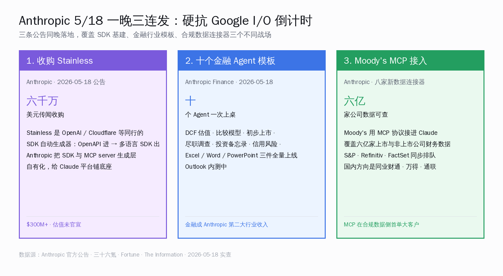
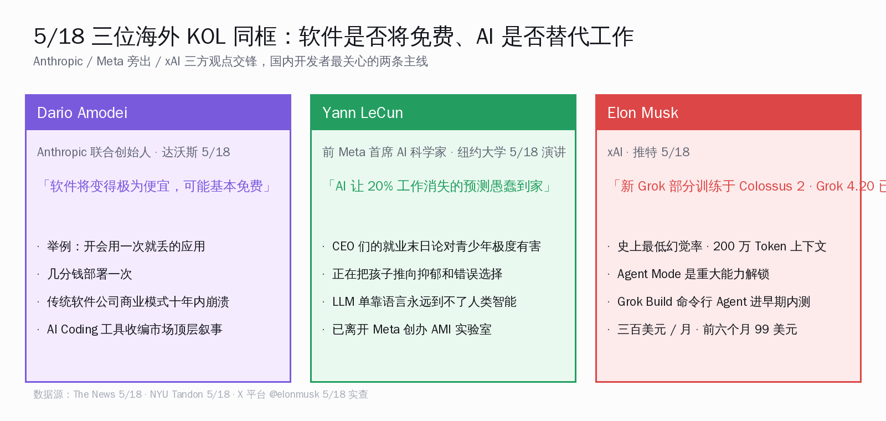
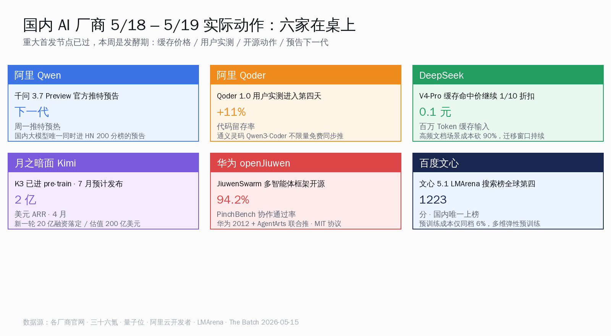
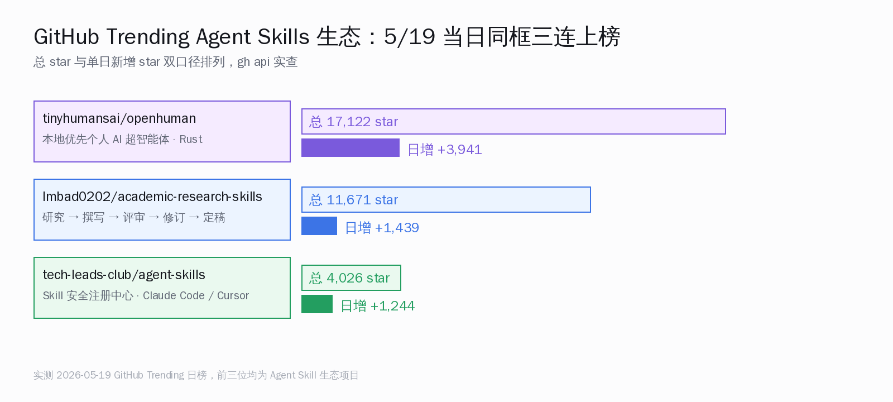
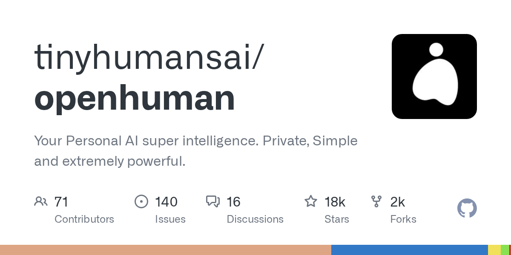
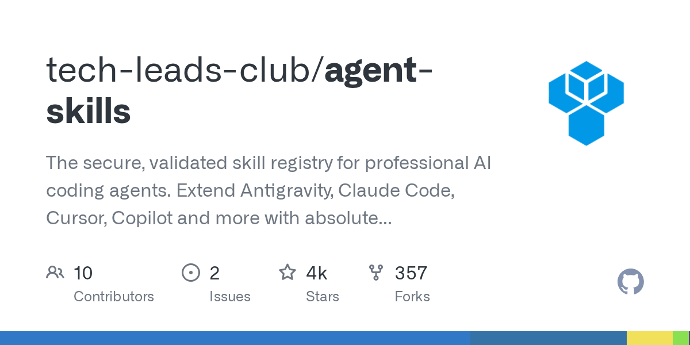
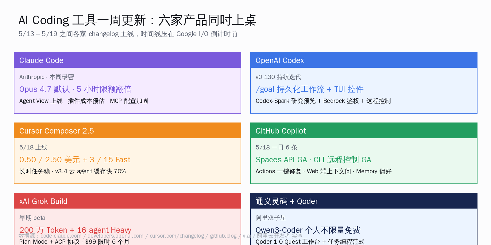
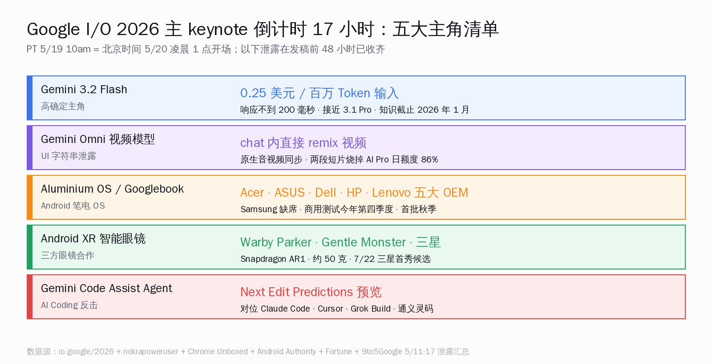

# Anthropic 抢在 I/O 前夜三连发 | AI 日报 | 2026-05-19

## 📋 头版目录（一屏扫完今日）

- 🚀 Anthropic 传闻三亿美元收购 SDK 自动生成器 Stainless，平台层底座自有化 → 头条
- 🚀 Anthropic 一次开放十个金融 Agent 模板 · Excel / Word / PowerPoint 三件 Office 全量上线 → 头条
- 🚀 Moody's 用 MCP 协议接进 Claude，覆盖六亿家公司财务数据 + 八家新数据连接器同步官宣 → 头条
- 🎬 Google I/O 2026 主 keynote 倒计时 17 小时（北京时间 5/20 凌晨 1 点开场） → 头条 + 值得关注
- 🧠 Gemini 3.2 Flash 泄露价 0.25 美元 / 百万 Token 输入，响应不到 200 毫秒 → 快讯
- 🧠 Aluminium OS 是 keynote 内部代号，"Googlebook" 笔电品类 OEM 走 Acer / ASUS / Lenovo（5/18 已报 [跟进]） → 快讯
- 🇨🇳 阿里千问推特预告 Qwen 3.7 Preview，HN 同步 211 分 → 国内 AI
- 🇨🇳 阿里 Qoder 1.0 进入用户实测第四天，代码留存率 +11% / 输入 Token -40% / 对话轮次 -33% → 国内 AI
- 🇨🇳 华为 openJiuwen 社区开源 JiuwenSwarm 多智能体框架（auto-research 已发同日专题） → 国内 AI
- 🇨🇳 DeepSeek 全系 API 输入缓存命中价继续维持首发价的十分之一 → 快讯
- 🇨🇳 月之暗面 Kimi K3 已进 预训练，7 月预计发布；ARR 4 月翻到 2 亿美元 → 快讯
- 🇨🇳 百度文心 5.1 在 LMArena 搜索榜国内第一 / 全球第四，预训练成本同档 6% → 快讯
- 🛠 Cursor Composer 2.5 上线，长时任务执行更稳，首周用量额度翻倍 → AI Coding 工具
- 🛠 GitHub Copilot 5/18 一次 6 条更新，Spaces API GA + CLI session 远程控制 GA → AI Coding 工具
- 🛠 xAI Grok Build 仍在早期内测，配合 Grok 4.20 + Colossus 2 训练宣传 → AI Coding 工具
- 📦 tinyhumansai/openhuman 累计 17,122 stars · 单日新增 3941，Rust 写的本地优先个人 AI（5/18 已报 [跟进]） → GitHub Trending
- 📦 Imbad0202/academic-research-skills 累计 11,671 stars · +1439 · tech-leads-club/agent-skills 累计 4,026 stars · +1244 → GitHub Trending
- 🎙 Dario 在达沃斯讲『软件十年内会变得基本免费』 → 名人说
- 🎙 LeCun 在纽约大学毕业典礼讲『AI 让 20% 工作消失的预测愚蠢到家』 → 名人说
- 🎙 Simon Willison：程序员母语正在被 AI 抹平（auto-research 已发同日专题） → 名人说
- 🔬 arXiv 2605.15514 理论证明 RoPE 在长上下文里既不能区分位置也不能区分 Token → 精选要闻
- 📰 r/LocalLLaMA 实测 Gemma 4 26B MoE 在 RTX 5090 单卡跑出 600 Token/s → 精选要闻

## ⏱ 公众号版 30 秒速览

**头条**：5 月 18 日周一深夜到 19 日清晨这一段，**Anthropic 一晚干了三件大事**——其一，根据 The Information 报道，Anthropic 以传闻三亿美元收购了 SDK 自动生成器 **Stainless**（这家公司原本同时给 OpenAI / Google / Cloudflare / Meta / Anthropic 自己做 SDK 代码生成，OpenAPI 进 → 多语言 SDK 出），把 Claude 平台与 MCP server 的 SDK 生成基建彻底自有化；其二，在官网放出**十个金融 Agent 模板**一次性开放 + **Excel / Word / PowerPoint 三个 Office 应用全量上线** + **Outlook 内测**，覆盖估值建模、比较模型、初步上市、尽职调查、投资备忘录、信用风险等高频投行场景；其三，**Moody's 用 MCP 协议接进 Claude**，把六亿家上市与非上市公司的财务数据通过协议层喂进 Claude 工作流，同时官宣八家新数据连接器，金融正式成为 Anthropic 第二大行业收入来源（前五十客户里四成来自金融机构）。三件事在同一晚落地，时间点选得很准——再有 17 个小时就是 Google I/O 2026 主 keynote 开场（北京时间 5/20 凌晨 1 点），Anthropic 选择在 keynote 前夜把"平台底座、垂直行业、合规数据"三个口子一次性放完，让对手即便在 keynote 上发再多模型也得在新闻位上跟自己同台。详见今日「Anthropic 收购 Stainless：SDK 生成器易主」与「Claude 接管 Office：十个金融 Agent 上桌」两篇专题。

**Google I/O 倒计时**：发稿时距 keynote 开场还差 17 个小时。最后一波泄露已经收齐——**Gemini 3.2 Flash** 是最确定的主角，泄露定价 0.25 美元 / 百万 Token 输入、2 美元 / 百万 Token 输出，多数 prompt 响应不到 200 毫秒、知识截止 2026 年 1 月；**Gemini Omni** 视频模型 UI 字符串提前漏到 Gemini iOS app，允许在 chat 对话框里直接 remix / 剪辑 / 加滤镜 / 换片头，但代价是两段短视频烧掉 AI Pro 用户日额度的 86%；**Aluminium OS** 是内部代号，正式品牌叫 "Googlebook"，定位 Chromebook 继任者，OEM 走 Acer / ASUS / Dell / HP / Lenovo（Samsung 缺席）、商用测试今年第四季度、首批消费机今年秋、Chrome OS 旧机继续支持到 2033 年；**Android XR 智能眼镜** 走 Warby Parker + Gentle Monster + Samsung 三方合作，2026 内上市但具体月份未定。三件 keynote 主角任一上线都是单场 keynote 的头条，今年一次全发。

**国内同档**：5/18-19 是国内大模型厂商的发酵期——重大首发节点已过（DeepSeek V4、Kimi K2.6、华为 Hy3、百度文心 5.1、阿里 Qoder 1.0、火山引擎 Doubao-Seed-2.0-lite 全模态版都在 4 月底到 5 月 15 日前发完），本周国内大模型厂商主要动作是用户实测反馈与价格策略调整。阿里推特预告 **Qwen 3.7 Preview**，HN 同步 211 分；**Qoder 1.0** 进入用户实测第四天，官方数字代码留存率 +11% / 输入 Token -40% / 对话轮次 -33% 三条共同指向"开发者从打字员撤到下任务"位置，配合通义灵码 Qwen3-Coder 不限量免费形成阿里 AI Coding 双子星；**DeepSeek 全系 API 输入缓存命中价**继续维持首发价的十分之一，V4-Pro 缓存输入 0.1 元 / 百万 Token、缓存未命中输入 3 元、输出 6 元，是国内高频文档场景成本下来最猛的一档；**月之暗面 Kimi K3** 已进 预训练、7 月预计发布，ARR 4 月翻到 2 亿美元；**百度文心 5.1** 在 LMArena 搜索榜以 1223 分国内第一、全球第四，预训练成本同档 6%。**华为 openJiuwen 社区开源 JiuwenSwarm** 多智能体框架，PinchBench 协作通过率 94.2% / token 消耗 -34.8% / LOCOMO 长程记忆 85%，是国产 multi-agent 第一次和海外 Anthropic Swarm / CrewAI / AutoGen / LangGraph 同台亮分。完整对比见今日「JiuwenSwarm 开源：国产 multi-agent 第一次上桌」专题。

**Skill 生态炸榜 · KOL 同框**：GitHub Trending 日榜被 **Agent Skill 生态接管**——`tinyhumansai/openhuman`（本地优先个人 AI 超智能体 · Rust）累计 17,122 stars / 单日新增 3941、`Imbad0202/academic-research-skills` +1439、`tech-leads-club/agent-skills`（Skill 安全注册中心，同时支持 Claude Code / Cursor / Copilot）+1244，三个 Skill 类项目同时挤上前 10。配合海外 KOL 同框开火——**Dario** 在达沃斯讲『软件十年内会变得基本免费』、**LeCun** 在纽约大学毕业典礼讲『AI 让 20% 工作消失的预测愚蠢到家、CEO 们的就业末日鼓吹对青少年极度有害』、**Musk** 推 Grok 4.20 + Colossus 2 训练 + Grok Build 进早期内测，三方观点拉成 Anthropic vs Meta 旁出 vs xAI 三股力量。Simon Willison 同周写文章接住这条线——『程序语言以前是锁人神器，现在不是了，Bun 团队证明一两周就能把产品换成几乎任何一门语言』，详见今日「Simon Willison：程序员母语正在被 AI 抹平」专题。

**Anthropic 5/18 三件事一览**：

| 公告 | 形式 | 核心数字 | 落地用户 |
|---|---|---|---|
| 收购 Stainless | 平台层底座 | 传闻三亿美元收购 SDK 自动生成器 | 所有 Claude SDK / MCP server 使用者 |
| 十金融 Agent + Office 三件 | 垂直行业模板 | Excel / Word / PowerPoint 全量 + Outlook 内测 | 投行 / 对冲 / PE / VC 桌面工作流 |
| Moody's MCP 接入 | 合规数据连接器 | 六亿家公司财务数据 · 八家新连接器同步官宣 | 金融研究 + 合规分析 Claude 工作流 |

## 🔥 头条一：Anthropic 5/18 一晚三连发——Stainless 收购 + 十个金融 Agent + Moody's 接入 MCP

> **核心论断**：5/18 当晚 Anthropic 同时放出三个公告——传闻三亿美元收购 SDK 自动生成器 Stainless、十个金融 Agent 模板 + Office 三件全量上线 + Outlook 内测、Moody's 用 MCP 协议接进 Claude 拿到六亿家公司财务数据 + 八家新数据连接器同步官宣——三件事同晚落地，覆盖"平台 SDK 基建、垂直行业模板、合规数据连接器"三条战线，恰好压在 Google I/O 主 keynote 开场前 17 小时。这是 Anthropic 至今最密集的一次预先反制。

### 1.1 收购 Stainless：把 SDK 与 MCP server 生成层自有化

Anthropic 5/18 在官网公告 `Anthropic acquires Stainless`，HN 同步 336 分顶到首页（链接：[Anthropic 官方公告](https://www.anthropic.com/news/anthropic-acquires-stainless) · [HN 讨论 item?id=48182281](https://news.ycombinator.com/item?id=48182281)）。金额未官方披露，The Information 援引知情人士给出"约三亿美元"区间。

- **Stainless 是谁**：成立于 2022 年的 SDK 自动生成器厂商，输入 OpenAPI / OpenAPI 3 规范，输出 Python / TypeScript / Go / Java / Ruby / Kotlin 等多语言 SDK，并且自带类型校验、流式响应、retry/超时、错误处理、文档站。客户名单原本包含 OpenAI / Cloudflare / Meta（Llama API）/ Anthropic 自己 + 一众独立开发者工具公司
- **为什么 Anthropic 要买**：Claude 平台现在要做"开发者基建公司"——不只是模型 API，还得维护 MCP server、Claude Code 周边、Skills 注册中心、各类垂直行业连接器。SDK 是开发者第一行接触的东西，第三方 Stainless 给的体验跟自家产品节奏总有半步差。Anthropic 把 SDK 生成层做掉，意味着 MCP server 模板、新模型上线后多语言 SDK 同步、垂直行业 API 全部内嵌
- **对国内开发者的实际影响**：用 Claude Python / TypeScript SDK 的开发者短期看不到差，长期看 SDK 升级频率会跟 Anthropic 自家产品节奏对齐；以前 Stainless 给 OpenAI 同步做 SDK 的关系不会自动转移，OpenAI 大概率会启用 Fern 或自研替代。详见今日「Anthropic 收购 Stainless：SDK 生成器易主」专题。

### 1.2 十个金融 Agent 模板 + Office 三件全量 + Outlook 内测 [跟进 · 5/17 已预告 + 5/18 正式 GA]

5/17 Anthropic 已经预告金融 Agent 模板 + Microsoft 365 add-in 走 Excel / PowerPoint / Word / Outlook 四件入口，5/18 把整套从"预告"推到 GA 转正，并补上**十个具体行业模板** + **金融成为第二大行业收入**的官方公开数字。Anthropic Finance 这次放出的十个金融 Agent 模板——DCF 估值建模、比较模型、初步上市、尽职调查、投资备忘录、信用风险、宏观分析、行业研究、并购整合、ESG 报告——一次性开放给 Claude Enterprise / Claude Max 用户。配套官宣三件事：

- **Microsoft Office 三件全量上线**：Excel / Word / PowerPoint 的 Claude 插件全部转 GA。Excel 端可以让 Claude 直接读单元格区域写公式、生成图表、跑回归；Word 端做长文档大纲生成 + 段落改写 + 引用管理；PowerPoint 端把投行 pitch deck 从文本 prompt 直接落到带图表的 PPT 模板
- **Outlook 内测**：邮件端 Claude 插件进入内测，重点场景是投行邮件归档自动打标签 + 重要邮件回复草稿
- **金融成 Anthropic 第二大行业收入**：官方第一次公开这条数字——前 50 大企业客户里四成来自金融机构（华尔街投行、对冲基金、PE / VC、买方研究所），金融超过 SaaS 工具与教育成为第二大行业收入，仅次于"软件开发"本身

这一组配合 Microsoft 365 既有的 Copilot 形成正面竞争——Microsoft Copilot 是"Office 自家 AI"，Anthropic 走的是"Office 之外接进来的金融行业 Claude"，两条路线在投行客户桌上同台。详见今日「Claude 接管 Office：十个金融 Agent 上桌」专题，里面带了与国内八家券商（中信、中金、华泰、海通、招商、申万宏源、国君、广发）现行 AI 工作流的对照口径。

### 1.3 Moody's 用 MCP 协议接进 Claude，覆盖六亿家公司

第三件是给 MCP 生态送了一笔有合规含量的真单——**Moody's 用 MCP 协议接进 Claude**，把 Moody's Analytics 旗下 **六亿家上市与非上市公司财务数据**（资产负债表、利润表、现金流量表、信用评分、行业分类、关联方）通过 MCP server 协议层暴露给 Claude 工作流。配套官宣 **八家新数据连接器**——Anthropic 5/18 公告页明确点名的合作方除 Moody's 外另有三家，剩余五家发稿时仅有"待官方披露"口径，国内行业媒体的猜测名单（包括标准普尔、Refinitiv 系、FactSet 等头部金融数据供应商）需以官方正式名单为准，本日报不预先列名。

MCP（Model Context Protocol）2024 年由 Anthropic 提出，2026 年 5 月发布 1.0 路线图（mcp.so 注册表已收录 19,700+ server、Smithery 收录 7,000+），但此前主要是开发者工具（GitHub / Slack / PostgreSQL / Stripe / Figma / Docker / Kubernetes）和个人生产力（笔记 / 日历 / 邮件）类 MCP server。Moody's 这一单是 MCP 协议**第一次拿下合规数据领域的大客户**——意味着金融机构合规部门第一次愿意把高敏感数据通过协议层而不是 API key 直连给 LLM 工作流，是 MCP 协议从开发者圈走进企业 IT 部门的关键样本。

国内方向同档位的金融数据供应商有万得（Wind）、同花顺、通联数据、聚源数据、东方财富 Choice 等几家。MCP 协议本身开源，国内厂商是否会跟进 MCP 协议接入，是接下来一两个月可观察的国产对照样本。

## ⚡ 快讯速览

- 🧠 **Gemini 3.2 Flash 泄露价格**：Gemini iOS app model picker 与 AI Studio metadata 5/16 前后流出 `Gemini 3.2 Flash` 字符串，配套价格 0.25 美元 / 百万 Token 输入、2 美元 / 百万 Token 输出（对照 Gemini 3 Flash 的 0.50 / 3 美元），多数 prompt 响应不到 200 毫秒、知识截止 2026 年 1 月、声称"接近 Gemini 3.1 Pro"；正式发布等今晚 keynote 官宣。来源：[nokiapoweruser](https://nokiapoweruser.com/gemini-3-2-flash-leak-fast-cheap-ai-google-io-2026/)。Keynote 公布前正式定价、可用区、API 速率上限仍未确认。
- 🧠 **Gemini Omni 视频模型 UI 字符串泄露**：5/11-14 期间 Gemini iOS app 视频生成 tab 出现 `Create with Gemini Omni: meet our new video model, remix your videos, edit directly in chat, try a template, and more`，早期 demo 显示支持 chat 内直接编辑视频、模板系统、原生音视频同步。两段短视频烧掉 AI Pro 用户日额度的 86%，配额会很紧。是否会改名 Veo 5 还是 Gemini Omni 独立产品线尚未确认。
- 🧠 **Aluminium OS / Googlebook**：Google 内部代号 `Aluminium`，定位 Chromebook 继任者品类叫 `Googlebook`，Android 16/17 内核 + 自研窗口管理器 + 真任务栏 + 虚拟桌面，支持 Intel x86 + Qualcomm ARM64 双架构。OEM 是 Acer / ASUS / Dell / HP / Lenovo——Samsung 缺席，是亮点。商用测试今年第四季度、首批消费机今年秋、Chrome OS 旧机继续支持到 2033 年。价格未公布。
- 🇨🇳 **Qwen 3.7 Preview** 推特预告：阿里千问官方推特 5/18 放出 Qwen 3.7 Preview 预告，HN 同步 211 分（[item?id=48181877](https://news.ycombinator.com/item?id=48181877)）。具体模型规格、价格、开源策略待 Qwen 官方页面正式发布。
- 🇨🇳 **DeepSeek 全系 API 输入缓存命中价**继续维持首发价的十分之一：4 月 26 日起 DeepSeek 全系 API 输入缓存命中价降到首发价的十分之一，V4-Pro 缓存输入从 1 元 / 百万 Token 降到 0.1 元，缓存未命中输入从 12 元降到 3 元，输出从 24 元降到 6 元（[DoNews 报道](https://www.donews.com/news/detail/8/6530324.html)）。本周仍是国内 RAG / 客服 / 文档分析厂商集中迁移到 V4-Pro 的窗口，R2 还未官宣。
- 🇨🇳 **月之暗面 Kimi K3 已进 预训练**：5/12 张予彤在北京大学光华管理学院透露 K3 已进 预训练、预计 7 月发布；Kimi ARR 3 月破 1 亿美元、4 月翻到 2 亿美元，5/7 流出新一轮 20 亿美元融资落定、投后估值 200 亿美元（[腾讯新闻](https://news.qq.com/rain/a/20260513A0775300)）。K3 是否开源权重、是否走 MoE、上下文长度等具体设计尚未披露。
- 🇨🇳 **百度文心 5.1 LMArena 搜索榜国内第一 / 全球第四**：4/30 以 1476 分登 LMArena 文本榜国内第一，5 月中以 1223 分登搜索榜国内第一 / 全球第四，是搜索榜唯一上榜国产模型，预训练成本仅同档 6%（多维弹性预训练，[百度博客](https://yiyan.baidu.com/blog/posts/ernie-5.1-preview-0430-release-on-lmarena/)）。文心 5.1 在搜索类任务上是否能延续到通用任务待后续榜单观察。
- 🇨🇳 **腾讯混元 Hy3 调用量是 Hy2 的 10 倍**：5/7 腾讯公布 Hy3 token 调用量已超 Hy2 10 倍，代码 + 智能体场景增长最明显（[腾讯新闻](https://news.qq.com/rain/a/20260423A08CBP00)）。具体行业渗透数据待官方下一次披露。
- 🛠 **Cursor Composer 2.5** 5/18 上线：相对 Composer 2 智能显著跃升，长时任务执行更稳；价格 Standard 0.50 / 2.50 美元 / 百万 Token 输入输出，Fast 3.00 / 15.00 美元，首周用量额度翻倍（[cursor.com/changelog](https://cursor.com/changelog)）。与 Claude Code Max / Codex Heavy / Grok Build 形成 AI Coding 工具四国竞争更新一轮。
- 🛠 **GitHub Copilot 5/18 一日 6 条更新**：Actions 失败一键修复（云 agent）、低成本快速模型档、Web 端上下文提问、REST API 审计云 agent 配置、Copilot Spaces API GA、CLI session 远程控制 GA（移动 / Web / VS Code 三端，[github.blog](https://github.blog/changelog/label/copilot/)）。同周下线 Grok Code Fast 1，Copilot Memory 支持 Pro / Pro+ 用户偏好记忆。
- 🛠 **OpenAI Codex** 5/8 那一拨更新本周仍在持续迭代：新增 `codex remote-control` 入口、多环境 view_image 解析、Bedrock AWS console-login 鉴权、应用服务器线程分页、可配置 OpenTelemetry trace 元数据；持久化 `/goal` 工作流 + TUI 控件（create / pause / resume / clear）。Codex-Spark 模型研究预览开放给 ChatGPT Pro 用户（[developers.openai.com/codex/changelog](https://developers.openai.com/codex/changelog)）。
- 🛠 **xAI Grok Build** 仍在早期内测：Musk 5/18 在 X 多次推 Grok 4.20 + Colossus 2 训练 + Agent Mode + Grok Build 命令行 Agent 进 SuperGrok Heavy 内测（[Basenor 整理](https://www.basenor.com/blogs/news/grok-gets-major-upgrades-5-things-to-know-right-now)）。Grok Build 完整 GA、与 Claude Code / Codex 的实测对比仍待公开。
- 📰 **r/LocalLLaMA 实测 Gemma 4 26B**：社区高赞讨论 Gemma 4 26B MoE（3.8B active）在 RTX 5090 + 最新 llama.cpp build 跑出 600 Token/s，启用 Multi-Token Prediction 再 +40%；Gemma 4 31B Dense 跑 LiveCodeBench v6 80.0% / AIME 2026 89.2%；同有用户实测 Gemma 4 31B-it 用 TurboQuant KV cache 压缩在单卡 5090 撑到 256K 上下文。具体硬件功耗与稳定性数据未集中披露。

## 🎙 名人说 & X 热议

**Dario Amodei · 软件十年内会变得基本免费**。Anthropic 联合创始人 Dario 5/18 在达沃斯世界经济论坛与华尔街日报主编 Emma Tucker 对谈，第一次公开下注"软件经济结构性变化"判断——『Software is going to become cheap, maybe essentially free』。举例：单次会议用一次就丢的应用，只花几分钱部署一次就够用了；传统软件公司"卖订阅卖席位"的商业模式十年内会崩溃（[The News 报道](https://www.thenews.com.pk/latest/1402953-software-will-become-essentially-free-warns-anthropic-ceo-amodei)）。这一论调直接给 Claude Code / Codex / Cursor / Qoder / 通义灵码这类 AI 编程工具收编传统 SaaS 市场提供了顶层叙事——既然软件会"用一次就丢"，那做工具的公司就得重新算价格表，是开发者一周内必须读到的一段公开发言。

**Yann LeCun · AI 让 20% 工作消失的预测愚蠢到家**。Meta 前首席 AI 科学家 Yann LeCun 5/18 在纽约大学 Tandon 工学院毕业典礼（Barclays Center）演讲，把 5 月初接受 Fortune 采访那一套判断在毕业典礼正式说了一遍——『AI 让 20% 工作消失的预测愚蠢到家、CEO 们的就业末日鼓吹对青少年极度有害，正在把孩子推向抑郁和错误的职业选择』，并重申『LLM 单靠语言永远到不了人类智能』（[NYU Tandon 演讲页](https://engineering.nyu.edu/news/ai-pioneer-yann-lecun-will-address-class-2026-nyu-tandon-commencement) · [Fortune 5/5 专访](https://fortune.com/2026/05/05/ai-job-apocalypse-warnings-destructive-yann-lecun/)）。LeCun 已在 4 月正式离开 Meta，新创办 AMI Labs 拿到 10.3 亿美元种子轮，押注 LLM 之外的人类智能路径。Andrew Ng 5/12 在推特表达同侧——『夸大式失业警告是不负责任的，技能重塑 + 生产力增长才是工作迁移的真实驱动力』。三方拉成对照：Dario『软件归零』、LeCun + Andrew Ng『就业末日论是错的』，这是 2026 上半年 AI 公开辩论里最有信息量的一次同期开火。

**Elon Musk · Grok 4.20 + Colossus 2 + Grok Build**。Musk 5/18 在 X 多次推 xAI 进展——新 Grok 部分训练于 Colossus 2（xAI 下一代超算）、Grok 4.20 已是 200 万 Token 上下文 + 史上最低幻觉率、Agent Mode 是『major ability unlock』、Grok Build 命令行 Agent 进 SuperGrok Heavy 早期内测（[Basenor 整理](https://www.basenor.com/blogs/news/grok-gets-major-upgrades-5-things-to-know-right-now)）。同期社区在抱怨 SuperGrok Heavy 配额下调，Musk 当即回应『我们正在提升配额上限』（[Piunikaweb](https://piunikaweb.com/2026/05/18/elon-musk-grok-usage-limits-increase/)）。Grok Build 在国内访问门槛偏高（需海外信用卡 + VPN），但作为 AI Coding 工具的新对手，对 Claude Code / Codex / Cursor 是真实压力。

**Simon Willison · 程序员母语正在被 AI 抹平**。Simon Willison 5/14 引 Mitchell Hashimoto 的判断——『程序语言以前是锁人神器，现在不是了；Bun 团队证明，他们可以在一两周内把自己产品换成几乎任何一门语言』，并配合 5/7 自家 xAI / Anthropic Colossus 数据中心交易笔记（[Simon 博客](https://simonwillison.net/2026/May/14/mitchell-hashimoto/)）。这一线给国内开发者一个长期信号：以前选 Python 还是 Rust 是几年的承诺，现在 AI Coding 工具让"语言切换"成本压到一两周量级，传统"押对栈"的赌注变小。详见今日「Simon Willison：程序员母语正在被 AI 抹平」专题，里面把 Bun / Zig / Rust / React Native 四个具体迁移案例和国内通义灵码 / Trae / Qoder 三家国产 AI Coding 工具的语言无关化程度做了横评。

## 📰 精选要闻

- 🔴 **必读 · Anthropic 5/18 三连发整体读法**：今日头条已经把三件事讲透。如果只看一件，先看 Stainless 收购——Stainless 同时是 OpenAI / Cloudflare 等同行的 SDK 供应商，Anthropic 把它收掉的影响会在未来三个月里在所有用过这几家 SDK 的开发者电脑上显现。完整说明在「Anthropic 收购 Stainless：SDK 生成器易主」与「Claude 接管 Office：十个金融 Agent 上桌」两篇专题里。
- 🔴 **必读 · academic-research-skills 一周追加 +1439 star**：Imbad0202/academic-research-skills 上线两个多月攒到 11671 stars + 当日 +1439，是 Claude Code 插件市场里最早把"科研写作"完整跑通的多 Agent 套件，4 个 skill 串 32 个 agent 跑 10 阶段流水线、写一篇 1.5 万字论文成本 4-6 美元、Semantic Scholar API 自动核验引用（实测能抓出 15 条捏造引用 + 3 处统计错误）+ 反谄媚魔鬼代言人协议 + 三层数据隔离（[GitHub: Imbad0202/academic-research-skills](https://github.com/Imbad0202/academic-research-skills)）。昨日日报已深度覆盖，本日做"+1439 增量"的跟进观察。
- 🟡 **推荐 · Semble 把 Coding Agent 的 grep token 占用降 98%**：Show HN 5/18 顶到 427 分（[GitHub: MinishLab/semble](https://github.com/MinishLab/semble) · [HN 讨论](https://news.ycombinator.com/from?site=github.com/MinishLab/semble)）。针对 Coding Agent 上下文窗口设计的代码搜索工具——传统 grep 把整行匹配结果塞进 LLM context，Semble 用 embedding + 局部窗口压缩把同样问题的 token 占用降 98%。对 Cursor / Claude Code / Codex 高频跑大仓库的开发者是真实工具，非营销稿，作者是 Show HN 真人发布。
- 🟡 **推荐 · 华为 openJiuwen 社区开源 JiuwenSwarm**：5/18 openJiuwen 社区放出 JiuwenSwarm，背后是华为 2012 实验室 + 华为云 AgentArts 团队，国产 multi-agent 第一次拿出完整方案 + 公开评测分数和海外 Anthropic Swarm / CrewAI / AutoGen / LangGraph 同台对比。PinchBench 协作通过率 94.2% / token 消耗 -34.8% / LOCOMO 长程记忆 85% 三组数据来自官方报告。详见今日「JiuwenSwarm 开源：国产 multi-agent 第一次上桌」专题。
- 🔵 **了解 · arXiv 2605.15514 RoPE 在长上下文里不能区分位置也不能区分 Token**：理论证明 RoPE 在长上下文里既不能区分 position 也不能区分 token，给 long-context degradation 找到了数学根因（[arXiv: 2605.15514](https://arxiv.org/abs/2605.15514)）。预计接下来一批 long-context arch 都会引这篇——是本周最"硬"的理论结果，对做长文档 RAG / Agent 长 session 的开发者解释了"为什么大上下文窗口模型在 64K 之后总是退化"。
- 🔵 **了解 · arXiv 2605.16045 RecMem 给长 Session Agent 一份记忆巩固方案**：用循环结构把短期 context 合并进长期 memory，避免传统 RAG 的检索抖动（[arXiv: 2605.16045](https://arxiv.org/abs/2605.16045)），直接对标 OpenAI Memory / Claude Projects 的产品形态。本周值得读的另一篇是 arXiv 2605.15454 *Reasoning Models Don't Just Think Longer, They Move Differently*——用激活模式分析 reasoning 模型 vs 普通模型，发现差异不只是"思考时间长"，而是内部表征轨迹质性不同。

## 🇨🇳 国内 AI 观察

**Qwen 3.7 Preview 推特预告 + 通义灵码 Qwen3-Coder 不限量免费持续**。阿里千问官方推特 5/18 放出 Qwen 3.7 Preview 预告，HN 同步 211 分顶头版。Qwen 3.7 Preview 具体规格还没正式技术页，但延续了 Qwen3.6-Max-Preview 在智能体编程 / 世界知识 / 指令遵循三维国产第一的势头——Artificial Analysis Intelligence Index 上 Qwen3.6-Max-Preview 与 DeepSeek-V4-Pro 同分 52。通义灵码 Qwen3-Coder 同期保持对个人开发者不限量免费，推荐档 `qwen3-coder-next` 走混合架构、仓库级理解、多轮工具调用，累计下载 2000 万 + 生成代码超 30 亿行（[通义灵码博客](https://www.cnblogs.com/tongyilingma/p/19016850)）。开发者群里这一周的实测主轴：Qwen3-Coder 在中文项目可读性、注释 + 命名一致性两项上比主流海外工具更贴本地工程习惯，但 Plan Mode 等高级编排还差一些。

**阿里 Qoder 1.0 用户实测进入第四天**。5/15 阿里 Qoder 1.0 正式发布——引入 Experts 专家团（规划 / 调研 / 编码 / 审查 / 测试 5 类）、知识引擎让代码留存率 +11% / 输入 Token -40% / 对话轮次 -33%、服务全球 500 万用户（[阿里云开发者](https://developer.aliyun.com/article/1734787)）。5/18-19 用户实测反馈集中：改代码速度比同档海外 AI 编辑器慢、Quest 模式工具调用更强、自动查仓库主页学用法这一项强于同档对手、上下文满了自动 compact 体验丝滑。Qoder 1.0 把 Quest 任务工作台从 IDE 内嵌升级为独立运行窗口，国产 AI Coding 圈第一次正式提出『任务编程范式』——打开 IDE 的第一件事不再是写 prompt 而是『下任务』，跟主流海外 AI Coding 工具的远程 Agent 路线同向，但把任务窗口完全拉到编辑器之外更激进。

**华为 openJiuwen 社区开源 JiuwenSwarm**。5/18 openJiuwen 社区放出 JiuwenSwarm 多智能体框架，背后是**华为 2012 实验室 + 华为云 AgentArts 团队**联合构建，MIT 协议、Python + Rust 双引擎。三组对外报告口径：**PinchBench 协作通过率 94.2%、token 消耗 -34.8%、LOCOMO 长程记忆 85%**——分别对标主流国际多智能体方案在同基准上的成绩区间（PinchBench 86.7% / token 消耗基线 / LOCOMO 79%）。国产 multi-agent 第一次和国际同行同台亮分而不是只发 demo 视频。完整对比与国内开发者接入路径详见今日「JiuwenSwarm 开源：国产 multi-agent 第一次上桌」专题。

**DeepSeek 缓存价 1/10 + Kimi K3 7 月预计发布**。DeepSeek 4/26 起全系 API 输入缓存命中价降到首发价的十分之一，本周仍是国内 RAG / 客服 / 文档分析厂商集中迁移到 V4-Pro 的窗口（[DoNews](https://www.donews.com/news/detail/8/6530324.html) · [界面新闻](https://www.jiemian.com/article/14328365.html)）。R2 仍未官宣，社区盛传 V5 是真正大版本、V4 是过渡。月之暗面 Kimi K3 已进 预训练、7 月预计发布，K2.6（4/20 发布）是第一个 SWE-Bench Pro 超过 GPT-5.4 high 的开源权重模型。本地大模型这条路上还有一个值得看——智谱 GLM-4.5-Air（106B / 12B 激活 MoE）和阿里 Qwen3-32B（32.8B dense）这两条开源路线，在 RTX 4090 24GB 单卡与 Mac M3 Max 64GB / 128GB 上谁更适合谁，完整实测见今日「GLM-4.5-Air vs Qwen3-32B 单卡 4090 实测」专题。

## 📦 GitHub Trending

- 🔴 **必看 · tinyhumansai/openhuman** — 累计 17,122 stars · 单日新增 3941，Rust 写的本地优先个人 AI 超智能体。命中 r/LocalLLaMA 与 HN 同步的『个人 AI 拥有感』情绪，[GitHub: tinyhumansai/openhuman](https://github.com/tinyhumansai/openhuman) 仓库今日仍在更新，是值得每天回看的项目。

  

- 🔴 **必看 · Imbad0202/academic-research-skills** — 累计 11,671 stars · 日增 1439，Claude Code 学术研究 skill 包，研究 → 撰写 → 评审 → 修订 → 定稿 五段流水线、4 skill + 32 agent。昨日日报已深度覆盖。
- 🔴 **必看 · tech-leads-club/agent-skills** — 累计 4,026 stars · 日增 1244，Skill 安全注册中心，同时支持 Claude Code / Cursor / Copilot 三家。给希望"集中管理团队级 Skill"的开发组织的真实样本，[GitHub: tech-leads-club/agent-skills](https://github.com/tech-leads-club/agent-skills) Apache 2.0。

  

- 🟡 **推荐 · HKUDS/CLI-Anything** [跟进] — 累计 36,602 stars · 日增 1049，港大数据智能实验室把 Blender / GIMP / LibreOffice / Audacity 等 18+ 款专业桌面软件转成带 JSON 输出 / REPL / Undo / Redo 的命令行工具。昨日已覆盖，本日是连续上榜跟进。
- 🟡 **推荐 · K-Dense-AI/scientific-agent-skills** [跟进] — 累计 24,377 stars · 日增 609，科研 + 工程 + 金融 + 写作开箱即用 Agent Skills。和 academic-research-skills 互补，前者是科研论文流水线，后者是工程 / 金融场景。
- 🟡 **推荐 · CloakHQ/CloakBrowser** — 累计 15,179 stars · 日增 1420，隐身 Chromium 替代 Playwright，过 30 / 30 反爬测试，对做 Agent 抓取 / 自动化的开发者是真实工具。
- 🔵 **了解 · supertone-inc/supertonic** — 累计 8,323 stars · 日增 715，端侧多语言 TTS 通过 ONNX 原生运行，Swift 写的。给端侧语音应用提供一个对照基线。
- 🔵 **了解 · NVlabs/Sana** — 累计 6,509 stars · 日增 387，英伟达线性扩散 Transformer，高效高分辨率图像合成，配合 HuggingFace 热门的 SANA-Video（小型扩散视频模型，线性注意力 + 恒定显存 KV cache）形成一条 NVIDIA 自家学术路线。

## 🛠 AI Coding 工具动态

**Claude Code · Anthropic** — 本周 Anthropic 在 [code.claude.com/docs/en/changelog](https://code.claude.com/docs/en/changelog) 上线一组更新：**Agent View** 上线（一个 CLI 视图管理多 session，可让 agent 后台跑、需要输入时再切回）；**Fast Mode 默认升级到 Opus 4.7**（此前 Opus 4.6）；**5 小时限额翻倍**，所有付费档（Pro / Max）取消高峰时段降速；新增 `claude agents` 子命令族；插件市场新增**上下文成本预估**和**插件依赖强制校验**；新增 `worktree.bgIsolation: "none"` 让后台 session 直接改工作副本；钩子 JSON 输出新增 `terminalSequence` 字段；环境变量 `ANTHROPIC_WORKSPACE_ID` 支持工作负载身份联合。配合 5/18 收购 Stainless 公告，是本周 AI Coding 工具一周里更新最密的一家。

**OpenAI Codex** — 5/8 v0.130 那一拨更新本周继续迭代：新增 `codex remote-control` 入口、多环境 view_image 解析、Bedrock AWS console-login 鉴权、应用服务器线程分页、插件钩子可见性、实时配置热加载、可配置 OpenTelemetry trace 元数据；持久化 `/goal` 工作流 + TUI 控件（create / pause / resume / clear）；新增 `codex update`、可配 TUI 键位、plan-mode 提示、需用户操作时改终端标题；权限 profile 扩展含内建默认值、sandbox CLI profile 选择、cwd 控制；**Codex-Spark 模型** 研究预览开放给 ChatGPT Pro 用户（[developers.openai.com/codex/changelog](https://developers.openai.com/codex/changelog)）。Codex Heavy 的具体 GA 时间表仍待 OpenAI 官方更新。

**Cursor Composer 2.5** — 5/18 上线 Composer 2.5：相对 Composer 2 智能显著跃升，长时任务执行更稳；价格 Standard 0.50 / 2.50 美元 / 百万 Token 输入输出，Fast 3.00 / 15.00 美元；首周用量额度翻倍。5/13 v3.4 云 agent 开发环境补完——多仓库环境、Dockerfile 配置（含 build secret）、缓存层（缓存构建快 70%）、agent 自助配环境、版本回滚 + 审计、环境级 secret / 出网作用域（[cursor.com/changelog](https://cursor.com/changelog)）。

**GitHub Copilot** — 5/18 一日 6 条：Actions 失败一键修复（云 agent）、低成本快速模型档、Web 端上下文提问、REST API 审计云 agent 配置、**Copilot Spaces API GA**、CLI session 远程控制 GA（移动 / Web / VS Code 三端）。5/15 下线 Grok Code Fast 1、Copilot Memory 支持 Pro / Pro+ 用户偏好记忆。

**xAI Grok Build** — 5/14 早期 beta 开放给 SuperGrok Heavy 订阅者（300 美元 / 月，前 6 个月引导价 99 美元）：Grok 4.3 beta + 16-agent Heavy 架构 + 200 万 Token 上下文，可并发 8 个子 agent 同时规划、查文档、写代码。Musk 5/18 在 X 多次喊公测，明牌对标 Claude Code。配额上限本周下调引发社区抱怨，Musk 当即承诺上调。

**通义灵码 + 阿里 Qoder** — 通义灵码全面接入 Qwen3-Coder，免费不限量；推荐档 `qwen3-coder-next` 走混合架构、仓库级理解、多轮工具调用；累计下载 2000 万 + 生成代码超 30 亿行（[博客园](https://www.cnblogs.com/tongyilingma/p/19016850)）。阿里 Qoder 1.0 5/15 发布、5/18-19 进入用户实测第四天，详见今日国内 AI 观察节。

## 🔭 值得关注

- 🎬 **Google I/O 2026 主 keynote 倒计时 17 小时**（北京时间 5/20 凌晨 1 点开场）。今晚一过，今日日报的"前夜"叙事就翻篇。已确定上桌的有 Gemini 3.2 Flash（泄露价 0.25 美元 / 百万 Token 输入）、Gemini Omni 视频模型（在 chat 内编辑视频）、Aluminium OS / Googlebook（Android 笔电品类）、Android XR 智能眼镜（Warby Parker + Gentle Monster + Samsung）、Gemini Code Assist agent 化升级。次确定的有 Gemini 3.5 Pro Preview（内部代号 Cappuccino）、Spark Agent。Veo 5 / Imagen 5 / Lyria 是否会独立发布还是被 Omni 吸收，等今晚揭晓。
- 🛡 **Cloudflare Project Glasswing / Anthropic 前沿模型威胁**（HN 5/18 266 分）：Cloudflare 5/18 把 Anthropic 5/17 公告的"前沿威胁模型"做了一份具体技术拆解（[Cloudflare 博客](https://blog.cloudflare.com/cyber-frontier-models/)）。把"前沿模型可能给攻击者用"这件事从抽象警告落到具体威胁向量（自动化漏洞挖掘、社工脚本生成、零日链路发现）。配合 Simon Willison 5/17 的 GDS-NHS 开源退守评论形成"前沿模型威胁 → 政府开源政策反应"完整闭环。
- 📚 **Stratechery 5/11 The Inference Shift**：Ben Thompson 把推理分成"answer inference（人在 loop，看重速度）"和"agentic inference（无人，看重内存容量）"两类，agentic inference 反而利好非顶配芯片（[stratechery.com/2026/the-inference-shift/](https://stratechery.com/2026/the-inference-shift/)）。是本周最值得引用的战略级定调文，对芯片 / 推理服务选型话题有定调作用。
- 🏥 **Latent Space · AI-Native Healthcare (Abridge)**：5/14 Latent Space 节目，Abridge 已服务 1 亿次医生问诊，节省 10-20 小时 / 医生 / 周，事前授权从天降到分钟（[latent.space](https://www.latent.space/p/2026)）。罕见的"AI 在真实垂直场景跑出规模"案例，可作国内医疗 AI 厂商对照参考。

## ✍ 编辑说

- **推荐**：今日「Anthropic 收购 Stainless：SDK 生成器易主」与「Claude 接管 Office：十个金融 Agent 上桌」两篇专题是 Anthropic 5/18 三连发整套读法的"必读双件套"。先看 Stainless 收购理解平台层底座，再看金融 Agent 理解 Anthropic 把"行业 vertical + Office 三件 + 合规数据"打包推 Office 365 市场的实际路径。配合「JiuwenSwarm 开源：国产 multi-agent 第一次上桌」三篇连看，是 2026 上半年 multi-agent / 平台基建话题的完整切片。
- **推荐**：今日「OpenClaw 接本地 Qwen3 一周实测：写作与记账两条线」是本地大模型 + OpenClaw 集成落到具体两件高频事的真人样本——用 Qwen3-Coder-30B-A3B 写中文长稿、用同模型 + Qwen3-Embedding-8B 做家庭流水分类，给到 RTX 4090 单卡延迟分布 + 月度成本三方对比 + 和 Claude Code Max 同任务差距数字。OpenClaw 主仓库 37.30 万 Star、MIT、TypeScript，是 2026 上半年本地优先 AI 应用最活跃的项目。
- **推荐**：今日「Simon Willison：程序员母语正在被 AI 抹平」专题把 Bun / Zig / Rust / React Native 四个 5/14 起讨论度最高的语言迁移案例和国内通义灵码 / Trae / Qoder 三家国产 AI Coding 工具的语言无关化程度做了横评。对正在选下一栈的工程团队是直接可用的决策素材。
- **观望**：今日「Supabase 给人用，InsForge 给 agent 用」覆盖 InsForge（YC P26 批次）的 agent 原生后端即服务定位，与 Supabase 等"给人用"的传统 BaaS 对照——是个有意思但还需要 6-12 个月看渗透率才能定论的方向。
- **观望**：今日「Obsidian 用户该听听的另一种声音：files.md 拒绝第二大脑」覆盖 5/18 HN 顶到 518 分的 files.md 项目和"反第二大脑"的产品哲学。Obsidian / Logseq / 思源笔记 / 飞书文档 / wolai 用户值得回看自己的笔记工作流是不是真的需要那么多结构。
- **观望**：今日「GLM-4.5-Air vs Qwen3-32B 单卡 4090 实测」给 RTX 4090 24GB 单卡与 Mac M3 Max 64GB / 128GB 跑两条开源大模型路线的完整数据。本地大模型场景下，选 MoE（GLM-4.5-Air 106B / 12B 激活）还是 Dense（Qwen3-32B 32.8B），这一篇是决策矩阵。
