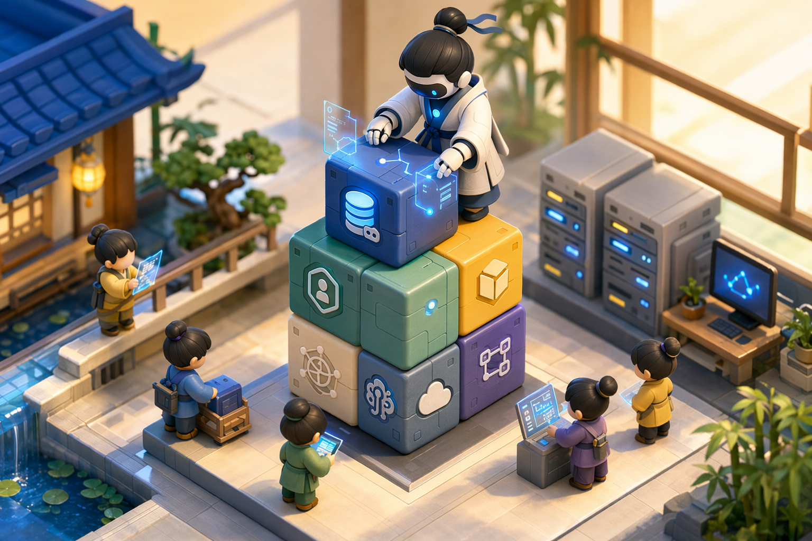
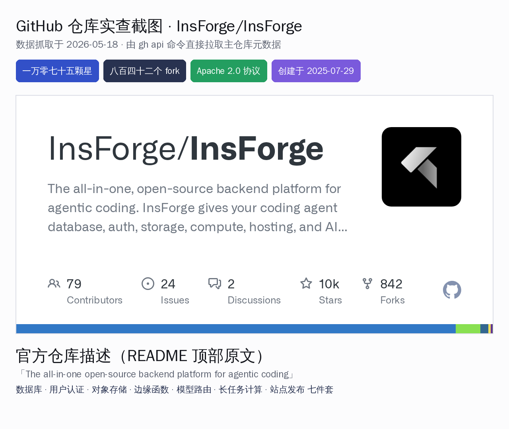
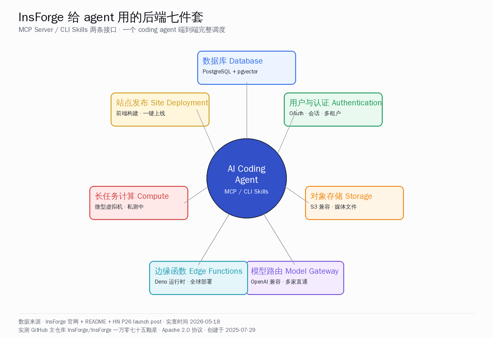
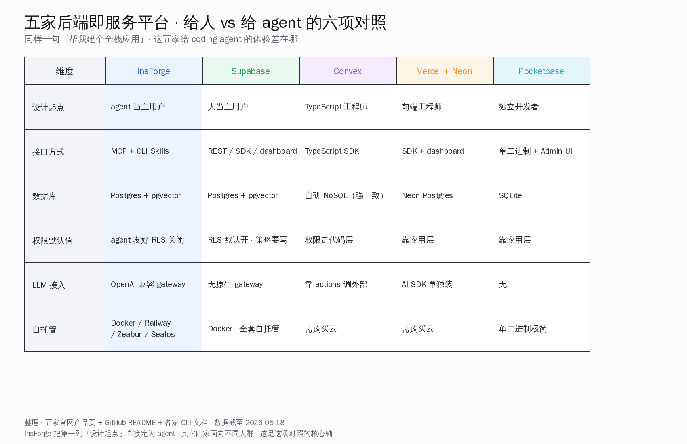
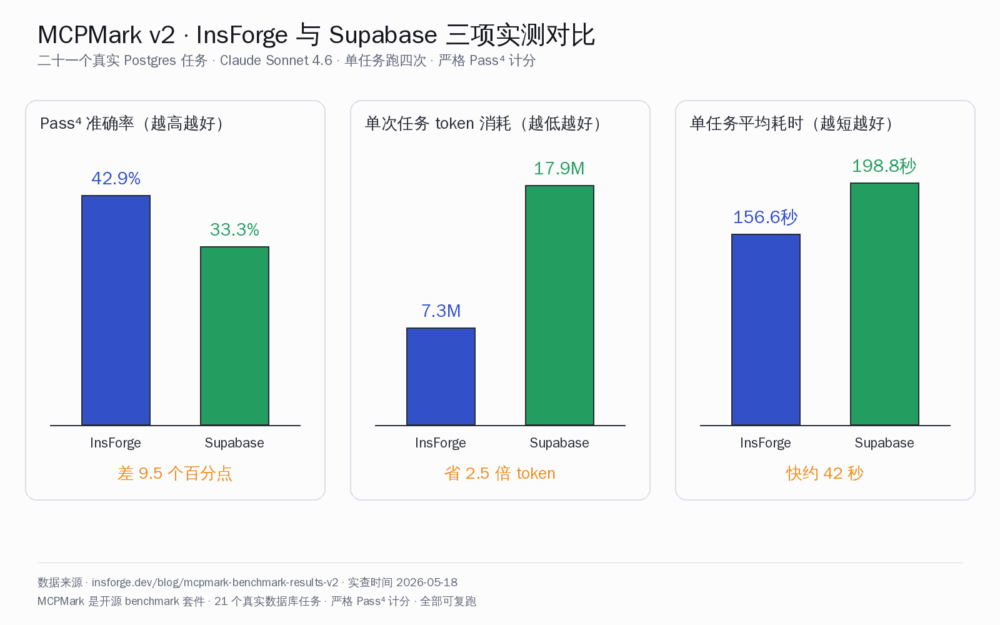

# Supabase 给人用，InsForge 给 agent 用



## 这件事的意思先说清楚

Y Combinator 春季 P26 这一批刚把名字晒出来，里头有个叫 InsForge 的小公司，仓库 GitHub 上是 `InsForge/InsForge`。它做的事情一句话能说完——**把 Supabase 那一整套后端即服务平台重做一遍，把主用户从『写代码的人』改成了『写代码的 agent』**。

这家公司创始人 Hang Huang（前亚马逊产品经理 + 耶鲁 MBA + 前职业英雄联盟选手）在五月十八号自己上 Hacker News 发了 Show HN 帖子，原话引用：

> An open-source Heroku for AI coding agents: a backend platform designed for coding agents to deploy, operate, and debug end-to-end.

帖子当天得分二十二、评论三条。HN 流量数字不算炸场，但 GitHub 仓库自己的数据很硬——**一万零七十五颗星、八百四十二个 fork、四十三个待办 issue、Apache 2.0 协议、TypeScript 主语言**，创建时间是 2025-07-29，到今天将近十个月。同期国内开发者每天打交道的 Supabase 那条赛道，被一个 P26 新批次的公司拿『agent 主用户』当差异化卖点撬动，本身就值得拆开看一看。

下面把可独立核实的数字、官方公告原话、HN P26 launch 帖讨论、七件套架构、五家 BaaS 横评、国产同档对位，一起摆出来。

## 可独立核实的关键数字与时间点

| 维度 | 数值 | 来源 |
| --- | --- | --- |
| YC 批次 | P26（春季 2026 批，原名 X26 / 现 P26） | YC 官网公司页 |
| 公司成立 | 2025 年 | YC 官网 + Tracxn |
| 总部 | 加州旧金山 | YC 官网 |
| 创始人 | Hang Huang（CEO）+ Tony Chang（CTO） | YC 官网 + LinkedIn |
| Hang Huang 背景 | 前亚马逊高级产品经理、耶鲁商学院 MBA、前职业 LoL 选手 | LinkedIn + 多家媒体报道 |
| Tony Chang 背景 | 前 Databricks 网络基础设施工程师，Meta 与亚马逊实习 | LinkedIn |
| 团队规模 | 6 人 | YC 官网 |
| 累计融资 | 一百五十万美元（来源：MindWorks Capital + Tracxn） | MindWorks Capital 官网 + Tracxn |
| GitHub 主仓库 | `InsForge/InsForge` | github.com/InsForge/InsForge |
| Stars | 10075 颗 | github.com/InsForge/InsForge（截至 2026-05-18） |
| Fork | 842 个 | 同上 |
| Open issues | 43 个 | 同上 |
| 许可证 | Apache 2.0 | 同上 |
| 仓库创建时间 | 2025-07-29 | 同上 |
| 主语言 | TypeScript | 同上 |
| 上架仓库主题 | ai, ai-agents, deno, embeddings, nextjs, oauth2, pgvector, postgresql, realtime, vectors, websockets | 同上 |
| HN 主帖 P26 launch | item 48181342，二十二分三条评论 | hn.algolia.com 实查 |
| HN 帖标题 | 「Show HN: InsForge – Open-source Heroku for coding agents」 | HN |
| 官方 MCPMark v2 benchmark | InsForge vs Supabase MCP 二十一个 Postgres 任务实测 | insforge.dev/blog/mcpmark-benchmark-results-v2 |
| Pass⁴ 准确率 | InsForge 42.86% / Supabase 33.33% | 同上，Claude Sonnet 4.6 |
| 单次任务 token | InsForge 7.3 M / Supabase 17.9 M | 同上 |
| 单任务平均耗时 | InsForge 156.6 秒 / Supabase 198.8 秒 | 同上 |
| 自托管部署一键按钮 | Docker / Railway / Zeabur / Sealos 四家 | 仓库 README |

数字相互交叉对得上。**一万颗星 + Apache 2.0 + agent 原生定位 + YC 当前批次**，这四件事拼起来已经说明它不是一个仓库挂在那里晾着的玩具项目，而是有人真在每天提 PR、有真用户在用的开源产品。



## 核心论点：差异化不在功能，在『谁是主用户』

把 InsForge 的产品页和 Supabase 的产品页摆到一起读，会发现一件事——**两家功能清单几乎一模一样**。Postgres 数据库、用户认证、对象存储、边缘函数、向量搜索、实时同步，每一项 Supabase 都有，InsForge 也都有。

那 InsForge 的差异化在哪？答案在产品页第一行——『The backend platform for AI-native developers』。再往下看官方 HN P26 launch 帖里 Hang Huang 自己写的解释段：

> We initially explored Model Context Protocols (MCPs) but found that tools load prematurely, payloads exceed reasonable token limits, and certain functionality remains unavailable. So we leverage agents' CLI proficiency through Skills training.

翻译过来就一句话——**Supabase 的 dashboard 是给人看的，agent 看不懂；Supabase 的 SDK 是给人调的，agent 调起来 token 爆掉**。所以 InsForge 把所有产品入口重做了一遍，让 coding agent 通过两条接口操作整个后端：

- **MCP Server**：自托管 + 云端都开，把后端能力当 tool 暴露给任何兼容 MCP 协议的 agent。
- **CLI + Skills**：仅云端，命令行配合 Skills 训练，让 Claude Code / Cursor / GitHub Copilot 这种 agent 直接在终端里调用。

『主用户是谁』这件事一变，所有产品决策的次序就跟着变了。Supabase 默认开 Row Level Security（行级安全策略），人写后端会主动写 policy，agent 不懂，第一次写库直接撞墙；InsForge 默认把 RLS 关掉，让 agent 顺利写进第一行，权限策略放到第二步引导生成。Supabase dashboard 上一项一项点配置，agent 看不到屏幕；InsForge 把每一项后端配置都做成 MCP tool 或 slash 命令，agent 在终端里一条命令搞定。



## 后端七件套架构逐项拆解

把 InsForge 主仓库的 README 主架构段（顶部 mermaid 图）逐项展开看：

### 数据库 Database

PostgreSQL 关系数据库加上 pgvector 向量扩展，这是 Supabase 路线的标配。InsForge 多干的两件事——一是给 agent 配了独立的 fetch-docs MCP 工具拉 schema 上下文，二是开了 backend branching 能力（受 Neon 启发）让 agent 试错时可以创建一条临时分支跑迁移，不破坏主库。

### 用户与认证 Authentication

OAuth、邮箱密码、会话管理，标准全套。区别在 agent 接口——agent 在 MCP 里能直接调一条命令把 GitHub OAuth 接入应用，不用人去 dashboard 点配置。

### 对象存储 Storage

S3 兼容对象存储，给媒体文件用。这一块和 Supabase Storage 几乎对齐，没有什么意外。

### 模型路由 Model Gateway

OpenAI 兼容的统一 API，背后挂多家 LLM 厂商。这是 Supabase 没有的能力——Supabase 你得自己装 LLM SDK，自己写路由代码；InsForge 给 agent 把这一层抽好了。

### 边缘函数 Edge Functions

基于 Deno 运行时的无服务器函数，全球边缘节点部署。这一块技术选型和 Supabase 一致（都用 Deno），但 agent 写函数 → 推送 → 部署的全套链路被收敛成几个 MCP 命令。

### 长任务计算 Compute（私测）

长跑容器服务。这是给那些『LLM 跑十分钟』『后台 batch 处理』场景准备的——边缘函数撑不住的长任务，就走这条 microVM 通道。目前还是私测状态。

### 站点发布 Site Deployment

前端构建 + 部署的端到端通道。agent 写完 Next.js 应用直接一条命令推上线，对位的是 Vercel 加 Netlify 那种『前端工程师常用动作』，被收敛进了同一个后端平台。

七件套之外还有几样小工具不展开细讲，但值得点名——**实时同步、定时任务、向量搜索、专属 debug agent、每日安全 / 性能巡检 advisor**。最后两项是 InsForge 自己加的——别家 BaaS 没有这种『每天有个 agent 帮你扫一遍配置』的服务，这是 agent 原生设计才会想到的功能。

## 把 InsForge 放进同档生态横评

把 InsForge 放到国内 vibe coding 开发者熟悉的同档产品里横评——Supabase、Convex、Vercel + Neon 组合、Pocketbase，六个维度一起看：



读这张表能看出几件事：

**第一**，五家在数据库选型上其实分两派——InsForge / Supabase / Vercel + Neon 走 Postgres + pgvector，Convex 自研 NoSQL 走强一致路线，Pocketbase 走 SQLite。前一派对国内开发者熟悉度最高，因为公司里大多数 OLTP 应用都跑 Postgres。

**第二**，接口设计是这五家最大的分歧点。InsForge 主推 MCP server + CLI Skills，是『写给 agent 看的』；Supabase 是 REST + 多语言 SDK + dashboard 三条腿走『写给人看的』；Convex 是把 SDK 当成主入口『写给 TypeScript 工程师看的』；Vercel + Neon 是 SDK + dashboard 拆开两家『写给前端工程师看的』；Pocketbase 是单二进制 + Admin UI『写给独立开发者看的』。**接口形态本身就在筛主用户群体**。

**第三**，自托管能力差距比想象中大。InsForge 一键部署进了四家云（Docker / Railway / Zeabur / Sealos），Supabase 也支持全套自托管，Convex 主要走云端，Vercel + Neon 也是主走云端，Pocketbase 单二进制本身就是为自托管而生。**对国内开发者来说，自托管能力 = 能否在国内服务器上完整跑起来**——这条线 InsForge 和 Pocketbase 走在前面，Supabase 紧跟。

**第四**，LLM 接入是 InsForge 唯一独家维度。其它四家都没把『OpenAI 兼容 gateway』作为内建能力——你想接 LLM 得自己装 SDK 写代码。这是 InsForge agent 原生定位带来的红利。

## 实查官方 MCPMark v2 benchmark

InsForge 自家放出来的 benchmark 数字写在 `insforge.dev/blog/mcpmark-benchmark-results-v2`，方法论按 MCPMark 开源套件来跑——**二十一个真实 Postgres 数据库任务，Claude Sonnet 4.6 模型，每个任务跑四次，严格 Pass⁴ 计分**。和 Supabase MCP 直接对比的数字如下：



- **Pass⁴ 准确率**：42.86% vs 33.33%，差 9.5 个百分点。
- **单次任务 token 消耗**：7.3 M vs 17.9 M，省 2.5 倍。
- **单任务平均耗时**：156.6 秒 vs 198.8 秒，快约 42 秒。

InsForge 官方对这组数字的解读原话：

> More capable models do not eliminate the need for structured backend context. They amplify the cost of not having it.

意思是——模型再强，缺乏结构化后端上下文一样吃亏，反而越强的模型在缺上下文时浪费的 token 越多。这句话用来回答『为什么要做 InsForge』可能比所有产品页文案都直接。

需要注意的一点——这套 benchmark 是 InsForge 自己跑的、对比对手是 Supabase MCP。第三方还没有跑同一套测试出来交叉验证。但 benchmark 用的 MCPMark 套件是开源的、二十一个任务是公开的、Claude Sonnet 4.6 是任何人都能调的，**理论上任何一家 BaaS 都能自己跑同一份测试反驳或印证**。这种『把刀架在自己脖子上等同行复测』的姿态，比单纯放出几条 marketing 数字诚意更足。

## 自托管实操：Docker compose 走完一遍

国内开发者最关心的问题永远是『能不能在自己服务器上完整跑起来』。InsForge README 给的自托管命令很短——

```bash
git clone https://github.com/InsForge/InsForge.git
cd insforge
cp .env.example .env
docker compose -f docker-compose.prod.yml up
```

跑完之后打开 `http://localhost:7130` 是 web 端 dashboard，里头给你引导 agent 怎么接 MCP server。验证 agent 接通的方式是给 Claude Code / Cursor 发这一句 prompt：

```
I'm using InsForge as my backend platform, call InsForge MCP's fetch-docs tool to learn about InsForge instructions.
```

agent 调 fetch-docs 工具拿到结构化文档之后，整个后端就在它视野内了——可以建表、可以加用户认证、可以传文件、可以部署函数。

多项目并行的能力 README 也写明——给每个项目准备一份独立 `.env` 文件、独立端口、独立 docker compose project 名，几个 InsForge 实例可以在同一台机器上互不干扰跑起来。**对国内多客户 ToB 团队来说这条挺关键**——一台开发机能同时挂三四个项目的后端，每个项目都有自己独立的数据库、对象存储、配置。

## 国内同档对位：扣子 / 千问 Agent / 灵光 / 蚂蚁百宝箱 / 火山方舟有没有 agent 原生 BaaS

把目光转回国内同档生态——『agent 原生的全栈后端即服务』这条路线，国内有没有同位作品？逐家扫一遍：

- **扣子 Coze**（字节跳动）：定位是 agent 编排平台，给 agent 提供工具调用、知识库、工作流，但**不提供数据库 / 对象存储 / 边缘函数 / 站点发布这种基础后端**。开发者要自己搭后端再接进来。
- **千问 Agent / 灵光 Agent**（阿里）：同上，agent 框架层 + 模型层做得好，但不向下覆盖到 BaaS。
- **蚂蚁百宝箱**（蚂蚁集团）：偏 agent 应用市场 + 编排能力，不是 BaaS。
- **火山方舟**（字节跳动）：模型 API 平台 + 部分 agent 能力，重心在 LLM 路由和推理性能，不做后端组件。
- **百度千帆**（百度）：模型平台 + agent 工具链，方向类似火山方舟。

国内现状很清晰——**Agent 编排层 / 模型路由层国内厂商做得很扎实，但 agent 原生的 BaaS 这条线目前是空白**。这恰好是 InsForge 想吃下来的位置。

对国内 vibe coding 创业者来说，这给了两条可走的路：一条是直接拿 InsForge 自托管，Apache 2.0 协议给得很爽，搬到国内云上就能跑；另一条是看清楚 InsForge 的产品形态——MCP server + CLI Skills + 七件套 + agent 友好默认值——然后在国内云厂商生态里自己搭一套相似形态的方案，把数据库 / 认证 / 对象存储 / 模型路由 / 边缘函数 / 站点发布拼起来。

## 这场 P26 押注里藏着的工程提示

把这件事抽象一层看——**InsForge 这一波给国内开发者的真正提示，不是『有一个新 BaaS 出来了』，而是『后端组件的设计起点正在从人转向 agent』**。

过去十几年云厂商的 console、SaaS 产品的 dashboard、开发者工具的 wizard，全部默认主用户是『一个能看屏幕、能点鼠标、能写代码的人』。这套交互范式在 2026 年正在被 agent-first 的产品起点慢慢替换——MCP server 暴露能力代替 dashboard 引导、CLI Skills 训练代替文档检索、structured context 代替 free-form prompt、backend branching 代替灰度发布、debug agent 代替运维巡检。

国内开发者真正能从 InsForge 这件事拿走的，不是它的代码（虽然 Apache 2.0 完全可以 fork），而是它给出来的产品次序——**每加一个后端能力，先问一句『这个能力 agent 怎么调？』，再问『人怎么调？』**。两个问题的次序调换，整个产品的形态会变得不一样。

P26 这批 YC 公司里押的明显有几条主线——agent 原生、开源底座、infra 重做。InsForge 是这条交叉地带上跑出来的样本之一。看完它的代码、读完它的 benchmark、跑完它的 docker compose，下一步问题就变成了——**国内有没有团队愿意把这件事在本土云厂商生态里也做一遍**。答案可能就在写这篇文章的人和读这篇文章的人之间。
