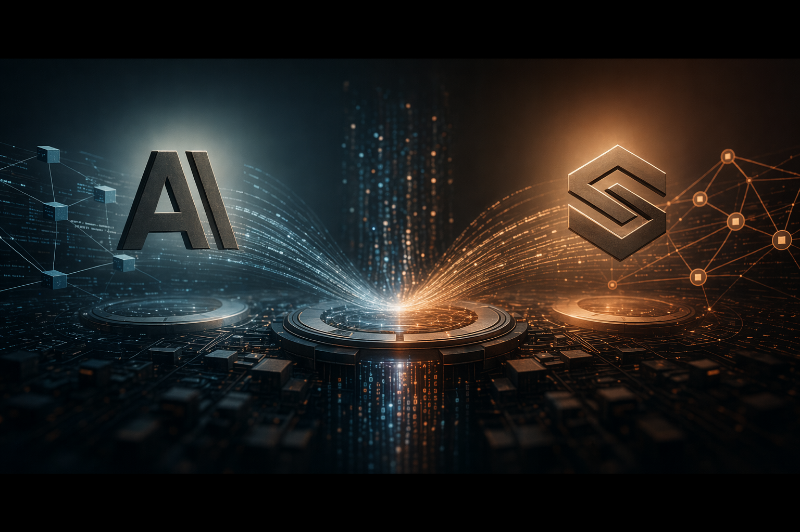
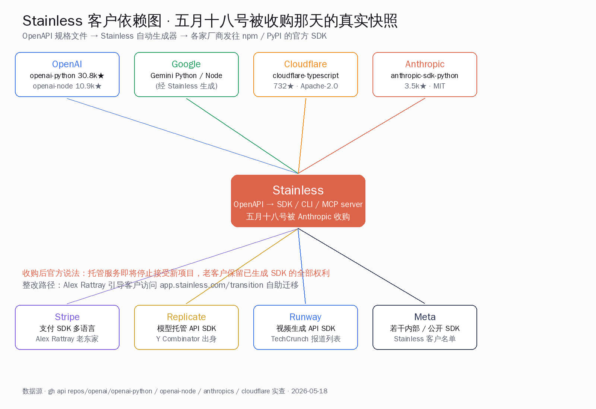
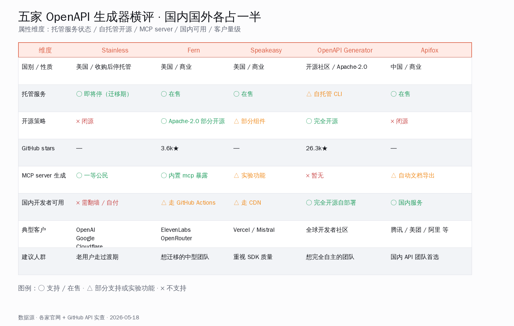
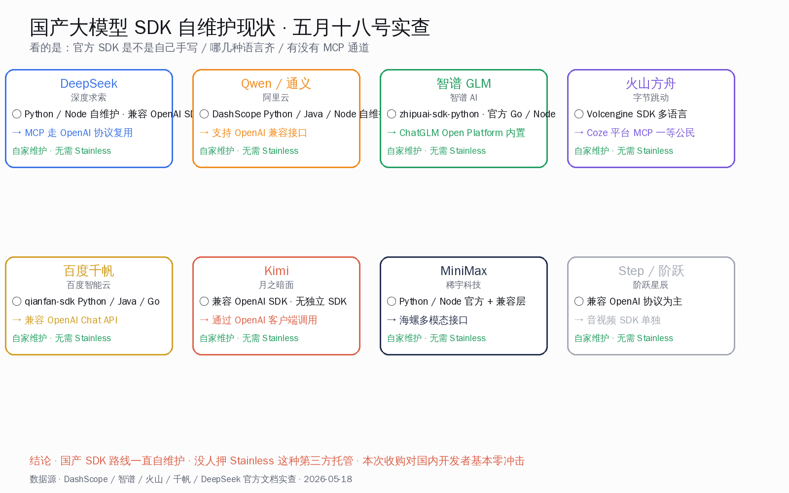

# Anthropic 收购 Stainless：SDK 生成器易主

## 这场收购的工程含义

OpenAI 官方的 `openai-python`、`openai-node`，Google 的 Gemini SDK，Cloudflare 的 TypeScript 客户端，Stripe 的多语言支付 SDK——这几家平时彼此并不算朋友的公司，过去四年其实共用同一台底层代码生成器：纽约创业公司 Stainless。五月十八号星期一，Anthropic 把 Stainless 整家收了。The Information 报道金额三亿美元以上，两边都没正面证实。

工程含义只有一句话：一条原本服务全行业的 SDK 工厂流水线，今天起被其中一家头部模型公司接管，并明确要停掉对外托管服务。

下面把可独立核实的数字、双方原话、HN 当天讨论、五家替代品横评、国产 SDK 真实底盘，全部摆到桌上。

## 可独立核实的关键数字与时间点

| 维度 | 数值 | 来源 |
| --- | --- | --- |
| 收购宣告时间 | 2026-05-18 周一 | Anthropic 官网新闻页 |
| 收购金额 | The Information 报道三亿美元以上（未官方证实） | TechCrunch 引述 The Information |
| Stainless 成立年份 | 2022 年 | TechCrunch 报道 |
| Stainless 创始人 | Alex Rattray，前 Stripe 工程师 | TechCrunch、Stainless 官方公告 |
| Stainless 总部 | 纽约 | TechCrunch |
| Stainless 投资方 | Sequoia Capital、Andreessen Horowitz | TechCrunch |
| Stainless 公开客户 | Anthropic、OpenAI、Google、Cloudflare、Replicate、Runway 等 | TechCrunch、Stainless 官网客户列表 |
| 支持的 SDK 语言 | TypeScript、Python、Go、Java、Kotlin、Ruby、Terraform、C#、PHP | Stainless 官网产品页 |
| Anthropic 公告关键动作 | 关停 Stainless 全部托管服务，包括 SDK 生成器本身 | Anthropic 官网新闻页 |
| 老客户保留权利 | 已生成的 SDK 所有权与修改权完整保留 | Anthropic 新闻页 |
| 客户自助迁移入口 | app.stainless.com/transition | Alex Rattray 五月十五号 Stainless 官方博客 |
| Hacker News 主帖 | item 48182281，「Anthropic acquires Stainless」 | hn.algolia.com 实查 |
| HN 主帖热度 | 212 分、153 条评论（五月十八号当天） | news.ycombinator.com |
| Stainless 官方公告 | 五月十五号 Alex Rattray 发文「Stainless is joining Anthropic」 | stainless.com/blog |
| Anthropic 平台工程主管 | Katelyn Lesse | Anthropic 新闻页署名 |
| Anthropic 官方 Python SDK 体量 | 三千四百七十五颗星、MIT 协议 | github.com/anthropics/anthropic-sdk-python |
| OpenAI 官方 Python SDK 体量 | 三万七百八十九颗星、Apache 2.0 | github.com/openai/openai-python |
| Cloudflare TypeScript SDK 体量 | 七百三十二颗星、Apache 2.0 | github.com/cloudflare/cloudflare-typescript |
| Fern 开源仓库体量 | 三千六百一十五颗星、Apache 2.0 | github.com/fern-api/fern |
| OpenAPI Generator 体量 | 两万六千两百五十四颗星 | github.com/OpenAPITools/openapi-generator |

数字相互交叉口径一致。关停托管服务这一条由 Anthropic 官网正面写出，Alex Rattray 在 Stainless 博客补充口径——「从今天开始，新注册、新项目和新 SDK 将不可用」。

## 双方原话挑出来，看口径有没有错位

Anthropic 平台工程负责人 Katelyn Lesse 在官网公告里给了两句话：

> Stainless has shaped how developers experience the Claude API since the start.
> Agents are only as useful as what they can connect to. We're excited to bring the Stainless team into Anthropic.

Stainless 创始人 Alex Rattray 在官网公告 + 自家博客里给了五句话：

> SDKs deserve as much care as the APIs they wrap.
> Stainless is joining Anthropic to accelerate our mission to improve developer experience and the connections between agents and external systems.
> Great APIs are more essential now than ever.
> There's no better place for the Stainless team to build the future of internet software.
> If APIs are the dendrites of the Internet, you all made the world a little smarter.

两边口径整体对得上。Anthropic 用了「wind down」这种硬词；Stainless 博客措辞更柔——「新注册、新项目和新 SDK 将不可用」。但两边都明确同一件事：老客户已生成的 SDK 完整归自己。

## Hacker News 讨论区当天在讲什么

主帖 [item 48182281](https://news.ycombinator.com/item?id=48182281) 五月十八号当天 212 分、153 条评论，进了首页前列。挑出讨论最集中的几条 verbatim 原文：

> drewda: this is essentially an acquihire — they're winding down all hosted Stainless products, including our SDK generator.

> atomicthumbs: Hundreds of companies rely on Stainless to generate SDKs... not anymore lol.

> paulddraper: WILD juxtaposition of these two claims in the same announcement.

> pplante: I feel like we are seeing agentic coding tools morph into walled gardens.

> kristjansson: > Anthropic > OpenAI > ??

> dalbaugh: I'm really disappointed that such a great service is getting taken off the market.

讨论区两类声音占比最高：一类工程实操向，操心 OpenAI 的 SDK 怎么办、切到 Speakeasy 风格会不会变；另一类基建版图向，把这次收购和 Anthropic 此前的动作连起来看「在系统性收基建」。

HN 用户还引述了 Stainless 迁移页（app.stainless.com/transition）的说法——现有客户可以拿一份 source-available 的生成器在本地继续用，官方托管彻底结束。这与 Anthropic 公告里「保留完整修改权」的口径吻合。

## OpenAPI 生成器横评：替代品都在哪

把 Stainless 之外的同档生成器拉到一张表里看：

文字版要点：

- **Stainless**：美国闭源，即将停掉托管，老客户走过渡期；MCP server 一等公民，但能用窗口只剩几个月；
- **Fern**（buildwithfern.com）：美国商业，核心组件 Apache 2.0 开源仓库三千六百颗星，主页明确挂出「Migrate from Stainless today」入口，ElevenLabs、OpenRouter、Webflow、Deepgram 都在用，MCP server 内置；
- **Speakeasy**：美国商业，强项是 SDK 风格更接近手写，Vercel、Mistral 等家在用，MCP 暴露是实验功能；
- **OpenAPI Generator**：纯开源社区项目，Apache 2.0，两万六千颗星，CLI 完全自托管，缺点是产物风格更工程化，MCP 暂无原生支持；
- **Apifox**：国产 API 工程平台，腾讯、美团、阿里等团队在用，自动文档导出和 mock server 是强项，MCP 通道走文档导出方向。

实操判断：中型 API 团队找替代，Fern 是公开提了迁移入口的最直接候选；想完全自主可控，OpenAPI Generator 永远兜底；想留在中文友好生态，Apifox 顺手。

## OpenAI、Google、Cloudflare 这三家具体怎么办

这三家是收购里最微妙的客户——既是 Stainless 用户，又或多或少是 Anthropic 竞品：

- **OpenAI**：`openai-python` 三万颗星、`openai-node` 一万颗星，都仍在 OpenAI 官方组织名下，最近一次推送就在五月十八号当天。短期 SDK 不会断更新。中期两条路——把 source-available 生成器接到自家 CI 自维护，或切换到 Fern、Speakeasy。SDK 体量大、定制深，第一条路概率更高。
- **Google**：Gemini SDK 同样是 Stainless 生成。Google 内部本来就有完整 API 工具栈（gRPC、Protocol Buffers），Gemini SDK 用 Stainless 更像为了和 OpenAI 风格对齐方便开发者迁移。切回自家工具链成本最低。
- **Cloudflare**：cloudflare-typescript 七百多颗星，五月十八号还在推送。Cloudflare 有 Workers AI 这条线，是 Anthropic 在企业 AI 推理市场的对手，紧迫度三家里最高。大概率自研或切到 Fern。

工程总结：三家手上的 SDK 仍属自己，托管断供之前还有缓冲期，紧迫度按 Cloudflare > OpenAI > Google 排序——这恰好也是 HN 讨论区情绪强度的排序。

## 国产 SDK 工程现状与对比

把这次收购和国内 AI 基建联系起来看，结论反高潮：**对国内开发者基本零冲击**。国产模型厂商一直就没押第三方托管 SDK 工厂这条路。

挨家看一眼：DeepSeek 自维护 Python、Node SDK + 兼容 OpenAI；通义千问的 DashScope 自维护 Python、Java、Node 三语言 + OpenAI 兼容接口；智谱 zhipuai-sdk-python 完全自研，外加 Go、Node SDK；火山方舟 Volcengine SDK 多语言齐，Coze 把 MCP 作一等公民；百度千帆 qianfan-sdk 覆盖 Python、Java、Go；Kimi、MiniMax、阶跃星辰大多走 OpenAI 协议兼容或自家 + 兼容层并行。

为什么国产线没押 Stainless？三个工程现实：国内云厂家手上都有现成的 API 网关、文档系统、SDK 模板，自研成本不高；大量国产模型走 OpenAI 协议兼容，开发者改 base_url 就能跑；Stainless 服务一直需要海外卡 + 海外账号，对国内团队接入摩擦本身不小。

阴差阳错，这套「不依赖第三方 SDK 工厂」的格局，让国内开发者今天看新闻可以非常从容——没人需要做迁移规划，没人手上有「Stainless 生成的官方 SDK」这种烫手山芋。

## MCP server 这条线为什么 Anthropic 一定要拿下

抽到产品战略层看：Anthropic 真正在乎的不只是 SDK 生成器，而是 **MCP server 的批量供给能力**。

MCP（Model Context Protocol）是 Anthropic 去年提出的 agent 接外部系统协议，Claude Desktop、Cursor、Zed、Continue 都在跟。MCP server 的本质是把一个外部 API（Notion、Linear、GitHub、Sentry 等）封成 agent 能调的工具——Stainless 之前正是把 OpenAPI 规格自动生成 MCP server 的最成熟工厂。

收购后两条直接含义：Claude 平台对接外部系统会有结构性提速，可选 MCP server 数量增长加速；这条「OpenAPI 转 MCP」最方便的生产线只对 Claude 平台开放，其他模型用户得自己找 Fern、Speakeasy 或写自研脚本——但这本来就是 agent 圈常态。Katelyn Lesse 那句「Agents are only as useful as what they can connect to」就是这条战略的官方表述。

## 国内 AI 开发者怎么用：实际建议

- 用 OpenAI 或 Cloudflare 官方 SDK 调他们家服务的，短期继续用，跟着升版本就行；
- 自己做对外 API 服务、想自动产 SDK + MCP server，国内首选 Apifox（中文体验顺）；想要更现代风格 SDK，可试 Fern 开源版本（Apache 2.0、自托管 OK）；想完全自主可控，OpenAPI Generator 永远兜底；
- 做 agent 应用的，无论后端选 Claude 还是国产，MCP server 都是值得提前布的位——国产生态里 Coze 2.5、千问 agent 框架、智谱 GLM-Realtime 都在快速跟进；
- 产品对外提供 API 的，建议把 OpenAPI 规格文档维护好——不管未来选哪家生成器，规格文件本身永远是资产。

国产生态过去常被贴「重复造轮子」标签，今天看反倒是「事事自己维护一份」的保守路线让国内开发者免疫了这次基建震荡。这是个值得记下的工程经验。

## 收尾：开发者基建的常态

Anthropic 收 Stainless 放到更长时间线看不是孤立事件。过去半年，AI 巨头开始系统性地把基建组件吃进自家版图——JavaScript runtime 方向投了 Bun，SDK 生成器选了 Stainless，文档协议选了 MCP。这是把 agent 生态从「模型层」往「平台层」推的关键动作。

对国内开发者来说，这意味着两件事：全球 AI 基建会越来越像一个个垂直整合的「平台」而不是统一的「协议」；国产生态那种「自家事自己办」的传统，过去常被低估，今天看反而是从容的底色。

明天醒来，OpenAI 的 SDK 仍能 `pip install`，Cloudflare 的 TypeScript 客户端仍能 `npm install`，国产模型的 SDK 仍像往常一样在阿里云、火山、千帆的文档站可下。这场三亿美元的收购，留给开发者的不是焦虑，是一段值得仔细看的基建路线注脚。
