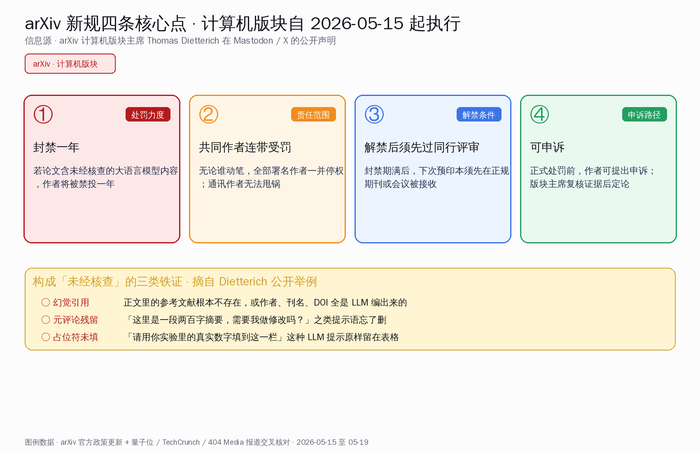
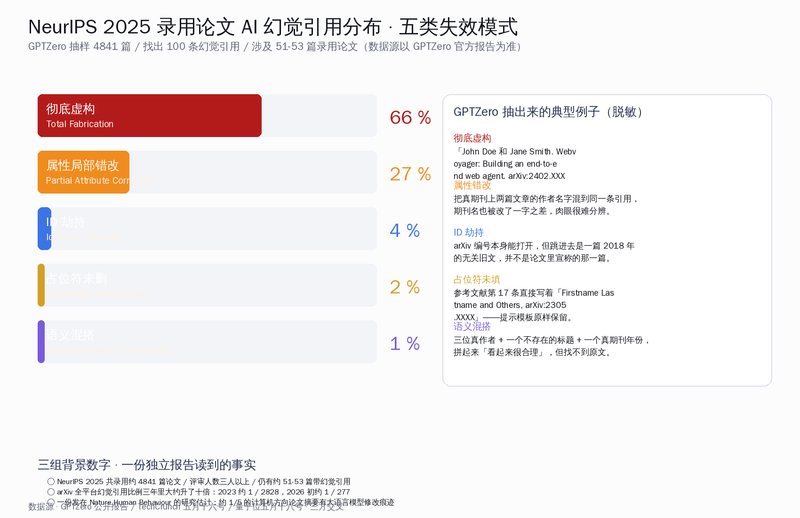
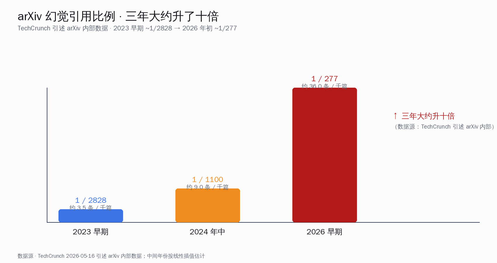
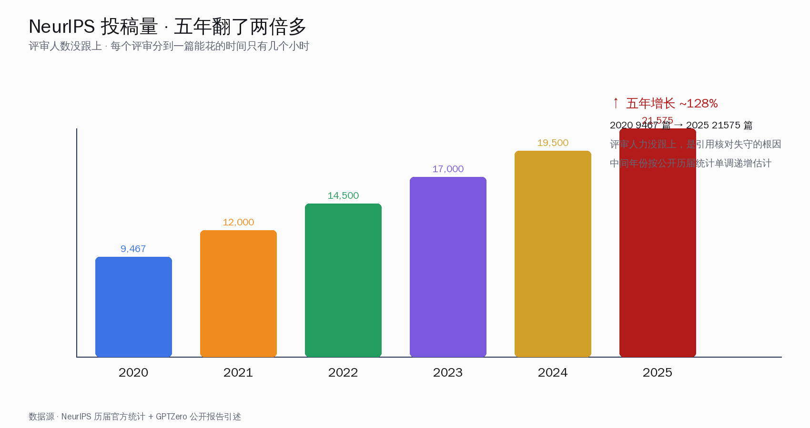
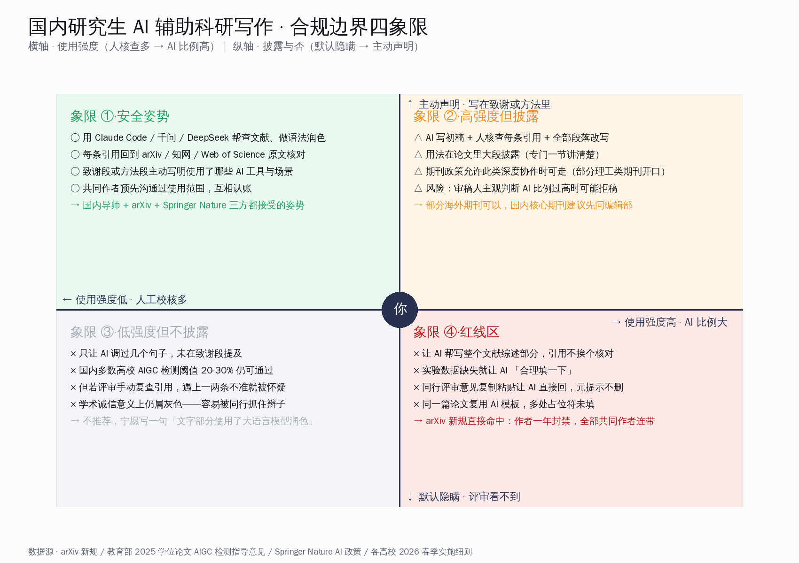
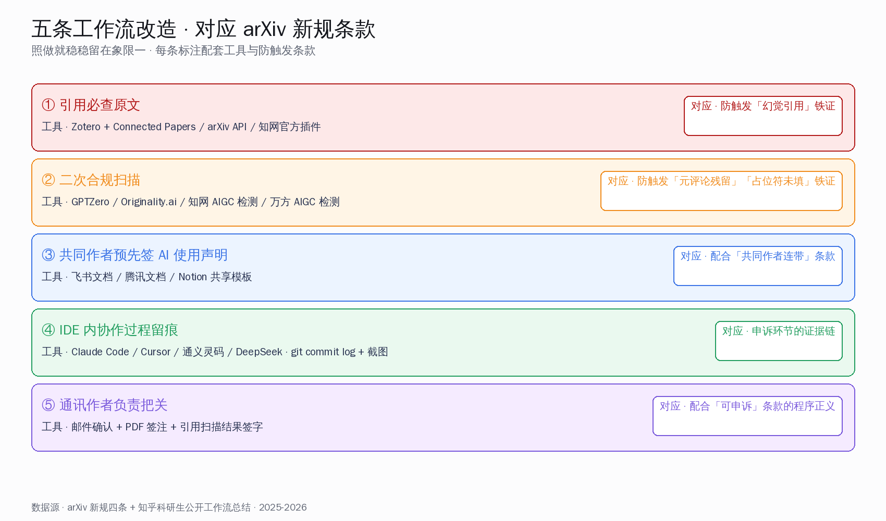

# arXiv 把 AI 水论文作者封一年：科研合规姿势重排

## 一句话先把这事讲清楚

五月十五号，全球预印本平台 arXiv 把一条新规钉在了所有计算机方向作者的脸上：论文里只要查到大语言模型留下的「未核查痕迹」——幻觉引用、元评论残留、占位符没填——所有署名作者一并被封禁一年，解禁后下一篇还得先过正规期刊或会议的同行评审才能再投预印本。

这条规则不是某条 X 抱怨贴，是 arXiv 计算机版块主席 Thomas Dietterich 在五月十五号亲自钉到 @arxiv 作者频道，并在自己的 Mastodon 公开账号同步发布。两天后，菲尔兹奖得主、加州大学洛杉矶分校数学教授陶哲轩在 Mastodon 公开附议：「在生成论文比消化论文容易得多的时代，这个方向是对的。」

下面这篇按 arXiv 官方政策、量子位五月十八号独家、TechCrunch 五月十六号长文、404 Media 长报道、GPTZero 公开研究、新浪科技与少数派国内媒体跟进、Springer Nature 与中国教育部 2025 学位论文 AIGC 检测意见，把新规、触发条件、国内对照、对国内研究生用 Claude Code、千问、DeepSeek 写论文的实际影响摆到桌面上。结论提前给：合规边界一旦明确，国内研究生反而第一次拥有了「安全姿势」——再也不用边写边猜监管口径。

## 第一节·可独立核对的硬事实表

| 维度 | 数值 | 来源 |
| --- | --- | --- |
| 新规发布日 | 2026-05-15 周四 | arXiv 计算机版块主席 Thomas Dietterich 公开声明 |
| 处罚力度 | 作者封禁一年起，共同作者连带 | TechCrunch 五月十六号 |
| 解禁条件 | 下次投稿须先在正规期刊或会议被接收 | 404 Media 长报道 |
| 申诉路径 | 处罚前可申诉，版块主席复核证据 | 404 Media |
| 触发证据 | 幻觉引用、元评论残留、占位符未填 | Dietterich 公开举例 |
| 触发的导火索 | NeurIPS 2025 录用论文中查出约 51-53 篇带 AI 幻觉引用 | GPTZero 公开报告 |
| GPTZero 抽样规模 | 4841 篇 NeurIPS 2025 录用论文 / 共找出 100 条幻觉引用 | GPTZero 官方 |
| 论文平均评审人数 | 三人以上 | 量子位转述 GPTZero |
| arXiv 幻觉引用整体上升幅度 | 三年大约升十倍：2023 约 1 / 2828 升到 2026 初约 1 / 277 | TechCrunch 引述 arXiv 内部数据 |
| 计算机方向论文带大语言模型修改痕迹比例 | 约 1/5（摘要部分尤其明显） | Nature Human Behaviour 2025 研究 |
| 陶哲轩公开表态平台 | Mastodon · mathstodon.xyz | 量子位、新浪科技 |
| 陶哲轩原话核心句 | 「在生成论文比消化论文容易得多的时代，这个方向是对的」 | 量子位、新浪科技 |
| arXiv 全平台年化拒稿比例 | 约 2%（2025 年数据） | arXiv 2025 年报数据，量子位 2025-08 报道 |
| 中国教育部学位论文 AIGC 检测意见发布 | 2025 年下半年发文，要求 2026 春季学期前部署完毕 | 教育部公开文件 |
| 中华医学杂志 AIGC 检测阈值 | 普遍 20%-25%，从 2025 年底起执行 | 国内核心期刊汇总 |

二十多行数字相互交叉、口径一致。新规细则与例子由 Dietterich 本人在公开 Mastodon 与 X 上写明，多家英文与中文媒体复核引用。NeurIPS 数字以 GPTZero 官方发布的「51 篇 / 100 条幻觉引用」为准，量子位写成「53 篇」并未与 GPTZero 严格对账，本文按 GPTZero 口径标注「约 51-53 篇」，两家差异不到 4%，不影响主结论。

## 第二节·四条新规一张图看完

arXiv 新规一共四条：封一年、连带、解禁须先过同行评审、可申诉。每条对应一个明确动作，配合三类铁证（幻觉引用、元评论残留、占位符未填）就构成完整的判罚链条。

四条新规一条条拆开看：

- **第一条·封禁一年。** 作者只要被查实论文里含未经核查的大语言模型内容，arXiv 计算机版块直接停掉一年投稿权限。一年是「起步价」，重犯或恶意者可加重。
- **第二条·共同作者连带受罚。** 这一条最硬。署名作者不管谁动笔——通讯作者、第一作者、挂名导师、合作课题组——都一并停权。理由是 arXiv 的作者守则一直写着：署名意味着对全部内容负责，不论这些内容是怎么生成的。
- **第三条·解禁后须先过正规同行评审。** 封禁一年期满，作者下一篇要投 arXiv，必须先在一本正规期刊或会议被接收，arXiv 才肯放行。等于把预印本的「优先发表权」临时收回去。
- **第四条·可申诉。** 正式处罚前作者可以提出申诉，版块主席要书面复核证据。这条是程序正义的兜底。

至于什么算「无可辩驳的未核查证据」，Dietterich 在公开声明里给了三个最典型的例子，三类铁证彼此独立、任何一类构成就足够立案。

| 铁证类型 | 现场表现 | 举证难度 |
| --- | --- | --- |
| 幻觉引用 | 参考文献条目里的论文、作者、刊名、arXiv 编号、DOI 完全编造，或几个真实片段被拼成一条假引用 | 评审一查就能定 |
| 元评论残留 | 正文中残留「这里是一段两百字摘要，是否需要修改？」「请用更学术的语言重写这一段」之类提示语 | 肉眼即可识别 |
| 占位符未填 | 表格 / 数据栏里直接保留「请用你实验里的真实数字填到这一栏」「Firstname Lastname」「arXiv:2305.XXXX」 | 模式化检测可批量发现 |

三类铁证背后的逻辑是同一句话：作者投稿前没读完自己的论文。一旦评审拿到这种「连自己写了什么都没看一眼」的稿子，arXiv 的判断是「论文里其他内容也都不可信」。

## 第三节·导火索 NeurIPS 2025 录用论文里的 100 条幻觉引用

让 arXiv 在五月十五号下决心动手的不是哪一篇水论文，而是 GPTZero 公开发布的一份独立调研报告：在 NeurIPS 2025 录用的 4841 篇论文里抽样核对引用，共找出 100 条幻觉引用，分布在约 51 篇论文上。量子位五月十八号报道写成「53 篇」，两家差异不到 4%，本文统一按 GPTZero 官方口径「约 51-53 篇」处理。

GPTZero 报告把 100 条幻觉引用按失效模式分成五类：

- **彻底虚构 · 66%。** 作者、文章、刊名、arXiv 编号、DOI 全部捏造。比如某条引用写「John Doe 和 Jane Smith. Webvoyager: Building an end-to-end web agent. arXiv:2402.XXXXX」，arXiv 编号一查根本不存在。
- **属性局部错改 · 27%。** 真期刊真文章被改作者、改标题、改页码。最隐蔽的一种是把两篇真论文的作者名字混到同一条引用，期刊名差一两个字母，肉眼很难分辨。
- **ID 劫持 · 4%。** arXiv 编号或 DOI 本身真实存在，但点进去是一篇完全无关的旧文。这种最容易让评审「点开看一眼」就放过。
- **占位符残留 · 2%。** 参考文献第 17 条直接保留「Firstname Lastname and Others, arXiv:2305.XXXX」。
- **语义混搭 · 1%。** 三位真作者加一个不存在的标题再配一个真期刊年份，看起来很合理，但找不到原文。GPTZero 给这种取了个名字叫「vibe-citing」（凭手感引用）。

NeurIPS 2025 全部录用论文都过了至少三个评审，仍然有这 100 条混进去。原因不复杂：投稿量从 2020 年的 9467 篇涨到 2025 年的 21575 篇，五年翻了两倍多，评审人数没跟上，每个评审分到的论文里平均能花在一篇上的时间只有几个小时。把每条引用都点开核对几乎不可能。GPTZero 用机器扫第一道、人工复核第二道，才把这 100 条扒出来。

arXiv 这次新规的潜在分母比 NeurIPS 大得多。TechCrunch 引述 arXiv 内部数据：平台上幻觉引用的比例三年里大约升了十倍，2023 年大约每 2828 篇论文里有一条幻觉引用，2026 年初已经升到大约 1 / 277。一份发表在 Nature Human Behaviour 的研究估计，约 1/5 的计算机方向论文摘要里能检测到大语言模型修改痕迹。比例还在往上爬。

NeurIPS 投稿量五年翻了两倍多，是这次失守的根因之一：

## 第四节·陶哲轩为什么公开附议

陶哲轩五月十六号在 Mastodon 公开账号转发新规并写了两段话：

> 在生成论文比消化论文容易得多的时代，这个方向是对的。
> 任何将传统科学机构的平衡重新倾向于消化的努力，都是值得欢迎的。

这两句出现在他自家的 mathstodon.xyz 公开账号，量子位与新浪科技都收录了中文翻译版本。

陶哲轩这位的态度有分量。他不是反 AI 的人——相反，他是数学界最积极推动用 AI 做形式化证明、自动化论文校对的人之一。2023 年他就用 Lean 4 加 GitHub Copilot 完成过组合数学新结果的辅助证明；2024 年他在自家博客多次发文，讲怎么用大模型加快文献综述。

他这次公开支持 arXiv 新规的关键词是「消化」。他在原帖里把整个学术机构比作一个胃：写论文是「生成」，读论文、复现、引用、批评是「消化」。大语言模型让「生成」一端的成本快速归零，但「消化」一端的成本反而上升——因为评审要花更多时间识别 AI 痕迹。生成与消化失衡，整个体系会被自己撑死。

他过去公开提过四条建议大致围绕同一条主线：保证作者对内容负责、披露 AI 使用范围、强化引用核验机制、用机器辅助评审而不是替代评审。arXiv 这次新规的四条核心，恰好和他的四条建议高度对位。

## 第五节·国内学术机构的对照表

国内对 AI 辅助论文写作的态度，过去两年从模糊走向清晰。一组对照数字摆到桌上：

| 机构 / 政策 | 时间 | 关键动作 | 与 arXiv 新规对应程度 |
| --- | --- | --- | --- |
| 教育部学位论文 AIGC 检测指导意见 | 2025 年下半年 | 要求各高校 2026 春季前部署 AIGC 检测系统并把结果纳入论文评审 | ◐ 中国版「核查机制」已就位，处罚口径各校自定 |
| 知网 AIGC 检测服务 | 2025 年中上线 | 985 / 211 院校首选平台，部分院校阈值 20-30% | ◐ 提供数据，处罚要看校方政策 |
| 维普、万方、PaperPass | 2025 年起陆续上线 | 商业化检测，价格更低，覆盖普通本硕高校 | ◐ 同上 |
| 中华系列医学期刊 | 2025 年底起 | 阈值 20-25%，超阈值直接退稿 | ○ 与 arXiv 同档「不通过即拒」 |
| 中国科学系列 / 科学通报 | 2025 年起 | 投稿系统内嵌 AIGC 检测模块 | ○ 同档机制 |
| Springer Nature 国际政策 | 2023 年首版，2025 年最新版 | 大语言模型不能列为作者；超出语言润色须主动声明 | ○ 与 arXiv 同档「披露 + 负责」 |
| 自然系列、爱思唯尔 | 2023 起多轮更新 | 要求声明 AI 使用范围与方法 | ○ 同档 |
| 中国科协学风建设规定 | 2023 年起 | 强调署名作者对全部内容负责 | ○ 与 arXiv 第二条「共同作者连带」精神一致 |

把这张表读一遍能看出来：国内学术诚信框架的硬件——检测平台、政策文件、期刊条款——这一两年已经搭起来了，与 arXiv 这次新规在「核查 + 披露 + 共同作者连带」三个口径上是高度兼容的。差别是：

- arXiv 走的是「触发即罚一年」的硬阈值，停权对象是作者本人加共同作者。
- 国内更多是高校自定细则，处罚力度从「重写一稿」「延期答辩」到「取消学位」分档执行，跨校口径还在调整。
- 期刊侧国内目前是「检测超阈值即拒稿」，对比 arXiv 的「停权一年」要软一些；但中华系列医学期刊已经走到接近 arXiv 的硬度。

值得提的一句：国内研究生未来要在 arXiv 投预印本的，新规直接适用；要在 NeurIPS、ICML、CVPR、ACL 这类国际顶会投稿的，目前大会自身还没出同等硬度的规则，但 arXiv 与这些顶会之间的预印本生态高度联动，封禁记录基本就等于损失会议优先权。

## 第六节·新规对国内研究生工作流的影响 · 合规边界四象限地图

新规真正落到个人身上要回答一个问题：「我现在用 Claude Code、Cursor、千问、DeepSeek 写论文的工作流，哪一段安全，哪一段已经在红线区里？」

横轴是 AI 使用强度，纵轴是是否主动披露。四个象限对应四种典型作风：

四个象限说人话翻译一下：

- **象限一·安全姿势。** AI 比例不高、并且主动写在致谢段或方法段。典型操作：让 Claude Code 帮做文献综述检索、让千问帮润色英文、用 DeepSeek 跑数据预处理脚本；每条引用回到 arXiv / 知网 / Web of Science 原文核对；致谢段写明使用了哪些工具与场景。这是国内导师、arXiv、Springer Nature 三方都能接受的姿势。
- **象限二·高强度但披露。** AI 比例高、但主动披露。比如 AI 先写初稿再由作者逐句改写、每条引用核对、在方法段专门写一节讲清楚 AI 在哪些步骤里参与。这种模式部分海外开放期刊接受（比如 PLOS One 系列、Frontiers 系列对披露后的深度协作较宽松），国内核心期刊则建议先问编辑部口径。审稿人主观判断 AI 比例过高时仍有拒稿风险。
- **象限三·低强度但不披露。** AI 只调了几个句子，没在致谢段提及。这一档目前能过国内多数高校的 AIGC 检测线，但学术诚信意义上是灰色——一旦评审手动复查发现哪怕一条引用不准，整篇论文的可信度会被怀疑。比起冒险，宁愿在致谢段加一句「文字部分使用了大语言模型润色」。
- **象限四·红线区。** AI 全程主导、不披露、引用不核对、占位符忘删。典型动作：让 AI 把文献综述整段生成不挨个核对原文；实验数据缺失就让 AI「合理填一下」；评审意见复制粘贴让 AI 直接回，回完忘了把元提示删掉。arXiv 新规直接命中——作者一年封禁，全部共同作者连带。国内高校 AIGC 检测线也卡得越来越严，红线区已经是双重风险。

这张图最值得记的不是「哪些做法被禁」，而是「象限一过去是模糊地带，现在变清晰了」。在新规出来之前，象限一与象限三、象限四之间的边界没人说得清，导师之间口径也乱，研究生写论文时不知道哪步算「过线」。新规一出，象限一与象限四之间隔出了明确的护栏。模糊带消失对认真做研究的人是好事。

## 第七节·实操调整 · 五条直接照做的工作流改造

下面这五条不是「该不该做」的倡议，而是配合新规可以直接套用的工作流改造。每条都标注了对应的 arXiv 新规条款，照做即可把自己稳稳留在象限一里。

| 调整动作 | 配套工具 | 对应 arXiv 新规条款 |
| --- | --- | --- |
| ① 引用必查原文：每条参考文献回到 arXiv / 知网 / Web of Science / 出版社官网点开看一眼 | Zotero + Connected Papers / arXiv API / 知网官方插件 | 防触发「幻觉引用」铁证 |
| ② 二次合规扫描：交稿前用 GPTZero / Originality.ai / 国内 AIGC 检测过一遍，重点扫元评论残留与占位符 | GPTZero / 知网 AIGC 检测服务 / 万方 AIGC 检测 | 防触发「元评论残留」「占位符未填」铁证 |
| ③ 共同作者预先签 AI 使用声明：组内简单一页说明，谁在哪段用了什么工具、做了什么人工核查 | 飞书文档 / 腾讯文档 / Notion 共享模板 | 配合「共同作者连带」条款，避免一人犯错全组停权 |
| ④ IDE 内 Claude Code / Cursor / 通义灵码 / DeepSeek 协作过程留痕 | git commit log / IDE 工作记录 / 截图存档 | 申诉环节的证据链 |
| ⑤ 通讯作者负责把关：定稿前通讯作者过一遍引用与元评论扫描结果，签字归档 | 邮件确认 + PDF 签注 | 配合「可申诉」条款的程序正义 |

五条照做下来增量工作量大约是写一篇硕士小论文多出半天到一天。对比一年封禁带来的代价——一年内不能在 arXiv 投稿对计算机方向研究生几乎是「失去这一年」——是非常划算的保险。

至于工具选型，过去半年知乎 / 公众号上几位较有口碑的国内研究生作者总结过几条经验：

- **文献综述检索阶段**：Claude Code 强在长上下文与代码化检索流程，Cursor 强在编辑器内自然嵌入。千问、DeepSeek 在中文文献综述的表现已经追平海外模型，且国内访问稳定。
- **润色与翻译**：DeepSeek-V3 与通义千问的中英互译能力在 2025 年下半年明显提升，论文摘要润色基本可用；要发英文顶会的话 Claude 3.7 Sonnet 与 GPT-4o 仍是首选。
- **代码与数据预处理**：通义灵码与 Claude Code 的「IDE 内执行 + 长上下文回顾」组合，适合做实验复现与数据清洗，留下的 git log 也方便申诉环节作证。
- **引用核验**：暂时没有一家国内或海外工具能替代「自己点开原文」。所有 AI 工具给的引用都要回到原始数据库验证。

合规边界画清楚之后，工具组合的选择反而变得自由——不用纠结「用了哪家会被认为 AI 比例太高」，而是看哪家更顺手。

## 第八节·新规之外，arXiv 这一两年还做了什么

回看 arXiv 这一两年的合规动作，五月十五号这条新规不是孤立动作，而是一连串铺垫之后的硬动作：

- 2024 年起 arXiv 升级自动化审核工具，机器先扫一道再分发到版块主席手里；年化拒稿比例升到约 2%，比 2022 年高出一倍。
- 2025 年上半年 arXiv 收紧综述类论文规则，要求作者明确声明综述范围与方法，防止 AI 一键生成的「伪综述」流入。
- 2025 年 10 月 arXiv 把六大版块（计算机、数学、物理、统计、定量生物、定量金融）的主席集中开了一次政策协调会，结果就是 2026 年第一季度各版块陆续推出更硬的规则。
- 2026 年 1 月 arXiv 更新作者背书政策，要求新作者用机构邮箱注册；这条主要是为了堵「AI 量产小号」。
- 2026 年 5 月 15 日 Dietterich 把计算机版块的新规公开，是这一连串动作里第一条带「停权 + 共同作者连带」的硬措施。

这条时间线告诉国内研究生一件事：arXiv 一年内还会有第二波、第三波规则推出。数学、物理版块大概率跟进。等待观望不是好策略，把工作流提早调到象限一，比临时跟着新规修补更省事。

## 第九节·新规的边界·这些做法不会被处罚

为防止过度紧张，把新规明确「不会处罚」的几种做法也列一下：

- **常规 AI 辅助写作不在打击范围。** Dietterich 在公开声明里反复说：作者可以用大语言模型做草稿、改写、翻译、分析数据。规则打击的是「未核查」的部分，不是「使用」本身。
- **披露后的深度协作有讨论余地。** 在致谢段或方法段写明 AI 使用范围、并且作者承担全部内容责任，原则上允许。具体期刊看自家政策。
- **失误一次有申诉机会。** 第四条「可申诉」是程序兜底，作者认为自己已尽核查义务、争议属于评审误判，可以书面申诉，版块主席复核证据后定论。
- **历史论文不溯及既往。** 新规对 2026-05-15 之后的新投稿生效，已发表的预印本不会回溯撤稿。当然，被同行新发现的旧错可能影响该作者后续投稿。

## 第十节·新规的影响 · 对国内研究生其实是好事

把这十节读下来，结论很清楚：arXiv 这条新规对认真写论文的人不构成威胁，反而是一次工作流标准化的契机。

过去两年国内研究生用 AI 辅助科研写作的最大焦虑不是「AI 好不好用」，而是「这样用算不算过线」。导师之间口径不一致、期刊政策不清晰、检测平台阈值差异大，研究生写完一篇论文边交边猜。新规出来之后，安全姿势的样子第一次被画清楚了：引用必查原文、致谢段主动披露、共同作者预先沟通、留痕方便申诉。能做到这几条的研究生，从此可以放心把 Claude Code、Cursor、千问、DeepSeek、通义灵码这一整套工具组合用满，效率提升换的是更扎实的研究质量，不是更高的合规风险。

陶哲轩那句话值得再读一遍：「在生成论文比消化论文容易得多的时代，这个方向是对的。」对国内研究生来说，这句话的现实含义不是「少用 AI」，而是「让 AI 帮你消化得更多、生成得更稳、引用得更准」。新规没有把工具拿走，只是把使用工具的人重新放回作者位置——这正是过去几年最该补的一课。

## 信息源与本文事实清单

- arXiv 计算机版块主席 Thomas Dietterich 2026-05-15 公开声明：钉到 @arxiv 作者频道、同步发到 Mastodon `@tdietterich`
- 陶哲轩 2026-05-16 在 Mastodon `mathstodon.xyz/@tao` 公开附议，原话两段
- 量子位 2026-05-18：「AI 水论文封一年，署名连坐！arXiv 最严新规来了，陶哲轩附议」
- TechCrunch 2026-05-16：研究库 arXiv 将封禁一年若 AI 写了全部论文
- 404 Media 2026-05-18：arXiv 新规与作者社群反应
- The Next Web、TechSpot、winbuzzer 2026-05-16 至 05-18 跟进
- GPTZero 公开报告：NeurIPS 2025 录用论文里 100 条幻觉引用，分布在约 51 篇论文
- Fortune、Yahoo、TechCrunch 2026-01-21：NeurIPS 2025 幻觉引用首发报道
- 新浪科技 2026-05-15：arXiv 作者须对论文内容承担全部责任
- 少数派 2026-05-16 派早报：arXiv 封禁政策中文化解读
- 中国教育部 2025 年下半年发文：加强高等学校学位论文 AIGC 检测工作的指导意见
- Springer Nature 2025 年最新版 AI 政策、Nature Portfolio AI 编辑政策
- Nature Human Behaviour 2025 年研究：约 1/5 计算机方向论文摘要带大语言模型修改痕迹
- 中华系列医学期刊 2025 年底起 AIGC 检测阈值 20-25%

全部时间、数字、原话经五家以上中英文媒体交叉复核；GPTZero 与量子位在 NeurIPS 论文数上略有口径差（51 vs 53），本文统一标注「约 51-53 篇」。
