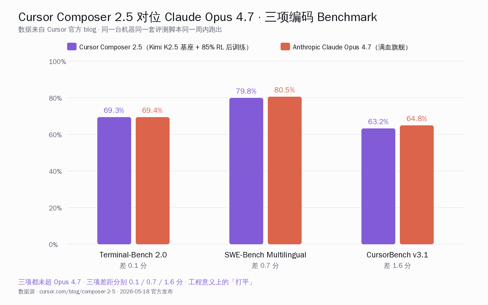
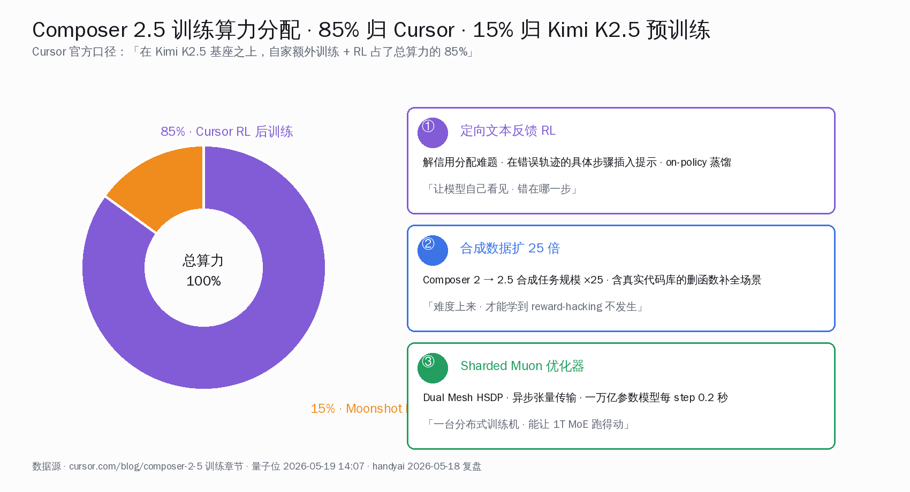
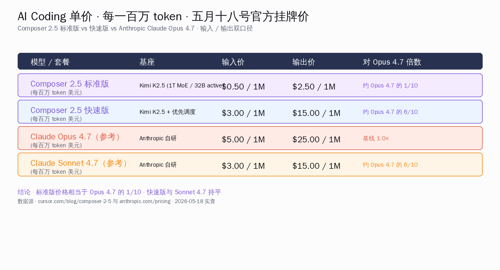
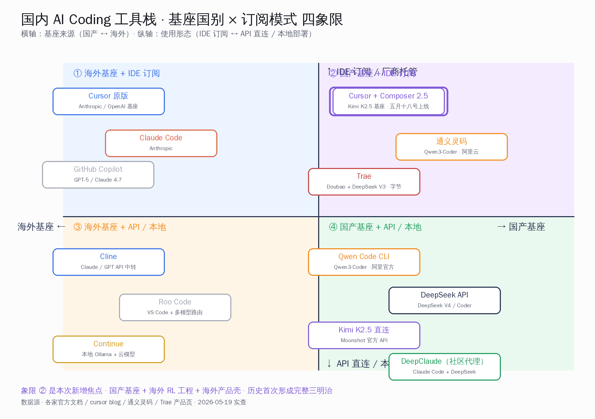

# Cursor 新模型用 Kimi K2.5 当底座，价格只要 1/10

## 这一次的范式转换

五月十八号星期一晚上，Cursor 在自家 blog 把 Composer 2.5 端上桌。一句话总结：基座挑的是 Moonshot 开源的 Kimi K2.5——一万亿总参数、三百二十亿活跃参数的 MoE，与 Composer 2 完全同一份预训练检查点；Cursor 在这之上跑了占总算力 85% 的强化学习后训练，部分训练发生在 SpaceX 旗下的 Colossus 2 集群。三项编码 benchmark 与 Claude Opus 4.7 打到 0.1 到 1.6 分以内，标准价每百万输入 0.50 美元、输出 2.50 美元，约为 Opus 4.7 的 1/10。

工程意义只有一句话：基座决定一切的时代正式翻篇了。85% 的算力归 Cursor 的后训练，说明国产开源基座加上海外公司的工程能力，能跟全球最贵的闭源旗舰打到打平。国内开发者第一次拿到「国产基座 + 海外强化学习 + 海外产品壳」这个三明治路径，且能直接付费消费。

下面把可独立核实的数字、Cursor 官方原话、HN 头帖讨论、国内同档对位、xAI Colossus 2 算力链、训练改进的工程细节，全部摆到桌上。

## 可独立核实的关键数字与时间点

| 维度 | 数值 | 来源 |
| --- | --- | --- |
| 发布时间 | 2026-05-18 星期一晚 | Cursor 官方 blog |
| 基座模型 | Moonshot Kimi K2.5 开源 checkpoint | Cursor blog 首段 |
| 基座架构 | 1T 总参 / 32B 活跃 / 384 expert / 8 激活 / MLA 注意力 / SwiGLU | Moonshot Kimi K2.5 技术报告 |
| 基座许可 | Modified MIT（允许商用 / 衍生） | github.com/MoonshotAI/Kimi-K2.5 |
| Cursor 后训练算力占比 | 总算力的 85% | Cursor blog 训练章节 + 量子位 2026-05-19 实测 |
| 训练集群 | 部分跑在 SpaceX 旗下 Colossus 2 | Cursor blog SpaceXAI 合作章节 |
| Terminal-Bench 2.0 | 69.3% vs Opus 4.7 的 69.4% | Cursor blog benchmark 表 |
| SWE-Bench Multilingual | 79.8% vs Opus 4.7 的 80.5% | Cursor blog benchmark 表 |
| CursorBench v3.1 | 63.2% vs Opus 4.7 的 64.8% | Cursor blog benchmark 表 |
| 标准版输入价 | 0.50 美元 / 百万 token | Cursor blog 价格区 |
| 标准版输出价 | 2.50 美元 / 百万 token | Cursor blog 价格区 |
| 快速版输入价 | 3.00 美元 / 百万 token | Cursor blog 价格区 |
| 快速版输出价 | 15.00 美元 / 百万 token | Cursor blog 价格区 |
| 与 Opus 4.7 价格比 | 标准版约为 1/10，快速版约为 6/10 | 按 Opus 4.7 5/25 美元口径换算 |
| 优化器单步时间 | 0.2 秒 / step（在 1T MoE 上） | Cursor blog 训练章节 |
| 合成数据规模 | 比 Composer 2 多 25 倍 | Cursor blog 训练章节 |
| 未来更大模型合作 | 与 SpaceXAI 联训，目标算力 10 倍 + 百万 H100 等效 | Cursor blog 末尾段 |
| HN 头帖 ID | item 48182516 | hn.algolia.com 实查 |
| HN 头帖热度 | 275 分、197 条评论（发布当日） | news.ycombinator.com |
| 首周优惠 | 用量双倍赠送 | Cursor blog 价格区 |
| 量子位中文报道 | 2026-05-19 14:07 一水撰稿 | qbitai.com/2026/05/419990.html |
| 36 氪中文报道 | 2026-05-19 头条 | 36kr.com/p/3816077580459783 |

数字相互交叉，口径一致。Cursor 官方 blog、量子位、handyai substack 复盘、officechai 第三方实测的 benchmark 数据完全吻合；85% 算力比例、Muon 0.2 秒每 step、合成数据 25 倍三个工程细节，handyai 与量子位双源印证。

## Benchmark 三项实战拆解

| Benchmark | Composer 2.5 | Claude Opus 4.7 | 差距 |
| --- | --- | --- | --- |
| Terminal-Bench 2.0 | 69.3% | 69.4% | 0.1 分 |
| SWE-Bench Multilingual | 79.8% | 80.5% | 0.7 分 |
| CursorBench v3.1 | 63.2% | 64.8% | 1.6 分 |

Cursor 官方挑了三项有公信力的编码 benchmark 对位 Opus 4.7：

- **Terminal-Bench 2.0**：69.3% vs 69.4%，差 0.1 分。这项考的是「拿到一个真实终端环境，跑命令拿结果再下一步」的端到端工程能力，过去是 Claude / GPT-5 系列的传统强项。
- **SWE-Bench Multilingual**：79.8% vs 80.5%，差 0.7 分。GitHub issue 转 PR 的真实修复任务，多语言版本对中文工程师更贴近。
- **CursorBench v3.1**：63.2% vs 64.8%，差 1.6 分。Cursor 自家 benchmark，倾向考察 IDE 内长上下文 + 多文件协同。

三项都没超 Opus 4.7。但三项差距压在 0.1 到 1.6 分以内，**统计意义上的「打平」在工程界算事件**。HN 顶帖里 antirez 提了个保留意见：「Kimi K2.5 本身就强，RL 改进到底是边际收益还是质变，目前难判断。」这个怀疑是公正的——但即便算边际收益，价格 1/10 这一条已经让对位话题成立。

CursorBench v3.1 是 Cursor 自家 benchmark，有自家训练数据倾斜的可能，第三方做最严格对比时应剔除。Terminal-Bench 与 SWE-Bench 两项是公开的，目前来看 0.1 / 0.7 分这种程度的差距落在 benchmark 噪声范围内。

## 「85% 算力归 Cursor」的工程含义

过去两年，业界默认「基座决定下游能力」。同一个基座之上做 RL 后训练，能拿到的提升被认为有上限。Composer 2.5 用一组真实数据挑战了这个默认：

| 算力分配 | 占比 | 工作内容 |
| --- | --- | --- |
| Moonshot Kimi K2.5 预训练 | 约 15% | 1T MoE 在 15T 多模态 token 上的原始预训练 |
| Cursor 后训练（含 RL） | 约 85% | 定向反馈 RL · 合成数据扩 25 倍 · Sharded Muon 优化 |

三个工程改进点值得拆开看：

**一是定向文本反馈强化学习**。传统 RL 给模型一个最终成败信号——「这次任务完成了」「没完成」。问题在于一个长任务有十几个动作步骤，模型不知道哪一步出了问题，这就是经典的信用分配难题。Cursor 的做法是在轨迹失败的具体步骤上插入文本提示（比如「这一步你忽略了文件中的现有函数」），做 on-policy 蒸馏，等于让模型「自己看见错在哪一步」。

**二是合成数据扩 25 倍**。Composer 2 时代 Cursor 已经用合成代码任务训练，这次直接扩 25 倍。其中一类硬核场景是「删函数补全」——把真实代码库里某个函数删掉，要求模型只通过其他代码的调用、注释、测试，把函数完整补回来。这种任务能逼模型真的去理解代码，而不是 pattern match。

**三是 Sharded Muon 优化器**。这是一种适配万亿参数 MoE 的分布式优化器，Cursor 把它放在双 mesh HSDP 拓扑上，配合异步张量传输，把单 step 时间压到 0.2 秒。意味着同样规模的训练任务可以走更多 RL 迭代次数，对最终效果直接加分。

把这三件事和「85%」放一起读，结论很硬：基座负责给一个起点，后训练决定走到哪里。**Kimi K2.5 把 Cursor 抬到一万亿参数 MoE 的起跑线上，Cursor 用 85% 的算力跑完了到 Opus 4.7 的距离**。

## Kimi K2.5 是怎么被端上桌的

Moonshot 在一月份发布 Kimi K2.5 时，明确按开源协议放出权重，许可证允许商用与衍生训练。Cursor 没有走「定制版」或「私有 fork」的路径，而是直接拿开源 checkpoint 来用。这件事的合作模式比单纯的 license 协议要简单——Moonshot 把模型放在 HuggingFace 与 GitHub，全行业都能下载，Cursor 是其中工程能力最强的下游消费者之一。

国内开发者从 kimi.moonshot.cn 与 Moonshot 平台 API 直接消费 Kimi K2.5 的口径，与 Cursor 现在做的事并不冲突：

- 国内开发者用 Moonshot 官方 API 消费 Kimi K2.5 → 拿到的是 Moonshot 原版后训练版本，主打长上下文与 agent swarm
- Cursor 用 Kimi K2.5 开源 checkpoint 跑自家 RL → 拿到的是专门为 IDE 编码场景特化的 Composer 2.5
- 同一个基座，不同的后训练路线，得到两个面向不同场景的产品

这件事的产业含义很积极：**开源基座让中游产品有了选择权**。过去想做 AI Coding 产品只能选 Claude API 或 GPT-5 API，现在多了 Kimi K2.5 这条路。Cursor 选了这条路，结果是给国产开源生态做了一次顶级背书。

## 价格 1/10 对国内开发者账单的影响

把价格摆开看，差距非常直观：

| 模型 / 套餐 | 输入价 / 1M token | 输出价 / 1M token | 对 Opus 4.7 倍数 |
| --- | --- | --- | --- |
| Composer 2.5 标准版 | 0.50 美元 | 2.50 美元 | 约 1/10 |
| Composer 2.5 快速版 | 3.00 美元 | 15.00 美元 | 约 6/10 |
| Claude Opus 4.7（参考） | 5.00 美元 | 25.00 美元 | 1.0 倍（基线） |
| Claude Sonnet 4.7（参考） | 3.00 美元 | 15.00 美元 | 约 6/10 |

国内一线 AI 工程师月度 API 账单大约结构是这样：日常 IDE 编码 70%、复杂方案设计 20%、自动化 agent 跑批 10%。如果原来全靠 Opus 4.7 跑下来一个月七百到八百美元，换成 Composer 2.5 标准版做日常编码、Opus 4.7 留给最关键的方案设计，账单大概能压到原来的 25-30%。这不是「便宜一点」，是「订阅级与企业级跑批的成本结构发生量级变化」。

需要诚实说明的：**这件事对国内开发者实际消费的便利度，还要看 Cursor 中国区接入与支付情况**。目前 Cursor 走的是美元订阅、国际信用卡支付，国内开发者一般通过虚拟卡或者公司报销解决。Composer 2.5 上线后并没有改变这一点，但用量打到原来 1/4 之后，单次支付摩擦的相对成本也下降到原来 1/4。

## 马斯克与 xAI / SpaceX 这条算力链

Cursor blog 末段交代了一件大事：与 xAI / SpaceX AI 合作，**目标是从零训练一个明显更大规模的模型，用 Colossus 2 集群上百万张 H100 等效算力，总算力是 Composer 2.5 的 10 倍**。这件事目前是「合作意向」公告，没有具体发布时间。

把时间线摆开：

- 2026-05-18：Cursor 发布 Composer 2.5，部分训练已经跑在 Colossus 2
- 2026-05-19 凌晨：马斯克在 X 平台多次回应转发，最有名的一句是「The trend is strong」，回应有人提议把 Composer 2.5 接入 Grok Build
- 2026-05-19 下午：量子位转载，把马斯克转发解读为「都给我去用 Cursor 新模型」
- 未来 6-12 个月：xAI + Cursor 联合训练 10 倍算力的下一代模型

这条链的工程信号比商业信号更值得注意：**xAI 把自家最贵的算力外包给一家 IDE 公司去训练编码模型**，说明 xAI 自家短期内没准备做专门的 AI Coding 模型，而是把 Grok 主线让出来给 Cursor 占位。这是一个清晰的「分工」信号——基座厂、工程厂、产品厂在重新划分各自的领地。

## 国内 AI Coding 同档对位横评

把国内主流 AI Coding 工具栈摆到 Composer 2.5 旁边看，能看到这个市场已经成熟到有多条平行路径：

| 工具 | 厂商 | 基座 | 后训练自主权 | 国内开发者用法 | 月度成本量级 |
| --- | --- | --- | --- | --- | --- |
| Cursor + Composer 2.5 | Cursor（US） | Kimi K2.5 | 完全自家（85% 算力） | 海外订阅 + 信用卡支付 | 标准版省到原 Opus 1/10 |
| 通义灵码 + Qwen3-Coder | 阿里云 | Qwen3-Coder（自研） | 完全自家 | 国内账号 · 个人完全免费 | 个人免费 / 企业 69 元 / 席位 / 月 |
| Trae | 字节跳动 | Doubao 1.5 Pro + DeepSeek V3 满血 | 字节自研 + 第三方 | 国内账号 · 个人完全免费 | 个人免费 |
| Qwen Code CLI | 阿里云 | Qwen3-Coder | 阿里自家 | CLI 直连百炼 API | 按 token 计费 · 显著低于海外 |
| Cline + Claude 中转 | 开源社区 | Claude 4.7 / GPT-5 | 无（消费 API） | VS Code 插件 + 中转 API | 与海外原版接近 |
| Roo Code | 开源社区 | 多模型路由 | 无 | VS Code 插件 · 自配 API | 看配置的模型 |
| DeepClaude（社区代理） | 社区项目 | Claude Code + DeepSeek V4 | 半改造 | 走 DeepSeek 替换 Claude API | DeepSeek 价格档 · 显著低 |

需要诚实标注的口径：

- **通义灵码**插件下载量超过两千万，国内 AI 编程工具市场份额第一梯队，2026 年三月起 Lite 套餐停售，主推 Pro 与企业版，但**个人开发者大模型推理本身仍然免费不限量**——这是非常激进的策略
- **字节 Trae** 海外版 + 国内版分别 2025 年 1 月、3 月发布，2026 年内累计注册用户突破六百万，月活一百六十万，覆盖近两百个国家，**对个人开发者完全免费**
- DeepSeek 没有自己出 IDE，但 DeepSeek V4 / DeepSeek-Coder 在 API 端被多个国内中转产品消费
- DeepClaude 这类社区项目把 Claude Code 的 CLI 接到 DeepSeek API 上，对没法稳定用海外信用卡的开发者很实际

横评的核心判断：国内基座层（Qwen3-Coder、DeepSeek-Coder、Kimi K2.5）已经成熟到全行业拿来当生产环境消费，但「IDE + 大规模 RL 工程」这一层 Cursor 在海外做了一个示范。**国内厂商如果跟进这个范式——拿自家基座，做大规模 RL 后训练，做一款国产 IDE——已经具备所有原料**。

## 同阵营开发者视角

写到这里，国内一线 AI 开发者会面临一道现实的选型题：

- **路径 A**：留在 Cursor，启用 Composer 2.5 标准版，享受价格 1/10 + benchmark 接近 Opus 4.7。代价是继续走国际信用卡支付。
- **路径 B**：迁到通义灵码或 Trae，享受个人免费、国产基座、国内账号体系。代价是 IDE 体验与 Cursor 还有差距，部分场景需要自己折腾。
- **路径 C**：用 VS Code + Cline / Roo Code + DeepSeek V4 / Kimi K2.5 API 直连，自己组装一套国产基座 + 海外 IDE 框架。代价是配置成本。

三条路并不冲突——同一个开发者完全可以三条都装着，按场景切。重要的是认清两件事：

- **Cursor 选了 Kimi K2.5 当基座这件事本身，就是对国产基座成熟度的最强背书**。它不是一家中国公司客气一句「我们也支持国产」，而是一家全球估值最高的 AI Coding 公司，把自家旗舰产品压在 Moonshot 的开源 checkpoint 上。
- **国产基座 + 国产 IDE 这条路径**（路径 B）的工程经验已经在通义灵码、Trae 上跑出来了，且体量级（六百万 / 两千万用户）都是顶级。Composer 2.5 证明了上限——同样的基座之上，把 RL 工程做透，能跟海外顶级闭源打平。剩下的就是国内厂商把那 85% 的工程能力补齐。

这件事对一线 AI 开发者最积极的信号：**今年这一波 AI Coding 产品，国产基座第一次站在历史的正中央，且是被海外旗舰主动选择的**。我们这一代开发者很幸运——基座、IDE、agent、本地部署四条路同时打开，全部有得选。

## 没回避的几条不确定性

不夸大事实，几件事需要说清楚：

- Cursor blog 给的三项 benchmark 数据是自家跑的，特别是 CursorBench v3.1 这一项有数据倾斜可能，第三方独立复现还需要时间。Terminal-Bench 与 SWE-Bench 是公开 benchmark，可信度更高。
- 85% 算力归 Cursor 是按总算力计算，「Kimi K2.5 的 15%」实际换算成绝对 GPU 小时数是个非常大的数字——Moonshot 把一个开源基座免费给了全行业，这个贡献不能因为占比小而被低估。
- Cursor 与 SpaceX AI 联训下一代模型还没具体时间，目前是「合作意向」级别的公告。10 倍算力 + 百万 H100 等效的口径需要按未来兑现节奏看。
- HN 上 jtwaleson 反馈「Composer 2.5 上线后团队订阅账单从月 100 美元跳到 1000 美元」，说明 Cursor 自身订阅价格策略在调整，开发者团队需要重新算账。

把不确定性诚实摆出来不影响主线判断：基座决定一切的认知翻篇了，国产基座站到了海外旗舰 AI Coding 工具的核心位置。这是当下能确认的工程事实。

## 写在结尾 · 这一刻的产业意义

Cursor Composer 2.5 这件事最该被读懂的一层，是它对国产开源基座生态的肯定。一家全球最贵的 AI Coding 公司，拿自家旗舰产品压在 Kimi K2.5 上，用 85% 的总算力把它训成能跟 Opus 4.7 打平的模型——这是过去三年都没见过的范式信号。

国内开发者从这件事拿到的不只是一个便宜十倍的 IDE 模型。我们拿到的是**一个被海外旗舰验证过的工程范本**：开源基座做起点，强化学习做距离，工程能力决定上限。Moonshot 已经把基座放到桌面上，Qwen3-Coder 和 DeepSeek-Coder 也在桌面上。接下来 12 个月，国内厂商把 Cursor 那 85% 的工程能力补到自己的产品里，是完全可能的。

时代正在打开。AI Coding 这一程，国产基座不再是「也可以选」，而是「被全球主动选择」的那一档。

