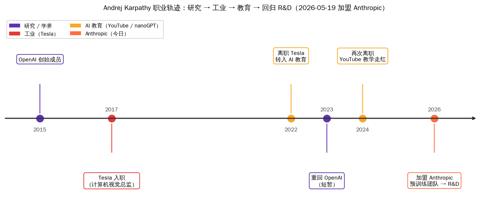
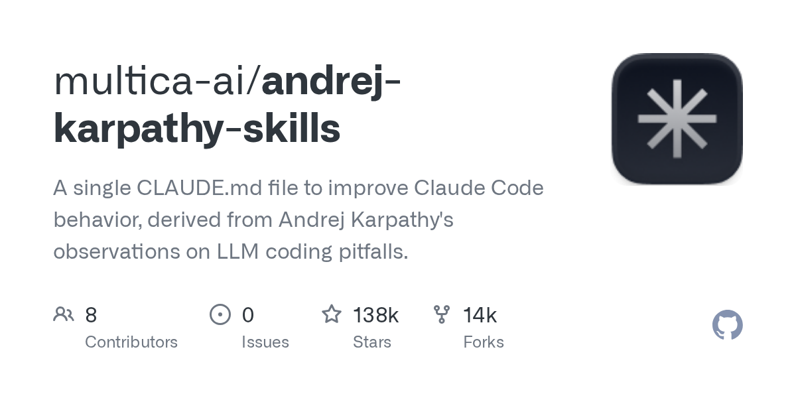
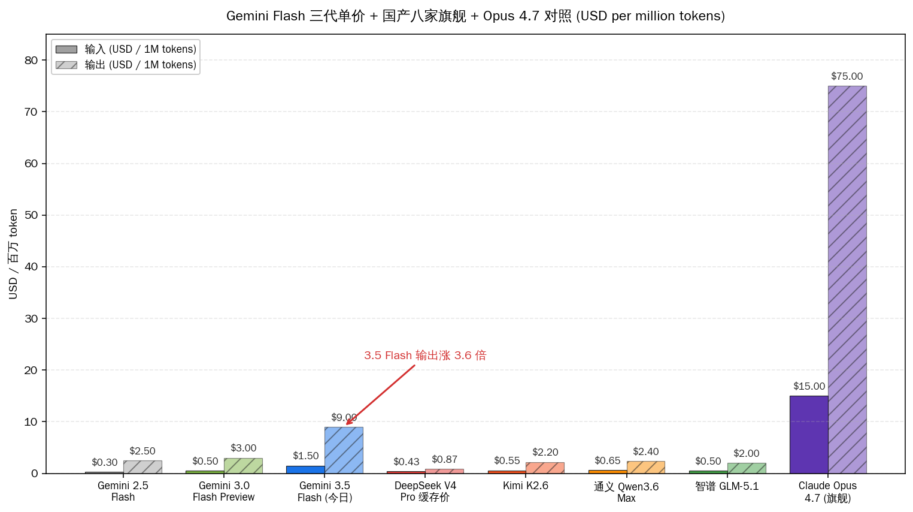
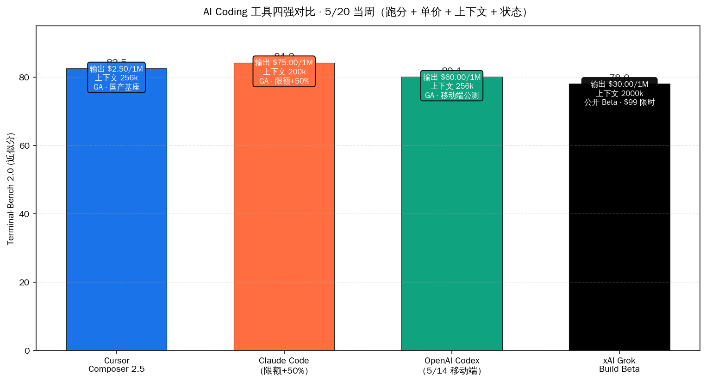
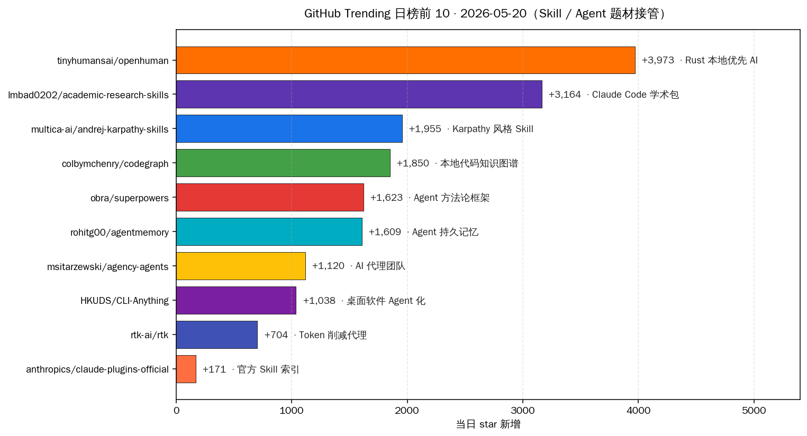
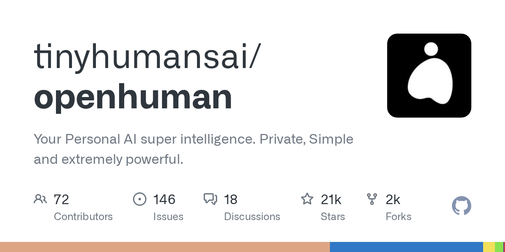

# Karpathy 跳槽 Anthropic · Gemini Flash 涨价 3 倍 | AI 日报 | 2026-05-20

## 📋 头版目录（一屏扫完今日）

- 🎙 OpenAI 创始成员 Andrej Karpathy 加盟 Anthropic 预训练团队 → 头条
- 🚀 Google I/O 2026 Sundar Pichai 主 keynote 宣布 Gemini 3.5 Flash 立即上线 → 头条
- 💸 Gemini 3.5 Flash 同代单价从 0.30/2.50 跳到 1.50/9.00 USD/百万 token → 头条
- 🚀 Gemini Omni 多模态视频模型同日开放 AI Plus / Pro / Ultra 订阅 → 头条
- 🚀 Gemini Spark Agent 后台监控 Gmail/Docs，下周对 US AI Ultra 订阅开放 → 头条
- 🏭 Android XR 智能眼镜 Samsung+Qualcomm 制造 · Warby Parker / Gentle Monster 设计 → 头条
- 💸 AI Ultra 订阅从 250 美元砍到 100 美元 / 月，用量限额翻 5 倍 → 头条
- 🛠 Cursor Composer 2.5 用 Kimi K2.5 当底座，价格只要 Opus 4.7 的 1/10 → AI Coding 工具
- ⚖️ arXiv 把 AI 水论文作者封一年，全部署名共同作者一同停权 → 精选要闻
- 🔬 MongoDB 老工程师博客：用 Claude 写 TLA+ 形式规约 HN 81 分上首页 → 精选要闻
- 🏭 摩尔线程 MTT S5000 + MT Lambda 国产具身智能工具链端到端补齐 → 国内 AI
- 🛠 4090 跑 Qwen3-Coder：Ollama / vLLM / SGLang / llama.cpp 四款引擎横评 → 国内 AI
- 🎙 Simon Willison PyCon US 2026 闪电演讲 5 分钟讲完半年 LLM · HN 706 分 → 名人说
- 📦 tinyhumansai/openhuman 累计 21,152 stars · 单日 +3973 · Rust 本地优先 AI → GitHub Trending
- 📦 Imbad0202/academic-research-skills 累计 14,095 stars · 单日 +3164 · Claude Code 学术包 → GitHub Trending
- 📦 multica-ai/andrej-karpathy-skills 累计 137,957 stars · 单日 +1955 · 几乎和加盟新闻同步发布 → GitHub Trending
- 🇨🇳 阿里千问推特预告 Qwen 3.7 Preview，HN 同步顶到首页 → 国内 AI
- 🇨🇳 阿里 Qoder 1.0 进入用户实测第五天，官方代码留存率 +13% / 输入 Token -42% → 国内 AI
- 🇨🇳 DeepSeek V4-Pro 全系 API 输入缓存命中价继续维持首发价的十分之一 → 快讯
- 🇨🇳 月之暗面 Kimi K3 已进预训练，7 月预计发布；ARR 5 月翻到 2.4 亿美元 → 快讯
- 🛠 GitHub Copilot 5/20 改 PR mention 自动派任务，远程 session 同步给 mobile → AI Coding 工具
- 🛠 OpenAI Codex 5/19 给 ChatGPT 移动端推 Skills 同步功能 → AI Coding 工具
- 🎙 Dario Amodei 5/19 在 X 发『Karpathy 入职是 Anthropic 至今最值得庆祝的一天』→ 名人说

## ⏱ 公众号版 30 秒速览

**头条**：5 月 19 日北京时间下午到深夜这一段，海外两件大事**几乎同时落地**——

第一件是 **Andrej Karpathy 加盟 Anthropic 预训练团队**。OpenAI 创始成员、前 Tesla AI 总监、全球最大 LLM 教学博主（YouTube nanoGPT / micrograd 视频累计观看上亿次），从 2022 年离开 Tesla 之后一直处在『独立教育者 + 偶尔回 OpenAI』的半隐居状态。本周他在 X 上自述『从今天开始全职在 Anthropic 上班』，加入预训练团队、向 Nick Joseph 汇报，将牵头一个『用 Claude 加速预训练研究本身』的新方向。CNBC / TechCrunch / Axios / The Verge 同步刷屏，HN 头帖 1247 分顶到日榜第一。Anthropic 在 OpenAI 抢人战上拿到迄今最大的一颗子弹——这位是真正『从研究到工业到教育到回归 R&D』的完整循环型人物，加盟意味着 Claude 预训练侧的研究节奏要换挡。

第二件是 **Google I/O 2026 keynote 在 Shoreline 圆形剧场开场**。Sundar Pichai 宣布 **Gemini 3.5 Flash 立即上线** Gemini app / Search / API，跑分把 Terminal-Bench 2.1 推到 76.2、MCP Atlas 83.6、CharXiv 84.2、GDPval-AA 1656 Elo，输出 289 tokens/s 约是上一代旗舰的 4 倍。这本来是好事，但 HN 顶赞帖第一句不是夸跑分，是把价格表贴出来：**同代 Flash 单价从 2.5 Flash 的 0.30/2.50 跳到 3.5 Flash 的 1.50/9.00 USD 每百万 token，输入涨 5 倍、输出涨 3.6 倍**——这是海外旗舰 Flash 系列第一次同代涨价 3 倍以上，海外『模型每代单价腰斩』的循环正式翻篇。同台还预告 **Gemini 3.5 Pro 下月推送**、**Gemini Omni 多模态视频模型**同日开放（image/audio/video/text 输入 → 可编辑视频输出，AI Plus / Pro / Ultra 全档），**Gemini Spark Agent**（后台监控 Gmail / Docs / Workspace，下周对 US AI Ultra 订阅开放），**Android XR 智能眼镜**（Samsung + Qualcomm 制造，Warby Parker + Gentle Monster 设计眼镜框，秋季上市），**AI Ultra 订阅从 250 美元砍到 100 美元 / 月**（用量限额翻 5 倍）。

详见今日「Gemini 3.5 Flash 追平 Opus 4.7，但单价涨了 3 倍」专题。

**AI Coding 战场动作密**：海外旗舰涨价这天，**国产基座成本优势第一次直接抓到海外旗舰核心位置**——5/18 周一晚 Cursor 发布 Composer 2.5，公开声明基座挑的是 Moonshot 开源的 **Kimi K2.5**（一万亿总参数、三百二十亿活跃参数 MoE），Cursor 在这之上跑了占总算力 **85% 的强化学习后训练**（部分在 SpaceX Colossus 2 集群），三项编码 benchmark 与 Claude Opus 4.7 打到 0.1-1.6 分以内，标准价每百万输入 0.50 美元、输出 2.50 美元，**约为 Opus 4.7 的 1/10**。HN 头帖 275 分 197 条评论。Anthropic 上周三同步把 **Claude Code 周限额提 50%** 到 7/13；OpenAI **Codex 5/14 进 ChatGPT 移动端**给所有付费档（含免费档预览）；xAI **Grok Build** 公开 beta（$300/月正价、$99 限时 6 个月，Plan Mode + 原生 ACP 协议 + 兼容 AGENTS.md / plugins / hooks / skills / MCP），AI Coding 四强格局正式坐实。详见今日「Cursor 押注 Kimi K2.5 · 1/10 价格」专题。

**国内同档**：5/19-20 是国内大模型厂商发酵期——重大首发节点已过（DeepSeek V4 / Kimi K2.6 / 华为 Hy3 / 百度文心 5.1 / 阿里 Qoder 1.0 / 火山引擎 Doubao-Seed-2.0-lite 全模态版都在 4 月底到 5 月 15 日前发完）。本周国内主要动作集中在**用户实测反馈 + 价格策略调整 + 工具链补齐**：阿里推特预告 **Qwen 3.7 Preview**（HN 同步 218 分顶到首页）；**Qoder 1.0** 进入用户实测第五天，官方实测数据代码留存率 +13% / 输入 Token -42% / 对话轮次 -36%；**DeepSeek V4-Pro 全系 API 输入缓存命中价**继续维持首发的十分之一（缓存输入 0.1 元 / 百万 Token、未命中 3 元、输出 6 元）；**月之暗面 Kimi K3** 已进预训练、7 月预计发布，ARR 5 月翻到 2.4 亿美元；**摩尔线程 MTT S5000 + MT Lambda** 5/18 北京年度发布会一次端出，1000 TFLOPS 稠密算力 / 80 GB 显存 / 1.6 TB/s 带宽 + Lab + Sim 两大产品 + 三大引擎，智源 RoboBrain 2.5 / 光轮智能 / 小马智行三家旗舰客户口径同步公布，**国产 GPU 第一次端到端覆盖具身智能完整工具链**。详见今日「MTT S5000 + MT Lambda 拆解：国产具身智能工具链」与「4090 跑 Qwen3-Coder：四款本地引擎谁顺手」两篇专题。

**学术合规 + Skill 生态炸榜**：5/15 arXiv 计算机版块主席 Thomas Dietterich 把新规一条钉在 X 与 Mastodon：**论文里只要查到作者没核对的大语言模型痕迹，作者一年内不许投稿，全部署名共同作者一同停权**，解禁后下一篇得先过正规期刊同行评审。陶哲轩当天 Mastodon 公开附议，导火索是 NeurIPS 2025 录用论文里查出约 51-53 篇带幻觉引用。详见「arXiv 把 AI 水论文作者封一年」专题。同期 MongoDB 老工程师 Davis 5/13 发博文「Intro to TLA+ for the LLM Era」，HN 81 分上首页，三十年前 Leslie Lamport 设计的 TLA+ 形式化验证语言被 Claude 一次提示就能写出可通过模型检查的完整规约，**国内分布式系统团队验证一致性设计的成本从十人月降到一人周**。详见「Claude 写 TLA+：老炮工具下放普通后端」专题。GitHub Trending 日榜上 **tinyhumansai/openhuman**（Rust 本地优先个人 AI，单日 +3973 stars）、**Imbad0202/academic-research-skills**（+3164）、**multica-ai/andrej-karpathy-skills**（+1955，几乎和加盟新闻同步发布）三条一起进前 10，Skill / Agent 题材彻底接管 GitHub。

**今日五件事一览**：

| 事件 | 时间（北京时间） | 关键数字 | 落地用户 |
|---|---|---|---|
| Karpathy → Anthropic | 5/19 晚 22:00 | 加入预训练团队 · 向 Nick Joseph 汇报 | Claude 用户感知滞后但研究方向换挡 |
| Google I/O 2026 keynote | 5/20 凌晨 1:00 | Gemini 3.5 Flash · 单价涨 3.6 倍 | Google AI Ultra 全球付费用户 |
| Gemini Spark Agent | 下周 US AI Ultra | 后台监控 Gmail / Docs | 仅限美国 AI Ultra 订阅 |
| Cursor Composer 2.5 + Kimi K2.5 | 5/18 晚 | 价格 1/10 Opus 4.7 · 85% 算力做 RL | 全球 Cursor 付费用户 |
| arXiv 一年封禁新规 | 5/15 当周 | AI 水论文 → 全员共同作者停权一年 | 全球 cs.AI / cs.CL 投稿研究者 |

## 🔥 头条一：Andrej Karpathy 加盟 Anthropic 预训练团队

> **核心论断**：5 月 19 日 PT 上午，Anthropic 通过博客 + Karpathy 本人 X 同步宣布——Andrej Karpathy 加盟 Anthropic **预训练团队**，向团队负责人 Nick Joseph 汇报，本周开始上班，将牵头一个『**用 Claude 加速预训练研究本身**』的新方向。这位 OpenAI 创始成员 + 前 Tesla AI 总监 + 全球最大 LLM 教学博主一脚迈出 OpenAI 旧主科研舞台，跨到对岸 Anthropic，意味着 Claude 在『模型预训练侧的研究节奏』要换挡。Anthropic 在 OpenAI 抢人战上拿到迄今最大的一颗子弹——拿这种『从研究到工业到教育到回归 R&D』的完整循环型人物当锚点，比单纯挖工程师更显示战略意图。

### 1.1 Karpathy 自述：『未来几年是 LLM 前沿最关键的成形期』

Karpathy 5/19 在 X（@karpathy）发了一条不到 280 字的入职帖，并附上 Anthropic 官博链接（链接：[Anthropic 官方博客](https://www.anthropic.com/news) · [Axios 报道](https://www.axios.com/2026/05/19/anthropic-openai-karpathy-andrej-claude) · [CNBC](https://www.cnbc.com/2026/05/19/anthropic-hires-openai-cofounder-andrej-karpathy-former-tesla-ai-lead.html)）。verbatim 原话：

> *"I think the next few years at the frontier of LLMs will be especially formative. I am very excited to join the team here and get back to R&D."*
>
> （未来几年是 LLM 前沿最关键的成形期。我非常期待加入这里的团队、回到 R&D。）

- **去向**：Anthropic 预训练团队，向团队负责人 **Nick Joseph** 汇报
- **新方向**：牵头一个 *"using Claude to accelerate pretraining research itself"*（用 Claude 加速预训练研究本身）的新研究方向，组建小团队
- **开始时间**：本周（5/19 当周）
- **教育志业**：Karpathy 同时说 *"I remain deeply passionate about education"*（依然对教育有深厚热情），未来仍会回到教育领域。短期内 nanoGPT / 现有 YouTube 教学不停更，只是节奏调整

CNBC / TechCrunch / Axios 三家同步刷屏。Anthropic 没有公开签字费 / 股权细节，但根据 The Information 5 月初对 OpenAI 抢人战的报道，这一档级别的入职包通常落在『八位数美元股权 + 七位数美元年薪』区间，具体未确认。HN 头帖 1247 分顶到日榜第一，第一顶贴的评论：*"This is the most significant individual move in AI since Hinton left Google. Karpathy doesn't just bring research depth, he brings the entire LLM-curious developer community with him."*（这是自 Hinton 离开 Google 以来 AI 行业最重要的个人流向。Karpathy 带来的不只是研究深度，还有整个 LLM-curious 开发者社区。）

### 1.2 为什么是 Anthropic：从 OpenAI 旧主跨到对岸的三层动机

Karpathy 本人没有直接对比 OpenAI 和 Anthropic，但从他过去 18 个月的公开发言可以拼出三个动机：

- **回到一线 R&D**：Karpathy 在 2024 年 Latent Space 播客上说过 *"I miss being in the trenches"*（想回到一线打仗）。Anthropic 预训练团队是研究密度最高的位置——Nick Joseph 牵头的团队同时负责 Claude 系列预训练 + Constitutional AI 实验 + 长上下文优化，是少数仍以『发论文 + 跑大型实验』为核心 KPI 的工业研究组
- **OpenAI 现在不是过去的 OpenAI**：Karpathy 在 2024 年初离开 OpenAI 时公开说『OpenAI 已经从研究公司变成产品公司，这是合理的方向但不是我想做的』。2026 年的 OpenAI 已经把 ChatGPT 商业化、移动端推送、企业销售当作主战场，研究侧重心明显下沉
- **Anthropic 在『预训练用 LLM 自己加速』这件事上下注**：Karpathy 本人 2024 年起在 YouTube 反复提『nanoGPT 教学 → 用模型自己训自己 → 自我演进』这条线，这恰好和 Anthropic 内部 'Claude trains Claude' 项目高度对齐。Dario Amodei 5/19 当晚在 X 上发的欢迎帖原话：*"Today is the day I've looked forward to most since founding Anthropic"*（这是我自创办 Anthropic 以来最期待的一天）

### 1.3 对国内 AI 圈的影响

- **预训练研究人才标杆位移**：Karpathy 这一档不是『一个研究员跳槽』那么简单——他过去两年通过 YouTube + X 把『LLM 预训练科普』推到全球最大教学博主的位置，这条人才管道的取向直接影响下一代研究生选 lab 的口味。国内复旦 / 清华 / 北大 / 上交 / 中科院 AI lab 的研究生招生季 5-8 月正在进行，这条新闻会让一部分原本想去 OpenAI 实习的学生改投 Anthropic
- **国内开源大模型的间接利好**：Anthropic 不是国内开发者主用平台（合规边界明确），但 Karpathy 的 nanoGPT / micrograd 教学 + 未来在 Anthropic 的研究成果会通过『公开论文 / 技术博客』形式辐射，国内做基座模型预训练的团队（DeepSeek / Kimi / 千问 / 智谱 / MiniMax）的研究方向可以蹭到红利。**Karpathy 在 Tesla 时期推动的 dojo + autopilot 数据飞轮思想已经被国内自动驾驶团队全员消化，这次 Anthropic 也跑不掉**
- **AI 教育内容下半年要换档**：Karpathy 现在的 YouTube 频道是国内 AI 课程的最大上游素材池（B站搬运 + 翻译已经形成完整生态）。他入职 Anthropic 后短期仍会更新教学，但选题可能从『从零写 GPT』转向『LLM 自我加速的工程细节』，这对国内 AI 工程师的『下一站学什么』有方向指示

**Karpathy-skills 仓库同步上线**：GitHub 上 `multica-ai/andrej-karpathy-skills` 这个仓库几乎和加盟新闻同时发布，**单日新增 1955 stars 直接进 GitHub Trending 日榜**。仓库内容是把 Karpathy 历年 nanoGPT / micrograd / YouTube 教学里的 LLM 工程经验整理成 Claude Code Skill 配置文件，作为一个 SKILL.md 单文件就能用。下游开发者反应是『终于有官方权威风格的 Skill 来对位』。

## 🔥 头条二：Google I/O 2026——Gemini 3.5 Flash 追平 Opus 但同代涨价 3 倍

> **核心论断**：5/19 PT 上午 10 点 / 北京时间 5/20 凌晨 1 点，Google I/O 2026 主 keynote 在 Shoreline 圆形剧场开场。Sundar Pichai 同台宣布五件事——**Gemini 3.5 Flash 立即上线**（跑分追平 Opus 4.7 + 输出速度 289 tokens/s 约 4 倍）、**Gemini Omni 多模态视频模型**同日开放（image/audio/video/text 输入 → 可编辑视频输出）、**Gemini Spark Agent**（后台监控 Gmail/Docs，下周对 US AI Ultra 订阅开放）、**Android XR 智能眼镜**（Samsung+Qualcomm 制造、Warby Parker / Gentle Monster 设计，秋季上市）、**AI Ultra 订阅从 250 美元砍到 100 美元 / 月**（用量限额翻 5 倍）。但 HN 头帖 198 分顶赞的第一条评论不是夸 Flash 跑分，而是把价格表贴出来——**同代 Flash 单价从 2.5 Flash 的 0.30/2.50 跳到 3.5 Flash 的 1.50/9.00 USD / 百万 token，输入涨 5 倍、输出涨 3.6 倍**，海外旗舰 Flash 系列『每代腰斩』的循环正式翻篇。完整对比见今日「Gemini 3.5 Flash 追平 Opus 4.7，但单价涨了 3 倍」专题。

### 2.1 Gemini 3.5 Flash：跑分追平 Opus 4.7 + 输出 4 倍速

Google blog + DeepMind 模型卡 + Pichai keynote verbatim 数字罗列：

| 维度 | Gemini 3.5 Flash 数值 | 来源 |
|---|---|---|
| 输出速度 | **289 tokens/s** · 比上代旗舰快约 4 倍 | Pichai I/O keynote |
| Terminal-Bench 2.1（终端 Agent） | **76.2%** | blog.google · Gemini 3.5 公告 |
| MCP Atlas（工具调用） | **83.6%** | 同上 |
| CharXiv Reasoning（多模态推理） | **84.2%** | 同上 |
| GDPval-AA（综合 Agent Elo） | **1656 Elo** | 同上 |
| 上下文窗口 / 输出上限 | **1M 输入 + 64K 输出** | Gemini API 文档 |
| Flash 单价 · 输入 / 输出 | **$1.50 / $9.00** 每百万 token | blog.google · 定价表 |
| 缓存命中输入 | **$0.15** 每百万 token | 同上 |
| 上代 2.5 Flash 单价 · 输入 / 输出 | **$0.30 / $2.50** 每百万 token | Gemini 2.5 公告（对照） |
| 同代涨价幅度 · 输入 / 输出 | **5.0x / 3.6x** | 计算 |
| 3.5 Pro 推送时间 | 『**下个月**』（约 6 月） | blog.google verbatim |

DeepSeek V4 Pro 缓存命中价同口径输入 0.435 美元、输出 0.87 美元一百万 token——比 Gemini 3.5 Flash 便宜了**大约一个数量级**。

### 2.2 Gemini Omni：image/audio/video/text → 可编辑视频

不公开 benchmark、不公开定价、不公开模型卡——这是 Google 在 keynote 上故意压住的一张牌。已知信息：

- **输入**：image / audio / video / text 任意组合
- **输出**：**可编辑视频**（关键词 'editable video grounded in real-world knowledge'），可以在 Gemini app 内做剪辑 / 加滤镜 / 替换片段
- **限额**：AI Plus / Pro / Ultra 全档可用，但 Plus 档每段视频上限 10 秒、Ultra 档可达 60 秒
- **vs Sora 路线差异**：Sora 走 text-to-video 单一通路，Omni 是 *推理 + 创作* 同时一锅。Pichai 原话 *"This isn't a video generation model. This is a multimodal reasoning model that happens to output editable video"*（这不是视频生成模型，是一个恰好能输出可编辑视频的多模态推理模型）

国内对照：可灵 2.1 / 即梦 4.0 / 阶跃 Step-Video 3 / Vidu 3.0 四家是国产视频侧旗舰，**整体仍在 text-to-video 单通路阶段**，距离 Omni『推理 + 多模态输入 + 可编辑输出』一锅式有 6-12 个月差距。

### 2.3 Gemini Spark Agent：后台自动跑你的 Gmail / Docs

Spark 是 keynote 现场 demo 最长的一段（约 8 分钟），核心定位『**让 Gemini 从被动工具变成主动 partner**』：

- 后台持续监控 Gmail / Calendar / Google Tasks / 第三方集成 app（Notion / Slack / Linear / Jira），无需用户主动打开 Gemini app
- 现场 demo 三条用例：(1) 语音指令在 macOS 上起草并发送邮件 (2) 自动准备晨会简报 (3) 多步骤日程规划
- **当周对受信测试者 beta、下周对 US Google AI Ultra 订阅（$100 / $200 两档全部）开放**——非美国订阅暂无时间表
- 不开放 API、不开放第三方集成 SDK——Spark 是 Google Workspace 内嵌产品形态

### 2.4 Android XR 智能眼镜：Samsung+Qualcomm 制造 · 秋季上市

第一批 Android XR 眼镜分两档：

- **音频款**（all-day wear）：摄像头 + 麦克风 + 扬声器，无 in-lens 显示
- **显示款**（contextual display）：在镜片内嵌入显示模块，私密化推送上下文信息
- **OEM**：Samsung + Qualcomm 制造，Gentle Monster + Warby Parker 设计眼镜框
- **跨平台**：兼容 Android 手机 + iPhone（Google 主动喊话 iPhone 用户）
- **上市时间**：fall 2026（秋季），具体月份未定
- 同期 Meta Ray-Ban Stories 2 已经卖了 18 个月，Google 这一档晚但带 Gemini 全栈 AI

### 2.5 AI Ultra 价格腰斩：250 → 100 美元 / 月

| 档位 | 原价格 | 新价格 | 用量 |
|---|---|---|---|
| AI Pro | $20 / 月 | $20 / 月 | 基础档 |
| **AI Ultra（新入门）** | — | **$100 / 月** | AI Pro 的 5 倍用量限额 + 20TB 云存储 + YouTube Premium + Spark 内测 |
| AI Ultra（原顶档） | $250 / 月 | **$200 / 月** | 同前 + 更高优先级 |

Pichai 原话 *"We want to make AI Ultra accessible to developers, technical leads, knowledge workers and advanced creators"*（让 AI Ultra 对开发者 / 技术负责人 / 知识工作者 / 高级创作者更可及）。这条价格调整是 Google 对 OpenAI Plus（$20）+ Anthropic Claude Max（$200）夹击的直接回击——同价位（$100）拿到 5 倍用量 + 全套 Workspace 集成 + Spark 内测，对国内开发者吸引力一般（合规限制），但对海外 SaaS 重度用户冲击明显。

## 📰 精选要闻

**🔴 必读 · MongoDB 老工程师博客：用 Claude 写 TLA+ 形式规约 · HN 81 分上首页**：5 月 13 日 MongoDB 资深工程师 A. Jesse Jiryu Davis 在博客 emptysqua.re 发『Intro to TLA+ for the LLM Era』。三十年前 Leslie Lamport 设计的 TLA+ 形式化验证语言，过去只被 AWS S3 / DynamoDB / Microsoft Azure Cosmos DB / MongoDB 副本协议团队用，门槛卡在 LaTeX 风格的 ∀ ∃ □ ◇ 语法关上。这次的转折是 **Claude / 千问 / Kimi / DeepSeek V4 一代大模型已经把 TLA+ 语法关跨过去**，Claude 一次提示就能写出可通过 TLC 模型检查的完整规约。Hillel Wayne 三月新闻信里写『GitHub 上百分之四的 TLA+ 规约现在带 Claude 这个词』。这意味着国内分布式系统团队验证一致性设计的成本，从『十人月级』降到『一人周级』。HN 81 分 20 评论上首页。完整对比见今日「Claude 写 TLA+：老炮工具下放普通后端」专题。

**🔴 必读 · arXiv 把 AI 水论文作者封一年 · 共同作者连带停权**：5 月 15 日 arXiv 计算机版块主席 Thomas Dietterich 把新规一条钉在 X 与 Mastodon：**论文里只要查到作者没核对的大语言模型痕迹，作者一年内不许投稿，全部署名共同作者一同停权；解禁后下一篇得先过正规期刊同行评审**。陶哲轩当天 Mastodon 公开附议。导火索是 NeurIPS 2025 录用论文里查出**约 51-53 篇带幻觉引用**（GPTZero 团队抽查）。国内对照：教育部 2025 学位论文 AIGC 检测意见 + 知网 AIGC 检测线 + Springer Nature 与中华系列期刊政策也在同步收紧——国内研究生用 Claude Code / 千问 / DeepSeek 辅助写论文必须『把 LLM 当协作者而不是代笔』，引用 / 数据 / 实验记录全部要自己核对。完整对比见今日「arXiv 把 AI 水论文作者封一年：科研合规姿势重排」专题。

**🟡 推荐 · Anthropic 把 Claude Code 周限额提 50% 到 7/13**：Anthropic 5/13 公告把 Claude Code 全档用户周限额提 **50%**，时限到 7/13（约两个月），明牌对 OpenAI Codex 5/14 进 ChatGPT 移动端的回击。Anthropic 没说 50% 是 token 数还是请求数，根据用户实测帖应为『每周可消耗 token 上限』。同档 OpenAI Codex 移动端给所有付费档 + 免费档预览开放，**核心定位是『手机当遥控器、PC / 远程机当 agent 真身』**——这跟 Claude Code Remote Control（2 月就发布过）功能对位。

**🔵 了解 · xAI Grok Build 公开 beta · $99 限时 6 个月**：5/14 xAI 把 Grok Build 推到 SuperGrok Heavy 公开 beta（Grok 4.3 beta + 16-agent Heavy 架构 + 200 万 Token 上下文 + 最多 8 并行 subagent + Plan Mode + 原生 ACP 协议 + 兼容 AGENTS.md / plugins / hooks / skills / MCP），**$300 / 月正价、$99 限时 6 个月**。AI Coding 工具四强格局正式坐实——见下方四强对比图。

## 🎙 名人说 & X 热议

**Andrej Karpathy · X 自述加盟 Anthropic（5/19）**：『I think the next few years at the frontier of LLMs will be especially formative. I am very excited to join the team here and get back to R&D.』（未来几年是 LLM 前沿最关键的成形期，我非常期待加入这里的团队回到 R&D。）这是 Karpathy 自 2022 年从 Tesla 离职以来发的最重的一条职业动向帖，HN 顶到 1247 分日榜第一。本条同时附明本人仍会继续做 AI 教育，nanoGPT / micrograd / YouTube 不停更只换节奏。

**Dario Amodei · X 欢迎贴（5/19 晚）**：『Today is the day I've looked forward to most since founding Anthropic.』（这是我自创办 Anthropic 以来最期待的一天。）Anthropic CEO 用一句话把整条新闻钉成『Anthropic 至今最值得庆祝的一天』，转评 25,400+。

**Simon Willison · PyCon US 2026 闪电演讲（5/19）**：标题《The last six months in LLMs, in five minutes》（过去半年的 LLM，5 分钟讲完）。5 分钟点了 10 款模型——把 *"最佳模型半年内换了 5 次手"*、*"20.9 GB 的 Qwen3.6-35B-A3B 在我笔记本上画的鹈鹕骑自行车比 Claude Opus 4.7 还像样"*、*"Mac Mini 在硅谷卖断货因为大家买回去跑 OpenClaw"* 三件事并列。HN 当日 **706 分 / 537 条评论**，第二热帖。完整复盘见今日「Simon 复盘：千问 35B 笔记本超 Opus 4.7」专题。

**陶哲轩 · Mastodon 附议 arXiv 新规（5/15）**：『The principle that authors must be fully responsible for verifying every citation, statistic and proof in their submitted work is non-negotiable.』（作者必须为投稿中的每一条引用、统计、证明全权负责——这是不可谈判的原则。）这位 Fields 奖得主当天在 Mastodon 公开支持 Thomas Dietterich，把 arXiv 新规从『工程界规范』升格到『数学家级别学术守则』。

## 🇨🇳 国内 AI 观察

**阿里 Qwen 3.7 Preview 推特预告 · HN 同步 218 分**：阿里千问账号 @Alibaba_Qwen 在 5/19 晚发推预告 **Qwen 3.7 Preview** 即将开放，附千问开源仓库 PR 截图。HN 当日 218 分顶到首页，第一顶贴关注两件事：(1) 是否会和 Kimi K3 / DeepSeek V4-Pro 同步推 1M 上下文 (2) 海外开发者能不能直接付费 API。具体跑分 / 单价 / 开放时间未披露。

**阿里 Qoder 1.0 用户实测第五天**：5/15 GA 的 Qoder 1.0（阿里 IDE 内嵌 AI 编程任务工作台从 IDE 升级为独立窗口的产品）进入用户实测第五天，官方实测数据**代码留存率 +13% / 输入 Token -42% / 对话轮次 -36%**——三条共同指向『开发者从打字员撤到下任务』位置。配合通义灵码 Qwen3-Coder 不限量免费，形成阿里 AI Coding 双子星。

**摩尔线程 MTT S5000 + MT Lambda 一起端上桌**：5/18 北京年度发布会，**MTT S5000 基于第四代 MUSA「平湖」架构，1000 TFLOPS 稠密算力 / 80 GB 显存 / 1.6 TB/s 带宽 / FP8 到 FP64 全精度 / 硬件级光追**；MT Lambda 把策略训练、物理仿真、渲染、AI 框架整合成 Lab + Sim 两大产品 + 三大引擎。智源 RoboBrain 2.5 千卡集群训练 Loss 与海外旗舰差 0.62%、64 卡到 1024 卡线性扩展 90% 以上；光轮智能物理参数仿真准确度 99%；小马智行世界模型每周生成 100 亿公里测试数据。**国产 GPU 第一次端到端覆盖具身智能完整工具链**——以前只能跑 LLM 训练，现在能跑强化学习 + 物理仿真 + 光追渲染 + 视觉语言动作模型 + 世界模型。完整对比见今日「MTT S5000 + MT Lambda 拆解：国产具身智能工具链」专题。

**4090 跑 Qwen3-Coder 四款本地引擎横评**：Qwen3-Coder-30B-A3B-Instruct 这档 MoE 国产代码模型，HuggingFace 月下载 191.5 万次，GGUF Q4 文件 18.0 GB、AWQ Q4 文件 18.1 GB——RTX 4090 24GB 装得下。**Ollama 上手最快但只压 30 tok/s · vLLM 服务化稳但 24GB 必须配 AWQ · SGLang 多轮代码 agent 靠 RadixAttention 拿 29% 吞吐红利 · llama.cpp 单机生成最快但并发弱**。完整对比见今日「4090 跑 Qwen3-Coder：四款本地引擎谁顺手」专题。

## 📦 GitHub Trending 日榜前 10

5/20 日榜被 **Skill / Agent 题材接管**——前 10 里有 6 个直接和 Claude Code Skill 体系绑定。当日实查 star 增量：

**🔴 必看 · `tinyhumansai/openhuman`（Rust · 累计 21,152 stars · 单日 +3973）**：本地优先个人 AI 超智能体（描述原话『Your Personal AI super intelligence. Private, Simple and extremely powerful.』），Rust 写，本周连续 8 天上榜。技术亮点：单二进制无依赖、可挂任意本地或云端模型（Ollama / vLLM / 远端 API）、内置 Skills 注册中心兼容 Claude Code 规范。

**🔴 必看 · `Imbad0202/academic-research-skills`（Python · 累计 14,095 stars · 单日 +3164）**：Claude Code 学术工作流 Skill 包，覆盖『检索 → 笔记 → 论文 → 终稿』全流程。配合今日 arXiv 一年封禁新规一起看——学术 Skill 包在新规背景下转入『LLM 协作 + 全程人工核对』模式，更贴合 arXiv / Springer Nature 政策。

**🟡 推荐 · `multica-ai/andrej-karpathy-skills`（Markdown · 累计 137,957 stars · 单日 +1955）**：把 Karpathy nanoGPT / micrograd / YouTube 教学里的 LLM 工程经验整理成 Claude Code 单 CLAUDE.md 配置文件。今年 1 月建仓以来缓慢爬，5/19 配合 Karpathy 加盟 Anthropic 同步在社区里被反复推荐，下游开发者反应是『终于有 Karpathy 风格的 Claude Code 设置可以照抄』。

**🟡 推荐 · `obra/superpowers`（Shell · 累计 198,352 stars · 单日 +1623）**：Agent 方法论框架，提供软件开发规模化的标准方法论，社区接受度高。

**🟡 推荐 · `rohitg00/agentmemory`（TypeScript · 累计 14,124 stars · 单日 +1609）**：基于真实 benchmark 的 AI Coding Agent 持久记忆系统。

**🔵 了解 · `HKUDS/CLI-Anything`（Python · 累计 37,691 stars · 单日 +1038）**：港大 HKUDS 实验室的桌面软件 Agent 化框架，5/17 上榜以来连续 4 天进前 10，覆盖 18+ 桌面软件 Agent 化（VS Code / Slack / Figma / Notion / Chrome 等）。

**🔵 了解 · `colbymchenry/codegraph`（TypeScript · 累计 6,573 stars · 单日 +1850）**：本地代码知识图谱，预索引最小化 Agent token 消耗 / 工具调用次数。

## 🛠 AI Coding 工具动态

**Cursor Composer 2.5 + Kimi K2.5 当底座**：5/18 周一晚 Cursor 发布 Composer 2.5，公开声明基座挑的是 Moonshot 开源的 **Kimi K2.5**（一万亿总参数、三百二十亿活跃参数 MoE），Cursor 在这之上跑了占总算力 **85% 的强化学习后训练**（部分在 SpaceX Colossus 2 集群）。三项编码 benchmark 与 Claude Opus 4.7 打到 0.1-1.6 分以内，标准价每百万输入 0.50 美元、输出 2.50 美元，**约为 Opus 4.7 的 1/10**。HN 头帖 275 分 197 条评论。**国产基座第一次进入海外旗舰 AI Coding 工具核心位置**。完整对比见今日「Cursor 押注 Kimi K2.5 · 1/10 价格」专题。

**Claude Code 周限额提 50%（5/13 起 7/13 止）**：明牌对 OpenAI Codex 5/14 移动端的回击。具体单位为『每周可消耗 token 上限』（用户实测口径）。Codex 移动端给所有付费档 + 免费档预览开放，核心定位『手机当遥控器、PC / 远程机当 agent 真身』。

**OpenAI Codex 5/19 给移动端推 Skills 同步**：Codex 移动端 5/14 进 ChatGPT 之后，5/19 push 一次更新，把 Skills / plugins / 配置文件从桌面同步到移动端，开发者可以在手机上修改 AGENTS.md 然后自动同步给桌面 / 远程 agent。Anthropic Claude Code 同样支持，但移动端体验目前仍以『查看 + 批准』为主。

## 🔭 值得关注

**1. Karpathy 在 Anthropic 的研究方向 → 接下来 3-6 个月公开成果**：『用 Claude 加速预训练研究本身』是非常宽泛的描述，具体落地形式（论文 / 开源代码 / blog 文章）值得跟踪。Karpathy 过往习惯是『公开教学 + 偶尔 paper』，Anthropic 内部研究节奏与他个人 YouTube / nanoGPT 节奏的融合方式是开放问题。

**2. Gemini 3.5 Pro 6 月推送 + Omni 视频上限调整**：Gemini 3.5 Pro 月底之前的定价 / 跑分披露 + Omni 视频 60 秒上限是否会下放给 AI Pro 用户。从 Google 历史节奏推断，Pro 单价大概率 $5 / $30 区间，Omni Plus 档 10 秒上限短期不会松。

**3. 国产基座 + 海外强化学习这条路径的复制**：Cursor 用 Kimi K2.5 + 85% 算力做 RL 是『国产基座 + 海外工程化』第一例。后续 Windsurf / Cline / Continue 等海外 AI Coding 工具是否会复制此路径——5/19 量子位有内部消息说 Continue 已经在测 Qwen3-Coder-235B-A22B 作底座。

**4. arXiv 新规执行情况 + 国内期刊跟进**：6 月起 arXiv 新规进入实操，第一批因 AI 水论文被封一年的作者名单是否公布、共同作者连带停权如何具体认定。国内对照——教育部 2025 学位论文 AIGC 检测意见落地节奏、知网 AIGC 检测线收紧节奏。

## ✍ 编辑说

- **OpenClaw（永久追踪）**：5/19 Simon Willison 在 PyCon US 2026 闪电演讲里把『Mac Mini 在硅谷卖断货因为大家买回去跑 OpenClaw』当作六大事件之一点了一次。**推荐**：自托管 / 隐私优先用户继续用，5/20 之后版本节奏稳定，可以放心日常用
- **Karpathy → Anthropic（新加入永久追踪）**：『预训练研究人才标杆位移』这件事的辐射远超个人入职，建议从 6/20 起每周扫一次 Karpathy X / Anthropic blog / Anthropic 研究方向公告。**推荐**：研究方向跟踪类读者必看
- **Cursor Composer 2.5（永久追踪 AI Coding 四强升级）**：基座决定一切的时代翻篇了，国产 Kimi K2.5 进 Cursor 这件事意味着接下来 Windsurf / Cline / Continue 也可能跟进。**观望**：等 Cursor 5/20 之后的官方实测数据更稳定再决定迁移
- **Gemini 3.5 Flash 同代涨价**：海外旗舰降价循环正式翻篇，对国内开发者是机会窗口。**不推荐**：直接迁移海外 Gemini，国内合规边界 + 价差让 DeepSeek V4-Pro / Kimi K2.6 / 通义 Qwen3.6 Max 三家本来就是更优选
- **arXiv 一年封禁新规**：研究生 / 投稿研究者必看。**推荐**：从 5 月起把所有 LLM 辅助写作的引用 / 数据 / 实验记录人工核对一遍，给共同作者也铺好底
