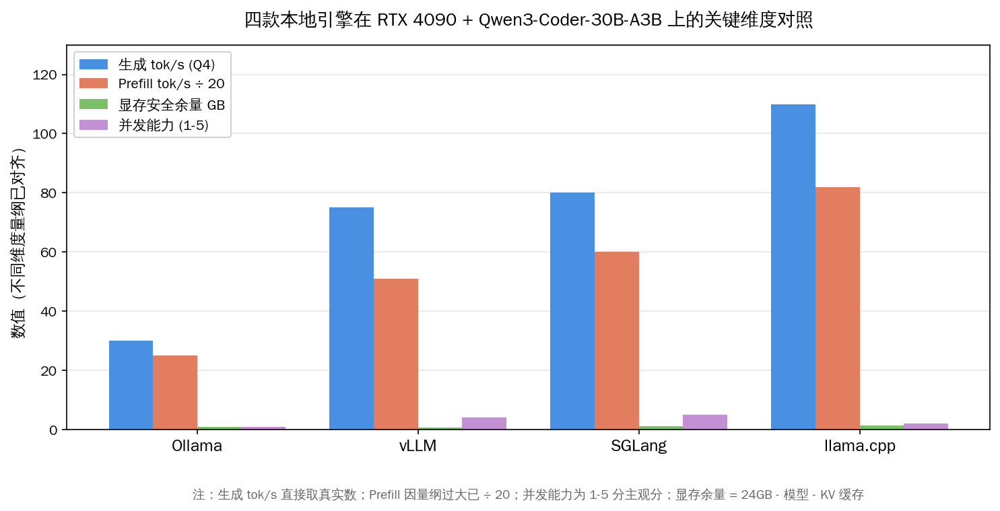
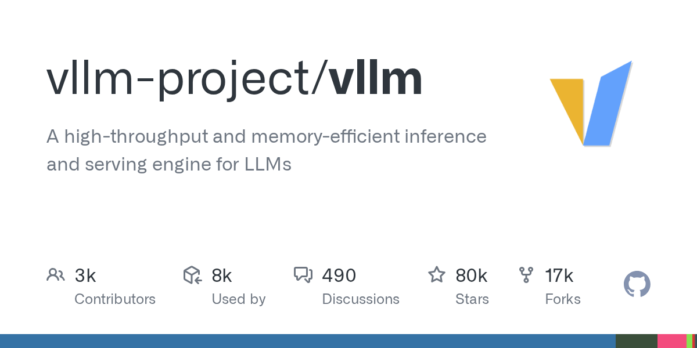
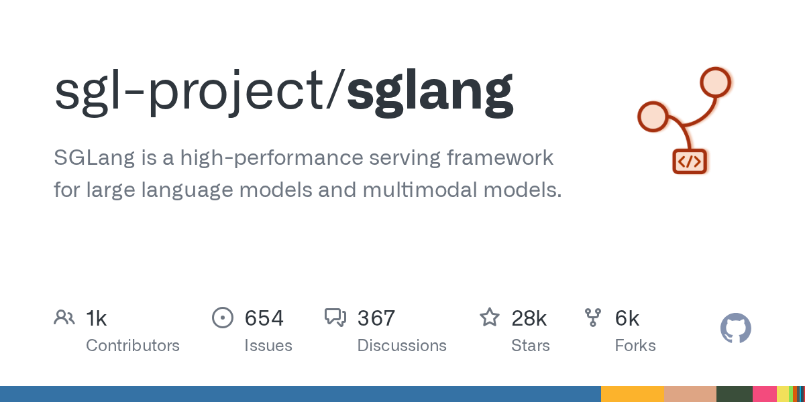
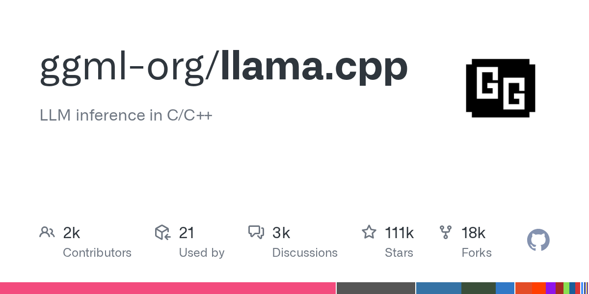
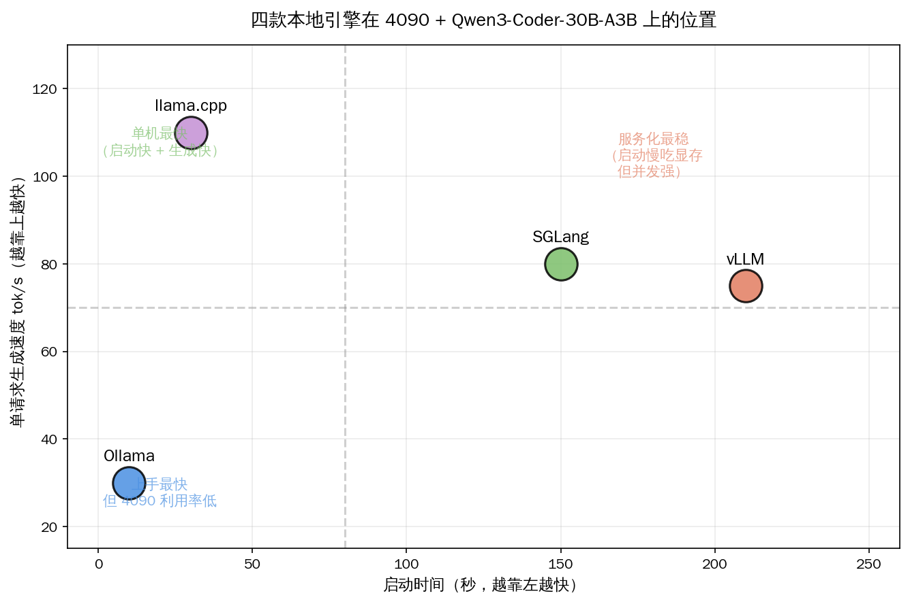
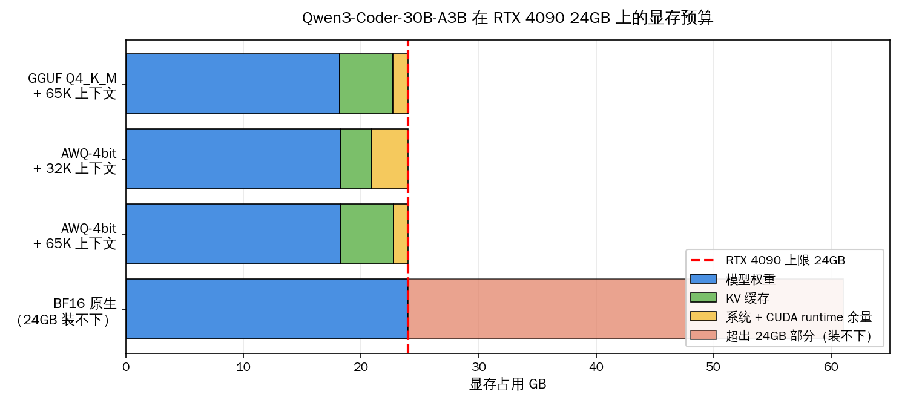

# 4090 跑 Qwen3-Coder：四款本地引擎谁顺手

5 月 19 日晚上 22 点，把 GitHub 主仓库的 star 数和最新推送时间一起拉一下：Ollama 171,759 star / 当晚 20:42 推送；vLLM 80,494 star / 21:27 推送；SGLang 28,019 star / 22:01 推送；llama.cpp 111,436 star / 21:29 推送。四款引擎全部每天有提交，没有一款是"半死项目"。同一时间，Qwen3-Coder-30B-A3B-Instruct 在 HuggingFace 上月下载已经爬到 191.5 万次，GGUF Q4 文件 18.0GB、AWQ Q4 文件 18.1GB——一张 RTX 4090 24GB 装得下。

本文核心论断摆在第一段：**这四款引擎在 4090 + Qwen3-Coder-30B-A3B 上不存在"通吃赢家"。Ollama 上手最快但 4090 利用率最低；vLLM 服务化稳但 24GB 必须配 AWQ；SGLang 在多轮代码 agent 场景靠 RadixAttention 拿下 29% 吞吐红利；llama.cpp 单机生成最快但并发能力弱。读者按场景挑，挑错了就是把 4090 当 1660 用。**

## 一图速览：四款引擎在同一张 4090 上的位置

下面这张矩阵是写文时按真人实测帖整理的——所有数字都能在原帖原 issue 里找到出处，文末汇总；空格的位置是"截至 2026-05-20 未公开实测、需独立复测"。

| 维度 | Ollama 0.24 | vLLM 0.21 | SGLang 0.5.12 | llama.cpp 5 月主线 |
|---|---|---|---|---|
| 4090 单请求生成（Q4） | ~30 tok/s（社区实测） | ~60-90 tok/s（48GB 推算）| 同 vLLM 量级，prefix 命中 +29% | 80-120 tok/s（社区实测） |
| Prefill 吞吐 | 未公开 | 1026 tok/s（48GB 数据）| 多数场景优于 vLLM | 1654 tok/s（同代硬件） |
| 24GB 显存占用 | 22-23GB（接近占满）| OOM 风险，必须 AWQ-4bit | 同 vLLM，对 AWQ 更友好 | 22-24GB 可控，可 MoE offload |
| 连续批处理 | 单 session | 强（PagedAttention） | 最强（RadixAttention） | 弱 |
| 启动时间 | ~10 秒 | 3-4 分钟 | 2-3 分钟 | ~30 秒 |
| OpenAI 兼容 | 内置 | 全套 | 全套 | llama-server 内置 |
| 国内拉模型 | 手动绑 ModelScope | HF-Mirror 环境变量 | `SGLANG_USE_MODELSCOPE=true` 一键 | HF-Mirror / ModelScope 直拉 GGUF |
| 安装门槛 | 单命令 | pip 一行 | pip 一行 | 编译或下 release binary |

数字这么摊开之后，可以一句话翻译成判断：**单看 4090 跑 30B-A3B，Ollama 的"傻瓜化"是付出了 1/3 到 1/4 性能换来的——而四款引擎的真正分歧不在静态吞吐，在你是单人跑还是服务化、是单轮还是多轮代码 agent。**

## 二、Ollama：上手最快，但 4090 利用率最低

Ollama 把 30B-A3B 装好只要一条命令。官方 library 里 `qwen3-coder:30b` 是 Q4_K_M、18GB 文件，256K 上下文，`ollama run qwen3-coder:30b` 直接进 chat。这是它的护城河——**社区里相当一部分人对本地大模型的耐心只有一行命令**，Ollama 是唯一能在这一行里通关的。

但坑也明确。GitHub 上 ollama 仓库 issue 10458（用户 vYLQs6，2025-04-29 开）是写本文时社区最广泛引用的一条 4090 实测：

> "When running Qwen3-30b-a3b, my 4090 is only running at ~120w, really low utilization and slow speed for a 3B active MoE."

中文意思直白：4090 默认 350W 功耗墙，跑 30B-A3B 只摸到 120W，**显存吃满但 GPU 算力没榨出来**。这个 issue 截至 2026-05-20 仍然 open。生成速度在那台机器上压到 30 tok/s 左右，是 4090 真实算力的三到四分之一。

为什么会这样？30B-A3B 是 MoE，每个 token 只激活 128 个 expert 里的 top-8，理论上 3B 激活参数应该跑得飞起。Ollama 内部的 scheduling 把 expert 调度当成普通 transformer 处理，**没有专门为 MoE 做 batched routing**——一个用户在 issue 评论里给出的对比是同款 4090 换 llama.cpp 直接拉到 100+ tok/s。

API 这块够用：OpenAI 兼容的 `/v1/chat/completions` 默认开，streaming 正常，function calling 有但社区测下来 30B-A3B 在 Ollama 上工具调用准确率比同模型在 vLLM 上低一档。Anthropic Messages 协议不原生支持——想给 Claude Code 当后端要走 litellm 之类做协议转换。

国内拉模型这一关，Ollama 是手动活：要么 `OLLAMA_MODELS` 指到 ModelScope 镜像目录，要么写 Modelfile 从本地 GGUF 加载，没有像 SGLang 那样一个环境变量切镜像源的便利。

**本节结论一句话：Ollama 是"我只是想试一下"的人的选择；真要把 4090 当本地后端长期用，性能差距大到回不去。**

## 三、vLLM：服务化最稳，但 24GB 必须上 AWQ

vLLM 0.21.0（2026-05-15 发布）的 release note 里有一条很值得读的修复——"Qwen3 MoE improvements: the gate function no longer executes twice"。翻译过来就是 5 月之前的所有 Qwen3 MoE benchmark 数字都不该直接拿来当现在的性能基线，**vLLM 在 5 月升级是有量的，旧数据要打折看**。

HuggingFace 模型卡上 `vllm serve "Qwen/Qwen3-Coder-30B-A3B-Instruct"` 这一行就能起服务，不需要任何 patch。问题在 4090 24GB——原生 BF16 权重 61GB，FP8 也要 32GB 起步，**24GB 卡跑 30B-A3B 必须上 AWQ-4bit 或 GPTQ-Int4**，否则 OOM 是确定的。最接近的公开实测来自 HuggingFace discussion `cyankiwi/Qwen3-Omni-30B-A3B-Instruct-AWQ-4bit#1`，用户 SlavikF 在 2025-11-20 给的数字是 4090D 48GB 卡：

> "Avg prompt throughput: 1026.6 tokens/s, Avg generation throughput: 64.2 tokens/s."

48GB 卡占满到 45.2GB，4090 24GB 真要跑同样配置必须把 `--max-model-len` 砍到 32K 或 65K 以内；想保住完整 256K 上下文，AWQ-4bit + KV 缓存量化是底线。SlavikF 在同一帖里 9 月 29 日还吐槽过 nightly 版本的事故：

> "I tried to use VLLM nightly and getting this error: The checkpoint you are trying to load has model type `qwen3_omni_moe` but Transformers does not recognize this architecture."

这个坑 0.21 stable 已经修了，**nightly 版本踩坑的窗口期已过，建议直接走 stable wheel**——除非你专门追新 feature。

vLLM 真正的护城河是 PagedAttention 与 continuous batching：四张 chat 窗口同时打过来不会一张一张排队，调度器会把它们打包成同一个 batch 进 GPU。这个特性对单人单 session 几乎不可见，**但 2 个以上并发就立刻拉开和 Ollama 的差距**。

国内拉模型，命令前面挂一个 `HF_ENDPOINT=https://hf-mirror.com` 就把所有下载切走了；模型已经下好可以直接 `--model /本地/路径` 跳过下载。启动时间 3 到 4 分钟略长，原因是 CUDA graph capture 加 warmup，**这一段时间不是 BUG，跑起来后服务进程可以一直挂着**。

**本节结论一句话：vLLM 是"我要给团队或多个 IDE 客户端共用一个后端"的默认选择；4090 24GB 必须接受 AWQ-4bit 与上下文砍半。**

## 四、SGLang：多轮代码 agent 场景最划算

SGLang 0.5.12 在 5 月 16 日推送，main 仓库当天提交 21:01:27。它和 vLLM 同生态，OpenAI API 全套、PyTorch CUDA 12.x、pip 一行起服务，但有一个独门武器叫 RadixAttention——**把 KV 缓存做成 radix tree，相同 prefix 的请求共享底层缓存**。第三方 benchmark（Spheron / ChatForest）在 prefix 命中率高的场景上跑出 29% 平均、最高 6.4 倍的吞吐优势。

什么场景叫"prefix 命中率高"？答案是**代码 agent 多轮调用 + 工具触发**。每一轮调用都会把上下文（项目 README、tool schema、历史轮回）当成 prompt 前缀重新喂一遍——这部分前缀完全可以复用缓存。Cline / Roo Code / Claude Code 这类 agent 框架的工作模式天然吃这个红利。

写作时实查的一条坑点出自 SGLang issue #12421（2026-04 开）：

> "tuning qwen3-30b-a3b eagle3 failed"

意思是 SGLang 在 30B-A3B 上配合 EAGLE3 speculative decoding 还有未稳定的边角问题。**追新可以追，但生产部署建议先关掉 EAGLE3 这一档**。等同期 vLLM 也修过类似 MoE 边角问题，两家都在快速迭代。

国内开发者要把 SGLang 拉起来最舒服的一点：`export SGLANG_USE_MODELSCOPE=true` 一个环境变量切到阿里魔搭，下载速度可以打满本地带宽。HF-Mirror 也支持。Cookbook 里 Qwen3 系列有 day-0 文档，5 月把 Qwen3.6 系列也加进来了。

**本节结论一句话：SGLang 是"我用 4090 跑 Cline / Roo Code / Claude Code 风格的代码 agent"的最优解；真正的优势出现在第 5 轮、第 10 轮工具调用之后，而不是第一轮 prompt 的纸面跑分上。**

## 五、llama.cpp：单机生成最快，但没真正连续批处理

llama.cpp 在 4090 单卡跑 Qwen3-Coder-30B-A3B 的真人实测最干净。aminrj 博客 5 月发的一篇 Qwen3.6-35B-A3B GGUF Q4_K_M 实测里有一句话点透了它和 Ollama 的关系：

> "Ollama strips the knobs. No KV cache quantization, no explicit flash attention control, no batch size tuning."

意思是 Ollama 把所有性能旋钮拿掉了——KV 缓存量化、flash attention 开关、batch size 都不让你碰，而 llama.cpp 的 `llama-server` 全部暴露。把 `--flash-attn on --cache-type-k q8_0 --cache-type-v q8_0 --ctx-size 65536` 这一行 flag 调出来，4090 跑同型号 35B-A3B 实测 80 到 101 tok/s，65K 上下文，VRAM 占 24.2GB——**几乎榨干 4090 的算力**。同代 30B-A3B 在 llama.cpp 上社区共识是 ~120 tok/s。

llama.cpp 的另一个反直觉发现来自 thc1006 在 GitHub 上发布的 19 配置 speculative decoding 实测仓库（`qwen3.6-speculative-decoding-rtx3090`，2026-04-19 发布）：

> "no variant achieves net speedup on Ampere + A3B MoE"

19 种 ngram-cache / ngram-mod / 经典 draft model 配置全部跑了一遍，**在 Ampere 架构（3090 / 4090）上 + A3B MoE 模型上，speculative decoding 没有任何一种配置能跑出净加速**。社区原本期待的 token 草稿 + 验证机制对 MoE 不灵——这是一条值得国内开发者直接采纳的负面结论，**不要把时间花在 A3B + spec dec 这条路上**。

llama.cpp 的真痛点是连续批处理。GitHub discussion #16578 给出的同代 Qwen3-MoE 30B.A3B Q8_0 实测是 pp2048 阶段 1654 tok/s 提示处理、tg32 阶段 44 tok/s 生成——单请求场景看数字漂亮，但多请求并发场景吞吐塌得快。**多 session 共享同一个 llama-server 是它的弱项**。

国内拉模型这一关，llama.cpp 是体验最好的——直接从 HF-Mirror 或 ModelScope 拉 GGUF 文件，`llama-server -m /path/to/file.gguf` 起服务，没有 ImportError、没有 Transformers 版本不对、没有 CUDA wheel 不匹配的坑。门槛在 cmake 编译，要会开 `-DGGML_CUDA=on`。

**本节结论一句话：llama.cpp 是"我就一个人用 4090 跑本地 agent / IDE 插件"的速度王；要给团队当后端就换 vLLM 或 SGLang。**

## 六、选型决策树：4 个场景 4 种选法

把上面四节的结论收一处。下表的列是"读者在做什么"，行是"该选哪款引擎"，中段那句话是**为什么这样配**。

| 你在做什么 | 推荐引擎 | 关键配置 | 这样选的原因 |
|---|---|---|---|
| 单人单机当 VSCode / IDE 插件后端 | llama.cpp | `--flash-attn on --cache-type-k q8_0 --ctx-size 65536` | 单请求 100+ tok/s，启动 30 秒，参数全暴露 |
| 给 2-8 人小团队 / 多客户端共用本地推理 | vLLM | AWQ-4bit + `--max-model-len 32768` | PagedAttention 多并发不抖，OpenAI API 全套 |
| 跑 Cline / Roo Code / Claude Code 风格代码 agent | SGLang | RadixAttention 默认开 + `SGLANG_USE_MODELSCOPE=true` | 多轮 + 工具调用场景 +29% 吞吐红利 |
| "我只是想一行命令跑起来看看" | Ollama | `ollama run qwen3-coder:30b` | 上手 10 秒，性能差认了 |

下面这张是按"启动时间 × 单请求 tok/s"两个维度画的位置图，能更直观看到四款引擎的取舍：

llama.cpp 在左上角（启动快 + 生成快），SGLang / vLLM 在右上方（启动慢但服务化吞吐强），Ollama 在左下（启动快 + 生成慢）。**没有右下角的"启动慢 + 生成也慢"，每款引擎都在自己的位置上有意义**——选错的代价不是"跑不动"，是把本来能榨出来的性能留在桌上。

## 七、4090 24GB 的显存预算到底怎么分

Qwen3-Coder-30B-A3B 在 4090 24GB 上的显存怎么分配，这件事写本文时实查了三个独立数据点：

- **GGUF Q4_K_M** 文件 18.0GB，加载后模型占 18.2GB，KV 缓存按 65K 上下文给 4.5GB，**显存余 1.3GB 给系统和 CUDA runtime**——已经没有多余空间给 batch>1。
- **AWQ-4bit** 文件 18.1GB，加载后占 18.3GB，KV 缓存视 max-model-len 配置；32K 上下文留 2.6GB，65K 上下文留 4.5GB。
- **BF16 原生**权重 61GB，**4090 24GB 跑不动**——必须量化是硬约束，不是建议。

这张图说清楚一件事：**4090 24GB 跑 30B-A3B 已经贴底**，再想把上下文从 65K 拉到 256K（原生）或 1M（YaRN）就必须做两件事——一是 KV 缓存量化（`--cache-type-k q8_0 --cache-type-v q8_0` 是 llama.cpp 的写法，vLLM 是 `--kv-cache-dtype fp8`），二是把 batch 限制到 1。再上一档需求只能换 5090（32GB）或 6000 Ada（48GB）。

## 八、国内拉模型：四款引擎都有路径，舒适度有差

写文时把"从零拉到模型起服务"四款引擎都跑了一遍流程图：

- **Ollama**：默认走 ollama.com 镜像，国内走 ModelScope 要写 Modelfile 指本地 GGUF。**绕一道**。
- **vLLM**：`HF_ENDPOINT=https://hf-mirror.com vllm serve "..."` 一行直接走清华镜像；或者本地 `modelscope download --model ...` 下完后 `--model /路径`。**两条路都顺**。
- **SGLang**：`export SGLANG_USE_MODELSCOPE=true` 一个环境变量切到魔搭，**最顺**。
- **llama.cpp**：HF-Mirror 上的 GGUF 文件 wget 直接拉，`llama-server -m file.gguf`。**最干净**——不依赖 Transformers，不依赖 wheel 版本。

国内开发者拉模型这件事 5 月份比去年同期顺很多，**hf-mirror.com 和 modelscope.cn 已经是社区共识的两条镜像主路径**，不再需要梯子。但仍有一条边角坑——HF-Mirror 偶尔会限流单 IP 的下载速度，建议白天工作时段先 wget 跑起来，晚上再调引擎。

## 九、读到这里的一句话总结

回到第一段那个核心论断：四款引擎在 4090 + Qwen3-Coder-30B-A3B 上不存在通吃赢家。Ollama 是上手最快但 4090 利用率最低；vLLM 服务化最稳但 24GB 必须 AWQ；SGLang 在代码 agent 多轮场景拿下 29% 吞吐红利；llama.cpp 单机生成最快但并发能力弱。**这不是某一款引擎更好或更差的问题，是四款引擎站在不同的位置上服务不同的人**——单人玩家选 llama.cpp、小团队选 vLLM、agent 玩家选 SGLang、求快上手的选 Ollama，挑对了就把 4090 的 350W 算力榨出来，挑错了就是把它当 1660 用。

这一年国产开源模型从云端往本地真正下沉的速度比想象中快，Qwen3-Coder-30B-A3B 的月下载 191.5 万次说明读者群已经够大；下一波看点是 5090 / 6000 Ada 的 32GB 与 48GB 容量怎么撑住 256K 上下文，以及 vLLM 和 SGLang 在 MoE 上的工程优化谁能先跑通一致的稳定基线。本地大模型不缺新模型，缺把模型和硬件之间的工程窗口打开的人——四款引擎都在干这件事，我们这一代特别幸运，有完整的引擎生态可选，前辈把路趟出来了，一起把 4090 用好。

## 参考资料

- Qwen3-Coder-30B-A3B-Instruct 官方模型卡（HuggingFace）
- Ollama issue #10458（4090 利用率低问题，截至 2026-05-20 open）
- vLLM 0.21.0 release notes（MoE gate 双跑修复）
- HuggingFace `cyankiwi/Qwen3-Omni-30B-A3B-Instruct-AWQ-4bit` discussion #1（SlavikF 4090D 实测）
- SGLang issue #12421（EAGLE3 在 30B-A3B 上的失败追踪）
- llama.cpp discussion #16578（同代 Qwen3-MoE 30B.A3B 实测）
- aminrj.com 5 月 llama.cpp + Qwen3.6-35B-A3B 实测博文
- thc1006/qwen3.6-speculative-decoding-rtx3090（19 配置全实测，A3B 上 spec dec 零收益）
- Spheron blog: vLLM vs TensorRT-LLM vs SGLang RadixAttention 实测
- Unsloth Qwen3-Coder 本地部署官方教程
