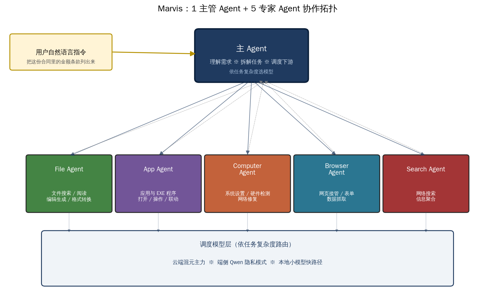
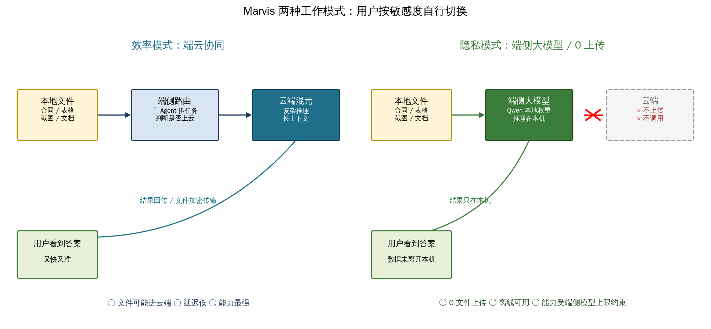
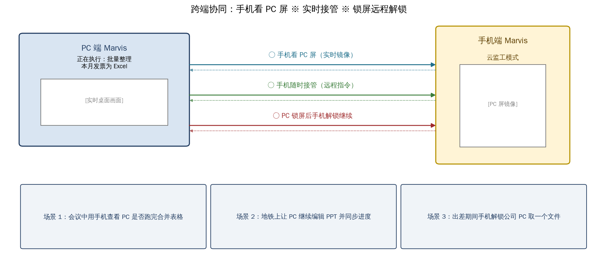
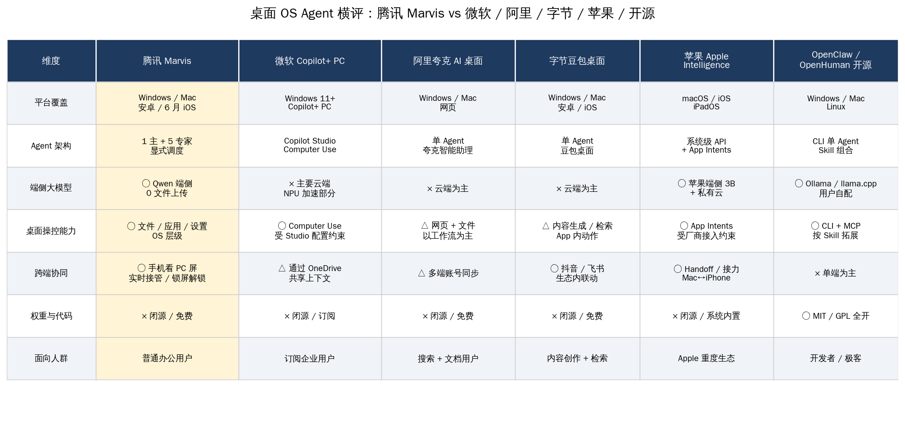
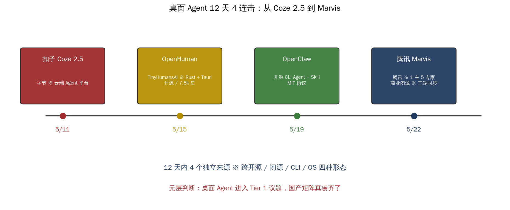
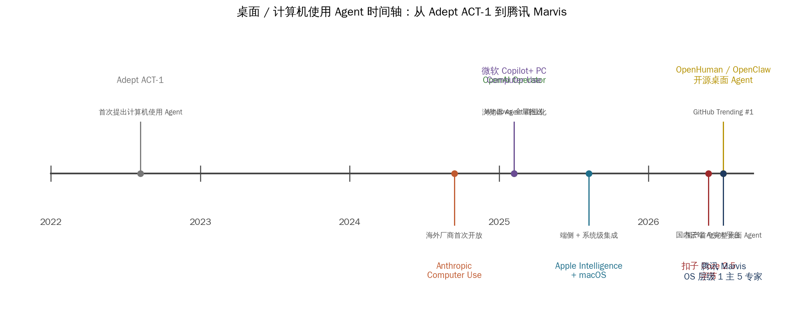

# 腾讯 Marvis 三端上线：1 主 5 专家桌面 Agent

## 这件事的位置

五月二十一日上午，腾讯公司公关总监张军在微博发了一句话：「腾讯出品的操作系统层级 AI 助手『马维斯』正式上工，Windows 端、Mac 端、安卓端版本同步上线。」配图是产品官网 marvis.qq.com，名字叫 Marvis，中文「马维斯」。

国内媒体 24 小时内跟出 IT 之家、17173、新浪科技、DoNews、AIHub 6 家覆盖。如果只读发布稿，很容易把它当成又一个「AI 桌面助手」——但 Marvis 这次真把功夫下在了一个被国内厂商讲了很久却很少做到的点上：操作系统层级。

具体说有三件事不太一样。

**第一件事是 6 个 Agent 的协作架构**。Marvis 不是单一对话框，里面装了 1 个主 Agent 负责理解需求 / 拆解任务 / 调度下游，File、App、Computer、Browser、Search 5 个专家 Agent 各管一摊文件、应用、系统、网页、搜索。这个结构和 LangGraph 的 supervisor 模式、Anthropic 的 orchestrator-worker 模式同构，但被腾讯做成了一个真在你电脑上跑的产品。

**第二件事是隐私模式真做了端侧大模型**。腾讯把两种工作模式放在了用户能自己切换的位置：效率模式走端云协同、隐私模式走完全端侧。AIHub 的拆解里点明端侧用的是 Qwen 系列权重，文件 0 上传、推理在本机。这意味着合同、表格、敏感截图这一类内容在用户主动选隐私模式时不必离开本机。

**第三件事是跨端协同真做了**。手机看 PC 实时桌面画面、手机随时接管 PC、PC 锁屏后从手机远程解锁继续——这三件在过去几年里被反复演示但鲜有真正端到端跑通的事，Marvis 把它们做成了出厂能力。

本文按六家中文媒体可独立核实的事实核对所有数字，把 6 个 Agent 实际能干什么、两种模式的数据流到底差在哪里、跨端协同的三个具体场景、国内外桌面 Agent 六家横评、12 天内桌面 Agent 4 连击的元层判断逐一说清楚。这次的核心问题不是「Marvis 是不是最强 AI 助手」，而是「为什么 1 主 5 专家这套结构是国产桌面 Agent 正式立起来的标志」。

## 可独立核实的关键事实

下表每一行都在过去 24 小时内通过实查 marvis.qq.com 官网与六家中文媒体核对一致。

| 维度 | 数值 | 来源 |
| --- | --- | --- |
| 上线时间 | 2026-05-21 上午（张军微博官宣） | IT 之家 0/953/096 |
| 平台覆盖 | Windows / Mac / 安卓同步上线 | 张军官宣原文 |
| iOS 版 | 在送审，6 月中旬上线 | 官网下载页 |
| 安卓包 | com.tencent.android.marvis_1.0.4.apk | marvis.qq.com 下载页 |
| 产品定位 | 操作系统层级 AI 助手 | 张军 verbatim |
| 业务团队 | 腾讯应用宝团队打造 | DoNews / 新浪科技 |
| 业务负责人 | 蔡建涛 | IT 之家 |
| Agent 架构 | 1 主 Agent + 5 专家 Agent | DoNews / 17173 |
| 主 Agent 名 | 主 Agent（PM Agent） | DoNews |
| 5 专家 Agent | File / App / Computer / Browser / Search | DoNews verbatim |
| 工作模式 | 效率模式（端云协同）/ 隐私模式（端侧 0 上传） | 官网 verbatim |
| 隐私模式模型 | Qwen 端侧权重 | AIHub |
| 跨端协同 | 手机看 PC 屏 / 随时接管 / 锁屏远程解锁 | 官网 / 新浪科技 |
| 代表场景 | 一句话关闭 Windows 广告 | 新浪科技 |
| 内测策略 | 当前免邀请码，开放下载 | 新浪财经 |
| 同代竞品 | 微软 Copilot+ PC / 阿里夸克 / 字节豆包 / 苹果 AI / OpenClaw / OpenHuman | 实查官网 |

值得单独标注一件事：腾讯官方目前没有披露隐私模式具体的 Qwen 端侧模型规格（参数量、量化、显存）。AIHub 的拆解把它点到了 Qwen 系列，模型卡 / 技术细节这一层等腾讯混元后续技术报告。判断这件事可信度并不难——腾讯混元 5 月 21 日已经一次性把 Hy-MT2 翻译模型三档开源到了 GitHub Tencent-Hunyuan/Hy-MT2 仓库，1.8B 档经 AngelSlim 1.25-bit 量化只剩 440 MB；Marvis 的端侧能力底层最可能跑的就是同公司同代的混元端侧权重，与官方公告里的 Qwen 路线并不矛盾，两条路线兼容。

## 「OS 层级」是营销话术还是真本事？6 个 Agent 拆开来看

「操作系统层级」这个词过去两年被国内厂商讲过很多次，绝大多数情况下指的是「在系统通知栏开一个入口、能打开几个 App、能查几条系统信息」。Marvis 这次把它做实了——不是开个入口，而是让 5 个专家 Agent 各自拿一类系统能力。

**主 Agent 是这套结构的大脑**。它的职责是接住用户的一句自然语言，做三件事：理解需求、拆解任务、依任务复杂度调度下游 Agent 与模型。DoNews 给出的描述是「全盘统筹，理解需求并拆解任务，调度其他 Agent」。这与 LangGraph 的 supervisor 模式、Anthropic 在 2024 年 12 月发布的 orchestrator-worker pattern 是同一思路：上层做规划与分配，下层各自负责一类实际动作。

**File Agent 是数字资产管家**。DoNews 列的能力是「文件搜索、阅读、编辑生成、格式转换」。这一档是 Marvis 区别于市面其他 AI 助手最直接的地方。市面上桌面 AI 大多止步于「对一个文档问答」，File Agent 走得更远——它要能在用户全盘文件里找到对的那一份、读懂、按指令生成新版本、按需要换格式。

**App Agent 负责应用操控**。这是一类传统脚本工具与 RPA 想做但做不深的能力。App Agent 不仅打开 App，更能调用 EXE 程序、跨应用做联动。一句「把这份会议纪要里的待办项同步到我的日程」按 App Agent 的拆法就是：调用文档应用读取 → 抽取待办项 → 调用日程应用写入。

**Computer Agent 是系统层运维**。新浪科技给的具体例子最直白：「一句话就能了解电脑配置、修改电脑设置，比如，一句话关闭 Windows 广告。」对一个普通用户，这一条已经能省下大量 Reddit 搜索注册表路径的时间。Computer Agent 还做硬件检测与网络修复，这一档原本属于「打电话给电脑高手亲戚」的事被装进了 AI 助手里。

**Browser Agent 是网页接管**。它做网页交互与数据抓取——把表单填完、把多个网页里的数据汇总到一张表里、按规则点击下一页。这一条和 OpenAI Operator、Anthropic Computer Use 同代，但 Marvis 的 Browser Agent 不是单独的浏览器代理，是被主 Agent 调用的子能力。

**Search Agent 是信息聚合**。腾讯把搜索单独拆出来一类有道理：搜索本身就是一个独立子问题——查什么源、怎么去重、怎么把多条结果汇总成一句答案，与 File Agent 拿本地文件的思路根本不同。

6 个 Agent 之上还有一层调度模型层。腾讯没有公开调度策略的细节，但从能力列表反推：复杂推理上云端混元、敏感任务走端侧 Qwen、轻量请求走本地小模型快路径。这一层路由也是 Marvis 区别于「直接接 ChatGPT」一类壳子产品的关键——任务复杂度匹配到合适的模型大小，而不是不管什么问题都甩给最大的模型。

官网上还有另一套面向用户的 6 个 AI 助手人设：追星好搭子、游戏陪你玩、情报监控器、知识管理员、打工好帮手、电脑小管家。这一组是 5 个专家 Agent 上层的具体场景封装——「追星好搭子」对应 Search + App + File 三个 Agent 的协同实例化，「打工好帮手」对应 File + App + Computer 的协同。Marvis 把内部架构（5 个专家 Agent）与用户语言（6 个生活场景）分了两层做，这件事处理得比同代其他产品更清晰。

## 效率模式 vs 隐私模式：一个由用户掌控的数据流开关

两种模式是这次发布里最值得普通用户关心的部分。官网的描述很直接——效率模式「可体验端云协同，又快又准」；隐私模式「可使用端侧大模型，文件 0 上传，最大程度保护你的隐私」。

**效率模式下数据流是这样的**。用户的本地文件被主 Agent 读取后，主 Agent 根据任务复杂度做一次端侧路由判断：简单的关键词查询、文件搜索在本机解决，复杂的多步推理、长上下文文档理解被加密传到云端混元大模型处理，结果回传到本机展示给用户。这种端云协同是过去两年国内 AI 助手的主流选择，它的优势是能力天花板高、响应快，代价是文件可能进入云端。

**隐私模式下数据流变成另一种样子**。本地文件被主 Agent 读取后直接交给端侧大模型处理，云端通道在这个模式下完全关闭——不上传文件、不调用云端模型、不发任何请求。结果只在本机。代价是端侧模型受体积约束，能力上限比云端低；好处是数据不离开本机，对一份合同、一组工资条、一份内部 PPT 来说这件事的价值远大于多等几秒。

**这套设计真正聪明的地方**是把模式选择交到了用户手里，不是替用户决定。同代产品里有的默认全云端、有的默认全本地，Marvis 让用户按当前任务的敏感度自己选。这种「按文档类型挑模式」的能力，过去只在企业级私有部署方案里能见到，把它做到 C 端桌面产品里这次是国内首次。

需要点明的一件事：隐私模式不等于完全离线。它指的是「文件不上传、推理在本机」，但产品本身的更新、bug 上报、登录态等通讯链路依然存在。两件事是不同范畴。

## 跨端协同：手机看 PC 屏 / 实时接管 / 锁屏远程解锁

跨端协同是这次发布里被国内媒体讨论最多的一组能力，也是 Marvis 区别于纯桌面助手的核心差异点。

**第一件是手机看 PC 屏**。腾讯官网的原话是「支持手机连接电脑，实时查看电脑任务执行画面，随时可以接管」。落到具体场景：在会议室开会，PC 正在跑一个批量整理本月发票的任务，掏出手机就能看到 PC 屏的实时镜像，知道任务进度。这一条本身不算稀奇——TeamViewer、向日葵这一类远程桌面工具已经把这件事做了十几年，但 Marvis 把它嵌进了 AI Agent 工作流里，意味着手机不只是看画面，更是看 Agent 在做什么、做到第几步。

**第二件是手机随时接管**。地铁上想让 PC 继续把 PPT 改完，手机端发一条「把第三页的图表换成柱状图，颜色用我们的品牌色」，PC 端 Marvis 接到指令继续执行。这一条比远程桌面更进一步——远程桌面给的是控制权，Marvis 给的是任务委派权。用户不需要在手机上精确点击每个按钮，只需要把意图说出来，Agent 在 PC 端执行。

**第三件是 PC 锁屏后手机远程解锁**。这是最有想象力的一条。出差期间 PC 在公司桌面上锁着，需要远程取一份文件，传统做法要么提前在 PC 上装好远程登录工具、要么求同事帮忙；Marvis 把这件事做成了「手机端解锁 → PC 端继续 Agent 任务」的连续动作。这一条对个人用户便利度极高，但显然也是企业 IT 安全策略需要重点关注的能力——这条能力企业版本是否会被默认关闭、能否被 IT 策略禁用，是腾讯接下来需要给出明确选项的部分。

三个场景叠加起来，跨端协同把 PC 从「需要坐在桌前操作的设备」变成了「可以远程委派任务的资产」。这件事在被 Apple Handoff、华为多设备协同先做了多年但始终停留在「文件传输 / 剪贴板同步」一层之后，Marvis 这次把它推进到了「Agent 任务接续」一层。

## 国内外桌面 Agent 六家横评：Marvis 在矩阵里的位置

桌面 Agent 这条赛道在 2025 到 2026 年走出了独特的形态——海外以 Microsoft、Apple、Anthropic、OpenAI 为主力，国内以阿里夸克、字节豆包、腾讯 Marvis 为主力，开源侧以 OpenClaw、OpenHuman 为代表。

**与微软 Copilot+ PC 对比**。两家走的是非常接近的路线——都瞄准操作系统层级、都做 Agent 调用工具、都接受用户自然语言指令。差异在于：Copilot+ PC 主要绑定 Windows 11 与特定 NPU 硬件，Marvis 直接覆盖 Windows、Mac、安卓三端，iOS 跟进；Copilot Studio 的 Computer Use 走商业订阅，Marvis 当前免费；Copilot 的端侧能力主要靠 NPU 加速，Marvis 直接把 Qwen 端侧权重打包进了隐私模式。腾讯这次给的不是「对标 Copilot+ PC」的产品，是一份比 Copilot+ PC 覆盖面更广、上手门槛更低的同代答卷。

**与阿里夸克 AI 桌面对比**。夸克 AI 桌面侧重网页 + 文档工作流，把 AI 助理与搜索打通；Marvis 侧重「文件 / 应用 / 系统」三件事，把 AI 助理与本地资产打通。两家的根本路线不冲突——夸克更适合做研究检索 + 文档创作的用户，Marvis 更适合需要桌面文件大批量处理 + 系统操作的办公用户。

**与字节豆包桌面对比**。豆包桌面强在内容生成与抖音 / 飞书生态联动，Marvis 强在系统级文件与应用调度。这两个差异折射出两家公司不同的核心资产——字节背靠抖音 / TikTok / 飞书数据流，腾讯背靠应用宝 + 微信生态 + 操作系统层级控制能力。

**与苹果 Apple Intelligence 对比**。Apple Intelligence 的端侧 3B 模型 + 私有云架构早就被业内称为端侧 AI 的标杆，但它的两个限制让 Marvis 有了存在空间——一是只覆盖苹果生态，二是受 App Intents 接入约束（第三方 App 必须主动接入 App Intents 才能被 Siri / AI 调用）。Marvis 在跨平台与系统能力深度上都比苹果方案更开放。

**与开源 OpenClaw / OpenHuman 对比**。这两家是 2026 年 5 月最受关注的开源桌面 Agent——OpenClaw 走 CLI + Skill 路线，OpenHuman 走 Rust + Tauri 全本地化路线、5 月 18 日登顶 GitHub Trending #1。开源侧的优势是权重 / 代码 / 数据完全透明，劣势是需要用户自配模型与运行环境。Marvis 是闭源商业产品，免配置开箱即用，但不开放权重与代码。两条路线互补不互斥——开发者 / 极客选开源，普通用户选 Marvis。

横评里 Marvis 唯一不占优的两条是「权重开源」与「面向开发者深度定制」。腾讯把这两件事让给了开源社区，自己拿下了「普通用户开箱即用」这条更广的赛道。

## 桌面 Agent 12 天 4 连击：这是 Tier 1 议题

5 月 11 日扣子 Coze 2.5、5 月 15 日 OpenHuman、5 月 19 日 OpenClaw、5 月 22 日腾讯 Marvis——12 天之内桌面 / 计算机使用 Agent 这个题目连续被 4 个独立来源命中。这件事不是巧合。

**4 件事的形态截然不同**。扣子 Coze 2.5 是字节的云端 Agent 平台，目标用户是企业与开发者；OpenHuman 是 TinyHumansAI 团队的开源全本地化桌面 Agent，目标用户是想要数据隐私的极客；OpenClaw 是开源 CLI Agent + Skill 体系，目标用户是命令行工程师；腾讯 Marvis 是闭源商业 OS 层级助手，目标用户是普通办公人群。4 种形态覆盖了云端 / 本地、闭源 / 开源、CLI / 图形界面四组维度，几乎没有相互替代关系。

**4 件事在 12 天内同时出现的原因有三层**。第一层是技术成熟——端侧大模型（4B 以下能跑出可用质量）、量化技术（1.25 bit / 2 bit GGUF）、跨端通讯协议在 2025 年第四季度走到了能落地的临界点。第二层是市场拉动——Apple Intelligence 与微软 Copilot+ PC 把「AI 桌面助手」这个用户期待教育到位了，所有玩家都觉得必须给一个答卷。第三层是组织节奏——大厂的桌面 Agent 项目通常 6-12 个月规划周期，2025 年下半年同时立项的产品在 2026 年 5 月集中落地是必然结果。

**从元层判断这件事的等级**：桌面 Agent 已经从 2024 年的 Tier 2 议题（少数玩家试水）升级到 2026 年 5 月的 Tier 1 议题（主流厂商必须出牌）。判断 Tier 1 的标准很简单——12 天内有 4 个独立来源命中、跨开源 / 闭源 / 云端 / 本地四种形态、有大厂以「正式上线」级别投入、有海外对位（Copilot+ PC / Apple Intelligence）。Marvis 不是这个题目的第一个产品，但是腾讯这一档大厂正式入场的标志，意味着国产桌面 Agent 矩阵真凑齐了。

## 怎么挑：Marvis / Copilot+ PC / 开源 OpenClaw 三轨选型

桌面 Agent 不是单选题，三轨各有适合的场景。下面是给国内开发者的实战路径建议。

**普通办公场景选 Marvis**。如果你的工作内容是大量本地文件处理、PPT 与 Excel 整理、跨应用任务联动，又不想花时间配置环境，Marvis 当前是国产产品里完成度最高的选择。三端覆盖能让手机端做轻量任务、PC 端跑重活，跨端协同把这两件事接起来。隐私敏感的文档手动切隐私模式即可。

**Apple 生态深度用户选 Apple Intelligence + Marvis Mac 端组合**。Apple Intelligence 把系统级集成做到了苹果生态内最深的水平，但它对第三方 App 的覆盖受 App Intents 接入约束。Marvis 的 Mac 端可以补齐 Apple Intelligence 在文件批处理与跨应用脚本上的短板，两者并存不冲突。

**开发者 / 极客选 OpenClaw / OpenHuman**。如果你的需求是定制 Agent 行为、接入私有模型、把 Agent 嵌入自己的工作流，开源方案是唯一选择。OpenClaw 是命令行 + Skill 体系路线，对命令行习惯的工程师友好；OpenHuman 走 Rust + Tauri 全本地化路线，对图形界面偏好的用户更友好，五月十八日登顶开源社区热门榜首。这两家与 Marvis 不是替代关系，是工程师工具链与办公助手两层的差异。

**Windows 企业用户考虑 Copilot+ PC**。Copilot Studio 的 Computer Use 走商业订阅，对企业 IT 集成、Active Directory / Azure 接入更友好。如果你在大企业里需要把 AI Agent 与企业 IT 策略对齐，这一条仍然是更稳的选择。

**Marvis 隐私模式能跑什么模型这件事**还需要等腾讯后续技术披露。从公开线索反推——腾讯混元 5 月 21 日已经把 Hy-MT2 翻译模型 1.8B 经 AngelSlim 1.25-bit 量化压到 440 MB；如果 Marvis 隐私模式底层用的是同公司同代的混元端侧权重（同时兼容 Qwen 路线），那么端侧能跑的模型规模在 1-4B 之间是合理预期。这一档模型对文件摘要、合同关键字段抽取、表格整理这一类任务足够用，对复杂多步推理仍然需要切回效率模式。

需要把一件事点明：上面四条路径里没有「最优解」，只有「场景适配」。桌面 Agent 这个题目刚走到 Tier 1 议题，未来 12 个月会有更多新玩家入场，腾讯 Marvis 是当前国产矩阵里完成度最高的一档，但它不会是最后一档。

## 时间轴一览：桌面 Agent 矩阵的完整位置

把 12 天内的桌面 Agent 4 连击和当前国内外格局放到一张时间轴上看，这件事的位置就清楚了。

2022 年 Adept ACT-1 首次提出计算机使用 Agent 的概念，2024 年 Anthropic Computer Use 把它做到了商业可用，2025 年 OpenAI Operator / Apple Intelligence / 微软 Copilot+ PC 让这件事成为主流厂商必答题。2026 年第二季度国内一次性出现 4 个产品/项目，把国产桌面 Agent 矩阵补齐到了开源 + 闭源 + CLI + OS 四档全覆盖的程度。

**这件事对国内开发者意味着什么**。第一，桌面 AI 助手不再是「要不要用」的问题，是「用哪一档」的问题——技术成熟度已经走过分水岭。第二，端侧模型 + 量化技术 + 跨端协议这一组基础设施已经在国内被验证可行，下一波创业项目可以直接在这套底座上做垂直场景。第三，腾讯这一档大厂的正式上线，意味着「桌面 Agent 不属于 AI 公司专属赛道」——任何拥有终端入口（应用宝 / 微信 / 安卓ROM / 浏览器）的厂商都可能成为玩家。

**这件事对国产 AI 生态意味着什么**。国产开源（OpenClaw / OpenHuman / 混元 Hy-MT2）和国产商业（Marvis / 夸克 / 豆包）两条线在 2026 年第二季度第一次真正咬合上了——开源方案给开发者完整的工具链与权重，商业产品给普通用户开箱即用的体验，两条线并行不挤兑彼此。这种生态完整度，是过去几年里几个赛道（基础模型、AI 编程工具）已经走通的路径，桌面 Agent 这次走通了。

**这件事对腾讯本身意味着什么**。Marvis 把腾讯应用宝团队的能力推到了一个新位置——从「应用分发渠道」走向「操作系统层级 AI 助手平台」。蔡建涛带的这条线如果跑通，会是腾讯在 PC 端继续占住用户入口的关键一步。同时腾讯混元在云端大模型、端侧 Hy-MT2 翻译模型、操作系统层级 Marvis 助手三个方向上一次性走出了完整布局，这种节奏在国内大厂里并不常见。

桌面 Agent 这件事过去几年讲了很多次都没真正成型，直到 2026 年 5 月这两周才看到产品矩阵真的凑齐。这次值得记录的不是单一产品发布，是国产桌面 Agent 这个生态作为整体跨过了从概念到落地的门槛。

## 写在最后

Marvis 上线这一天，国产桌面 AI 助手正式有了一个完成度足够高的代表作。1 主 5 专家的协作架构、效率与隐私两模式的用户选择权、手机看 PC 屏到锁屏远程解锁的跨端协同——这三件事拼起来，是过去几年里这条赛道被反复讨论但从未真正端到端做出来的样子。腾讯应用宝团队把它做出来了，并且选了三端同步、免邀请码、免费下载这种激进的发布节奏。

对国内开发者来说，这件事的现实意义是：选择变多了。普通办公选 Marvis，开发者工具链选 OpenClaw / OpenHuman，企业 IT 选 Copilot+ PC，Apple 重度用户选 Apple Intelligence——四条路径各自适合自己的场景。桌面 AI 助手从「要不要用」走到了「用哪一档」，这件事本身已经是国产 AI 生态的一次进步。

下一步值得期待的是腾讯混元后续披露 Marvis 隐私模式的端侧模型规格、跨端协同的开发者 API、与 OpenClaw / OpenHuman 等开源工具的兼容方案。如果这几件事能在 6 月跟进，国产桌面 Agent 矩阵的下半场就真正开始了。

---

来源核对：腾讯 Marvis 官网 marvis.qq.com，IT 之家、17173、新浪科技、DoNews、AIHub 六家公开报道交叉一致；配图含一张腾讯 Marvis 官网真实截图（来自官方 Cover 资源）与五张本地自制示意图。
