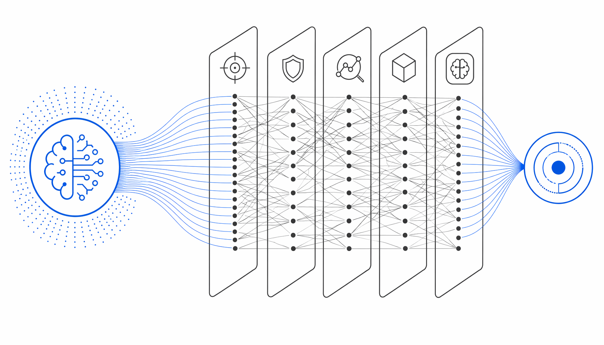

GitHub 上一个叫 mukul975 的开发者，3 月 27 日发布了一个让我忍不住熬夜翻完的项目：754 条结构化网络安全技能，专门给 AI 智能体用的。

不是那种“AI 安全最佳实践”的鸡汤文档。每条技能都是实打实的操作流程——比如怎么用 Volatility3 分析可疑内存转储、哪些 Sigma 规则能抓到 Kerberoasting 攻击、跨三个云厂商做 breach 范围界定该按什么顺序查。这些东西，一个初级分析师得在 SOC 里泡两年才能攒出来。现在你克隆这个仓库，指向 Claude Code 或 Cursor，AI 就能直接调用。

让我觉得这事有意思的，是它的映射设计。754 条技能同时挂到了五套框架上：MITRE ATT&CK v18（200+ 攻击技术）、NIST CSF 2.0（22 个安全治理类别）、MITRE ATLAS v5.4（AI/ML 对抗威胁）、D3FEND v1.3（267 种防御对策）、NIST AI RMF 1.0（72 个 AI 风险管控子项）。拿其中一条“恶意软件网络流量分析”举例，它一次性打上了 T1071（ATT&CK）、DE.CM（NIST CSF）、AML.T0047（ATLAS）、D3-NTA（D3FEND）、MEASURE-2.6（AI RMF）五个标签。一条技能，五份合规检查项直接勾掉。

这背后是 agentskills.io 的标准格式：YAML 头信息做亚秒级检索，结构化 Markdown 写分步执行逻辑，reference 文件放深层技术上下文。不是脚本合集，是决策工作流。覆盖 26 个安全领域，从云安全（60 条，AWS/Azure/GCP 加固）、威胁狩猎（55 条，假设驱动+离地攻击检测）到 OT/ICS 安全（28 条，Modbus/DNP3/IEC 62443 防御），每条都是真实从业者的操作路径。而且已经能在 20 多个平台上跑，包括 GitHub Copilot、OpenAI Codex CLI、Gemini CLI。

作者同时在做一件事：GARS-2026 全球智能体就绪度调查，60 道题，10 分钟，匿名，SRH Berlin 监督。填完给 50 个 Casky Token 换 casky.ai 的早期访问权。问卷问的是 MCP 服务器、工具调用、治理机制、人机协同这些具体问题——说白了，他在收集安全从业者到底有没有准备好让 AI 智能体进场干活的数据。ISC2 去年统计全球安全人才缺口 480 万，这个数字不是靠招人能填上的。

我的判断：这类项目三个月内会被至少三家安全厂商直接集成进产品。不是因为技术多深，是因为它解决了那个最土的问题——AI 能写代码能搜网页，但不知道 SOC 里凌晨两点告警升级该先查哪个日志源。754 条技能就是 754 个决策树，缺了这个，再大的模型也是纸上谈兵。

#Anthropic #CybersecuritySkills #AI #Mapped #MITRE
