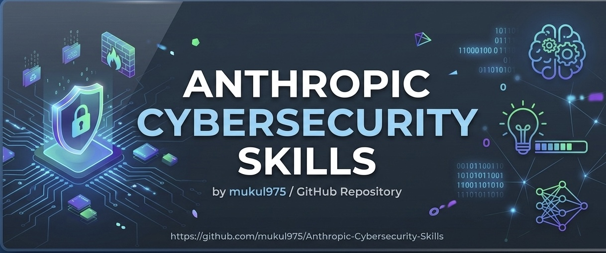
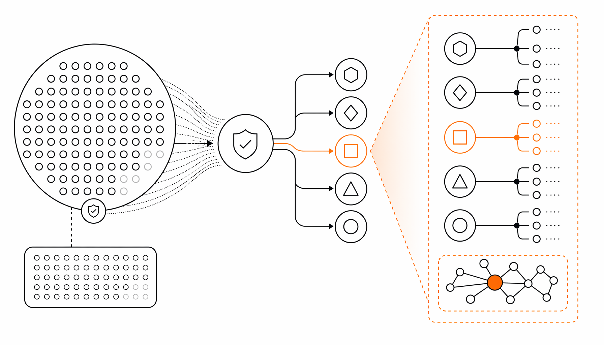

GitHub 上一个叫 mukul975 的开发者，2025 年 7 月往仓库里塞了 754 个结构化的网络安全技能文件，专门给 AI 智能体用的。这不是那种收集漏洞脚本或字典的仓库，而是把安全分析师脑子里的决策流程拆成了 AI 能直接执行的步骤：什么时候用哪个技术、前置条件是什么、怎么验证结果。每个技能文件用 YAML 头标注元数据，正文是结构化的 Markdown，AI 读完就能按步骤操作。

这个仓库最狠的操作是做了五套框架映射。754 个技能，每一个都同时标注了 MITRE ATT&CK v18（200+ 攻击技术）、NIST CSF 2.0（6 个功能 22 个类别）、MITRE ATLAS v5.4（84 个 AI 对抗威胁技术）、MITRE D3FEND v1.3（267 个防御对策）、NIST AI RMF 1.0（72 个 AI 风险管理子类）。举个例子，一个叫 `analyzing-network-traffic-of-malware` 的技能，在 ATT&CK 里对应 T1071 应用层协议，在 NIST CSF 里落入 DE.CM 持续监控，在 ATLAS 里是 AML.T0047，在 D3FEND 里是 D3-NTA 网络流量分析，在 AI RMF 里是 MEASURE-2.6。一个技能文件，五张合规检查表全打钩。目前市面上没有第二个开源库能做到这种跨框架统一覆盖。

技能覆盖了 26 个安全领域，从云安全（60 个技能，含 AWS/Azure/GCP 加固）、威胁狩猎（55 个）、恶意软件分析（39 个，含静态动态分析和沙箱）到 OT/ICS 安全（28 个，覆盖 Modbus、DNP3、IEC 62443）。仓库遵循 agentskills.io 开放标准，一条 `npx skills add mukul975/Anthropic-Cybersecurity-Skills` 命令就能让 Claude Code、GitHub Copilot、OpenAI Codex CLI、Cursor、Gemini CLI 等 20 多个平台直接读取。

ISC2 的数据说 2024 年全球网络安全岗位缺口 480 万。这个仓库的赌注很明确：与其等 480 万人慢慢培训，不如让现有 AI 智能体直接装上高级分析师的技能库。现有的安全工具仓库给的是 payload、字典、漏洞利用代码，但没有一个告诉 AI "什么时候该用 Volatility3 的哪个插件分析可疑内存 dump"、"哪条 Sigma 规则能抓 Kerberoasting"、"跨三个云供应商的入侵怎么界定范围"。这个仓库填的就是这个空——它不是脚本合集，是 AI 原生知识库，每项技能编码的是真实从业者的工作流，不是生成的摘要。

项目方还顺手做了一个全球调查 GARS-2026，研究安全专业人员对智能体 AI 的实际准备程度，结果会以 CC-BY 4.0 公开发布。还有个叫 Casky.ai 的在线实验环境，不用安装就能跑网络安全技能对抗真实目标。

这件事本质上在做安全知识的结构化转移：把人类分析师脑子里那些"我知道什么时候该做什么"的隐性知识，拆成 AI 能消化的显式指令。754 个技能只是开始，但方向是对的——安全行业的规模化瓶颈从来不是工具不够多，而是能正确使用工具的人不够多。这个仓库把"正确使用"的逻辑直接交给了机器。

#Anthropic #CybersecuritySkills #AI #Mapped #MITRE
