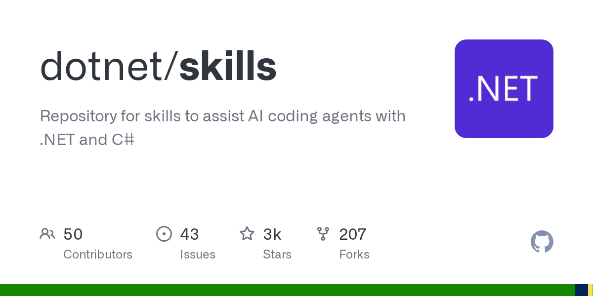

微软在 2025 年 5 月把一套叫 dotnet/skills 的仓库推上了 GitHub Trending。这不是又一个“Awesome List”式的整理，而是一个可以直接被 AI 编程工具加载的插件市场——专门教 AI 怎么写好 .NET 和 C# 代码。

仓库里塞了 12 个插件，覆盖了 .NET 开发者日常会碰到的几乎所有场景。dotnet 插件处理基础编码任务，dotnet-msbuild 专门诊断构建失败和性能问题，dotnet-nuget 管依赖升级，dotnet-upgrade 负责框架迁移。更细分的还有 dotnet-maui 搞移动端开发环境配置，dotnet-ai 直接教 AI 怎么在 .NET 里做 RAG 管线、接大模型、跑 ML.NET 经典机器学习。每个插件都不是泛泛的“最佳实践”文档，而是一组可以被 AI agent 调用的结构化技能——你让 AI 干活，它就知道该查什么、改什么、怎么改。

安装方式暴露了这套东西的真实意图。在 GitHub Copilot CLI 或 Claude Code 里，一行 `/plugin marketplace add dotnet/skills` 就能把整个市场挂载进来，然后 `/plugin install dotnet-msbuild@dotnet-agent-skills` 装具体插件。VS Code 用户改个 settings.json 开启 `chat.plugins.enabled`，再在 Copilot Chat 里敲 `/plugins` 就能浏览安装。Cursor 的支持更直接——这仓库本身就是个 Cursor 插件市场，打开面板搜 .NET 就能装。12 个插件里有 11 个覆盖的是 .NET 现有版本，唯独 dotnet11 这个插件专门为 2025 年 11 月即将发布的 .NET 11 准备，说明微软的节奏是让 AI 技能和框架版本同步迭代。

这个仓库遵循 agentskills.io 开放标准，意味着它不是微软闭门造车。OpenAI Codex CLI 也能用，用 `skill-installer` 命令直接从 GitHub URL 装单个技能。微软还搭了个公开的 Dashboard（dotnet.github.io/skills），实时追踪每个插件的准确率和效率评分，等于把 AI 写 .NET 代码的质量数据摊开给人看。

这套东西的真正杀伤力不在于插件数量，而在于它把“AI 辅助编程”这件事从通用聊天框拽进了领域深水区。通用 AI 写 C# 可能犯低级错误——比如搞错 .csproj 格式、用错 EF Core 的 DbContext 生命周期、在 MAUI 里混用平台特定 API。dotnet/skills 把这些坑全固化成可调用的技能，等于给 AI 配了个 .NET 老炮当副驾。对开发者来说，这意味着不用再反复纠正 AI 的幻觉，对微软来说，这是在抢 AI 时代的开发者入口——谁让 AI 把自家框架的代码写对了，开发者就更可能留在这个生态里。

#Repository #AI #NET #科技
