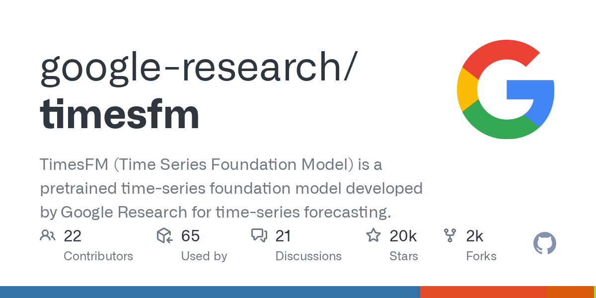

Google Research 在 2024 年 ICML 发了篇论文，搞了个叫 TimesFM 的时间序列预测模型，2025 年 9 月迭代到了 2.5 版。新版参数量从 5 亿砍到 2 亿，但上下文窗口从 2048 拉到了 16000，还支持最长 1000 步的连续分位数预测。

现在它已经塞进了 Google 自家产品线：BigQuery ML 里能跑 SQL 查询调用，Google Sheets 可以直接用，Vertex AI 上也挂了个容器化接口。代码开放在 GitHub，配了 Flax 版加速推理，2026 年 3 月加了 agent 技能文件，4 月又补了 LoRA 微调示例和单元测试。

#TimesFM #Time #Series #Foundation #Model
