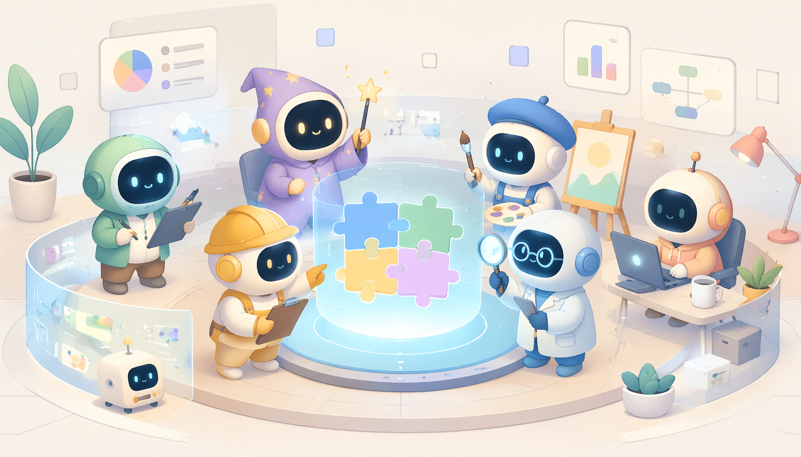
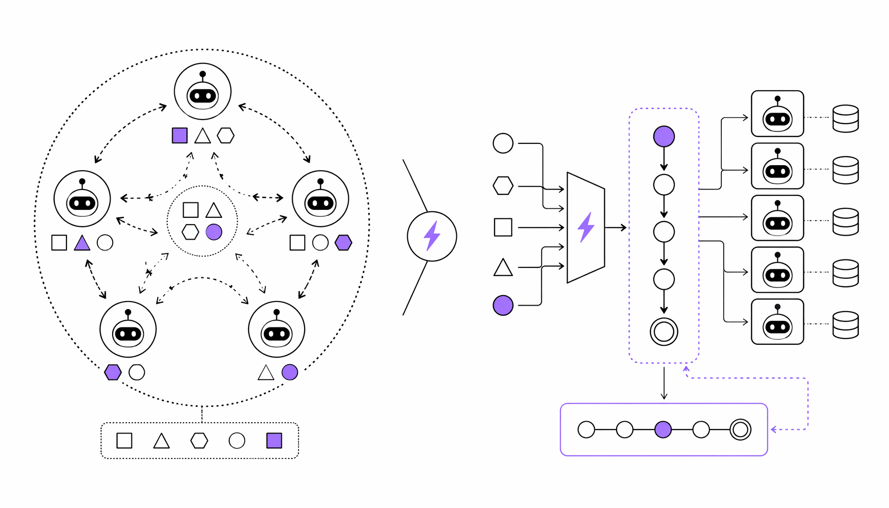

CrewAI 的 GitHub 仓库在 2025 年 4 月冲上了 Python 趋势榜榜首，这不是偶然。这个框架的定位很明确：让多个 AI agent 像一支真正的团队那样协作，而不是各自为战。它完全从零构建，不依赖 LangChain 或任何其他 agent 框架，这意味着你不需要先学一套外部依赖才能上手。

先看一个具体数字：超过 10 万开发者已经用了 learn.crewai.com 的认证课程。这不是注册用户数，是实打实学完课程并用考核的人。社区规模直接反映了一个事实——企业级 multi-agent 自动化的需求正在爆发，而 CrewAI 正在吃掉这块蛋糕。

框架本身提供了两套互补机制：Crews 和 Flows。Crews 解决的是“自主协作”问题，你给每个 agent 定义角色、目标、背景故事和工具，它们自己会动态分配任务、互相传递信息。Flows 则走另一条路，它用事件驱动架构，给你精细到每一步执行路径的控制权，适合需要严格状态管理和条件分支的生产环境。真正有意思的地方是两者可以混用——在同一个项目里，让 agent 团队处理开放式决策，同时用 Flows 管住关键业务逻辑不走偏。

CrewAI 还推了一个叫 AMP Suite 的企业套件，核心组件 Control Plane 可以免费试用。它提供实时追踪、统一控制面板、本地部署选项和 24/7 支持——这些功能明显是在对标那些需要合规审查和私有化部署的大客户。2024 年以来，agent 框架的竞争从“谁能跑通 demo”转向了“谁能上生产环境”，CrewAI 的产品矩阵就是冲着这个方向去的。

还有一个细节值得注意：CrewAI 为 Claude Code 和 Cursor 这类 AI 编程工具做了专门的 skill 插件。你用 Claude Code 写 agent 代码时，它自动加载 getting-started、design-agent、design-task 四个技能，直接按最佳实践生成代码骨架。这意味着 CrewAI 不仅在抢终端用户，还在抢开发者工作流入口——让你的 AI 编程助手默认就用它的模式写多 agent 系统。

我的判断很简单：在多 agent 框架赛道，CrewAI 目前是最有“产品感”的一个。它没有陷入 LangGraph 那种学术化的抽象体系，也没有像 AutoGen 那样把配置复杂度甩给用户。10 万认证开发者的社区基础、独立于 LangChain 的轻量架构、以及 Flows+Crews 这种兼顾灵活与控制的设计，让它同时吃到了 demo 开发者和企业部署两端的红利。如果它能在 2025 年把 AMP Suite 的付费转化做起来，这个框架就不只是一个开源工具，而是一套事实上的企业 agent 基础设施标准。

#Framework #AI #By #CrewAI #科技
