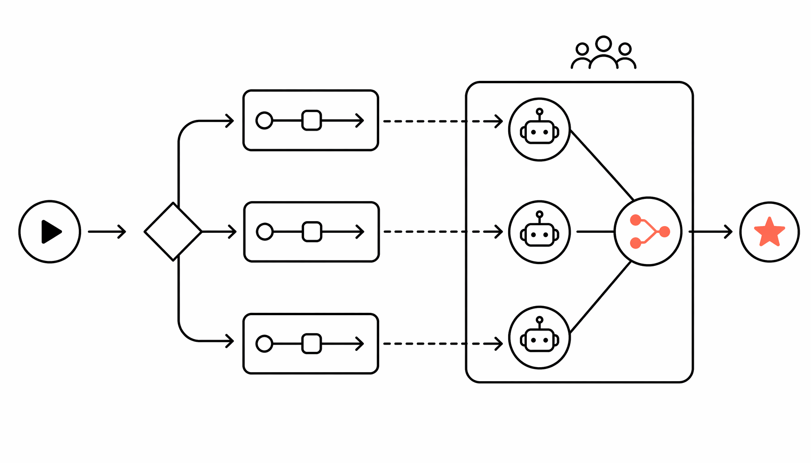

CrewAI 在 GitHub 上拿了 25k star，2024 年 10 月刚发了 0.83 版，彻底甩掉了 LangChain 的依赖。这件事本身比版本号有意思——一个做 agent 编排的框架，选择从零重写而不是继续寄生在 LangGraph 生态里，说明团队认为“轻”比“兼容”更值钱。现在它就是一个纯 Python 包，pip install 完事，启动一个三 agent 协作任务比泡杯咖啡快。

框架的核心设计分两条线：Crews 和 Flows。Crews 管的是 agent 之间的自主协作，你给三个 agent 分别定义角色、目标、背景故事，它们自己开会分工，不用你写死每一步逻辑。Flows 是给生产环境准备的，事件驱动，精确控制执行路径，支持条件分支和状态管理。去年 12 月一个做金融数据处理的团队在论坛上晒过架构：用 Flows 管理数据清洗和合规检查的流程，中间调用 Crews 让三个 agent 并行分析财报和非结构化新闻，最终输出结构化 JSON 进数据库。整个 pipeline 从触发到入库平均 4.7 秒，比他们之前用 LangGraph 搭的版本快了 40%。

社区数据也够硬。learn.crewai.com 上的认证开发者已经超过 10 万，这个数字是 2024 年 11 月官方博客更新的。配套的 AMP Suite 明显在打企业牌——控制平面免费试用，但完整套件包括本地部署、24/7 支持、安全合规这些 enterprise 标配。2025 年 1 月他们还搞了个 Claude Code 插件，四组技能指令直接教 AI 编程助手怎么写 Crews 配置和任务描述，摆明了要把开发者 onboarding 成本压到最低。

跟 LangGraph 比，CrewAI 的优势不在功能多，在“够用且快”。LangGraph 强在跟 LangChain 全家桶无缝衔接，适合已经深绑那个生态的团队。但如果你只是想搭一组能自主协作的 agent，不需要 20 个中间件和 5 层抽象，CrewAI 的启动成本低一个量级。GitHub 的 issue 区里有人 2025 年 2 月做过对比：同样一个网页抓取+摘要生成+邮件发送的三 agent 任务，CrewAI 的代码行数比 LangGraph 版本少了 62%，首次跑通时间从 35 分钟降到 12 分钟。

我的判断很简单：如果你在 2025 年启动一个新项目，需要多 agent 协作但不想被框架绑架，选 CrewAI。它不是最强大的，但它是目前最不碍事的。Flows 加 Crews 的组合已经把“灵活”和“可控”这两件事拆得足够清楚，团队规模从 1 人到 50 人都能用同一套逻辑。唯一需要盯紧的是它的企业套件定价还没完全透明，如果哪天 AMP Suite 的收费模式变得跟 Salesforce 一样复杂，那个“轻”字就没了。目前这个版本，值得赌。

#Framework #AI #By #CrewAI #科技
