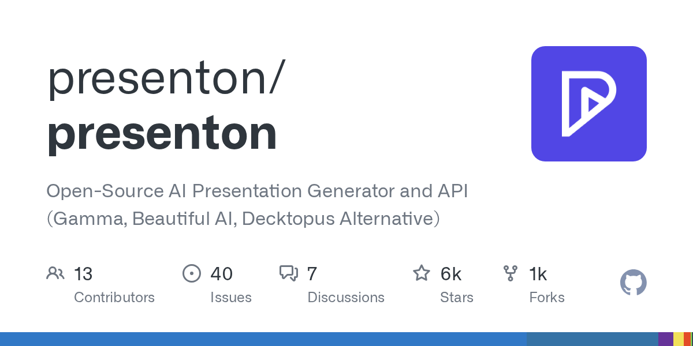
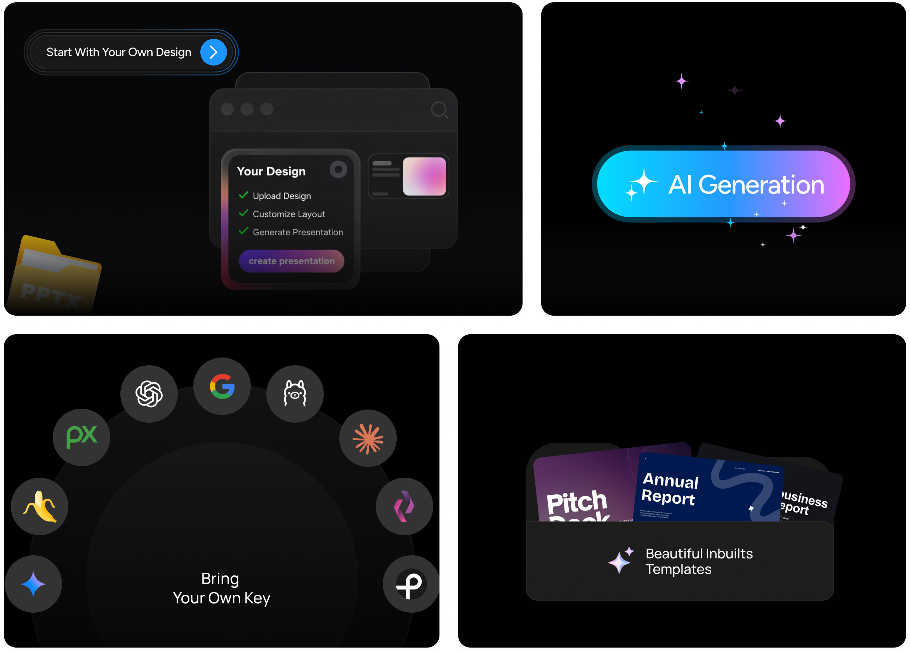

Presenton 在 2025 年 4 月登上了 GitHub Trending，标星数一周内从几百跳到 2000+。它做的事情很直接：让你用 AI 生成 PPT，但不用被 Gamma、Beautiful AI 或 Decktopus 这类 SaaS 产品锁住。Apache 2.0 协议开源，模型自己选，数据自己管，导出的是标准 PPTX 文件——不是那种只能在线看、下载要加钱的半成品。

这个项目最狠的一招是把选择权完全扔给用户。你可以用 OpenAI 的 GPT-4.1、Google 的 Gemini 2.0 Flash、Azure OpenAI、Anthropic Claude，也可以接 Ollama 跑本地模型，甚至混搭——文字生成用 Claude，配图用 DALL-E 3 或 Gemini Flash，还能从 Pexels、Pixabay 免费图库里自动匹配。计费方式也跟着你的 API key 走，Presenton 本身不抽成、不收月费。对比一下 Gamma 的 Plus 计划每月 10 美元、Beautiful AI 的 Pro 版每月 12 美元起，这个差异在用了三个月之后就非常明显了。

部署方式也给了两条路。桌面端是个 Electron 应用，Windows、macOS、Linux 全平台覆盖，装完就能离线用，LLM 跑在本地 Ollama 上时连网都不用连。云端部署靠 Docker 一行命令搞定：`docker run -it --name presenton -p 5000:80 -v "./app_data:/app_data" ghcr.io/presenton/presenton:latest`，端口可以自己换。有意思的是它内置了 MCP 服务器（Model Context Protocol），这意味着其他 AI 工具可以用标准化协议直接调用 Presenton 的生成能力——比如你在 Claude Desktop 里说“帮我做个季度复盘 PPT”，它就能调 Presenton 吐出一个 PPTX 文件，这在同类产品里还没见过。

模板系统用了 HTML 加 Tailwind CSS，懂前端的人可以直接写自己的设计模板，不用学什么专有格式。它还支持从现有 PPT 文件里反向提取模板，然后让 AI 按这个风格生成新内容。导出质量上，PPTX 的图表、图标、排版都是可编辑的，不是那种把文字变成图片塞进去的假导出。

坦白说，Presenton 现在还不够“傻瓜化”。它假设你至少知道 API key 是什么、愿意花 10 分钟配环境。但这件事的方向是对的——AI 演示文稿工具不该是一个按月交租的黑箱。当 Gamma 和 Beautiful AI 还在纠结怎么让你多付一个座位费时，Presenton 直接把钥匙给了你。如果你有技术底子、或者团队里有人能搭一下 Docker，这个工具值得立刻试。如果你只想点两下就出片，那等几个月看看社区能不能把体验层再打磨一下。

#OpenSource #AI #Presentation #Generator #API
