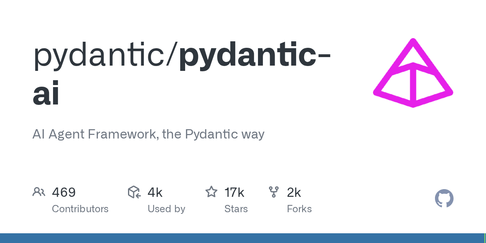

Pydantic 团队 2025 年 4 月开源了 pydantic-ai，一个用 Pydantic 方式做 AI Agent 的 Python 框架。底层校验逻辑直接来自 OpenAI SDK、Anthropic SDK、LangChain 等一堆库都在用的 Pydantic Validation，等于绕过中间商直接拿源头能力。

上手极快，5 行代码就能跑一个带指令的 agent，同步调用 `agent.run_sync()` 直接出结果。支持 OpenAI、Anthropic、Gemini、DeepSeek、Grok 等 20+ 模型提供商，Ollama、LiteLLM 本地部署也行。工具调用、依赖注入、流式输出、人在回路审批这些生产级需求都内置了，还能用 YAML/JSON 无代码定义 agent。去年他们自己用在 Pydantic Logfire 项目里，发现市面上没一个框架对胃口，干脆自己造了。

#AI #Agent #Framework #Pydantic #科技

