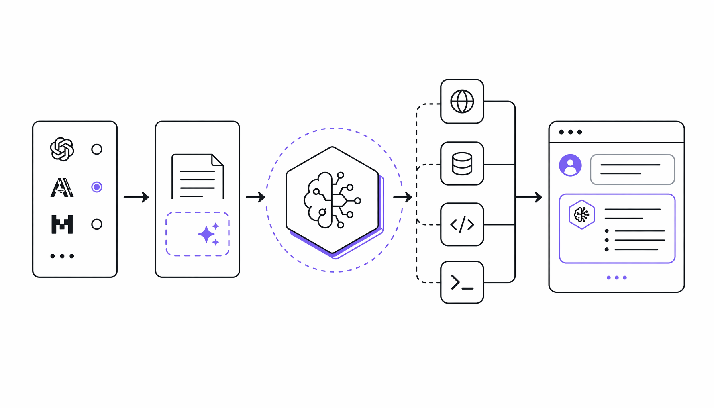

Pydantic 团队 2025 年 4 月开源了一个 AI Agent 框架，名字就叫 pydantic-ai，GitHub 星标数一周内破了 8000。它做的事很直接：让你用写 FastAPI 的感觉来搭 AI 应用，背后靠的就是 Pydantic 那套类型校验。

框架支持 OpenAI、Anthropic、Gemini、DeepSeek 等 30 多个模型供应商，连 Ollama 本地模型也能接。工具调用、流式输出、人工审批这些功能都内置了，还自带一个叫 Thinking 的推理能力和 WebSearch 联网搜索，三行代码就能给 Agent 装上。官方给的 Hello World 例子用 Claude Sonnet 4.6 跑，问“hello world 起源”，返回结果说是 1974 年一本 C 语言教材里首次出现。

#AI #Agent #Framework #Pydantic #科技
