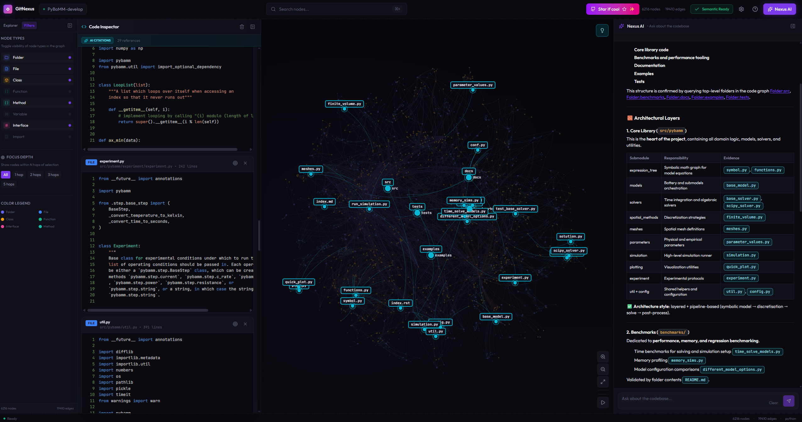

一个叫 GitNexus 的工具在 GitHub 上火了，它能把任何代码仓库直接转成知识图谱——而且完全跑在浏览器里，不需要服务器。你丢给它一个 GitHub 链接或 ZIP 文件，它就能生成一张交互式的代码关系图，还内置了一个 Graph RAG 智能体跟你对话。这玩意儿最近刚上线，已经有 5 种编辑器直接集成：Claude Code、Cursor、Codex、Windsurf、OpenCode。其中 Claude Code 支持最深，不仅有 MCP 工具调用，还能在提交代码后自动检测索引是否过期并提醒重跑。安装就一行 npx gitnexus analyze，索引完会自动生成 AGENTS.md 上下文文件。现在官网 gitnexus.vercel.app 可以直接用，企业版走 akonlabs.com，支持多仓库统一图谱和自动重索引。

#GitNexus #The #ZeroServer #Code #Intelligence

