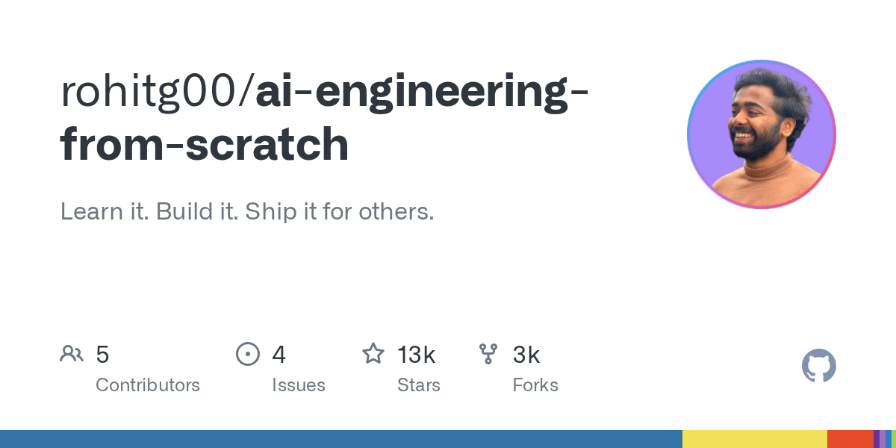

有个叫 rohitg00 的开发者 2025 年在 GitHub 上开源了一套 AI 工程课程，435 节课、20 个阶段、约 320 小时，MIT 协议免费。课程覆盖 Python、TypeScript、Rust、Julia 四种语言，从线性代数一路讲到多智能体集群。

它跟市面上大多数教程不一样的地方在于，每节课都要求你先从原始数学推导开始手写算法——反向传播、分词器、注意力机制、Agent 循环，全裸写一遍，然后再用 PyTorch 跑同样的东西。每节课结束不光是“学会了”，你还得产出一个可复用的产物：一段 prompt、一个技能文件、一个 agent 或一个 MCP 服务器。

课程还内置了 `/find-your-level` 这类智能体命令，10 道题帮你定位起点，生成个性化学习路径。目前课程还在持续施工中，部分阶段已经可以跑起来了。

#Learn #Build #Ship #AI #科技
