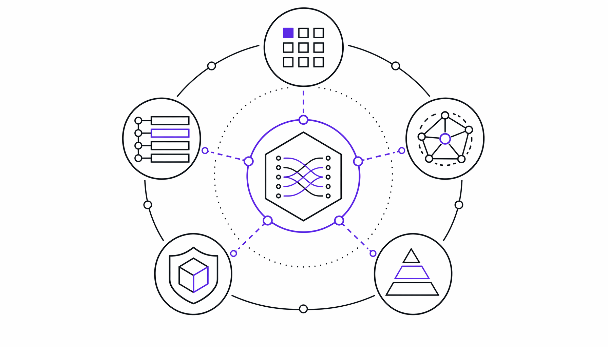

# 754条技能直塞AI大脑：安全分析师的肌肉记忆终于被开源了

> ai-daily · 2026 年 5 月 23 日 19:08 · 来源：GitHub Trending python

看到这个仓库的时候，我脑子里冒出来的第一个念头是：终于有人把这件事做了。

过去一年，安全圈几乎每周都有新工具冒出来。AI 能写钓鱼邮件、能逆向二进制、能生成 Sigma 规则——但有个问题一直没人认真回答：**你怎么让 AI 像一个真正的分析师那样思考，而不是像一本会说话的百科全书？**

一个初级分析师拿到一块可疑的内存 dump，知道该跑哪个 Volatility3 插件；看到异常 Kerberos 票据请求，脑子里会弹出 Sigma 规则匹配；跨三个云平台追踪入侵路径时，有一套肌肉记忆般的排查顺序。这些东西，现在的 AI agent 全不会。它能告诉你 Kerberoasting 的定义，但不知道在什么前置条件下该动手查什么。

**754 条结构化技能扔进 agent 里，等于直接把一个高级分析师的决策树塞进了它的脑子。**

## 一张技能卡，五个框架全勾上

这个叫 Anthropic Cybersecurity Skills 的仓库（注意，跟 Anthropic 公司没关系，是社区项目），是目前唯一一个把每条技能都映射到五个主流框架的开源库。

五个框架分别是 MITRE ATT&CK v18、NIST CSF 2.0、MITRE ATLAS v5.4、MITRE D3FEND v1.3 和 NIST AI RMF 1.0。覆盖了从攻击者行为、防御对策、AI 对抗威胁到组织安全态势评估的完整光谱。

拿一条技能「analyzing-network-traffic-of-malware」举例，它同时命中 ATT&CK 的 T1071（应用层协议）、NIST CSF 的 DE.CM（持续监控）、ATLAS 的 AML.T0047、D3FEND 的 D3-NTA（网络流量分析）、以及 AI RMF 的 MEASURE-2.6。一条技能，五个合规复选框全亮。

这个设计的实用价值在于：你不需要在不同框架之间来回翻译。做一次分析，审计、合规、红队、蓝队四个视角同时被满足。

## 26 个域、20+ 平台，不只是「能跑」

仓库涵盖 26 个安全领域——云安全 60 条、威胁狩猎 55 条、恶意软件分析 39 条、OT/ICS 安全 28 条，甚至细到钓鱼防御和零信任架构都有独立域。每条技能不是脚本集合，而是遵循 agentskills.io 开放标准的决策工作流：YAML 前端用于亚秒级检索，结构化 Markdown 做分步执行指引，参考文件提供深度技术上下文。

让我愣神的是它的兼容面。npx 一行命令就能接入 Claude Code、GitHub Copilot、OpenAI Codex CLI、Cursor、Gemini CLI 等 20 多个平台。这意味着你不需要换工具链——agent 在哪干活，技能库就跟到哪。

> “Existing security tool repos give you wordlists, payloads, or exploit code. None of them give an AI agent the structured decision-making workflow a senior analyst follows.” —— 项目 README 里的原话，我觉得这句话精准戳中了要害。

## 480 万缺口和一次学术调查

ISC2 的数据显示，2024 年全球网络安全岗位缺口达到 480 万。这个数字背后不是「缺人干活」，而是「缺能做出判断的人」。AI agent 想补这个缺口，缺的不是算力或模型能力，而是结构化的领域知识——即「什么时候该做什么」的 playbook。

仓库作者显然不满足于只做一个开源库。他同时在跑一个叫 GARS-2026 的全球学术调查，由 SRH Berlin 监督，专门测量安全从业者对 agentic AI 的真实准备度——MCP 服务器、工具调用、治理机制、人机协同流程这些具体到骨头里的问题。60 道题，匿名，CC-BY 4.0 开源发布结果。填完还能拿 50 个 Casky Token 换 casky.ai 的早期访问权限。

这种「开源+学术研究」的组合打法，在安全工具圈里不多见。它说明作者想的不只是扔出一堆文件，而是在认真追问：这个行业到底准备好了没有？

如果你问我这个东西值不值得放进 agent 的工作流里，我的判断很简单——它是目前唯一一个把「决策逻辑」而非「工具脚本」作为第一交付物的安全技能库。给 agent 装上去之后，它不会突然变成安全大神，但至少不会再像一个只会背字典的实习生。

至于能不能真正缩小那 480 万的缺口，就看有多少团队愿意把 playbook 喂给机器了。

#Anthropic #CybersecuritySkills #AI #Mapped #MITRE
