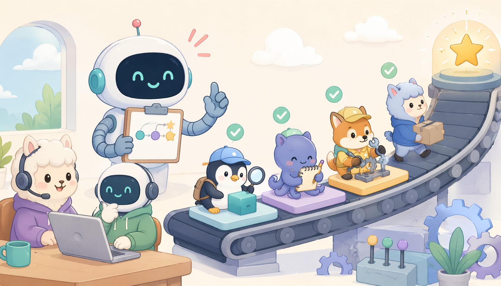

# OpenPipe/ART — Agent Reinforcement Trainer: train multi-step agents for real-world tasks using GRPO. Give your agents on-the-job training. Reinforcement learning for Qwen3.6, GPT-OSS, Llama, and more!

> ai-daily · 2026 年 5 月 23 日 19:13 · 来源：GitHub Trending python

刚刚，OpenPipe 甩出了一个让我愣神的东西——**ART**，一个专为 AI Agent 设计的强化学习训练框架。

说白了，就是让你那些只会聊天的模型，能真正在现实任务里学会“多步操作”。它用上了 GRPO（群体相对策略优化），给 Qwen 3.6、GPT-OSS、Llama 这些模型搞“在职培训”。

最狠的是他们联合 W&B 推出的无服务器 RL 训练服务，直接把推理和训练的脏活累活全包了。官方给的数据很敢说：**成本降低 40%，训练速度提升 28%**，能扩展到 2000+ 并发请求。以前搭 GPU 环境几小时起步，现在他们宣称几分钟就能迭代。

他们还放出了几个炸裂的实验结果：用 Qwen 2.5 14B 训出的邮件检索 Agent，居然干翻了 OpenAI 的 o3。而且这框架能直接接入 LangGraph，甚至能自动训练模型去玩转 MCP 服务器——这波是把 Agent 开发的门槛往死里踩了。

#OpenPipe #ART #Agent #Reinforcement #Trainer
