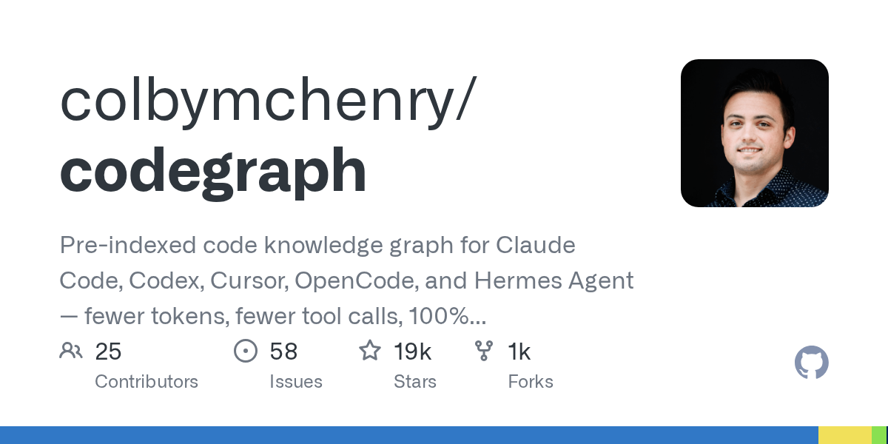

# colbymchenry/codegraph — Pre-indexed code knowledge graph for Claude Code, Codex, Cursor, OpenCode, and Hermes Agent — fewer tokens, fewer tool calls, 100% local

> ai-daily · 2026 年 5 月 23 日 19:14 · 来源：GitHub Trending any

刚刚，一个叫 CodeGraph 的项目在 GitHub 上火了。它给 Claude Code、Cursor 这些 AI 编程助手装了个“预索引知识图谱”，实测下来效果有点离谱——**成本降 35%，工具调用次数直接砍掉 70%**。

原理不复杂。现在的 AI 写代码时想理解项目结构，得不停用 grep、glob 满世界翻文件，每翻一次都是 token 消耗。CodeGraph 提前把代码的符号关系、调用链、路由映射全索引到一个本地 SQLite 里，AI 问一句直接查图，不用再派一堆 Explore 子代理去翻文件了。

他们在 VS Code（TypeScript，约 1 万文件）上跑了一遍，没开 CodeGraph 时 AI 调了 23 次工具、烧掉 140 万 token；开了之后 7 次工具搞定，39 万 token 收工。Tokio（Rust）更夸张，**81% token 省下来了**。唯一例外是那种 150 文件的小项目，原生搜索本来就够快，差距不明显。

安装就一行 curl 命令，100% 本地跑，数据不出机器。现在支持 19 种语言和 14 个 Web 框架的路由识别，开源即装即用。

#Preindexed #Claude #Code #Codex #Cursor
