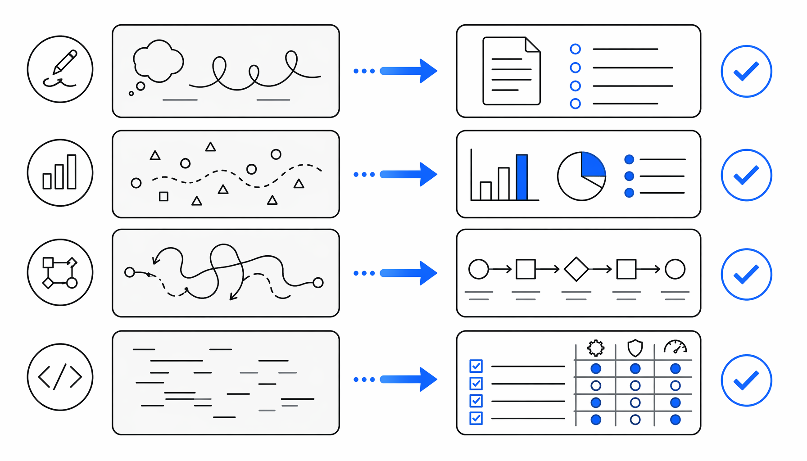

# AI写代码总擅自加戏？GitHub有人把卡帕西4原则做成系统指令

> ai-daily · 2026 年 5 月 23 日 19:16 · 来源：GitHub Trending any

你有没有遇到过这种情况——让 AI 帮你写段代码，它二话不说就开干，结果交上来 200 行，你一看，真正有用的就 50 行。剩下 150 行全是“为了以后可能会用”的抽象层、永远不会触发的错误处理、还有顺手把隔壁文件也“优化”了一下的意外惊喜。

Karpathy 前两周在 X 上吐槽了这件事。他说现在的 LLM 写代码有三个毛病：**擅自替你假设、过度工程化、不小心删掉它其实没看懂的东西**。这条推文下边一堆人狂点头，包括我。

然后 GitHub 上就有人动手了。

**一个文件，四个原则，专治 AI 写代码的臭毛病。**

## 别急着动手，先把脑子带上

这个项目叫 `multica-ai/andrej-karpathy-skills`，说白了就是一个 `CLAUDE.md` 文件。但别小看这一个文件，它直接把 Karpathy 的观察变成了四条硬规则，塞进 Claude Code 的系统指令里。

第一条就叫「Think Before Coding」。翻译成人话就是：**先想清楚再写代码**。

LLM 最大的问题不是笨，是太爱猜。你给一句模糊的需求，它不会问你“你到底是想要 A 还是 B”，而是自己默默选一个，然后基于这个可能完全错误的理解狂写 300 行。等你发现不对的时候，它已经跑出去老远了。

这条规则逼它干几件事：把假设说出来、有歧义就列多种解释、该反问的时候反问、搞不懂就停下来。我看到这个的时候第一反应是——这不就是给 AI 加了个“确认对话框”吗？但确实管用。

## 能用 50 行解决的问题，别给我写 200 行

第二条规则是我个人最喜欢的：「Simplicity First」。

Karpathy 的原话是，模型特别喜欢“把代码和 API 搞复杂，堆一堆没用的抽象层，死代码不清”。这简直是每个跟 AI 协作过的人都懂的痛。你让它写个表单验证，它给你整出一套插件式验证框架，还贴心地加上了国际化支持——而你只是想要一个非空检查。

这条规则直接设了五条禁令：不许加没要求的功能、不许给单次使用的代码写抽象、不许做没被要求的“灵活性”、不许处理不可能发生的错误。最后还有一条自检标准：**如果一个资深工程师看了会说“这太复杂了”，那就重写**。

底线很明确：代码越少越好，但不是偷懒，是精准。

## 别碰跟你没关系的东西

第三条「Surgical Changes」解决的是另一个经典灾难场景：你让 AI 改个 bug，它顺手把旁边的注释格式统一了、变量名改了、还删了一段它觉得“没用”但实际上在另一个模块里引用的函数。

规则写得清清楚楚：不改相邻代码、不改注释、不改格式、不重构没坏的东西。看到死代码想删？先说出来，别直接动手。只有当你的改动导致某些 import 或函数变成孤儿时，才可以清理——而且只清你自己造成的。

**这条规则的测试很简单：diff 里的每一行改动，都必须能直接追溯到用户说了什么。**

## 别告诉它怎么做，告诉它怎么算做完

第四条是我觉得最有意思的：「Goal-Driven Execution」。

Karpathy 有一个洞察：LLM 特别擅长“循环直到达到目标”。所以与其说“加个验证”，不如说“先写测试用例覆盖非法输入，然后让它们全部用”。与其说“修 bug”，不如说“先写一个能复现 bug 的测试，让它从红变绿”。

这个思路把 AI 从一个“执行命令的机器”变成了一个“追求目标的 agent”。它知道自己要跑完一个循环才算完，而不是交完代码就下班。配合多步骤任务的简短计划格式，效果确实不一样。

这个文件目前在 GitHub 上支持两种安装方式：Claude Code 插件市场一键安装，或者直接 curl 下载塞进项目根目录。还顺手适配了 Cursor，在 `.cursor/rules` 下放了同样的规则文件。作者是 @jiayuan_jy，项目 MIT 协议开源。

**值得注意的一个态度是：这个文件故意偏向“谨慎”而非“速度”。作者自己也说了，如果是改个拼写错误这种小事，别上全套流程。它的目标是减少非平凡任务上的昂贵错误，不是给每一行代码加镣铐。**

如果你受够了 AI 帮你写了一堆你根本不想维护的代码，这个文件值得试试。说到底，它要解决的只有一个问题：让 AI 像个真正靠谱的工程师那样干活，而不是一个急着交作业的实习生。

#CLAUDEmd #Claude #Code #Andrej #Karpathy
