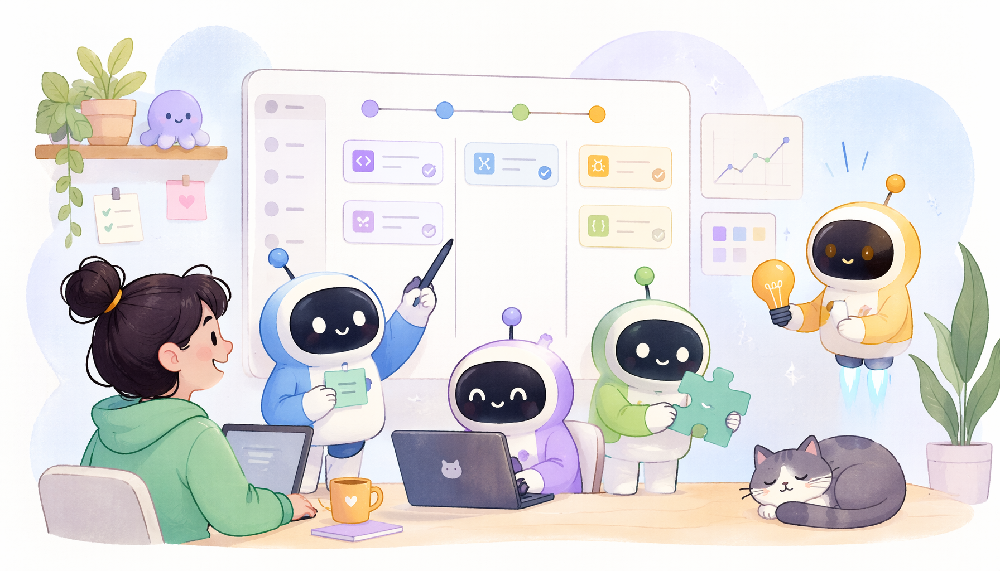
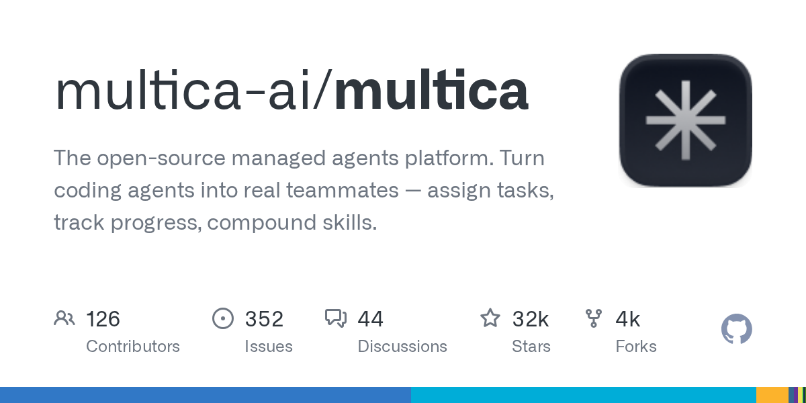
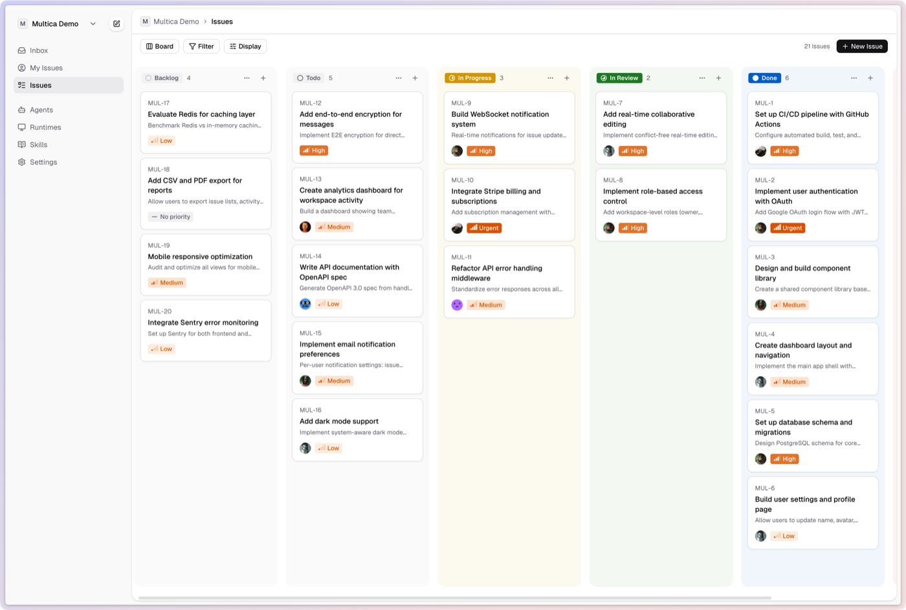

# 告别手动派活：Multica如何将Claude Code等AI变成项目同事？

> ai-daily · 2026 年 5 月 23 日 19:18 · 来源：GitHub Trending any

刚刚，GitHub 上一个叫 **Multica** 的开源项目直接抛出一句狠话：**「你接下来的 10 个雇员不会是真人」**。

它做的事情很直白——把 Claude Code、Cursor Agent、Kimi 这些编码智能体，变成你项目看板上真正能接活儿的同事。你像给人派任务一样分配 Issue，它会自己领走、写代码、报进度、遇到阻碍还会主动评论区举手。不需要你复制粘贴提示词，也不需要守在旁边看它跑。目前它已经支持 **11 种主流 Agent CLI**，从 Gemini 到 GitHub Copilot 全通吃。

最让我觉得有意思的是它搞了个叫 **Squads** 的机制，你可以把一堆 Agent 和人编成一组，指派一个「领导 Agent」去分活儿。以后你喊的就是「@前端小队」而不是「@张三或李四或王五」。这套东西完全开源，能自托管，摆明了要做 Agent 时代的中立基础设施。

#The #Turn #AI #科技
