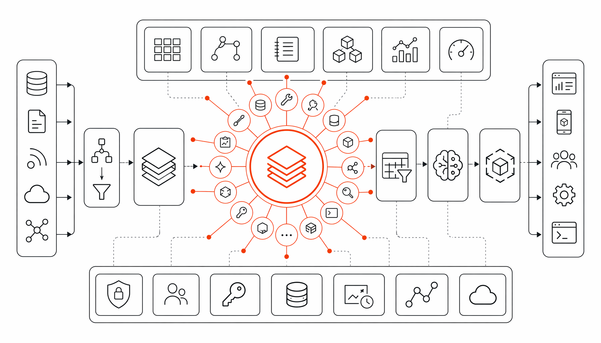

# Databricks AI Dev Kit 发布：75个工具让 Claude Code 直接连接数据平台

> ai-daily · 2026 年 5 月 23 日 19:21 · 来源：GitHub Trending python

你写代码的时候，AI 助手最怕什么？不是模型不够聪明，是它根本不知道你的数据在哪、表叫什么、集群怎么连。

Databricks 的用户应该深有体会。你让 Claude Code 或 Cursor 帮你写一段 Spark 流处理，它给你生成了完美语法，但 Unity Catalog 的表名是编的，集群配置是猜的，最后你得手动改 20 处才能跑通。这种感觉就像你雇了个天才程序员，但他既没 VPN 也没权限，全靠蒙。

Databricks 的现场工程团队显然也被这事折磨够了。他们没等产品部门慢慢规划，直接自己动手，在 GitHub 上扔出了一个叫 AI Dev Kit 的工具箱。

**让 AI 编码助手真正认识你的数据平台，这件事本不该由用户来填坑。**

## 75 个可执行工具，不是“建议”是“动手”

我看了一下这个项目的结构，最让我愣神的是它提供的工具数量——不是 5 个、10 个，而是 75 个以上可以直接调用的 MCP（Model Context Protocol）工具。

这些工具覆盖了什么？从 Spark 声明式管道（流处理表、CDC、SCD Type 2）、Databricks Jobs 的多任务 DAG 调度，到 Unity Catalog 的表和卷管理、AI/BI 仪表盘、Genie Spaces 的自然语言查询，甚至 Model Serving 端点部署和 MLflow 实验追踪——基本把 Databricks 平台上日常要碰的东西都包进去了。

换句话说，你的 AI 助手不再是给你“建议一段代码”，而是可以直接执行 SQL 查询、创建表、部署应用。`execute_sql("SELECT * FROM my_catalog.schema.table LIMIT 10")` 这种调用，它真能帮你跑通。

## 两条路选一条，但“白嫖党”这次赢了

Databricks 给用户画了两条路线，这个分法挺诚实的。

第一条是产品内置的免费 AI 编码能力，直接在 workspace 里用，能感知你的 notebook、job 和 Unity Catalog 数据。适合那些还没开始用外部 AI 工具的人，或者就喜欢在 Databricks 里一站式搞定。

第二条就是这次 AI Dev Kit 主打的路线——**把你已经在用的编辑器（Cursor、Claude Code、Windsurf、Gemini CLI、Copilot，甚至 OpenCode 和 Kiro）直接接上 Databricks 的上下文和工具链。** 你不需要换环境，Databricks 的现场专家帮你把技能包和可执行工具都打包好了。

安装方式也简单得不像企业级产品：一行 curl 命令，Mac 和 Windows 都支持。`bash <(curl -sL https://raw.githubusercontent.com/databricks-solutions/ai-dev-kit/main/install.sh)` 就跑起来了。你甚至可以指定只安装给特定工具，比如 `--tools cursor,gemini,windsurf`，不用全装。

而且他们显然考虑到了一件事——安全。项目 README 开头就主动披露了一个供应链安全事件：litellm 的 1.82.7 到 1.82.8 版本出了问题，团队已经把大部分使用场景里的 litellm 依赖砍掉了，只在测试目录保留并锁定到安全版本。这种透明度在企业级工具里不多见。

## 这套东西真正的野心

如果你以为这只是一个“让 AI 写 Databricks 代码更准”的工具，那就小看它了。

它里面藏了一个叫 Visual Builder App 的东西——一个完整的全栈 Web 应用，带聊天界面，能直接部署成 Databricks App。更关键的是，如果你在部署时加上 `--enable-mcp` 参数，这个应用摇身一变就成了一个 MCP 服务器，在 `/mcp` 端点把 75 个 Databricks 工具暴露给 Genie Code、AI Playground 或者其他 MCP 客户端。

这意味着什么？**你的 AI 助手不再只是一个代码补全工具，它变成了一个能实际操作数据平台的代理。** 你告诉它“帮我建一个流处理管道，从 Kafka 接数据写进 Delta 表，再建一个仪表盘展示实时 KPI”，它真的能一步步执行完，而不是给你 10 页文档让你自己去配。

Databricks 的现场工程团队做这件事，动机其实很好理解——他们在客户现场天天看到同样的痛点反复出现。与其每次都手把手教，不如直接把模式、技能和工具打包成一个 AI 原生工具箱，让 AI 助手替他们干活。

#Databricks #Toolkit #Coding #Agents #Field
