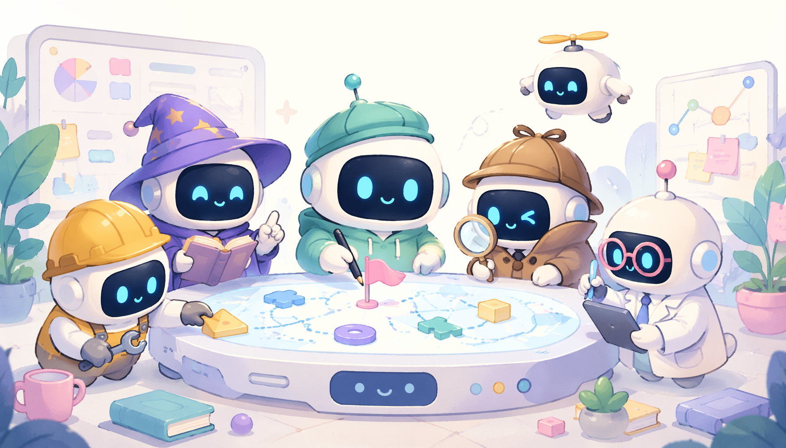

# crewAIInc/crewAI — Framework for orchestrating role-playing, autonomous AI agents. By fostering collaborative intelligence, CrewAI empowers agents to work together seamlessly, tackling complex tasks.

> ai-daily · 2026 年 5 月 23 日 19:24 · 来源：GitHub Trending python

刚刚在 GitHub 上看到这个项目，我的第一反应是：AI 智能体框架的内卷终于卷到「去 LangChain 化」这一步了。

CrewAI 这个 Python 框架，**完全从零构建，不依赖 LangChain 或任何其他智能体框架**。它主打的是让多个 AI 扮演不同角色，像一支真正的小团队那样协同干活——官方管这叫「Crews」（智能体团队）和「Flows」（事件驱动工作流）。前者负责自主决策、动态分工，后者负责生产环境下的精确控制，两者还能混着用。

让我愣神的是社区数据：**超过 10 万名开发者用了他们的认证课程**，这转化率对于一个框架项目来说相当夸张。企业版「AMP Suite」已经打包了追踪监控、统一控制面板、本地/云端混合部署那一整套，明显是奔着拿下企业自动化市场去的。Claude Code 和 Cursor 也接入了官方技能插件，输入一行命令就能让 AI 编程助手直接按 CrewAI 的最佳实践写代码。

#Framework #AI #By #CrewAI #科技
