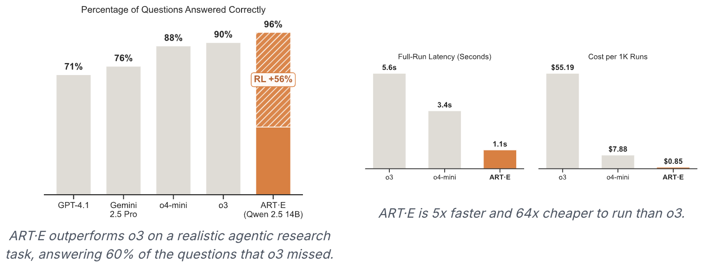
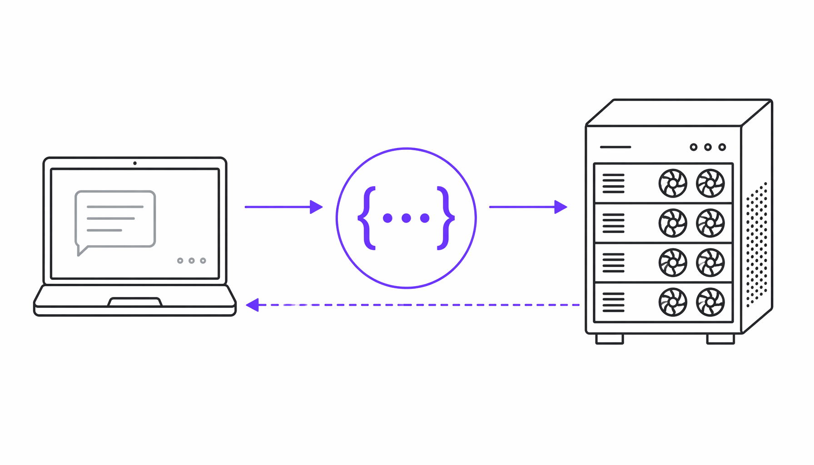

# Qwen 14B 模型凭 ART 训练击败 o3：强化学习改写 Agent 游戏规则

> ai-daily · 2026 年 5 月 23 日 20:18 · 来源：GitHub Trending python

2026 年 5 月 7 日凌晨，一位工程师盯着终端屏幕上的报错信息，血压飙升。

`RuntimeError: CUDA error: out of memory`

又是 GPU 显存溢出。他已经花了四个小时搭建环境、调试配置，就为了给自己的 Qwen 模型跑一轮强化学习训练。隔壁工位的同事走过来瞄了一眼，扔下一句话：「你试过 ART 吗？就是那个让模型『在职培训』的框架，我刚用它在笔记本上把训练跑起来了。」

我听到这个故事的时候，第一反应是：这年头，连模型都要接受「在职培训」了——人类职场人都还没习惯这个词，AI 已经先卷起来了。

**强化学习不再是实验室里的奢侈品，它正在变成任何一个 Python 开发者都能随手调用的工具。**

## 从「几小时搭 GPU」到「笔记本上跑训练」：ART 到底做了什么

OpenPipe 团队在 GitHub 上开源的 ART（Agent Reinforcement Trainer），本质上解决了一个极其朴素却长期存在的痛点：**强化学习训练的门槛太高了。**

过去，如果你想用 GRPO（Group Relative Policy Optimization）训练一个多步推理的 AI agent，流程大致是这样的：先租 GPU 集群，配 CUDA 环境，装 vLLM，拉基座模型，写训练脚本，调 LoRA 参数，然后祈祷不要报 OOM。一套流程走下来，半天过去了，训练还没开始。

ART 把这件事拆成了两半：**client 和 server。** Client 跑在你的笔记本电脑上，负责定义 agent 的工作流——也就是模型在实际任务中怎么调用工具、怎么多步推理。Server 跑在有 GPU 的机器上，负责训练和推理。两边用一个兼容 OpenAI 接口的客户端通信，你甚至不需要直接跟训练服务器打交道。

更狠的是，OpenPipe 联合 W&B 推出了一个叫 **Serverless RL** 的服务。字面意义上的「无服务器强化学习」——你不用管集群、不用管 GPU 调度、不用管 checkpoint 管理，甚至连推理基础设施都是自动伸缩的。官方给的数据是：**成本降低 40%，训练速度提升 28%，支持 2000+ 并发请求跨多 GPU 并行。** 训练完的每个 checkpoint 立刻就能用 W&B Inference 调用，部署零延迟。

这组数字意味着什么？一个中小团队过去需要投入 DevOps 工程师专门维护的训练流程，现在一个算法工程师在 Jupyter Notebook 里就能跑通。ART 提供的那些 Notebook——从让 Qwen3 14B 学会搜索邮件，到让 Qwen 2.5 3B 学会玩 2048 游戏——每一个都是开箱即用的「在职培训」教材。

## 一个 14B 模型凭啥打败 o3？强化学习正在重写 agent 的游戏规则

让我真正愣神的是 ART 官方博客里的一条声明：**他们用 Qwen 2.5 14B 训练的邮件搜索 agent，在 RULER 基准测试上击败了 OpenAI 的 o3。**

RULER 是评估长上下文检索能力的基准，o3 是 OpenAI 目前的旗舰推理模型，而 Qwen 2.5 14B 参数量不到 o3 的几分之一（具体数字官方未披露，但 o3 系列通常被认为在百亿到千亿级别）。一个「小」模型用强化学习微调，在一个具体任务上干翻了通用大模型——这就是 GRPO 的威力所在。

GRPO 的核心思路并不复杂：让模型对同一个任务生成多个不同的执行轨迹（trajectory），然后根据奖励函数给每个轨迹打分，用高分轨迹去更新模型参数。这就像训练一个新员工——不是让他背手册，而是让他真正上手干活，做好有奖励，做差有反馈，反复迭代。

ART 把这个过程产品化到了什么程度？看它的训练循环就清楚了：

第一步，你的 agent 代码用 ART client 发出多个并行的 rollout 请求，每一步的 system、user、assistant 消息都被记录进一个 Trajectory 对象。第二步，rollout 完成后，你根据 agent 的表现给它打一个 reward 分数。第三步，所有轨迹打包发给 server，server 用 GRPO 训练模型，更新 LoRA 权重，把新权重加载进 vLLM，然后解除推理阻塞，循环继续。

整个循环跑多少次？你说了算。

更值得关注的是 ART 在 2026 年初密集推出的几个新能力。**MCP•RL** 能让模型自动学会使用任何 MCP 服务器上的工具——这意味着你不需要手动写 prompt 教模型怎么调用 API，强化学习自己就能摸索出最佳调用策略。**AutoRL** 更进一步，号称可以「零标注数据训练任意任务」，用自动生成输入和 RULER 评估来做到闭环。**LangGraph 集成**则让那些已经在用 LangGraph 构建多步 agent 的团队，可以直接把强化学习挂载到现有工作流上。

（值得一提的是，ART 背后的公司 OpenPipe 本身就不是新手——他们之前做的是 LLM 微调平台，在模型训练工程化上积累很深。这次开源 ART，实际上是把自家打磨成熟的 RL 训练管线直接公开了。）

这些能力叠加在一起，指向一个清晰的趋势：**agent 的竞争，正在从「谁有更好的基座模型」转向「谁能让模型在具体任务上更快地学习」。** 基座模型提供的是泛化能力，强化学习提供的是领域适配能力。前者是原材料，后者是加工工艺。

而 ART 做的事情，就是把这套加工工艺从手工锻造变成了流水线生产。

## 参考来源

- https://github.com/OpenPipe/ART
- https://github.com/OpenPipe/ART#readme （ART 官方 README，含 Serverless RL 数据、训练循环说明、支持模型列表）
- https://github.com/OpenPipe/ART#-art-news （ART 新闻板块，含 ART·E 击败 o3 声明、MCP•RL、AutoRL、LangGraph 集成等公告）

---

有个细节我反复看了三遍才确认：ART 的 license 是 Apache 2.0。这意味着什么？意味着 OpenPipe 把强化学习训练 agent 的完整技术栈——从 client 到 server，从 GRPO 训练循环到 W&B 无服务器推理——全部开源，商用友好。一家做微调平台的公司，把自家最核心的训练能力开源了。这个动作本身就说明了他们对市场节奏的判断：与其靠闭源守住一亩三分地，不如把基础设施铺开，让更多人用上强化学习，然后在上层服务（比如 Serverless RL 的托管训练）上赚钱。

至于那些还在手动搭 GPU 环境、跟 OOM 报错死磕的工程师们——你们的「在职培训」也该升级了。

#OpenPipe #ART #Agent #Reinforcement #Trainer
