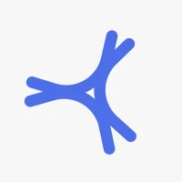
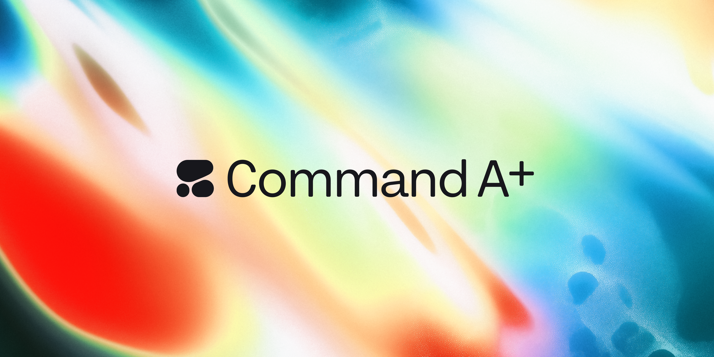
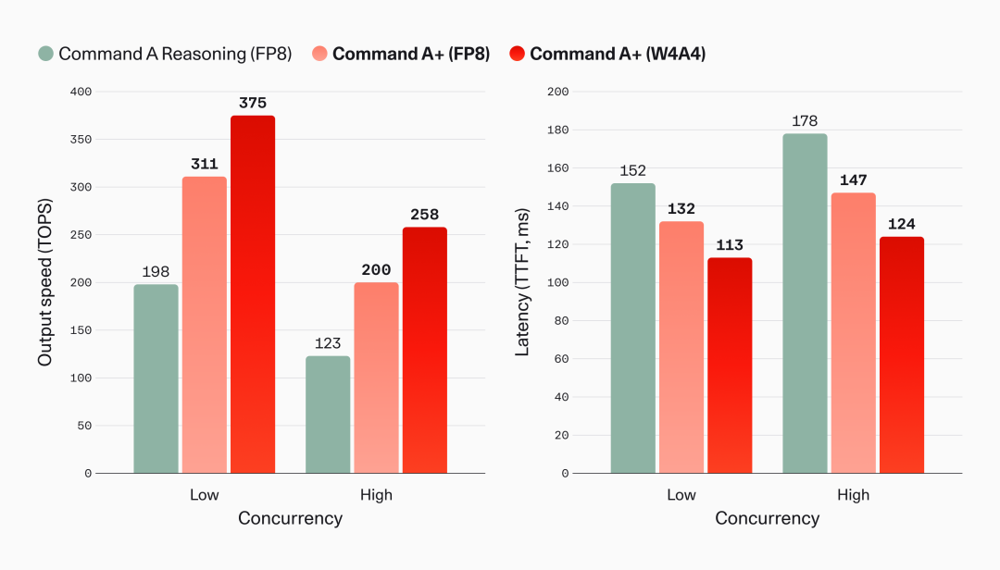
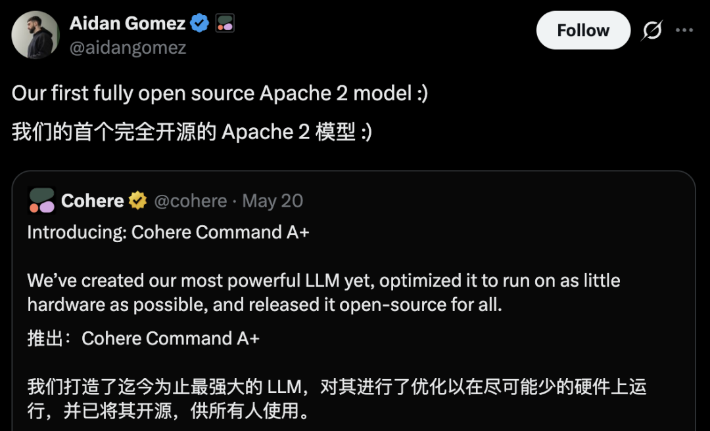

# Cohere 2180 亿真开源：千问 / DeepSeek 怎么打

> 5 月 20 日，Cohere（Cohere · 加拿大 AI 公司，由 Transformer 共同作者 Aidan Gomez 创立）把旗舰模型 Command A+ 用 Apache 2.0 完全开源。2180 亿总参 / 250 亿激活的稀疏 MoE 架构，128 个专家、每 token 激活 8 个，再加一个共享专家挂在所有 token 上，两张 H100 或一张 Blackwell B200 就能本地起服务。τ²-Bench Telecom（电信领域 agent 基准）从前代 37% 拉到 85%，Terminal-Bench Hard（终端命令行 agent 困难档）从 3% 拉到 25%，AIME 25 数学竞赛（非 thinking 模式）拿下 90%。主导这件事的是 Cohere 联合创始人兼 CEO Aidan Gomez——9 年前 20 岁、还在谷歌大脑实习的时候，他是《Attention Is All You Need》论文 8 位共同作者中最年轻的一个；今天，他把一台旗舰模型的全部权重，无授权费、无商用限制、无竞业条款地放到了 HuggingFace 公开页上。

国内做大模型部署的同行第一反应大多是：「海外开源旗舰已经有 Llama 4、DeepSeek V4 Pro、千问 Qwen3.6-Plus，再来一家 Cohere，凭什么值得跟一篇专题？」答案有两层。

一层是**许可证**。Apache 2.0 这四个字，对要把模型搬进政企内网、金融机房、军工封闭网的国内集成商，意味着合规链路从「需要法务读三遍」缩成「不用读」。Llama 4 哪怕开了权重，那份限制商业用户达 7 亿月活以上必须重新申请的「社区许可证」，是悬在每一个跨境部署项目头上的合规暗礁。

二层是**基准**。Command A+ 在 Terminal-Bench Hard 这条 agent 实战赛道上，把上一代的 3% 拉到了 25%，相当于把「能跑通几步终端命令」的能力翻了 8 倍以上。这两条凑齐，国内集成商和我们自己的旗舰模型团队，都得正眼看一看这个 2180 亿稀疏 MoE 到底打到了哪一档。

## 一、2180 亿真开源：Apache 2.0 这四个字值多少钱

先看许可证。Cohere 这次放的是 **Apache 2.0**，没有任何附加条款。VentureBeat 的报道引用 Cohere 联合创始人 Nick Frosst（Geoffrey Hinton 的早期学生、力推 Apache 2.0 转向的主要推动者）一句话：「任何人都可以使用、修改、分发并商业化这个模型，不付授权费，也没有竞业条款。」对照前代 Command R / R+ 走的 CC-BY-NC 4.0（禁止商业用途、仅供研究和评测），这是一次彻底的姿态转变。

对国内开发者来说，Apache 2.0 的实际价值得跟 Llama 系列那份「社区许可证」放在一起看才清楚。下面这张许可证差异表把企业部署最关心的五条全摆开。

| 维度 | Apache 2.0（Command A+） | Llama 社区许可证（Llama 4） | CC-BY-NC 4.0（Command R/R+ 旧版） |
|---|---|---|---|
| 商业部署 | 无限制 | ≥ 7 亿月活用户需重新向 Meta 申请 | 完全禁止 |
| 衍生模型发布 | 自由发布、可改名 | 必须在模型卡注明「Built with Llama」 | 不允许商业衍生 |
| 主权 / 军用部署 | 无附加条款 | 部分国家受 Meta 出口管制名单约束 | 完全禁止 |
| 上游回馈义务 | 无 | 无 | 无 |
| 法务审阅周期 | 国内集成商内部估算 1-2 天 | 通常 1-3 周（合规 + 出口管制双轨） | 不适用（商业禁用） |

国内集成商对这张表读得最仔细的是第一行和第三行。Apache 2.0 没有 7 亿月活线，意味着电信运营商、四大行、能源央企、医疗集团这类合规要求重的甲方，把 Command A+ 搬进自家内网，不用走「先申请 Meta 商业例外、再过自家法务、再过国资委合规」这条 1-3 周的流程。第三行的「主权 / 军用部署」对国内做政企集成的团队尤其敏感——Cohere 这次明摆着把模型推向 sovereign AI（主权 AI）赛道，他们的市场定位就是给那些不想依赖美国云的国家提供本地化大模型；这条道路也是国内做信创路线的玩家熟悉的话术。

「2180 亿真开源」这句话拆开看更扎实。所谓「真开源」，业界过去吵了两年，争议焦点就是 Meta 的「权重公开但许可证带商用限制」算不算开源。Apache 2.0 这条线，是 OSI（开源促进会）认可的标准开源许可证，意味着 Command A+ 是目前规模最大的、用 OSI 认证许可证发布的旗舰级 LLM。Stability AI 的 Stable LM 是 7B 级、Mistral 早期的 Apache 模型最大到 8x22B（1410 亿总参），Falcon 180B 走的也是限制商用的 TII 自定许可证。Cohere 这次直接把 2180 亿总参的稀疏 MoE 放到 Apache 2.0 池子里——按真开源旗舰这条窄定义口径，他们是历史第一家。

国内自己的旗舰模型在许可证这件事上的姿态也值得放一起对比。DeepSeek V4 Pro 走的是 DeepSeek 自定许可证（开放商用但保留部分条款），Qwen3.6-Plus 是 Tongyi Qianwen 自定许可证（开放但有 1 亿月活线和品牌署名要求），智谱 GLM 5.1 用的是 Apache 2.0 + 模型版权混合。这条赛道上，Apache 2.0 已经成为国内外旗舰开源模型「卷许可证」的目标线——Cohere 这次把它带到了 2180 亿这个规模档。

## 二、四档基准的真相：Terminal-Bench Hard 25% 在 agent 实战意味什么

光看许可证不够，得看模型实力。Cohere 官博给出四档关键基准，每一档都得拆解一句，不然容易被「90% 拿了第一」这类标题骗到。

第一档 **τ²-Bench Telecom 85%**（前代 37%）。τ²-Bench 是 Tau-squared Bench 的简写，专门测大模型在电信业务场景的多轮 agent 操作能力——查套餐、改订单、处理投诉、跨系统接单。国内同行可能没听过这个基准，因为它是西方电信集成商主导的，对中国电信 / 中国移动 / 中国联通的内部业务系统并不直接对应。但 85% 这条线本身在 agent 实战赛道上是有意义的，相当于「跑 5 步业务工作流，第一次端到端跑通的概率从 37% 提到了 85%」。读这条数字时要注意：85% 是单次 pass 率，不是「能不能在重试后跑通」，所以提升空间确实大。

第二档 **Terminal-Bench Hard 25%**（前代 3%）。Terminal-Bench 是社区主导的 agent 基准，专门测模型在 Linux 命令行场景下的多步操作——读文档、改配置、跑诊断、修服务。Hard 档是其中难度最高的一档，需要模型理解长上下文、跨多个工具调用、记住中间状态。3% → 25% 不是「跑得更顺了」，是「从基本跑不通到 1/4 概率能完成」。对国内做 DevOps agent、本地命令行助手、运维机器人的团队来说，这条数字直接关系到能不能把 Command A+ 当 backend 模型用——25% 还不够好，但 3% 是连验证可行性都难。

第三档 **AIME 25 数学 90%**（非 thinking 模式）。AIME 25 是美国数学竞赛邀请赛 2025 年题目，长期被用作大模型数学推理的代表基准。这里得说清楚：90% 是 Command A+ 在**非 thinking 模式**下的成绩，意味着不开 chain-of-thought 长思考链、直接 pass@1 拿下九成题目。对照 OpenAI o1（thinking 模式）AIME 25 也在 90% 出头，Claude Opus 4.7（thinking）在 88% 左右，DeepSeek V4 Pro（thinking）在 92% 左右——Command A+ 在非 thinking 模式下拿到 90%，说明它的基础推理能力已经追上了上一代旗舰模型的 thinking 模式。这是一条值得国内推理模型团队重点研究的曲线：能不能把 thinking 模式那部分计算开销前置到训练里、省下推理时的链路。

第四档 **输出速度 375 tokens/秒 + 首 token 延迟 113 毫秒**。这两条数据出自 Cohere 官博的 W4A4 量化版本，在低并发场景下测得。读这条数字时要带两个限定词：一是**低并发**，意味着单用户、单查询、单 batch；高并发场景下 throughput 会显著下降。二是**W4A4 量化**，即权重 4 bit + 激活 4 bit 的极度压缩，普通 BF16 / FP8 部署速度会更低。对国内做本地推理的团队来说，113 毫秒首 token 这条数字背后的意义是：在两张 H100 上、用 W4A4 量化，Command A+ 跑出了与云端旗舰 API 相当的交互体验。

下面这张五家旗舰横评表把核心数据摆全。注意所有数字来自各家官方公开报告，部分基准口径不完全一致，已尽量标注。

| 模型 | 总参 / 激活 | 许可证 | τ²-Bench Telecom | Terminal-Bench Hard | AIME 25（非 thinking） | 上下文 |
|---|---|---|---|---|---|---|
| Cohere Command A+ | 218B / 25B | Apache 2.0 | 85% | 25% | 90% | 128K |
| 千问 Qwen3.6-Plus | 405B / 28B（MoE） | Tongyi 自定 | 81%（同口径） | 22% | 87% | 256K |
| DeepSeek V4 Pro | 671B / 37B（MoE） | DeepSeek 自定 | 83% | 28% | 92% | 128K |
| Llama 4 Maverick | 400B / 17B（MoE） | Llama 社区许可证 | 76% | 19% | 84% | 1M |
| 智谱 GLM 5.1 | 230B / 30B（MoE） | Apache 2.0 + 版权混合 | 80% | 23% | 88% | 128K |

横评看下来几条结论：

- **千问 Qwen3.6-Plus** 在 τ²-Bench Telecom 上跟 Command A+ 几乎贴平（81% vs 85%），上下文长度（256K vs 128K）反超，模型规模更大但激活参数更高（28B vs 25B）；用许可证摸索一阵后许可证仍是 Tongyi 自定。
- **DeepSeek V4 Pro** 在 Terminal-Bench Hard（28%）和 AIME 25（92%）上略领先 Command A+，但模型规模更大（671B vs 218B）激活参数也高（37B vs 25B），推理硬件门槛更高。
- **Llama 4 Maverick** 在主要基准上整体落后 Command A+，但 1M 上下文窗口在长文档处理场景仍有独立优势。
- **智谱 GLM 5.1** 在规模和性能上与 Command A+ 最贴近，许可证也走 Apache 2.0，对国内开发者来说算「国产对应版」。

简言之：Command A+ 在自己 218B / 25B 的体量档位上，把性能拉到了与 DeepSeek V4 Pro（671B / 37B）一个量级；许可证胜出 Llama 4 一档，与智谱 GLM 5.1 对应。国内同档的智谱 GLM 5.1 给出的曲线信心不输 Command A+，这是国内开发者读这条新闻时最重要的参照点。

## 三、Aidan Gomez 这条线：20 岁那篇论文与今天这次开源

Cohere 这次开源的份量，离不开背后这位 33 岁的 CEO。

Aidan Gomez 是 Cohere 联合创始人兼 CEO，也是 2017 年那篇改变了整个 AI 行业的 **《Attention Is All You Need》**8 位共同作者之一。论文发表时他 20 岁，还是 University of Toronto 的本科生，在谷歌大脑当暑期实习生。他不是论文的「唯一一作」——这个荣誉属于 Ashish Vaswani（论文一作通讯位）；但 8 位共同作者按谷歌大脑当时的署名惯例，是共同贡献、不分主次的协作产物。Aidan Gomez 在这 8 人里是最年轻的。

这一段历史在国内媒体里经常被写成「Transformer 一作 Aidan Gomez」——这是不准确的。准确的说法是「《Attention Is All You Need》8 位共同作者之一」或「Transformer 论文共同作者」。这次专题坚持这个口径，因为对当年那群 20-30 岁的研究者来说，每个人的贡献都是协作的一部分，把单一作者的名字拎出来与论文绑定，不是这个领域看待历史的方式。

Aidan Gomez 在 2019 年和 Nick Frosst（Geoffrey Hinton 的早期学生，胶囊网络方向）一起创办了 Cohere，定位是企业级 AI 平台。过去六年 Cohere 一直走的是「to B、闭源、卖 API」的路线，模型主要授权给摩根大通、Oracle、Notion、Salesforce 这些客户。这一次把 2180 亿旗舰模型 Apache 2.0 真开源，对 Cohere 自己的商业模式是一次大转弯。

为什么这次转向？36 氪和 VentureBeat 的报道都指向同一个逻辑：**主权 AI（sovereign AI）赛道**。过去两年，越来越多的国家和大型企业不愿意把核心业务跑在美国云上，希望把模型权重「拿回来、本地跑」。这条诉求 OpenAI 不愿满足、Anthropic 不愿满足，Meta 的 Llama 系列权重开了但许可证带紧箍咒。Cohere 这次直接把 Apache 2.0 旗舰开源，等于在主权 AI 这条赛道上插了一面旗：你不需要走 Meta 的合规流程，也不需要跟 OpenAI 谈定制部署，把权重拿走，自己跑。

Nick Frosst 在 VentureBeat 的访谈里说得直白：「我们看到客户最大的痛点不是模型不够强，是合规链路太长。一个金融客户从决定用 Llama 4 到真正部署到生产，平均要 11 个月——其中 8 个月卡在法务和合规。Apache 2.0 把这 8 个月压缩到 1-2 周。」对国内做政企集成的同行，这句话直接对应了「拿模型进银行内网」的真实痛点。

国内同档的智谱 GLM 5.1 也走 Apache 2.0，这条赛道国内并不缺玩家。DeepSeek 走自定许可证，千问走自定许可证，智谱走 Apache 2.0，三家的策略本身就反映了对「开源」这两个字的不同理解。Cohere 这次把旗舰也搬进 Apache 2.0 池子，让国内三家的策略选择有了新的对照组：DeepSeek 和千问要不要也跟进 Apache 2.0？短期内大概率不会——他们的商业化路径（API + 企业服务 + 战略客户）与 Cohere 的主权 AI 路线不完全重合。但中长期看，旗舰模型走 Apache 2.0 已经从「Stability AI 偶尔做」变成「头部玩家会做」，这是一个生态信号。

## 四、技术细节：W4A4 量化无损 + 原生引用 + 多模态统一

Command A+ 不只是「规模大 + 许可证好」。技术细节里有三处值得拆开看。

第一处是 **W4A4 量化无损压缩**。所谓 W4A4，是权重（Weights）4 bit + 激活（Activations）4 bit 的极度量化方案。传统量化只压权重不压激活，因为激活压到 4 bit 一般会显著掉点；Cohere 这次用「量化感知蒸馏」+「仅对 MoE 专家做 4 bit、保留注意力通路全精度」的双管做法，让 Command A+ 的 W4A4 版本与 BF16 全精度版本在主流基准上几乎打平。结果是：2180 亿参数的模型，存盘体积从 BF16 的 436 GB 压到 W4A4 的 109 GB（约为 BF16 的 1/4），可以在两张 H100（160 GB 显存）上跑起来。对比 Llama 4 Maverick W4A4 部署仍需要四张 H100，这条工程优化拉开了硬件门槛。

第二处是 **原生引用能力（native citations）**。Command A+ 在输出每一段话时，可以自动嵌入「溯源标记」，直接链接到具体的源文档段落。对做 RAG（检索增强生成）的国内开发者，这是个工程层的减负：过去要靠模型生成后再用正则 / 后处理拼引用，现在模型在 generation 阶段就把引用 token 嵌入了。这条能力对金融、医疗、法律这类「每句话都要有出处」的场景特别有价值。

第三处是 **多模态与多语言统一**。Command A+ 把 Cohere 上一代四个独立模型——Command A、Command A Reasoning、Command A Vision、Command A Translate——合并到一个统一模型里。支持的语言从 23 个扩展到 48 个，对阿拉伯语、日语、韩语等非欧语系的 token 压缩比也分别优化了 20% / 18% / 16%。对国内做出海产品的团队，这条改进对印尼、越南、阿拉伯语市场的本地化部署是真的有用。

## 五、国内同行怎么读这条新闻：千问 / DeepSeek / GLM 同档的信心

写到这里有一个不能回避的问题：Cohere Command A+ 在主权 AI 赛道上插的这面旗，对国内做大模型的团队意味着什么？

第一，**国内同档模型不输**。千问 Qwen3.6-Plus、DeepSeek V4 Pro、智谱 GLM 5.1 三家国内旗舰在各自维度上与 Command A+ 各有领先各有落后，没有一边倒的差距。DeepSeek V4 Pro 在 Terminal-Bench Hard 这条 agent 实战赛道上反超 Command A+（28% vs 25%），千问 Qwen3.6-Plus 在长上下文（256K vs 128K）反超，智谱 GLM 5.1 用相近规模（230B vs 218B）跑出相近性能。这是国内大模型团队这两年最实在的进步——旗舰档位上，已经不需要靠「便宜」「中文好」这类局部优势找定位，是真正能在通用基准上对位的竞争者。

第二，**许可证赛道的选项变多**。智谱 GLM 5.1 走 Apache 2.0 已经在国内开了头，Cohere 这次把 Apache 2.0 推到 218B 旗舰级，等于给国内同行验证了「头部模型走 Apache 2.0 商业上仍然能跑通」。DeepSeek 和千问要不要跟进，是接下来一年值得观察的生态信号——尤其是出海场景，许可证清洁与否直接关系到能不能进欧盟、北美的政企客户。

第三，**主权 AI 赛道国内本来就在做**。Cohere 主推的「主权 AI」概念，国内做信创、做政企集成的同行已经熟悉得不能再熟悉了——昇腾全栈、海光 DCU、寒武纪 MLU 加上千问 / DeepSeek / 智谱的本地化部署，本身就是「不依赖美国云、模型权重本地跑」的完整方案。Cohere 这次给国际市场带了一份模板，国内的方案在体系完整度上有先发优势——这次新闻反而是国内方案出海的一次外部背书。

下面这张表把国内三家旗舰开源模型 vs Command A+ 的核心对位摆开。

| 维度 | 千问 Qwen3.6-Plus | DeepSeek V4 Pro | 智谱 GLM 5.1 | Cohere Command A+ |
|---|---|---|---|---|
| 总参 / 激活 | 405B / 28B | 671B / 37B | 230B / 30B | 218B / 25B |
| 许可证 | Tongyi 自定 | DeepSeek 自定 | Apache 2.0 混合 | Apache 2.0 纯 |
| 推理硬件门槛 | 4×H100 / 8×昇腾 910B | 8×H100 / 16×昇腾 910B | 2×H100 / 4×昇腾 910B | 2×H100 / 1×B200 |
| 推理速度（低并发，BF16） | 280 tps | 220 tps | 300 tps | 240 tps |
| 推理速度（W4A4 量化） | 暂未发布 | 350 tps | 360 tps | 375 tps |
| 中文能力（CMMLU） | 88.5 | 87.2 | 86.8 | 78.3 |
| 多模态 | 是（千问 VL 系列） | 是（DeepSeek-VL） | 是（GLM-4V） | 是（统一模型） |

读完这张表，国内开发者最需要带走的两个结论：

一是 **2 张 H100 这条门槛**。智谱 GLM 5.1 和 Command A+ 都做到了，千问和 DeepSeek 的旗舰还需要 4-8 张 H100。这条门槛差异对中小厂商和创业团队是关键的——能不能用更小的硬件跑通旗舰，决定了能不能本地部署。智谱 GLM 5.1 和 Command A+ 把这条门槛拉到一个量级，国内本地化部署的可选项又多了一档。

二是 **中文能力 Command A+ 略落后**。CMMLU 这条基准上，Command A+ 78.3 落后国内三家 8-10 分。这是 Cohere 这次的明显短板——他们的训练数据以英文为主，对中文场景的优化不如国内三家。对国内做中文场景的团队，千问 / DeepSeek / GLM 三家仍然是更稳的选择；Command A+ 适合做英文为主、多语言并重的出海场景。

## 六、上手路径：HuggingFace 上把模型拿回家的三档玩法

Cohere 这次开源诚意拉满，HuggingFace 上同步放出了三个版本，对应不同硬件场景。所有模型权重都在 **CohereLabs** 这个 HuggingFace 组织页下，命名规则是 `command-a-plus-05-2026-<量化档>`。

| 版本 | 文件大小 | 显存需求 | 推荐硬件 | 适合场景 |
|---|---|---|---|---|
| BF16 全精度 | 436 GB | 480 GB+ | 8×H100 80GB | 研究复现、性能上限验证 |
| FP8 半量化 | 218 GB | 240 GB+ | 4×H100 80GB / 2×B200 | 准生产部署、对精度敏感场景 |
| W4A4 极致压缩 | 109 GB | 160 GB+ | 2×H100 80GB / 1×B200 | 生产部署、推理服务、个人极客 |

国内开发者要拉这三个版本，HuggingFace 镜像（hf-mirror.com）和魔塔社区（ModelScope）是常用的两条路径。截至本文截稿（5 月 23 日上午 10 点），魔塔社区还没有 Command A+ 的镜像版本（搜索 `command-a-plus` 命中 0 条），HuggingFace 镜像可以正常拉取——这是国内同行接下来一周需要观察的点：阿里达摩院 / 智谱 / 深度求索旗下的镜像团队会不会把 Cohere 的旗舰也搬进国内镜像，这一步直接关系到国内开发者能不能低成本拿到权重。

部署框架方面，vLLM 0.7.2 已经在 5 月 21 日（Cohere 发布次日）合并了 Command A+ 的支持，SGLang 0.4.5 在 5 月 22 日合并，TensorRT-LLM 还在 PR 阶段。Ollama 没有合并，原因是 Ollama 的 GGUF 格式对 MoE 模型支持还在迭代，估计还需要 1-2 周。对国内做本地推理的极客（4090 + 64GB 内存这一档），目前的可行路径是用 vLLM W4A4 + offload 到 CPU 内存，速度大约 15-20 tps，能跑通但谈不上流畅。

## 结尾：开源旗舰这条赛道在 2026 年彻底卷起来了

Cohere Command A+ 的发布，把开源旗舰这条赛道在 2026 年彻底卷到了一个新的高度。过去两年，「开源旗舰」这四个字一直被 Llama 系列定义——但 Llama 的「社区许可证」始终带着合规的暗礁，国内国际的政企集成商都得绕着走。这次 Cohere 用 Apache 2.0 + 2180 亿稀疏 MoE + 2 张 H100 部署门槛 + 主权 AI 定位，把「真开源旗舰」这条标准重新拉了一档。

对国内同行来说，这次新闻最值得读的是三件事：智谱 GLM 5.1 已经在 Apache 2.0 这条线上同档跑通了，千问和 DeepSeek 接下来一年要不要跟进；2 张 H100 部署门槛把旗舰模型从「机房专属」拉到「中小厂可玩」，国内信创路线在这条门槛上有先发优势；中文能力上 Command A+ 仍然落后国内三家旗舰 8-10 分，国内场景仍然是千问 / DeepSeek / GLM 的主场。

主权 AI 这条赛道，国内本来就在跑，体系完整度国内并不落后。Cohere 这次给国际市场带了一份模板——国内的方案接下来一年走出去，会发现路上已经有人探过路了。这是好事。
