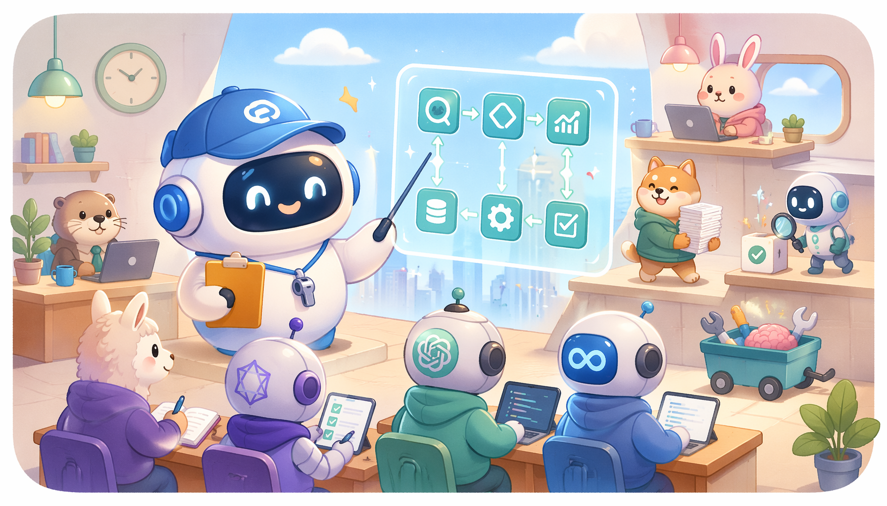
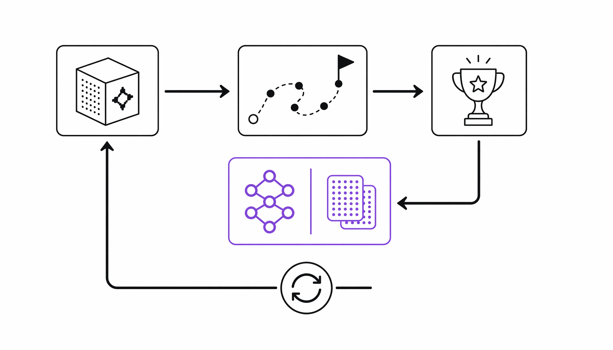
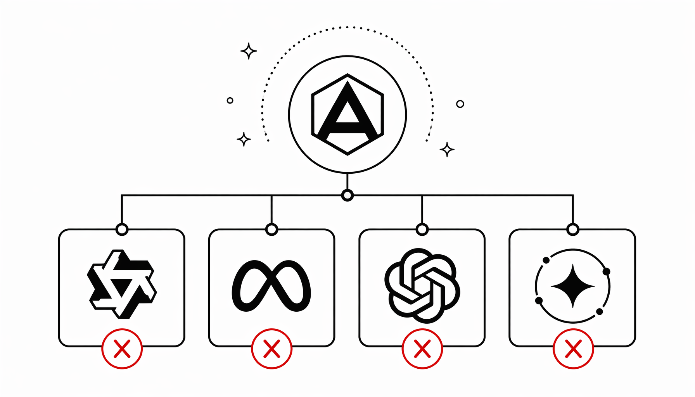
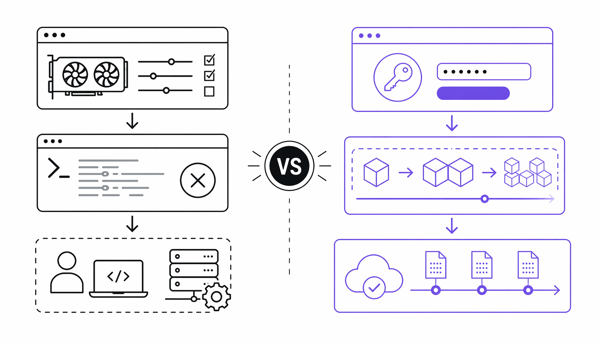

# 开源框架ART：用GRPO强化学习，让小模型学会“上班”

> ai-daily · 2026 年 5 月 24 日 02:42 · 来源：GitHub Trending python



凌晨两点，旧金山的某个共享办公室里，七个工程师盯着屏幕上的一行报错发呆。

`RuntimeError: CUDA error: out of memory`


这不是什么新鲜事。任何一个尝试过在自己机器上跑 RL（强化学习）训练的人，都见过这行红字。但 Brad Hilton 和他的团队没打算再忍——他们决定把整个训练流程扔进一个“无服务器”的黑箱里，让开发者只关心三件事：数据、环境和奖励函数。


2025 年 7 月，OpenPipe 在 GitHub 上正式开源了 ART（Agent Reinforcement Trainer），一个专为多步智能体设计的 GRPO 训练框架。与此同时，他们还上线了 W&B Training（Serverless RL）服务——号称“全球首个可公开使用的无服务器 RL 训练平台”。

**让 AI 学会上班，而不是只会考试。**

---

## 从“考高分”到“干好活”，RL 正在重写 Agent 的成长剧本

过去两年，大模型的评估方式一直有个尴尬的错位。我们在 MMLU、HumanEval、GSM8K 这些基准上反复刷榜，但一旦把模型扔进真实工作流——比如让它搜索邮箱、调用 API、操纵第三方工具——就会发现它完全不像个能干活的。

ART 的出现，试图修补这道裂缝。

它的思路很直接：别再用静态数据集做监督微调了，让模型在真实任务中“试错”，然后根据结果好坏来奖惩。具体做法是在任何 Python 应用中嵌入 GRPO（Group Relative Policy Optimization）训练回路。模型执行多步操作，每一步的 system、user、assistant 消息都被记录为一条 Trajectory；任务完成后，开发者给这条 Trajectory 打一个 reward 分数，ART 服务器就在后台用 GRPO 更新 LoRA 权重，再立即加载到 vLLM 推理引擎里。





OpenPipe 官方博客里给了一个让人印象深刻的例子：他们用 Qwen 2.5 14B 训练了一个邮件检索智能体，最终性能超过 OpenAI 的 o3。注意，是 14B 的小模型，不是某个万亿参数的巨兽。这验证了一个正在行业内蔓延的共识——**强化学习可能是小模型翻盘的关键杠杆。**

而且 ART 并不挑模型。框架声明兼容 Qwen3.6、GPT-OSS、Llama 等主流架构，只要是 vLLM 或 Unsloth 能跑起来的因果语言模型都能用。唯一暂时掉队的是 Gemma 3（官方在 README 里直白地写了“不支持”，并邀请社区反馈）。





---

## Serverless RL 到底省了什么？40% 成本、28% 速度、一堆头疼事

如果说 ART 框架本身是“怎么做”，那 W&B Training（Serverless RL）就是“怎么轻松做”。

官方给出了三组硬数字：成本降低 40%、训练速度提升 28%、并发请求可扩展到 2000+。这三个数字背后，是一个核心架构决策——多路复用（multiplexing）共享推理集群。

传统的 RL 训练流程里，开发者要自己搞定 GPU 资源分配、推理引擎部署、训练脚本调试，中间还经常被 CUDA OOM 打断。W&B Training 把这一切抽象成一个 `ServerlessBackend` 接口，你只需要注册一个 API key，剩下的基础设施管理全交给平台。

```python
from art.serverless.backend import ServerlessBackend

model = art.TrainableModel(
    project="voice-agent",
    name="agent-001",
    base_model="OpenPipe/Qwen3-14B-Instruct"
)
backend = ServerlessBackend(api_key="your_wandb_api_key")
model.register(backend)
```

这段代码读起来舒服得有点不真实。尤其是对那些被 `RuntimeError: CUDA error: out of memory` 折磨过的人来说，这简直像从手动档拖拉机直接跳进了自动驾驶特斯拉。

**把 DevOps 的痛苦外包出去，让 RL 训练变成“分钟级”迭代，而不是“小时级”排错。**

不过，这里有个值得追问的点。W&B Training 虽然宣传“零基础设施头痛”，但它本质上依赖 Weights & Biases 的私有推理集群。这让它跟 ART 的“开源”定位形成了一种微妙的张力——框架是开源的，但最省事的训练方式是付费的。这倒不是什么道德瑕疵（毕竟 OpenPipe 也要赚钱），但开发者社区接下来可能会推动更多 self-hosted 的后端做到，比如对接自建的 vLLM 集群。





---

## 笔记本里的未来：从 2048 到 MCP 服务器，Agent 正在重新定义“学会”

ART 仓库里附带了一组 Notebook 示例，看一圈就知道他们想覆盖的场景有多广。

有个 Notebook 是训练 Qwen3 14B 玩 2048 游戏，另一个是 Qwen 2.5 3B 玩 Tic Tac Toe，还有个是 Qwen 2.5 7B 解决 Temporal Clue 推理任务。更“正经”一点的场景包括：用 ART·E 训练邮件搜索 Agent（那个击败 o3 的案例），以及用 MCP·RL 让模型掌握 NWS MCP 服务器的工具调用。

MCP（Model Context Protocol）这块尤其值得关注。OpenPipe 专门写了一篇博文《MCP·RL：教你的模型掌控任何 MCP 服务器》，核心想法是：用强化学习，自动训练模型学会使用外部工具和 API。这意味着未来 Agent 的上岗培训，可能不再是手工写一堆 few-shot prompt，而是让它自己摸索——做对了给糖，做错了挨打。

还有个更激进的实验叫 AutoRL（Zero-Data Training for Any Task）。如其名，完全不需要标注数据，靠自动输入生成和 RULER 评估来训练模型。虽然这个 Notebook 的链接还挂着“Coming soon”，但方向已经很清楚：OpenPipe 在试图把 RL 训练的启动门槛降到零。

我看到这些 Notebook 列表的时候，第一反应是：这不就是“在职培训”的 AI 版本吗？

人类员工入职后有个上手期，犯错、学习、改进。传统 SFT（监督微调）像是考前刷题，题目都见过，但一上考场换个问法就懵。RL 训练的 Agent 更像是直接扔进工位，边干活边挨骂，慢慢就学会了老板的脾气。

**刷题考满分的人，未必能写好周报；挨骂长大的 Agent，可能更懂业务。**

---

话说回来，ART 现在还是个很早期的项目。文档里大量链接标注着“Coming soon”，支持的 Notebook 有一半还没上线，Gemma 3 的兼容性也不知道什么时候能修好。但它的方向感很清晰——让强化学习从实验室走进生产环境，让 Agent 从“能聊天”变成“能干活”。

而那个 CUDA out of memory 的深夜报错，可能很快就要变成历史遗迹了。或者说，至少不再是你的问题——它现在是 W&B 的运维工程师该头疼的事了。

---

## 参考来源

- GitHub: OpenPipe/ART — https://github.com/OpenPipe/ART
- ART·E: How We Built an Email Research Agent That Beats o3 — https://openpipe.ai/blog/art-e-agent
- MCP·RL: Teach Your Model to Master Any MCP Server — https://openpipe.ai/blog/mcp-rl
- AutoRL: Zero-Data Training for Any Task — https://openpipe.ai/blog/autorl
- RULER: Easy Mode for RL Rewards — https://openpipe.ai/blog/ruler

#OpenPipe #ART #Agent #Reinforcement #Trainer
