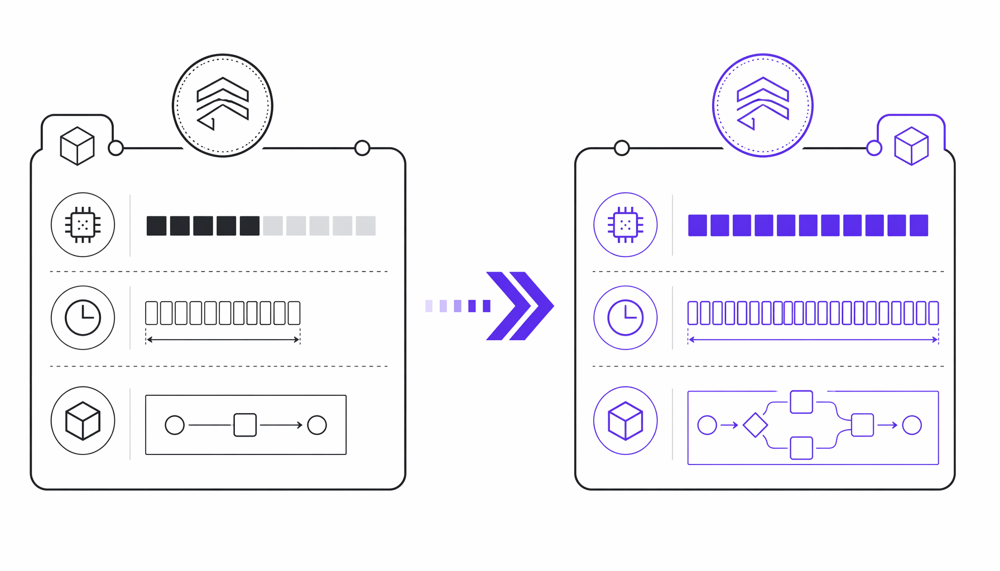
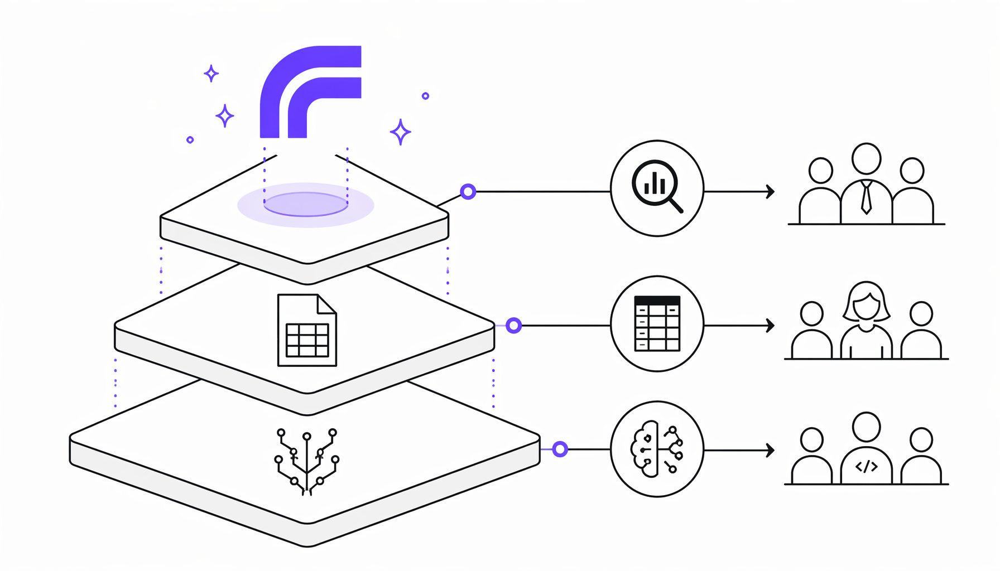
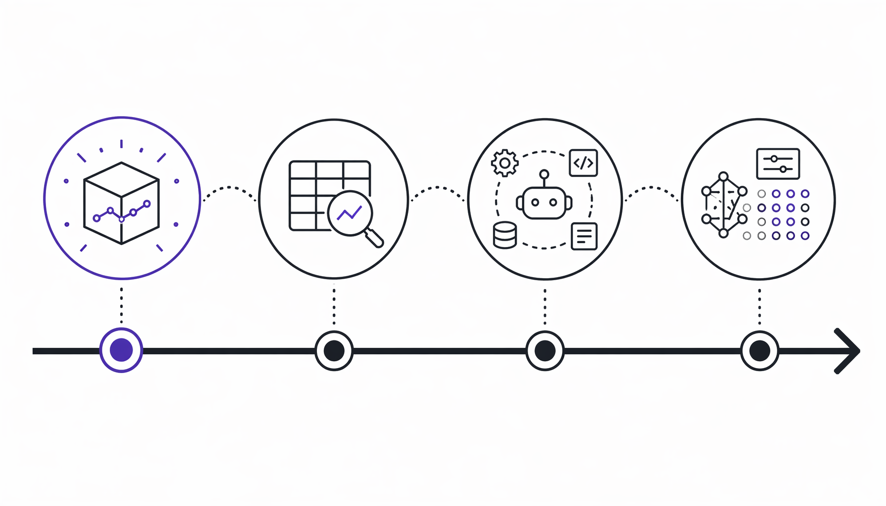

# 谷歌TimesFM 2.5发布：仅200M参数，预测序列长度却翻了8倍

> ai-daily · 2026 年 5 月 24 日 08:24 · 来源：GitHub Trending python


2025 年 9 月 15 日，Google Research 悄悄更新了 TimesFM 的 GitHub 仓库。没有发布会，没有博客头条，连版本号都只从 2.0 跳到了 2.5——但这可能是时序预测领域今年最被低估的一次模型升级。

我翻完整个 changelog 的时候，脑子里反复出现一个画面：一个 200M 参数的小模型，躺在 Hugging Face 上，被 BigQuery ML 调用，被 Google Sheets 用户拖进电子表格，被 Vertex AI 封装成 Docker 端点供 agent 调用——而它支持的上下文长度，已经从 2048 跳到了 16000。


**小模型吃掉大场景，才是 Google 真正的阳谋。**

## 从 500M 压到 200M，参数砍半但能力翻倍

TimesFM 2.5 最反直觉的操作是参数量的变化：从 2.0 版本的 500M 直接砍到 200M，减少了 60%。按照大语言模型世界的逻辑，参数缩水通常意味着能力降级，但 TimesFM 2.5 偏偏在缩小的同时把上下文长度从 2048 拉到了 16k——这是 8 倍的扩展。





更狠的是，它加了一个可选的 30M 参数量化头（quantile head），能一次性输出连续分位数预测，horizon 拉到 1000 步。也就是说，核心模型 200M + 量化头 30M，总共 230M 参数，就能给出从第 10 到第 90 百分位的预测区间——这在传统统计模型里需要跑多次 bootstrap 才能做到的事，现在一次前向传播就完成了。

让我愣神的是它直接砍掉了 `frequency` 指示器。在 TimesFM 1.0 和 2.0 里，你需要显式告诉模型你的数据是按小时、按天还是按周采样的，这其实是传统时序模型（比如 ARIMA、Prophet）的思维残留。2.5 版本把这个包袱扔了，意味着模型自己从数据里学周期性——这背后很可能是训练数据的大规模混合采样的结果，模型见过足够多的频率模式，不再需要人工标注。

## 从 BigQuery 到 Google Sheets，一套模型吃掉三层用户

TimesFM 2.5 真正有意思的地方不在模型架构本身，而在于它在 Google 产品矩阵里的嵌入方式。原文明确列了三个落地场景：

> BigQuery ML：企业级 SQL 查询，面向可扩展性和可靠性。
> Google Sheets：面向日常电子表格用户。
> Vertex Model Garden：Docker 化端点，供 agent 调用。





这三层分别打的是完全不同的用户群。BigQuery ML 里跑 TimesFM，面向的是数据工程师——写一行 SQL 就能在几十亿行数据上做预测，不需要懂 PyTorch，不需要调 learning rate。Google Sheets 里嵌 TimesFM，面向的是业务分析师——在单元格里拖拽历史销售数据，模型自动补未来 12 个月的趋势线。Vertex Model Garden 的 Docker 端点，则是给开发者用的，agent 可以直接调 API 做决策链里的预测环节。

我查了一下时间线：TimesFM 的论文是 ICML 2024 发的，2.0 版本应该是 2024 年下半年的事，2.5 在 2025 年 9 月 15 日发布，随后 10 月 29 日补上了协变量支持（XReg），2026 年 3 月 19 日补上了 agent skill 定义文件（SKILL.md），4 月 9 日又加了基于 HuggingFace Transformers + PEFT 的 LoRA 微调示例和单元测试。这个迭代节奏非常密集——半年内从模型发布到工程化补全，社区贡献者 @kashif、@darkpowerxo、@borealBytes 的 PR 被明确致谢，说明 Google 在有意识地用开源社区的反馈来加速产品化。





还有一个细节值得琢磨：2.5 版本同时支持 PyTorch 和 Flax 两套推理后端，安装命令里明确写了 `[torch]` 和 `[flax]` 两个选项。Flax 是 Google 自己的 JAX 生态，在 TPU 上推理速度有明显优势。这意味着 Google 内部很可能已经在 TPU 集群上大规模部署了这个模型，对外开源 PyTorch 版本更多是为了降低社区使用门槛。

## 时序基础模型的「GPT-2 时刻」

如果找一个类比，TimesFM 2.5 给我的感觉很像 2019 年的 GPT-2——参数不大（当时 GPT-2 最大的 1.5B 版本在今天看也是小模型），但验证了"预训练 + 下游任务"这个范式在文本之外的领域也能跑通。时序预测过去是统计学家和量化金融的专属地盘，ARIMA、ETS、Prophet 这些经典方法需要对每个时间序列单独拟合参数。TimesFM 的思路完全不同：一个模型，预训练好，拿来就能对没见过的序列做零样本预测。

代码示例里有一个细节很说明问题。模型接收的 `inputs` 是一个列表，里面可以塞不同长度的时间序列：

```python
inputs=[
    np.linspace(0, 1, 100),      # 100 个点的线性序列
    np.sin(np.linspace(0, 20, 67)),  # 67 个点的正弦波
]
```

两个完全不同的序列，长度不同、模式不同，一次调用，模型同时输出各自的点预测和分位数预测。`point_forecast.shape` 返回 `(2, 12)`，`quantile_forecast.shape` 返回 `(2, 12, 10)`——2 条序列，每条预测 12 步，10 个分位数。这种批量零样本预测能力，在供应链、零售、能源这些需要同时对成千上万条时序做预测的场景里，是传统方法根本做不到的。

而且 TimesFM 2.5 的 `ForecastConfig` 里塞了一堆实用开关：`normalize_inputs=True` 自动做输入归一化，`force_flip_invariance=True` 强制翻转不变性，`infer_is_positive=True` 推断序列是否为正值，`fix_quantile_crossing=True` 修复分位数交叉问题。这些 flag 的存在说明 Google 在落地过程中踩过真实的坑——分位数预测里不同百分位的曲线经常会交叉（比如 P90 的预测值反而低于 P50），这是业界的经典痛点，TimesFM 直接内置了修复逻辑。

**一个 200M 参数的模型，正在悄悄吃掉时序预测的三大市场：企业数据仓库、电子表格、AI agent。**

Google 没有大张旗鼓宣传这件事，但 TimesFM 2.5 的产品化路径已经清晰得不能再清晰了。它不像 OpenAI 那样追求 AGI 叙事，而是把一个具体任务做到极致，然后塞进 Google 已有的产品矩阵里，让用户甚至意识不到自己在用"AI 模型"——他们只是在 BigQuery 里跑了个 SQL，在 Sheets 里拖了个公式，在 Vertex 上调了个端点。

开源仓库顶部那行小字写得很克制："This open version is not an officially supported Google product." 但看看它被集成到 BigQuery ML 和 Google Sheets 里的现实，再看看社区贡献者名单和半年四次的更新频率，这句话更像是一种法律免责声明，而不是对项目野心的描述。时序预测这个领域，可能正在经历属于自己的"预训练模型时刻"——而这次的主角不是 OpenAI，是 Google Research。

## 参考来源
- https://github.com/google-research/timesfm
- TimesFM Hugging Face Collection: https://huggingface.co/collections/google/timesfm-66ff9f3c1e1c5f3f3c4d7e9a
- ICML 2024 paper: A decoder-only foundation model for time-series forecasting
- Google Research blog on TimesFM
- BigQuery ML documentation
- Google Sheets integration
- Vertex Model Garden

#TimesFM #Time #Series #Foundation #Model
