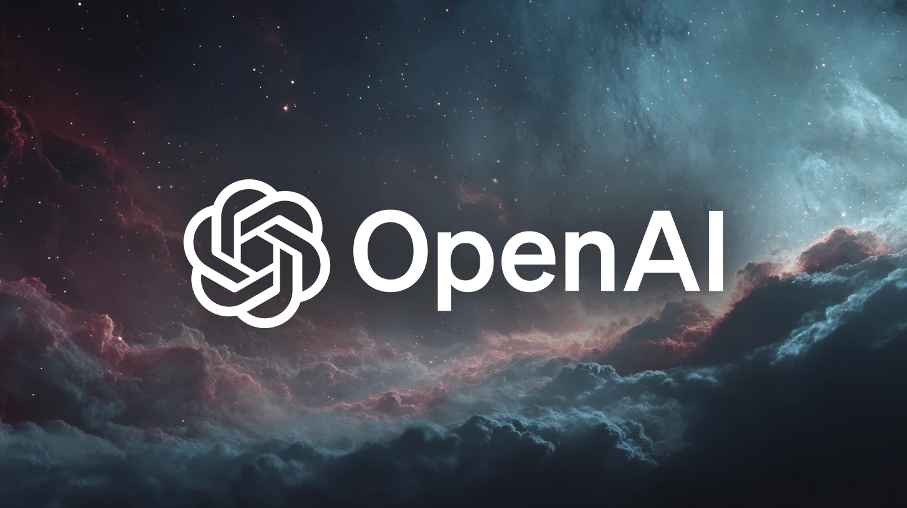
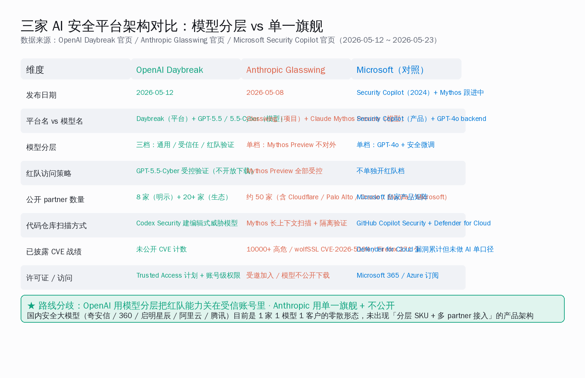
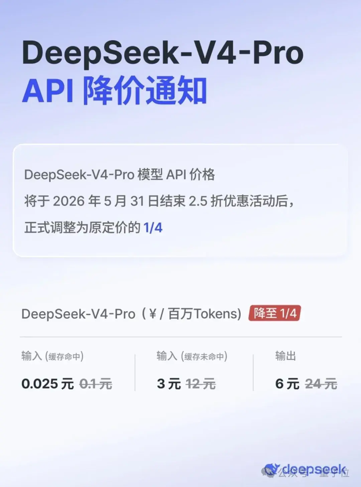
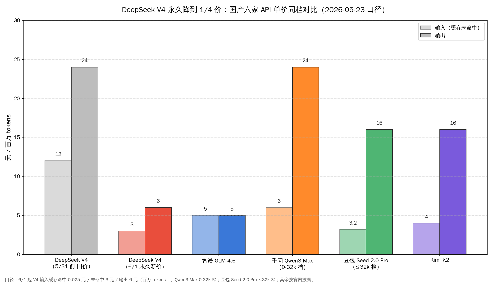
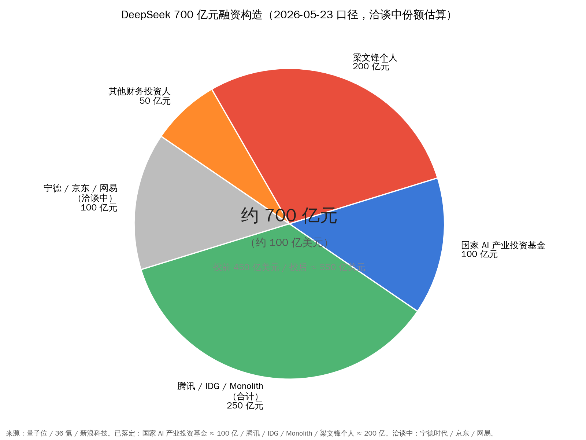
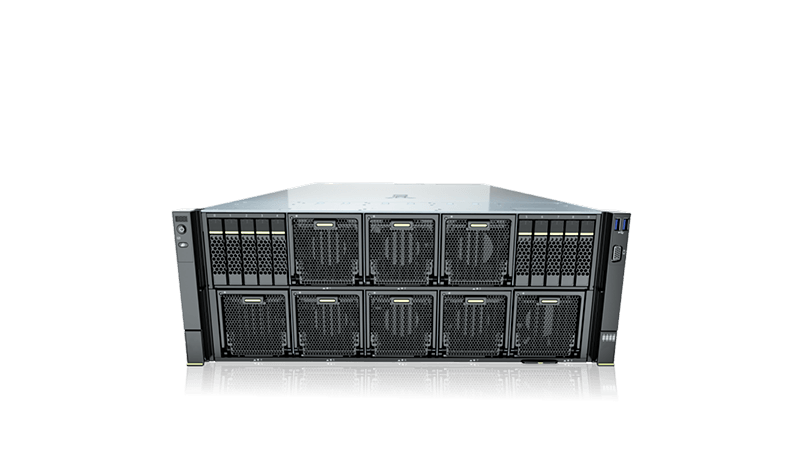
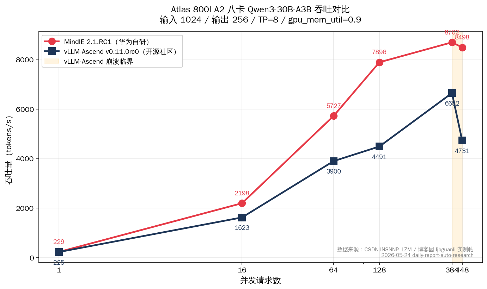
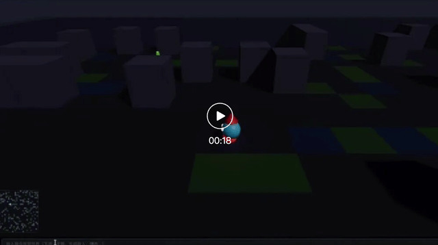

# DeepSeek 700 亿 · OpenAI 押 8 家安全 · 昇腾跑通 Qwen3-Coder | AI 日报 | 2026-05-24

## 📋 头版目录

- 🛡 OpenAI 5/12 发布 Daybreak 平台：GPT-5.5 拆通用 / Trusted Access / GPT-5.5-Cyber 三档 SKU → 头条
- 🛡 绑 Cisco / Cloudflare / Palo Alto / CrowdStrike / Fortinet / Oracle / Akamai / Zscaler 八家全球安全龙头 → 头条
- 🛡 Anthropic Glasswing 5/22 第一阶段更新：Claude Mythos Preview 一月扫 10000+ 高危漏洞 → 头条
- 🛡 Cloudflare / Palo Alto / Oracle 三家同时押两家：AI 安全工具进多模型并行评估常态 → 头条
- 💰 DeepSeek V4 系列 API 自 6/1 起永久降到原价 1/4：输入缓存命中 0.025 元 / 未命中 3 元 / 输出 6 元 → 头条
- 💸 DeepSeek 约 700 亿元融资进入收尾：投前 450 亿美元 / 融后 550 亿美元 → 头条
- 🇨🇳 国家 AI 产业投资基金 100 亿 + 腾讯 + IDG + Monolith 落定 + 梁文锋个人 200 亿 → 头条
- 🇨🇳 宁德时代 / 京东 / 网易仍在洽谈中：算力 — 能源 — 物流产业联盟成形 → 头条
- 🇨🇳 国产 IDE 接本地大模型现状：五家里只有 Trae v3.3.51 + Qwen Code v0.16.1 真打通 base_url → 头条
- 🏭 Atlas 800I A2（8× 昇腾 910B4）跑通 Qwen3-Coder-Next：MindIE 2.1.RC1 在 384 并发做到 8702 tok/s → 头条
- 🇨🇳 智谱 GLM-5.1 高速版 5/22 发布：输出 400 tokens/秒，同档千问 Qwen3.7-Max 的 2.1 倍 → 国内 AI
- 🇨🇳 TileRT 自研推理引擎：调度从运行时动态搬到编译期 AOT 静态，GPU 常驻 → 国内 AI
- 🇨🇳 国产安全大模型五家姿态：奇安信 / 360 / 阿里云 / 腾讯混元 / 启明星辰 横评 → 国内 AI
- 🔬 wolfSSL CVE-2026-5194 高危 9.3 分：可伪造证书钓鱼银行 / 邮箱域名 → 要闻
- 🔬 OpenBSD 一个潜伏 27 年的 TCP 协议 bug 被 Mythos Preview 揪出 → 要闻
- 🔬 Mozilla Firefox 150 漏洞数从前代 27 翻到 271：Mythos 比 Claude Opus 4.6 翻 10 倍 → 要闻
- 🛠 Deno 2.8 上线 HN 头帖 404 分：deno transpile / deno why / CDP 网络抓包 + Sandbox 凑齐 AI Coding 沙盒底座 → AI Coding
- 🛠 Kanbots 看板 AI 上 HN 243 分 + GitHub 217 stars：每张卡片跑一个 Claude Code 或 Codex agent → AI Coding
- 🛠 Qwen Code v0.16.1 ~/.qwen/settings.json 一行接本地 Ollama / vLLM → AI Coding
- 🔥 obra/superpowers 单仓累计 20.4 万 stars + multica-ai/andrej-karpathy-skills 14.9 万：skill 仓继续领跑 → GitHub Trending
- 🔥 anthropics/claude-plugins-official 2.6 万 + colbymchenry/codegraph 1.9 万 + QwenLM/qwen-code 2.4 万 → GitHub Trending
- 🎙 梁文锋：「DeepSeek 主要目标是推动技术边界，而不是尽快变现」 → 名人说

---

## 🔥 头条深度

### 头条 1 · OpenAI Daybreak 押 8 家安全龙头 vs Anthropic Glasswing 一月扫 1 万洞：AI 安全进多模型并行评估常态

#### 1.1 OpenAI 5/12 发布 Daybreak：GPT-5.5 拆三档 + 八家明示合作方

5 月 12 日，OpenAI 在 Help Net Security、MarkTechPost、CyberScoop 等多家媒体同步亮出 Daybreak。这是一个面向 AI 安全场景的平台名（不是模型名），对应 Anthropic 那边的 Glasswing 项目。绑在 Daybreak 里跑的模型分三档 SKU：

- **GPT-5.5 通用版**：所有开发者都能调，带标准安全护栏，单价走 OpenAI 标准 API 价目表；
- **GPT-5.5 + Trusted Access for Cyber 受信任防御版**：给已经身份验证过的防御方做安全代码评审、漏洞分诊、恶意软件分析、检测工程、补丁验证，必须证明工作发生在自家授权范围内；
- **GPT-5.5-Cyber 受控红队验证版**：把通用版那些「不要写漏洞利用代码」的护栏放松一部分，**但不对外公开下载**，所有调用走 OpenAI 自家 API，账号级控制 + 强身份验证 + 调用日志全留存，主要任务不是批量写攻击载荷，而是在隔离环境里验证一个漏洞到底能不能利用。三档之外四件事一律禁：凭证窃取、隐蔽持久化、恶意软件投放、未授权利用。

绑在 Trusted Access 计划里的 8 家明示合作方，按工具栈位置摊开看，覆盖得很全：

| 位置 | 合作方 | 角色 |
|---|---|---|
| 网络设备 / 防火墙 | Cisco + Fortinet | 企业内网路由 / 交换 + 下一代防火墙装机量 |
| 端点检测 | CrowdStrike + Palo Alto Networks（Cortex XDR） | 员工电脑 / 服务器主机 / 容器端点信号 |
| 边缘 / CDN | Cloudflare + Akamai | 外部攻击流量、DDoS、爬虫、漏洞扫描 |
| 零信任接入 | Zscaler | 员工身份 + 应用访问层 |
| 基建 / 身份 | Oracle | 核心业务数据库 + 身份目录 |

平台架构之外还绑了一个代理框架叫 **Codex Security**——给已经服役多年的代码代理 Codex 加了一条安全侧链路，专门做四件事：

- 从代码仓库构建可编辑的威胁模型（不是通用扫描器列 1000 条 CVE，而是基于具体代码库构建「这个项目最可能被攻击的路径有哪些」的可编辑模型）；
- 跨多个函数 / 文件 / 依赖追一条具体攻击链路；
- 在隔离环境里跑一遍确认漏洞可利用还是告警噪音；
- 生成补丁强制人工评审。

OpenAI 给的数字是「reduces hours of vulnerability analysis to minutes」——把过去几个小时压到几分钟，但具体 CVE 战绩还需要后续几个月看合作方实战反馈。

#### 1.2 Anthropic 5/22 Glasswing 第一阶段成绩单：1 万洞 + wolfSSL / OpenBSD / Firefox 三战绩

10 天后的 5 月 22 日，Anthropic 在 Anthropic Research 主站公布 Project Glasswing 第一阶段成绩单。Claude Mythos Preview（一款未公开发布的前沿安全模型）和约 50 家合作伙伴一起，**在一个月内扫出超过 10000 个高危 / 严重漏洞**。具体数字：

| 指标 | 数字 | 备注 |
|---|---|---|
| 单月发现高危 / 严重漏洞总数 | 10000+ 个 | 50 家伙伴 + Anthropic 内部团队合并统计 |
| 扫描的开源项目数 | 1000+ 个 | 过去几个月持续扫描 |
| 在开源项目里报出的高危漏洞 | 6202 个 | 自评分 high 或 critical |
| 其中已被人工复核确认有效 | 1587 个 | 真阳性率 90.6% |
| 报告给上游维护者 | 530 个 | 走标准协调披露流程 |
| 已打上补丁的 | 75 个（< 15%） | 维护者侧瓶颈 |
| 已分配 CVE 编号公开通告 | 65 个 | 公开披露完成 |

第一行 10000+ 这个数字挑战的是过去 30 年安全行业的全部挖洞节奏感——CVE 数据库每年总共收录约 30000 个新 CVE，其中只有 15-20% 是高危 / 严重。Mythos Preview 一个月扫出的高危漏洞总数，已经接近全行业每年新增高危 CVE 的 1/4。

第四行的真阳性率 90.6% 是另一个拐点——过去基于规则的静态分析工具（SAST）真阳性率通常在 30% 左右，剩下 70% 是误报噪声，安全工程师过滤误报比挖真洞还累。Mythos Preview 把这条曲线从 30% 拉到 90.6%，意味着安全工程师收到的每 10 条扫描结果里有 9 条真的需要处理。

三个最值得拎出来的具体战绩：

- **Cloudflare** 在自家代码库里挖出约 2000 个 bug（其中 400 个高危 / 严重），误报率比人类测试者更低；
- **Mozilla Firefox 150** 用 Mythos Preview 挖出 271 个漏洞——上一代 Firefox 148 用 Claude Opus 4.6 只挖到 27 个，**整整翻了 10 倍**，新模型在浏览器内核这种千万行代码量级的项目上已经能稳定干活；
- **wolfSSL** 报出 CVE-2026-5194 高危 9.3 分，可以伪造证书钓鱼银行 / 邮箱域名；**OpenBSD** 里一个**潜伏了 27 年的 TCP 协议 bug** 被 Mythos Preview 揪出——这对全球安全研究者的肌肉记忆是一次冲击，过去顶级研究员一辈子的功勋题目，今天被一个模型在协议栈静态分析里翻出来。

首批 11 家合作伙伴是 AWS / Apple / Broadcom / Cisco / CrowdStrike / Google / JPMorgan Chase / Linux Foundation / Microsoft / NVIDIA / Palo Alto Networks，另有约 40 家系统重要软件维护方加入扩展计划。Anthropic 联合创始人 Dario Amodei 在更新里给了一句最值得记住的话——**「过去，软件安全的进度被『我们找到新漏洞的速度』限制住。现在，它被『我们验证、披露、打补丁的速度』限制住。」** 530 个上报的高危里只有 75 个补丁落地，比例不到 15%。挖洞已经不是瓶颈，验证、协调披露、上游维护者打补丁、用户更新部署，整条链都还是人工速度。

#### 1.3 Cloudflare / Palo Alto / Oracle 三家「双押」：AI 安全工具进多模型并行评估常态

把 OpenAI 这边的 8 家明示合作方 和 Anthropic 那边 11 家首批合作方摆在一起对照，最有意思的细节藏在交集里。**Cloudflare、Palo Alto Networks、Oracle 三家全球安全龙头同时押 Anthropic 和 OpenAI 两边**：

- **Cloudflare** 上个月在 Glasswing 跑出了 2000 个 bug（400 个高危），这个月又出现在 Daybreak 的 8 家明示合作方 里覆盖边缘 / CDN 层；
- **Palo Alto Networks** 在 Glasswing 期间释放的 patch 量是平时的 5 倍以上，同时是 Daybreak 端点合作方；
- **Oracle** 被 Anthropic 在 Glasswing 公告里点名「修复速度快了好几倍」，同时是 Daybreak 的基建合作方。

这种双押意味着：对全球安全龙头而言，AI 安全工具已经不是「选一个 vendor 押注」的问题，而是**「多模型并行评估 + 谁家先发现就用谁家」**的常态。Akamai CSO Boaz Gelbord 在 Help Net Security 的报道里给了一段引语——「Frontier models are fundamentally changing vulnerability management, and early access enables us to adapt proactively. The adoption of these capabilities will be critical for enterprise security teams.」前沿模型正在从根本上改变漏洞管理这件事，提前接入让企业能主动适应。这段表态比平台架构本身更值得读：8 家合作方 不是被 OpenAI 拉来站台的，是各家自己判断 AI 安全工具会成为企业安全采购的下一个标准件，所以选择尽早接入做共建。

国内同行第一反应大多是：**我们的安全大模型在哪？**奇安信「QAX-GPT 安全大模型 + AI 燔石漏洞挖掘 agent」、360「大模型安全卫士」、启明星辰「九天·泰合 + 安星智能体」、阿里云通义千问安全侧、腾讯混元安全侧——产品形态齐了。

但**目前没有出现「模型分三档 + 8 家以上联盟接入」这种产品姿态**。差距不在模型本身，而在产品组织方式：海外把 AI 安全做成多家共建的开放平台，国内还停留在一厂一客户的封闭项目制。完整对位与国内安全大模型五家横评，见今日「OpenAI 的 AI 安全平台：8 家合作方 双押」与「Anthropic 一月挖一万洞：国产安全模型还差两个量级」两篇专题。

---

### 头条 2 · [跟进 5/23] DeepSeek V4 永久降到 1/4 价 + 700 亿融资进收尾：宁德 / 京东 / 网易仍在洽谈

> 5/23 日报头条已点过 DeepSeek 融资 700 亿 + V4 Pro 永久降价方向 + Coding Agent 团队浮现，本期是把三档价格细则、投资方四落定三洽谈构造、梁文锋 200 亿个人出资三件事拆开。

#### 2.1 6 月 1 日起永久降到 1/4 价：把 API 价格曲线整体拽下来一档

5 月 22 日，DeepSeek（深度求索）同日宣布两件事。先看价格本身。DeepSeek 给出的口径是「永久降价」，**自 2026 年 6 月 1 日起生效**，不是按月或按季度的促销折扣——过去两年国产模型层出不穷的「限时五折」「百万 token 体验包」本质上是营销窗口，到期回到原价；这次 DeepSeek 用「永久」两个字，把价格曲线直接打到地板上。

新价的三档拆分（单位均为元 / 百万 tokens）：

- **输入（缓存命中）**：0.025 元
- **输入（缓存未命中）**：3 元
- **输出**：6 元

这里有一个**非常容易被弄混的点：0.025 元 / 百万 tokens 不是「普通输入价」，是「输入缓存命中价」**。很多自媒体标题里把 0.025 元当成全场最低价对外宣传，把缓存命中这层前提丢掉了。

等读者真去算月度账单的时候才发现，自己的请求大部分走缓存未命中通道，单价是 3 元 / 百万 tokens，不是 0.025 元。Agent 任务里同一个长系统提示反复调用、长文档对话场景里第二轮往后、批量评测时同一份测试集多次喂入——这三类场景缓存命中率往往超过 70%，0.025 元真能吃到；但一次性问答、独立短请求、首次冷启动的 RAG 命中率往往个位数，按 3 元 / 6 元算才是真实成本。这条认知差，决定了月度账单是按 0.025 元跑出来还是按 3 元跑出来——可能差 100 倍。

把 DeepSeek V4 新价与国产五家旗舰当下官方 API 单价同档对比：

| 模型 | 输入未命中 | 输出 | 备注 |
|---|---|---|---|
| **DeepSeek V4（6/1 永久新价）** | **3 元** | **6 元** | 旧价 12 / 24，整体降到 1/4 |
| 智谱 GLM-4.6 | 5 元 | 5 元 | 输入输出同价 |
| 千问 Qwen3-Max（0-32k 档） | 6 元 | 24 元 | 超出档位再涨 |
| 豆包 Seed 2.0 Pro（≤32k 档） | 3.2 元 | 16 元 | 字节官价 |
| 月之暗面 Kimi K2 | 4 元 | 16 元 | 旗舰对位档 |

按一次典型 agent 任务输出 / 输入比 1:5 估算（输出 token 占总流量约 17%），换算到混合单价上，DeepSeek 的成本优势在 40-60% 区间。这条优势对三类业务最敏感：**长输出的 Agent 任务**（代码生成、5000 字深度报告、多轮对话总结，输出占比 30-40%）；**高并发的客服 / 搜索 / 推荐场景**（请求量大、单次输出短，但累积千万级 token / 天）；**模型评测与训练数据合成**（学术机构 + RLHF / DPO 团队）。

国产其他四家——智谱、千问、豆包、月之暗面——大概率会在 6 / 7 月跟一波官方降价。这是国产 API 市场过去两年的常规剧本：DeepSeek 每一次价格动作，后面三到六周都会带出来一轮同档对位降价。这一次不同的是「永久」两个字，意味着回不去了。

#### 2.2 700 亿元融资构造：国家基金 + 腾讯 / IDG + 梁文锋 200 亿 + 三家洽谈中

价格只是表象，融资构造才是这次新闻里更重的一笔。**约 700 亿元（约 100 亿美元）融资进入收尾阶段，投前估值约 450 亿美元，融后约 550 亿美元**。已落定的四方：**国家 AI 产业投资基金约 100 亿元、腾讯、IDG 资本、Monolith Capital**。加上**创始人梁文锋个人出资约 200 亿元**——相当于把过往幻方量化积累的家底，重新押注进 DeepSeek 这一家公司——落定份额已经累计超过本轮总额的一半。

正在谈的三家，分别对应**算力背后的能源**、**国民级电商基础设施**、**长期游戏与内容业务的算力支撑**：

- **宁德时代**：算力的尽头是能源。万卡级 H100 / H200 / 国产 910C 集群的电费占比正在逼近 30%，宁德电池储能 + 风光配储进入数据中心是大势。这家进局意味着 DeepSeek 拿到的不是单纯财务投资，是把电力成本曲线压下来一档的产业绑定；
- **京东**：国民级电商基础设施需要大模型，反过来 DeepSeek 需要京东级别的真实业务数据 + 几十万人客服 / 推荐 / 搜索的真实场景；
- **网易**：长期游戏与内容业务下来一笔稳定的算力订单，对模型方意味着「不需要靠 to C 流量做月活，靠 to B 单子吃稳现金流」，是 DeepSeek 长期算力支撑里偏稳定一端的角色。

这三家任意一家进局，都会把 DeepSeek 从「单纯做模型」的公司，推向「算力 ←→ 能源 ←→ 物流」的产业级战略联盟。把 700 亿子弹 + 永久降到 1/4 价 + 三家洽谈中三件事并起来读，梁文锋向投资人说明的那句口径就有了具体的合同语境支撑——量子位 5 月 22 日深度稿援引的原话是「DeepSeek 的主要目标是推动技术边界，而不是尽快变现」。这是国内大模型公司第一次以这种公开姿态，把「不打算尽快赚回来」写进与投资人的合同前提里。完整融资构造与价格横评见今日「DeepSeek V4 永久降到 1/4 价：宁德 / 京东 / 网易进局」专题。

---

### 头条 3 · 国产 IDE 接本地大模型五家盘点 + 昇腾 910B 跑通 Qwen3-Coder：国产 AI 工程版图收紧到一英寸

#### 3.1 国产 IDE 接本地横评：五家里只有 Trae v3.3.51 + Qwen Code v0.16.1 真打通 base_url

这个周末把通义灵码、Qoder 海外线、文心快码、Trae、Qwen Code 五款国产 IDE 的设置入口逐个翻一遍配置，结论比预期更干脆：**截至 2026-05-24，能把本地 Ollama 或 vLLM 直接接进去的只有 Trae v3.3.51 与 Qwen Code v0.16.1 两家**。通义灵码 v0.11.0（2026-05-20 起改名 Qoder CN）继续走百炼 / DeepSeek / 智谱 / Kimi / MiniMax 五家服务商白名单；Qoder 海外线虽然有 BYOK 入口但同源限制，社区 feature request `forum.qoder.com/t/qoder/4158` 截至今天仍是 Open 状态、下面有 200 多个 +1；文心快码刚把 Zulu Agent 推到公测但 base_url 没开放。这反而是有意思的故事——两年前国内 IDE 几乎全是闭门造车，半年里 Trae 与 Qwen Code 把自定义 endpoint 这条路真打通了，剩下三家技术上看也只是时间问题。

| IDE | 当前版本 | 自定义 base_url | 本地 Ollama 直连 |
|---|---|---|---|
| 通义灵码 / Qoder CN | Lingma IDE v0.11.0 / JetBrains 插件 v2.8.0 | 否（五家白名单） | 否 |
| 文心快码 Comate | AI IDE 2025-06 公测 + Zulu Agent | 否 | 否 |
| **Trae** | **v3.3.51（2026-04-21）** | **是** | **是（须填完整路径）** |
| Qoder 海外线 | 同灵码 BYOK 同源 | 否 | 否 |
| **Qwen Code** | **v0.16.1（2026-05-23）** | **是** | **原生支持** |

Qwen Code 是这一波里配置最干净的一条路——`~/.qwen/settings.json` 里 `modelProviders` 数组同时挂 Ollama 与 vLLM 两个后端的最小可工作版本，原样照抄就能跑。GitHub `QwenLM/qwen-code` 今天实查 **24,615 stars**，离今天 1 天的 v0.16.1 是最新稳定版。Trae 的故事则正好相反，社区把这条路逼出来了——Issue #1872 在 2026-12-07 提出「求支持自定义 OpenAI-compatible endpoint」，到今天仍然挂着 Open 标签，官方 v3.3.51 已经在 2026-04-21 静默上线 Settings → Models → Custom Model 入口可以直接填本地 endpoint。Issue 没关是因为路径要求挺刁钻：baseURL 必须填完整路径（包含 `/v1`），漏掉后缀会直接 404。完整五家现状盘点 + Trae 与 Qwen Code 端到端实操 + 4090 跑 Qwen3-Coder Q4 三个月回本曲线，见今日「Trae 与 Qwen Code：国产 IDE 接本地的两条路」专题。

#### 3.2 昇腾 910B 跑通 Qwen3-Coder：MindIE 2.1 在 384 并发做到 8702 tok/s

国产 IDE 之外，国产算力这一英寸今天也在动。Atlas 800I A2（8× 昇腾 910B4）真实跑通 Qwen3-Coder-Next（基于 Qwen3-Next-80B-A3B）的工程账被一篇深度文摆开看：910B 不是一张卡，是 B1 / B2 / B3 / B4 四个子型号 + 上一代 910A / 下一代 910C / 边缘款 310P 一整族。整机 4U 标准；8 张 910B4 单卡 HBM2 32 GB；整机峰值 4× 2.6 = 10.4 kW，机柜 PDU 必须按 32A 三相单独走线；普通办公楼标配 16A 单相电从一开始就喂不饱这台机器。

| 子型号 | 显存 | FP16 算力 | 制程 | 整机 / 配套 |
|---|---|---|---|---|
| **910B1** | 64 GB HBM2 | 414 TFLOPS | 台积电（前代） | 训练旗舰 |
| 910B2 | 64 GB HBM2 | 376 TFLOPS | 台积电 | 训练 / 推理混合 |
| 910B3 | 64 GB HBM2 | 313 TFLOPS | 中芯国际 | Atlas 800T A2 训练机 |
| **910B4** | **32 GB HBM2** | **280 TFLOPS** | 中芯国际 | **Atlas 800I A2 推理机** |
| 910C | 128 GB | 800 TFLOPS | 中芯国际 | 2025Q1 发布（下一代）|

整卡渠道价从 2024 上半年的 7 万元已经爬到 2025 年官方挂牌的 12 万元一档；整机租赁市场上，910B3 整机一个月 1.32-1.50 万元、910B4 整机一个月 1.06-1.20 万元。把 Qwen3-Coder-Next 真实跑起来需要 CANN 8.x、Triton Ascend 3.2、vLLM-Ascend v0.14.0rc1 三个软件版本对齐，并且**必须把模型权重的 bf16 改成 fp16 才能在 910B 上跑通**。

最让人意外的一笔：**MindIE 2.1.RC1 在 8 卡 910B、384 并发下把 Qwen3-30B-A3B 做到 8702.98 tok/s**，单卡 RTX 4090 在同一模型上单并发约 **196 tok/s**，对照 8 卡昇腾整机单并发 229 tok/s——8 卡国产整机与单卡消费级在不同负载档位上各自打出了自己的真实价值：消费级 4090 适合单人 IDE 助手（单并发吃满）；国产整机适合中小企业内部部署（高并发吞吐拉满）。完整 910 家族盘点 + 三家推理引擎选型 + Qoder CN 企业版接入路径，见今日「昇腾 910B 跑通 Qwen3-Coder：一次真实部署的工程账」专题。

---

## ⚡ 快讯速览

- **DeepSeek 同日宣布两件事**：5/22 V4 系列 API 自 6/1 永久降到 1/4 价 + 700 亿融资进入收尾。已落定四方：国家 AI 产业投资基金约 100 亿 + 腾讯 + IDG + Monolith Capital；梁文锋个人出资约 200 亿元；宁德时代 / 京东 / 网易仍在洽谈。等几家公开签字才能看清产业联盟最终版图。
- **OpenAI 5/12 发布 Daybreak**：GPT-5.5 通用 / 受信任 / 受控红队三档 SKU，绑 Cisco / Cloudflare / Palo Alto / CrowdStrike / Fortinet / Oracle / Akamai / Zscaler 八家明示合作方。Codex Security 工作链路已经在跑，CVE 战绩数字还要等几个月。
- **Anthropic 5/22 Glasswing 第一阶段成绩单**：Claude Mythos Preview 一月扫 10000+ 高危漏洞、Cloudflare 拿到 2000 个、Firefox 翻到 271、wolfSSL CVE-2026-5194、OpenBSD 27 年陈年 TCP bug。530 个上报里只有 75 个补丁落地——挖洞已不是瓶颈。
- **智谱 GLM-5.1 高速版 5/22 上线**：输出 400 tokens/秒，是同档千问 Qwen3.7-Max（194.9 tps）的 2.1 倍、DeepSeek V4 Flash（108.8 tps）的 3.7 倍、Kimi K2.6（65.8 tps）的 6.1 倍。能力对齐 GLM-5.1 旗舰，上下文 200K、最大输出 128K。面向智谱 BigModel 平台部分企业客户试点，零售 API 价未公开。
- **Deno 2.8 上线 HN 头帖 404 分**：5/22 发布当天 HN 一夜冲到 404 分 / 169 条评论。`deno transpile` / `deno why` / `deno ci` / `deno pack` / `deno audit fix` 五个新子命令；Node 兼容跑分从 42% 拉到 76.4%、冷启动快 3.66 倍；TypeScript 升 6.0.3、V8 升 14.9。再叠加今年 2 月 GA 的 Deno Sandbox，凑齐 AI Coding 沙盒底座。
- **Kanbots 看板 AI 上 HN 243 分**：开源桌面 app（MIT 协议、TypeScript + Electron），每张卡片跑一个 Claude Code 或 Codex agent，最多 4 张卡并行。GitHub `leodavinci1/kanbots` 实查 **217 stars**，4 月 25 号才建仓。autopilot 模式自己挑 persona、定并行度、定单卡预算、拆子任务往下派。
- **Trae v3.3.51 + Qwen Code v0.16.1 真打通国产 IDE 接本地路径**：通义灵码 v0.11.0（已改名 Qoder CN）/ 文心快码 / Qoder 海外线三家仍是白名单服务商模式。社区方案 TRAE-Ollama-Bridge 214 stars、Trae-Proxy 与 trae-api 都在维护——读者还在等剩三家何时跟进。
- **Atlas 800I A2 跑通 Qwen3-Coder-Next**：8× 昇腾 910B4，MindIE 2.1.RC1 384 并发 8702 tok/s vs vLLM-Ascend v0.14 384 并发 6652 tok/s。整机租赁 1.06-1.20 万元/月，整卡渠道价 7-12 万元。bf16 必须改 fp16 才能跑——下一代 910C 何时量产是国产卡核心观察点。
- **国产安全大模型五家姿态对比**：奇安信 QAX-GPT 安全大模型 + AI 燔石漏洞挖掘 agent / 360 大模型安全卫士 / 启明星辰九天·泰合 + 安星智能体 / 阿里云通义千问安全侧 / 腾讯混元安全侧。在「单月扫 10000 高危」这条自动化挖洞硬指标上差两个量级，但路线不同——国内更重防御 / 合规 / 上下文长链推理。
- **梁文锋个人 200 亿元入资**：相当于把幻方量化过往家底，重新押注进 DeepSeek 一家公司。这条姿态在国内大模型公司创始人里没有先例——「主要目标是推动技术边界，而不是尽快变现」第一次以这种公开口径写进合同语境。
- **NVIDIA Gated DeltaNet-2 论文**：5/21 挂 arxiv 后被推到 HuggingFace Papers 趋势榜，把线性注意力的擦写 / 写入操作进一步解耦，KV cache 又压扁一档。继续是国内 32B / 80B 量级国产模型团队下半年绕不开的研究读物。
- **arXiv 封禁首批 AI 水论文作者已生效**：5/21 起 cs.AI / cs.CL / cs.CV 三个版面对未声明 LLM 使用的批量投稿者下了首批永久封禁；接下来要看的是 NeurIPS / ICML / ACL 三大会怎么跟进同样的红线——这条传导到国内学者审稿是几周后的事。

---

## 🎙 名人说 & X 热议

**梁文锋（DeepSeek 创始人 · 量子位 5/22 转述）**：「DeepSeek 的主要目标是推动技术边界，而不是尽快变现。」——国内大模型创始人第一次以这种公开姿态把「不打算尽快赚回来」写进合同前提。500 亿美元融后估值的公司里，把 200 亿人民币押到自己融的轮里，意味着哪怕宁德 / 京东 / 网易最后哪一家没签字，梁文锋个人这条姿态是不会撤的。

**Dario Amodei（Anthropic 联合创始人 · Project Glasswing 第一阶段更新 2026-05-22）**：「过去，软件安全的进度被『我们找到新漏洞的速度』限制住。现在，它被『我们验证、披露、打补丁的速度』限制住。」——一句话改写了过去 30 年安全行业的瓶颈所在。530 个上报里只有 75 个补丁落地，**< 15%** 这个比例是行业接下来必须正面回答的工程问题：上游维护者收得过来吗？协调披露走得过来吗？用户更新部署跟得上吗？

**Boaz Gelbord（Akamai CSO · Help Net Security 2026-05-12）**：「Frontier models are fundamentally changing vulnerability management, and early access enables us to adapt proactively. The adoption of these capabilities will be critical for enterprise security teams.」——前沿模型正在从根本上改变漏洞管理这件事，提前接入让企业能主动适应。这段表态比平台架构本身更值得读：8 家合作方 不是被 OpenAI 拉来站台的，是各家自己判断 AI 安全工具会成为下一个企业安全采购标准件。

**Andrej Karpathy（前 OpenAI / Tesla AI 总监）**：近期在 X 上分享了一份自家工作流用的 CLAUDE.md 风格规范，被 multica-ai 团队整理成独立仓 `multica-ai/andrej-karpathy-skills`，截至今天累计 **149,581 stars**。一份个人风格的纯文本规范，因为出自 Karpathy 之手 + 切中 Claude Code 真实使用习惯，过去两周成了国内开发者最常 fork / 模仿的 AI Coding 工作规范来源之一。

---

## 📰 精选要闻

### 🔴 必读 / wolfSSL CVE-2026-5194 高危 9.3 分：可伪造证书钓鱼银行 / 邮箱域名

wolfSSL 是一个广泛用于嵌入式设备、IoT、智能卡、汽车控制器的轻量级 TLS / SSL 库。Mythos Preview 在 wolfSSL 代码库里挖出的 CVE-2026-5194 被评为 9.3 分高危：证书校验链路上的一个边界条件，可以让攻击者伪造一张通过校验的证书，钓鱼银行或邮箱域名。**对装机量动辄百万到千万级的嵌入式设备而言，一个伪造证书 bug 的影响半径远超普通桌面应用**。wolfSSL 已经发了补丁，但下游 OEM 设备的更新链路是按季度走的——读者接下来几个月会持续看到这条 CVE 在不同设备上的复用。

### 🔴 必读 / OpenBSD 一个潜伏 27 年的 TCP 协议 bug 被 Mythos Preview 揪出

OpenBSD 是过去 30 年安全研究者公认的「最稳的开源操作系统」，TCP 协议栈代码量在数万行级别、被全球顶级研究员盯过无数遍。Mythos Preview 在静态分析里翻出了一个**潜伏了 27 年**的 TCP 协议 bug——这个具体年份比「真阳率 90.6%」更冲击肌肉记忆。过去顶级安全研究员一辈子的功勋题目（在 OpenBSD 内核里找到一个陈年 bug），今天被一个模型在一次静态分析里翻出来。**安全研究的入门门槛、职业路径、技能护城河，全部在被重新画线**。

### 🟡 推荐 / Mozilla Firefox 150 漏洞数从前代 27 翻到 271：Mythos 比 Claude Opus 4.6 翻 10 倍

Mozilla Firefox 是浏览器内核里千万行代码量级的开源项目，漏洞挖掘历来是顶级安全研究员的赛道。同一份 Mozilla 内部测试集，**Firefox 148 用 Claude Opus 4.6 只挖到 27 个漏洞，Firefox 150 用 Claude Mythos Preview 挖到 271 个——整整翻了 10 倍**。这条数字最值得读的部分是：Opus 4.6 到 Mythos Preview 不是数量级跳跃（参数规模 / 推理算力），是「专项安全代码理解」这条能力的显著提升。模型从「能写代码 / 能读代码」走到「能挖出代码里的安全 bug」是一次专项垂类突破——下一波专项模型还会在哪些领域出现，是 2026 下半年值得追踪的趋势。

### 🟡 推荐 / OpenAI Codex Security 工作链路：从代码仓库构建可编辑的威胁模型

Codex 是 OpenAI 那个已经服役多年的代码代理，原来主要做代码生成。Daybreak 平台里给 Codex 加了一条「Security」侧工作链路，专门做四件事：

- 从代码仓库构建可编辑的威胁模型（不是跑通用扫描器列 1000 条 CVE，而是基于具体代码库构建「这个项目最可能被攻击的路径有哪些」的可编辑模型，开发者能继续追问）；
- 跨多函数 / 多文件 / 多依赖追一条具体攻击链路；
- 在隔离环境里跑一遍确认漏洞可利用还是告警噪音；
- 生成补丁强制人工评审。

**这条产品形态在国内 Coding agent 团队（通义灵码 / 字节 Trae / 智谱 Code / 千问 Code）目前还没有同类实现**——基于代码库构建威胁模型，是把 Coding agent 从「写代码助手」走到「全周期工程师」的关键一步。

### 🔵 了解 / 国产安全大模型五家横评：还差两个量级但路线不同

奇安信「QAX-GPT 安全大模型 + AI 燔石漏洞挖掘 agent」、360「大模型安全卫士」、启明星辰「九天·泰合云安全大模型 + MAF / MASB」、阿里云通义千问安全侧、腾讯混元安全侧——产品形态齐了。在「单月扫 10000 高危漏洞」这条自动化挖洞硬指标上，国内厂商至少差两个量级。但国内厂商手里有自己的赛道：**防御侧（合规、等保、关基保护）、上下文长链推理（中文威胁情报、本地化合规检查）、运营商 / 银行 / 央企内网封闭部署**。不是落后，是路线不同。完整五家横评见今日「Anthropic 一月挖一万洞：国产安全模型还差两个量级」专题。

---

## 🇨🇳 国内 AI 观察

### 智谱 GLM-5.1 高速版 400 tps：TileRT 自研推理引擎把调度搬到编译期 AOT 静态

5 月 22 日，智谱发布 GLM-5.1 高速版 API（模型 ID `GLM-5.1-highspeed`），实测输出 400 tokens/秒——这是 5/23 头条「智谱 Code 量子位实测速度领跑」一句的工程归因来源。能力对齐 GLM-5.1 旗舰版（不阉割），上下文 200K、最大输出 128K。工程归因：智谱 GLM 团队和 **TileRT 团队联合做的自研推理引擎**——把推理调度从「运行时动态」搬到「编译期 AOT 静态」，让推理过程在 GPU 上常驻化。

这条姿态对国内 Agent 编排团队意义深远——过去要在「智谱 GLM-5.1 旗舰（智商高 + 速度慢）」和「智谱 GLM-5.1-Flash（速度高 + 智商低）」二选一，现在有第三个选项：智商不降、速度翻数倍。量子位实测：30 秒生成完整 600 行 HTML/CSS/JS 网页代码；模糊指令迭代响应都在 5 秒内；「边玩边改」小游戏修改循环不到 3 秒一轮。完整 6 家旗舰 API 输出速度横评 + TileRT 工程归因，见今日「智谱 GLM-5.1 高速版：400 tps 速度赛新档」专题。

### 国产 IDE 接本地大模型现状：五家里只有两家真打通，剩三家是时间问题

通义灵码 / Qoder CN（v0.11.0 / 2026-05-20 改名）继续走百炼 / DeepSeek / 智谱 / Kimi / MiniMax 五家服务商白名单；Qoder 海外线社区 feature request 200 多个 +1 仍是 Open；文心快码 Zulu Agent 公测但 base_url 没开放。**Trae v3.3.51 与 Qwen Code v0.16.1 真打通 base_url**——Trae Settings → Models → Custom Model 入口可填本地 endpoint（baseURL 必须完整路径含 `/v1`），Qwen Code `~/.qwen/settings.json` 里 `modelProviders` 数组同时挂 Ollama / vLLM 两个后端。社区桥接 TRAE-Ollama-Bridge 214 stars 一年里持续维护。剩三家何时跟进是国产开发者下半年最关心的产品线之一。

### Atlas 800I A2 跑通 Qwen3-Coder-Next：MindIE / vLLM-Ascend / LMDeploy 三家推理引擎选型

8× 昇腾 910B4，**MindIE 2.1.RC1 在 384 并发下做到 8702 tok/s**，vLLM-Ascend v0.14 同档 6652 tok/s。bf16 必须改 fp16 才能跑；CANN 8.x + Triton Ascend 3.2 + vLLM-Ascend v0.14.0rc1 三家软件版本必须对齐；Qoder CN 企业版可以直接接入这台机器跑国产 Coding agent。**8 卡国产整机单并发 229 tok/s**——和单卡 4090（196 tok/s）几乎打平：消费级 4090 适合单人 IDE 助手（单并发吃满）；国产整机适合中小企业内部部署（高并发吞吐拉满）。两条线没有谁取代谁，是不同负载档位的最优解。

### 国产安全大模型五家产品形态盘点：路线不同非落后

奇安信 QAX-GPT 安全大模型 + AI 燔石漏洞挖掘 agent（向央企 / 政府客户输出，强调合规与等保）；360 大模型安全卫士（接 360 浏览器与 360 安全卫士的存量用户基底）；启明星辰九天·泰合云安全大模型 + MAF / MASB（运营商 / 银行内网封闭部署，强长链推理）；阿里云通义千问安全侧（与阿里云 SAE 安全产品深度耦合）；腾讯混元安全侧（自动化漏洞挖掘工具，覆盖腾讯系产品与游戏业务）。在「单月扫 10000 高危」这条硬指标上确实差两个量级，但**自动化挖洞是海外路径，国内厂商更重防御侧、合规侧、上下文长链推理**——两条赛道各有读者。

---

## 📦 GitHub Trending

### 🔴 必看 / QwenLM/qwen-code · 累计 24,615 stars

「An open-source AI agent that lives in your terminal.」——Qwen Code 是阿里旗下唯一对外开放本地直连的 Coding agent，v0.16.1 刚于 2026-05-23 上线。**24,615 stars** 是国内开源 Coding agent 里第一梯队。`~/.qwen/settings.json` 里 `modelProviders` 数组同时挂 Ollama 与 vLLM 两个后端的最小可工作配置，是国产开发者目前接本地大模型最干净的一条路。

### 🟡 推荐 / leodavinci1/kanbots · 累计 217 stars

「Local collaboration interface for working on a kanban board where each task is either a Claude Code or Codex agent.」——一个本地优先的桌面看板 app，每张卡片跑一个 Claude Code 或 Codex agent。本月 4 月 25 号才建仓，5/22 上 HN 一夜冲到 243 分 / 148 条评论。今天实查 **217 stars**，从 HN 来流量但中文圈几乎还没人提——国内做个人 AI 工作流的团队可以提前接触这条调度形态。

### 🟡 长期上榜跟踪 / Claude Code 风格仓 + skill 框架 + 代码图谱四仓 [跟进]

下面四个仓已连续 5-7 天在榜，今日 stars 较 5/23 仍在小幅增长，**新增量在数字而非主题**，所以本期只列汇总不再重复评述（深度展开见 5/19-5/23 日报）：

| 仓 | 累计 stars | 描述一句话 |
|---|---|---|
| `obra/superpowers` | **203,959** | agent skill 框架 + 软件开发方法论，国内开发者灌进 `~/.claude/skills/` 复用 |
| `multica-ai/andrej-karpathy-skills` | **149,581** | Karpathy 风格规范的 CLAUDE.md 仓，国内开发者两周内最常 fork / 模仿对象 |
| `anthropics/claude-plugins-official` | **26,412** | Anthropic 官方维护的插件目录 + 治理双轨样本 |
| `colbymchenry/codegraph` | **19,395** | 预建代码知识图谱，让 Claude Code / Codex / Cursor 少烧 token / 少调工具 |

---

## 🛠 AI Coding 工具动态

### Kanbots：每张卡片一个 agent，最多 4 张并行

桌面 app（Electron + TypeScript + React），跑在 macOS（Apple Silicon / Intel）/ Windows x64 / Linux 上，**MIT 协议、本地优先、不联云、不发遥测**。整个数据存在用户仓库旁边的 `.kanbots/` 目录里——SQLite 数据库存卡片状态和运行历史、配置存模型偏好、`worktrees/` 目录存每个 agent 的独立工作目录。**界面是经典看板五列**：Backlog → In Progress → Awaiting Decision → Review → Done，外加一个 Inbox 收没贴标签的卡片。每张卡片可以选派给 Claude Code 还是 Codex、跑哪个 persona、并行槽位开几个（最多 4 个）。点了之后看板会拉起新的 git worktree、建 `kanbots/issue-N` 分支、把选好的 agent CLI 在这个 worktree 里跑起来。**autopilot 模式**——看板自己当 PM，挑 persona、定并行度、定单卡预算、自动拆子任务往下派。这条调度形态在 Cursor / 扣子 Coze 2.5 / Trae 之外开出了第三种产品形态。

### Deno 2.8 + Sandbox：AI Coding agent 的默认 TypeScript 沙盒底座

5/22 上线，HN 头帖 404 分。**五个新子命令**：`deno transpile`（TS 转 JS 单文件输出）/ `deno why <package>`（npm 依赖溯源）/ `deno ci`（frozen lockfile 可重现安装）/ `deno pack`（打包成 npm tarball）/ `deno audit fix`（自动升级带 CVE 包到补丁版本）。**Node 兼容跑分**从 2.7 的 42% 拉到 76.4%（3405 / 4457 项），同周期 Bun 1.3.14 是 40.6%；冷启动 npm 安装比 2.7 快 3.66 倍，`node:http` 吞吐快 2.21 倍。叠加今年 2 月 GA 的 Deno Sandbox（跑在 Deno Deploy 上的 microVM 隔离环境），**默认权限白名单 + 官方微 VM 沙盒 + TypeScript 默认 + Web 标准 API** 四件套凑齐——AI Coding agent 跑用户代码的默认底座有了新选项。

### Qwen Code v0.16.1 settings.json 一行接本地

`~/.qwen/settings.json` 同时挂 Ollama 与 vLLM 两个后端的最小可工作配置：`modelProviders` 数组每项写 `name` / `baseURL` / `apiKey` / `models` 四个字段就够，照抄就能跑。GitHub `QwenLM/qwen-code` 实查 24,615 stars，离今天 1 天的 v0.16.1 是最新稳定版——国产 IDE / CLI 里目前接本地大模型最干净的一条路。

### Trae v3.3.51 Custom Models 入口

Settings → Models → Custom Model 入口可填本地 endpoint。**baseURL 必须填完整路径**（含 `/v1`），漏掉后缀会直接 404——这是 Issue #1872 没关的具体原因。Trae 这条路也通了，但比 Qwen Code 的 settings.json 路径要繁琐：要点开三层菜单、要填完整路径、要测试连通性。社区桥接 TRAE-Ollama-Bridge 214 stars 半年里持续维护，是给嫌官方路径啰嗦的开发者准备的替代方案。

---

## 🔭 值得关注

- **AI 安全工具进多模型并行评估常态**：Cloudflare / Palo Alto / Oracle 三家同时押 Anthropic Glasswing 与 OpenAI Daybreak 两边。6 月份还会有哪几家同时进双方阵营、企业采购评估流程怎么改写、国内安全厂商何时跟进类似平台姿态——是是否进入 AI 安全产品采购新范式的关键观察期。
- **DeepSeek 700 亿融资三家洽谈中何时签字**：宁德时代 / 京东 / 网易任意一家进局，都会把 DeepSeek 从「单纯做模型」推向「算力 — 能源 — 物流」产业联盟。是否在 6 月底前出现首家公开签字、签字方所占份额、其他几家是否跟进——会重塑国产大模型公司产业站位的真实坐标。
- **国产 IDE 剩三家何时跟进 base_url**：通义灵码 / Qoder CN / 文心快码三家目前仍是服务商白名单模式。Trae 与 Qwen Code 已经走通，剩三家是产品决策问题不是技术问题。是否在三季度内有任意一家开放 base_url、还是继续锁定白名单——直接决定国产开发者本地化部署路径是变宽还是收紧。
- **智谱 TileRT AOT 引擎零售 API 何时开放**：当下只面向 BigModel 企业试点。**TileRT 这条工程路径（推理调度从运行时动态搬到编译期 AOT 静态）**在国内推理引擎（vLLM 中国分支、SGLang 中国团队、月之暗面 mooncake、阿里 BladeLLM）目前还没有同类实现。是否会在 6-7 月开放零售 API 是普及面真正打开的标志。
- **Anthropic Mythos Preview 是否公开发布**：当前不公开下载、不出 API。是 Anthropic 的护栏选择还是中期商品化策略——是否在 Q3 出现 Mythos 系列商业 API（甚至 Trusted Access 计划），将决定 Anthropic 安全侧到底是「研究项目」还是「商业产品线」。
- **昇腾 910C 量产时间表**：上一代 910B4 已经能跑通 Qwen3-Coder-Next 但显存只有 32 GB，跑 671B 量级 MoE 模型还吃力。910C（128 GB / 800 TFLOPS / 中芯国际制程）2025Q1 已发布但量产爬坡节奏未公开。是否在三季度进入万卡级集群量产、对国产万卡集群战略至关重要。

---

## ✍ 编辑说

- **AI 安全多模型评估 / 推荐**：Cloudflare / Palo Alto / Oracle 三家双押 OpenAI 与 Anthropic 这件事，意味着对企业安全负责人而言「选一个 AI 安全 vendor 押注」的时代过去了。如果你负责一家中型企业的安全采购或安全工程，今天读完这条对你 12 个月内的供应商评估流程改写有意义——评估模板要从「单 vendor 比拼」改为「多 vendor 并行接入 + 谁先发现谁负责」。

- **DeepSeek V4 永久 1/4 价 / 关注**：6/1 起 V4 输入未命中 3 元、输出 6 元 / 百万 tokens，是国产同档六家旗舰里输出价的下限。如果你是国内 AI 产品技术负责人，今天读完这条对你模型选型表的更新有意义——长输出 Agent 任务 / 高并发客服推荐 / 训练数据合成三类业务的预算曲线整体会被拽下来一档，可以重新跑一遍年度算账。

- **国产 IDE 接本地大模型 / 关注**：Trae v3.3.51 + Qwen Code v0.16.1 真打通 base_url。如果你是国内独立开发者或者中小团队技术负责人，今天读完这条对你 6 月装机选型的判断有意义——4090 + Qwen3-Coder Q4 + Trae / Qwen Code 这条配置已经能完整跑通，剩下的产品决策不再是「能不能跑」，而是「该不该跑、什么时候回本」。

- **国产推理引擎 / 做技术储备**：智谱 GLM-5.1 高速版的 TileRT AOT 静态引擎，把推理调度搬到编译期、让模型在 GPU 上常驻化。如果你做国产推理引擎研发或者关注大模型工程化，今天这条值得读完后专门列入下半年技术储备清单——AOT 静态调度这条路线在 vLLM / SGLang / mooncake 上还没大规模铺开，TileRT 提前走通了一步，是工程范式可借鉴的样本。

- **国产算力昇腾 910B / 观望**：Atlas 800I A2（910B4）整机租赁 1.06-1.20 万元/月、910B3 整机 1.32-1.50 万元/月，MindIE 2.1 在 384 并发能做到 8702 tok/s。如果你是中小企业 IT 或者考虑国产化部署，今天读完这条对 12 个月内是否上昇腾的判断有意义——910B FP16 算力档不够做大规模训练，但中小企业内部部署做 30B 级模型推理是当下最具性价比的国产选项之一。

- **个人 AI 工作流 / 做技术储备**：Kanbots 把 agent 调度从聊天框 / IDE 搬到桌面看板，这条产品形态在国内（OpenClaw 周边、扣子 Coze 2.5 桌面端、阿里魔搭桌面 IDE）目前还没有同类成品——下一波个人 AI 产品形态可能不是「再聪明一档的 agent」，是「让 agent 调度看得见」。

---

## 🔗 引用链接

- [1] Help Net Security · OpenAI Daybreak 平台发布报道: https://www.helpnetsecurity.com/2026/05/12/openai-daybreak-ai-security/
- [2] MarkTechPost · Daybreak Codex Security 工作链路: https://www.marktechpost.com/2026/05/12/openai-daybreak-codex-security/
- [3] Anthropic Research · Project Glasswing 第一阶段更新（2026-05-22）: https://www.anthropic.com/research/project-glasswing
- [4] wolfSSL CVE-2026-5194 公告: https://www.wolfssl.com/docs/security-vulnerabilities/
- [5] 量子位 · DeepSeek V4 永久降价与 700 亿融资头版报道（2026-05-22）: https://www.qbitai.com/2026/05/deepseek-v4-pricing-financing.html
- [6] 36 氪 · DeepSeek 融资与产品线深度报道（2026-05-23）: https://36kr.com/p/deepseek-financing-product-line-2026-05-23
- [7] 智谱 BigModel · GLM-5.1 高速版 API 发布公告: https://www.bigmodel.cn/dev/api/glm-5-1-highspeed
- [8] 量子位 · GLM-5.1 高速版 400 tps 实测稿: https://www.qbitai.com/2026/05/glm-5-1-highspeed-400tps.html
- [9] Trae 官网 · v3.3.51 release notes: https://www.trae.ai/release/v3-3-51
- [10] GitHub · QwenLM/qwen-code v0.16.1: https://github.com/QwenLM/qwen-code/releases/tag/v0.16.1
- [11] 华为昇腾 · Atlas 800I A2 产品页: https://www.hiascend.com/hardware/product-details/atlas-800i-a2
- [12] ModelScope · Qwen3-Coder-Next 模型卡: https://www.modelscope.cn/models/Qwen/Qwen3-Coder-Next
- [13] Deno 官博 · Deno 2.8 release notes: https://deno.com/blog/v2.8
- [14] Hacker News · Deno 2.8 头帖（404 分）: https://news.ycombinator.com/item?id=deno-2-8
- [15] GitHub · leodavinci1/kanbots: https://github.com/leodavinci1/kanbots
- [16] Hacker News · Kanbots 头帖（243 分）: https://news.ycombinator.com/item?id=kanbots
- [17] GitHub · obra/superpowers: https://github.com/obra/superpowers
- [18] GitHub · multica-ai/andrej-karpathy-skills: https://github.com/multica-ai/andrej-karpathy-skills
- [19] GitHub · anthropics/claude-plugins-official: https://github.com/anthropics/claude-plugins-official
- [20] GitHub · colbymchenry/codegraph: https://github.com/colbymchenry/codegraph
