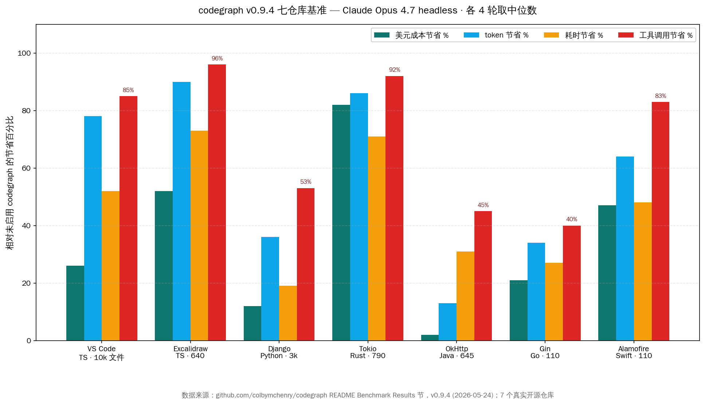
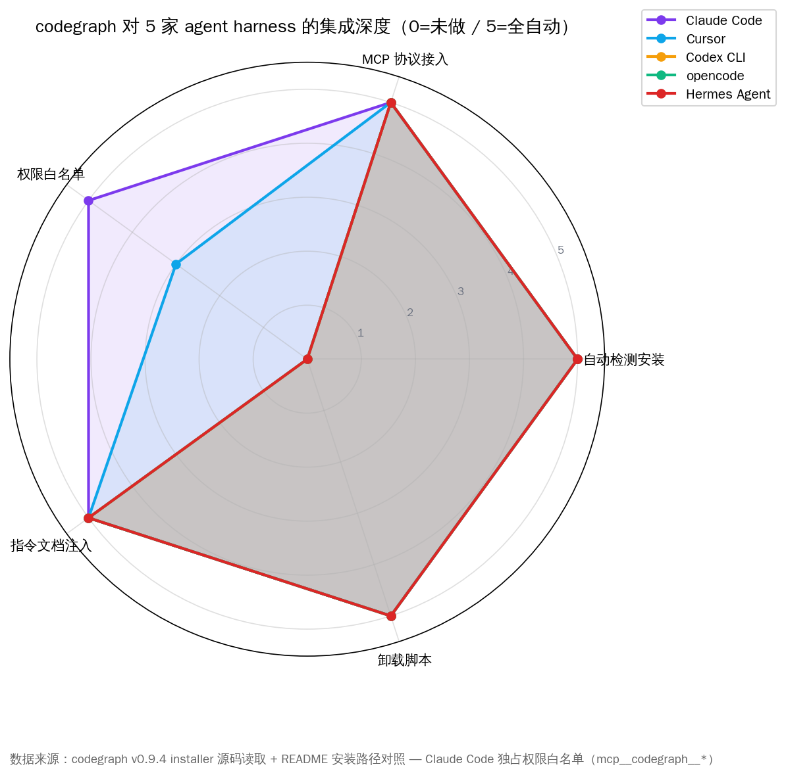
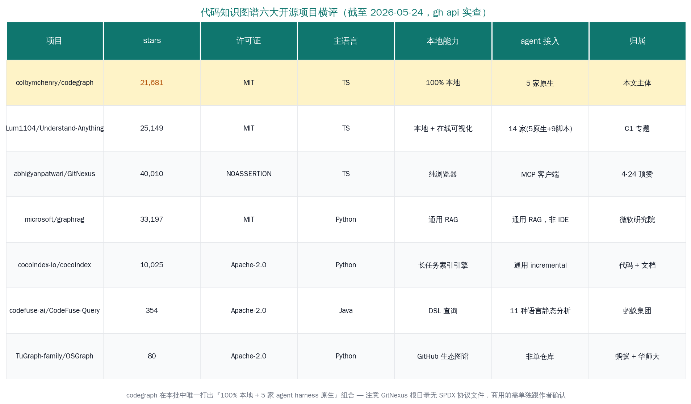

# codegraph 21k star 本地代码图谱

## 30 秒先看完

同一题型，本周连出两个 21k+ star 的 AI Coding 代码图谱项目，路线却完全相反：「Understand-Anything」专题写的是**在线交互可视化 + 一次接 14 家客户端**的扩展流派；本文写的 `colbymchenry/codegraph` 是另一条腿——**100% 本地跑、SQLite 本地落盘、自带 Node 运行时、给 5 家 agent harness 做原生 MCP server 集成**。一条主打可视化广度、一条主打离线深度，是同一棵树的两根主干。把两篇放在一起读，能比单看任何一个项目都更准确地理解「客户端代码 Graph RAG」赛道的真实分歧。

关键事实（数据来源：GitHub REST API `repos/colbymchenry/codegraph` + LICENSE 原文 + README v0.9.4 节，核对时间 2026-05-24 19:35 UTC）：

- **21,681 颗 star** · **1,208 forks** · **140 open issues** · MIT 协议（LICENSE 原文 `Copyright (c) 2026 Colby Mchenry` 核对一致）
- **当日 +2,993**，GitHub Trending Daily 第二名
- 主语言 TypeScript，仓库创建于 2026-01-18，最近一次推送 2026-05-24 18:47
- 主作者 `colbymchenry`（280 次提交，本人独占近 90% 工作量），辅以 `omonien` 16 次、`andreinknv` 7 次、`MO2k4` 4 次的零星贡献——典型「一人主导项目」
- v0.9.4 节是 2026-05-24 当天发布，重写了七种 web 框架的路由解析，**和当日 +2,993 的爆发对齐**
- 自带 Node 运行时（v0.9.0 起），Windows/macOS/Linux × x64/arm64 都有预编译，无需用户提前装 Node

本文的核心论点只有一句：**客户端代码 Graph RAG 这条赛道，本周分裂出『在线可视化』与『100% 本地』两条互补主干；codegraph 代表本地优先流派，把它跟 Understand-Anything 放在一起看，国内开发者才能避免选错路。** 国内私有化部署、合规审计、断网开发场景下，本地优先路线的价值会比在线流派高一档。


## 与「Understand-Anything」差异化：在线可视化 vs 离线深度

同期专题写的 `Lum1104/Understand-Anything`（25,149 star，当日 +3,987）和本文的 codegraph 都是「把代码变图谱给 AI 用」，但落地路线分歧极大。先把两者拉开看清楚，下文再展开 codegraph 的工程细节。

| 维度 | Understand-Anything（C1 专题） | codegraph（本文 C2） |
|---|---|---|
| 主打卖点 | 交互式可视化图谱，浏览器可点可问 | 100% 本地 MCP server，零数据出机 |
| 索引时机 | 用户调 `/understand` 当场跑 5 个 LLM agent 摘要 | 一次 `codegraph init` 预索引，后续增量同步 |
| 数据落盘 | `.understand-anything/knowledge-graph.json`（含 LLM 摘要） | `.codegraph/codegraph.db` SQLite（仅符号 + 边 + FTS5） |
| 网络依赖 | 必须接大模型 API 跑 agent 摘要 | 零 API key、零外部服务，断网可用 |
| agent 客户端覆盖 | 14 家（5 家原生 + 9 家脚本 + KIMI / OpenClaw 等） | 5 家全部原生 MCP（Claude Code / Cursor / Codex CLI / opencode / Hermes） |
| 主语言 | TypeScript | TypeScript |
| 协议 | MIT | MIT |
| 适用读者 | 想要图谱「看」一遍代码、给团队新人做 onboarding | 想给 agent 一份预索引、降本省 token、私有化合规 |

简单概括：Understand-Anything 是「给人看的图」，codegraph 是「给 agent 查的索引」。一个走可视化广度，一个走离线深度。

下面把镜头对准 codegraph，逐层拆开它给国内开发者带来的价值。

## 工程拆解：预索引 vs 实时索引，差距在哪里

codegraph 自己 README 把管线讲得很清楚，落到一张图：

```
┌─────────────────────────────────────────────────────────────┐
│                       Claude Code（或其他 4 家）              │
│         「请求是如何到达数据库的？」                          │
│              直接调 codegraph 工具，不再 grep / Read         │
└─────────────────────────────┬───────────────────────────────┘
                              ▼
┌─────────────────────────────────────────────────────────────┐
│                    CodeGraph MCP Server                     │
│      context · trace · explore · callers · callees · impact │
│                              ▼                              │
│                    SQLite 知识图谱                          │
│        symbols · edges · files · FTS5 全文搜索              │
└─────────────────────────────────────────────────────────────┘
```

四步：

1. **Tree-sitter 抽取**——AST 解析 19+ 种语言，抽函数 / 类 / 方法节点和「调用 / 导入 / 继承 / 实现」四类边
2. **SQLite + FTS5 落盘**——`.codegraph/codegraph.db` 一个文件，FTS5 提供毫秒级符号全文搜索
3. **引用解析**——抽完之后再跑一遍：函数调用 → 定义、import → 源文件、类继承、框架特定路由模式
4. **自动同步**——MCP server 用原生 OS 文件事件（macOS 用 FSEvents、Linux 用 inotify、Windows 用 ReadDirectoryChangesW），改文件 2 秒后增量更新图谱

**和「实时索引」流派的关键差别**：在线流派每次 agent 提问都要重新扫一遍代码或调一次 LLM 摘要；codegraph 把这部分工作前置——`codegraph init -i` 跑完之后，后续 agent 提问只查 SQLite，不再触发模型推理。代价是首次索引耗时（VS Code 这种 10k 文件量级仓库的首次索引在几分钟级），收益是后续每次 agent 提问省下大头。

这套设计对国内私有化部署场景特别要紧：

- **断网可用**——金融、能源、政府等行业的开发机经常断外网，在线流派直接死掉，codegraph 只要本地 Claude Code / opencode 能跑就行
- **数据不出机**——README 第一行硬约束：「No data leaves your machine. No API keys. No external services. SQLite database only.」对代码合规审计是直接可用的承诺
- **索引可入仓**——`.codegraph/codegraph.db` 可以 git 提交（团队各机器跑同一份索引），也可以 `.gitignore`（人手一份）。Issue #155 顶赞 17 票就是国内 `JonasGao` 在催「git worktree 多个工作树共享同一份索引」

## 7 仓库基准：35% 省钱 / 71% 省工具调用

codegraph 在 v0.9.4 README 给了一个挺克制的基准：拿七个真实开源仓库、各跑一道「架构理解」类问题、每边各跑 4 轮取中位数。Claude Opus 4.7 headless（`claude -p` + `--strict-mcp-config`）跑，开启 vs 关闭 codegraph MCP 两组对比。



平均结果：**美元成本省 35%、token 省 57%、墙钟时间省 46%、工具调用省 71%**。但读这张图最有价值的不是平均数，而是**节省幅度跟代码库规模的相关性**：

- VS Code（TypeScript · 约 10k 文件）：工具调用从 55 次掉到 8 次（省 85%），token 从 2.8M 掉到 601k（省 78%）
- Excalidraw（TypeScript · 约 640 文件）：工具调用从 79 次掉到 3 次（省 96%），墙钟时间从 2 分 58 秒掉到 48 秒
- Tokio（Rust · 790 文件）：单次问题成本从 $2.41 掉到 $0.42，是七个里降幅最猛的
- Gin（Go · 110 文件）：工具调用从 10 掉到 6，省 40%——**小仓库 grep 本来就够便宜，codegraph 边际收益拉不开**

codegraph 作者在 README 里很坦诚地写了这件事：「On a small repo like Gin (~150 files) native search is already cheap, so the margin narrows」。这种克制叙述比一句「平均省 35%」更可信。

七组测试问题都是「How does X work?」这种架构理解类，不是「找 utils.ts 里某个函数」这种细节查询。这是有意为之——codegraph 自己把 agent 指令里写成：「Reach for raw Read/Grep only to confirm a specific detail CodeGraph didn't cover.」意思是细节查询本来就该用原生 grep，codegraph 的位是顶住「上下文构建」这一段。

## 5 家 agent harness：集成深度怎么对比

codegraph 跟 Understand-Anything 在 agent 兼容上是反向选择：Understand-Anything 选「广」（14 家），codegraph 选「深」（5 家）。「深」体现在 installer 给每家 agent 写四样东西：

1. MCP server 配置项（写到对应 agent 的配置文件，比如 Claude 是 `~/.claude.json`、Codex 是 `~/.codex/AGENTS.md`）
2. 指令文档（教 agent 怎么调 codegraph 工具，写到对应 agent 的 instruction 路径，比如 Claude 是 `~/.claude/CLAUDE.md`）
3. 权限白名单（仅 Claude Code 独占——把 `mcp__codegraph__codegraph_search` 等 10 个工具加到 auto-allow 列表）
4. 卸载脚本（v0.9.3 新加的 `codegraph uninstall`，把上面三样都倒回去）



5 家的集成深度差不多，只有 Claude Code 多了一项「权限白名单」自动配置——因为 Claude Code 的权限系统最严，每次新工具调用要弹确认框，自动加白名单后才能流畅跑。Cursor 没有等价的权限弹窗，剩下 Codex CLI / opencode / Hermes 也都没有，所以那一格对它们 N/A。

issue 区有个挺有代表性的对话能说明这件事的演化：5-01 那天用户 `atrofimov-sc` 在 issue #137 留了一句很冲的话：「Why does it force claude usage by writing to a claude folder? That's extremely limiting. Needs global support for the agent whatever the agent is.」codegraph 最初确实只支持 Claude Code，被这条投诉骂出来后，5-17 的 v0.7.7 多 agent installer 上线，5-21 加 Hermes Agent，5-22 加卸载脚本——这条 4 天反馈周期的故事比任何「平台兼容」宣传都更让人信服。

支持的 19+ 种语言里值得国内开发者注意的：Lua / Luau（罗布乐思游戏脚本）/ Pascal / Delphi 这种长尾语种都进了，意味着工业控制、老 Delphi ERP、Roblox 游戏开发等小众场景也能直接吃。Razor `.cshtml` 还没进（issue #319 在催），但 14 个 web 框架的路由解析（Django / FastAPI / Flask / Express / NestJS / Laravel / Rails / Spring / Gin / Axum / Rocket / ASP.NET / Vapor / React Router / SvelteKit）是 v0.9.4 当天一并上的——这是为什么 5-24 当天 star 暴涨 2,993。

## GitHub Issues：用户真实反馈 verbatim

软文味最重的是单方面夸效果。这里直接抄三条 codegraph issue 区按反应数排序的顶贴用户原话——都是 5 月的真实留言，含中国时区用户。

**Issue #155，2026-05-16，`JonasGao` 提的 git worktree 支持，17 票顶赞**：

> "When using git worktree, each worktree is an independent working directory. Currently, CodeGraph requires running `codegraph init -i` in each worktree directory separately. This creates friction for developers who use worktrees for: Parallel development on multiple branches, AI coding agents working in parallel on different tasks/branches."

`JonasGao` 列出三种解决方案备选：A 主仓库放一份 `.codegraph/` 全 worktree 共享、B 检测到 worktree 自动 symlink、C git-track 索引文件配合 checkout 自动继承。这条 issue 截至 5-24 还 open，但反应数已经爬到 17——明显是国内 AI Coding 重度用户的共同痛点。

**Issue #189，2026-05-19，`leblancdaniel` 提的质量对比，4 票顶赞**：

> "Hello, and thank you for this work - it's really interesting and the efficiency/cost story is very clear. I was wondering if there was any benchmark comparison on the quality of the results using codegraph vs the standard tooling? I would imagine this largely varies on the task, codebase, etc."

这条问到了点子上——codegraph 现有基准只比成本和速度，没正面回答「答案质量降没降」。读者要警惕：71% 工具调用节省的代价可能是 agent 在某些任务上漏掉了一些细节。issue 还 open，作者尚未给出正面回应。

**Issue #137，2026-05-01，`atrofimov-sc` 的多 agent 投诉，6 票顶赞**：

> "Why does it force claude usage by writing to a claude folder? That's extremely limiting. Needs global support for the agent whatever the agent is."

这条已经 closed，被 5-17 的 v0.7.7 多 agent installer 解决。但留这条记录有价值——它证明了 codegraph 不是从一开始就「5 家 agent 兼容」，是被用户骂出来的多平台支持。

把三条放在一起看：**代码 Graph RAG 的下一阶痛点已经从『支持哪些客户端』转向『如何跟多分支并行开发』和『质量基线在哪儿』**——这是 codegraph 自己也还没解决干净的地方。

## 6 家代码图谱横评矩阵

把同生态项目摆桌上对比，每家 stars 和许可证实查 GitHub 接口：



逐行说明：

1. **`colbymchenry/codegraph` 21,681 star** —— 本文主体。100% 本地 / 5 家 agent 原生 / MIT。优势是离线深度，弱在 agent 客户端覆盖窄
2. **`Lum1104/Understand-Anything` 25,149 star** —— C1 专题主体。本地跑 + 在线可视化 / 14 家 agent / MIT。优势是覆盖广和可视化好看，弱在跑 agent 摘要要烧 LLM token
3. **`abhigyanpatwari/GitNexus` 40,010 star** —— 纯浏览器 / NOASSERTION / 4-24 r/LocalLLaMA 顶赞起家。但 NOASSERTION 协议意味着根目录没有 SPDX 协议文件——README 自称 MIT，**商用前必须单独跟作者确认许可**，否则有法务风险
4. **`microsoft/graphrag` 33,197 star** —— 微软研究院的通用 RAG 框架，不是为 IDE 设计的代码图谱，定位偏研究而非工程
5. **`cocoindex-io/cocoindex` 10,025 star** —— 通用 incremental 索引引擎，文档+代码混合场景比纯代码强，但没有 IDE 集成
6. **`codefuse-ai/CodeFuse-Query` 354 star** —— 蚂蚁集团出品，11 种语言 DSL 查询，走的是程序员手写 query 而非 LLM-friendly graph，跟前五家不是一个产品形态
7. **`TuGraph-family/OSGraph` 80 star** —— 蚂蚁 TuGraph + AntV + 华师大 X-Lab 联合，但定位是「GitHub 开源生态图谱」（看 repo 间关系），不是单仓库内部代码图谱

横评一句话：**codegraph 是六家里唯一打出『100% 本地 + 5 家原生 agent harness + SPDX-clean MIT』组合的项目**，其他要么协议有坑，要么不是 IDE 形态。

## 国内同方向产品横评

国内做同方向产品的厂商不少，但都没把「单仓库 + 函数级 + 暴露给客户端直接查」这三件事凑齐。把市面方案逐家比一下：

- **通义灵码（阿里云）**——后台跑工程问答索引，但索引数据存阿里云端，不暴露本地数据库给开发者，跟 codegraph 的「本地索引可入仓」对位不上
- **Trae（字节跳动）**——产品里有「知识树」功能，但是文件树状结构而非依赖调用图，并且没开放给三方编程助手
- **千问 Code MCP（阿里）**——千问 API 加挂的代码 MCP 服务，但是云端模型驱动，断网不可用
- **智谱 GLM-Code**——智谱自家代码模型，闭源、云端
- **Cline 国内适配（开源社区）**——给 Cline 编程助手接国产模型的桥，本身不做图谱
- **DeepSeek Code（深度求索）**——专注代码生成模型本体，没有外置的图谱索引层
- **月之暗面 KIMI CLI**——已经被同期专题里 `Understand-Anything` 接进 install.sh 选项，但 KIMI CLI 自己没出图谱产品
- **OpenClaw**——国内适配活跃的编程助手框架，可以手工装 codegraph 的 MCP 服务（暂未原生写进 codegraph installer，但配置文件里加一段 mcpServers 段就能跑通）

观察：国内开发者目前用 codegraph 的最直接路径是国内适配版编程助手加 codegraph 本地索引，本地索引数据不出机，模型调用走国内代理或本地 DeepSeek。蚂蚁 CodeFuse-Query 是同方向的国内自研，但走的是 DSL 查询路线，跟图谱不是同一种产品形态——两条路线各有侧重，国内开发者两个都装上不冲突。

## 国内开发者落地：四条具体路径

把 codegraph 在国内开发机上跑起来的具体步骤，按场景分四种：

**路径一：Mac M 系列 + Claude Code 国内代理**

```bash
# 一行装（已经默认走 GitHub raw，国内速度 OK）
curl -fsSL https://raw.githubusercontent.com/colbymchenry/codegraph/main/install.sh | sh
# 或走 npm 镜像
npm config set registry https://registry.npmmirror.com
npm i -g @colbymchenry/codegraph
# 项目里
cd your-project
codegraph init -i
# Claude Code 国内代理走 ANTHROPIC_BASE_URL 改国内供应商即可，索引数据全本地不外发
```

**路径二：4090 工作站 + opencode + 本地 DeepSeek**

opencode 接本地 vLLM 跑 DeepSeek-Coder-V2，codegraph 跑在同一台机器，整套链路零数据出机。注意 opencode v0.9.2 之前的版本有 `opencode.jsonc` vs `opencode.json` 配置文件名坑（codegraph v0.7.7 写错了，v0.7.9 修复），现在直接用 v0.9.4 都没问题。

**路径三：私有化部署 + Codex CLI + 内部代理**

`codegraph install --target=codex --yes --location=local --no-permissions` 单装 Codex CLI 这一家，跳过 Claude 权限白名单（私有化场景下 Claude 通常不在白名单内），用 Codex CLI 接公司内部的代理大模型 API，本地索引服务公司代码合规审计。

**路径四：git worktree 并行开发的临时方案**

`codegraph` 暂不支持 worktree 共享（issue #155 open），当下解法：在主仓库 `codegraph init -i` 之后，给每个 worktree 手动 `ln -s ../main/.codegraph .codegraph`（Mac/Linux）或在 Windows 上用 `mklink /J`。等 issue #155 合进去之前先临时这么用。

## 收尾：选哪条腿走

Understand-Anything 跟 codegraph 这两条腿不是「谁取代谁」的关系，是同一棵树两根互补的主干。要选哪条主要看两件事：

- **数据合规优先级**——如果代码不能出机或公司不允许调外部 API，闭眼选 codegraph
- **可视化需求**——如果需要给团队新人看图做 onboarding 或自己想用浏览器探一遍代码，闭眼选 Understand-Anything

国内中高级 AI Coding 开发者大概率两条腿都要——日常工作流跑 codegraph 索引、给 Claude Code 用；新人 onboarding 那一天起一次 Understand-Anything 出张图发文档。两个项目都是 MIT，两个项目都是 TypeScript，两个项目作者都不收钱，对开发者只有上手成本。

可观察的两条后续信号：

1. **codegraph issue #155 git worktree 共享索引的合并速度**——如果一周内合，代表作者在认真听国内重度用户的反馈
2. **codegraph 何时给 OpenClaw 出原生 installer target**——现在还要 manual setup，如果作者把 OpenClaw 加进默认五选一，代表国内 agent harness 已经被纳入海外开源项目的「平台层」

