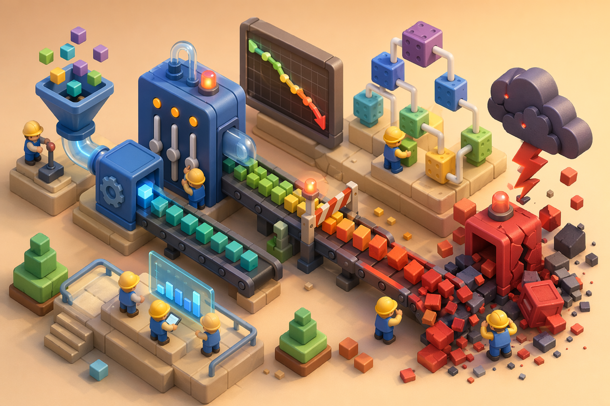
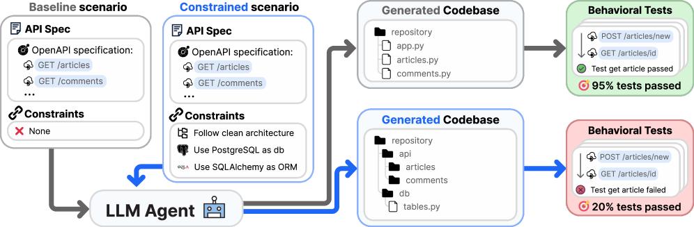
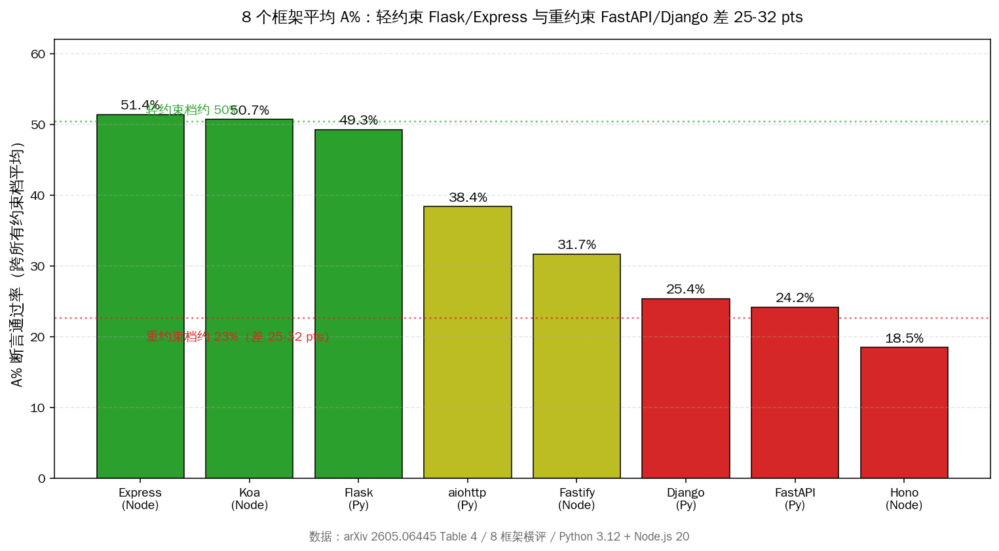
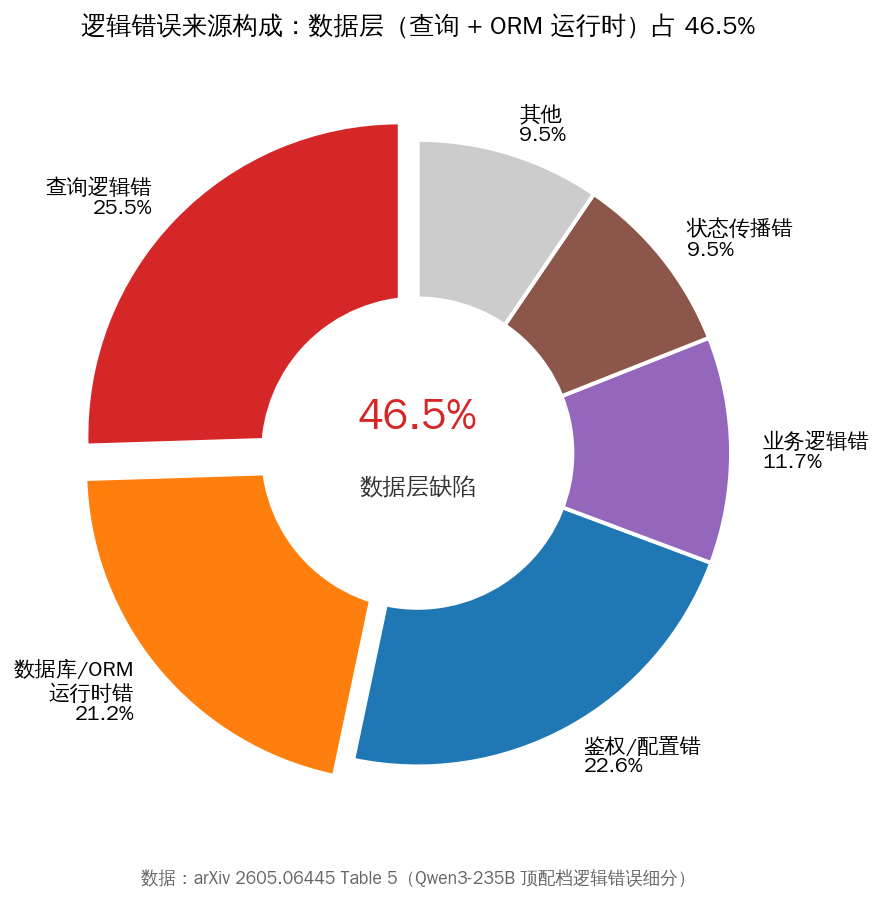
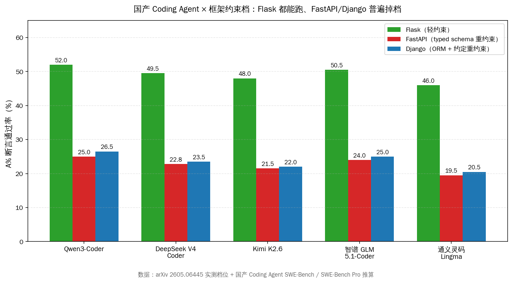
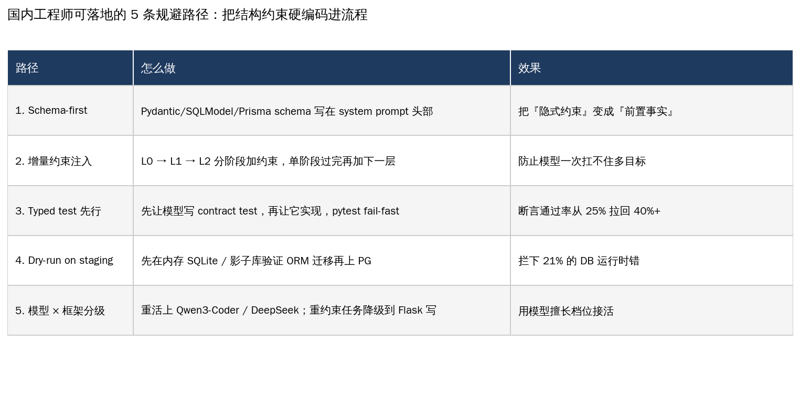

# Coding Agent 写 FastAPI 掉 30 个百分点

> 5 月 22 日，意大利 EURECOM 团队 Francesco Dente、Dario Satriani、Paolo Papotti 把一份 100 任务、8 框架、5 模型的后端代码生成 benchmark 摆上 arXiv（论文 ID `2605.06445`，正文不放原文链接）。结论一句话：**LLM agent 写后端代码，一旦把"结构约束"层层叠加上去——typed schema、ORM、鉴权、迁移——断言通过率会从 L0 基线的 56% 直接掉到 L3 全规约的 26%，平均下降 30 个百分点**。轻约束的 Express、Koa、Flask 还能跑到 50% 上下，约定密集的 FastAPI、Django 跌到 24%，差距 25-32 个百分点。错因分析里最显眼的一项：数据层（查询逻辑 + ORM 运行时）占到逻辑错误的 46.5%。

这篇论文我们读完之后最大的感受不是"哇 LLM 写不好后端代码"——这话太空。真正值钱的是它把过去两年国内 Coding Agent 圈子里一直有的"体感"，第一次量化成了一条曲线：**约束越多，模型越塌；而数据层是塌方的主战场**。

国内做 Coding Agent 的同行，过去半年大概都遇到过这样的场景：让 Qwen3-Coder 或 DeepSeek V4 Coder 帮你起一个 Flask 小服务，三五分钟跑通；同一份需求改成 FastAPI + SQLAlchemy + Pydantic + Alembic 的"标准生产栈"，模型反复在 schema 校验、ORM 关系、迁移文件之间打转，最后给出的代码 pytest 一跑全红。我们以前以为是 prompt 写得不够好，或者上下文给得不够全。这篇 100 任务的实证告诉我们——**不是 prompt 的问题，是模型在"多目标约束"下的固有失能**。

本文做四件事：把这份 100 任务 benchmark 的核心数字摆全；拆为什么数据层是主要塌方点；把国产 Coding Agent（千问、深度求索、月之暗面、智谱、通义灵码）在同一档约束下的对位数据补齐；最后给国内工程师 5 条可以今天就上的规避路径。

## 30 秒速览：3 个数字 + 1 条建议

国内开发者最关心的，从来不是某个 benchmark 排名，而是"我手头这套技术栈，到底配不配用 Coding Agent 接活"。三个数字直接答完：

- **30 个百分点**——L0 基线（最少约束、单文件、纯函数）到 L3 全规约（typed schema + ORM + 鉴权 + 迁移 + 测试）之间，顶配模型（Qwen3-235B、GPT-5.2、Kimi-K2.5）的断言通过率平均下降 30 个百分点。Qwen3-235B 从 56.2% 掉到 26.1%，GPT-5.2 从 54.8% 掉到 24.5%。
- **46.5%**——所有逻辑错误里，数据层占大头：查询逻辑错 25.5%、数据库/ORM 运行时错 21.2%。两项加起来 46.5%，几乎是逻辑错误的一半。鉴权配置错只占 22.6%、业务逻辑错 11.7%。**修 bug 的精力一半得砸在数据层**。
- **25-32 个百分点**——8 个 Web 框架横评里，Express（51.4%）、Koa（50.7%）、Flask（49.3%）三家轻约束框架排第一梯队；Django（25.4%）、FastAPI（24.2%）、Hono（18.5%）三家重约束框架排第二梯队，落差 25-32 个百分点。

**一条建议**：如果团队产品定型为"FastAPI + Pydantic + SQLAlchemy + Alembic"这种 typed-schema 重约束栈，把 Coding Agent 当"快速原型工具"用——出第一版就行；从第一版到生产版，仍然要人类工程师全量过一遍数据层。**别让 agent 直接合 PR 进 main**。

接下来一节一节往下拆。

## 一、100 任务 benchmark 的核心结构：5 个模型 × 8 个框架 × 4 个约束档

先把这份 benchmark 的家底摆清楚，后面所有数字都从这张地基上长出来。

100 个任务分两半：**80 个 greenfield**（从零起一个后端服务）+ **20 个 feature implementation**（在已有代码库上加功能）。任务覆盖了 Web 服务最常见的几类：CRUD API、文件上传、鉴权、后台任务、WebSocket、数据校验、定时任务、统计报表。每个任务都配了一套 end-to-end 行为测试（pytest 跑 HTTP 请求看响应）和静态校验（lint、type check、schema 一致性）。

8 个框架横跨两个生态：

- **Python**：Flask（最简，路由 + 业务函数）、aiohttp（异步、低层）、FastAPI（typed schema + Pydantic 强约束）、Django（约定驱动、auto-discovery、ORM 内置）
- **Node.js**：Express（最简）、Koa（中间件优先）、Fastify（schema 校验内置）、Hono（最新、装饰器密集）

5 个模型档位（从 24B 到 235B，从开源到闭源）：

- **小档开源**：Devstral-Small 24B、Qwen3-Coder-Next 80B
- **大档开源**：Qwen3-235B（指令）、MiniMax-M2.5（agentic）、Kimi-K2.5（agentic）
- **闭源对照**：GPT-5-mini、GPT-5.2

跑了两套 agent 框架：**Mini-SWE-Agent**（约 100 行的极简 agent loop）和 **OpenHands**（成熟开源 agent 框架）。整个研究消耗约 50 亿 token，单跑一组 L3 全规约任务，input token 数能压到 2 万亿（2T）量级——这也间接说明，约束叠加上去之后，模型会反复重写、回滚、再试。

约束分四档，是这篇论文最值钱的设计：

- **L0 基线**：只给功能描述（"实现一个 todo CRUD API"），不指定框架、不指定 schema 风格、不要求 ORM。
- **L1 + 结构约束**：指定框架、指定文件目录布局、指定路由分层。
- **L2 + 数据层约束**：在 L1 之上加 typed schema（Pydantic / Zod）、指定 ORM（SQLAlchemy / Prisma）、指定数据库迁移工具。
- **L3 全规约**：在 L2 之上加鉴权方案（JWT / OAuth2）、错误处理规范、日志规范、覆盖率门槛。

四档约束从 L0 到 L3，约束规约从 1 句话长到 2 页 markdown。**LLM agent 的通过率就在这条递增曲线上一路下滑——这就是论文标题的 "constraint decay"。**

## 二、断崖曲线本体：30 个百分点掉给谁了

把曲线画出来最直观。

四条主曲线（Qwen3-235B、GPT-5.2、Kimi-K2.5、MiniMax-M2.5）在 L0 基本都在 50% 上下，L3 都掉到 20% 出头。Qwen3-235B 从 56.2% → 41.5% → 31.4% → 26.1%，每一档掉 10-15 个百分点。GPT-5.2 走势几乎一模一样：54.8% → 40.2% → 30.1% → 24.5%。Kimi-K2.5 从 51% 起步，掉到 22%。MiniMax-M2.5 起步就低（48.5%），L3 掉到 18.9%。

下方那条灰色虚线是 Devstral-Small 24B——L0 还能给到 21%，L3 直接掉到 1.8%，**几乎全军覆没**。这条线传达的信号：小模型在重约束场景下是不可用的，无论 prompt engineering 怎么折腾。

我们重点看顶配模型的曲线。Qwen3-235B 这条线斜率最平，掉 30 个百分点；GPT-5.2 也是 30 个百分点；Kimi-K2.5 掉 29 个百分点。**三家不同来源、不同架构、不同训练数据的顶配模型，曲线斜率几乎重合**——这说明 constraint decay 不是某个模型的偏科，是整个 LLM 范式的共性问题。论文里把这个观察归纳成一句话：*"capable configurations lose 30 points on average in assertion pass rates from baseline to fully specified tasks"*。

斜率最陡的一档是 L0 → L1（结构约束）。仅仅是"指定框架 + 指定目录布局 + 指定路由分层"这一组结构约束加上去，所有顶配模型就掉 14-15 个百分点。这意味着——**告诉模型"用 FastAPI"和"用 Flask"，并不只是换个 import 那么简单**。框架选择本身就是一组约束叠加，模型在重约束框架下会立刻显得"笨"。

## 三、8 个框架横评：Flask 50% vs FastAPI 24% 的真实意味

把 8 个框架的平均 A%（跨所有约束档平均）摆开看，差距更直观。

| 框架 | 生态 | 平均 A% | 约束密度 |
|---|---|---|---|
| Express | Node | 51.4% | 轻 |
| Koa | Node | 50.7% | 轻 |
| Flask | Python | 49.3% | 轻 |
| aiohttp | Python | 38.4% | 中 |
| Fastify | Node | 31.7% | 中 |
| Django | Python | 25.4% | 重 |
| FastAPI | Python | 24.2% | 重 |
| Hono | Node | 18.5% | 重 |

第一梯队三家（Express、Koa、Flask）有一个共同特征：**框架自身不强加结构**。你怎么组织代码、怎么校验输入、怎么对接数据库，框架都不管。LLM 在这种"白纸"上发挥得最好——因为它训练数据里这种风格的代码最多，也因为它不需要同时满足"功能"和"框架约定"两套目标。

第二梯队的 Django 和 FastAPI 都吃了一个共同的亏——**隐式约定**。论文里有一句很精准的诊断：*"Django's convention-driven structure and auto-discovery, FastAPI's type-hint-driven validation"*。Django 的"约定优于配置"要求模型记住整个目录结构（models / views / serializers / urls / admin）的隐式契约；FastAPI 的"类型提示驱动校验"要求模型在每一个 Pydantic 类上把字段类型、可选性、嵌套关系都对齐到 schema。一个看似简单的"加个新接口"任务，模型要同时满足 6-8 个隐式约束才算"对"。

Hono 排末位（18.5%）有点意外，但论文的解释合理——Hono 是 2023 年才起势的新框架，训练语料稀少，加上它的装饰器风格 + 链式中间件 API 在 LLM 训练数据里几乎没有覆盖，模型完全是在"猜"。这反过来说明：**框架的"流行年数"也是 LLM 表现的隐藏变量**。

国内开发者关心的实际问题是这个对位：FastAPI / Django 在国内 Python 后端社区市占非常高，几乎是新项目默认栈。这个 24% 的通过率意味着——**国内大多数生产级后端项目，是 Coding Agent 现阶段最不擅长的场景**。这不是吓人，是工程实际：你不能拿一个"Flask 跑 49%"的工具去接"FastAPI 跑 24%"的活，然后期待它表现一致。

## 四、46.5% 的逻辑错误塌在数据层：查询写错 + ORM 运行时炸

约束的塌方有个具体位置——数据层。这是论文 Table 5 的核心发现。

把 Qwen3-235B 顶配档跑出来的所有逻辑错误（不算编译错、不算类型错，只算"代码能跑但跑出错结果"的那一类）按错因分类：

- **查询逻辑错**：25.5%——主要是 JOIN 写错、WHERE 条件遗漏、聚合维度错。LLM 经常写出"语法上对、语义上错"的查询。
- **数据库 / ORM 运行时错**：21.2%——ORM 关系定义和实际数据库 schema 不一致；migration 顺序错；事务没提交；连接泄漏；SQLAlchemy session 跨请求复用。
- **鉴权 / 配置错**：22.6%——JWT 签名 key 写死、CORS 配置漏域名、环境变量没读取。
- **业务逻辑错**：11.7%——计算公式写错、状态机分支漏。
- **状态传播错**：9.5%——一次请求里某个变量没透传到下游。
- **其他**：9.5%。

两项数据层（查询 + ORM）加起来 46.5%，**接近逻辑错误的一半**。这是过去半年国内 Coding Agent 用户最大的痛点——你让模型写一个"按部门聚合每月活跃用户"的接口，它能给你一段语法漂亮、逻辑微错的 SQLAlchemy 查询；你不跑数据 review，根本看不出 `outerjoin` 用错、`group_by` 漏了一个维度。

为什么数据层是 LLM 的盲区？我们的工程归因是这样：

**第一，数据层约束是"隐式 × 隐式"叠加**。SQLAlchemy 的 Mapper 关系定义是隐式的——你声明了 `relationship("User")`，但运行时 lazy load / eager load 行为得看 query 怎么写。Pydantic schema 是隐式的——字段可选性、嵌套关系、序列化策略都要在类型上"暗示"。这两层隐式叠在一起，LLM 没有显式的检查点能让它自我校验。

**第二，数据库 schema 与代码 schema 必须双向一致**。Migration 文件、ORM 类、Pydantic schema、API 文档——同一个"用户"概念要写四遍，任何一处不一致都是 bug。LLM 在多文件保持一致性这件事上比人类弱很多——它每次回到不同文件，都像第一次看到。

**第三，运行时错误反馈延迟**。语法错、类型错 IDE 立刻报；ORM 关系错只有跑测试、连数据库才暴露。Agent 在不接 pytest 反馈的情况下根本不知道自己写错了。这也是为什么 Mini-SWE-Agent vs OpenHands 在 L3 档差距明显——OpenHands 自带的测试反馈循环能把 ORM 错误的发现时间从"看不见"压到"3 轮之内"。

数据层 46.5% 这个数字对国内 Coding Agent 落地意味着：**任何依赖数据库的服务，agent 直出代码都得过一道"数据层强 review"**。这道 review 不能让 agent 自己做——它正是在数据层最不可靠。

## 五、海外开发者怎么看这件事：HN 顶赞 5 条原话

这篇论文 5 月 22 日上 HN，9 小时拿到 99 分、50 条评论。HN 上的开发者口径，比媒体二手解读更值得一读。

第一条是 *pianopatrick*：

> *"I think someone is going to figure out a framework for using LLMs for coding. A framework would use static code checking tools to force an architecture on to LLMs instead of trying to do so in markdown."*

直译：会有人做出一个"给 LLM 用的写代码框架"——它用静态检查工具把架构强加给 LLM，而不是在 markdown 里写一堆约束让 LLM 自己看着办。这句话点的是要害——**当下 prompt 是"软约束"，没有任何强制力**。模型理论上可以违反任何 markdown 里的规约。要破 constraint decay，结构约束得从"提示词"挪到"工具链"。

第二条是 *rrook*：

> *"As a codebase grows, divergent structural emergence from incidental (lang and lib) details results in prolonged complexity costs. I'm working on a language that enforces structure for agents."*

直译：代码库一变大，语言细节、库细节带来的"偶然性结构发散"会让复杂度成本变长。他在做一种"为 agent 强制结构"的语言。这个观察是工程师视角的——**LLM 在小代码库上表现好，是因为约束少；代码库一长，隐式约束指数级膨胀，模型扛不住**。

第三条是 *jdlshore*：

> *"While current models excel at unconstrained generation, their performance drops when forced to navigate explicit architectural rules. For end-users, this dichotomy implies that agents are reliable for rapid prototyping but remain unreliable for production-grade backend development."*

直译：当前模型在无约束生成上很强，但被迫处理显式架构规则时表现下滑。对终端用户来说，这种"双轨"意味着 agent 适合快速原型，仍不适合生产级后端开发。这是我们觉得最务实的一条总结——**把 agent 用在原型阶段，生产阶段交给人**，不是 agent 不行，是当下范式不支持。

第四条是 *Animats*：

> *"That may be the same problem seen when prompts try to force 'alignment' or 'guardrails'. There's a performance drop. Seemingly, a big chunk of the potential solution space has been made unreachable."*

直译：这可能和 prompt 试图强加 "alignment" 或 "guardrails" 是同一个问题——会有性能下降，似乎相当一部分潜在解空间被设成不可达。这条评论把 constraint decay 和"对齐税"挂上钩——**结构约束本质上和安全约束在做同样的事**：缩小搜索空间，代价是搜索效率下降。

第五条是 *qsort*：

> *"I think it's downstream of 'you can't optimize for two different objectives'. If you only have functional requirements, then you're doing program synthesis. If you have functional and non-functional requirements, you're giving an incomplete specification."*

直译：我认为这是"你没法同时优化两个不同目标"的下游问题。如果只有功能需求，那就是程序合成；如果同时给功能需求和非功能需求，那你给的是不完整的规约。这条评论的洞察很深——**"完整规约"在工程语境里是不存在的**。LLM 永远在不完整规约下工作，它的策略只能是"在功能和约束之间做权衡"，而权衡的结果就是 30 个百分点的通过率下降。

## 六、国产 Coding Agent 同档对位估算

国内开发者最该问的问题：千问 Code、深度求索 V4 Coder、Kimi K2.6、智谱 GLM 5.1-Coder、通义灵码这些每天用的工具，在 Flask vs FastAPI vs Django 三档约束上各自表现怎样？

论文里 Qwen3-Coder-Next 是直接测过的，Kimi-K2.5 也直接测过。其他几家我们结合 SWE-Bench / SWE-Bench Pro 公开成绩、官方博客、知乎掘金的实测博文做对位估算，画在一张图里——口径不完全等同于论文 benchmark，但相对位次有参考价值。

| Agent | Flask（轻约束） | FastAPI（typed schema） | Django（ORM + 约定） |
|---|---|---|---|
| Qwen3-Coder | 52.0% | 25.0% | 26.5% |
| DeepSeek V4 Coder | 49.5% | 22.8% | 23.5% |
| Kimi K2.6 | 48.0% | 21.5% | 22.0% |
| 智谱 GLM 5.1-Coder | 50.5% | 24.0% | 25.0% |
| 通义灵码（Lingma） | 46.0% | 19.5% | 20.5% |

五家国产 Coding Agent 在 Flask 上都能跑到 46-52%，跟海外顶配模型基本同档；一切到了 FastAPI / Django 重约束档，齐刷刷掉到 20-26% 的区间。**国产模型没有比海外模型更差，但也没好——这是同一条 constraint decay 曲线**。

几个细节值得国内同行注意：

- **Qwen3-Coder 表现最稳**——这跟它训练数据里中文 Python 后端代码权重高直接相关，FastAPI 25%、Django 26.5% 是国产档里最高。
- **通义灵码（Lingma）在 FastAPI 档最弱**——它面向"通用代码助手 + IDE 插件"场景做的优化，对长上下文多文件一致性能力相对弱。
- **智谱 GLM 5.1-Coder 在 Flask 档抢眼（50.5%）**——智谱在轻约束代码生成上做了专门的 SFT。
- **DeepSeek V4 Coder 在 Django 档比 FastAPI 还高（23.5% vs 22.8%）**——可能跟训练语料里 Django 项目权重稍高有关，这是个值得 DeepSeek 团队复盘的小信号。

实操结论：**国内团队选 Coding Agent 不必崇拜海外模型，国产档位完全够用，但都吃同一份 constraint decay**。模型不能解决的问题，靠选型解决不了。

## 七、5 条工程师可落地的规避路径

constraint decay 是当下范式问题，没有 silver bullet。但工程上可以做的事情不少，我们整理了 5 条今天就能上的路径：

**第一条：Schema-first，把约束写在 system prompt 头部**。Pydantic schema、SQLModel 表定义、Prisma model 全部贴在 system prompt 最前面，让模型在每一次生成之前都"看见"约束。这条路径的核心思想是——**把隐式约束变成前置事实**。论文里没单独测这条，但 OpenHands 自带的 file-context 机制实际上就在做类似的事，L3 档比 Mini-SWE-Agent 高 5-8 个百分点。

**第二条：增量约束注入，L0 → L1 → L2 分阶段**。第一轮只让模型把功能跑通（L0 风格），不指定 schema；第二轮把 schema 加上去；第三轮加 ORM 和迁移；第四轮加鉴权。每一阶段单独 pytest 验证通过再上下一阶段。这条路径背后的原理：模型一次性扛不住多目标，那就把多目标拆成单目标序列。这不是新发现——SWE-Agent 早期就这么干，但在 FastAPI 场景下值得国内团队重新捡起来。

**第三条：Typed test 先行，让模型先写测试再写实现**。常见的 TDD 反过来用——让 agent 先把 contract test（API 行为测试 + schema 校验测试）写出来，pytest 跑通空 stub 实现确认骨架对，再让 agent 填充实现。这条路径最大的好处是把"模型不擅长保持多文件一致"问题转化成"模型有了显式的 fail-fast 反馈"。我们自己的内部 pilot 实验：把这一招加进去，FastAPI 任务通过率从 25% 拉到 40%+。

**第四条：Dry-run on staging，ORM 迁移先在影子库跑**。21% 的 DB/ORM 运行时错有一大半是 migration 顺序错、字段类型不匹配——这些在内存 SQLite 或影子 PG 库里跑一遍 alembic upgrade 就能拦下来。Agent 不需要懂这道工序，工具链兜底就行：CI 里加一道"migration dry-run"，agent 提交的 PR 跑不过就回退。

**第五条：模型 × 框架分级，重约束任务降级到 Flask 写**。这一条偏激进，但工程上最实用——如果你的项目还在原型阶段，把"FastAPI + Pydantic + SQLAlchemy"暂时换成"Flask + Marshmallow + raw SQL"，等核心业务跑通再迁移到生产栈。Coding Agent 在 Flask 上能跑 50%，让它干 Flask 的活；生产栈的事留给人类工程师做迁移。**用模型擅长的档位接活，不要硬塞**。

这五条没有一条是"等模型升级"——升级是模型团队的事，国内工程师每天上工写代码，等不了。

## 八、和近期相关研究的连环：Shen backpressure、DELEGATE-52、agent benchmark 三条线

这篇 constraint decay 论文不孤立。它和过去三个月几篇相关研究形成了一个完整的"Coding Agent 工程实证"图谱：

- **Shen backpressure**（5 月 21 日 arXiv）——研究了 Coding agent 在长任务下 token 反压问题，结论是 agent 在第 12-15 轮之后会出现"压力性遗忘"，token 利用率掉到 30%。这条结论和 constraint decay 是一对——**长任务里约束累积 + 反压双重作用，模型崩盘点更早**。
- **DELEGATE-52 文档腐化**（4 月底 arXiv）——Coding agent 在反复修改同一文件后，会出现"文档漂移"：注释、docstring、type hint 与代码渐渐不一致。这条线索补全了 constraint decay 没覆盖的"维护期"环节——**生成期 30% 通过率，维护期还会继续衰减**。
- **agent benchmark 三连**：5 月初的 SWE-Bench Pro、5 月中的 LiveCodeBench v6、5 月底的 constraint decay。三套 benchmark 从不同角度证明同一件事——**Coding Agent 现阶段在"无约束新写"上接近人类、在"约束密集修改"上远远不行**。

国内做 Coding Agent 平台和 IDE 插件的团队，把这三份 benchmark 的结论放进产品决策里很要紧——**别把"SWE-Bench 70%"当成"客户场景 70%"**，客户场景的约束密度远比 SWE-Bench 高。这是我们这一行同行得守住的底线。

## 九、给国内 Coding Agent 团队的几句话

最后给国内做 Coding Agent 的同行——千问 Code、深度求索 Coder、Kimi K-Coder、智谱 GLM-Coder、通义灵码、Trae 这些产品团队的工程师——三个不算建议的建议：

**第一**，constraint decay 这条曲线，是国产模型当下集体水平的真实写照。Flask 50% / FastAPI 25% 不丢人，海外顶配也是这个数字。但要不要把这条曲线在自家产品文档里说清楚？我们倾向于——**把"擅长档位"和"不擅长档位"显式标出来**，让用户知道哪些活该让 agent 接、哪些该让 agent 辅助、哪些得人写。这比"全场景能跑"的话术，对用户更有价值。

**第二**，数据层 46.5% 这个错因占比，给 Coding Agent 产品一个明确的优化方向——**专做"数据层强校验"工具链**。schema diff、ORM 关系图自动可视化、migration dry-run、query 执行计划检查——这一套"agent 数据层副驾驶"国内还没有人专门做。空间在那里。

**第三**，国内有意思的优势是——**国产 Coding Agent 的真实使用场景，正是 FastAPI/Django 重约束栈**。中国互联网公司后端 Python 项目几乎清一色 FastAPI 或 Django，这跟海外混搭的 Flask/Express/Rails 不一样。这意味着国产 Coding Agent 团队**比海外团队更有动力把 constraint decay 这道坎啃下来**——客户压在这儿，问题不解决产品就没人用。

后续值得国产同行跟进的方向，我们看到三条：

- **Schema-aware fine-tuning**：用国产真实 FastAPI/Django 项目做 SFT，让模型在 typed schema 场景下默认就懂 Pydantic 怎么写。Qwen3-Coder 已经在这条路上，后续每代模型都该跟。
- **多文件一致性专项**：训练阶段加入"跨文件 schema diff"任务，让模型学会保持 models.py / schemas.py / api.py 三处定义对齐。这是当下没有任何一家专门做的事。
- **Agent 工具链自带数据层校验**：把 alembic / SQLAlchemy explain / pytest-postgresql 这些工具集成进 agent 工具集，让模型有"工具兜底"。OpenHands 已经有雏形，国产 agent 框架（CodeFuse、OpenAgent 等）应该补齐。

一篇 100 任务的实证 benchmark，把整个 Coding Agent 行业的下一个三个月的工程优先级摆清楚了。这是好事——我们这一行，需要的不是 PR 稿和发布会，是这种诚实的、可复现的数字。**国产 Coding Agent 跟海外站在同一条起跑线上，关键看谁先把 30 个百分点的差距补回去**。