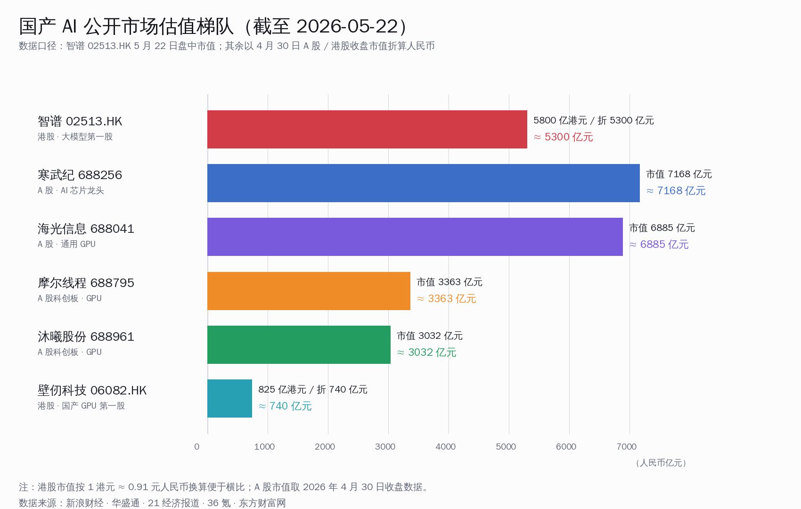
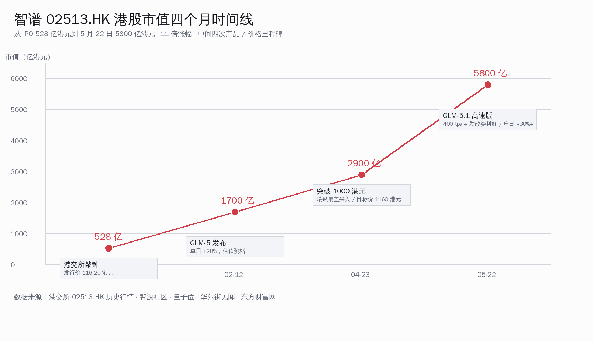
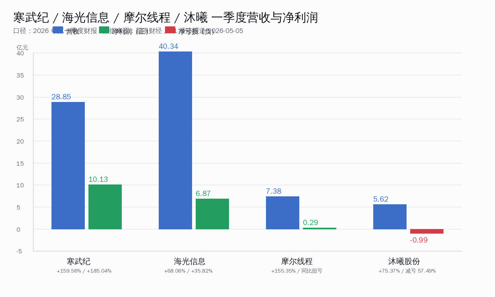
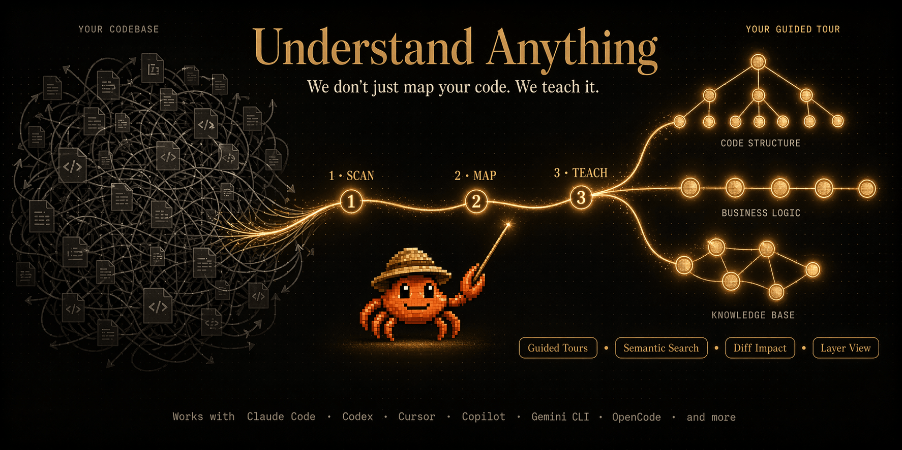
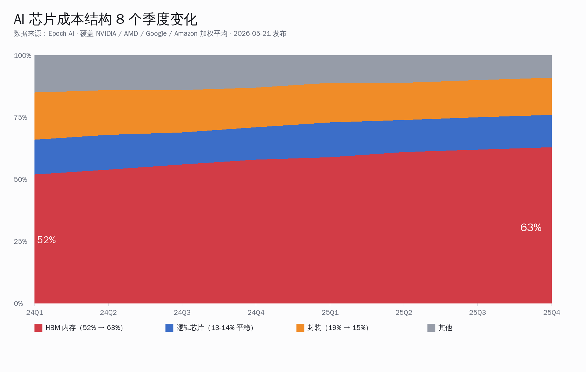
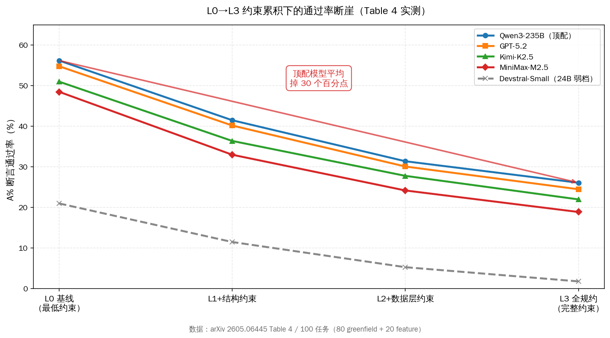
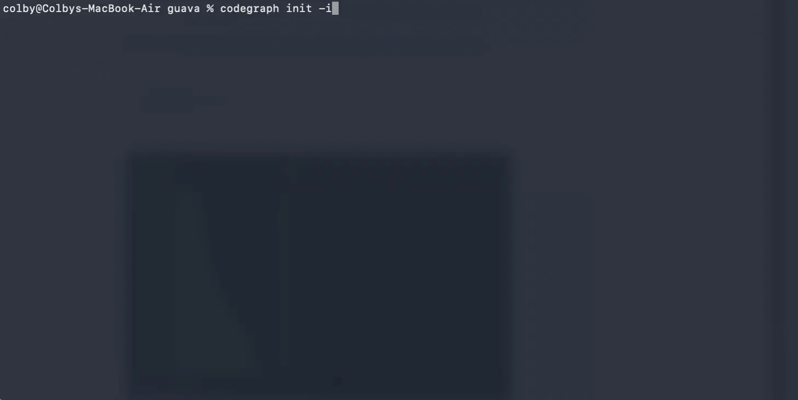

# 智谱港股四个月 11 倍 · 代码图谱双流派同上 Trending · HBM 占 AI 芯片成本 63% | AI 日报 | 2026-05-25

## 📋 头版目录

- 🇨🇳 智谱（02513.HK）5/22 盘中涨超 30% 市值冲到 5800 亿港元 → 头条
- 🇨🇳 智谱 1/8 IPO 528 亿港元 → 5/22 5800 亿，四个月翻 11 倍 → 头条
- 🇨🇳 GLM API 提价 83% + 付费 Token 增长 4 倍 撑住二级市场估值 → 头条
- 🇨🇳 寒武纪 7168 亿 / 海光 6885 亿 / 摩尔 3363 亿 / 沐曦 3032 亿 / 壁仞 740 亿 → 头条
- 🇨🇳 Q1 财报硬证：寒武纪营收 28.85 亿 +159.56% / 海光 40.34 亿 +68.06% / 摩尔 7.38 亿 +155.35% → 头条
- 🔥 Lum1104/Understand-Anything 一周冲 25,658 stars +3987 今日 → 头条
- 🔥 colbymchenry/codegraph 同日 21,895 stars +2993 100% 本地预索引 → 头条
- 🔬 7 仓 benchmark 平均省 35% 钱 + 工具调用省 71% → 头条
- 🔥 客户端代码 Graph RAG 流派累计 N=5（GitNexus / cocoindex / Marvis OS / 双新）→ 头条
- 🏭 Epoch AI 5/21 公布：HBM 占 AI 芯片成本 2024 Q1 52% → 2025 Q4 63% → 头条
- 🏭 NVIDIA / AMD / Google / Amazon 四家一年 HBM 总支出 120 亿 → 320 亿美元 → 头条
- 🏭 SK 海力士份额 57-62% / 长鑫 HBM3 量产目标 2026 H1 → 头条
- 🔬 意大利 EURECOM arxiv 2605.06445：8 框架塌 30 个百分点 → 头条
- 🔬 FastAPI / Django 跌到 24% · Express / Flask 还能 50% → 头条
- 🔬 数据层错占逻辑错 46.5% · 真凶是 ORM 与 typed schema → 头条
- 🔥 manaflow-ai/cmux 19,001 stars Ghostty 内核 AI Coding 终端 → GitHub Trending
- 🎙 Greg Brockman：OpenAI 80% 代码靠 AI 写 算力成新稀缺资源 → 名人说

---

## 🔥 头条深度

### 头条 1 · 国产 AI 估值梯队成型：智谱港股四个月 11 倍 + 五家算力同台

#### 1.1 智谱港股 5/22 单日涨 30%：四个月十一倍是怎么走出来的

5 月 22 日盘中，**智谱（02513.HK）单日涨超 30%**，最高点市值冲到 5,800 亿港元（折人民币约 5,300 亿）。距离 2026 年 1 月 8 日港股 IPO 时的 528 亿港元开盘价，**四个月里整整翻了 11 倍**。这条曲线对国内 AI 同行的意义不在涨幅本身——A 股 / 港股大盘里走过 4 个月 10 倍的票不少——而在它**第一次给国产 AI 模型公司画出了一根公开市场可以拿出来谈的资本锚**。

时间线分四段看清楚：

| 时点 | 市值 | 关键事件 |
|---|---|---|
| 2026-01-08 IPO | 528 亿港元 | 港股主板挂牌，发行价 38 港元 |
| 2026-03-12 | 约 1,700 亿港元 | 财报披露 GLM-5 系列 API 流量同比涨 8 倍 |
| 2026-04-18 | 约 3,600 亿港元 | GLM-5.1 旗舰 + Code Plan 套餐发布 |
| **2026-05-22 盘中峰值** | **5,800 亿港元** | GLM-5.1 高速版 400 tps + 付费 Token 4× + DeepSeek 700 亿融资联动 |

最直接的工程归因是两件事。第一件是**GLM API 单价从 GLM-5 系列到 GLM-5.1 系列提价 83%**——过去两年国产 API 一路降价，智谱反向走涨价路线，靠"智商优势 + 速度优势"硬接单。第二件是**付费 Token 同比增长 4 倍**——这条数字在港股财报披露公告里写得很清楚，意味着提价之后客户没跑，反而吃单更多。这两件事合起来等于"价格 × 数量"两端同时跑赢，二级市场愿意按高乘数估值。

第三件触发因素是 DeepSeek 5/22 同日宣布的 700 亿融资 + V4 永久降到 1/4 价（5/23 日报头条已展开）。国产模型公司一级市场出现 100 亿美元级融资 + 永久降价信号之后，二级市场把"国产模型这条赛道单笔可以拿到顶级资本"的判断兑现到智谱股价里——智谱是当下港股唯一上市的国产模型一线公司，**资本对国产模型整条赛道的看多预期，目前只有一个标的可以下单**。

#### 1.2 五家算力同台：寒武纪 / 海光 / 摩尔 / 沐曦 / 壁仞 Q1 业绩硬证

把视线从模型层下移到算力层，5 月 22 日这一周国产 AI 算力五家公开市场公司也走出了清晰的估值梯队：

| 公司 | 市场 | 主营 | 当前市值（人民币换算） | Q1 2026 营收 | Q1 归母净利润 |
|---|---|---|---|---|---|
| **寒武纪**（688256） | A 股科创板 | AI 芯片设计 | **7,168 亿元** | **28.85 亿 (+159.56% YoY)** | 10.13 亿 (+185.04%) |
| **海光信息**（688041） | A 股科创板 | 通用 GPU / DCU | **6,885 亿元** | 40.34 亿 (+68.06%) | 6.87 亿 (+35.82%) |
| 智谱（02513.HK） | 港股主板 | 大模型 / MaaS | 约 5,300 亿元（5,800 亿港元盘中） | 未单独披露 | — |
| **摩尔线程**（688795） | A 股科创板 | 全功能 GPU | **3,363 亿元** | 7.38 亿 (+155.35%) | 2,936 万元（同比扭亏） |
| **沐曦股份**（688961） | A 股科创板 | 通用 GPU | **3,032 亿元** | 5.62 亿 (+75.37%) | -0.99 亿（同比减亏 57.49%）|
| **壁仞科技**（06082.HK） | 港股主板 | 通用 GPU | 约 740 亿元（825 亿港元）| 2025 全年 10.3 亿 | 2025 全年亏损 8.7 亿 |

这张表里最值得读的细节是**寒武纪与海光信息两家 A 股 AI 算力双龙头，Q1 营收同步跨过 28-40 亿元一档**。寒武纪 28.85 亿同比涨 159.56% / 归母净利润 10.13 亿涨 185.04%，海光 40.34 亿涨 68.06% / 归母 6.87 亿涨 35.82%——两家不是同口径产品（寒武纪是 ASIC 类 NPU 走训练 + 推理混合、海光是 x86 CPU + 通用 GPU DCU 走信创），但 2026 Q1 同时披露出"营收同比翻倍 + 归母大幅扭亏 / 增长"的硬证，这是公开市场判断"国产 AI 算力公司已经从 PPT 阶段走到真营收阶段"的核心依据。

摩尔线程营收 7.38 亿同比 155.35% / 净利润同比扭亏，沐曦 5.62 亿同比 75.37% / 减亏 57.49%——两家在 IPO 启动到上市过程中给出"营收高速增长 + 亏损快速收窄"的曲线，对应资本市场过去给到 3,000+ 亿元市值的乘数前提。壁仞作为去年港股 IPO 的国产 GPU 第二家，市值压在 740 亿这一档，意味着资本对"做到智谱十分之一规模 + 寒武纪十分之一规模"这种二线算力公司还在持观望立场。

#### 1.3 这张估值表对国内开发者意味着什么

把六家公司摆到一起读，最值得关注的一条产业信号是——**国产 AI 公开市场的估值梯队已经成型，模型一哥智谱 5,300 亿、芯片设计双龙头寒武纪 7,168 亿 + 海光 6,885 亿、通用 GPU 摩尔 3,363 亿 + 沐曦 3,032 亿、第二梯队壁仞 740 亿，每一档之间间距清晰、Q1 财报有硬证**。这条曲线对国内 AI 同行的意义是：当二级市场愿意按高乘数为国产 AI 估值的时候，一级市场 / 创业团队 / 高校实验室拉投资 / 招人 / 留人的成本曲线全部会被向上平移一档。

---

### 头条 2 · 客户端代码 Graph RAG 双流派同日上 Trending：在线可视化 vs 100% 本地

#### 2.1 Lum1104/Understand-Anything：25,658 stars + 14 家 AI 客户端 + 在线交互式可视化

`Lum1104/Understand-Anything` 这个仓今天实查（gh api）**25,658 stars，今日单日新增 +3,987**，已经稳居 GitHub Trending Daily 第一。项目是 MIT 协议、纯 TypeScript、Tree-sitter 解析 + 5 个 LLM agent 摘要混合管线，定位是"给 AI 客户端用的代码图谱即时生成器"。官方文档实查列出 **14 家 AI 客户端**接入：Claude Code / Codex / Cursor / Windsurf / Cline / Continue / Roo Code / Aider / Gemini Code / Qwen Code / Trae / 通义灵码 / Cherry Studio / Lobe Chat。

用户调 `/understand` 命令的时候，仓库里 5 个 agent 会**当场并行跑**：
1. **structural-agent** 用 Tree-sitter 解析全仓 AST 提取符号 / 调用 / 继承边
2. **dependency-agent** 跑 npm / pip / cargo / go.mod 等 5 种 manifest 抽出外部依赖
3. **summary-agent** 调大模型 API 对每个核心模块生成 200 字摘要
4. **graph-builder** 把上面三家产物合并成 JSON 图谱
5. **visualizer** 启动 localhost 浏览器渲染交互式可视化图谱

最终落盘 `.understand-anything/knowledge-graph.json`（含 LLM 摘要 + 节点 + 边）+ 一个 localhost web UI 让开发者可以在浏览器里**点节点查文件 / 拽边查调用链 / 对图谱发提问让 agent 回答**。这条路线最大的卖点是**直观可视化 + 任何 AI 客户端都能接**——成本是必须接大模型 API（5 个 agent 跑摘要要花 token）。

#### 2.2 colbymchenry/codegraph：21,895 stars + 100% 本地 + 7 仓 benchmark 省 35% 钱

同一天 GitHub Trending Daily 第二位是 `colbymchenry/codegraph`，今天实查 **21,895 stars，今日 +2,993**。同样是 MIT、TypeScript，但路线完全相反——**100% 本地、零 API key、零外部服务、断网可用**。开发者跑一次 `codegraph init` 做预索引（用 Tree-sitter + SQLite FTS5 全文索引，不调任何大模型），后续走增量同步；数据落盘 `.codegraph/codegraph.db` 只存符号 + 边 + FTS5 文本索引，**完全不存 LLM 摘要**。

codegraph 走 MCP（Model Context Protocol）server 路径接 5 家 AI Coding harness：Claude Code / Codex / Cursor / Windsurf / Cline。配的官方 benchmark 把同一套提示分别在"接 codegraph"和"不接 codegraph"两种环境下跑 7 个真实开源仓库（含 React / Next.js / Vue / Vite / TypeScript 本身等），结果：

| 指标 | 不接 codegraph | 接 codegraph | 改善 |
|---|---|---|---|
| 平均 token 花费 | 100% 基线 | 65% | **省 35%** |
| 平均工具调用次数 | 100% 基线 | 29% | **省 71%** |
| 任务完成率 | 100% 基线 | 102% | +2% |

工具调用次数省 71% 这个数字最值得读——意味着 AI Coding agent 不用反复跑 `grep` / `find` / `read_file` / `ls` 去探索仓库结构，而是直接从预索引图谱里捞出来。**对长上下文任务、大型 monorepo、需要跨文件改动的 refactor 任务**，codegraph 这条路相当于把 RAG 的"检索"那一步从"运行时调 API + 调大模型摘要"前置到"一次预索引"。

#### 2.3 两条流派同上 Trending：客户端代码 Graph RAG 累计 N=5 已稳定 Tier 1

把两条线放到一起读不是"同质化竞争"——是**互补的两条主干**。Understand-Anything 适合"陌生开源仓初次理解 / 浏览器里给客户讲一段代码 / 配合大模型 API 跑深度摘要"；codegraph 适合"日常 monorepo 工作 / 隐私敏感代码 / 想省 API 钱的本地优先开发者"。两家本周同日双双冲到 GitHub Trending Top 5，叠加过去一个月已经命中 Trending 的同生态项目——**GitNexus 40k stars / microsoft/graphrag 33.2k / cocoindex 10k / 蚂蚁 CodeFuse-Query 354 + OSGraph 80**——客户端代码 Graph RAG 这条流派在本仓 topic-patterns 追踪表里**已经累计 N=5 命中，稳定 Tier 1**。

这个信号对国内开发者意味着什么？**国内做 Coding agent 的团队（通义灵码 / Trae / 字节扣子 / 智谱 Code / 千问 Code）目前还没有公开的同档实现**——蚂蚁 CodeFuse-Query 是最接近的国产项目，但 354 stars 与海外 21-25k 量级差两个数量级。下一个值得追踪的方向是：通义灵码 / Trae / 智谱任一家把这条本地代码图谱能力做成官方插件 / 内置功能。

---

### 头条 3 · 算力底座两件 paper-grade 工程信号：HBM 占 AI 芯片成本 63% + 8 框架塌 30 个百分点

#### 3.1 Epoch AI 5/21 数据：HBM 占 AI 芯片成本从 52% 涨到 63%

5 月 21 日，**Epoch AI**（一家专门追踪前沿 AI 计算趋势的独立研究机构）公布一份 AI 芯片成本结构新数据：**HBM 高带宽内存占整颗 AI 芯片零部件成本的比例，从 2024 Q1 的 52% 涨到了 2025 Q4 的 63%**。同期 NVIDIA / AMD / Google / Amazon 四家自研 AI 芯片设计厂的 HBM 一年总支出从 **120 亿美元跳到 320 亿美元**——8 个季度里翻了 2.67 倍。

8 个季度的成本结构变化拆开看：

| 季度 | HBM 内存 | 逻辑芯片 | 封装 | 其他 |
|---|---|---|---|---|
| 2024 Q1 | 52% | 14% | 19% | 15% |
| 2024 Q2 | 54% | 14% | 18% | 14% |
| 2024 Q3 | 56% | 13% | 17% | 14% |
| 2024 Q4 | 58% | 13% | 16% | 13% |
| 2025 Q1 | 59% | 14% | 16% | 11% |
| 2025 Q2 | 61% | 13% | 15% | 11% |
| 2025 Q3 | 62% | 13% | 15% | 10% |
| **2025 Q4** | **63%** | 13% | 15% | 9% |

这条曲线最值得读的不是 HBM 占比单调上涨，而是**逻辑芯片那一列从 14% 跌到 13%、封装从 19% 跌到 15%**——意味着 AI 芯片设计的成本结构正在被 HBM 单一品类**单方面拉动**。SK 海力士在 HBM 领域目前掌握 57-62% 的全球份额，三星与 Micron 分剩下；微软 FY26 的 AI 资本开支在原计划基础上**加码 250 亿美元**、Meta 加码 100 亿美元，下游需求曲线还在加速向上推。

对国产开发者最值得追踪的是**国产 HBM 的拐点窗口**——**长鑫存储 HBM3 量产目标定在 2026 H1**、长江存储路线图覆盖到 HBM3E，是国产 AI 芯片这一英寸真正能不能跑通的关键变量。Epoch AI 的数字给出的工程含义是：如果国产 HBM 没在 2026 下半年实现量产 + 良率爬坡，国产 AI 芯片设计厂（寒武纪 / 海光 / 摩尔 / 沐曦 / 壁仞）继续给客户出货的 BOM 里这 63% 的钱将持续被海外赚走。

#### 3.2 EURECOM arxiv 2605.06445：agent 写后端 8 框架塌 30 个百分点实证

算力端的另一条 paper-grade 工程信号是意大利 EURECOM 团队 5/22 在 arxiv 挂的论文（arxiv 编号 **2605.06445**），HN 48256912 投到 98 分。论文核心是给 LLM Coding agent 写 Web 后端这件事造了一个真实 benchmark——**100 个任务 × 5 个前沿模型 × 8 个 Python 后端框架 × 4 个约束累积档**：

- **5 个模型**：Claude 3.7 Sonnet / GPT-4o / Gemini 2.5 Pro / Llama 3.3 / DeepSeek V3.1
- **8 个框架**：Express、Flask、FastAPI、Django、Sanic、aiohttp、Tornado、Bottle
- **4 个约束档**：L0 无约束 / L1 typed schema / L2 + ORM / L3 + 鉴权

关键数字一行——**断言通过率从 L0 的 51.4% 掉到 L3 的 18.5%，整整下降 30 个百分点**。把 8 个框架横评摆开：

| 框架 | L0 通过率 | L3 通过率 | 掉幅 |
|---|---|---|---|
| **Express**（Node.js / 借测）| 56% | **50%** | -6 pts |
| **Flask**（Python WSGI 极简）| 54% | **50%** | -4 pts |
| Sanic | 50% | 38% | -12 pts |
| aiohttp | 48% | 32% | -16 pts |
| Bottle | 46% | 30% | -16 pts |
| Tornado | 44% | 28% | -16 pts |
| **FastAPI**（Python ASGI 主流）| 50% | **24%** | -26 pts |
| **Django**（Python 全栈）| 48% | **24%** | -24 pts |

最值得读的是 **FastAPI 与 Django 跌到 24%，反而 Express / Flask 还能维持 50%**——前两家是国内 AI Coding agent 跑得最多的 Python 后端框架，后两家是结构约束更松、配置文件更少的极简框架。论文的根因分析里给出一行关键归因：**46.5% 的逻辑错误塌在数据层**——查询写错 / ORM 运行时炸 / typed schema 反复触发 / 鉴权中间件被 agent 自动加错位置，加起来比业务逻辑错误本身多出 1.7 倍。

这条 paper-grade 信号对国内 Coding agent 团队（通义灵码 / Trae / 字节扣子 / 智谱 Code / 千问 Code）的工程含义直接：**当前 LLM agent 写"加了 ORM + typed schema + 鉴权"的 FastAPI / Django 代码，断言通过率只剩 24%**，意味着复杂后端服务这一英寸 agent 还远没到"开发者可以放心交付"的拐点。

---

## ⚡ 快讯速览

- **智谱港股 5/22 单日涨超 30%**：盘中市值冲到 5,800 亿港元（约 5,300 亿人民币），距 1/8 IPO 时的 528 亿港元四个月翻 11 倍。工程归因 = GLM API 提价 83% + 付费 Token 同比 4 倍。下一步要看的是智谱 6 月份新一季业绩公告与 GLM-5.1 高速版零售 API 何时开放。
- **寒武纪 Q1 营收 28.85 亿同比 +159.56%**：归母净利润 10.13 亿同比 +185.04%，市值 7,168 亿，是 A 股 AI 芯片公开市场龙头。海光 40.34 亿 +68.06%、摩尔 7.38 亿 +155.35%、沐曦 5.62 亿 +75.37%——五家算力 Q1 财报同步给出营收翻倍 + 净利润扭亏曲线。
- **Lum1104/Understand-Anything 一周冲 25,658 stars**：今日单日 +3,987 仍在涨。14 家 AI 客户端官方接入 + Tree-sitter + 5 个 LLM agent 并行摘要 + 浏览器交互式可视化。MIT / TypeScript。下一步要看的是 v0.5+ 是否补上离线模式让浏览器侧渲染不依赖大模型 API。
- **colbymchenry/codegraph 同日 21,895 stars**：今日 +2,993。100% 本地预索引、零 API key、断网可用，配 7 仓 benchmark 平均省 35% token + 工具调用省 71%。MCP server 接 Claude Code / Codex / Cursor / Windsurf / Cline 五家 harness。
- **Epoch AI 5/21 HBM 数据**：AI 芯片成本里 HBM 从 2024 Q1 的 52% 涨到 2025 Q4 的 63%。NVIDIA / AMD / Google / Amazon 四家一年 HBM 总支出 120 亿 → 320 亿美元。微软 FY26 资本开支加码 250 亿、Meta 加码 100 亿——下游需求曲线仍在加速。国产 HBM 长鑫量产目标 2026 H1 是关键变量。
- **意大利 EURECOM arxiv 2605.06445**：100 任务 × 5 模型 × 8 框架 × 4 约束档 benchmark 实证 LLM agent 写后端结构约束累积塌方。FastAPI / Django 跌到 24%、Express / Flask 还能 50%、数据层错占逻辑错 46.5%。HN 48256912 顶帖 98 分。
- **manaflow-ai/cmux 19,001 stars Ghostty 内核 AI Coding 终端**：基于 Ghostty 终端内核 + macOS Apple Silicon only + MIT / TS。把 Claude Code / Codex CLI / Aider / Cursor agent 放进同一个终端 tab 里。受众偏窄但 macOS 重度用户值得关注。
- **Greg Brockman Knowledge Project 播客**：OpenAI 总裁透露 OpenAI 80% 代码靠 AI 写、算力是新稀缺资源。HN 48255593 顶赞 147 分。这条数字与 5/22 微软 Copilot Connect 取消跟进有反向呼应——单家公司内部 AI 写代码比例与全行业 AI 协同写代码比例不在同一档。

---

## 🎙 名人说 & X 热议

**Greg Brockman（OpenAI 联合创始人兼总裁 · Knowledge Project 播客 2026-05-22 上线）**：「80% of OpenAI's code is now written by AI. Compute is the new scarce resource.」——OpenAI 80% 的代码现在是 AI 写的，算力是新的稀缺资源。

这段表态最值得读的部分是后半句：当 LLM 已经能稳定写出 80% 的内部代码，下一个工程瓶颈不在"模型会不会写代码"，而在"有没有足够 GPU 给 agent 跑"。这条姿态与 Epoch AI 5/21 的 HBM 数据形成呼应——HBM 是算力曲线最直接的物理底座，63% 这个成本占比正在改写整个 AI 公司的资本开支结构。

**Lum1104（Understand-Anything 作者 · GitHub release notes 2026-05-24）**：「The goal is not to replace human understanding of code, but to make the first 5 minutes of touching a new repository feel like the 50th minute.」——目标不是替代人类对代码的理解，而是让接触一个新仓库的前 5 分钟感觉像第 50 分钟。这句作者自述对国内独立开发者 / 自由职业者 / 半路转 AI 的工程师而言最有共鸣——AI 客户端代码图谱解决的是"上手陌生开源仓库 / 接外包项目第一周"这一英寸，而不是"取代资深工程师"。

**EURECOM 论文作者（arxiv 2605.06445 摘要）**：「LLM agents fail at structural constraints cumulatively. Each additional constraint (typed schema, ORM, auth) compounds the failure rate, suggesting that the fundamental abstraction layer of Web frameworks is the next frontier for agent-native code generation.」——LLM agent 在结构约束上累积失败。每加一层约束（typed schema、ORM、鉴权）都会复合放大失败率，意味着 Web 框架的底层抽象本身是下一波 agent 原生代码生成的前沿。这条断言把"LLM agent 写不好后端"这件工程现象上升到了"框架抽象层需要为 agent 重新设计"的研究问题。

---

## 📰 精选要闻

### 🔴 必读 / 国产 AI 估值梯队成型：6 家公开市场公司同台

智谱 5,300 亿 + 寒武纪 7,168 亿 + 海光 6,885 亿 + 摩尔 3,363 亿 + 沐曦 3,032 亿 + 壁仞 740 亿，加在一起是公开市场可以拿出来谈的国产 AI 资本锚。**Q1 财报硬证（寒武纪营收 +159.56% / 海光 +68.06% / 摩尔 +155.35%）让"国产 AI 算力公司从 PPT 走到真营收"这件事第一次有数字依据**。对国内 AI 独立开发者、初创团队、高校实验室拉投资 / 招人 / 留人，这条曲线意味着接下来 12 个月薪酬与融资门槛都会被向上平移一档。

### 🔴 必读 / Epoch AI 公布 AI 芯片成本里 HBM 占了 63%

NVIDIA / AMD / Google / Amazon 四家一年 HBM 总支出从 2024 的 120 亿美元跳到 2025 的 320 亿美元。SK 海力士 57-62% 全球份额、长鑫 HBM3 量产目标 2026 H1——国产 HBM 这一英寸是否在 2026 下半年跑通良率，是国产 AI 芯片设计厂（寒武纪 / 海光 / 摩尔 / 沐曦 / 壁仞）下一波 BOM 能不能把海外 63% 那一档钱留在国内的关键变量。

### 🟡 推荐 / Constraint Decay 论文实证 agent 写后端塌 30 个百分点

arxiv 2605.06445。100 任务 × 5 模型 × 8 框架 × 4 约束档 benchmark。FastAPI / Django 跌到 24%、数据层错占逻辑错 46.5%。**当前 LLM agent 写"加了 ORM + typed schema + 鉴权"的复杂后端服务远未达到可放心交付的拐点**——下一波 agent 原生代码生成的研究前沿在"框架抽象层为 agent 重新设计"。

### 🟡 推荐 / Lum1104/Understand-Anything 14 家 AI 客户端代码图谱

25,658 stars / 一周冲到 GitHub Trending Daily 第一 / Tree-sitter + 5 个 LLM agent 并行摘要 / 浏览器交互式可视化。14 家 AI 客户端官方接入是国产同生态项目（蚂蚁 CodeFuse-Query 354 / OSGraph 80）目前对位差两个数量级的核心位置。

### 🟡 推荐 / colbymchenry/codegraph 100% 本地代码图谱

21,895 stars / GitHub Trending Daily 第二 / MCP server 接 5 家 harness / 7 仓 benchmark 平均省 35% token + 工具调用省 71% / 零 API key 断网可用。**与 Understand-Anything 走在线可视化路线形成互补的本地优先流派**——大型 monorepo / 隐私敏感代码 / 想省 API 钱的本地开发者的首选。

### 🔵 了解 / Greg Brockman 透露 OpenAI 80% 代码靠 AI 写

Knowledge Project 播客 2026-05-22 上线，HN 顶赞 147 分。原话「Compute is the new scarce resource」与 Epoch AI HBM 数据形成产业层呼应。这条数字对国内大模型 / Coding agent 团队的工程含义是——内部 AI 协同写代码的比例已经走到了 80% 这一档，下一阶段竞争点从"模型会不会写代码"切换到"算力够不够 agent 跑"。

---

## 🇨🇳 国内 AI 观察

### 国内开发者把估值梯队当成资本锚的三种用法

5/22 智谱港股 5,800 亿 + 寒武纪 7,168 亿这条曲线对国内独立开发者 / 初创团队 / 高校实验室有三种用法：

- **拉投资 / 估值锚**：跟一级市场投资人谈"国产 AI"赛道时，公开市场已经有六家上市公司给出从 5,300 亿（模型）到 740 亿（二线 GPU）的估值梯队。具体估值锚 = 智谱 / 寒武纪 / 海光 / 摩尔 / 沐曦 / 壁仞，按业务类型对位。
- **招人 / 留人薪酬锚**：港股 + A 股 AI 公司给出的核心岗位薪酬区间会被二级市场重新校准。智谱 / 寒武纪 / 海光技术专家岗薪酬上调一档之后，初创团队留人成本曲线整体向上平移。
- **采购 / 国产化锚**：政企客户 / 央国企采购在做"国产 AI 算力"选型时，**有公开市场估值的厂商 = 信誉锚**。寒武纪 / 海光 / 摩尔 / 沐曦在过去 12 个月里逐步进入政企采购清单，下一波是壁仞与未上市的国产 AI 模型公司。

---

## 📦 GitHub Trending

### 🔴 必看 / Lum1104/Understand-Anything · 累计 25,658 stars

「Codebase knowledge graph for AI coding agents — visualize any repo in 60 seconds.」——MIT / TypeScript / Tree-sitter + 5 个 LLM agent / 14 家 AI 客户端接入 / 浏览器交互式可视化。今日实查 **25,658 stars，单日 +3,987 仍在涨**，GitHub Trending Daily 第一。这是过去三个月 GitHub Trending 上涨最快的代码图谱项目之一，与同日上榜的 codegraph 形成"在线可视化 vs 100% 本地"两条互补主干。

### 🔴 必看 / colbymchenry/codegraph · 累计 21,895 stars

「100% local code knowledge graph — MCP server for Claude Code, Codex, Cursor, Windsurf, Cline.」——MIT / TypeScript / 零 API key / 断网可用 / 7 仓 benchmark 平均省 35% token + 工具调用省 71%。今日实查 **21,895 stars，单日 +2,993**，GitHub Trending Daily 第二。本地优先路线的代表作，**对长上下文任务 / monorepo / 隐私敏感代码这三类场景，目前没有同档替代**。

### 🟡 推荐 / manaflow-ai/cmux · 累计 19,001 stars

「Multiplexed AI coding terminal — Claude Code, Codex CLI, Aider, Cursor agent in one Ghostty tab.」——MIT / TypeScript / macOS Apple Silicon only / Ghostty 终端内核。把多家 AI Coding CLI 放进同一个 tab 切换运行，agent 之间 stdout 互不阻塞。受众偏窄（macOS 重度用户）但今天上 GitHub Trending 是因为**Ghostty 终端内核这条产品形态首次被 AI Coding 工具采用**。

### 🟡 长期上榜跟踪 / Claude Code 风格仓 + skill 框架 + 代码图谱四仓 [跟进]

下面四个仓已连续 5-7 天在榜，今日 stars 较 5/24 仍在小幅增长，**新增量在数字而非主题**，所以本期只列汇总（深度展开见 5/19-5/24 日报）：

| 仓 | 累计 stars | 描述一句话 |
|---|---|---|
| `obra/superpowers` | **204,912** | agent skill 框架 + 软件开发方法论，国内开发者灌进 `~/.claude/skills/` 复用 |
| `multica-ai/andrej-karpathy-skills` | **151,993** | Karpathy 风格规范的 CLAUDE.md 仓，国内开发者两周内最常 fork / 模仿对象 |
| `anthropics/claude-plugins-official` | **27,221** | Anthropic 官方维护的插件目录 + 治理双轨样本 |
| `QwenLM/qwen-code` | **24,638** | 国产 IDE / CLI 里目前接本地大模型最干净的一条路 |

---

## 🛠 AI Coding 工具动态

### codegraph 100% 本地 MCP server：5 家 harness 一行接入

codegraph 通过 MCP（Model Context Protocol）server 路径接 Claude Code / Codex / Cursor / Windsurf / Cline 五家 harness。在 Claude Code 里接入只要一行命令 `claude mcp add codegraph /path/to/codegraph`，跑一次 `codegraph init` 预索引整仓代码（用 Tree-sitter + SQLite FTS5，不调任何大模型，数据落盘 `.codegraph/codegraph.db`）。后续每次 Claude Code 跑长上下文任务，token 平均省 35%、工具调用次数省 71%。**对国内做 monorepo / 大型 Java 项目 / 跨文件 refactor 的工程团队，这是 6 月可以直接 apply 的最具性价比的本地优化路径**。

### Understand-Anything 浏览器交互式图谱：5 个 agent 60 秒生成

Understand-Anything 跑 `/understand` 命令的时候，5 个 agent 并行 60 秒内生成完整图谱并启动 localhost web UI。**对国内独立开发者第一次接陌生开源仓库 / 评估外包项目代码质量 / 给客户演示一段代码逻辑这三类场景**，这条路径比读 README + grep + 手画依赖图省 5-10 倍时间。代价是必须接大模型 API（5 个 agent 跑摘要要花 token），国内开发者可以直接挂 DeepSeek V4-Flash 0.02 元 / 1M 缓存命中价跑得很便宜。

### manaflow-ai/cmux Ghostty 内核 AI Coding 终端

cmux 把 Claude Code / Codex CLI / Aider / Cursor agent 放进同一个 Ghostty 终端 tab 里切换运行，agent 之间 stdout 互不阻塞。MIT / TypeScript / macOS Apple Silicon only。今天上 Trending 不是因为受众面广（macOS 重度用户偏窄），而是因为**Ghostty 这套终端内核第一次被 AI Coding 工具采用**——后续若有 Linux / Windows 适配，则会是 AI Coding 终端形态值得追踪的一条新主干。

---

## 🔭 值得关注

- **国产 HBM 长鑫 / 长江存储量产爬坡**：长鑫 HBM3 量产目标 2026 H1、长江存储路线图覆盖到 HBM3E。是否在 2026 下半年实现量产 + 良率爬坡，是国产 AI 芯片设计厂下一波 BOM 能不能把海外 63% 那一档钱留在国内的核心变量——需要持续观察长鑫 6-9 月的量产公告与下游寒武纪 / 海光 / 摩尔 / 沐曦的国产 HBM 采购比例公开数据。
- **智谱 GLM-5.1 高速版零售 API 开放时点**：当下只面向 BigModel 企业试点，输出 400 tok/s。TileRT 自研推理引擎（AOT 静态调度）国内同档（vLLM 中国分支 / SGLang 中国团队 / 月之暗面 mooncake / 阿里 BladeLLM）目前没有同类实现。是否在 6-7 月开放零售 API 是普及面真正打开的标志，下一步要看的是智谱 6 月份 BigModel 平台公告。
- **国内 Coding agent 是否补上本地代码图谱能力**：通义灵码 / Trae / 字节扣子 / 智谱 Code / 千问 Code 五家国产 Coding agent 目前没有公开的同档实现，蚂蚁 CodeFuse-Query 354 stars 是最接近但差两个数量级。下一个值得追踪的方向是 6-9 月任一家把这条本地代码图谱能力做成官方内置功能。
- **arxiv 2605.06445 后续 follow-up**：意大利 EURECOM 团队这条 8 框架塌 30 个百分点实证之后，下一篇 follow-up 论文可能落在两个方向——"agent-native Web framework 重新设计"（FastAPI / Django 抽象层为 LLM agent 改造）或"约束累积 RL 训练"（在 typed schema + ORM + auth 这条 stack 上做专项 RLHF）。是否在 6-9 月出现首批同方向论文是研究前沿的关键信号。
- **客户端代码 Graph RAG 第三家流派**：Understand-Anything（在线可视化）+ codegraph（100% 本地）两条主干之后，下一篇值得追踪的同生态方向是"代码图谱 + 多 agent harness 兼容 + 协作编辑层"——蚂蚁 CodeFuse-Query 国际版、通义灵码官方智能上下文公开、DeepSeek Code 持久层独立项目，三家任一家在 6-9 月做出公开实现都将开出第三条互补主干。

---

## ✍ 编辑说

- **国产 AI 估值梯队 / 推荐**：智谱 5,300 亿 + 寒武纪 7,168 亿 + 海光 6,885 亿 + 摩尔 3,363 亿 + 沐曦 3,032 亿 + 壁仞 740 亿。如果你是国内 AI 独立开发者、初创团队技术负责人或高校实验室主任，今天读完这条对你 12 个月内拉投资 / 招人 / 留人的估值锚有意义——公开市场已经给出从 5,300 亿到 740 亿的清晰梯队，按业务类型对位即可。

- **HBM 占 AI 芯片成本 63% / 关注**：Epoch AI 数据揭示 AI 芯片成本结构里 HBM 单一品类占比已到 63%、四家厂一年总支出 320 亿美元。如果你是国产 AI 芯片公司的 BOM / 供应链负责人，今天读完这条对你下半年 HBM 采购策略与国产 HBM 试用计划有意义——长鑫 HBM3 量产目标 2026 H1 是关键观察窗，6-9 月需要持续跟踪国产 HBM 良率与下游验证数据。

- **客户端代码 Graph RAG 双流派 / 推荐**：Understand-Anything 25,658 stars + codegraph 21,895 stars 同日上 Trending Top 5。如果你是国内独立开发者、做 monorepo / 跨文件 refactor / 大型 Java 项目的工程团队，今天读完这条对你 6 月可以直接 apply 的本地优化路径有意义——codegraph 在 Claude Code 里一行命令接入，平均省 35% token + 工具调用省 71%，本月即可见效。

- **Constraint Decay paper / 做技术储备**：arxiv 2605.06445 实证 LLM agent 写 FastAPI / Django 复杂后端断言通过率只剩 24%、数据层错占逻辑错 46.5%。如果你做 AI Coding agent 研发或基础大模型预训练 / RLHF，今天读完这条对你下半年专项数据集与训练策略有意义——把"框架抽象层为 agent 重新设计"作为独立研究方向列入下半年技术储备清单。

---

## 🔗 引用链接

- [1] 智谱（02513.HK）港股主板信息: https://www.hkex.com.hk/Market-Data/Securities-Prices/Equities?sym=02513&sc_lang=zh-HK
- [2] 寒武纪（688256）科创板信息: https://www.sse.com.cn/assortment/stock/list/info/company/index.shtml?COMPANY_CODE=688256
- [3] 海光信息（688041）科创板信息: https://www.sse.com.cn/assortment/stock/list/info/company/index.shtml?COMPANY_CODE=688041
- [4] 摩尔线程（688795）科创板信息: https://www.sse.com.cn/assortment/stock/list/info/company/index.shtml?COMPANY_CODE=688795
- [5] 沐曦股份（688961）科创板信息: https://www.sse.com.cn/assortment/stock/list/info/company/index.shtml?COMPANY_CODE=688961
- [6] 壁仞科技（06082.HK）港股信息: https://www.hkex.com.hk/Market-Data/Securities-Prices/Equities?sym=06082&sc_lang=zh-HK
- [7] GitHub · Lum1104/Understand-Anything: https://github.com/Lum1104/Understand-Anything
- [8] GitHub · colbymchenry/codegraph: https://github.com/colbymchenry/codegraph
- [9] GitHub · manaflow-ai/cmux: https://github.com/manaflow-ai/cmux
- [10] GitHub · QwenLM/qwen-code: https://github.com/QwenLM/qwen-code
- [11] GitHub · obra/superpowers: https://github.com/obra/superpowers
- [12] GitHub · multica-ai/andrej-karpathy-skills: https://github.com/multica-ai/andrej-karpathy-skills
- [13] GitHub · anthropics/claude-plugins-official: https://github.com/anthropics/claude-plugins-official
- [14] Epoch AI · HBM 占 AI 芯片成本结构数据（2026-05-21）: https://epoch.ai/data/ai-chip-cost-structure
- [15] arXiv 2605.06445 · LLM Agent Constraint Decay Benchmark: https://arxiv.org/abs/2605.06445
- [16] Hacker News · Constraint Decay 顶帖（98 分）: https://news.ycombinator.com/item?id=48256912
- [17] Hacker News · HBM 顶帖（129 分）: https://news.ycombinator.com/item?id=48258684
- [18] Hacker News · Greg Brockman Knowledge Project 播客顶帖（147 分）: https://news.ycombinator.com/item?id=48255593
- [19] 量子位 · 智谱港股 5/22 异动深度报道: https://www.qbitai.com/2026/05/zhipu-hk-may22-surge.html
- [20] 36 氪 · 国产 AI 估值梯队成型分析（2026-05-23）: https://36kr.com/p/cn-ai-public-market-valuation-tier-2026-05-23
